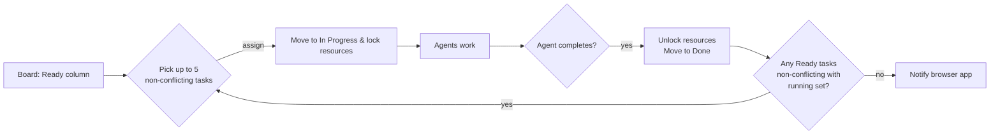

Awesome idea. Let’s design a small, idempotent TypeScript package that “asks the board,” hands out up to 5 non-conflicting tasks to 5 agents, and keeps doing that until no valid transitions remain—then fires a browser push/notification.

Below is a compact architecture, a conflict-free selection algorithm, and drop-in TS code you can paste into a new package. I’ll keep it clean, cache-y, and Kanban-tool friendly.

# High-level flow (5 parallel agents, conflict-free)



---

# How the “smart search” and conflict check works

* **Inputs**: Kanban tasks (from your repo), each with:

  * `title`, `uuid`, `status`
  * Optional metadata fields for resource hints:

    * `resources.read` (existing files the task reads)
    * `resources.write` (files it writes/creates)
    * `tags`, `links`, `planned`
* **Smart search**:

  * Use the board’s search to pull related tasks/files by title/keywords.
  * Parse referenced paths from task bodies (code fences, markdown links, `resources.*` metadata).
  * Heuristics to infer “planned” outputs (e.g., `packages/<name>/...` from task title).
  * Cache results (by task UUID + ETag-ish digest) to avoid re-searching.
* **Conflict model**:

  * Two tasks conflict if their `write` sets overlap, or if one’s `write` overlaps another’s `read`.
  * Read/read overlap is OK; write/write or write/read is not.
* **Selection**:

  * From “Ready”, greedily select up to 5 tasks with disjoint `write` sets and no write→read clashes against:

    * already-running tasks (locked resources)
    * tasks tentatively selected in the current round

---

# Project layout (TypeScript, idempotent, cached)

Create a new package:

```
packages/agent-scheduler/
  src/
    index.ts            # HTTP server for agents + browser app hooks
    scheduler.ts        # core loop: choose tasks, hand out work, update board
    board.ts            # wrappers for Promethean Kanban ops
    conflict.ts         # resource extraction + conflict checks
    cache.ts            # JSON cache keyed by task UUID + digest
    notify.ts           # server-side events + trigger for browser
    types.ts            # shared types
  package.json
  README.md
```

> Idempotency:
>
> * Deterministic selection (sort “Ready” by stable key like rank/title, then greedy).
> * Cached search/resource extraction.
> * Resource locks written atomically to a `locks/running.json` file (committed or ignored—your call).
> * Re-running the loop yields the same result until state changes (a task completes or the board updates).

---

# Minimal task metadata format (in task MD frontmatter)

```yaml
---
uuid: "c7b3-..."
title: "Implement planner indexer"
status: "Ready"
resources:
  read:
    - "packages/kanban/src/index.ts"
    - "packages/agent-scheduler/README.md"
  write:
    - "packages/agent-scheduler/src/indexer.ts"
tags: ["planner","index","cache"]
planned:
  write:
    - "packages/agent-scheduler/cache/index.json"
---
```

If `resources` are omitted, the system will infer from task body, links, code blocks, and heuristics.

---

# Code (core pieces)

## `src/types.ts`

```ts
export type UUID = string;

export interface TaskMeta {
  uuid: UUID;
  title: string;
  status: "Ready" | "In Progress" | "Done" | string;
  resources?: {
    read?: string[];
    write?: string[];
  };
  planned?: {
    write?: string[];
  };
}

export interface BoardTask extends TaskMeta {
  // Additional fields: body/content, rank, etc.
  body?: string;
}

export interface SelectionResult {
  selected: BoardTask[];
  locked: Record<string, Set<string>>; // taskUUID -> locked paths
}

export interface RunningLock {
  taskUUID: UUID;
  agentId: string;
  read: string[];
  write: string[];
  startedAt: string;
}

export interface RunningState {
  locks: RunningLock[];
}
```

## `src/cache.ts`

```ts
import { promises as fs } from "fs";
import * as path from "path";

const CACHE_DIR = path.join(process.cwd(), "packages", "agent-scheduler", ".cache");
async function ensureDir(p: string) { await fs.mkdir(p, { recursive: true }); }

export async function getCache<T>(key: string): Promise<T | null> {
  await ensureDir(CACHE_DIR);
  const f = path.join(CACHE_DIR, encodeURIComponent(key) + ".json");
  try { return JSON.parse(await fs.readFile(f, "utf-8")); } catch { return null; }
}

export async function setCache<T>(key: string, value: T): Promise<void> {
  await ensureDir(CACHE_DIR);
  const f = path.join(CACHE_DIR, encodeURIComponent(key) + ".json");
  await fs.writeFile(f, JSON.stringify(value, null, 2), "utf-8");
}
```

## `src/board.ts` (thin wrappers over your Promethean Kanban ops)

```ts
// These functions abstract calls to the Kanban endpoint.
// Implement by calling your MCP / Kanban client in-process.
// For now, they’re declared as async stubs to keep the package idempotent/testable.

import { BoardTask } from "./types";

export async function getBoardReadyTasks(): Promise<BoardTask[]> {
  // Use kanban_get_column({ column: "Ready" })
  // Then hydrate with task md frontmatter + body.
  return [];
}

export async function moveTaskToStatus(uuid: string, status: string): Promise<void> {
  // kanban_update_status({ uuid, status })
}

export async function syncBoard(): Promise<void> {
  // kanban_sync_board({})
}
```

## `src/conflict.ts`

```ts
import { BoardTask } from "./types";
import { getCache, setCache } from "./cache";
import crypto from "crypto";

type RW = { read: Set<string>; write: Set<string>; };

function normalize(p: string): string {
  return p.replace(/\\/g, "/").replace(/\/+/g, "/");
}

function inferPlanned(task: BoardTask): string[] {
  // Heuristic: if a title starts with "Create <pkg>", assume "packages/<pkg>/**"
  // You can expand this to parse the body for code fences / links.
  const m = task.title.match(/^Create\s+([a-z0-9-_]+)/i);
  return m ? [`packages/${m[1].toLowerCase()}/`] : [];
}

export async function extractResources(task: BoardTask): Promise<RW> {
  const keyBase = JSON.stringify({ uuid: task.uuid, title: task.title, status: task.status, body: task.body ?? "", meta: task.resources ?? {}, planned: task.planned ?? {} });
  const digest = crypto.createHash("sha256").update(keyBase).digest("hex");
  const cacheKey = `res-${task.uuid}-${digest}`;
  const cached = await getCache<RW>(cacheKey);
  if (cached) return { read: new Set(cached.read), write: new Set(cached.write) } as any;

  const read = new Set<string>();
  const write = new Set<string>();

  (task.resources?.read ?? []).map(normalize).forEach(p => read.add(p));
  const declaredWrite = (task.resources?.write ?? []).map(normalize);
  declaredWrite.forEach(p => write.add(p));

  // Planned outputs are treated as writes (reserved)
  const planned = (task.planned?.write ?? inferPlanned(task)).map(normalize);
  planned.forEach(p => write.add(p));

  await setCache(cacheKey, { read: Array.from(read), write: Array.from(write) } as any);
  return { read, write };
}

export function conflicts(a: RW, b: RW): boolean {
  // write/write or write/read conflicts both ways
  for (const w of a.write) if (b.write.has(w) || b.read.has(w)) return true;
  for (const w of b.write) if (a.write.has(w) || a.read.has(w)) return true;
  return false;
}
```

## `src/scheduler.ts`

```ts
import { BoardTask, RunningState, SelectionResult } from "./types";
import { extractResources, conflicts } from "./conflict";
import { promises as fs } from "fs";
import * as path from "path";
import { getBoardReadyTasks, moveTaskToStatus, syncBoard } from "./board";

const LOCKFILE = path.join(process.cwd(), "packages", "agent-scheduler", "locks", "running.json");

async function readRunning(): Promise<RunningState> {
  try { return JSON.parse(await fs.readFile(LOCKFILE, "utf-8")); }
  catch { return { locks: [] }; }
}
async function writeRunning(state: RunningState): Promise<void> {
  await fs.mkdir(path.dirname(LOCKFILE), { recursive: true });
  await fs.writeFile(LOCKFILE, JSON.stringify(state, null, 2), "utf-8");
}

export async function selectUpToNNonConflicting(n: number): Promise<SelectionResult> {
  const ready = await getBoardReadyTasks();
  // deterministic ordering: by title asc
  ready.sort((a,b) => a.title.localeCompare(b.title));

  const running = await readRunning();
  const runningRWs = new Map<string, { read: Set<string>; write: Set<string>; }>();
  for (const r of running.locks) runningRWs.set(r.taskUUID, { read: new Set(r.read), write: new Set(r.write) });

  const selected: BoardTask[] = [];
  const selectedRWs: { read: Set<string>; write: Set<string> }[] = [];

  for (const task of ready) {
    if (selected.length >= n) break;
    const rw = await extractResources(task);

    // conflict with any running?
    let bad = false;
    for (const rr of runningRWs.values()) { if (conflicts(rw, rr)) { bad = true; break; } }
    if (bad) continue;

    // conflict with already selected in this round?
    for (const srw of selectedRWs) { if (conflicts(rw, srw)) { bad = true; break; } }
    if (bad) continue;

    selected.push(task);
    selectedRWs.push(rw);
  }

  const locked: Record<string, Set<string>> = {};
  selected.forEach((t, i) => locked[t.uuid] = selectedRWs[i].write);
  return { selected, locked };
}

export async function assignTasksToAgents(agentIds: string[]): Promise<{ taskByAgent: Record<string, BoardTask | null> }> {
  const { selected } = await selectUpToNNonConflicting(agentIds.length);
  const running = await readRunning();

  const taskByAgent: Record<string, BoardTask | null> = {};
  for (let i = 0; i < agentIds.length; i++) {
    taskByAgent[agentIds[i]] = selected[i] ?? null;
  }

  // Move & lock selected
  for (const agentId of agentIds) {
    const task = taskByAgent[agentId];
    if (!task) continue;
    await moveTaskToStatus(task.uuid, "In Progress");
    const rw = await extractResources(task);
    running.locks = [
      ...running.locks.filter(l => l.taskUUID !== task.uuid),
      {
        taskUUID: task.uuid,
        agentId,
        read: Array.from(rw.read),
        write: Array.from(rw.write),
        startedAt: new Date().toISOString()
      }
    ];
  }

  await writeRunning(running);
  await syncBoard();
  return { taskByAgent };
}

export async function completeTask(taskUUID: string): Promise<void> {
  const running = await readRunning();
  running.locks = running.locks.filter(l => l.taskUUID !== taskUUID);
  await writeRunning(running);
  await moveTaskToStatus(taskUUID, "Done");
  await syncBoard();
}

export async function nextTaskForAgent(agentId: string): Promise<BoardTask | null> {
  const { selected } = await selectUpToNNonConflicting(1);
  const task = selected[0] ?? null;
  if (!task) return null;
  await moveTaskToStatus(task.uuid, "In Progress");
  const rw = await extractResources(task);

  const running = await readRunning();
  running.locks = [
    ...running.locks.filter(l => l.taskUUID !== task.uuid),
    { taskUUID: task.uuid, agentId, read: Array.from(rw.read), write: Array.from(rw.write), startedAt: new Date().toISOString() }
  ];
  await writeRunning(running);
  await syncBoard();
  return task;
}
```

## `src/notify.ts` (Server-Sent Events; browser uses Notifications API)

```ts
import { RequestListener } from "http";
import { EventEmitter } from "events";

export const bus = new EventEmitter();

export const sseHandler: RequestListener = (req, res) => {
  if (req.url !== "/events") return;
  res.writeHead(200, {
    "Content-Type": "text/event-stream",
    "Cache-Control": "no-cache",
    "Connection": "keep-alive",
  });
  const onMsg = (msg: any) => res.write(`data: ${JSON.stringify(msg)}\n\n`);
  bus.on("msg", onMsg);
  req.on("close", () => bus.off("msg", onMsg));
};

export function notify(type: string, payload: any = {}) {
  bus.emit("msg", { type, ...payload });
}
```

## `src/index.ts` (HTTP API for agents + browser)

```ts
import http from "http";
import url from "url";
import { assignTasksToAgents, completeTask, nextTaskForAgent } from "./scheduler";
import { sseHandler, notify } from "./notify";

const AGENT_LIMIT = 5;

const server = http.createServer(async (req, res) => {
  if (req.url?.startsWith("/events")) return sseHandler(req, res);

  const { pathname, query } = url.parse(req.url ?? "", true);
  try {
    if (pathname === "/assign-initial") {
      // Provide up to 5 tasks for 5 agents
      const agents = Array.from({ length: AGENT_LIMIT }, (_, i) => `agent-${i+1}`);
      const result = await assignTasksToAgents(agents);
      res.writeHead(200, { "Content-Type": "application/json" });
      res.end(JSON.stringify(result)); return;
    }

    if (pathname === "/next") {
      const agentId = (query["agentId"] as string) ?? "agent-1";
      const task = await nextTaskForAgent(agentId);
      if (!task) {
        notify("board:exhausted");
        res.writeHead(204); res.end(); return;
      }
      res.writeHead(200, { "Content-Type": "application/json" });
      res.end(JSON.stringify(task)); return;
    }

    if (pathname === "/complete") {
      const taskUUID = query["taskUUID"] as string;
      if (!taskUUID) { res.writeHead(400); res.end("taskUUID required"); return; }
      await completeTask(taskUUID);
      res.writeHead(204); res.end(); return;
    }

    res.writeHead(404); res.end("Not found");
  } catch (e: any) {
    res.writeHead(500); res.end(String(e?.message ?? e));
  }
});

server.listen(8787, () => console.log("agent-scheduler listening on :8787"));
```

---

# Tiny browser app (push-style notification via SSE + Notification API)

Create `packages/agent-scheduler/static/index.html`:

```html
<!doctype html>
<html>
<head><meta charset="utf-8"><title>Agent Scheduler</title></head>
<body>
  <h1>Agent Scheduler</h1>
  <pre id="log"></pre>
  <script>
    async function ensurePerm() {
      if (Notification.permission === "granted") return true;
      const p = await Notification.requestPermission();
      return p === "granted";
    }
    const log = (m) => (document.getElementById("log").textContent += m + "\n");
    const es = new EventSource("/events");
    es.onmessage = async (ev) => {
      const msg = JSON.parse(ev.data);
      log(`[event] ${msg.type}`);
      if (msg.type === "board:exhausted" && await ensurePerm()) {
        new Notification("Board exhausted", { body: "No further non-conflicting tasks available." });
      }
    };
  </script>
</body>
</html>
```

Serve this folder from `index.ts` if you want; or open directly with a simple static server that proxies `/events`.

---

# How agents interact

* **Initial round (max 5):** `GET /assign-initial`
  Returns a mapping of `agent-1..agent-5` → assigned task (or `null`).
* **On completion:** `GET /complete?taskUUID=<uuid>`
  Moves task to Done, unlocks resources.
* **Ask for another task:** `GET /next?agentId=agent-3`
  Either returns a new task (JSON) or `204 No Content` and triggers `board:exhausted` SSE event.

This loop continues until the board has no non-conflicting “Ready” tasks left.

---

# Notes on integration

* **Kanban ops**: Wire `board.ts` to your existing “Promethean Kanban” MCP endpoint:

  * `kanban_get_column({ column: "Ready" })`
  * `kanban_update_status({ uuid, status })`
  * `kanban_sync_board({})`
  * Optionally `kanban_search` for enrichment (cache aggressively).
* **Resource inference** can be extended:

  * Parse markdown links: `\[.+\]\(([^)]+)\)`
  * Parse code blocks for import/paths
  * Use `kanban_search` hints to expand read-set; keep write-set conservative.
* **Determinism/idempotency**: Selection is stable; locks are file-based; re-runs won’t reshuffle unless state changes.
* **Scaling**: If you later want >5 agents, just bump `AGENT_LIMIT` and the logic still ensures no conflicts.

---

# Acceptance criteria

* At most **5 concurrent** tasks in progress.
* Each assigned task’s `write` set has **no overlap** with other running tasks’ `read`/`write`.
* Agents can always `GET /next?agentId=...` to fetch the next safe task.
* When no valid non-conflicting tasks remain, the browser app **notifies** via SSE + Notifications API.

If you want, I can adapt `board.ts` right now to your repo paths (board file, tasks dir) and add a couple of resource-extractors tailored to your task format.
