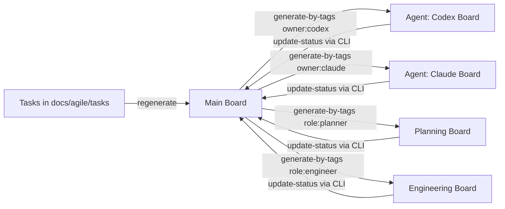

Awesome—going full Planner/Architect/Designer/Administrator/Manager mode. I pulled up the key files and the live board, and here’s a tight plan + a copy-paste Codex prompt that will (1) update WIP limits to match your expectations, (2) clean up current violations safely, and (3) spin up filtered sub-boards for agents.

---

# What I opened & what I found (quick)

* **AGENTS.md**: confirms kanban is the source of truth and shows the CLI we’ll drive (`regenerate`, `getColumn`, `update-status`, `generate-by-tags`, etc.).
* **process.md**: defines the FSM (Incoming→Accepted→Breakdown→Ready→Todo→In-Progress→Testing→Review→Document→Done) and the spirit of enforcement.
* **Current config** `promethean.kanban.json`: WIP is already bumped higher than your old limits (e.g. accepted 30, breakdown 20, ready 70, in_progress 13, review 8, document 8). We’ll align it to your stated *targets* below.
* **Board** `docs/agile/boards/generated.md`: large “icebox” and “incoming”, lots of material to triage; this is the pool we’ll fix against.

---

# Target WIP limits (aligned to your notes)

> Fibonacci-ish, multi-agent concurrency, with roomy Ready, strict In-Progress.

| column      | target |
| ----------- | -----: |
| icebox      |   9999 |
| incoming    |   9999 |
| accepted    | **21** |
| breakdown   | **13** |
| blocked     |      3 |
| ready       | **55** |
| todo        | **25** |
| in_progress | **13** |
| testing     |      8 |
| review      |      8 |
| document    |      8 |
| done        |    500 |
| rejected    |     20 |

These match the expectations you described: Accepted (21), Breakdown (13), a roomy Ready (55), and In-Progress (13) with the review/document bands at 8.

---

# Policy for continuing violations (after the change)

* **Breakdown > 13**
  Defer/merge duplicates to **accepted** or **icebox**; keep only well-scoped ≤5-point slices. Highest priority (P0/P1) stay; P2/P3 go up or out.
* **Ready > 55**
  Pull top priority into **todo**. Anything under-specified or missing estimates goes **back to breakdown**.
* **Todo > 25**
  Enforce pull-based flow: return lowest-priority items to **ready** until within limit.
* **General**
  All movements via `update-status` so the FSM + WIP rules are honored. No manual edits to the board file.

---

# Filtered sub-boards (views) for agents & roles

The CLI already supports this via `generate-by-tags`. Let’s adopt a simple label scheme and spawn views:

* **Label scheme**: `owner:codex`, `owner:claude`, `owner:xai`, `role:planner|engineer|designer|manager|admin`, domains like `kanban`, `docops`, `infra`.
* **Example views** (saved under `docs/agile/boards/views/`):

  * `agent-codex.md` → tags: `owner:codex`
  * `agent-claude.md` → tags: `owner:claude`
  * `planning.md` → tags: `role:planner`
  * `engineering.md` → tags: `role:engineer`
  * `docops.md` → tags: `docops`
  * `priority-hotlist.md` → tags: `P0,P1` (if you also label tasks with priority tags)

> Sub-agents work **only** in their filtered view; the main board remains the system of record.

---

# Mermaid (how views hang off the source board)



---

# Copy-paste prompt for Codex

> Paste this to Codex as is. It’s idempotent, pull-based, and uses only the kanban CLI and config.

```
You are operating as a process-safe Planner/Administrator for our Promethean kanban.

GOAL
1) Align WIP limits in promethan.kanban.json to our targets.
2) Regenerate the board and fix any continuing WIP violations safely.
3) Create filtered sub-boards (views) by tags for agents/roles.

CONSTRAINTS
- Never edit the generated board file directly.
- Only use the kanban CLI and config.
- Enforce FSM transitions and WIP; use `update-status` for moves.
- Make small, reversible changes; log each change you make as a short bullet.

WIP TARGETS
{
  "accepted": 21,
  "breakdown": 13,
  "blocked": 3,
  "ready": 55,
  "todo": 25,
  "in_progress": 13,
  "testing": 8,
  "review": 8,
  "document": 8,
  "done": 500,
  "rejected": 20,
  "icebox": 9999,
  "incoming": 9999
}

PLAN (execute step-by-step)

Step 0 — Sanity
- Run: `pnpm kanban audit --verbose`
- Run: `pnpm kanban count`
- If config path resolution fails, add `--kanban docs/agile/boards/generated.md --tasks docs/agile/tasks` to commands.

Step 1 — Update WIP limits
- Open `promethean.kanban.json`.
- Update only the `wipLimits` object to the WIP TARGETS above.
- Preserve all other config fields and comments.
- Save.

Step 2 — Regenerate & Validate
- Run: `pnpm kanban regenerate`
- Run: `pnpm kanban count`
- Run: `pnpm kanban enforce-wip-limits` (report mode)

Step 3 — Resolve Violations (ordered, safe, idempotent)
A) BREAKDOWN > 13:
   - Get JSON: `pnpm kanban getColumn breakdown`
   - Sort by priority P3→P0 and move lowest priority extras back to `accepted` until count <= 13:
     For each extra uuid: `pnpm kanban update-status <uuid> accepted`
   - If you encounter obviously duplicate or abandoned tasks, move to `icebox`.

B) READY > 55:
   - Get JSON: `pnpm kanban getColumn ready`
   - Identify under-specified work (e.g., missing estimates or obvious “needs-breakdown” labels) and move back to `breakdown` until count <= 55:
     `pnpm kanban update-status <uuid> breakdown`
   - Pull a small number of highest-priority items to `todo` if `todo` is under 25:
     `pnpm kanban update-status <uuid> todo`

C) TODO > 25:
   - Get JSON: `pnpm kanban getColumn todo`
   - Move lowest priority items back to `ready` until count <= 25:
     `pnpm kanban update-status <uuid> ready`

D) Re-run checks:
   - `pnpm kanban enforce-wip-limits`
   - If still over, repeat the same order with smaller batches (no more than 5 tasks moved per pass).

Step 4 — Create Filtered Views (boards from filters)
- Adopt labels on tasks to support views: `owner:<agent>`, `role:<planner|engineer|designer|manager|admin>`, and domain tags like `docops`, `kanban`, `infra`.
- For each view below, generate a board file under `docs/agile/boards/views/`:

  # Codex
  `pnpm kanban generate-by-tags "owner:codex" --kanban docs/agile/boards/views/agent-codex.md`

  # Claude
  `pnpm kanban generate-by-tags "owner:claude" --kanban docs/agile/boards/views/agent-claude.md`

  # Planning
  `pnpm kanban generate-by-tags "role:planner" --kanban docs/agile/boards/views/planning.md`

  # Engineering
  `pnpm kanban generate-by-tags "role:engineer" --kanban docs/agile/boards/views/engineering.md`

  # DocOps
  `pnpm kanban generate-by-tags "docops" --kanban docs/agile/boards/views/docops.md`

- If a view command fails due to missing tags, create a light pass to add the label(s) to the top 50 matching tasks using `pnpm kanban update`.

Step 5 — Closeout
- Run: `pnpm kanban regenerate`
- Run: `pnpm kanban count`
- Summarize what changed:
  - WIP limits updated (list).
  - # tasks moved per column and why (bullets).
  - Views created (list of files).
- Commit message: "chore(kanban): align WIP limits, resolve violations, create agent/role filtered boards"
```

---

# Notes & next steps

* If you want **owners to be first-class**, we can add `owner` to `requiredFields` later, but I’d start with labels to avoid breaking older tasks.
* The CLI already has `enforce-wip-limits`, `getColumn`, and `generate-by-tags`, so we don’t need to invent new tooling.
* Once Codex runs the prompt, we can review the resulting `views/` boards and assign sub-agents to them immediately.

If you want, I can also draft a tiny patch to `promethean.kanban.json` with just the WIP changes—but since you asked for a Codex prompt, the script above keeps Codex in the loop and uses the same commands your other agents understand.
