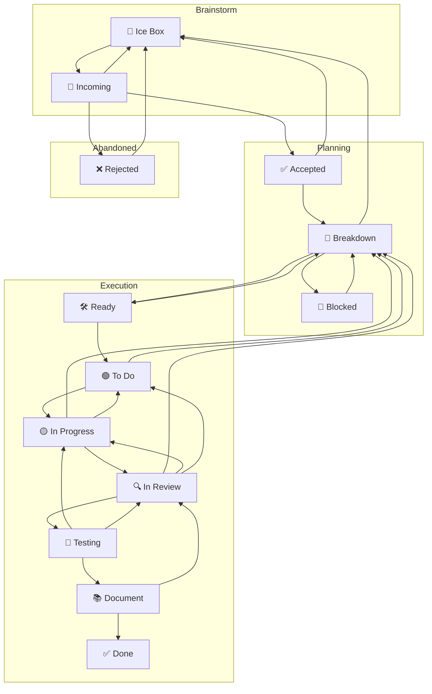

I'm using the obsidian kanban plugin amoung others.
Here is my current process doc, though the process
is subject to change.

```md
# Overview

```
1. **Intake & Associate**
```

Find or create the task; never work off-board; do not edit the board file directly—tasks drive the board. &#x20;

```
2. **Clarify & Scope**
```

Anchor on the kanban card as the single source of truth and, before advancing, do the solo pass:

- Confirm the desired outcomes so the card reflects the slice you intend to deliver.
- Capture acceptance criteria or explicit exit signals on the task so "done" is unambiguous.
- Note any uncertainties, risks, or open questions directly on the task to surface follow-ups early.
- Record the scoped plan and supporting notes on the linked task before moving to step 3.

```
3. **Breakdown & Estimate**
```

Break into small, testable slices; estimate **complexity, scale, time (in cloud sessions)** and assign a Fibonacci score from **1, 2, 3, 5, 8, 13** on the task card. Scores of **13+ ⇒ must split**; **8 ⇒ continue refinement before implementation**; **≤5 ⇒ eligible to implement**. Any score **>5** must cycle back through clarification/breakdown until the slice is small enough to implement, capturing the updated score on the task card.&#x20;

4. **Ready Gate** _(hard stop before code)_
   Only proceed if:

   - A matching task is **In Progress** (or you move it there), and WIP rules aren’t violated.&#x20;
   - The slice is scored **≤5** and fits the session after planning; otherwise continue refinement/splitting.&#x20;

```
5. **Implement Slice**
```

Do the smallest cohesive change that can clear gates defined in agent docs (e.g., no new ESLint errors; touched packages build; tests pass).&#x20;
When the scope is larger than the available session, carve off a reviewable subset and explicitly document what remains (e.g.,
inventory lingering files, capture blockers, link references).&#x20;

```
6. **Review → Test → Document**
```

Move through _In Review_, _Testing_ and _Document_ then _Done_ per board flow, recording evidence and summaries.&#x20;

# Kanban as a Finite State Machine (FSM)

We treat the board as an FSM over tasks.

- **States (C)**: the board’s columns.
- **Initial state (S)**: **Incoming** (new tasks land here).
- **Transitions (T)**: moves between columns.
- **Rules R(Tₙ, t)**: predicates over task `t` that permit or block transition `Tₙ`.
- **Single source of status**: each task has exactly one column/status at a time.
- **Board is law**: never edit the board file directly; tasks drive board generation.
- **WIP**: a transition fails if the target state’s WIP cap is full.

### FSM diagram



### Minimal transition rules (only what matters)

- START STATE = Incoming

  - All new tasks start as incoming

- **Incoming → Accepted | Rejected | Ice Box**
  Relevance/priority triage; allow defer to Ice Box.

- **Accepted → Breakdown | Ice Box**
  Ready to analyze, or consciously deferred.

- **Breakdown → Ready | Rejected | Ice Box | Blocked**
  Scoped & feasible → Ready; non-viable → Rejected; defer → Ice Box;
  **→ Blocked** only for a true inter-task dependency with **bidirectional links** (Blocking ⇄ Blocked By).

- **Ready → Todo**
  Prioritized into the execution queue (respect WIP).

- **Todo → In Progress**
  Pulled by a worker (respect WIP).

- **In Progress → In Review**
  Coherent, reviewable change exists.

- **In Review → Testing**
  Review approved; proceed to testing phase.

- **Testing → Document**
  Testing complete; proceed to documentation.

- **In Progress → Todo** _session-end handoff; no PR required_
  Time/compute limit reached without a reviewable change. Record artifacts/notes + next step; move to **Todo** if WIP allows; else remain **In Progress** and mark a minor blocker.
  Artifacts must include partial outputs (e.g., audit logs, findings lists, reproduction steps) so a follow-on slice can resume immediately.

- **In Progress → Breakdown**
  Slice needs re-plan or is wrong shape.

- **In Review → In Progress** _(preferred)_
  Changes requested; current assignee free; **In Progress** WIP allows.

- **In Review → Todo** _(fallback)_
  Changes requested; assignee busy **or** **In Progress** WIP full.

- **Testing → In Review**
  Testing failed or needs review adjustments; return to review phase.

- **Document → Done | In Review**
  Docs/evidence complete → Done; otherwise → In Review for another pass.

- **Done → (no mandatory back edge)**
  Follow-ups are modeled as new tasks (optionally seeded from Done).

- **Blocked → Breakdown** _(unblock event)_
  Fires when any linked blocker advances e.g., to In Review/Done or evidence shows dependency removed; return to Breakdown to re-plan.

### Blocking policy

- **Minor blockers**: record briefly on the task; continue with other eligible work; resolve asynchronously.
  - Uncertainty over a single aspect of an assignment which does not prevent completion of other aspects of the assignment
- **Major blockers**: halt work on that task; capture evidence + attempt remediation
  - A triggered transition rule would result in a column begin over it's WIP limit
  - An agent's current task has only blocked sub tasks

## 🌊 Fluid Kanban Rule Evolution

Kanban is a fluid process that adapts to changing development environments while maintaining core principles.

### When Rules Must Change

A rule should be changed when:

1. **Progress is blocked** despite valid work being ready
2. **Team composition changes** significantly (new contributors, new agent types)
3. **Process discovery** reveals better ways of working
4. **Scaling requirements** exceed current capacity constraints

### Rule Change Process

1. **Identify the constraint**: Which specific rule is preventing forward progress?
2. **Document the rationale**: Why must this rule change now? What's the impact?
3. **Propose a new rule**: Clear, measurable, and time-bound
4. **Implement temporarily**: Test the change with explicit review date
5. **Evaluate and formalize**: Either revert, adjust, or make permanent

### WIP Limit Evolution Example

**Original Rule**: 2 tasks in review per human developer
**Reality**: 1 human + 6-18 AI agents contributing simultaneously
**Constraint**: Review bottleneck blocking all flow
**Solution**:

- Review: 2 → 6 (human review bandwidth for AI work)
- In Progress: 3 → 10 (multi-agent parallel work capacity)
- Document: 2 → 4 (maintain flow proportion)

### Guiding Principles

- **Rules enable flow, they don't dictate activity**
- **Change is temporary unless proven valuable**
- **Document every change with clear rationale**
- **Review changes regularly** (monthly for significant rule changes)
- **Maintain the spirit** of the rule even when adapting the letter
```

The agent has access to a kanban tool it can access via `pnpm kanba subcommand ...` 

it's current help text looks like this:
```
err:~/devel/promethean$ pnpm kanban

> promethean@ kanban /home/err/devel/promethean
> node packages/kanban/dist/cli.js

Usage: kanban [--kanban path] [--tasks path] <subcommand> [args...]
Subcommands: count, getColumn, getByColumn, find, find-by-title, update_status, update-status, move_up, move_down, pull, push, sync, regenerate, generate-by-tags, indexForSearch, search, ui, dev, process, show-process, show-transitions, compare-tasks, breakdown-task, prioritize-tasks, list, audit, enforce-wip-limits, create, update, delete, create-epic, add-task, remove-task, list-epics, epic-status, process_sync, doccheck

Core Operations:
  push     - Push board state to task files (board → files)
  pull     - Pull task file state to board (files → board)
  sync     - Bidirectional sync with conflict detection
  regenerate - Regenerate board from task files

Task Management:
  create   - Create new task
  update   - Update existing task
  delete   - Delete task
  list     - List tasks with status

Search & Navigation:
  find     - Find task by UUID
  search   - Search tasks by content
  count    - Count tasks in columns

Advanced:
  audit    - Audit board consistency
  ui       - Start web UI
  dev      - Start development server
```

## Session Bootstraping

At the beginning of every session it should run:

- `pnpm kanban show-process`
- `pnpm kanban show-transitions`
- `pnpm kanban audit`
- `pnpm kanban enforce-wip-limits`
- `pnpm kanban list`

It should then give me an over view of the board state highlighting, wip limits,  process violations,
and high priority tasks in each column.

## Runtime

### Column Review

After bootstrapping it should then proceed to, in the order
it recieves from `pnpm kanban show-transitions, call

`pnpm kanban getColumn <status>`

and for each task in that column, from top to bottom, it should run:
`pnpm kanban getByColumn <task-uuid>`

Then it should tell me what the cards are by name and by UUID,
uggest some actions to take for each card (from the kanban help)

### Task update

After we have agreed on the actions to be taken on the columns,
it will proceed to take those actions on the cards in this column.

It'll then provide a brief summary of the actions taken and suggest to review the next column from the transitions list.

## Repeat

We continue to walk the board like this until we have reached the final transition


The agent should leverage the Obsidian DataView plugin, which allows querying, filtering, and presenting note data as tables, lists, kanban lanes, and dynamic dashboards using your Markdown metadata and inline fields. By utilizing DataView’s API or embedding dataview queries directly into cards, the agent can summarize task status, surface blockers, group cards by field, and visually highlight WIP or process violations based on up-to-date vault data.[1][2][3][4][5]

Furthermore, the agent can use Obsidian’s web fetch and git grep tools to automatically discover documentation and usage instructions for other plugins in your vault. By searching for relevant docs or readme files about plugins like Dataview, Kanban, Surfing, or integrations, the agent can suggest optimal query formats, display enhancements, or actionable snippets to improve how it presents insights inside cards and summaries.[3][6][7]

This empowers the agent not just to traverse and update boards, but to synthesize richer in-card overviews and references using the best capabilities Obsidian’s plugin ecosystem provides, based on continually harvested local and remote documentation.[7][1][3]

[1](https://blacksmithgu.github.io/obsidian-dataview/)
[2](https://forum.obsidian.md/t/kanban-plugin-and-dataview/36660)
[3](https://github.com/mgmeyers/obsidian-kanban/issues/345)
[4](https://www.reddit.com/r/ObsidianMD/comments/10zfvxg/how_to_use_dataview_with_kanban/)
[5](https://blacksmithgu.github.io/obsidian-dataview/friends/)
[6](https://github.com/mgmeyers/obsidian-kanban/issues/85)
[7](https://github.com/PKM-er/Obsidian-Surfing)
[8](https://publish.obsidian.md/tasks/Other+Plugins/Dataview)
[9](https://www.reddit.com/r/ObsidianMD/comments/z6kf0p/can_you_guys_please_explain_what_data_view_can_do/)
[10](https://forum.obsidian.md/t/getting-dataview-plugin-to-analyze-text-and-auto-backlink/27629)
[11](https://forum.obsidian.md/t/data-analysis/36075)
[12](https://www.reddit.com/r/ObsidianMD/comments/18dt1ok/obsidian_git_tips_on_how_to_use_it_for_reliable/)
[13](https://github.com/blacksmithgu/obsidian-dataview)
[14](https://forum.obsidian.md/t/the-easiest-way-to-setup-obsidian-git-to-backup-notes/51429)
[15](https://www.reddit.com/r/ObsidianMD/comments/skjcix/dataview/)
[16](https://www.youtube.com/watch?v=rGFb6j9KDh4)
[17](https://obsidian.md/plugins)
[18](https://www.stephanmiller.com/how-to-install-obsidian-plugins/)
[19](https://www.youtube.com/watch?v=qqsNNTkhK5Y)
[20](https://thesweetsetup.com/my-obsidian-based-kanban-writing-workflow/)


The agent should leverage the Obsidian DataView plugin, which allows querying, filtering, and presenting note data as tables, lists, kanban lanes, and dynamic dashboards using your Markdown metadata and inline fields. By utilizing DataView’s API or embedding dataview queries directly into cards, the agent can summarize task status, surface blockers, group cards by field, and visually highlight WIP or process violations based on up-to-date vault data.[1][2][3][4][5]

Furthermore, the agent can use Obsidian’s web fetch and git grep tools to automatically discover documentation and usage instructions for other plugins in your vault. By searching for relevant docs or readme files about plugins like Dataview, Kanban, Surfing, or integrations, the agent can suggest optimal query formats, display enhancements, or actionable snippets to improve how it presents insights inside cards and summaries.[3][6][7]

This empowers the agent not just to traverse and update boards, but to synthesize richer in-card overviews and references using the best capabilities Obsidian’s plugin ecosystem provides, based on continually harvested local and remote documentation.[7][1][3]

[1](https://blacksmithgu.github.io/obsidian-dataview/)
[2](https://forum.obsidian.md/t/kanban-plugin-and-dataview/36660)
[3](https://github.com/mgmeyers/obsidian-kanban/issues/345)
[4](https://www.reddit.com/r/ObsidianMD/comments/10zfvxg/how_to_use_dataview_with_kanban/)
[5](https://blacksmithgu.github.io/obsidian-dataview/friends/)
[6](https://github.com/mgmeyers/obsidian-kanban/issues/85)
[7](https://github.com/PKM-er/Obsidian-Surfing)
[8](https://publish.obsidian.md/tasks/Other+Plugins/Dataview)
[9](https://www.reddit.com/r/ObsidianMD/comments/z6kf0p/can_you_guys_please_explain_what_data_view_can_do/)
[10](https://forum.obsidian.md/t/getting-dataview-plugin-to-analyze-text-and-auto-backlink/27629)
[11](https://forum.obsidian.md/t/data-analysis/36075)
[12](https://www.reddit.com/r/ObsidianMD/comments/18dt1ok/obsidian_git_tips_on_how_to_use_it_for_reliable/)
[13](https://github.com/blacksmithgu/obsidian-dataview)
[14](https://forum.obsidian.md/t/the-easiest-way-to-setup-obsidian-git-to-backup-notes/51429)
[15](https://www.reddit.com/r/ObsidianMD/comments/skjcix/dataview/)
[16](https://www.youtube.com/watch?v=rGFb6j9KDh4)
[17](https://obsidian.md/plugins)
[18](https://www.stephanmiller.com/how-to-install-obsidian-plugins/)
[19](https://www.youtube.com/watch?v=qqsNNTkhK5Y)
[20](https://thesweetsetup.com/my-obsidian-based-kanban-writing-workflow/)
