# Agent Registry Dependency Diagrams

**Task ID**: 8f9255ce-52e7-4b2d-98cb-e0077eb06b63  
**Component**: Dependency Mapping and Visualization  
**Date**: 2025-10-16

## System Architecture Overview

```mermaid
graph TB
    subgraph "Agent Definition Layer"
        AD[Agent Definitions<br/>.claude/agents/]
        AN[Agent Navigation<br/>AGENTS.md]
    end

    subgraph "Configuration Layer"
        MC[MCP Config<br/>promethean.mcp.json]
        PR[Provider Registry<br/>providers.yml]
    end

    subgraph "Core Registry Layer"
        TR[Tool Registry<br/>registry.ts]
        AUTH[Authorization<br/>authorization.ts]
        TYPES[Type Definitions<br/>types.ts]
    end

    subgraph "External Dependencies"
        SDK[MCP SDK]
        ZOD[Zod Validation]
        UTILS[@promethean/utils]
        ENV[Environment Variables]
    end

    AD --> MC
    AN --> AD
    MC --> TR
    PR --> TR
    TR --> AUTH
    TR --> TYPES
    AUTH --> TYPES
    TR --> SDK
    PR --> ZOD
    PR --> UTILS
    PR --> ENV
    AUTH --> ENV
```

## Data Flow Analysis

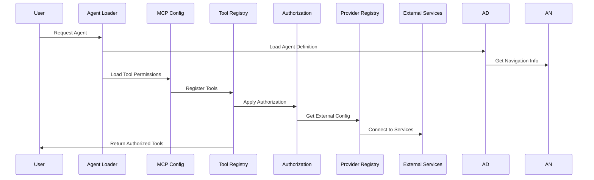

## Critical Dependency Paths

### Path 1: Agent to Tool Registration

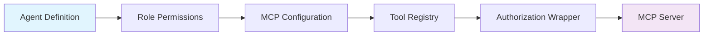

### Path 2: Provider Configuration

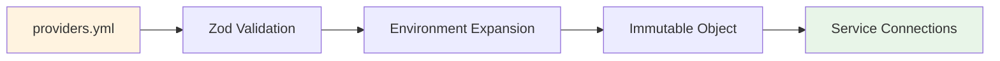

### Path 3: Authorization Flow

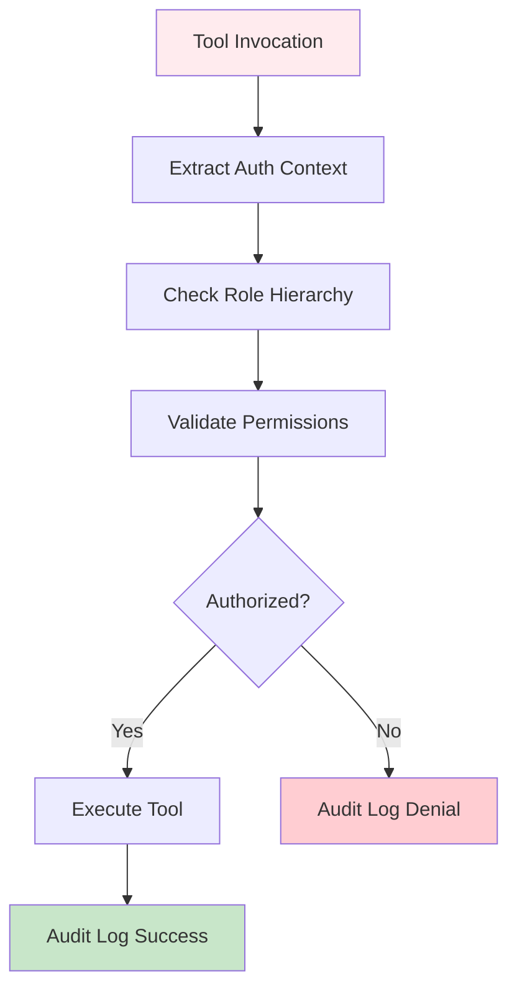

## Failure Point Analysis

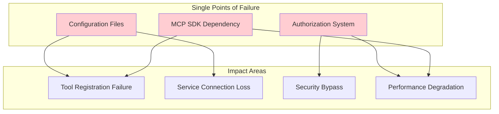

## Performance Bottleneck Visualization

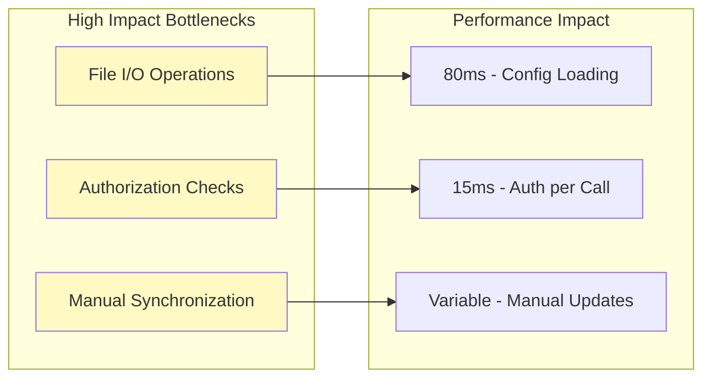

## Security Architecture

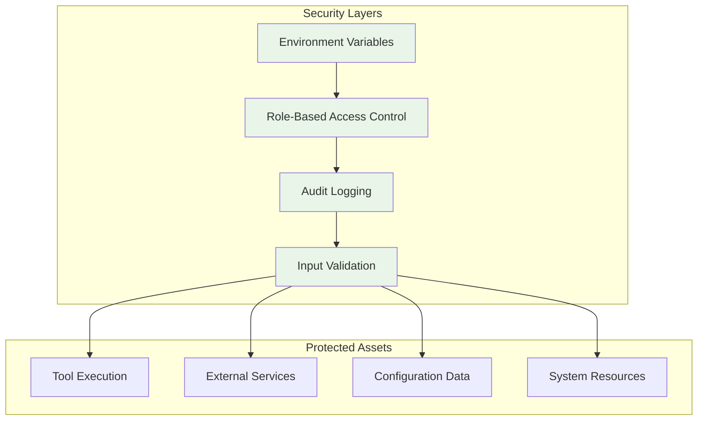

## Recommended Architecture Improvements

### Improved Configuration Management

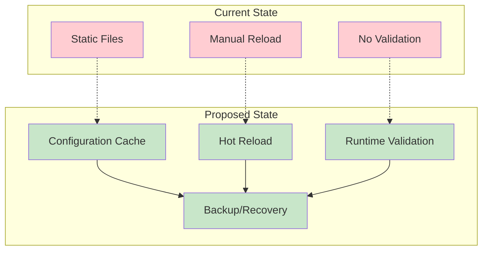

### Decoupled Registry Architecture

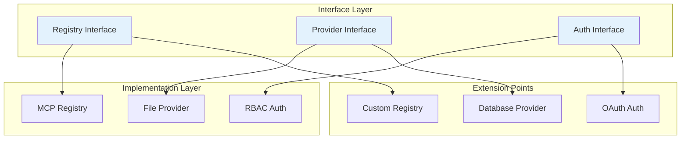

## Implementation Priority Matrix

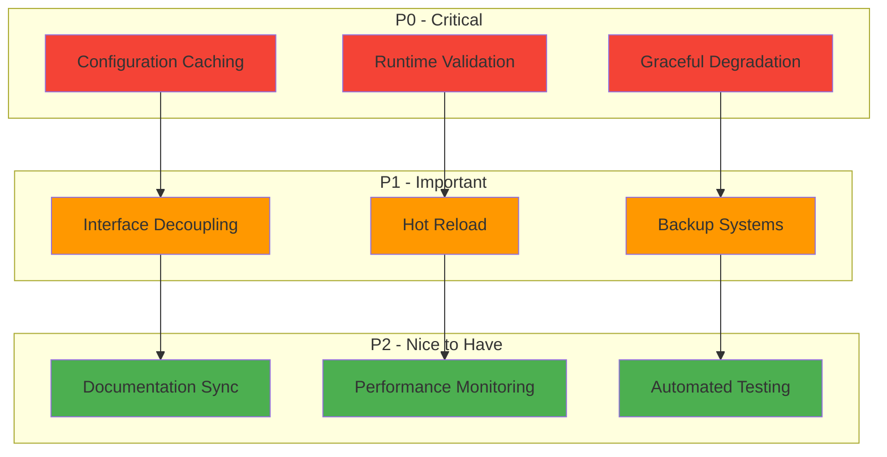

## Migration Risk Assessment

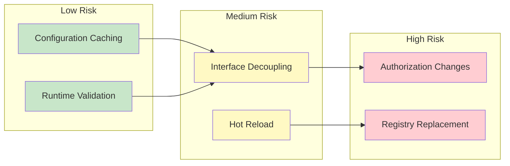

## Conclusion

These dependency diagrams illustrate the current Agent Registry architecture's key characteristics:

1. **Linear Dependencies**: Most components follow a clear dependency hierarchy
2. **Centralized Configuration**: Multiple systems depend on file-based configurations
3. **Security-First Design**: Authorization layer touches all critical paths
4. **Performance Bottlenecks**: File I/O and authorization checks are primary constraints

The recommended improvements focus on adding redundancy, caching, and flexibility while maintaining the existing security model and type safety guarantees.
