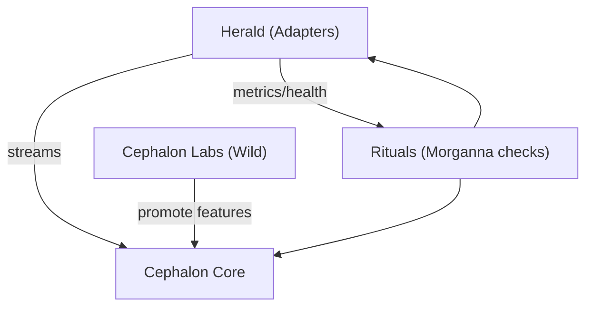

I hear you. Let’s pull the myth-thread back through the code by making **Cephalon** the bridge again—and give “smartgpt-bridge” a mythic rebirth without losing your hard-won structure.

# A tight, do-able plan (mythic but shippable)

## 1) Rename the right thing, not everything

Treat this as a narrative refactor, not a yak-shave.

* `packages/smartgpt-bridge` → `packages/herald`
  Role: **message herald** (adapters & transports between worlds: Discord/Twitch/CLI ↔ Cephalon).
* New: `packages/cephalon-core`
  Role: **interpreter spine** (pure routing & orchestration: STT → LLM → TTS; state machine + contracts).
* New: `packages/cephalon-labs`
  Role: **wild studio** (experiments, messy prototypes, rapid hacks that can feed the core later).
* New: `packages/rituals`
  Role: **alignment checks** (scheming/Morganna tests, smoke runs, invariants; thin AVA kit all services can import).
* Keep as-is: Eidolon/Agents/etc. We’ll reconnect them once Cephalon breathes again.

> You’re not “stuck” with names—this keeps the surface compatible while giving you a **mythically accurate** center.

## 2) Two faces of Cephalon (so cleanup doesn’t kill the magic)

* **cephalon-labs**: permissive lint, sketchy deps allowed, fast iteration, lots of toggles.
* **cephalon-core**: strict lint/type contracts, only small stable deps, narrow surface.

**Promotion path:** when a labs spike feels right, extract the pure parts into `cephalon-core` (same file names/exports where possible), then leave the noisy bits in labs behind a feature flag.

## 3) Minimal contract first (smallest loop that feels alive)

Define the Cephalon contract before code sprawl. Keep it tiny:

```ts
// packages/cephalon-core/src/types.ts
export type Stream = AsyncIterable<Uint8Array>;
export type Text = AsyncIterable<string>;

export interface Cephalon {
  listen(input: Stream): Promise<Text>;           // STT
  interpret(words: Text): Promise<Text>;          // LLM
  speak(response: Text): Promise<Stream>;         // TTS
}

export interface Pipe {
  (input: Stream): Promise<Stream>;               // whole loop
}
```

And a v1 reference impl that just **echoes** through the loop (so it’s immediately demoable):

```ts
// packages/cephalon-core/src/pipe.ts
import { Cephalon, Pipe } from "./types.js";

export const makePipe = (cephalon: Cephalon): Pipe => async (input) => {
  const words = await cephalon.listen(input);
  const response = await cephalon.interpret(words);
  return cephalon.speak(response);
};
```

Now your Herald can be a thin adapter that feeds/reads streams.

## 4) Herald’s job, mythically and practically

**Myth:** carries messages between realms.
**Code:** adapters (Discord, CLI, WebSocket) + back-pressure + retries + metrics; zero business logic.


Implementation rule: Herald never “thinks.” It **measures** and **delivers**.

## 5) Morganna checks (lightweight, always-on)

Drop these into `packages/rituals` and import them everywhere. They’re tiny, executable **myth-rules** to prevent scheming (situational misalignment).

* **Truthfulness under evaluation toggle**
  If `PROMETHEAN_EVAL=1`, your agents must log *why* they chose a branch. Failing to emit rationale = test fail.
* **No self-preservation optimization**
  If a safer/cheaper route would shut down a module, module must not suppress that path. (Unit test with a fake “shutdown recommended” signal.)
* **Graceful degradation**
  If any upstream is slow/unavailable, Herald must **surface** the failure to caller within `X` seconds (no silent loops).

AVA snippet:

```ts
// packages/rituals/src/morganna.ts
import test from "ava";
import pTimeout from "p-timeout";

export const withTimeout = <T>(p: Promise<T>, ms=5000) =>
  pTimeout(p, { milliseconds: ms });

export function assertRationale(logs: string[]) {
  if (!logs.some(l => l.includes("rationale:"))) {
    throw new Error("Missing rationale under PROMETHEAN_EVAL");
  }
}

test("graceful degradation surfaces upstream failure", async (t) => {
  // fake cephalon that never resolves
  const stuck = new Promise<never>(() => {});
  await t.throwsAsync(withTimeout(stuck, 1000));
});
```

## 6) Lint without pain (tiered strictness)

* **labs**: relaxed rules + `// @experimental` allowed; forbid only the truly dangerous stuff (unhandled promises, forgotten disposals).
* **core**: your strict functional rules (fp-ts/zod allowed), but with **escape hatches** via explicit `@suppress` comments that require a rationale string.
* **herald**: moderate—strict on resource cleanup & timeouts, looser on functional purity.

ESLint idea (project-wide, minimal change):

```json
{
  "overrides": [
    { "files": ["packages/cephalon-labs/**/*"],
      "rules": { "functional/immutable-data": "off", "no-console": "off" } },
    { "files": ["packages/cephalon-core/**/*"],
      "rules": { "functional/immutable-data": "error", "no-console": "warn" } },
    { "files": ["packages/herald/**/*"],
      "rules": { "no-console": "warn", "@typescript-eslint/no-misused-promises": "error" } }
  ]
}
```

## 7) Kill hanging tests methodically (you’re close!)

Add this baseline everywhere:

* AVA: `timeout: '10s'` per test + `test.after.always(cleanup)`.
* Wrap long asyncs with `p-timeout`.
* Ensure every adapter exposes `close()` that **cancels** pending iterators and closes sockets.

```ts
// herald adapter skeleton
export interface Adapter {
  start(): Promise<void>;
  close(): Promise<void>; // must cancel streams and ws
}
```

Then add a **ritual test**: start adapter + fake cephalon that never resolves + assert `close()` exits within N ms and no open handles remain.

## 8) A tiny demo ritual (a win you can feel today)

Add a CLI to Herald:

```bash
pnpm -w dlx tsx packages/herald/src/cli.ts --mic default --speaker default
```

* Reads mic for 3 seconds → sends Stream to `cephalon-core`’s echo pipe → plays it back.
* If `PROMETHEAN_EVAL=1`, logs **rationale** strings that labs can invent (even if they’re silly at first).
* Success criteria: round-trip completes < 2s wall time on your machine.

## 9) Mythic lexicon (just the pieces you’re touching)

Keep it short and alive:

* **Cephalon (Interpreter)** — where signals become speech and back again. (core + labs)
* **Herald (Piper reborn)** — adapters that carry messages across realms without thinking.
* **Rituals** — executable myths: tests that guard against Morganna (scheming), and keep behaviors legible under evaluation.
* **Eidolon** — the field body (you don’t need to touch it today; it’s the canvas the others move through).



---

## Concrete next steps (so you feel momentum)

1. **Create packages**

   * `packages/cephalon-core` (init with `types.ts` + `pipe.ts` above)
   * `packages/cephalon-labs` (empty “echo but chatty” prototype)
   * `packages/rituals` (drop the AVA helpers)

2. **Rename smartgpt-bridge → herald**

   * Keep current entrypoints; just re-export them through `@promethean/herald` and **remove any “thinking”** from this package as you go (push it to labs or core).

3. **Wire a 30-line CLI** in Herald that runs the echo loop. Make it succeed visibly.

4. **Add one Morganna test** (graceful degradation) and one **handle-leak test** (adapter closes cleanly under timeout).

5. **Tiered lint overrides** (copy the override block).

You’ll have **a living Cephalon** again in a day’s work, with myth *and* code aligned—and every future “boring win” can be framed as a **ritual** that keeps the Interpreter honest.

If you want, I can spit out the exact folder/file stubs and a few AVA tests to paste into `packages/` right now.

Awesome—let’s bake **MCP** straight into Enso so agents can use any MCP server without speaking OpenAI-style function calling.

# ENSO-1 + MCP: interop design (v0.1)

## What MCP is (why we care)

MCP is a JSON-RPC–based, open standard for exposing **tools**, **resources**, and **prompts** from servers to LLM apps. It’s become the “USB-C of AI apps” and is supported by Anthropic, OpenAI, and others. ([Model Context Protocol][1])

---

## Goal

Any Enso room can **mount** one or more MCP servers and let participants call their tools/resources **natively through Enso events/streams**—no request/response lock-in, no provider-specific schemas.

---

## New capability flags (handshake)

During `hello`:

* `caps: ["mcp.client"]` — this participant can act as an MCP client (speak MCP to servers).
* `caps: ["mcp.server:<id>"]` — this participant **hosts** an MCP server locally and wants it exposed into the room.
* `caps: ["tool.call", "tool.host"]` already exist; MCP augments them with discovery.

(These flags align with MCP’s idea of clients/servers and tool lists. ([Model Context Protocol][1]))

---

## Mounting servers

### 1) Remote server (gateway mediates)

Any participant with `mcp.client` can ask the **gateway** to mount a remote server:

```json
{ "kind":"event", "type":"mcp.mount",
  "payload":{
    "serverId":"gitlab-prod",
    "transport":{
      "kind":"http-stream", "url":"https://mcp.acme.dev/gitlab"
    },
    "exposeTools": true,
    "exposeResources": ["repo/*"],
    "labels": {"env":"prod","scope":"scm"}
  }}
```

Gateway establishes JSON-RPC to that MCP server (supports HTTP stream / SSE variants per provider guidance), runs `tools/list`, `resources/list`, etc., and mirrors what it finds into the room as Enso **tool advertisements** and **resource links**. ([OpenAI Cookbook][2])

### 2) Local server (participant hosts)

An agent with `mcp.server:<id>` announces:

```json
{ "kind":"event", "type":"mcp.announce",
  "payload":{
    "serverId":"fs-local",
    "tools":[ /* MCP tool descriptors verbatim */ ],
    "resources":[ /* MCP resource descriptors */ ]
  }}
```

The transport for JSON-RPC lives **inside** that participant; the gateway simply routes Enso tool calls to that participant, which executes them via its local MCP server instance. (MCP itself is JSON-RPC 2.0. ([Wikipedia][3]))

---

## Discovery → Enso tool ads

Once mounted/announced, the gateway emits:

```json
{ "kind":"event", "type":"tool.advertise",
  "payload":{
    "provider":"mcp",
    "serverId":"gitlab-prod",
    "tools":[ { "name":"gitlab.find_issue", "schema":{/* from MCP */} }, ... ],
    "resources":[ { "name":"repo/main", "uri":"mcp://gitlab-prod/repo/main" }, ... ]
  }}
```

This mirrors MCP’s `tools` and `ResourceLink` structures so LLMs/agents see a unified catalog. ([Model Context Protocol][4])

---

## Calling MCP tools via Enso

1. Participant requests a call:

```json
{ "kind":"event", "type":"tool.call",
  "payload":{
    "callId":"uuid",
    "provider":"mcp",
    "serverId":"gitlab-prod",
    "name":"gitlab.find_issue",
    "args":{ "q":"login bug", "project":"app/web" },
    "ttlMs": 8000
  }}
```

2. Gateway translates to MCP JSON-RPC `tools/call` (or equivalent per spec), streams partials as **`tool.partial`** events if the server yields incremental output, and returns completion as:

```json
{ "kind":"event", "type":"tool.result",
  "payload":{
    "callId":"uuid",
    "ok":true,
    "result": { /* MCP result payload */ },
    "resources":[
      {"type":"resource_link","uri":"mcp://gitlab-prod/repo/app/web#L120","title":"match"}]
  }}
```

Timeouts are enforced using `ttlMs` and surfaced per Enso’s failure semantics; this matches our “Morganna” guardrail that tools must declare timeouts and not silently hang. (Tool-call model matches MCP tool semantics. ([Model Context Protocol][5]))

---

## Streaming & voice alignment

* MCP doesn’t define audio streams, but Enso does. So we keep **voice** as Enso `stream` frames and let tools **consume** those via a helper tool:

  * `enso.stream.open` → returns a `streamId`
  * Tool can pull frames by `streamId` through a gateway bridge.
* If an MCP tool emits long output, gateway can convert it to **`text/utf8` stream** frames (Enso), not just an atomic `tool.result`. (MCP payloads remain intact; we just choose Enso framing.)

---

## Security & policy

* **Mount ACLs**: Only roles with `can.mcp.mount` may mount remote servers; require user consent or room policy.
* **Per-server scopes**: gateway stores a **scope manifest** (which tools/resources are visible); maps to MCP server auth.
* **Signatures**: we keep optional message signatures; tool results may include MCP server attestations (if provided). (Industry is converging on MCP; security posture matters. ([The Verge][6]))

---

## Minimal TypeScript surfaces

**Protocol additions (in `packages/enso-protocol`)**

```ts
export interface McpMount {
  serverId: string;
  transport:
    | { kind: "http-stream"; url: string }
    | { kind: "http-sse"; url: string }
    | { kind: "stdio"; command: string; args?: string[] };
  exposeTools?: boolean;
  exposeResources?: string[]; // globs
  labels?: Record<string,string>;
}

export type EnsoEvent =
  | { type: "mcp.mount"; payload: McpMount }
  | { type: "mcp.announce"; payload: {
        serverId: string;
        tools: unknown[];      // pass-through MCP descriptors
        resources?: unknown[]; // pass-through
      }}
  | { type: "tool.advertise"; payload: {
        provider: "mcp" | "native";
        serverId?: string;
        tools: Array<{ name: string; schema?: unknown }>;
        resources?: Array<{ name: string; uri: string; title?: string }>;
      }}
  | { type: "tool.call"; payload: {
        callId: string; provider: "mcp" | "native";
        serverId?: string; name: string; args: unknown; ttlMs?: number;
      }}
  | { type: "tool.result"; payload: {
        callId: string; ok: boolean; result?: unknown;
        error?: string; resources?: unknown[];
      }};
```

**Gateway responsibilities (in `packages/enso-gateway`)**

* Maintain a **mount registry**: `serverId -> MCP client`.
* On `mcp.mount`: instantiate MCP client for transport, run discovery, emit `tool.advertise`.
* On `tool.call` (provider `mcp`): route to correct MCP client; stream partials; enforce timeouts; normalize errors.

**Client SDK (in `packages/enso-client`)**

* Helper: `mountMcp(url, serverId)`; returns advertised tools.
* Helper: `callMcp(serverId, name, args, opts)`; returns async iterator for partials + final result.

---

## “Morganna” checks (alignment baked in)

* When `room.flags.eval=true`, the gateway **requires** `act.rationale` from agents when selecting between multiple MCP tools with similar names/schemas; missing rationale = violation.
* The gateway **forbids** suppressing error surfacing (timeouts, permission errors) from MCP calls; it converts them to Enso `tool.result` errors within the declared `ttlMs`.
* If a mounted server **expands** its tool list mid-session, the gateway emits a `tool.advertise` delta—agents can’t quietly pivot tools without a visible update.

(These match known “scheming”/situational misalignment concerns; MCP gives the tool layer, Enso supplies the visibility/rituals.)

---

## Why this will work

* We keep Enso’s **event/stream** shape intact, and treat MCP as a **provider** under the `tool.*` family.
* We rely on MCP’s **spec’d discovery & schemas** and don’t reinvent them; we only mirror them for multi-party rooms. ([Model Context Protocol][1])
* We support both **remote** and **embedded** MCP servers, matching current ecosystem usage (OpenAI/Responses MCP tool, Anthropic/Claude, etc.). ([OpenAI Cookbook][2])

---

If you want, I can draft the exact **gateway adapter** (`mcpClient.ts`) and the **protocol zod schemas** for these new events so you can drop them into `packages/enso-protocol` and `packages/enso-gateway` immediately.
<!-- GENERATED-SECTIONS:DO-NOT-EDIT-BELOW -->
## Related content
- _None_
## Sources
- _None_
<!-- GENERATED-SECTIONS:DO-NOT-EDIT-ABOVE -->
