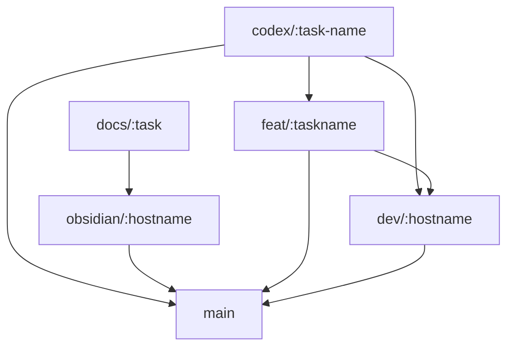
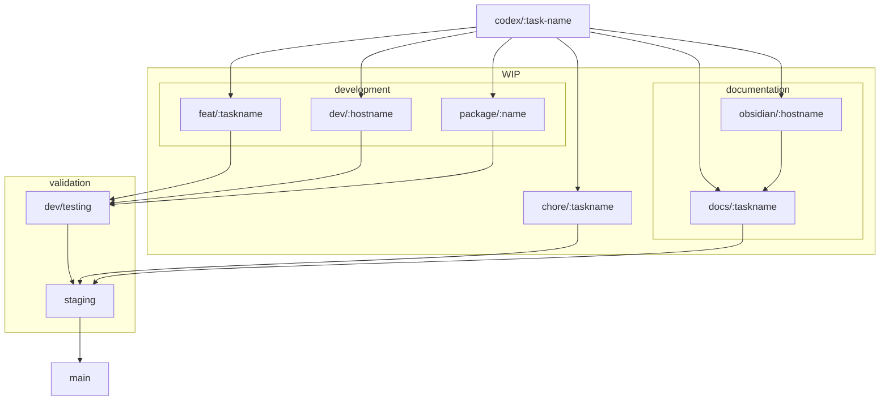

---
```
uuid: 4900d291-8856-493f-aa48-2ba569733f72
```
```
created_at: '2025-09-20T05:43:29Z'
```
title: 2025.09.20.05.43.29
filename: Github Branching Workflow
```
description: >-
```
  This document outlines a structured GitHub branching workflow for managing
  code development and documentation. It details specific branch naming
  conventions, the flow from development to main, and merging rules to ensure
  code integrity. The workflow includes both current implicit processes and
  desired explicit transitions for a systematic approach.
tags:
  - github
  - branching
  - workflow
  - merging
  - codex
  - docs
  - staging
```
related_to_uuid: []
```
```
related_to_title: []
```
references: []
---

# Github Branching Workflow

- **Branches:**
  - `chore/<task>`, `codex/<task>` go to `main`.

- **Development Setup:**
  - Use multiple computers (`stealth` and `yoga`) for development.
  - Changes flow from `dev/<hostname>` to `testing`, then `staging`, and finally
    `main`.

- **Typical Workflow:**
  1. `codex/<task>` -> `dev/codex-staging` -> `main`
  2. `feat/codex-<task>` indicates a human operator has taken over a Codex task.
  3. `<type>/<task>` branches for specific tasks.

- **Branching Rules:**
  - Prefixed with `codex/` indicate Codex responsibility.
  - Others are my responsibility unless default merging causes issues.

- **Obsidian Workflow:**
  1. `obsidian/<hostname>` -> `obsidian/staging` -> `obsidian/main` -> `docs/staging` -> `docs/staging`
  2. Ideal flow: `<describer>/<task>` -> `obsidian/testing` -> `dev/staging` ->
     `main`

- **Documentation Flow:**
  1. `<codex|docs|readme|etc>/<task>` -> `obsidian/<hostname>` ->
```
`obsidian/staging` -> `main`
```
  2. Staging branch uses GitHub Actions for transformations.

## Diagrams

We have a kind of process at the moment.
We will capture the current flow we do implicitly
so we can begin to do it explicitly
And describe a step by step process that allows us to
migrate to an intentional flow with useful and well defined conditions
and a github workflow system taht works along side of it




I don't have a lot of control over the codex branch names that I can figure out yet except through
the limited settings interface.
They get prefixed with `codex/` and the robot picks a `:task-name`
As a result, the codex branch flow in the diagram looks a bit chaotic,
because it is chaotic.

### Desired flow with well defined transitions


This diagram shows how tasks progress from initial development to the `main`
branch, ensuring a structured and systematic approach.

## Merging Rules

### Feature -> `dev/testing` or `dev/<hostname>`

To merge into `dev/testing` or `dev/<hostname>`:
- PR must build and install without errors.
- Otherwise, it should be green.

### From `dev/testing` -> `dev/staging`

To merge into staging:
- No linting errors on the touched diffs.
- No failing tests along the changed paths.
- Only `dev/testing` and `dev/<hostname>` branches may merge into `dev/staging`.

### From `dev/staging` -> `main`

- Green from both directions:
  - `obsidian/staging` to `obsidian/main`
  - `main` to `obsidian/staging`

## Conclusion

By following these branching and merging rules, we ensure a systematic and
error-free workflow that maintains the integrity of our codebase. This structure
not only helps in managing changes efficiently but also ensures that any issues
are caught early on in the development process.

Feel free to adjust or refine these rules as needed based on feedback from team
members or additional use cases.
<!-- GENERATED-SECTIONS:DO-NOT-EDIT-BELOW -->
## Related content
- _None_
## Sources
- _None_
<!-- GENERATED-SECTIONS:DO-NOT-EDIT-ABOVE -->
