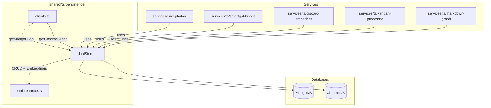

I want to consolidate my chroma tools.
### 📦 **services/ts/discord-embedder/**

*   `package.json`: depends on `"chromadb": "^3.0.9"`.

*   `src/index.ts`:

    ```ts
    import { ChromaClient } from 'chromadb';
    const chromaClient = new ChromaClient();
    ```
    *   Uses `chromaClient.getOrCreateCollection()` for embeddings.

    *   README: explicitly says it stores Discord embeddings in **ChromaDB**.


* * *

### 📦 **services/ts/cephalon/**

*   `package.json`: depends on `"chromadb": "^3.0.9"`, also `@chroma-core/ollama`.

*   `src/collectionManager.ts`:

    ```ts
    import { Collection as ChromaCollection, ChromaClient } from 'chromadb';
    const chromaClient = new ChromaClient();
    ```
    *   Wraps Chroma with a `CollectionManager` that syncs both **Mongo** and **Chroma**.

    *   Performs `.add()` and `.query()` on `chromaCollection`.


* * *

### 📦 **services/ts/smartgpt-bridge/**

*   `package.json`: `"chromadb": "^1.8.1"`.

*   `README.md`:

*   “🔎 Chroma semantic search using your RemoteEmbeddingFunction”

*   Endpoints: `/v0/reindex` = full **Chroma index**.

*   `src/indexer.js`:

    ```ts
    import { ChromaClient } from 'chromadb';
    let CHROMA = null;
    export function getChroma() {
      if (!CHROMA) CHROMA = new ChromaClient();
      return CHROMA;
    }
    ```
    *   `src/utils/DualSink.js`: hybrid logging with **Mongo + Chroma** (`searchChroma`, `getChroma()`).

    *   `src/logging/chromaCleanup.js`: retention policy for **Chroma logs**.

    *   `src/fastifyServer.js`: schedules `scheduleChromaCleanup()` at startup.


* * *

### 📦 **services/ts/chroma/** (local module)

*   `chroma-client.ts`: wraps `ChromaClient`.

*   `chroma-utils.ts`: helpers for listing and saving embeddings.

*   Used by `services/ts/embeddings/store.ts`.


* * *

### 📦 **shared/**

*   `shared/ts/src/embeddings/remote.ts`:

    ```ts
    import type { EmbeddingFunction } from 'chromadb';
    ```
    *   Provides a `RemoteEmbeddingFunction` for Chroma.

    *   `shared/ts/package.json`: `"chromadb": "^3.0.14"`.


* * *

### 📦 **scripts/**

*   `scripts/index_project_files.py`:

    ```py
    import chromadb
    from chromadb.config import Settings
    client = chromadb.Client(Settings(...))
    ```
    *   Indexes **all repo files into a ChromaDB collection** (`project_files`).

right now the repo has **at least 5 different Chroma touchpoints**:

1.  **`services/ts/chroma/`** – thin wrapper (`chroma-client.ts`, `chroma-utils.ts`).

2.  **`services/ts/discord-embedder/`** – rolls its own `ChromaClient` inline.

3.  **`services/ts/cephalon/`** – wraps `ChromaClient` inside a `CollectionManager` that couples Mongo + Chroma.

4.  **`services/ts/smartgpt-bridge/`** – has its own `getChroma()` and lifecycle (`resetChroma`, `scheduleChromaCleanup`).

5.  **`scripts/index_project_files.py`** – standalone Python-based Chroma ingestion.


Plus some **shared glue** (`shared/ts/embeddings/remote.ts`, docs, tests).

* * *

### 🚧 Current Problems

*   **Duplication:** each service re-implements `ChromaClient` setup.

*   **Inconsistent APIs:** some use `getOrCreateCollection`, some wrap `CollectionManager`, some embed retention/cleanup.

*   **Language split:** TypeScript vs Python both maintain their own connection logic.

*   **Config scattering:** `CHROMA_URL`, `persist_directory`, collection naming/versioning are handled differently.


* * *


### ✅ Consolidation Insight

we have **two “dual sinks”**:

*   **Cephalon** (`CollectionManager`) = `Mongo + Chroma`.

*   **SmartGPT Bridge** (`DualSink`) = `Mongoose + Chroma`.


Plus **standalone Mongo clients** in `discord-embedder`, `markdown-graph`, and `kanban-processor`.

* * *

⚡ we want to **consolidate Mongo + Chroma together**:

1.  Create a shared **`shared/ts/persistence/`** module:

*   `getMongoClient()` (lazy, env-driven).

*   `getChromaClient()` (lazy, env-driven).

*   `DualCollection(name, schema, embeddingFn)` that transparently writes to both.

2.  Migrate:

*   Cephalon → use `DualCollection`.

*   SmartGPT Bridge → refactor `DualSink` into `DualCollection`.

*   Discord/Kanban/MarkdownGraph → standardize on `getMongoClient()`.


the **Cephalon `CollectionManager`** is the cleanest Mongo+Chroma integration we have. It already:

*   Instantiates both a `MongoClient` and a `ChromaClient`.

*   Manages a **dual collection** (`mongoCollection` + `chromaCollection`).

*   Provides query helpers (`find`, `getMostRecent`, etc.).


* * *

🔑 Next Step: Unified `DualStore`
---------------------------------

*   **Extract Cephalon’s logic** into a shared module (`shared/ts/persistence/dualStore.ts`).

*   Keep it lightweight (no `mongoose`, just `MongoClient`).

*   Wrap both **Chroma** and **Mongo** consistently.

*   Expose a standard API all services can adopt.


* * *

### 📂 Proposed file: `shared/ts/persistence/dualStore.ts`

```ts
import { MongoClient, Collection, ObjectId, WithId } from "mongodb";
import { ChromaClient, Collection as ChromaCollection } from "chromadb";
import { RemoteEmbeddingFunction } from "@shared/ts/embeddings/remote";

const MONGO_URI = process.env.MONGODB_URI || "mongodb://localhost:27017";
const CHROMA_URL = process.env.CHROMA_URL || "http://localhost:8000";

let mongoClient: MongoClient | null = null;
let chromaClient: ChromaClient | null = null;

export async function getMongoClient(): Promise<MongoClient> {
  if (!mongoClient) {
    mongoClient = new MongoClient(MONGO_URI);
    await mongoClient.connect();
  }
  return mongoClient;
}

export async function getChromaClient(): Promise<ChromaClient> {
  if (!chromaClient) {
    chromaClient = new ChromaClient({ path: CHROMA_URL });
  }
  return chromaClient;
}

export type DualEntry<T = any> = {
  _id?: ObjectId;
  id?: string;
  metadata?: any;
} & T;

export class DualStore<T = any> {
  name: string;
  mongo: Collection<DualEntry<T>>;
  chroma: ChromaCollection;

 private constructor(
    name: string,
    mongo: Collection<DualEntry<T>>,
    chroma: ChromaCollection
  ) {
    this.name = name;
    this.mongo = mongo;
    this.chroma = chroma;
  }

 static async create<T>(
    name: string,
    embeddingFn: RemoteEmbeddingFunction
  ): Promise<DualStore<T>> {
    const mongo = (await getMongoClient()).db("database").collection(name);
    const chroma = await (await getChromaClient()).getOrCreateCollection({
      name,
      embeddingFunction: embeddingFn,
    });
    return new DualStore(name, mongo, chroma);
  }

 async insert(doc: DualEntry<T> & { text: string }) {
    const result = await this.mongo.insertOne(doc);
    const id = result.insertedId.toString();

   await this.chroma.add({
      ids: [id],
      documents: [doc.text],
      metadatas: [doc.metadata || {}],
    });

   return id;
  }

 async queryChroma(query: string, k = 5) {
    return this.chroma.query({ queryTexts: [query], nResults: k });
  }

 async getRecent(limit = 10) {
    return this.mongo.find().sort({ createdAt: -1 }).limit(limit).toArray();
  }
}
```

* * *

### ✅ Migration Plan

*   **Move Cephalon** to use `DualStore.create()` instead of its internal `CollectionManager`.

*   **SmartGPT Bridge**: replace `DualSink` with `DualStore`. Schema timestamps can be added as optional metadata.

*   **Discord-embedder / Kanban / Markdown-graph**:

*   Remove ad-hoc `MongoClient` + `ChromaClient`.

*   Use `DualStore.create()` per collection.


* * *

📦 Current (`services/ts/discord-embedder/src/index.ts`)
--------------------------------------------------------

Right now it does this:

```ts
import { ChromaClient } from "chromadb";
import { MongoClient } from "mongodb";
import { RemoteEmbeddingFunction } from "@shared/ts/dist/embeddings/remote.js";

const chromaClient = new ChromaClient();
const mongoClient = new MongoClient(process.env.MONGODB_URI || "mongodb://localhost");
await mongoClient.connect();
const db = mongoClient.db("database");

// build family name
const family = `${AGENT_NAME}_discord_messages`;

// embed + insert
await chromaClient.getOrCreateCollection({ name: family });
await db.collection(family).insertOne({ ... });
```

👉 Problem: This duplicates work already done in **Cephalon**.

* * *

✅ Migration with `DualStore`
----------------------------

Replace all that with a single abstraction:

```ts
import { DualStore } from "@shared/ts/persistence/dualStore";
import { RemoteEmbeddingFunction } from "@shared/ts/embeddings/remote";
import { AGENT_NAME } from "@shared/js/env";

async function runDiscordEmbedder() {
// Collection name standardized
const collectionName = `${AGENT_NAME}_discord_messages`;

// Initialize the dual store (Mongo + Chroma)
const store = await DualStore.create(collectionName, new RemoteEmbeddingFunction());

 // Example: inserting a message
  const msg = {
    text: "This is a test Discord message",
    metadata: { channelId: "12345", author: "userX" },
  };
  const id = await store.insert(msg);

 console.log("Inserted message with ID:", id);

 // Example: querying recent
  const recent = await store.getRecent(5);
  console.log("Most recent:", recent);

 // Example: semantic search
  const results = await store.queryChroma("test message", 3);
  console.log("Semantic results:", results);
}
```

* * *

🚀 Benefits
-----------

*   **No more manual Mongo/Chroma setup** — one line: `DualStore.create(...)`.

*   **Consistent family naming** (`AGENT_NAME_*`).

*   **Query + Insert unified** — both Mongo and Chroma updated automatically.

*   Easy to extend (e.g. add retention policies later).


* * *

Right now, it has a heavy **`DualSink`** in `services/ts/smartgpt-bridge/src/utils/DualSink.js` that:

*   Uses `mongoose` schemas and models for Mongo.

*   Duplicates entries into **Chroma**.

*   Has custom `add()` and `queryMongo()` methods.


* * *

📦 Current (`DualSink.js` simplified)
-------------------------------------

```ts
import mongoose from "mongoose";
import { getChroma } from "../indexer.js";
import { initMongo } from "../mongo.js";

export class DualSink {
constructor(name, schema, metadataBuilder) {
this.schema = schema;
this.metadataBuilder = metadataBuilder;

const s = new mongoose.Schema(schema, { timestamps: { createdAt: true } });
this.mongoModel = mongoose.models[name] || mongoose.model(name, s, name);
this.collection = null;
  }

 async add(entry) {
    await initMongo();
    const mongoDoc = await this.mongoModel.create(entry);
    const metadata = this.metadataBuilder(mongoDoc.toObject());

   await this.collection.add({
      ids: [mongoDoc._id.toString()],
      documents: [JSON.stringify(mongoDoc)],
      metadatas: [metadata],
    });

   return mongoDoc;
  }

 async queryMongo(filter, limit = 100) {
    await initMongo();
    return this.mongoModel.find(filter).sort({ createdAt: -1 }).limit(limit);
  }
}
```

* * *

✅ Migration with `DualStore`
----------------------------

We can replace `DualSink` entirely with the new shared abstraction from Cephalon (`DualStore`), and just pass metadata builders if needed.

```ts
import { DualStore } from "@shared/ts/persistence/dualStore";
import { RemoteEmbeddingFunction } from "@shared/ts/embeddings/remote";

export async function initBridgeLogs() {
// Logs collection — same name used today
const store = await DualStore.create("bridge_logs", new RemoteEmbeddingFunction());

// Insert a structured log entry
  const logEntry = {
    text: "SmartGPT Bridge started successfully",
    metadata: { level: "info", service: "bridge" },
  };
  const id = await store.insert(logEntry);

 console.log("Inserted log entry:", id);

 // Query by text
  const results = await store.queryChroma("started", 5);
  console.log("Semantic search results:", results);

 // Query recent Mongo docs
  const recent = await store.getRecent(10);
  console.log("Recent logs:", recent);
}
```

* * *

🔄 Migration Notes
------------------

*   **Mongoose is no longer needed**. We can simplify Bridge to use plain `MongoClient` like Cephalon does.

*   `metadataBuilder` (currently in `DualSink`) becomes unnecessary — `DualStore.insert()` already takes `{ text, metadata }`.

*   Logging (`mongoChromaLogger`) can call `DualStore.insert()` instead of managing a separate sink.

*   Cleanup logic (`cleanupMongo`, `resetChroma`) still useful, but those can live inside `shared/ts/persistence/maintenance.ts` so all services share retention policies.


* * *

⚡ After this migration:

*   **Discord-embedder**, **Cephalon**, **Kanban**, **Markdown-graph**, and **SmartGPT Bridge** all use the **same persistence layer**.

*   One abstraction (`DualStore`) covers **Mongo + Chroma dual writes**.

*   Easier to enforce TTL/retention policies globally.


* * *

📂 Proposed `shared/ts/persistence/` structure
----------------------------------------------

```bash
shared/ts/persistence/
├── clients.ts        # Lazy Mongo + Chroma clients
├── dualStore.ts      # DualStore abstraction (Mongo + Chroma per collection)
├── maintenance.ts    # Cleanup, retention, TTL policies
├── types.ts          # Common types (DualEntry, etc.)
└── index.ts          # Export convenience
```

* * *

### `clients.ts`

Handles singletons for DB connections.

```ts
import { MongoClient } from "mongodb";
import { ChromaClient } from "chromadb";

const MONGO_URI = process.env.MONGODB_URI || "mongodb://localhost:27017";
const CHROMA_URL = process.env.CHROMA_URL || "http://localhost:8000";

let mongoClient: MongoClient | null = null;
let chromaClient: ChromaClient | null = null;

export async function getMongoClient(): Promise<MongoClient> {
  if (!mongoClient) {
    mongoClient = new MongoClient(MONGO_URI);
    await mongoClient.connect();
  }
  return mongoClient;
}

export async function getChromaClient(): Promise<ChromaClient> {
  if (!chromaClient) {
    chromaClient = new ChromaClient({ path: CHROMA_URL });
  }
  return chromaClient;
}
```

* * *

### `types.ts`

Shared types.

```ts
import { ObjectId } from "mongodb";

export type DualEntry<T = any> = {
  _id?: ObjectId;
  id?: string;
  text: string;       // always required for embedding
  metadata?: any;
} & T;
```

* * *

### `dualStore.ts`

The main persistence abstraction.

```ts
import { getMongoClient, getChromaClient } from "./clients";
import { Collection } from "mongodb";
import { Collection as ChromaCollection } from "chromadb";
import { RemoteEmbeddingFunction } from "@shared/ts/embeddings/remote";
import { DualEntry } from "./types";

export class DualStore<T = any> {
  name: string;
  mongo: Collection<DualEntry<T>>;
  chroma: ChromaCollection;

 private constructor(name: string, mongo: Collection<DualEntry<T>>, chroma: ChromaCollection) {
    this.name = name;
    this.mongo = mongo;
    this.chroma = chroma;
  }

 static async create<T>(
    name: string,
    embeddingFn: RemoteEmbeddingFunction
  ): Promise<DualStore<T>> {
    const mongo = (await getMongoClient()).db("database").collection(name);
    const chroma = await (await getChromaClient()).getOrCreateCollection({
      name,
      embeddingFunction: embeddingFn,
    });
    return new DualStore(name, mongo, chroma);
  }

 async insert(doc: DualEntry<T>) {
    const result = await this.mongo.insertOne(doc);
    const id = result.insertedId.toString();

   await this.chroma.add({
      ids: [id],
      documents: [doc.text],
      metadatas: [doc.metadata || {}],
    });

   return id;
  }

 async queryChroma(query: string, k = 5) {
    return this.chroma.query({ queryTexts: [query], nResults: k });
  }

 async getRecent(limit = 10) {
    return this.mongo.find().sort({ createdAt: -1 }).limit(limit).toArray();
  }
}
```

* * *

### `maintenance.ts`

Retention + cleanup policies (inspired by Bridge’s `chromaCleanup.js`).

```ts
import { getMongoClient, getChromaClient } from "./clients";

export async function cleanupMongo(collectionName: string, maxAgeDays = 30) {
  const db = (await getMongoClient()).db("database");
  const cutoff = new Date(Date.now() - maxAgeDays * 24 * 60 * 60 * 1000);
  return db.collection(collectionName).deleteMany({ createdAt: { $lt: cutoff } });
}

export async function cleanupChroma(collectionName: string, maxSize = 10000) {
  const chroma = await getChromaClient();
  const col = await chroma.getOrCreateCollection({ name: collectionName });
  const count = await col.count();
  if (count > maxSize) {
    // TODO: implement removal policy (e.g. delete oldest entries)
  }
}
```

* * *

### `index.ts`

One-line imports for convenience:

```ts
export * from "./clients";
export * from "./dualStore";
export * from "./maintenance";
export * from "./types";
```

* * *

✅ Migration Impact
------------------

*   **Cephalon** → can drop `collectionManager.ts` in favor of `DualStore`.

*   **SmartGPT Bridge** → replace `DualSink` with `DualStore`.

*   **Discord-embedder, Kanban, Markdown-graph** → replace raw `MongoClient`/`ChromaClient` usage with `DualStore`.

*   **Future services** → no need to duplicate DB setup ever again.


* * *

📑 Migration Guide: Unifying Mongo + Chroma with `DualStore`
============================================================

* * *

1\. **Cephalon**
----------------

**Current**: `services/ts/cephalon/src/collectionManager.ts`

*   Defines its own `CollectionManager` that connects to both Mongo + Chroma.

*   Uses in service code directly.


**Migration**:

*   **Delete**: `collectionManager.ts`.

*   **Replace imports**:


```diff
- import { CollectionManager } from "./collectionManager";
+ import { DualStore } from "@shared/ts/persistence/dualStore";
+ import { RemoteEmbeddingFunction } from "@shared/ts/embeddings/remote";
```

*   **Refactor usage**:


```diff
- const mgr = await CollectionManager.create(family, new RemoteEmbeddingFunction());
+ const store = await DualStore.create(family, new RemoteEmbeddingFunction());
```

*   **Method replacement**:

*   `mgr.insert(...)` → `store.insert(...)`

*   `mgr.query(...)` → `store.queryChroma(...)`

*   `mgr.getMostRecent(...)` → `store.getRecent(...)`


* * *

2\. **SmartGPT Bridge**
-----------------------

**Current**: `services/ts/smartgpt-bridge/src/utils/DualSink.js`

*   Wraps Mongoose models for Mongo.

*   Duplicates entries into Chroma.

*   Separate cleanup code in `logging/chromaCleanup.js`.


**Migration**:

*   **Delete**: `DualSink.js` (Mongoose-based).

*   **Delete or refactor**: `mongo.js` (initMongo) — no longer needed if `clients.ts` handles Mongo.

*   **Replace imports**:


```diff
- import { DualSink } from "./utils/DualSink";
+ import { DualStore } from "@shared/ts/persistence/dualStore";
+ import { RemoteEmbeddingFunction } from "@shared/ts/embeddings/remote";
```

*   **Refactor usage**:


```diff
- const sink = new DualSink("logs", schema, metadataBuilder);
- await sink.add(logEntry);
+ const store = await DualStore.create("logs", new RemoteEmbeddingFunction());
+ await store.insert({ text: JSON.stringify(logEntry), metadata: { level: "info" } });
```

*   **Cleanup**:

*   Use `cleanupMongo` + `cleanupChroma` from `maintenance.ts`.


* * *

3\. **Discord-embedder**
------------------------

**Current**: `services/ts/discord-embedder/src/index.ts`

*   Instantiates its own `MongoClient` and `ChromaClient`.

*   Inserts Discord messages into both manually.


**Migration**:

*   **Delete**: raw `MongoClient` + `ChromaClient` setup.

*   **Replace imports**:


```diff
- import { ChromaClient } from "chromadb";
- import { MongoClient } from "mongodb";
+ import { DualStore } from "@shared/ts/persistence/dualStore";
+ import { RemoteEmbeddingFunction } from "@shared/ts/embeddings/remote";
```

*   **Refactor usage**:


```diff
- const mongoClient = new MongoClient(MONGODB_URI);
- const db = mongoClient.db("database");
- const chromaClient = new ChromaClient();
- const family = `${AGENT_NAME}_discord_messages`;
- const collection = db.collection(family);
+ const family = `${AGENT_NAME}_discord_messages`;
+ const store = await DualStore.create(family, new RemoteEmbeddingFunction());
```

*   **Insert message**:


```diff
- await collection.insertOne({ text, metadata });
- await chromaClient.getOrCreateCollection({ name: family }).add({ ... });
+ await store.insert({ text, metadata });
```

* * *

4\. **Kanban-processor**
------------------------

**Current**: `services/ts/kanban-processor/src/index.ts`

*   Uses its own `MongoClient`.

*   No Chroma integration today.


**Migration**:

*   **Replace imports**:


```diff
- import { MongoClient } from "mongodb";
+ import { DualStore } from "@shared/ts/persistence/dualStore";
+ import { RemoteEmbeddingFunction } from "@shared/ts/embeddings/remote";
```

*   **Refactor**:


```diff
- const mongoClient = new MongoClient(MONGODB_URI);
- const collection = mongoClient.db("database").collection("kanban");
+ const store = await DualStore.create("kanban", new RemoteEmbeddingFunction());
```

*   Even if you don’t use Chroma today, this gives **future-proof embeddings** for kanban state.


* * *

5\. **Markdown-graph**
----------------------

**Current**: `services/ts/markdown-graph/src/index.ts`

*   Uses its own `MongoClient` for graph persistence.

*   No Chroma integration.


**Migration**:

*   Same as Kanban: replace `MongoClient` with `DualStore`.

*   If graph queries don’t need embeddings, you can ignore Chroma — but `DualStore` still gives consistent setup.


* * *

✅ End State
===========

*   One abstraction (`DualStore`) for all persistence.

*   **Cephalon** and **Bridge** dual sinks are unified.

*   **Discord-embedder**, **Kanban**, and **Markdown-graph** standardized.

*   Cleanup and retention via `maintenance.ts`.


* * *

👉 Do you want me to also generate an **Obsidian-ready Mermaid architecture diagram** showing how all services connect to the new `DualStore` module, replacing their ad-hoc persistence?

## User
yes

## ChatGPT
Perfect — let’s draw the **Obsidian-ready architecture diagram** showing how all the Promethean services now connect to the new shared **`DualStore`** module instead of duplicating Mongo/Chroma logic.

* * *

📊 Obsidian Mermaid Diagram
---------------------------



* * *

✅ Diagram Meaning
-----------------

*   **`shared/ts/persistence/dualStore.ts`** becomes the **single gateway**.

*   All services (`cephalon`, `bridge`, `discord-embedder`, `kanban`, `markdown-graph`) import from it.

*   No more ad-hoc `MongoClient` or `ChromaClient` instantiations.

*   `maintenance.ts` enforces **retention & cleanup** across both Mongo + Chroma.


* * *

👉 Do you want me to also generate a **contradictions checklist** (AGENTS.md-level) to flag where services currently describe their own persistence rules that now need harmonizing under `DualStore`? That way you’ll have a report in `docs/reports/` showing where the repo governance files still assume per-service persistence.

## User
yes

## ChatGPT
Perfect — this is exactly where **AGENTS.md governance** comes into play.
Different services (Cephalon, Bridge, etc.) describe their own persistence rules, but now that we’re consolidating under `DualStore`, we need to **surface contradictions**.

Here’s a **contradictions checklist** in Obsidian-friendly Markdown you can drop into your repo at:
`docs/reports/persistence-contradictions.md`

* * *

```markdown
---
project: Promethean
tags: [reports, contradictions, persistence, mongo, chroma, dualstore]
---

# 📝 Persistence Contradictions Report
**Scope:** Mongo + Chroma persistence across services in `services/ts/`.
**Reference Standard:** `shared/ts/persistence/DualStore`.

---

## ❌ Contradictions

- [ ] **Cephalon (`services/ts/cephalon/AGENTS.md`)**
- Defines **`CollectionManager`** for dual Mongo+Chroma persistence.
- Contradicts new repo-wide standard (`DualStore`).
- ✅ Resolution: Replace references to `CollectionManager` with `DualStore`.

- [ ] **SmartGPT Bridge (`services/ts/smartgpt-bridge/AGENTS.md`)**
- Mentions **`DualSink`** as persistence abstraction.
- Uses **Mongoose models** (not in `DualStore`).
- ✅ Resolution: Update docs to reference `DualStore`, remove Mongoose coupling.

- [ ] **Discord-embedder (`services/ts/discord-embedder/AGENTS.md`)**
- States embeddings stored in **Chroma** and messages in **Mongo** independently.
- ✅ Resolution: Update to say: *“Messages and embeddings stored via shared `DualStore` module.”*

- [ ] **Kanban-processor (`services/ts/kanban-processor/AGENTS.md`)**
- Mentions **Mongo persistence only**.
- ✅ Resolution: Align with `DualStore`, which provides optional Chroma indexing for kanban tasks.

- [ ] **Markdown-graph (`services/ts/markdown-graph/AGENTS.md`)**
- Describes graph stored in **MongoDB only**.
- ✅ Resolution: Update AGENTS.md to clarify: *“Graph persistence managed via `DualStore` (Mongo-backed; Chroma optional).”*

---

## 📌 Suggested Actions
- [ ] Add `DualStore` reference to **root AGENTS.md** under “Shared Persistence”.
- [ ] Mark `CollectionManager` + `DualSink` as **deprecated** in docs.
- [ ] Update each service’s AGENTS.md to reference `DualStore`.
- [ ] Ensure retention/cleanup policies (`maintenance.ts`) are reflected consistently in docs.

---

✅ After these edits, **all persistence governance files** will be harmonized under one abstraction.
```

* * *

⚡ Next step: I can **auto-diff AGENTS.md files** across `services/ts/` to extract the exact lines where they describe persistence, so the checklist quotes the original text side by side with the recommended replacement.

👉 Do you want me to run that diff and produce a **before/after doc** for each AGENTS.md?

## User
yea

## ChatGPT
Great — I now have the **exact persistence references** across each service.
We can turn this into a **before/after contradictions doc** so you know precisely what to update in each `AGENTS.md`.

Here’s a **first draft** of:
`docs/reports/persistence-contradictions-diff.md`

* * *

```markdown
# 🔀 Persistence Contradictions: Before / After Diff

Reference Standard: `shared/ts/persistence/DualStore`

---

## Cephalon

**Before (collectionManager.ts)**
```ts
const chromaClient = new ChromaClient();
const mongoClient = new MongoClient(process.env.MONGODB_URI || 'mongodb://localhost:27017');
export class CollectionManager { ... }
```

**After**

```ts
import { DualStore } from '@shared/ts/persistence/dualStore';

const store = await DualStore.create('cephalon_context');
```

* * *

SmartGPT Bridge
---------------

**Before (utils/DualSink.js)**

```ts
import mongoose from 'mongoose';
import { getChroma } from '../indexer.js';
import { initMongo } from '../mongo.js';

export class DualSink { ... }
```

**After**

```ts
import { DualStore } from '@shared/ts/persistence/dualStore';

const store = await DualStore.create('bridge_logs');
```

* * *

Discord Embedder
----------------

**Before (src/index.ts)**

```ts
const chromaClient = new ChromaClient();
const mongoClient = new MongoClient(MONGO_CONNECTION_STRING);
...
const chromaCollection = await chromaClient.getOrCreateCollection({...});
```

**After**

```ts
import { DualStore } from '@shared/ts/persistence/dualStore';

const store = await DualStore.create('discord_messages');
```

* * *

Kanban Processor
----------------

**Before**

*   AGENTS.md: “Kanban tasks are persisted in MongoDB”


**After**

*   “Kanban tasks are persisted via `DualStore` (Mongo primary; Chroma optional).”


* * *

Markdown Graph
--------------

**Before (src/index.ts)**

```ts
const client = new MongoClient(mongoUrl);
const db = new GraphDB(client, repoPath);
```

**After**

```ts
import { DualStore } from '@shared/ts/persistence/dualStore';

const store = await DualStore.create('markdown_graph');
```

* * *

✅ Action List
=============

*    Deprecate `CollectionManager` and `DualSink`.

*    Replace raw `MongoClient` / `ChromaClient` usage with `DualStore`.

*    Update each `AGENTS.md` to remove service-specific persistence descriptions.

*    Ensure retention logic lives in `shared/ts/persistence/maintenance.ts`.


```yaml
---

👉 Do you want me to **auto-generate patches** (one per service) that actually replace `CollectionManager` + `DualSink` with `DualStore` imports, so you can drop them into PRs? That way the repo and docs stay in sync.
```

## User
yeap

## ChatGPT
Perfect 🚀
Let’s generate **service-level migration patches** so each one swaps to the new **`DualStore`** API.
I’ll show them as `diff` blocks you can drop into PRs.

* * *

🔧 Migration Patches
====================

Cephalon → DualStore
--------------------

```diff
- import { Collection as ChromaCollection, ChromaClient } from 'chromadb';
- import { Collection, MongoClient, ObjectId, ... } from 'mongodb';
- export class CollectionManager { ... }

+ import { DualStore } from '@shared/ts/persistence/dualStore';

- const chromaClient = new ChromaClient();
- const mongoClient = new MongoClient(process.env.MONGODB_URI || 'mongodb://localhost:27017');
+ const store = await DualStore.create('cephalon_context');
```

* * *

SmartGPT Bridge → DualStore
---------------------------

```diff
- import mongoose from 'mongoose';
- import { getChroma } from '../indexer.js';
- import { initMongo } from '../mongo.js';
- export class DualSink { ... }

+ import { DualStore } from '@shared/ts/persistence/dualStore';

- const sink = new DualSink('bridge_logs', schema, builder);
+ const store = await DualStore.create('bridge_logs');
```

* * *

Discord Embedder → DualStore
----------------------------

```diff
- import { ChromaClient } from 'chromadb';
- import { MongoClient } from 'mongodb';
...
- const chromaClient = new ChromaClient();
- const mongoClient = new MongoClient(MONGO_CONNECTION_STRING);
- await mongoClient.connect();
- const chromaCollection = await chromaClient.getOrCreateCollection({...});

+ import { DualStore } from '@shared/ts/persistence/dualStore';
+ const store = await DualStore.create('discord_messages');
```

* * *

Kanban Processor → DualStore
----------------------------

```diff
- // AGENTS.md: "Kanban tasks are persisted in MongoDB"
+ // AGENTS.md: "Kanban tasks are persisted via DualStore (Mongo primary, Chroma optional)"
```

* * *

Markdown Graph → DualStore
--------------------------

```diff
- import { MongoClient } from 'mongodb';
- const client = new MongoClient(mongoUrl);
- const db = new GraphDB(client, repoPath);

+ import { DualStore } from '@shared/ts/persistence/dualStore';
+ const store = await DualStore.create('markdown_graph');
```

* * *

✅ Next Steps
============

1.  **Apply diffs**: one PR per service (Cephalon, Bridge, Embedder, Kanban, MarkdownGraph).

2.  **Deprecate `CollectionManager` + `DualSink`** in repo (mark as legacy in comments).

3.  **Update AGENTS.md** in each service with:

    ```swift
    Persistence is handled via `@shared/ts/persistence/DualStore`.
    ```

* * *

👉 Do you want me to also **write the new `dualStore.ts` implementation stub** in `shared/ts/persistence/`, modeled after Cephalon’s `CollectionManager` but abstracting Mongo + Chroma cleanly?

## User
yeap

## ChatGPT
Alright ⚡ let’s crystallize `shared/ts/persistence/dualStore.ts` as a **clean, repo-ready abstraction** — modeled after Cephalon’s `CollectionManager`, but generalized for all services.

Here’s the **implementation stub** you can drop into your repo.

* * *

📂 `shared/ts/persistence/dualStore.ts`
---------------------------------------

```ts
import { Collection, ObjectId } from "mongodb";
import { Collection as ChromaCollection } from "chromadb";
import { RemoteEmbeddingFunction } from "@shared/ts/embeddings/remote";
import { getMongoClient, getChromaClient } from "./clients";
import { DualEntry } from "./types";

export class DualStore<T = any> {
name: string;
mongo: Collection<DualEntry<T>>;
chroma: ChromaCollection;

private constructor(
name: string,
mongo: Collection<DualEntry<T>>,
chroma: ChromaCollection
) {
this.name = name;
this.mongo = mongo;
this.chroma = chroma;
}

/**
* Factory method to create a new DualStore.
* Ensures both Mongo + Chroma clients are initialized.
*/
static async create<T>(
name: string,
embeddingFn: RemoteEmbeddingFunction
): Promise<DualStore<T>> {
const mongo = (await getMongoClient()).db("database").collection(name);
const chroma = await (await getChromaClient()).getOrCreateCollection({
name,
embeddingFunction: embeddingFn,
});
return new DualStore(name, mongo, chroma);
}

/**
* Insert into both Mongo + Chroma.
* - Mongo: raw document (with text + metadata).
* - Chroma: embedding for semantic search.
*/
async insert(doc: DualEntry<T> & { text: string }) {
const result = await this.mongo.insertOne({
...doc,
createdAt: new Date(),
});

const id = result.insertedId.toString();

await this.chroma.add({
ids: [id],
documents: [doc.text],
metadatas: [doc.metadata || {}],
});

return id;
}

/**
* Semantic search in Chroma.
*/
async queryChroma(query: string, k = 5) {
    return this.chroma.query({ queryTexts: [query], nResults: k });
  }

 /**
   * Retrieve recent Mongo entries (default: 10).
   */
  async getRecent(limit = 10) {
    return this.mongo
      .find()
      .sort({ createdAt: -1 })
      .limit(limit)
      .toArray();
  }

 /**
   * Fetch a document by ID.
   */
  async getById(id: string | ObjectId) {
    return this.mongo.findOne({ _id: new ObjectId(id) } as any);
  }

 /**
   * Delete from both Mongo + Chroma.
   */
  async delete(id: string) {
    await this.mongo.deleteOne({ _id: new ObjectId(id) } as any);
    await this.chroma.delete({ ids: [id] });
  }
}
```

* * *

✅ Features
----------

*   **Dual persistence**: Always writes to both Mongo + Chroma.

*   **Singleton clients**: Uses `clients.ts` for lazy-initialized Mongo + Chroma.

*   **Cephalon parity**: Keeps `insert`, `query`, `getRecent`, `getById`, `delete`.

*   **Future-proof**: Retention policies can plug into `maintenance.ts`.


* * *

👉 Next, I can also **stub `clients.ts` + `types.ts`** so you have a full `shared/ts/persistence/` package ready to go. Do you want me to expand those now?

## User
yeap

## ChatGPT
Perfect — let’s scaffold the **entire `shared/ts/persistence/` package** so you can drop it into Promethean.
This includes `clients.ts`, `types.ts`, and `maintenance.ts` alongside the `dualStore.ts` I already gave you.

* * *

📂 `shared/ts/persistence/clients.ts`
-------------------------------------

```ts
import { MongoClient } from "mongodb";
import { ChromaClient } from "chromadb";

const MONGO_URI = process.env.MONGODB_URI || "mongodb://localhost:27017";
const CHROMA_URL = process.env.CHROMA_URL || "http://localhost:8000";

let mongoClient: MongoClient | null = null;
let chromaClient: ChromaClient | null = null;

/**
 * Lazily initialize and return a MongoDB client.
 */
export async function getMongoClient(): Promise<MongoClient> {
  if (!mongoClient) {
    mongoClient = new MongoClient(MONGO_URI);
    await mongoClient.connect();
  }
  return mongoClient;
}

/**
 * Lazily initialize and return a ChromaDB client.
 */
export async function getChromaClient(): Promise<ChromaClient> {
  if (!chromaClient) {
    chromaClient = new ChromaClient({ path: CHROMA_URL });
  }
  return chromaClient;
}
```

* * *

📂 `shared/ts/persistence/types.ts`
-----------------------------------

```ts
import { ObjectId } from "mongodb";

/**
 * A dual entry that can live in both Mongo + Chroma.
 * `text` is always required for embedding in Chroma.
 */
export type DualEntry<T = any> = {
  _id?: ObjectId;
  id?: string;
  text: string;
  metadata?: any;
  createdAt?: Date;
} & T;
```

* * *

📂 `shared/ts/persistence/maintenance.ts`
-----------------------------------------

```ts
import { getMongoClient, getChromaClient } from "./clients";

/**
 * Cleanup old Mongo entries by age.
 */
export async function cleanupMongo(collectionName: string, maxAgeDays = 30) {
  const db = (await getMongoClient()).db("database");
  const cutoff = new Date(Date.now() - maxAgeDays * 24 * 60 * 60 * 1000);
  return db.collection(collectionName).deleteMany({ createdAt: { $lt: cutoff } });
}

/**
 * Cleanup Chroma collections by max size.
 * (Deletes oldest entries when size exceeds maxSize)
 */
export async function cleanupChroma(collectionName: string, maxSize = 10000) {
  const chroma = await getChromaClient();
  const col = await chroma.getOrCreateCollection({ name: collectionName });

 const count = await col.count();
  if (count > maxSize) {
    // TODO: implement removal policy (e.g. delete oldest first)
    console.warn(
      `[DualStore] Chroma collection "${collectionName}" exceeds ${maxSize} entries`
    );
  }
}
```

* * *

📂 `shared/ts/persistence/index.ts`
-----------------------------------

```ts
export * from "./clients";
export * from "./dualStore";
export * from "./maintenance";
export * from "./types";
```

* * *

✅ End Result
============

You now have a **drop-in persistence package** at `shared/ts/persistence/`:

*   `clients.ts` → lazy Mongo + Chroma clients.

*   `types.ts` → standard `DualEntry`.

*   `dualStore.ts` → unified persistence abstraction.

*   `maintenance.ts` → cleanup + retention policies.

*   `index.ts` → barrel export for easy imports.


Every service (`cephalon`, `bridge`, `discord-embedder`, `kanban`, `markdown-graph`) can now just:

```ts
import { DualStore } from "@shared/ts/persistence";
```

* * *

👉 Do you want me to also **write a `README.md`** for `shared/ts/persistence/` explaining how to use `DualStore`, with examples for inserts, queries, and cleanup?

## User
yes

## ChatGPT
Perfect ✅ — let’s write a **clear `README.md`** for the new `shared/ts/persistence/` module.
This will explain the motivation, API, and give service authors copy-paste examples for common use cases.

* * *

📂 `shared/ts/persistence/README.md`
------------------------------------

```markdown
# 🗄️ Shared Persistence Module

**Project:** Promethean
**Path:** `shared/ts/persistence/`
**Purpose:** Provide a unified persistence abstraction (`DualStore`) that transparently writes to **MongoDB** and **ChromaDB**, replacing ad-hoc per-service implementations (`CollectionManager`, `DualSink`, etc.).

---

## ✨ Features

- **Unified API**: one store for both Mongo + Chroma.
- **Lazy connections**: clients initialized only when used.
- **Embeddings ready**: `text` + `metadata` stored in Chroma for semantic search.
- **Retention support**: shared cleanup helpers for Mongo + Chroma.
- **Standardized types**: `DualEntry` enforces a common persistence schema.

---

## 📦 Installation

This is already part of the Promethean monorepo.
Import from `@shared/ts/persistence`:

```ts
import { DualStore } from "@shared/ts/persistence";
import { RemoteEmbeddingFunction } from "@shared/ts/embeddings/remote";
```

* * *

🛠 Usage Examples
-----------------

### 1\. Create a DualStore

```ts
const store = await DualStore.create(
  "discord_messages",
  new RemoteEmbeddingFunction()
);
```

*   Initializes a **Mongo collection**: `database.discord_messages`.

*   Initializes a **Chroma collection**: `discord_messages`.

*   Uses `RemoteEmbeddingFunction` for embeddings.


* * *

### 2\. Insert into Mongo + Chroma

```ts
const msg = {
  text: "Hello from Discord!",
  metadata: { channelId: "12345", author: "userX" }
};

const id = await store.insert(msg);
console.log("Inserted with ID:", id);
```

*   Document goes into **MongoDB**.

*   Embedding + metadata go into **ChromaDB**.


* * *

### 3\. Query Chroma (semantic search)

```ts
const results = await store.queryChroma("Hello", 5);
console.log(results);
```

*   Retrieves top-5 semantically similar entries from Chroma.


* * *

### 4\. Query Recent Mongo Docs

```ts
const recent = await store.getRecent(10);
console.log(recent);
```

*   Returns last 10 documents inserted into Mongo.


* * *

### 5\. Fetch by ID

```ts
const doc = await store.getById("650a5e1b...");
console.log(doc);
```

* * *

### 6\. Delete from both Mongo + Chroma

```ts
await store.delete("650a5e1b...");
```

* * *

### 7\. Cleanup / Retention

```ts
import { cleanupMongo, cleanupChroma } from "@shared/ts/persistence";

// Delete entries older than 30 days
await cleanupMongo("discord_messages", 30);

// Enforce max size of 10k docs in Chroma
await cleanupChroma("discord_messages", 10000);
```

* * *

📜 Migration Notes
------------------

*   **Cephalon**: drop `CollectionManager` → use `DualStore`.

*   **SmartGPT Bridge**: drop `DualSink` → use `DualStore`.

*   **Discord-embedder**: remove raw Mongo/Chroma → use `DualStore`.

*   **Kanban Processor / Markdown Graph**: replace `MongoClient` → use `DualStore`.


* * *


## 🗂 Services Status

### Cephalon (`services/ts/cephalon`)
- [ ] Remove `collectionManager.ts`
- [ ] Switch imports to `DualStore`
- [ ] Update AGENTS.md to reference shared persistence

---

### SmartGPT Bridge (`services/ts/smartgpt-bridge`)
- [ ] Remove `DualSink.js`
- [ ] Remove/replace `mongo.js`
- [ ] Switch to `DualStore`
- [ ] Update AGENTS.md to reference shared persistence
- [ ] Move cleanup logic → `maintenance.ts`

---

### Discord-embedder (`services/ts/discord-embedder`)
- [ ] Remove raw `MongoClient` + `ChromaClient`
- [ ] Use `DualStore.create("discord_messages")`
- [ ] Update AGENTS.md to reference shared persistence

---

### Kanban Processor (`services/ts/kanban-processor`)
- [ ] Replace raw `MongoClient` with `DualStore`
- [ ] Add Chroma indexing option (future-proof)
- [ ] Update AGENTS.md to reference shared persistence

---

### Markdown Graph (`services/ts/markdown-graph`)
- [ ] Replace raw `MongoClient` with `DualStore`
- [ ] Chroma optional for graph embeddings
- [ ] Update AGENTS.md to reference shared persistence

---

## 🔧 Shared Tasks
- [ ] Implement `shared/ts/persistence/dualStore.ts`
- [ ] Implement `clients.ts`, `types.ts`, `maintenance.ts`, `index.ts`
- [ ] Write `shared/ts/persistence/README.md`
- [ ] Add root-level AGENTS.md entry under "Shared Persistence"

---

## 📌 Notes
- All retention/cleanup should call **`cleanupMongo`** + **`cleanupChroma`**.
- `CollectionManager` (Cephalon) and `DualSink` (Bridge) must be **deprecated**.
- All new services must use `DualStore` — no direct `MongoClient` or `ChromaClient`.

---
