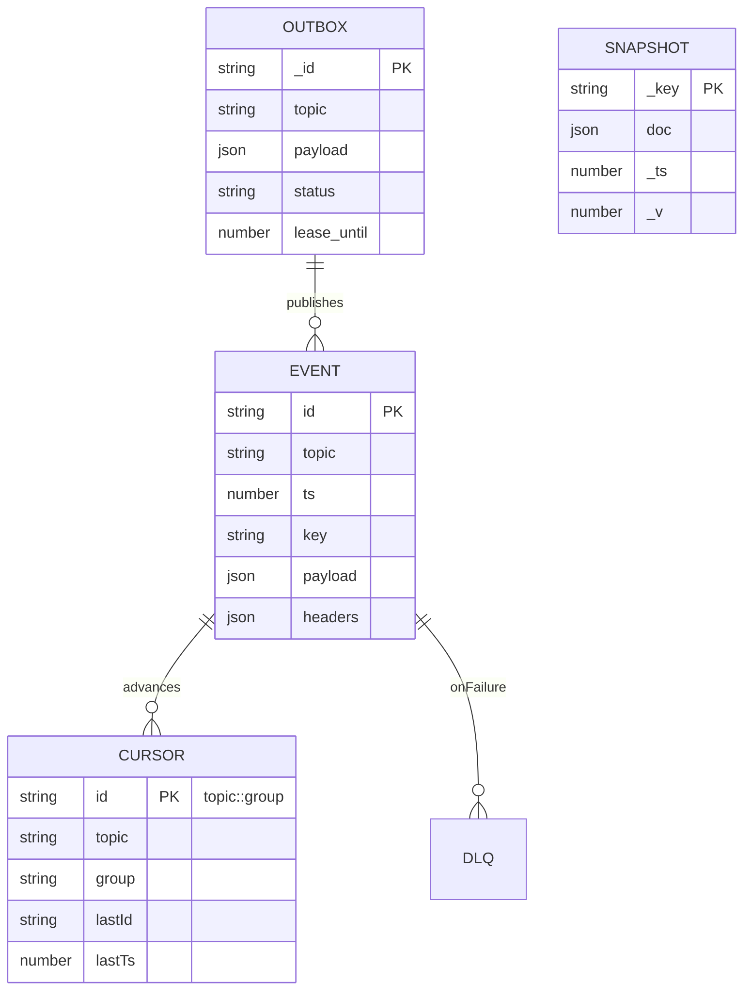

Mermaid diagrams for event bus, outbox, partition coordination, and projections → snapshots.

Includes:

- Producers → Outbox → EventBus → EventStore/CursorStore
- Projectors $changelog/compaction$ and DLQ
- Consumer group + partition assignment (rendezvous)
- ER diagram for Event/Cursor/Outbox/Snapshot

Use these to communicate broker architecture and replay/ops flows.

## 📨 Event Bus and Processing Flow

```mermaid
flowchart TB
  subgraph Publishers [Producers]
    SvcA[Service A]
    SvcB[Service B]
    OutboxA[(Mongo Outbox)]
    SvcA -->|tx + outbox.add| OutboxA
    OutboxA -->|drainer| PubAPI[Event Bus .publish()]
  end

  subgraph Gateway [Event Hub]
    WS[WS Gateway (AUTH/JWT + ACL + leases)]
    HTTP[HTTP /publish]
    PubAPI --> EB[(EventBus)]
    WS --> EB
    HTTP --> EB
  end

  EB --> ES[(EventStore - Mongo)]
  EB --> CS[(CursorStore - Mongo)]
  ES --- Ops[Ops Dashboard /cursors /lag]
  ES --- ReplayAPI[Replay / Export NDJSON]
  ES --- Metrics[Prometheus metrics]

  subgraph Processing [Stream Processing]
    Proj1[Process Projector: heartbeat→process.state]
    TxProj[Transactional Projector]
    Changelog[Changelog → Mongo 'processes']
    Compactor[Compactor → process.state.snapshot]
    Proj1 --> EB
    TxProj --> DB[(Mongo DB)]
    EB --> Proj1
    EB --> TxProj
    EB --> Compactor
    EB -->|dlq.* on fail| DLQ[DLQ Topics]
  end

  subgraph ReadModels [Read APIs]
    SnapColl[(processes snapshot)]
    SnapshotAPI[Snapshot API /snap/:key]
    Changefeed[Mongo Changefeed → processes.changed]
    DB --> SnapColl
    SnapColl --> SnapshotAPI
    Changefeed --> EB
  end
```

## 💓 Heartbeat to Snapshot Flow

```mermaid
flowchart LR
  HBR[heartbeat.received] --> PS[process.state (compaction, key=host:name:pid)]
  PS --> PSS[process.state.snapshot]
  PS --> CHG[Changelog → 'processes' collection]
  CHG --> SNAP[(processes)]
  SNAP --> API[Snapshot API]
  HBR -->|on handler error (N tries)| DLQ[dlq.heartbeat.received]
  DLQ -->|replay tool| HBR
```

## 🧩 Partition Coordinator

```mermaid
flowchart TB
  subgraph Partitions [Stateful Partitions (N=8)]
    P0((0)):::p
    P1((1)):::p
    P2((2)):::p
    P3((3)):::p
    P4((4)):::p
    P5((5)):::p
    P6((6)):::p
    P7((7)):::p
  end

  subgraph GroupG [Consumer Group "analyzers"]
    W1[worker-a]:::w
    W2[worker-b]:::w
    W3[worker-c]:::w
  end

  Coordinator[PartitionCoordinator\n(join/heartbeat/sweep/assign)]:::c

  Coordinator -->|rendezvous assign| W1
  Coordinator -->|rendezvous assign| W2
  Coordinator -->|rendezvous assign| W3

  P0 -.owned by.-> W1
  P1 -.owned by.-> W2
  P2 -.owned by.-> W3
  P3 -.owned by.-> W1
  P4 -.owned by.-> W2
  P5 -.owned by.-> W3
  P6 -.owned by.-> W1
  P7 -.owned by.-> W2

  classDef p fill:#eef,stroke:#88f;
  classDef w fill:#efe,stroke:#4a4;
  classDef c fill:#ffe,stroke:#aa4;
```

## 📦 Event Store Entities



Related: $[index.md|unique/index]$

#tags: #diagrams #broker #streaming
