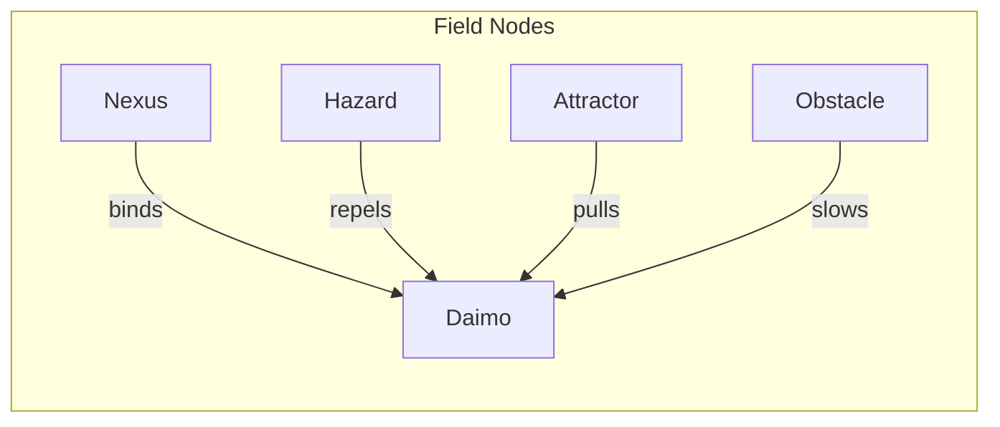

# Node Type Summary Map

```mermaid
graph LR
  subgraph Field Nodes
    Nexus -->|binds| Daimo
    Hazard -->|repels| Daimo
    Attractor -->|pulls| Daimo
    Obstacle -->|slows| Daimo
  end
```

This diagram serves as a **legend** summarizing core field node behaviors in the simulation.

#tags: #diagram #design
