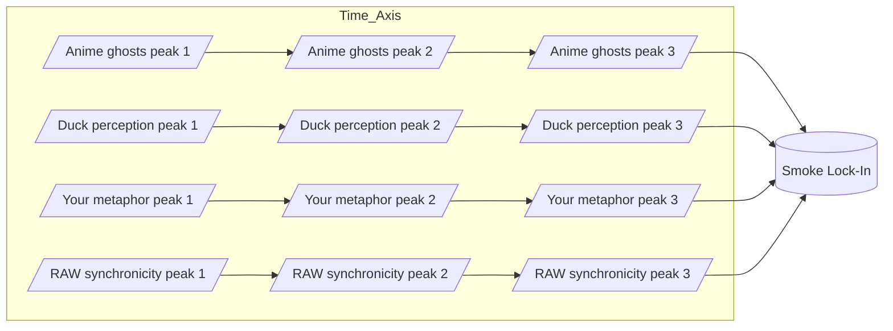
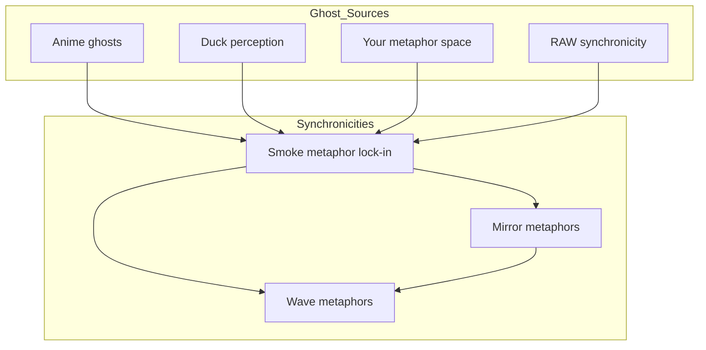

Concept diagrams for sine-wave interference $metaphor lock-in$ and a synchronicity web linking ghost sources to emergent nodes.

Use these as narrative/visual anchors for field metaphors; pair with a plotted version later.

## 4. Sine Wave Interference — "The Curl of the Smoke"

Here each source is a wave of meaning drifting into the field. Where they crest together, the "smoke" is dense enough to lock into a synchronicity.

In a real plotted version, these four "streams" would look like sine curves sliding over each other until they _phase-lock_ at the same point—the moment the metaphor becomes visible.

## 5. RAW-Style Synchronicity Web

This one treats synchronicities as nodes in a network, with each connected to its "ghost sources" and to other synchronicities in the same metaphor family.

Related: $[smoke-waves-infinite-depth.md]$ $[index.md|unique/index]$

#tags: #diagrams #metaphor #synchronicity
