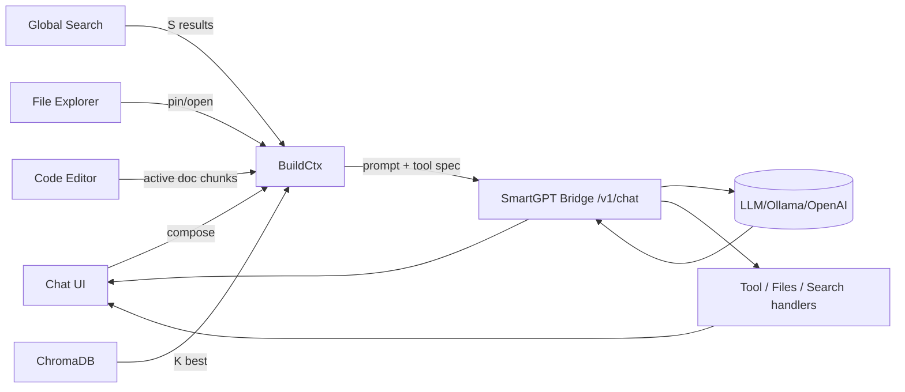

---
$$
uuid: f7702bf8-f7db-473c-9a5b-8dbf66ad3b9e
$$
$$
created_at: 2025.08.24.19.08.57.md
$$
filename: Dynamic Context Model for Web Components
$$
description: >-
$$
  A web-components-first design with a markdown chat, file explorer, and dynamic
  context management. It includes a context strip showing latest messages, RAG
  results, and pinned files while optimizing token usage for efficient model
  interactions.
tags:
  - web-components
  - markdown
  - context-strip
  - rag
  - token-budget
  - file-explorer
  - dynamic-context
$$
related_to_title:
$$
  - Promethean-native config design
  - Promethean Infrastructure Setup
  - api-gateway-versioning
  - Chroma Toolkit Consolidation Plan
  - Promethean Agent Config DSL
  - Protocol_0_The_Contradiction_Engine
  - js-to-lisp-reverse-compiler
  - polymorphic-meta-programming-engine
  - Board Walk – 2025-08-11
  - Migrate to Provider-Tenant Architecture
  - Cross-Target Macro System in Sibilant
  - TypeScript Patch for Tool Calling Support
  - 'Agent Tasks: Persistence Migration to DualStore'
  - Obsidian ChatGPT Plugin Integration Guide
  - AI-Centric OS with MCP Layer
  - aionian-circuit-math
  - field-interaction-equations
  - Cross-Language Runtime Polymorphism
  - The Jar of Echoes
  - Lisp-Compiler-Integration
  - ecs-offload-workers
  - Exception Layer Analysis
  - Model Selection for Lightweight Conversational Tasks
  - ecs-scheduler-and-prefabs
  - Debugging Broker Connections and Agent Behavior
  - EidolonField
  - observability-infrastructure-setup
  - Language-Agnostic Mirror System
  - plan-update-confirmation
  - Pure TypeScript Search Microservice
  - Admin Dashboard for User Management
  - Interop and Source Maps
  - Board Automation Improvements
  - Voice Access Layer Design
  - Sibilant Meta-Prompt DSL
  - template-based-compilation
$$
related_to_uuid:
$$
  - ab748541-020e-4a7e-b07d-28173bd5bea2
  - 6deed6ac-2473-40e0-bee0-ac9ae4c7bff2
  - 0580dcd3-533d-4834-8a2f-eae3771960a9
  - 5020e892-8f18-443a-b707-6d0f3efcfe22
  - 2c00ce45-08cf-4b81-9883-6157f30b7fae
  - 9a93a756-6d33-45d1-aca9-51b74f2b33d2
  - 58191024-d04a-4520-8aae-a18be7b94263
  - 7bed0b9a-8b22-4b1f-be81-054a179453cb
  - 7aa1eb92-7f9a-485b-8218-9b553aa9eefc
  - 54382370-1931-4a19-a634-46735708a9ea
  - 5f210ca2-54e9-445b-afe4-fb340d4992c5
  - 7b7ca860-780c-44fa-8d3f-be8bd9496fba
  - 93d2ba51-8689-49ee-94e2-296092e48058
  - 1d3d6c3a-039e-4b96-93c1-95854945e248
  - 0f1f8cc1-b5a6-4307-a40d-78de3adafca2
  - f2d83a77-7f86-4c56-8538-1350167a0c6c
  - b09141b7-544f-4c8e-8f49-bf76cecaacbb
  - c34c36a6-80c9-4b44-a200-6448543b1b33
  - 18138627-a348-4fbb-b447-410dfb400564
  - cfee6d36-b9f5-4587-885a-cdfddb4f054e
  - 6498b9d7-bd35-4bd3-89fb-af1c415c3cd1
  - 21d5cc09-b005-4ede-8f69-00b4b0794540
  - d144aa62-348c-4e5d-ae8f-38084c67ceca
  - c62a1815-c43b-4a3b-88e6-d7fa008a155e
  - 73d3dbf6-9240-46fd-ada9-cc2e7e00dc5f
  - 49d1e1e5-5d13-4955-8f6f-7676434ec462
  - b4e64f8c-4dc9-4941-a877-646c5ada068e
  - d2b3628c-6cad-4664-8551-94ef8280851d
  - b22d79c6-825b-4cd3-b0d3-1cef0532bb54
  - d17d3a96-c84d-4738-a403-6c733b874da2
  - 2901a3e9-96f0-497c-ae2c-775f28a702dd
  - cdfac40c-00e4-458f-96a7-4c37d0278731
  - ac60a1d6-fd9f-46dc-bbe7-176dd8017c59
  - 543ed9b3-b7af-4ce1-b455-f7ba71a0bbc8
  - af5d2824-faad-476c-a389-e912d9bc672c
  - f8877e5e-1e4f-4478-93cd-a0bf86d26a41
references:
  - uuid: 2c00ce45-08cf-4b81-9883-6157f30b7fae
    line: 143
    col: 1
    score: 0.88
  - uuid: 6deed6ac-2473-40e0-bee0-ac9ae4c7bff2
    line: 552
    col: 1
    score: 1
  - uuid: 6deed6ac-2473-40e0-bee0-ac9ae4c7bff2
    line: 552
    col: 3
    score: 1
  - uuid: 0580dcd3-533d-4834-8a2f-eae3771960a9
    line: 275
    col: 3
    score: 1
  - uuid: 0580dcd3-533d-4834-8a2f-eae3771960a9
    line: 275
    col: 5
    score: 1
  - uuid: ab748541-020e-4a7e-b07d-28173bd5bea2
    line: 31
    col: 1
    score: 1
  - uuid: ab748541-020e-4a7e-b07d-28173bd5bea2
    line: 31
    col: 3
    score: 1
  - uuid: 5020e892-8f18-443a-b707-6d0f3efcfe22
    line: 72
    col: 5
    score: 0.95
  - uuid: 5020e892-8f18-443a-b707-6d0f3efcfe22
    line: 88
    col: 5
    score: 0.95
  - uuid: 5020e892-8f18-443a-b707-6d0f3efcfe22
    line: 107
    col: 5
    score: 0.95
  - uuid: 5020e892-8f18-443a-b707-6d0f3efcfe22
    line: 148
    col: 9
    score: 0.95
  - uuid: ab748541-020e-4a7e-b07d-28173bd5bea2
    line: 32
    col: 1
    score: 0.91
  - uuid: ab748541-020e-4a7e-b07d-28173bd5bea2
    line: 32
    col: 3
    score: 0.91
  - uuid: 93d2ba51-8689-49ee-94e2-296092e48058
    line: 130
    col: 1
    score: 1
  - uuid: 93d2ba51-8689-49ee-94e2-296092e48058
    line: 130
    col: 3
    score: 1
  - uuid: f2d83a77-7f86-4c56-8538-1350167a0c6c
    line: 159
    col: 1
    score: 1
  - uuid: f2d83a77-7f86-4c56-8538-1350167a0c6c
    line: 159
    col: 3
    score: 1
  - uuid: 7aa1eb92-7f9a-485b-8218-9b553aa9eefc
    line: 134
    col: 1
    score: 1
  - uuid: 7aa1eb92-7f9a-485b-8218-9b553aa9eefc
    line: 134
    col: 3
    score: 1
  - uuid: 5020e892-8f18-443a-b707-6d0f3efcfe22
    line: 168
    col: 1
    score: 1
  - uuid: 5020e892-8f18-443a-b707-6d0f3efcfe22
    line: 168
    col: 3
    score: 1
  - uuid: 0580dcd3-533d-4834-8a2f-eae3771960a9
    line: 284
    col: 1
    score: 1
  - uuid: 0580dcd3-533d-4834-8a2f-eae3771960a9
    line: 284
    col: 3
    score: 1
  - uuid: 73d3dbf6-9240-46fd-ada9-cc2e7e00dc5f
    line: 40
    col: 1
    score: 1
  - uuid: 73d3dbf6-9240-46fd-ada9-cc2e7e00dc5f
    line: 40
    col: 3
    score: 1
  - uuid: 6498b9d7-bd35-4bd3-89fb-af1c415c3cd1
    line: 458
    col: 1
    score: 1
  - uuid: 6498b9d7-bd35-4bd3-89fb-af1c415c3cd1
    line: 458
    col: 3
    score: 1
  - uuid: c62a1815-c43b-4a3b-88e6-d7fa008a155e
    line: 392
    col: 1
    score: 1
  - uuid: c62a1815-c43b-4a3b-88e6-d7fa008a155e
    line: 392
    col: 3
    score: 1
  - uuid: 73d3dbf6-9240-46fd-ada9-cc2e7e00dc5f
    line: 41
    col: 1
    score: 1
  - uuid: 73d3dbf6-9240-46fd-ada9-cc2e7e00dc5f
    line: 41
    col: 3
    score: 1
  - uuid: b4e64f8c-4dc9-4941-a877-646c5ada068e
    line: 363
    col: 1
    score: 1
  - uuid: b4e64f8c-4dc9-4941-a877-646c5ada068e
    line: 363
    col: 3
    score: 1
  - uuid: 6deed6ac-2473-40e0-bee0-ac9ae4c7bff2
    line: 568
    col: 1
    score: 1
  - uuid: 6deed6ac-2473-40e0-bee0-ac9ae4c7bff2
    line: 568
    col: 3
    score: 1
  - uuid: d17d3a96-c84d-4738-a403-6c733b874da2
    line: 524
    col: 1
    score: 1
  - uuid: d17d3a96-c84d-4738-a403-6c733b874da2
    line: 524
    col: 3
    score: 1
  - uuid: 93d2ba51-8689-49ee-94e2-296092e48058
    line: 134
    col: 1
    score: 1
  - uuid: 93d2ba51-8689-49ee-94e2-296092e48058
    line: 134
    col: 3
    score: 1
  - uuid: f2d83a77-7f86-4c56-8538-1350167a0c6c
    line: 156
    col: 1
    score: 1
  - uuid: f2d83a77-7f86-4c56-8538-1350167a0c6c
    line: 156
    col: 3
    score: 1
  - uuid: 7aa1eb92-7f9a-485b-8218-9b553aa9eefc
    line: 136
    col: 1
    score: 1
  - uuid: 7aa1eb92-7f9a-485b-8218-9b553aa9eefc
    line: 136
    col: 3
    score: 1
  - uuid: 21d5cc09-b005-4ede-8f69-00b4b0794540
    line: 155
    col: 1
    score: 1
  - uuid: 21d5cc09-b005-4ede-8f69-00b4b0794540
    line: 155
    col: 3
    score: 1
  - uuid: 0f1f8cc1-b5a6-4307-a40d-78de3adafca2
    line: 402
    col: 1
    score: 1
  - uuid: 0f1f8cc1-b5a6-4307-a40d-78de3adafca2
    line: 402
    col: 3
    score: 1
  - uuid: 5f210ca2-54e9-445b-afe4-fb340d4992c5
    line: 169
    col: 1
    score: 1
  - uuid: 5f210ca2-54e9-445b-afe4-fb340d4992c5
    line: 169
    col: 3
    score: 1
  - uuid: 58191024-d04a-4520-8aae-a18be7b94263
    line: 410
    col: 1
    score: 1
  - uuid: 58191024-d04a-4520-8aae-a18be7b94263
    line: 410
    col: 3
    score: 1
  - uuid: cfee6d36-b9f5-4587-885a-cdfddb4f054e
    line: 544
    col: 1
    score: 1
  - uuid: cfee6d36-b9f5-4587-885a-cdfddb4f054e
    line: 544
    col: 3
    score: 1
  - uuid: 1d3d6c3a-039e-4b96-93c1-95854945e248
    line: 39
    col: 1
    score: 1
  - uuid: 1d3d6c3a-039e-4b96-93c1-95854945e248
    line: 39
    col: 3
    score: 1
  - uuid: 18138627-a348-4fbb-b447-410dfb400564
    line: 126
    col: 1
    score: 1
  - uuid: 18138627-a348-4fbb-b447-410dfb400564
    line: 126
    col: 3
    score: 1
  - uuid: 5f210ca2-54e9-445b-afe4-fb340d4992c5
    line: 179
    col: 1
    score: 1
  - uuid: 5f210ca2-54e9-445b-afe4-fb340d4992c5
    line: 179
    col: 3
    score: 1
  - uuid: cdfac40c-00e4-458f-96a7-4c37d0278731
    line: 522
    col: 1
    score: 1
  - uuid: cdfac40c-00e4-458f-96a7-4c37d0278731
    line: 522
    col: 3
    score: 1
  - uuid: d2b3628c-6cad-4664-8551-94ef8280851d
    line: 533
    col: 1
    score: 1
  - uuid: d2b3628c-6cad-4664-8551-94ef8280851d
    line: 533
    col: 3
    score: 1
  - uuid: cfee6d36-b9f5-4587-885a-cdfddb4f054e
    line: 547
    col: 1
    score: 1
  - uuid: cfee6d36-b9f5-4587-885a-cdfddb4f054e
    line: 547
    col: 3
    score: 1
  - uuid: c34c36a6-80c9-4b44-a200-6448543b1b33
    line: 202
    col: 1
    score: 1
  - uuid: c34c36a6-80c9-4b44-a200-6448543b1b33
    line: 202
    col: 3
    score: 1
  - uuid: 5f210ca2-54e9-445b-afe4-fb340d4992c5
    line: 172
    col: 1
    score: 1
  - uuid: 5f210ca2-54e9-445b-afe4-fb340d4992c5
    line: 172
    col: 3
    score: 1
  - uuid: 49d1e1e5-5d13-4955-8f6f-7676434ec462
    line: 250
    col: 1
    score: 1
  - uuid: 49d1e1e5-5d13-4955-8f6f-7676434ec462
    line: 250
    col: 3
    score: 1
  - uuid: d144aa62-348c-4e5d-ae8f-38084c67ceca
    line: 133
    col: 1
    score: 1
  - uuid: d144aa62-348c-4e5d-ae8f-38084c67ceca
    line: 133
    col: 3
    score: 1
  - uuid: 2901a3e9-96f0-497c-ae2c-775f28a702dd
    line: 40
    col: 1
    score: 1
  - uuid: 2901a3e9-96f0-497c-ae2c-775f28a702dd
    line: 40
    col: 3
    score: 1
  - uuid: ac60a1d6-fd9f-46dc-bbe7-176dd8017c59
    line: 12
    col: 1
    score: 1
  - uuid: ac60a1d6-fd9f-46dc-bbe7-176dd8017c59
    line: 12
    col: 3
    score: 1
  - uuid: 2901a3e9-96f0-497c-ae2c-775f28a702dd
    line: 45
    col: 1
    score: 0.9
  - uuid: 2901a3e9-96f0-497c-ae2c-775f28a702dd
    line: 45
    col: 3
    score: 0.9
  - uuid: 93d2ba51-8689-49ee-94e2-296092e48058
    line: 131
    col: 1
    score: 1
  - uuid: 93d2ba51-8689-49ee-94e2-296092e48058
    line: 131
    col: 3
    score: 1
  - uuid: 5020e892-8f18-443a-b707-6d0f3efcfe22
    line: 169
    col: 1
    score: 1
  - uuid: 5020e892-8f18-443a-b707-6d0f3efcfe22
    line: 169
    col: 3
    score: 1
  - uuid: 5f210ca2-54e9-445b-afe4-fb340d4992c5
    line: 175
    col: 1
    score: 1
  - uuid: 5f210ca2-54e9-445b-afe4-fb340d4992c5
    line: 175
    col: 3
    score: 1
  - uuid: 58191024-d04a-4520-8aae-a18be7b94263
    line: 414
    col: 1
    score: 1
  - uuid: 58191024-d04a-4520-8aae-a18be7b94263
    line: 414
    col: 3
    score: 1
  - uuid: c34c36a6-80c9-4b44-a200-6448543b1b33
    line: 206
    col: 1
    score: 1
  - uuid: c34c36a6-80c9-4b44-a200-6448543b1b33
    line: 206
    col: 3
    score: 1
  - uuid: b09141b7-544f-4c8e-8f49-bf76cecaacbb
    line: 158
    col: 1
    score: 1
  - uuid: b09141b7-544f-4c8e-8f49-bf76cecaacbb
    line: 158
    col: 3
    score: 1
  - uuid: 58191024-d04a-4520-8aae-a18be7b94263
    line: 417
    col: 1
    score: 1
  - uuid: 58191024-d04a-4520-8aae-a18be7b94263
    line: 417
    col: 3
    score: 1
  - uuid: 54382370-1931-4a19-a634-46735708a9ea
    line: 274
    col: 1
    score: 1
  - uuid: 54382370-1931-4a19-a634-46735708a9ea
    line: 274
    col: 3
    score: 1
  - uuid: 93d2ba51-8689-49ee-94e2-296092e48058
    line: 129
    col: 1
    score: 1
  - uuid: 93d2ba51-8689-49ee-94e2-296092e48058
    line: 129
    col: 3
    score: 1
  - uuid: b22d79c6-825b-4cd3-b0d3-1cef0532bb54
    line: 995
    col: 1
    score: 1
  - uuid: b22d79c6-825b-4cd3-b0d3-1cef0532bb54
    line: 995
    col: 3
    score: 1
  - uuid: 93d2ba51-8689-49ee-94e2-296092e48058
    line: 149
    col: 1
    score: 0.96
  - uuid: 93d2ba51-8689-49ee-94e2-296092e48058
    line: 149
    col: 3
    score: 0.96
  - uuid: 93d2ba51-8689-49ee-94e2-296092e48058
    line: 148
    col: 1
    score: 0.95
  - uuid: 93d2ba51-8689-49ee-94e2-296092e48058
    line: 148
    col: 3
    score: 0.95
  - uuid: 54382370-1931-4a19-a634-46735708a9ea
    line: 305
    col: 1
    score: 1
  - uuid: 54382370-1931-4a19-a634-46735708a9ea
    line: 305
    col: 3
    score: 1
  - uuid: 5f210ca2-54e9-445b-afe4-fb340d4992c5
    line: 188
    col: 1
    score: 1
  - uuid: 5f210ca2-54e9-445b-afe4-fb340d4992c5
    line: 188
    col: 3
    score: 1
  - uuid: 58191024-d04a-4520-8aae-a18be7b94263
    line: 428
    col: 1
    score: 1
  - uuid: 58191024-d04a-4520-8aae-a18be7b94263
    line: 428
    col: 3
    score: 1
  - uuid: 0580dcd3-533d-4834-8a2f-eae3771960a9
    line: 296
    col: 1
    score: 1
  - uuid: 0580dcd3-533d-4834-8a2f-eae3771960a9
    line: 296
    col: 3
    score: 1
  - uuid: 0580dcd3-533d-4834-8a2f-eae3771960a9
    line: 298
    col: 1
    score: 1
  - uuid: 0580dcd3-533d-4834-8a2f-eae3771960a9
    line: 298
    col: 3
    score: 1
  - uuid: 0580dcd3-533d-4834-8a2f-eae3771960a9
    line: 300
    col: 1
    score: 1
  - uuid: 0580dcd3-533d-4834-8a2f-eae3771960a9
    line: 300
    col: 3
    score: 1
  - uuid: 0580dcd3-533d-4834-8a2f-eae3771960a9
    line: 297
    col: 1
    score: 1
  - uuid: 0580dcd3-533d-4834-8a2f-eae3771960a9
    line: 297
    col: 3
    score: 1
  - uuid: 0580dcd3-533d-4834-8a2f-eae3771960a9
    line: 299
    col: 1
    score: 1
  - uuid: 0580dcd3-533d-4834-8a2f-eae3771960a9
    line: 299
    col: 3
    score: 1
  - uuid: 0580dcd3-533d-4834-8a2f-eae3771960a9
    line: 301
    col: 1
    score: 1
  - uuid: 0580dcd3-533d-4834-8a2f-eae3771960a9
    line: 301
    col: 3
    score: 1
  - uuid: 6deed6ac-2473-40e0-bee0-ac9ae4c7bff2
    line: 603
    col: 1
    score: 1
  - uuid: 6deed6ac-2473-40e0-bee0-ac9ae4c7bff2
    line: 603
    col: 3
    score: 1
  - uuid: 6deed6ac-2473-40e0-bee0-ac9ae4c7bff2
    line: 605
    col: 1
    score: 1
  - uuid: 6deed6ac-2473-40e0-bee0-ac9ae4c7bff2
    line: 605
    col: 3
    score: 1
  - uuid: 6deed6ac-2473-40e0-bee0-ac9ae4c7bff2
    line: 607
    col: 1
    score: 1
  - uuid: 6deed6ac-2473-40e0-bee0-ac9ae4c7bff2
    line: 607
    col: 3
    score: 1
  - uuid: 6deed6ac-2473-40e0-bee0-ac9ae4c7bff2
    line: 604
    col: 1
    score: 1
  - uuid: 6deed6ac-2473-40e0-bee0-ac9ae4c7bff2
    line: 604
    col: 3
    score: 1
  - uuid: 6deed6ac-2473-40e0-bee0-ac9ae4c7bff2
    line: 606
    col: 1
    score: 1
  - uuid: 6deed6ac-2473-40e0-bee0-ac9ae4c7bff2
    line: 606
    col: 3
    score: 1
  - uuid: 6deed6ac-2473-40e0-bee0-ac9ae4c7bff2
    line: 608
    col: 1
    score: 1
  - uuid: 6deed6ac-2473-40e0-bee0-ac9ae4c7bff2
    line: 608
    col: 3
    score: 1
  - uuid: 93d2ba51-8689-49ee-94e2-296092e48058
    line: 150
    col: 1
    score: 0.99
  - uuid: 93d2ba51-8689-49ee-94e2-296092e48058
    line: 150
    col: 3
    score: 0.99
  - uuid: d144aa62-348c-4e5d-ae8f-38084c67ceca
    line: 143
    col: 1
    score: 0.99
  - uuid: d144aa62-348c-4e5d-ae8f-38084c67ceca
    line: 143
    col: 3
    score: 0.99
  - uuid: af5d2824-faad-476c-a389-e912d9bc672c
    line: 205
    col: 1
    score: 0.99
  - uuid: af5d2824-faad-476c-a389-e912d9bc672c
    line: 205
    col: 3
    score: 0.99
  - uuid: 93d2ba51-8689-49ee-94e2-296092e48058
    line: 151
    col: 1
    score: 0.99
  - uuid: 93d2ba51-8689-49ee-94e2-296092e48058
    line: 151
    col: 3
    score: 0.99
  - uuid: ab748541-020e-4a7e-b07d-28173bd5bea2
    line: 397
    col: 1
    score: 1
  - uuid: ab748541-020e-4a7e-b07d-28173bd5bea2
    line: 397
    col: 3
    score: 1
  - uuid: af5d2824-faad-476c-a389-e912d9bc672c
    line: 201
    col: 1
    score: 1
  - uuid: af5d2824-faad-476c-a389-e912d9bc672c
    line: 201
    col: 3
    score: 1
  - uuid: f8877e5e-1e4f-4478-93cd-a0bf86d26a41
    line: 124
    col: 1
    score: 1
  - uuid: f8877e5e-1e4f-4478-93cd-a0bf86d26a41
    line: 124
    col: 3
    score: 1
  - uuid: 543ed9b3-b7af-4ce1-b455-f7ba71a0bbc8
    line: 320
    col: 1
    score: 1
  - uuid: 543ed9b3-b7af-4ce1-b455-f7ba71a0bbc8
    line: 320
    col: 3
    score: 1
  - uuid: ab748541-020e-4a7e-b07d-28173bd5bea2
    line: 398
    col: 1
    score: 1
  - uuid: ab748541-020e-4a7e-b07d-28173bd5bea2
    line: 398
    col: 3
    score: 1
  - uuid: af5d2824-faad-476c-a389-e912d9bc672c
    line: 202
    col: 1
    score: 1
  - uuid: af5d2824-faad-476c-a389-e912d9bc672c
    line: 202
    col: 3
    score: 1
  - uuid: f8877e5e-1e4f-4478-93cd-a0bf86d26a41
    line: 125
    col: 1
    score: 1
  - uuid: f8877e5e-1e4f-4478-93cd-a0bf86d26a41
    line: 125
    col: 3
    score: 1
  - uuid: 543ed9b3-b7af-4ce1-b455-f7ba71a0bbc8
    line: 321
    col: 1
    score: 1
  - uuid: 543ed9b3-b7af-4ce1-b455-f7ba71a0bbc8
    line: 321
    col: 3
    score: 1
  - uuid: ab748541-020e-4a7e-b07d-28173bd5bea2
    line: 399
    col: 1
    score: 1
  - uuid: ab748541-020e-4a7e-b07d-28173bd5bea2
    line: 399
    col: 3
    score: 1
  - uuid: af5d2824-faad-476c-a389-e912d9bc672c
    line: 203
    col: 1
    score: 1
  - uuid: af5d2824-faad-476c-a389-e912d9bc672c
    line: 203
    col: 3
    score: 1
  - uuid: f8877e5e-1e4f-4478-93cd-a0bf86d26a41
    line: 126
    col: 1
    score: 1
  - uuid: f8877e5e-1e4f-4478-93cd-a0bf86d26a41
    line: 126
    col: 3
    score: 1
  - uuid: 543ed9b3-b7af-4ce1-b455-f7ba71a0bbc8
    line: 322
    col: 1
    score: 1
  - uuid: 543ed9b3-b7af-4ce1-b455-f7ba71a0bbc8
    line: 322
    col: 3
    score: 1
  - uuid: ab748541-020e-4a7e-b07d-28173bd5bea2
    line: 400
    col: 1
    score: 1
  - uuid: ab748541-020e-4a7e-b07d-28173bd5bea2
    line: 400
    col: 3
    score: 1
  - uuid: af5d2824-faad-476c-a389-e912d9bc672c
    line: 204
    col: 1
    score: 1
  - uuid: af5d2824-faad-476c-a389-e912d9bc672c
    line: 204
    col: 3
    score: 1
  - uuid: f8877e5e-1e4f-4478-93cd-a0bf86d26a41
    line: 127
    col: 1
    score: 1
  - uuid: f8877e5e-1e4f-4478-93cd-a0bf86d26a41
    line: 127
    col: 3
    score: 1
  - uuid: 543ed9b3-b7af-4ce1-b455-f7ba71a0bbc8
    line: 323
    col: 1
    score: 1
  - uuid: 543ed9b3-b7af-4ce1-b455-f7ba71a0bbc8
    line: 323
    col: 3
    score: 1
  - uuid: 543ed9b3-b7af-4ce1-b455-f7ba71a0bbc8
    line: 327
    col: 1
    score: 1
  - uuid: 543ed9b3-b7af-4ce1-b455-f7ba71a0bbc8
    line: 327
    col: 3
    score: 1
  - uuid: 5020e892-8f18-443a-b707-6d0f3efcfe22
    line: 188
    col: 1
    score: 1
  - uuid: 5020e892-8f18-443a-b707-6d0f3efcfe22
    line: 188
    col: 3
    score: 1
  - uuid: 5020e892-8f18-443a-b707-6d0f3efcfe22
    line: 189
    col: 1
    score: 1
  - uuid: 5020e892-8f18-443a-b707-6d0f3efcfe22
    line: 189
    col: 3
    score: 1
  - uuid: d144aa62-348c-4e5d-ae8f-38084c67ceca
    line: 144
    col: 1
    score: 0.99
  - uuid: d144aa62-348c-4e5d-ae8f-38084c67ceca
    line: 144
    col: 3
    score: 0.99
  - uuid: af5d2824-faad-476c-a389-e912d9bc672c
    line: 206
    col: 1
    score: 0.99
  - uuid: af5d2824-faad-476c-a389-e912d9bc672c
    line: 206
    col: 3
    score: 0.99
---
love this direction. here’s a concrete, no‑react, web‑components-first design you can build toward. it gives you: a markdown chat, file explorer, search bar, tiny code editor with evil-ish keys, and a **dynamic chat context** $latest n + recalled context + rag k$.

---

# high-level layout (split panes)

```text
┌────────────────────────────────────────────────────────────────────────┐
│ Top Bar: [⌕ global search]  [model] [temperature] [run ▶] [pin 📌]    │
├─────────────┬──────────────────────────────────────────────────────────┤
│ File Tree   │ Chat (markdown) + Context Strip                          │
│ (left)      │ ─ messages                                               │
│             │ ─ inline citations / source chips                        │
│             │ ─ system / tool traces (collapsible)                     │
│             │ ─ Context Strip (active: latest n msgs + k RAG + files)  │
├─────────────┼──────────────────────────────────────────────────────────┤
│ Inspector   │ Code Editor (minimal, vim/evil keys)                     │
│ (right)     │ ─ diff/preview tab                                       │
│             │ ─ chunk view / embeddings viz                            │
└─────────────┴──────────────────────────────────────────────────────────┘
```

* **Left**: file explorer (your existing component), shows repo tree, supports “open”, “pin to context”, “embed chunk”.
* **Center**: markdown chat; above the composer: a **Context Strip** of chips showing what will be sent (last N msgs, K RAG hits, pinned file chunks, top search results).
* **Right**: inspector / code editor; toggles between code edit, diff, chunk view, and “embedding neighborhood”.

---

# dynamic context model (what gets sent)

* keep only:

  * **M latest user+assistant messages** $defaults: `M=6`, configurable$.
  * **Pinned items** (explicit overrides; never evicted unless unpinned).
  * **K best RAG matches** from Chroma $defaults: `K=8`, per-query$.
  * **S top search results** $filename/title + short snippet$ $defaults: `S=3`$.
  * **F top file chunks** from currently open files $defaults: `F=4`$.

* eviction order when token budget tight: search→open-file chunks→RAG hits→older chat msgs→(never evict pinned).

* hard **token budget** you compute each send: `B_total` (e.g., 12k).

  * reserve headroom for reply: `B_reply_reserve` (e.g., 3k).
  * available for context: `$B_ctx$ = $B_total$ - B_reply_reserve - B_sys`.
  * greedy pack by priority & per‑item cap (e.g., chunk cap 400–800 tokens).

---

# data flow (mermaid)



---

# prompt assembly (deterministic & transparent)
$$
**System** (static, short)
$$
* who you are $Cephalon/Duck$, coding style prefs, **“answer with citations using \[#id] chips the UI provides”**.
* keep it <600 tokens.
$$
**Context blocks** (ordered):
$$
$$
1. **Pinned** `[PIN:…]`
$$
2. **OpenFileChunks** `$FILE: path#Lx-Ly$`
3. **RAG** `$RAG: source-id score=…$`
4. **Search** `$WEB: title url-hash$`
5. **ChatTail** (last `M` messages, condensed if needed)
$$
**User message** last.
$$
UI shows a **live preview** of this prompt (collapsible), so you always see what gets sent.

---

# minimal state shape

```ts
type Chip = {
  id: string;              // stable id used in prompt
  kind: 'pin'|'file'|'rag'|'search'|'msg';
  title: string;
  meta?: Record<string, any>;
  tokens: number;          // estimated by tiktoken-like lib
  selected: boolean;       // user may toggle off before send
  payload: { text: string, citation?: string };
};

type ChatState = {
  messages: Array<{ id: string; role: 'user'|'assistant'|'system'; text: string; ts: number; }>;
  chips: Chip[];           // computed each keystroke / on search / on open
  budget: { total: number; reserve: number; used: number; remaining: number };
  params: { M: number; K: number; S: number; F: number; model: string; temp: number };
};
```

---

# event bus (simple, decoupled)

Use a tiny pub/sub (no framework):

```ts
type Event =
  | { type: 'SEARCH_REQUEST'; q: string }
  | { type: 'SEARCH_RESULTS'; items: Chip[] }
  | { type: 'FILES_OPEN'; path: string }
  | { type: 'FILES_PIN'; chip: Chip }
  | { type: 'RAG_QUERY'; q: string }
  | { type: 'RAG_RESULTS'; items: Chip[] }
  | { type: 'CHAT_SEND'; text: string }
  | { type: 'CHAT_RESPONSE'; msg: string; toolCalls?: any[] }
  | { type: 'BUDGET_RECALC' }
  | { type: 'CHIP_TOGGLE'; id: string; selected: boolean }
  | { type: 'EDITOR_SET_ACTIVE'; path: string }
  | { type: 'TRACE_UPDATE'; tool: string; data: any };

const bus = (() => {
  const subs = new Map<string, Set<(e:any)=>void>>();
  function on(type: Event['type'], fn: (e:any)=>void){ (subs.get(type) ?? subs.set(type, new Set()).get(type))!.add(fn); }
  function emit(e: Event){ subs.get(e.type)?.forEach(fn => fn(e)); }
  return { on, emit };
})();
```

Each Web Component listens/emits only the events it cares about.

---

# web components (custom elements)

* `<app-shell>`: owns layout + global state
* `<chat-panel>`: markdown rendering, composer, context strip
* `<context-strip>`: renders chips, toggles, drag‑to‑reorder
* `<file-tree-panel>`: your explorer, emits `FILES_OPEN`, `FILES_PIN`
* `<search-bar>`: emits `SEARCH_REQUEST`, shows `SEARCH_RESULTS`
* `<code-editor-panel>`: lightweight editor w/ evil keys
* `<inspector-panel>`: diff/preview/chunk/embedding tabs
* `<token-budget-meter>`: visual budget bar

**Communication:** only through the event bus + attributes for initial props.

---

# keyboard scheme $Spacemacs/Evil vibes$

Global (while focus in chat or editor):

* `Space` opens **Leader menu** (overlay palette).
* Leader chords:

  * `SPC f f` open file (focus file tree)
  * `SPC f p` pin active chunk
  * `SPC s s` focus search bar
  * `SPC c c` send chat
  * `SPC t t` toggle token preview
  * `SPC m m` model selector
* Editor (modal):

  * Normal mode: `h j k l`, `dd`, `yw`, `p`, `/` search
  * Insert mode: standard typing
  * `Esc` → normal, `i` → insert, `v` → visual
* Chat:

  * `Ctrl+Enter` send
  * `Alt+↑/↓` adjust temp
  * `Alt+$` / `Alt+$` adjust K (RAG hits)
  * `Alt+Shift+[` / `]` adjust M (chat tail)

---

# dynamic chunking + ids

* When a file is opened, client requests `/v1/files/view?path=…&lines=…&context=…` (you already sketched this).
* Chunk by semantic boundaries (AST if available) or fallback to **sliding windows** with overlaps.
* Assign stable deterministic ids: `hash$repo@commit:path#Lx-Ly$`.
* Emit chips for the **top F** most-recently viewed chunks (unless deselected).

---

# retrieval policy (simple & effective)

1. **Live query**: build from the composer text $+ open file path context$.
2. **Chroma**: `collection.query({ queryEmbeddings, topK: K, where: { repo: current } })`
3. **Search** (optional): code‑aware BM25 over filename & headings; take top S.
4. **Dedup**: prefer unique sources; rerank by **$semantic score + recency boost + pin bonus$**.
5. **Trim to budget** with per‑type caps $e.g., `ragChunkCap=500`, `fileChunkCap=700`, `searchCap=150`, `chatMsgCap=350`$.

Show the final set as chips; user can toggle any off **before** send.

---

# example “build context” (pseudo)

```ts
function buildContext(state: ChatState) {
  const { M, K, S, F } = state.params;
  const pinned = state.chips.filter(c => c.kind === 'pin' && c.selected);
  const openFile = pickRecent(state.chips, 'file', F);
  const rag = topK(state.chips, 'rag', K);
  const search = topK(state.chips, 'search', S);
  const tail = takeLastM(state.messages, M);

  let blocks = [
    ["[PIN]", pinned],
    ["[FILE]", openFile],
    ["[RAG]", rag],
    ["[SEARCH]", search],
    ["[CHAT]", tail.map(m=>({...m, kind:'msg'}))],
  ];

  blocks = trimToBudget(blocks, state.budget.remaining);
  return flattenBlocks(blocks);
}
```

---

# prompt example (assembled)

```
<System>
You are Cephalon, assistant for the Promethean project. Prefer JS/TS & Lisp-like pseudo. Cite using chip ids like [#chip-abc].
</System>

[PIN]
[#pin-1] AGENTS.md excerpt…
[#pin-2] process.md state machine…

[FILE]
[#file-a] services/ts/cephalon/contextManager.ts#L40-L132 …
[#file-b] services/ts/cephalon/collectionManager.ts#L10-L88 …

[RAG]
[#rag-1] (score 0.89) commit 437: “dual store types”… 
[#rag-2] (0.86) “tool calling patch”…

[SEARCH]
[#web-1] “Ollama tool support” blog summary…
[#web-2] “Fastify response schema oneOf tip”…

[CHAT]
user: how do I forward tool calls through codex context?
assistant: …
user: I think the backend.chat signature needs opts.tools…
assistant: …

<User>
Please propose a minimal diff for backend.ts and index.ts.
</User>
```

UI shows those bracketed blocks as collapsible sections; each `[#id]` is clickable to preview the source.

---

# minimal tool interface (bridge)

Define a neutral payload you already support:

```ts
type ToolSpec = {
  name: string;
  description?: string;
  json_schema?: Record<string, any>;
};

type ChatRequest = {
  model: string;
  messages: { role: 'system'|'user'|'assistant'|'tool'; content: string; name?: string }[];
  tools?: ToolSpec[];
  tool_choice?: 'auto' | { type: 'function', function: { name: string } };
  stream?: boolean;
  temperature?: number;
  metadata?: any;
  context_preview?: Chip[]; // for logging/trace
};
```

**Streaming**: parse tool calls and forward as `TRACE_UPDATE` events so the UI shows tool execution and responses inline.

---

# code editor choice (no React, still nice)

* Start with **CodeMirror 6** (vanilla) for a tiny footprint.
* Layer **Vim** keymap + a small Evil bridge:

  * normal/insert/visual modes
  * `dd`, `dw`, `p`, `ci(`, etc.
* Map Leader overlay to CodeMirror commands + app actions.

---

# persistence + replay

* Persist only **messages** and **pins** to local DB (IndexedDB) per “conversation id”.
* **Rebuild chips** deterministically on load by re-running:

  * open-file chunking (if file exists)
  * RAG query for last user message (store its embedding to seed)
  * search (optional cached)
* This gives you the “dynamic history” feel: lightweight saved chat, context always re‑computed.

---

# quick milestones
$$
1. **Shell + Bus**
$$
* app-shell, chat-panel, file-tree-panel, search-bar, code-editor-panel
* events wired, no backend yet
* dummy chips + token meter
$$
2. **Bridge integration**
$$
* `/v1/chat` streaming
* `/v1/files/view`, `/v1/files/list`
* `/v1/search` (or call your search service)
$$
3. **Chroma hookup**
$$
* query for top K with a basic reranker
* chip de‑dup + eviction
$$
4. **Editor + evil keys**
$$
* CodeMirror 6 + vim keymap + leader palette
$$
5. **Prompt preview + citations**
$$
* render assembled prompt sections
* enforce chip id usage in assistant replies

---

# tiny HTML skeleton (illustrative only)

```html
<body>
  <app-shell>
    <file-tree-panel slot="left"></file-tree-panel>
    <chat-panel slot="center"></chat-panel>
    <inspector-panel slot="right"></inspector-panel>
  </app-shell>
  <script type="module" src="/app-shell.js"></script>
</body>
```

Each module defines a custom element, subscribes to `bus`, and updates with attributes/props.

---

# where to start (today)

* implement `bus`, `tokenBudget()` (rough tiktoken estimator), and `trimToBudget()`.
* stub chips and render a **Context Strip** that lets you toggle items on/off and see live budget.
* wire `/v1/chat` with streaming and the **prompt preview**.
* once that loop feels good, bolt on RAG + file chunks.

if you want, I can open a fresh canvas next to this chat with:

* a mermaid end‑to‑end diagram,
* the event bus and chip models,
* a minimal `<chat-panel>` custom element,
* and the prompt assembly util.
<!-- GENERATED-SECTIONS:DO-NOT-EDIT-BELOW -->
## Related content
- $[promethean-native-config-design|Promethean-native config design]$
- $[promethean-infrastructure-setup|Promethean Infrastructure Setup]$
- $[api-gateway-versioning]$
- $[chroma-toolkit-consolidation-plan|Chroma Toolkit Consolidation Plan]$
- $[promethean-agent-config-dsl|Promethean Agent Config DSL]$
- $Protocol_0_The_Contradiction_Engine$$protocol-0-the-contradiction-engine.md$
- $[js-to-lisp-reverse-compiler]$
- $[polymorphic-meta-programming-engine]$
- $[board-walk-2025-08-11|Board Walk – 2025-08-11]$
- $[migrate-to-provider-tenant-architecture|Migrate to Provider-Tenant Architecture]$
- $[cross-target-macro-system-in-sibilant|Cross-Target Macro System in Sibilant]$
- $[typescript-patch-for-tool-calling-support|TypeScript Patch for Tool Calling Support]$
- $[docs/unique/agent-tasks-persistence-migration-to-dualstore|Agent Tasks: Persistence Migration to DualStore]$
- $[obsidian-chatgpt-plugin-integration-guide|Obsidian ChatGPT Plugin Integration Guide]$
- $[ai-centric-os-with-mcp-layer|AI-Centric OS with MCP Layer]$
- $[docs/unique/aionian-circuit-math|aionian-circuit-math]$
- $[docs/unique/field-interaction-equations|field-interaction-equations]$
- $[cross-language-runtime-polymorphism|Cross-Language Runtime Polymorphism]$
- $[the-jar-of-echoes|The Jar of Echoes]$
- $[lisp-compiler-integration]$
- $[docs/unique/ecs-offload-workers|ecs-offload-workers]$
- $[exception-layer-analysis|Exception Layer Analysis]$
- $[model-selection-for-lightweight-conversational-tasks|Model Selection for Lightweight Conversational Tasks]$
- $[ecs-scheduler-and-prefabs]$
- [Debugging Broker Connections and Agent Behavior]$debugging-broker-connections-and-agent-behavior.md$
- [[eidolonfield]]
- $[observability-infrastructure-setup]$
- $[language-agnostic-mirror-system|Language-Agnostic Mirror System]$
- $plan-update-confirmation$$plan-update-confirmation.md$
- $[pure-typescript-search-microservice|Pure TypeScript Search Microservice]$
- $[admin-dashboard-for-user-management|Admin Dashboard for User Management]$
- $[docs/unique/interop-and-source-maps|Interop and Source Maps]$
- $[board-automation-improvements|Board Automation Improvements]$
- $[voice-access-layer-design|Voice Access Layer Design]$
- $[sibilant-meta-prompt-dsl|Sibilant Meta-Prompt DSL]$
- $[docs/unique/template-based-compilation|template-based-compilation]$

## Sources
- $[promethean-agent-config-dsl#L143|Promethean Agent Config DSL — L143]$ (line 143, col 1, score 0.88)
- $[promethean-infrastructure-setup#L552|Promethean Infrastructure Setup — L552]$ (line 552, col 1, score 1)
- $[promethean-infrastructure-setup#L552|Promethean Infrastructure Setup — L552]$ (line 552, col 3, score 1)
- $[api-gateway-versioning#L275|api-gateway-versioning — L275]$ (line 275, col 3, score 1)
- $[api-gateway-versioning#L275|api-gateway-versioning — L275]$ (line 275, col 5, score 1)
- $[promethean-native-config-design#L31|Promethean-native config design — L31]$ (line 31, col 1, score 1)
- $[promethean-native-config-design#L31|Promethean-native config design — L31]$ (line 31, col 3, score 1)
- $[chroma-toolkit-consolidation-plan#L72|Chroma Toolkit Consolidation Plan — L72]$ (line 72, col 5, score 0.95)
- $[chroma-toolkit-consolidation-plan#L88|Chroma Toolkit Consolidation Plan — L88]$ (line 88, col 5, score 0.95)
- $[chroma-toolkit-consolidation-plan#L107|Chroma Toolkit Consolidation Plan — L107]$ (line 107, col 5, score 0.95)
- $[chroma-toolkit-consolidation-plan#L148|Chroma Toolkit Consolidation Plan — L148]$ (line 148, col 9, score 0.95)
- $[promethean-native-config-design#L32|Promethean-native config design — L32]$ (line 32, col 1, score 0.91)
- $[promethean-native-config-design#L32|Promethean-native config design — L32]$ (line 32, col 3, score 0.91)
- $[docs/unique/agent-tasks-persistence-migration-to-dualstore#L130|Agent Tasks: Persistence Migration to DualStore — L130]$ (line 130, col 1, score 1)
- $[docs/unique/agent-tasks-persistence-migration-to-dualstore#L130|Agent Tasks: Persistence Migration to DualStore — L130]$ (line 130, col 3, score 1)
- $[docs/unique/aionian-circuit-math#L159|aionian-circuit-math — L159]$ (line 159, col 1, score 1)
- $[docs/unique/aionian-circuit-math#L159|aionian-circuit-math — L159]$ (line 159, col 3, score 1)
- $[board-walk-2025-08-11#L134|Board Walk – 2025-08-11 — L134]$ (line 134, col 1, score 1)
- $[board-walk-2025-08-11#L134|Board Walk – 2025-08-11 — L134]$ (line 134, col 3, score 1)
- $[chroma-toolkit-consolidation-plan#L168|Chroma Toolkit Consolidation Plan — L168]$ (line 168, col 1, score 1)
- $[chroma-toolkit-consolidation-plan#L168|Chroma Toolkit Consolidation Plan — L168]$ (line 168, col 3, score 1)
- $[api-gateway-versioning#L284|api-gateway-versioning — L284]$ (line 284, col 1, score 1)
- $[api-gateway-versioning#L284|api-gateway-versioning — L284]$ (line 284, col 3, score 1)
- [Debugging Broker Connections and Agent Behavior — L40]$debugging-broker-connections-and-agent-behavior.md#L40$ (line 40, col 1, score 1)
- [Debugging Broker Connections and Agent Behavior — L40]$debugging-broker-connections-and-agent-behavior.md#L40$ (line 40, col 3, score 1)
- $[docs/unique/ecs-offload-workers#L458|ecs-offload-workers — L458]$ (line 458, col 1, score 1)
- $[docs/unique/ecs-offload-workers#L458|ecs-offload-workers — L458]$ (line 458, col 3, score 1)
- $[ecs-scheduler-and-prefabs#L392|ecs-scheduler-and-prefabs — L392]$ (line 392, col 1, score 1)
- $[ecs-scheduler-and-prefabs#L392|ecs-scheduler-and-prefabs — L392]$ (line 392, col 3, score 1)
- [Debugging Broker Connections and Agent Behavior — L41]$debugging-broker-connections-and-agent-behavior.md#L41$ (line 41, col 1, score 1)
- [Debugging Broker Connections and Agent Behavior — L41]$debugging-broker-connections-and-agent-behavior.md#L41$ (line 41, col 3, score 1)
- $[observability-infrastructure-setup#L363|observability-infrastructure-setup — L363]$ (line 363, col 1, score 1)
- $[observability-infrastructure-setup#L363|observability-infrastructure-setup — L363]$ (line 363, col 3, score 1)
- $[promethean-infrastructure-setup#L568|Promethean Infrastructure Setup — L568]$ (line 568, col 1, score 1)
- $[promethean-infrastructure-setup#L568|Promethean Infrastructure Setup — L568]$ (line 568, col 3, score 1)
- $[pure-typescript-search-microservice#L524|Pure TypeScript Search Microservice — L524]$ (line 524, col 1, score 1)
- $[pure-typescript-search-microservice#L524|Pure TypeScript Search Microservice — L524]$ (line 524, col 3, score 1)
- $[docs/unique/agent-tasks-persistence-migration-to-dualstore#L134|Agent Tasks: Persistence Migration to DualStore — L134]$ (line 134, col 1, score 1)
- $[docs/unique/agent-tasks-persistence-migration-to-dualstore#L134|Agent Tasks: Persistence Migration to DualStore — L134]$ (line 134, col 3, score 1)
- $[docs/unique/aionian-circuit-math#L156|aionian-circuit-math — L156]$ (line 156, col 1, score 1)
- $[docs/unique/aionian-circuit-math#L156|aionian-circuit-math — L156]$ (line 156, col 3, score 1)
- $[board-walk-2025-08-11#L136|Board Walk – 2025-08-11 — L136]$ (line 136, col 1, score 1)
- $[board-walk-2025-08-11#L136|Board Walk – 2025-08-11 — L136]$ (line 136, col 3, score 1)
- $[exception-layer-analysis#L155|Exception Layer Analysis — L155]$ (line 155, col 1, score 1)
- $[exception-layer-analysis#L155|Exception Layer Analysis — L155]$ (line 155, col 3, score 1)
- $[ai-centric-os-with-mcp-layer#L402|AI-Centric OS with MCP Layer — L402]$ (line 402, col 1, score 1)
- $[ai-centric-os-with-mcp-layer#L402|AI-Centric OS with MCP Layer — L402]$ (line 402, col 3, score 1)
- $[cross-target-macro-system-in-sibilant#L169|Cross-Target Macro System in Sibilant — L169]$ (line 169, col 1, score 1)
- $[cross-target-macro-system-in-sibilant#L169|Cross-Target Macro System in Sibilant — L169]$ (line 169, col 3, score 1)
- $[js-to-lisp-reverse-compiler#L410|js-to-lisp-reverse-compiler — L410]$ (line 410, col 1, score 1)
- $[js-to-lisp-reverse-compiler#L410|js-to-lisp-reverse-compiler — L410]$ (line 410, col 3, score 1)
- $[lisp-compiler-integration#L544|Lisp-Compiler-Integration — L544]$ (line 544, col 1, score 1)
- $[lisp-compiler-integration#L544|Lisp-Compiler-Integration — L544]$ (line 544, col 3, score 1)
- $[obsidian-chatgpt-plugin-integration-guide#L39|Obsidian ChatGPT Plugin Integration Guide — L39]$ (line 39, col 1, score 1)
- $[obsidian-chatgpt-plugin-integration-guide#L39|Obsidian ChatGPT Plugin Integration Guide — L39]$ (line 39, col 3, score 1)
- $[the-jar-of-echoes#L126|The Jar of Echoes — L126]$ (line 126, col 1, score 1)
- $[the-jar-of-echoes#L126|The Jar of Echoes — L126]$ (line 126, col 3, score 1)
- $[cross-target-macro-system-in-sibilant#L179|Cross-Target Macro System in Sibilant — L179]$ (line 179, col 1, score 1)
- $[cross-target-macro-system-in-sibilant#L179|Cross-Target Macro System in Sibilant — L179]$ (line 179, col 3, score 1)
- $[docs/unique/interop-and-source-maps#L522|Interop and Source Maps — L522]$ (line 522, col 1, score 1)
- $[docs/unique/interop-and-source-maps#L522|Interop and Source Maps — L522]$ (line 522, col 3, score 1)
- $[language-agnostic-mirror-system#L533|Language-Agnostic Mirror System — L533]$ (line 533, col 1, score 1)
- $[language-agnostic-mirror-system#L533|Language-Agnostic Mirror System — L533]$ (line 533, col 3, score 1)
- $[lisp-compiler-integration#L547|Lisp-Compiler-Integration — L547]$ (line 547, col 1, score 1)
- $[lisp-compiler-integration#L547|Lisp-Compiler-Integration — L547]$ (line 547, col 3, score 1)
- $[cross-language-runtime-polymorphism#L202|Cross-Language Runtime Polymorphism — L202]$ (line 202, col 1, score 1)
- $[cross-language-runtime-polymorphism#L202|Cross-Language Runtime Polymorphism — L202]$ (line 202, col 3, score 1)
- $[cross-target-macro-system-in-sibilant#L172|Cross-Target Macro System in Sibilant — L172]$ (line 172, col 1, score 1)
- $[cross-target-macro-system-in-sibilant#L172|Cross-Target Macro System in Sibilant — L172]$ (line 172, col 3, score 1)
- [[eidolonfield#L250|EidolonField — L250]] (line 250, col 1, score 1)
- [[eidolonfield#L250|EidolonField — L250]] (line 250, col 3, score 1)
- $[model-selection-for-lightweight-conversational-tasks#L133|Model Selection for Lightweight Conversational Tasks — L133]$ (line 133, col 1, score 1)
- $[model-selection-for-lightweight-conversational-tasks#L133|Model Selection for Lightweight Conversational Tasks — L133]$ (line 133, col 3, score 1)
- $[admin-dashboard-for-user-management#L40|Admin Dashboard for User Management — L40]$ (line 40, col 1, score 1)
- $[admin-dashboard-for-user-management#L40|Admin Dashboard for User Management — L40]$ (line 40, col 3, score 1)
- $[board-automation-improvements#L12|Board Automation Improvements — L12]$ (line 12, col 1, score 1)
- $[board-automation-improvements#L12|Board Automation Improvements — L12]$ (line 12, col 3, score 1)
- $[admin-dashboard-for-user-management#L45|Admin Dashboard for User Management — L45]$ (line 45, col 1, score 0.9)
- $[admin-dashboard-for-user-management#L45|Admin Dashboard for User Management — L45]$ (line 45, col 3, score 0.9)
- $[docs/unique/agent-tasks-persistence-migration-to-dualstore#L131|Agent Tasks: Persistence Migration to DualStore — L131]$ (line 131, col 1, score 1)
- $[docs/unique/agent-tasks-persistence-migration-to-dualstore#L131|Agent Tasks: Persistence Migration to DualStore — L131]$ (line 131, col 3, score 1)
- $[chroma-toolkit-consolidation-plan#L169|Chroma Toolkit Consolidation Plan — L169]$ (line 169, col 1, score 1)
- $[chroma-toolkit-consolidation-plan#L169|Chroma Toolkit Consolidation Plan — L169]$ (line 169, col 3, score 1)
- $[cross-target-macro-system-in-sibilant#L175|Cross-Target Macro System in Sibilant — L175]$ (line 175, col 1, score 1)
- $[cross-target-macro-system-in-sibilant#L175|Cross-Target Macro System in Sibilant — L175]$ (line 175, col 3, score 1)
- $[js-to-lisp-reverse-compiler#L414|js-to-lisp-reverse-compiler — L414]$ (line 414, col 1, score 1)
- $[js-to-lisp-reverse-compiler#L414|js-to-lisp-reverse-compiler — L414]$ (line 414, col 3, score 1)
- $[cross-language-runtime-polymorphism#L206|Cross-Language Runtime Polymorphism — L206]$ (line 206, col 1, score 1)
- $[cross-language-runtime-polymorphism#L206|Cross-Language Runtime Polymorphism — L206]$ (line 206, col 3, score 1)
- $[docs/unique/field-interaction-equations#L158|field-interaction-equations — L158]$ (line 158, col 1, score 1)
- $[docs/unique/field-interaction-equations#L158|field-interaction-equations — L158]$ (line 158, col 3, score 1)
- $[js-to-lisp-reverse-compiler#L417|js-to-lisp-reverse-compiler — L417]$ (line 417, col 1, score 1)
- $[js-to-lisp-reverse-compiler#L417|js-to-lisp-reverse-compiler — L417]$ (line 417, col 3, score 1)
- $[migrate-to-provider-tenant-architecture#L274|Migrate to Provider-Tenant Architecture — L274]$ (line 274, col 1, score 1)
- $[migrate-to-provider-tenant-architecture#L274|Migrate to Provider-Tenant Architecture — L274]$ (line 274, col 3, score 1)
- $[docs/unique/agent-tasks-persistence-migration-to-dualstore#L129|Agent Tasks: Persistence Migration to DualStore — L129]$ (line 129, col 1, score 1)
- $[docs/unique/agent-tasks-persistence-migration-to-dualstore#L129|Agent Tasks: Persistence Migration to DualStore — L129]$ (line 129, col 3, score 1)
- $plan-update-confirmation — L995$$plan-update-confirmation.md#L995$ (line 995, col 1, score 1)
- $plan-update-confirmation — L995$$plan-update-confirmation.md#L995$ (line 995, col 3, score 1)
- $[docs/unique/agent-tasks-persistence-migration-to-dualstore#L149|Agent Tasks: Persistence Migration to DualStore — L149]$ (line 149, col 1, score 0.96)
- $[docs/unique/agent-tasks-persistence-migration-to-dualstore#L149|Agent Tasks: Persistence Migration to DualStore — L149]$ (line 149, col 3, score 0.96)
- $[docs/unique/agent-tasks-persistence-migration-to-dualstore#L148|Agent Tasks: Persistence Migration to DualStore — L148]$ (line 148, col 1, score 0.95)
- $[docs/unique/agent-tasks-persistence-migration-to-dualstore#L148|Agent Tasks: Persistence Migration to DualStore — L148]$ (line 148, col 3, score 0.95)
- $[migrate-to-provider-tenant-architecture#L305|Migrate to Provider-Tenant Architecture — L305]$ (line 305, col 1, score 1)
- $[migrate-to-provider-tenant-architecture#L305|Migrate to Provider-Tenant Architecture — L305]$ (line 305, col 3, score 1)
- $[cross-target-macro-system-in-sibilant#L188|Cross-Target Macro System in Sibilant — L188]$ (line 188, col 1, score 1)
- $[cross-target-macro-system-in-sibilant#L188|Cross-Target Macro System in Sibilant — L188]$ (line 188, col 3, score 1)
- $[js-to-lisp-reverse-compiler#L428|js-to-lisp-reverse-compiler — L428]$ (line 428, col 1, score 1)
- $[js-to-lisp-reverse-compiler#L428|js-to-lisp-reverse-compiler — L428]$ (line 428, col 3, score 1)
- $[api-gateway-versioning#L296|api-gateway-versioning — L296]$ (line 296, col 1, score 1)
- $[api-gateway-versioning#L296|api-gateway-versioning — L296]$ (line 296, col 3, score 1)
- $[api-gateway-versioning#L298|api-gateway-versioning — L298]$ (line 298, col 1, score 1)
- $[api-gateway-versioning#L298|api-gateway-versioning — L298]$ (line 298, col 3, score 1)
- $[api-gateway-versioning#L300|api-gateway-versioning — L300]$ (line 300, col 1, score 1)
- $[api-gateway-versioning#L300|api-gateway-versioning — L300]$ (line 300, col 3, score 1)
- $[api-gateway-versioning#L297|api-gateway-versioning — L297]$ (line 297, col 1, score 1)
- $[api-gateway-versioning#L297|api-gateway-versioning — L297]$ (line 297, col 3, score 1)
- $[api-gateway-versioning#L299|api-gateway-versioning — L299]$ (line 299, col 1, score 1)
- $[api-gateway-versioning#L299|api-gateway-versioning — L299]$ (line 299, col 3, score 1)
- $[api-gateway-versioning#L301|api-gateway-versioning — L301]$ (line 301, col 1, score 1)
- $[api-gateway-versioning#L301|api-gateway-versioning — L301]$ (line 301, col 3, score 1)
- $[promethean-infrastructure-setup#L603|Promethean Infrastructure Setup — L603]$ (line 603, col 1, score 1)
- $[promethean-infrastructure-setup#L603|Promethean Infrastructure Setup — L603]$ (line 603, col 3, score 1)
- $[promethean-infrastructure-setup#L605|Promethean Infrastructure Setup — L605]$ (line 605, col 1, score 1)
- $[promethean-infrastructure-setup#L605|Promethean Infrastructure Setup — L605]$ (line 605, col 3, score 1)
- $[promethean-infrastructure-setup#L607|Promethean Infrastructure Setup — L607]$ (line 607, col 1, score 1)
- $[promethean-infrastructure-setup#L607|Promethean Infrastructure Setup — L607]$ (line 607, col 3, score 1)
- $[promethean-infrastructure-setup#L604|Promethean Infrastructure Setup — L604]$ (line 604, col 1, score 1)
- $[promethean-infrastructure-setup#L604|Promethean Infrastructure Setup — L604]$ (line 604, col 3, score 1)
- $[promethean-infrastructure-setup#L606|Promethean Infrastructure Setup — L606]$ (line 606, col 1, score 1)
- $[promethean-infrastructure-setup#L606|Promethean Infrastructure Setup — L606]$ (line 606, col 3, score 1)
- $[promethean-infrastructure-setup#L608|Promethean Infrastructure Setup — L608]$ (line 608, col 1, score 1)
- $[promethean-infrastructure-setup#L608|Promethean Infrastructure Setup — L608]$ (line 608, col 3, score 1)
- $[docs/unique/agent-tasks-persistence-migration-to-dualstore#L150|Agent Tasks: Persistence Migration to DualStore — L150]$ (line 150, col 1, score 0.99)
- $[docs/unique/agent-tasks-persistence-migration-to-dualstore#L150|Agent Tasks: Persistence Migration to DualStore — L150]$ (line 150, col 3, score 0.99)
- $[model-selection-for-lightweight-conversational-tasks#L143|Model Selection for Lightweight Conversational Tasks — L143]$ (line 143, col 1, score 0.99)
- $[model-selection-for-lightweight-conversational-tasks#L143|Model Selection for Lightweight Conversational Tasks — L143]$ (line 143, col 3, score 0.99)
- $[sibilant-meta-prompt-dsl#L205|Sibilant Meta-Prompt DSL — L205]$ (line 205, col 1, score 0.99)
- $[sibilant-meta-prompt-dsl#L205|Sibilant Meta-Prompt DSL — L205]$ (line 205, col 3, score 0.99)
- $[docs/unique/agent-tasks-persistence-migration-to-dualstore#L151|Agent Tasks: Persistence Migration to DualStore — L151]$ (line 151, col 1, score 0.99)
- $[docs/unique/agent-tasks-persistence-migration-to-dualstore#L151|Agent Tasks: Persistence Migration to DualStore — L151]$ (line 151, col 3, score 0.99)
- $[promethean-native-config-design#L397|Promethean-native config design — L397]$ (line 397, col 1, score 1)
- $[promethean-native-config-design#L397|Promethean-native config design — L397]$ (line 397, col 3, score 1)
- $[sibilant-meta-prompt-dsl#L201|Sibilant Meta-Prompt DSL — L201]$ (line 201, col 1, score 1)
- $[sibilant-meta-prompt-dsl#L201|Sibilant Meta-Prompt DSL — L201]$ (line 201, col 3, score 1)
- $[docs/unique/template-based-compilation#L124|template-based-compilation — L124]$ (line 124, col 1, score 1)
- $[docs/unique/template-based-compilation#L124|template-based-compilation — L124]$ (line 124, col 3, score 1)
- $[voice-access-layer-design#L320|Voice Access Layer Design — L320]$ (line 320, col 1, score 1)
- $[voice-access-layer-design#L320|Voice Access Layer Design — L320]$ (line 320, col 3, score 1)
- $[promethean-native-config-design#L398|Promethean-native config design — L398]$ (line 398, col 1, score 1)
- $[promethean-native-config-design#L398|Promethean-native config design — L398]$ (line 398, col 3, score 1)
- $[sibilant-meta-prompt-dsl#L202|Sibilant Meta-Prompt DSL — L202]$ (line 202, col 1, score 1)
- $[sibilant-meta-prompt-dsl#L202|Sibilant Meta-Prompt DSL — L202]$ (line 202, col 3, score 1)
- $[docs/unique/template-based-compilation#L125|template-based-compilation — L125]$ (line 125, col 1, score 1)
- $[docs/unique/template-based-compilation#L125|template-based-compilation — L125]$ (line 125, col 3, score 1)
- $[voice-access-layer-design#L321|Voice Access Layer Design — L321]$ (line 321, col 1, score 1)
- $[voice-access-layer-design#L321|Voice Access Layer Design — L321]$ (line 321, col 3, score 1)
- $[promethean-native-config-design#L399|Promethean-native config design — L399]$ (line 399, col 1, score 1)
- $[promethean-native-config-design#L399|Promethean-native config design — L399]$ (line 399, col 3, score 1)
- $[sibilant-meta-prompt-dsl#L203|Sibilant Meta-Prompt DSL — L203]$ (line 203, col 1, score 1)
- $[sibilant-meta-prompt-dsl#L203|Sibilant Meta-Prompt DSL — L203]$ (line 203, col 3, score 1)
- $[docs/unique/template-based-compilation#L126|template-based-compilation — L126]$ (line 126, col 1, score 1)
- $[docs/unique/template-based-compilation#L126|template-based-compilation — L126]$ (line 126, col 3, score 1)
- $[voice-access-layer-design#L322|Voice Access Layer Design — L322]$ (line 322, col 1, score 1)
- $[voice-access-layer-design#L322|Voice Access Layer Design — L322]$ (line 322, col 3, score 1)
- $[promethean-native-config-design#L400|Promethean-native config design — L400]$ (line 400, col 1, score 1)
- $[promethean-native-config-design#L400|Promethean-native config design — L400]$ (line 400, col 3, score 1)
- $[sibilant-meta-prompt-dsl#L204|Sibilant Meta-Prompt DSL — L204]$ (line 204, col 1, score 1)
- $[sibilant-meta-prompt-dsl#L204|Sibilant Meta-Prompt DSL — L204]$ (line 204, col 3, score 1)
- $[docs/unique/template-based-compilation#L127|template-based-compilation — L127]$ (line 127, col 1, score 1)
- $[docs/unique/template-based-compilation#L127|template-based-compilation — L127]$ (line 127, col 3, score 1)
- $[voice-access-layer-design#L323|Voice Access Layer Design — L323]$ (line 323, col 1, score 1)
- $[voice-access-layer-design#L323|Voice Access Layer Design — L323]$ (line 323, col 3, score 1)
- $[voice-access-layer-design#L327|Voice Access Layer Design — L327]$ (line 327, col 1, score 1)
- $[voice-access-layer-design#L327|Voice Access Layer Design — L327]$ (line 327, col 3, score 1)
- $[chroma-toolkit-consolidation-plan#L188|Chroma Toolkit Consolidation Plan — L188]$ (line 188, col 1, score 1)
- $[chroma-toolkit-consolidation-plan#L188|Chroma Toolkit Consolidation Plan — L188]$ (line 188, col 3, score 1)
- $[chroma-toolkit-consolidation-plan#L189|Chroma Toolkit Consolidation Plan — L189]$ (line 189, col 1, score 1)
- $[chroma-toolkit-consolidation-plan#L189|Chroma Toolkit Consolidation Plan — L189]$ (line 189, col 3, score 1)
- $[model-selection-for-lightweight-conversational-tasks#L144|Model Selection for Lightweight Conversational Tasks — L144]$ (line 144, col 1, score 0.99)
- $[model-selection-for-lightweight-conversational-tasks#L144|Model Selection for Lightweight Conversational Tasks — L144]$ (line 144, col 3, score 0.99)
- $[sibilant-meta-prompt-dsl#L206|Sibilant Meta-Prompt DSL — L206]$ (line 206, col 1, score 0.99)
- $[sibilant-meta-prompt-dsl#L206|Sibilant Meta-Prompt DSL — L206]$ (line 206, col 3, score 0.99)
<!-- GENERATED-SECTIONS:DO-NOT-EDIT-ABOVE -->
