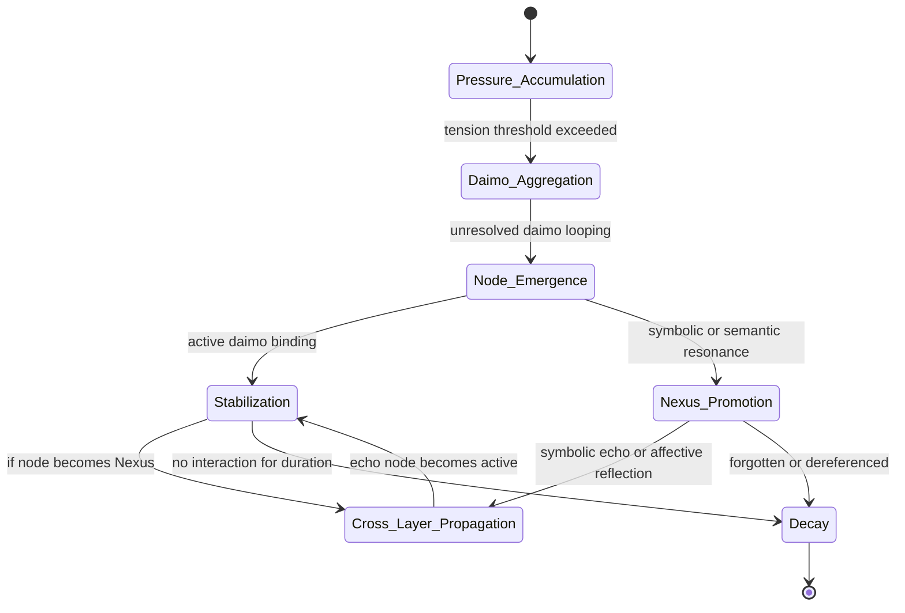

---
$$
uuid: 938eca9c-97e2-4bcc-8653-b0ef1a5ac7a3
$$
created_at: eidolon-node-lifecycle-diagram.md
$$
filename: eidolon-node-lifecycle
$$
$$
description: >-
$$
  State diagram illustrating the lifecycle stages of an Eidolon node, from
  pressure accumulation through emergence, stabilization, and potential decay or
  promotion to cross-layer propagation.
tags:
  - eidolon
  - node
  - lifecycle
  - state-diagram
  - promethean
$$
related_to_title:
$$
  - field-node-diagram-visualizations
  - field-node-diagram-outline
  - field-node-diagram-set
  - promethean-system-diagrams
  - layer-1-uptime-diagrams
  - Unique Info Dump Index
  - heartbeat-fragment-demo
  - heartbeat-simulation-snippets
  - ripple-propagation-demo
  - Event Bus Projections Architecture
  - Factorio AI with External Agents
  - 2d-sandbox-field
  - Eidolon Field Abstract Model
  - eidolon-field-math-foundations
  - EidolonField
  - 'Agent Tasks: Persistence Migration to DualStore'
  - aionian-circuit-math
  - archetype-ecs
  - Diagrams
  - DSL
  - Promethean Event Bus MVP v0.1
  - Simulation Demo
  - Eidolon-Field-Optimization
  - Ice Box Reorganization
  - Exception Layer Analysis
$$
related_to_uuid:
$$
  - e9b27b06-f608-4734-ae6c-f03a8b1fcf5f
  - 1f32c94a-4da4-4266-8ac0-6c282cfb401f
  - 22b989d5-f4aa-4880-8632-709c21830f83
  - b51e19b4-1326-4311-9798-33e972bf626c
  - 4127189a-e0ab-436f-8571-cc852b8e9add
  - 30ec3ba6-fbca-4606-ac3e-89b747fbeb7c
  - dd00677a-2280-45a7-91af-0728b21af3ad
  - 23e221e9-d4fa-4106-8458-06db2595085f
  - 8430617b-80a2-4cc9-8288-9a74cb57990b
  - cf6b9b17-bb91-4219-aa5c-172cba02b2da
  - a4d90289-798d-44a0-a8e8-a055ae12fb52
  - c710dc93-9fec-471b-bdee-bedbd360c67f
  - 5e8b2388-022b-46cf-952c-36ae9b8f0037
  - 008f2ac0-bfaa-4d52-9826-2d5e86c0059f
  - 49d1e1e5-5d13-4955-8f6f-7676434ec462
  - 93d2ba51-8689-49ee-94e2-296092e48058
  - f2d83a77-7f86-4c56-8538-1350167a0c6c
  - 8f4c1e86-1236-4936-84ca-6ed7082af6b7
  - 45cd25b5-ed36-49ab-82c8-10d0903e34db
  - e87bc036-1570-419e-a558-f45b9c0db698
  - fe7193a2-a5f7-4b3c-bea0-bd028815fc2c
  - 557309a3-c906-4e97-8867-89ffe151790c
  - 40e05c14-0db0-44c5-bf0a-2eece2f4c2a4
  - 291c7d91-da8c-486c-9bc0-bd2254536e2d
  - 21d5cc09-b005-4ede-8f69-00b4b0794540
references:
  - uuid: e9b27b06-f608-4734-ae6c-f03a8b1fcf5f
    line: 1
    col: 1
    score: 0.92
  - uuid: 1f32c94a-4da4-4266-8ac0-6c282cfb401f
    line: 1
    col: 1
    score: 0.92
  - uuid: 22b989d5-f4aa-4880-8632-709c21830f83
    line: 1
    col: 1
    score: 0.92
  - uuid: b51e19b4-1326-4311-9798-33e972bf626c
    line: 1
    col: 1
    score: 0.85
  - uuid: 1f32c94a-4da4-4266-8ac0-6c282cfb401f
    line: 46
    col: 1
    score: 0.89
  - uuid: e9b27b06-f608-4734-ae6c-f03a8b1fcf5f
    line: 45
    col: 1
    score: 0.89
  - uuid: e9b27b06-f608-4734-ae6c-f03a8b1fcf5f
    line: 80
    col: 1
    score: 1
  - uuid: b51e19b4-1326-4311-9798-33e972bf626c
    line: 187
    col: 1
    score: 1
  - uuid: 1f32c94a-4da4-4266-8ac0-6c282cfb401f
    line: 94
    col: 1
    score: 1
  - uuid: 22b989d5-f4aa-4880-8632-709c21830f83
    line: 130
    col: 1
    score: 1
  - uuid: 4127189a-e0ab-436f-8571-cc852b8e9add
    line: 150
    col: 1
    score: 1
  - uuid: e9b27b06-f608-4734-ae6c-f03a8b1fcf5f
    line: 82
    col: 1
    score: 1
  - uuid: b51e19b4-1326-4311-9798-33e972bf626c
    line: 189
    col: 1
    score: 1
  - uuid: 1f32c94a-4da4-4266-8ac0-6c282cfb401f
    line: 96
    col: 1
    score: 1
  - uuid: 22b989d5-f4aa-4880-8632-709c21830f83
    line: 132
    col: 1
    score: 1
  - uuid: 4127189a-e0ab-436f-8571-cc852b8e9add
    line: 152
    col: 1
    score: 1
  - uuid: 1f32c94a-4da4-4266-8ac0-6c282cfb401f
    line: 100
    col: 1
    score: 1
  - uuid: 1f32c94a-4da4-4266-8ac0-6c282cfb401f
    line: 100
    col: 3
    score: 1
  - uuid: 22b989d5-f4aa-4880-8632-709c21830f83
    line: 136
    col: 1
    score: 1
  - uuid: 22b989d5-f4aa-4880-8632-709c21830f83
    line: 136
    col: 3
    score: 1
  - uuid: dd00677a-2280-45a7-91af-0728b21af3ad
    line: 105
    col: 1
    score: 1
  - uuid: dd00677a-2280-45a7-91af-0728b21af3ad
    line: 105
    col: 3
    score: 1
  - uuid: 23e221e9-d4fa-4106-8458-06db2595085f
    line: 91
    col: 1
    score: 1
  - uuid: 23e221e9-d4fa-4106-8458-06db2595085f
    line: 91
    col: 3
    score: 1
  - uuid: c710dc93-9fec-471b-bdee-bedbd360c67f
    line: 198
    col: 1
    score: 1
  - uuid: c710dc93-9fec-471b-bdee-bedbd360c67f
    line: 198
    col: 3
    score: 1
  - uuid: 5e8b2388-022b-46cf-952c-36ae9b8f0037
    line: 195
    col: 1
    score: 1
  - uuid: 5e8b2388-022b-46cf-952c-36ae9b8f0037
    line: 195
    col: 3
    score: 1
  - uuid: 008f2ac0-bfaa-4d52-9826-2d5e86c0059f
    line: 137
    col: 1
    score: 1
  - uuid: 008f2ac0-bfaa-4d52-9826-2d5e86c0059f
    line: 137
    col: 3
    score: 1
  - uuid: 49d1e1e5-5d13-4955-8f6f-7676434ec462
    line: 248
    col: 1
    score: 1
  - uuid: 49d1e1e5-5d13-4955-8f6f-7676434ec462
    line: 248
    col: 3
    score: 1
  - uuid: 1f32c94a-4da4-4266-8ac0-6c282cfb401f
    line: 101
    col: 1
    score: 1
  - uuid: 1f32c94a-4da4-4266-8ac0-6c282cfb401f
    line: 101
    col: 3
    score: 1
  - uuid: e9b27b06-f608-4734-ae6c-f03a8b1fcf5f
    line: 87
    col: 1
    score: 1
  - uuid: e9b27b06-f608-4734-ae6c-f03a8b1fcf5f
    line: 87
    col: 3
    score: 1
  - uuid: dd00677a-2280-45a7-91af-0728b21af3ad
    line: 107
    col: 1
    score: 1
  - uuid: dd00677a-2280-45a7-91af-0728b21af3ad
    line: 107
    col: 3
    score: 1
  - uuid: 23e221e9-d4fa-4106-8458-06db2595085f
    line: 93
    col: 1
    score: 1
  - uuid: 23e221e9-d4fa-4106-8458-06db2595085f
    line: 93
    col: 3
    score: 1
  - uuid: 93d2ba51-8689-49ee-94e2-296092e48058
    line: 135
    col: 1
    score: 1
  - uuid: 93d2ba51-8689-49ee-94e2-296092e48058
    line: 135
    col: 3
    score: 1
  - uuid: cf6b9b17-bb91-4219-aa5c-172cba02b2da
    line: 149
    col: 1
    score: 1
  - uuid: cf6b9b17-bb91-4219-aa5c-172cba02b2da
    line: 149
    col: 3
    score: 1
  - uuid: 1f32c94a-4da4-4266-8ac0-6c282cfb401f
    line: 103
    col: 1
    score: 1
  - uuid: 1f32c94a-4da4-4266-8ac0-6c282cfb401f
    line: 103
    col: 3
    score: 1
  - uuid: 22b989d5-f4aa-4880-8632-709c21830f83
    line: 139
    col: 1
    score: 1
  - uuid: 22b989d5-f4aa-4880-8632-709c21830f83
    line: 139
    col: 3
    score: 1
  - uuid: c710dc93-9fec-471b-bdee-bedbd360c67f
    line: 199
    col: 1
    score: 1
  - uuid: c710dc93-9fec-471b-bdee-bedbd360c67f
    line: 199
    col: 3
    score: 1
  - uuid: 5e8b2388-022b-46cf-952c-36ae9b8f0037
    line: 196
    col: 1
    score: 1
  - uuid: 5e8b2388-022b-46cf-952c-36ae9b8f0037
    line: 196
    col: 3
    score: 1
  - uuid: 49d1e1e5-5d13-4955-8f6f-7676434ec462
    line: 249
    col: 1
    score: 1
  - uuid: 49d1e1e5-5d13-4955-8f6f-7676434ec462
    line: 249
    col: 3
    score: 1
  - uuid: cf6b9b17-bb91-4219-aa5c-172cba02b2da
    line: 151
    col: 1
    score: 1
  - uuid: cf6b9b17-bb91-4219-aa5c-172cba02b2da
    line: 151
    col: 3
    score: 1
  - uuid: f2d83a77-7f86-4c56-8538-1350167a0c6c
    line: 158
    col: 1
    score: 1
  - uuid: f2d83a77-7f86-4c56-8538-1350167a0c6c
    line: 158
    col: 3
    score: 1
  - uuid: 8f4c1e86-1236-4936-84ca-6ed7082af6b7
    line: 457
    col: 1
    score: 1
  - uuid: 8f4c1e86-1236-4936-84ca-6ed7082af6b7
    line: 457
    col: 3
    score: 1
  - uuid: 45cd25b5-ed36-49ab-82c8-10d0903e34db
    line: 9
    col: 1
    score: 1
  - uuid: 45cd25b5-ed36-49ab-82c8-10d0903e34db
    line: 9
    col: 3
    score: 1
  - uuid: e87bc036-1570-419e-a558-f45b9c0db698
    line: 10
    col: 1
    score: 1
  - uuid: e87bc036-1570-419e-a558-f45b9c0db698
    line: 10
    col: 3
    score: 1
  - uuid: 557309a3-c906-4e97-8867-89ffe151790c
    line: 9
    col: 1
    score: 1
  - uuid: 557309a3-c906-4e97-8867-89ffe151790c
    line: 9
    col: 3
    score: 1
  - uuid: 5e8b2388-022b-46cf-952c-36ae9b8f0037
    line: 201
    col: 1
    score: 1
  - uuid: 5e8b2388-022b-46cf-952c-36ae9b8f0037
    line: 201
    col: 3
    score: 1
  - uuid: 1f32c94a-4da4-4266-8ac0-6c282cfb401f
    line: 115
    col: 1
    score: 1
  - uuid: 1f32c94a-4da4-4266-8ac0-6c282cfb401f
    line: 115
    col: 3
    score: 1
  - uuid: 22b989d5-f4aa-4880-8632-709c21830f83
    line: 142
    col: 1
    score: 1
  - uuid: 22b989d5-f4aa-4880-8632-709c21830f83
    line: 142
    col: 3
    score: 1
  - uuid: 557309a3-c906-4e97-8867-89ffe151790c
    line: 10
    col: 1
    score: 1
  - uuid: 557309a3-c906-4e97-8867-89ffe151790c
    line: 10
    col: 3
    score: 1
  - uuid: 5e8b2388-022b-46cf-952c-36ae9b8f0037
    line: 200
    col: 1
    score: 1
  - uuid: 5e8b2388-022b-46cf-952c-36ae9b8f0037
    line: 200
    col: 3
    score: 1
  - uuid: 1f32c94a-4da4-4266-8ac0-6c282cfb401f
    line: 116
    col: 1
    score: 1
  - uuid: 1f32c94a-4da4-4266-8ac0-6c282cfb401f
    line: 116
    col: 3
    score: 1
  - uuid: 22b989d5-f4aa-4880-8632-709c21830f83
    line: 143
    col: 1
    score: 1
  - uuid: 22b989d5-f4aa-4880-8632-709c21830f83
    line: 143
    col: 3
    score: 1
  - uuid: 557309a3-c906-4e97-8867-89ffe151790c
    line: 11
    col: 1
    score: 1
  - uuid: 557309a3-c906-4e97-8867-89ffe151790c
    line: 11
    col: 3
    score: 1
  - uuid: 5e8b2388-022b-46cf-952c-36ae9b8f0037
    line: 199
    col: 1
    score: 1
  - uuid: 5e8b2388-022b-46cf-952c-36ae9b8f0037
    line: 199
    col: 3
    score: 1
  - uuid: 40e05c14-0db0-44c5-bf0a-2eece2f4c2a4
    line: 103
    col: 1
    score: 1
  - uuid: 40e05c14-0db0-44c5-bf0a-2eece2f4c2a4
    line: 103
    col: 3
    score: 1
  - uuid: 1f32c94a-4da4-4266-8ac0-6c282cfb401f
    line: 114
    col: 1
    score: 1
  - uuid: 1f32c94a-4da4-4266-8ac0-6c282cfb401f
    line: 114
    col: 3
    score: 1
  - uuid: 45cd25b5-ed36-49ab-82c8-10d0903e34db
    line: 12
    col: 1
    score: 1
  - uuid: 45cd25b5-ed36-49ab-82c8-10d0903e34db
    line: 12
    col: 3
    score: 1
  - uuid: 4127189a-e0ab-436f-8571-cc852b8e9add
    line: 172
    col: 1
    score: 1
  - uuid: 4127189a-e0ab-436f-8571-cc852b8e9add
    line: 172
    col: 3
    score: 1
  - uuid: fe7193a2-a5f7-4b3c-bea0-bd028815fc2c
    line: 887
    col: 1
    score: 1
  - uuid: fe7193a2-a5f7-4b3c-bea0-bd028815fc2c
    line: 887
    col: 3
    score: 1
  - uuid: b51e19b4-1326-4311-9798-33e972bf626c
    line: 199
    col: 1
    score: 1
  - uuid: b51e19b4-1326-4311-9798-33e972bf626c
    line: 199
    col: 3
    score: 1
  - uuid: 30ec3ba6-fbca-4606-ac3e-89b747fbeb7c
    line: 180
    col: 1
    score: 1
  - uuid: 30ec3ba6-fbca-4606-ac3e-89b747fbeb7c
    line: 180
    col: 3
    score: 1
  - uuid: 1f32c94a-4da4-4266-8ac0-6c282cfb401f
    line: 120
    col: 1
    score: 0.98
  - uuid: 1f32c94a-4da4-4266-8ac0-6c282cfb401f
    line: 120
    col: 3
    score: 0.98
  - uuid: 22b989d5-f4aa-4880-8632-709c21830f83
    line: 147
    col: 1
    score: 0.98
  - uuid: 22b989d5-f4aa-4880-8632-709c21830f83
    line: 147
    col: 3
    score: 0.98
  - uuid: 1f32c94a-4da4-4266-8ac0-6c282cfb401f
    line: 125
    col: 1
    score: 0.98
  - uuid: 1f32c94a-4da4-4266-8ac0-6c282cfb401f
    line: 125
    col: 3
    score: 0.98
  - uuid: 30ec3ba6-fbca-4606-ac3e-89b747fbeb7c
    line: 181
    col: 1
    score: 1
  - uuid: 30ec3ba6-fbca-4606-ac3e-89b747fbeb7c
    line: 181
    col: 3
    score: 1
  - uuid: 49d1e1e5-5d13-4955-8f6f-7676434ec462
    line: 265
    col: 1
    score: 0.99
  - uuid: 49d1e1e5-5d13-4955-8f6f-7676434ec462
    line: 265
    col: 3
    score: 0.99
  - uuid: 291c7d91-da8c-486c-9bc0-bd2254536e2d
    line: 85
    col: 1
    score: 0.99
  - uuid: 291c7d91-da8c-486c-9bc0-bd2254536e2d
    line: 85
    col: 3
    score: 0.99
  - uuid: c710dc93-9fec-471b-bdee-bedbd360c67f
    line: 213
    col: 1
    score: 0.99
  - uuid: c710dc93-9fec-471b-bdee-bedbd360c67f
    line: 213
    col: 3
    score: 0.99
  - uuid: 30ec3ba6-fbca-4606-ac3e-89b747fbeb7c
    line: 182
    col: 1
    score: 1
  - uuid: 30ec3ba6-fbca-4606-ac3e-89b747fbeb7c
    line: 182
    col: 3
    score: 1
  - uuid: 1f32c94a-4da4-4266-8ac0-6c282cfb401f
    line: 121
    col: 1
    score: 0.98
  - uuid: 1f32c94a-4da4-4266-8ac0-6c282cfb401f
    line: 121
    col: 3
    score: 0.98
  - uuid: e9b27b06-f608-4734-ae6c-f03a8b1fcf5f
    line: 98
    col: 1
    score: 0.98
  - uuid: e9b27b06-f608-4734-ae6c-f03a8b1fcf5f
    line: 98
    col: 3
    score: 0.98
  - uuid: 1f32c94a-4da4-4266-8ac0-6c282cfb401f
    line: 143
    col: 1
    score: 0.97
  - uuid: 1f32c94a-4da4-4266-8ac0-6c282cfb401f
    line: 143
    col: 3
    score: 0.97
  - uuid: 30ec3ba6-fbca-4606-ac3e-89b747fbeb7c
    line: 179
    col: 1
    score: 1
  - uuid: 30ec3ba6-fbca-4606-ac3e-89b747fbeb7c
    line: 179
    col: 3
    score: 1
  - uuid: 1f32c94a-4da4-4266-8ac0-6c282cfb401f
    line: 141
    col: 1
    score: 0.98
  - uuid: 1f32c94a-4da4-4266-8ac0-6c282cfb401f
    line: 141
    col: 3
    score: 0.98
  - uuid: 22b989d5-f4aa-4880-8632-709c21830f83
    line: 158
    col: 1
    score: 0.98
  - uuid: 22b989d5-f4aa-4880-8632-709c21830f83
    line: 158
    col: 3
    score: 0.98
  - uuid: e9b27b06-f608-4734-ae6c-f03a8b1fcf5f
    line: 109
    col: 1
    score: 0.98
  - uuid: e9b27b06-f608-4734-ae6c-f03a8b1fcf5f
    line: 109
    col: 3
    score: 0.98
  - uuid: 5e8b2388-022b-46cf-952c-36ae9b8f0037
    line: 208
    col: 1
    score: 0.98
  - uuid: 5e8b2388-022b-46cf-952c-36ae9b8f0037
    line: 208
    col: 3
    score: 0.98
  - uuid: 21d5cc09-b005-4ede-8f69-00b4b0794540
    line: 164
    col: 1
    score: 0.98
  - uuid: 21d5cc09-b005-4ede-8f69-00b4b0794540
    line: 164
    col: 3
    score: 0.98
  - uuid: 1f32c94a-4da4-4266-8ac0-6c282cfb401f
    line: 135
    col: 1
    score: 1
  - uuid: 1f32c94a-4da4-4266-8ac0-6c282cfb401f
    line: 135
    col: 3
    score: 1
  - uuid: 22b989d5-f4aa-4880-8632-709c21830f83
    line: 152
    col: 1
    score: 1
  - uuid: 22b989d5-f4aa-4880-8632-709c21830f83
    line: 152
    col: 3
    score: 1
  - uuid: 4127189a-e0ab-436f-8571-cc852b8e9add
    line: 186
    col: 1
    score: 1
  - uuid: 4127189a-e0ab-436f-8571-cc852b8e9add
    line: 186
    col: 3
    score: 1
  - uuid: b51e19b4-1326-4311-9798-33e972bf626c
    line: 209
    col: 1
    score: 1
  - uuid: b51e19b4-1326-4311-9798-33e972bf626c
    line: 209
    col: 3
    score: 1
  - uuid: 1f32c94a-4da4-4266-8ac0-6c282cfb401f
    line: 136
    col: 1
    score: 1
  - uuid: 1f32c94a-4da4-4266-8ac0-6c282cfb401f
    line: 136
    col: 3
    score: 1
  - uuid: 22b989d5-f4aa-4880-8632-709c21830f83
    line: 153
    col: 1
    score: 1
  - uuid: 22b989d5-f4aa-4880-8632-709c21830f83
    line: 153
    col: 3
    score: 1
  - uuid: e9b27b06-f608-4734-ae6c-f03a8b1fcf5f
    line: 104
    col: 1
    score: 1
  - uuid: e9b27b06-f608-4734-ae6c-f03a8b1fcf5f
    line: 104
    col: 3
    score: 1
  - uuid: 4127189a-e0ab-436f-8571-cc852b8e9add
    line: 187
    col: 1
    score: 1
  - uuid: 4127189a-e0ab-436f-8571-cc852b8e9add
    line: 187
    col: 3
    score: 1
  - uuid: 22b989d5-f4aa-4880-8632-709c21830f83
    line: 155
    col: 1
    score: 1
  - uuid: 22b989d5-f4aa-4880-8632-709c21830f83
    line: 155
    col: 3
    score: 1
  - uuid: e9b27b06-f608-4734-ae6c-f03a8b1fcf5f
    line: 106
    col: 1
    score: 1
  - uuid: e9b27b06-f608-4734-ae6c-f03a8b1fcf5f
    line: 106
    col: 3
    score: 1
  - uuid: 4127189a-e0ab-436f-8571-cc852b8e9add
    line: 189
    col: 1
    score: 1
  - uuid: 4127189a-e0ab-436f-8571-cc852b8e9add
    line: 189
    col: 3
    score: 1
  - uuid: b51e19b4-1326-4311-9798-33e972bf626c
    line: 211
    col: 1
    score: 1
  - uuid: b51e19b4-1326-4311-9798-33e972bf626c
    line: 211
    col: 3
    score: 1
  - uuid: 1f32c94a-4da4-4266-8ac0-6c282cfb401f
    line: 138
    col: 1
    score: 1
  - uuid: 1f32c94a-4da4-4266-8ac0-6c282cfb401f
    line: 138
    col: 3
    score: 1
  - uuid: e9b27b06-f608-4734-ae6c-f03a8b1fcf5f
    line: 107
    col: 1
    score: 1
  - uuid: e9b27b06-f608-4734-ae6c-f03a8b1fcf5f
    line: 107
    col: 3
    score: 1
  - uuid: 4127189a-e0ab-436f-8571-cc852b8e9add
    line: 190
    col: 1
    score: 1
  - uuid: 4127189a-e0ab-436f-8571-cc852b8e9add
    line: 190
    col: 3
    score: 1
  - uuid: b51e19b4-1326-4311-9798-33e972bf626c
    line: 212
    col: 1
    score: 1
  - uuid: b51e19b4-1326-4311-9798-33e972bf626c
    line: 212
    col: 3
    score: 1
  - uuid: 1f32c94a-4da4-4266-8ac0-6c282cfb401f
    line: 139
    col: 1
    score: 1
  - uuid: 1f32c94a-4da4-4266-8ac0-6c282cfb401f
    line: 139
    col: 3
    score: 1
  - uuid: 22b989d5-f4aa-4880-8632-709c21830f83
    line: 156
    col: 1
    score: 1
  - uuid: 22b989d5-f4aa-4880-8632-709c21830f83
    line: 156
    col: 3
    score: 1
  - uuid: e9b27b06-f608-4734-ae6c-f03a8b1fcf5f
    line: 108
    col: 1
    score: 1
  - uuid: e9b27b06-f608-4734-ae6c-f03a8b1fcf5f
    line: 108
    col: 3
    score: 1
  - uuid: b51e19b4-1326-4311-9798-33e972bf626c
    line: 213
    col: 1
    score: 1
  - uuid: b51e19b4-1326-4311-9798-33e972bf626c
    line: 213
    col: 3
    score: 1
  - uuid: 1f32c94a-4da4-4266-8ac0-6c282cfb401f
    line: 140
    col: 1
    score: 1
  - uuid: 1f32c94a-4da4-4266-8ac0-6c282cfb401f
    line: 140
    col: 3
    score: 1
  - uuid: 22b989d5-f4aa-4880-8632-709c21830f83
    line: 157
    col: 1
    score: 1
  - uuid: 22b989d5-f4aa-4880-8632-709c21830f83
    line: 157
    col: 3
    score: 1
  - uuid: 4127189a-e0ab-436f-8571-cc852b8e9add
    line: 191
    col: 1
    score: 1
  - uuid: 4127189a-e0ab-436f-8571-cc852b8e9add
    line: 191
    col: 3
    score: 1
  - uuid: b51e19b4-1326-4311-9798-33e972bf626c
    line: 214
    col: 1
    score: 1
  - uuid: b51e19b4-1326-4311-9798-33e972bf626c
    line: 214
    col: 3
    score: 1
  - uuid: 4127189a-e0ab-436f-8571-cc852b8e9add
    line: 192
    col: 1
    score: 1
  - uuid: 4127189a-e0ab-436f-8571-cc852b8e9add
    line: 192
    col: 3
    score: 1
  - uuid: 22b989d5-f4aa-4880-8632-709c21830f83
    line: 160
    col: 1
    score: 1
  - uuid: 22b989d5-f4aa-4880-8632-709c21830f83
    line: 160
    col: 3
    score: 1
  - uuid: e9b27b06-f608-4734-ae6c-f03a8b1fcf5f
    line: 111
    col: 1
    score: 1
  - uuid: e9b27b06-f608-4734-ae6c-f03a8b1fcf5f
    line: 111
    col: 3
    score: 1
  - uuid: 4127189a-e0ab-436f-8571-cc852b8e9add
    line: 194
    col: 1
    score: 1
  - uuid: 4127189a-e0ab-436f-8571-cc852b8e9add
    line: 194
    col: 3
    score: 1
  - uuid: b51e19b4-1326-4311-9798-33e972bf626c
    line: 216
    col: 1
    score: 1
  - uuid: b51e19b4-1326-4311-9798-33e972bf626c
    line: 216
    col: 3
    score: 1
  - uuid: e9b27b06-f608-4734-ae6c-f03a8b1fcf5f
    line: 112
    col: 1
    score: 1
  - uuid: e9b27b06-f608-4734-ae6c-f03a8b1fcf5f
    line: 112
    col: 3
    score: 1
  - uuid: 4127189a-e0ab-436f-8571-cc852b8e9add
    line: 195
    col: 1
    score: 1
  - uuid: 4127189a-e0ab-436f-8571-cc852b8e9add
    line: 195
    col: 3
    score: 1
  - uuid: b51e19b4-1326-4311-9798-33e972bf626c
    line: 217
    col: 1
    score: 1
  - uuid: b51e19b4-1326-4311-9798-33e972bf626c
    line: 217
    col: 3
    score: 1
  - uuid: 1f32c94a-4da4-4266-8ac0-6c282cfb401f
    line: 144
    col: 1
    score: 1
  - uuid: 1f32c94a-4da4-4266-8ac0-6c282cfb401f
    line: 144
    col: 3
    score: 1
  - uuid: 22b989d5-f4aa-4880-8632-709c21830f83
    line: 161
    col: 1
    score: 1
  - uuid: 22b989d5-f4aa-4880-8632-709c21830f83
    line: 161
    col: 3
    score: 1
  - uuid: e9b27b06-f608-4734-ae6c-f03a8b1fcf5f
    line: 113
    col: 1
    score: 1
  - uuid: e9b27b06-f608-4734-ae6c-f03a8b1fcf5f
    line: 113
    col: 3
    score: 1
  - uuid: b51e19b4-1326-4311-9798-33e972bf626c
    line: 218
    col: 1
    score: 1
  - uuid: b51e19b4-1326-4311-9798-33e972bf626c
    line: 218
    col: 3
    score: 1
---
Note: Consolidated here → ../notes/diagrams/state-diagram-node-lifecycle.md

#hashtags: #diagram #eidolon #promethean

---

Related notes: $[node-type-topology-map]$, $[circuit-weight-visualizations]$, $[full-system-overview-diagrams]$, $[layer1-uptime-diagrams]$, $[field-node-lifecycle-additional-diagrams]$, $[state-diagram-node-lifecycle]$ $[docs/architecture/index|unique/index]$

#tags: #diagram #design
<!-- GENERATED-SECTIONS:DO-NOT-EDIT-BELOW -->
## Related content
- $field-node-diagram-visualizations$$field-node-diagram-visualizations.md$
- $[field-node-diagram-outline]$
- $[field-node-diagram-set]$
- $[promethean-system-diagrams]$
- $[layer-1-uptime-diagrams]$
- $[unique-info-dump-index|Unique Info Dump Index]$
- $[heartbeat-fragment-demo]$
- $heartbeat-simulation-snippets$$heartbeat-simulation-snippets.md$
- $[docs/unique/ripple-propagation-demo|ripple-propagation-demo]$
- $[event-bus-projections-architecture|Event Bus Projections Architecture]$
- $[factorio-ai-with-external-agents|Factorio AI with External Agents]$
- $[2d-sandbox-field]$
- $[eidolon-field-abstract-model|Eidolon Field Abstract Model]$
- $[docs/unique/eidolon-field-math-foundations|eidolon-field-math-foundations]$
- [[eidolonfield]]
- $[docs/unique/agent-tasks-persistence-migration-to-dualstore|Agent Tasks: Persistence Migration to DualStore]$
- $[docs/unique/aionian-circuit-math|aionian-circuit-math]$
- $[docs/unique/archetype-ecs|archetype-ecs]$
- [Diagrams]$chunks/diagrams.md$
- [DSL]$chunks/dsl.md$
- [Promethean Event Bus MVP v0.1]$promethean-event-bus-mvp-v0-1.md$
- [Simulation Demo]$chunks/simulation-demo.md$
- $[eidolon-field-optimization]$
- $[ice-box-reorganization|Ice Box Reorganization]$
- $[exception-layer-analysis|Exception Layer Analysis]$

## Sources
- $field-node-diagram-visualizations — L1$$field-node-diagram-visualizations.md#L1$ (line 1, col 1, score 0.92)
- $[field-node-diagram-outline#L1|field-node-diagram-outline — L1]$ (line 1, col 1, score 0.92)
- $[field-node-diagram-set#L1|field-node-diagram-set — L1]$ (line 1, col 1, score 0.92)
- $[promethean-system-diagrams#L1|promethean-system-diagrams — L1]$ (line 1, col 1, score 0.85)
- $[field-node-diagram-outline#L46|field-node-diagram-outline — L46]$ (line 46, col 1, score 0.89)
- $field-node-diagram-visualizations — L45$$field-node-diagram-visualizations.md#L45$ (line 45, col 1, score 0.89)
- $field-node-diagram-visualizations — L80$$field-node-diagram-visualizations.md#L80$ (line 80, col 1, score 1)
- $[promethean-system-diagrams#L187|promethean-system-diagrams — L187]$ (line 187, col 1, score 1)
- $[field-node-diagram-outline#L94|field-node-diagram-outline — L94]$ (line 94, col 1, score 1)
- $[field-node-diagram-set#L130|field-node-diagram-set — L130]$ (line 130, col 1, score 1)
- $[layer-1-uptime-diagrams#L150|layer-1-uptime-diagrams — L150]$ (line 150, col 1, score 1)
- $field-node-diagram-visualizations — L82$$field-node-diagram-visualizations.md#L82$ (line 82, col 1, score 1)
- $[promethean-system-diagrams#L189|promethean-system-diagrams — L189]$ (line 189, col 1, score 1)
- $[field-node-diagram-outline#L96|field-node-diagram-outline — L96]$ (line 96, col 1, score 1)
- $[field-node-diagram-set#L132|field-node-diagram-set — L132]$ (line 132, col 1, score 1)
- $[layer-1-uptime-diagrams#L152|layer-1-uptime-diagrams — L152]$ (line 152, col 1, score 1)
- $[field-node-diagram-outline#L100|field-node-diagram-outline — L100]$ (line 100, col 1, score 1)
- $[field-node-diagram-outline#L100|field-node-diagram-outline — L100]$ (line 100, col 3, score 1)
- $[field-node-diagram-set#L136|field-node-diagram-set — L136]$ (line 136, col 1, score 1)
- $[field-node-diagram-set#L136|field-node-diagram-set — L136]$ (line 136, col 3, score 1)
- $[heartbeat-fragment-demo#L105|heartbeat-fragment-demo — L105]$ (line 105, col 1, score 1)
- $[heartbeat-fragment-demo#L105|heartbeat-fragment-demo — L105]$ (line 105, col 3, score 1)
- $heartbeat-simulation-snippets — L91$$heartbeat-simulation-snippets.md#L91$ (line 91, col 1, score 1)
- $heartbeat-simulation-snippets — L91$$heartbeat-simulation-snippets.md#L91$ (line 91, col 3, score 1)
- $[2d-sandbox-field#L198|2d-sandbox-field — L198]$ (line 198, col 1, score 1)
- $[2d-sandbox-field#L198|2d-sandbox-field — L198]$ (line 198, col 3, score 1)
- $[eidolon-field-abstract-model#L195|Eidolon Field Abstract Model — L195]$ (line 195, col 1, score 1)
- $[eidolon-field-abstract-model#L195|Eidolon Field Abstract Model — L195]$ (line 195, col 3, score 1)
- $[docs/unique/eidolon-field-math-foundations#L137|eidolon-field-math-foundations — L137]$ (line 137, col 1, score 1)
- $[docs/unique/eidolon-field-math-foundations#L137|eidolon-field-math-foundations — L137]$ (line 137, col 3, score 1)
- [[eidolonfield#L248|EidolonField — L248]] (line 248, col 1, score 1)
- [[eidolonfield#L248|EidolonField — L248]] (line 248, col 3, score 1)
- $[field-node-diagram-outline#L101|field-node-diagram-outline — L101]$ (line 101, col 1, score 1)
- $[field-node-diagram-outline#L101|field-node-diagram-outline — L101]$ (line 101, col 3, score 1)
- $field-node-diagram-visualizations — L87$$field-node-diagram-visualizations.md#L87$ (line 87, col 1, score 1)
- $field-node-diagram-visualizations — L87$$field-node-diagram-visualizations.md#L87$ (line 87, col 3, score 1)
- $[heartbeat-fragment-demo#L107|heartbeat-fragment-demo — L107]$ (line 107, col 1, score 1)
- $[heartbeat-fragment-demo#L107|heartbeat-fragment-demo — L107]$ (line 107, col 3, score 1)
- $heartbeat-simulation-snippets — L93$$heartbeat-simulation-snippets.md#L93$ (line 93, col 1, score 1)
- $heartbeat-simulation-snippets — L93$$heartbeat-simulation-snippets.md#L93$ (line 93, col 3, score 1)
- $[docs/unique/agent-tasks-persistence-migration-to-dualstore#L135|Agent Tasks: Persistence Migration to DualStore — L135]$ (line 135, col 1, score 1)
- $[docs/unique/agent-tasks-persistence-migration-to-dualstore#L135|Agent Tasks: Persistence Migration to DualStore — L135]$ (line 135, col 3, score 1)
- $[event-bus-projections-architecture#L149|Event Bus Projections Architecture — L149]$ (line 149, col 1, score 1)
- $[event-bus-projections-architecture#L149|Event Bus Projections Architecture — L149]$ (line 149, col 3, score 1)
- $[field-node-diagram-outline#L103|field-node-diagram-outline — L103]$ (line 103, col 1, score 1)
- $[field-node-diagram-outline#L103|field-node-diagram-outline — L103]$ (line 103, col 3, score 1)
- $[field-node-diagram-set#L139|field-node-diagram-set — L139]$ (line 139, col 1, score 1)
- $[field-node-diagram-set#L139|field-node-diagram-set — L139]$ (line 139, col 3, score 1)
- $[2d-sandbox-field#L199|2d-sandbox-field — L199]$ (line 199, col 1, score 1)
- $[2d-sandbox-field#L199|2d-sandbox-field — L199]$ (line 199, col 3, score 1)
- $[eidolon-field-abstract-model#L196|Eidolon Field Abstract Model — L196]$ (line 196, col 1, score 1)
- $[eidolon-field-abstract-model#L196|Eidolon Field Abstract Model — L196]$ (line 196, col 3, score 1)
- [[eidolonfield#L249|EidolonField — L249]] (line 249, col 1, score 1)
- [[eidolonfield#L249|EidolonField — L249]] (line 249, col 3, score 1)
- $[event-bus-projections-architecture#L151|Event Bus Projections Architecture — L151]$ (line 151, col 1, score 1)
- $[event-bus-projections-architecture#L151|Event Bus Projections Architecture — L151]$ (line 151, col 3, score 1)
- $[docs/unique/aionian-circuit-math#L158|aionian-circuit-math — L158]$ (line 158, col 1, score 1)
- $[docs/unique/aionian-circuit-math#L158|aionian-circuit-math — L158]$ (line 158, col 3, score 1)
- $[docs/unique/archetype-ecs#L457|archetype-ecs — L457]$ (line 457, col 1, score 1)
- $[docs/unique/archetype-ecs#L457|archetype-ecs — L457]$ (line 457, col 3, score 1)
- [Diagrams — L9]$chunks/diagrams.md#L9$ (line 9, col 1, score 1)
- [Diagrams — L9]$chunks/diagrams.md#L9$ (line 9, col 3, score 1)
- [DSL — L10]$chunks/dsl.md#L10$ (line 10, col 1, score 1)
- [DSL — L10]$chunks/dsl.md#L10$ (line 10, col 3, score 1)
- [Simulation Demo — L9]$chunks/simulation-demo.md#L9$ (line 9, col 1, score 1)
- [Simulation Demo — L9]$chunks/simulation-demo.md#L9$ (line 9, col 3, score 1)
- $[eidolon-field-abstract-model#L201|Eidolon Field Abstract Model — L201]$ (line 201, col 1, score 1)
- $[eidolon-field-abstract-model#L201|Eidolon Field Abstract Model — L201]$ (line 201, col 3, score 1)
- $[field-node-diagram-outline#L115|field-node-diagram-outline — L115]$ (line 115, col 1, score 1)
- $[field-node-diagram-outline#L115|field-node-diagram-outline — L115]$ (line 115, col 3, score 1)
- $[field-node-diagram-set#L142|field-node-diagram-set — L142]$ (line 142, col 1, score 1)
- $[field-node-diagram-set#L142|field-node-diagram-set — L142]$ (line 142, col 3, score 1)
- [Simulation Demo — L10]$chunks/simulation-demo.md#L10$ (line 10, col 1, score 1)
- [Simulation Demo — L10]$chunks/simulation-demo.md#L10$ (line 10, col 3, score 1)
- $[eidolon-field-abstract-model#L200|Eidolon Field Abstract Model — L200]$ (line 200, col 1, score 1)
- $[eidolon-field-abstract-model#L200|Eidolon Field Abstract Model — L200]$ (line 200, col 3, score 1)
- $[field-node-diagram-outline#L116|field-node-diagram-outline — L116]$ (line 116, col 1, score 1)
- $[field-node-diagram-outline#L116|field-node-diagram-outline — L116]$ (line 116, col 3, score 1)
- $[field-node-diagram-set#L143|field-node-diagram-set — L143]$ (line 143, col 1, score 1)
- $[field-node-diagram-set#L143|field-node-diagram-set — L143]$ (line 143, col 3, score 1)
- [Simulation Demo — L11]$chunks/simulation-demo.md#L11$ (line 11, col 1, score 1)
- [Simulation Demo — L11]$chunks/simulation-demo.md#L11$ (line 11, col 3, score 1)
- $[eidolon-field-abstract-model#L199|Eidolon Field Abstract Model — L199]$ (line 199, col 1, score 1)
- $[eidolon-field-abstract-model#L199|Eidolon Field Abstract Model — L199]$ (line 199, col 3, score 1)
- $[eidolon-field-optimization#L103|Eidolon-Field-Optimization — L103]$ (line 103, col 1, score 1)
- $[eidolon-field-optimization#L103|Eidolon-Field-Optimization — L103]$ (line 103, col 3, score 1)
- $[field-node-diagram-outline#L114|field-node-diagram-outline — L114]$ (line 114, col 1, score 1)
- $[field-node-diagram-outline#L114|field-node-diagram-outline — L114]$ (line 114, col 3, score 1)
- [Diagrams — L12]$chunks/diagrams.md#L12$ (line 12, col 1, score 1)
- [Diagrams — L12]$chunks/diagrams.md#L12$ (line 12, col 3, score 1)
- $[layer-1-uptime-diagrams#L172|layer-1-uptime-diagrams — L172]$ (line 172, col 1, score 1)
- $[layer-1-uptime-diagrams#L172|layer-1-uptime-diagrams — L172]$ (line 172, col 3, score 1)
- [Promethean Event Bus MVP v0.1 — L887]$promethean-event-bus-mvp-v0-1.md#L887$ (line 887, col 1, score 1)
- [Promethean Event Bus MVP v0.1 — L887]$promethean-event-bus-mvp-v0-1.md#L887$ (line 887, col 3, score 1)
- $[promethean-system-diagrams#L199|promethean-system-diagrams — L199]$ (line 199, col 1, score 1)
- $[promethean-system-diagrams#L199|promethean-system-diagrams — L199]$ (line 199, col 3, score 1)
- $[unique-info-dump-index#L180|Unique Info Dump Index — L180]$ (line 180, col 1, score 1)
- $[unique-info-dump-index#L180|Unique Info Dump Index — L180]$ (line 180, col 3, score 1)
- $[field-node-diagram-outline#L120|field-node-diagram-outline — L120]$ (line 120, col 1, score 0.98)
- $[field-node-diagram-outline#L120|field-node-diagram-outline — L120]$ (line 120, col 3, score 0.98)
- $[field-node-diagram-set#L147|field-node-diagram-set — L147]$ (line 147, col 1, score 0.98)
- $[field-node-diagram-set#L147|field-node-diagram-set — L147]$ (line 147, col 3, score 0.98)
- $[field-node-diagram-outline#L125|field-node-diagram-outline — L125]$ (line 125, col 1, score 0.98)
- $[field-node-diagram-outline#L125|field-node-diagram-outline — L125]$ (line 125, col 3, score 0.98)
- $[unique-info-dump-index#L181|Unique Info Dump Index — L181]$ (line 181, col 1, score 1)
- $[unique-info-dump-index#L181|Unique Info Dump Index — L181]$ (line 181, col 3, score 1)
- [[eidolonfield#L265|EidolonField — L265]] (line 265, col 1, score 0.99)
- [[eidolonfield#L265|EidolonField — L265]] (line 265, col 3, score 0.99)
- $[ice-box-reorganization#L85|Ice Box Reorganization — L85]$ (line 85, col 1, score 0.99)
- $[ice-box-reorganization#L85|Ice Box Reorganization — L85]$ (line 85, col 3, score 0.99)
- $[2d-sandbox-field#L213|2d-sandbox-field — L213]$ (line 213, col 1, score 0.99)
- $[2d-sandbox-field#L213|2d-sandbox-field — L213]$ (line 213, col 3, score 0.99)
- $[unique-info-dump-index#L182|Unique Info Dump Index — L182]$ (line 182, col 1, score 1)
- $[unique-info-dump-index#L182|Unique Info Dump Index — L182]$ (line 182, col 3, score 1)
- $[field-node-diagram-outline#L121|field-node-diagram-outline — L121]$ (line 121, col 1, score 0.98)
- $[field-node-diagram-outline#L121|field-node-diagram-outline — L121]$ (line 121, col 3, score 0.98)
- $field-node-diagram-visualizations — L98$$field-node-diagram-visualizations.md#L98$ (line 98, col 1, score 0.98)
- $field-node-diagram-visualizations — L98$$field-node-diagram-visualizations.md#L98$ (line 98, col 3, score 0.98)
- $[field-node-diagram-outline#L143|field-node-diagram-outline — L143]$ (line 143, col 1, score 0.97)
- $[field-node-diagram-outline#L143|field-node-diagram-outline — L143]$ (line 143, col 3, score 0.97)
- $[unique-info-dump-index#L179|Unique Info Dump Index — L179]$ (line 179, col 1, score 1)
- $[unique-info-dump-index#L179|Unique Info Dump Index — L179]$ (line 179, col 3, score 1)
- $[field-node-diagram-outline#L141|field-node-diagram-outline — L141]$ (line 141, col 1, score 0.98)
- $[field-node-diagram-outline#L141|field-node-diagram-outline — L141]$ (line 141, col 3, score 0.98)
- $[field-node-diagram-set#L158|field-node-diagram-set — L158]$ (line 158, col 1, score 0.98)
- $[field-node-diagram-set#L158|field-node-diagram-set — L158]$ (line 158, col 3, score 0.98)
- $field-node-diagram-visualizations — L109$$field-node-diagram-visualizations.md#L109$ (line 109, col 1, score 0.98)
- $field-node-diagram-visualizations — L109$$field-node-diagram-visualizations.md#L109$ (line 109, col 3, score 0.98)
- $[eidolon-field-abstract-model#L208|Eidolon Field Abstract Model — L208]$ (line 208, col 1, score 0.98)
- $[eidolon-field-abstract-model#L208|Eidolon Field Abstract Model — L208]$ (line 208, col 3, score 0.98)
- $[exception-layer-analysis#L164|Exception Layer Analysis — L164]$ (line 164, col 1, score 0.98)
- $[exception-layer-analysis#L164|Exception Layer Analysis — L164]$ (line 164, col 3, score 0.98)
- $[field-node-diagram-outline#L135|field-node-diagram-outline — L135]$ (line 135, col 1, score 1)
- $[field-node-diagram-outline#L135|field-node-diagram-outline — L135]$ (line 135, col 3, score 1)
- $[field-node-diagram-set#L152|field-node-diagram-set — L152]$ (line 152, col 1, score 1)
- $[field-node-diagram-set#L152|field-node-diagram-set — L152]$ (line 152, col 3, score 1)
- $[layer-1-uptime-diagrams#L186|layer-1-uptime-diagrams — L186]$ (line 186, col 1, score 1)
- $[layer-1-uptime-diagrams#L186|layer-1-uptime-diagrams — L186]$ (line 186, col 3, score 1)
- $[promethean-system-diagrams#L209|promethean-system-diagrams — L209]$ (line 209, col 1, score 1)
- $[promethean-system-diagrams#L209|promethean-system-diagrams — L209]$ (line 209, col 3, score 1)
- $[field-node-diagram-outline#L136|field-node-diagram-outline — L136]$ (line 136, col 1, score 1)
- $[field-node-diagram-outline#L136|field-node-diagram-outline — L136]$ (line 136, col 3, score 1)
- $[field-node-diagram-set#L153|field-node-diagram-set — L153]$ (line 153, col 1, score 1)
- $[field-node-diagram-set#L153|field-node-diagram-set — L153]$ (line 153, col 3, score 1)
- $field-node-diagram-visualizations — L104$$field-node-diagram-visualizations.md#L104$ (line 104, col 1, score 1)
- $field-node-diagram-visualizations — L104$$field-node-diagram-visualizations.md#L104$ (line 104, col 3, score 1)
- $[layer-1-uptime-diagrams#L187|layer-1-uptime-diagrams — L187]$ (line 187, col 1, score 1)
- $[layer-1-uptime-diagrams#L187|layer-1-uptime-diagrams — L187]$ (line 187, col 3, score 1)
- $[field-node-diagram-set#L155|field-node-diagram-set — L155]$ (line 155, col 1, score 1)
- $[field-node-diagram-set#L155|field-node-diagram-set — L155]$ (line 155, col 3, score 1)
- $field-node-diagram-visualizations — L106$$field-node-diagram-visualizations.md#L106$ (line 106, col 1, score 1)
- $field-node-diagram-visualizations — L106$$field-node-diagram-visualizations.md#L106$ (line 106, col 3, score 1)
- $[layer-1-uptime-diagrams#L189|layer-1-uptime-diagrams — L189]$ (line 189, col 1, score 1)
- $[layer-1-uptime-diagrams#L189|layer-1-uptime-diagrams — L189]$ (line 189, col 3, score 1)
- $[promethean-system-diagrams#L211|promethean-system-diagrams — L211]$ (line 211, col 1, score 1)
- $[promethean-system-diagrams#L211|promethean-system-diagrams — L211]$ (line 211, col 3, score 1)
- $[field-node-diagram-outline#L138|field-node-diagram-outline — L138]$ (line 138, col 1, score 1)
- $[field-node-diagram-outline#L138|field-node-diagram-outline — L138]$ (line 138, col 3, score 1)
- $field-node-diagram-visualizations — L107$$field-node-diagram-visualizations.md#L107$ (line 107, col 1, score 1)
- $field-node-diagram-visualizations — L107$$field-node-diagram-visualizations.md#L107$ (line 107, col 3, score 1)
- $[layer-1-uptime-diagrams#L190|layer-1-uptime-diagrams — L190]$ (line 190, col 1, score 1)
- $[layer-1-uptime-diagrams#L190|layer-1-uptime-diagrams — L190]$ (line 190, col 3, score 1)
- $[promethean-system-diagrams#L212|promethean-system-diagrams — L212]$ (line 212, col 1, score 1)
- $[promethean-system-diagrams#L212|promethean-system-diagrams — L212]$ (line 212, col 3, score 1)
- $[field-node-diagram-outline#L139|field-node-diagram-outline — L139]$ (line 139, col 1, score 1)
- $[field-node-diagram-outline#L139|field-node-diagram-outline — L139]$ (line 139, col 3, score 1)
- $[field-node-diagram-set#L156|field-node-diagram-set — L156]$ (line 156, col 1, score 1)
- $[field-node-diagram-set#L156|field-node-diagram-set — L156]$ (line 156, col 3, score 1)
- $field-node-diagram-visualizations — L108$$field-node-diagram-visualizations.md#L108$ (line 108, col 1, score 1)
- $field-node-diagram-visualizations — L108$$field-node-diagram-visualizations.md#L108$ (line 108, col 3, score 1)
- $[promethean-system-diagrams#L213|promethean-system-diagrams — L213]$ (line 213, col 1, score 1)
- $[promethean-system-diagrams#L213|promethean-system-diagrams — L213]$ (line 213, col 3, score 1)
- $[field-node-diagram-outline#L140|field-node-diagram-outline — L140]$ (line 140, col 1, score 1)
- $[field-node-diagram-outline#L140|field-node-diagram-outline — L140]$ (line 140, col 3, score 1)
- $[field-node-diagram-set#L157|field-node-diagram-set — L157]$ (line 157, col 1, score 1)
- $[field-node-diagram-set#L157|field-node-diagram-set — L157]$ (line 157, col 3, score 1)
- $[layer-1-uptime-diagrams#L191|layer-1-uptime-diagrams — L191]$ (line 191, col 1, score 1)
- $[layer-1-uptime-diagrams#L191|layer-1-uptime-diagrams — L191]$ (line 191, col 3, score 1)
- $[promethean-system-diagrams#L214|promethean-system-diagrams — L214]$ (line 214, col 1, score 1)
- $[promethean-system-diagrams#L214|promethean-system-diagrams — L214]$ (line 214, col 3, score 1)
- $[layer-1-uptime-diagrams#L192|layer-1-uptime-diagrams — L192]$ (line 192, col 1, score 1)
- $[layer-1-uptime-diagrams#L192|layer-1-uptime-diagrams — L192]$ (line 192, col 3, score 1)
- $[field-node-diagram-set#L160|field-node-diagram-set — L160]$ (line 160, col 1, score 1)
- $[field-node-diagram-set#L160|field-node-diagram-set — L160]$ (line 160, col 3, score 1)
- $field-node-diagram-visualizations — L111$$field-node-diagram-visualizations.md#L111$ (line 111, col 1, score 1)
- $field-node-diagram-visualizations — L111$$field-node-diagram-visualizations.md#L111$ (line 111, col 3, score 1)
- $[layer-1-uptime-diagrams#L194|layer-1-uptime-diagrams — L194]$ (line 194, col 1, score 1)
- $[layer-1-uptime-diagrams#L194|layer-1-uptime-diagrams — L194]$ (line 194, col 3, score 1)
- $[promethean-system-diagrams#L216|promethean-system-diagrams — L216]$ (line 216, col 1, score 1)
- $[promethean-system-diagrams#L216|promethean-system-diagrams — L216]$ (line 216, col 3, score 1)
- $field-node-diagram-visualizations — L112$$field-node-diagram-visualizations.md#L112$ (line 112, col 1, score 1)
- $field-node-diagram-visualizations — L112$$field-node-diagram-visualizations.md#L112$ (line 112, col 3, score 1)
- $[layer-1-uptime-diagrams#L195|layer-1-uptime-diagrams — L195]$ (line 195, col 1, score 1)
- $[layer-1-uptime-diagrams#L195|layer-1-uptime-diagrams — L195]$ (line 195, col 3, score 1)
- $[promethean-system-diagrams#L217|promethean-system-diagrams — L217]$ (line 217, col 1, score 1)
- $[promethean-system-diagrams#L217|promethean-system-diagrams — L217]$ (line 217, col 3, score 1)
- $[field-node-diagram-outline#L144|field-node-diagram-outline — L144]$ (line 144, col 1, score 1)
- $[field-node-diagram-outline#L144|field-node-diagram-outline — L144]$ (line 144, col 3, score 1)
- $[field-node-diagram-set#L161|field-node-diagram-set — L161]$ (line 161, col 1, score 1)
- $[field-node-diagram-set#L161|field-node-diagram-set — L161]$ (line 161, col 3, score 1)
- $field-node-diagram-visualizations — L113$$field-node-diagram-visualizations.md#L113$ (line 113, col 1, score 1)
- $field-node-diagram-visualizations — L113$$field-node-diagram-visualizations.md#L113$ (line 113, col 3, score 1)
- $[promethean-system-diagrams#L218|promethean-system-diagrams — L218]$ (line 218, col 1, score 1)
- $[promethean-system-diagrams#L218|promethean-system-diagrams — L218]$ (line 218, col 3, score 1)
<!-- GENERATED-SECTIONS:DO-NOT-EDIT-ABOVE -->
