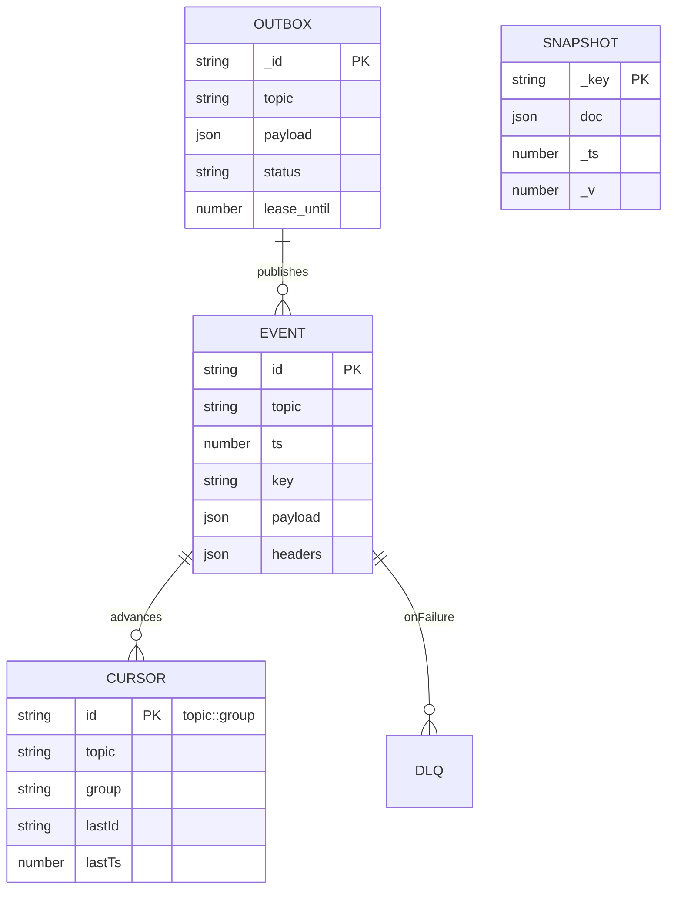

---
$$
uuid: cf6b9b17-bb91-4219-aa5c-172cba02b2da
$$
$$
created_at: 2025.08.08.20.08.43.md
$$
filename: Event Bus Projections Architecture
$$
description: >-
$$
  Visualizes event-driven architecture with producers, event hub, event store,
  stream processing, and read models. Shows data flow from service events to
  snapshots and changefeeds.
tags:
  - event bus
  - projections
  - event store
  - stream processing
  - read models
  - event-driven
  - mongodb
  - event projections
$$
related_to_title:
$$
  - Diagrams
  - Unique Info Dump Index
  - promethean-system-diagrams
  - Promethean Event Bus MVP v0.1
  - layer-1-uptime-diagrams
  - eidolon-node-lifecycle
  - archetype-ecs
  - field-node-diagram-outline
  - aionian-circuit-math
  - DSL
  - 'Agent Tasks: Persistence Migration to DualStore'
  - field-node-diagram-set
  - Event Bus MVP
  - Chroma Toolkit Consolidation Plan
  - Fnord Tracer Protocol
  - 2d-sandbox-field
  - Eidolon Field Abstract Model
  - EidolonField
  - Synchronicity Waves and Web
  - Shared
  - infinite_depth_smoke_animation
  - Factorio AI with External Agents
  - field-node-diagram-visualizations
  - AI-Centric OS with MCP Layer
  - AI-First-OS-Model-Context-Protocol
  - balanced-bst
$$
related_to_uuid:
$$
  - 45cd25b5-ed36-49ab-82c8-10d0903e34db
  - 30ec3ba6-fbca-4606-ac3e-89b747fbeb7c
  - b51e19b4-1326-4311-9798-33e972bf626c
  - fe7193a2-a5f7-4b3c-bea0-bd028815fc2c
  - 4127189a-e0ab-436f-8571-cc852b8e9add
  - 938eca9c-97e2-4bcc-8653-b0ef1a5ac7a3
  - 8f4c1e86-1236-4936-84ca-6ed7082af6b7
  - 1f32c94a-4da4-4266-8ac0-6c282cfb401f
  - f2d83a77-7f86-4c56-8538-1350167a0c6c
  - e87bc036-1570-419e-a558-f45b9c0db698
  - 93d2ba51-8689-49ee-94e2-296092e48058
  - 22b989d5-f4aa-4880-8632-709c21830f83
  - 534fe91d-e87d-4cc7-b0e7-8b6833353d9b
  - 5020e892-8f18-443a-b707-6d0f3efcfe22
  - fc21f824-4244-4030-a48e-c4170160ea1d
  - c710dc93-9fec-471b-bdee-bedbd360c67f
  - 5e8b2388-022b-46cf-952c-36ae9b8f0037
  - 49d1e1e5-5d13-4955-8f6f-7676434ec462
  - 91295f3a-a2af-4050-a2b8-4777ea70c32c
  - 623a55f7-685c-486b-abaf-469da1bbbb69
  - 92a052a5-3351-4898-8cab-758181a86adb
  - a4d90289-798d-44a0-a8e8-a055ae12fb52
  - e9b27b06-f608-4734-ae6c-f03a8b1fcf5f
  - 0f1f8cc1-b5a6-4307-a40d-78de3adafca2
  - 618198f4-cfad-4677-9df6-0640d8a97bae
  - d3e7db72-2e07-4dae-8920-0e07c499a1e5
references:
  - uuid: 623a55f7-685c-486b-abaf-469da1bbbb69
    line: 7
    col: 1
    score: 1
  - uuid: 623a55f7-685c-486b-abaf-469da1bbbb69
    line: 7
    col: 3
    score: 1
  - uuid: 92a052a5-3351-4898-8cab-758181a86adb
    line: 88
    col: 1
    score: 1
  - uuid: 92a052a5-3351-4898-8cab-758181a86adb
    line: 88
    col: 3
    score: 1
  - uuid: 91295f3a-a2af-4050-a2b8-4777ea70c32c
    line: 83
    col: 1
    score: 1
  - uuid: 91295f3a-a2af-4050-a2b8-4777ea70c32c
    line: 83
    col: 3
    score: 1
  - uuid: 30ec3ba6-fbca-4606-ac3e-89b747fbeb7c
    line: 67
    col: 1
    score: 1
  - uuid: 30ec3ba6-fbca-4606-ac3e-89b747fbeb7c
    line: 67
    col: 3
    score: 1
  - uuid: f2d83a77-7f86-4c56-8538-1350167a0c6c
    line: 158
    col: 1
    score: 1
  - uuid: f2d83a77-7f86-4c56-8538-1350167a0c6c
    line: 158
    col: 3
    score: 1
  - uuid: 8f4c1e86-1236-4936-84ca-6ed7082af6b7
    line: 457
    col: 1
    score: 1
  - uuid: 8f4c1e86-1236-4936-84ca-6ed7082af6b7
    line: 457
    col: 3
    score: 1
  - uuid: 45cd25b5-ed36-49ab-82c8-10d0903e34db
    line: 9
    col: 1
    score: 1
  - uuid: 45cd25b5-ed36-49ab-82c8-10d0903e34db
    line: 9
    col: 3
    score: 1
  - uuid: e87bc036-1570-419e-a558-f45b9c0db698
    line: 10
    col: 1
    score: 1
  - uuid: e87bc036-1570-419e-a558-f45b9c0db698
    line: 10
    col: 3
    score: 1
  - uuid: 93d2ba51-8689-49ee-94e2-296092e48058
    line: 135
    col: 1
    score: 1
  - uuid: 93d2ba51-8689-49ee-94e2-296092e48058
    line: 135
    col: 3
    score: 1
  - uuid: 938eca9c-97e2-4bcc-8653-b0ef1a5ac7a3
    line: 34
    col: 1
    score: 1
  - uuid: 938eca9c-97e2-4bcc-8653-b0ef1a5ac7a3
    line: 34
    col: 3
    score: 1
  - uuid: 1f32c94a-4da4-4266-8ac0-6c282cfb401f
    line: 103
    col: 1
    score: 1
  - uuid: 1f32c94a-4da4-4266-8ac0-6c282cfb401f
    line: 103
    col: 3
    score: 1
  - uuid: 22b989d5-f4aa-4880-8632-709c21830f83
    line: 139
    col: 1
    score: 1
  - uuid: 22b989d5-f4aa-4880-8632-709c21830f83
    line: 139
    col: 3
    score: 1
  - uuid: 93d2ba51-8689-49ee-94e2-296092e48058
    line: 137
    col: 1
    score: 1
  - uuid: 93d2ba51-8689-49ee-94e2-296092e48058
    line: 137
    col: 3
    score: 1
  - uuid: 5020e892-8f18-443a-b707-6d0f3efcfe22
    line: 175
    col: 1
    score: 1
  - uuid: 5020e892-8f18-443a-b707-6d0f3efcfe22
    line: 175
    col: 3
    score: 1
  - uuid: 534fe91d-e87d-4cc7-b0e7-8b6833353d9b
    line: 547
    col: 1
    score: 1
  - uuid: 534fe91d-e87d-4cc7-b0e7-8b6833353d9b
    line: 547
    col: 3
    score: 1
  - uuid: fc21f824-4244-4030-a48e-c4170160ea1d
    line: 244
    col: 1
    score: 1
  - uuid: fc21f824-4244-4030-a48e-c4170160ea1d
    line: 244
    col: 3
    score: 1
  - uuid: c710dc93-9fec-471b-bdee-bedbd360c67f
    line: 199
    col: 1
    score: 1
  - uuid: c710dc93-9fec-471b-bdee-bedbd360c67f
    line: 199
    col: 3
    score: 1
  - uuid: 5e8b2388-022b-46cf-952c-36ae9b8f0037
    line: 196
    col: 1
    score: 1
  - uuid: 5e8b2388-022b-46cf-952c-36ae9b8f0037
    line: 196
    col: 3
    score: 1
  - uuid: 938eca9c-97e2-4bcc-8653-b0ef1a5ac7a3
    line: 35
    col: 1
    score: 1
  - uuid: 938eca9c-97e2-4bcc-8653-b0ef1a5ac7a3
    line: 35
    col: 3
    score: 1
  - uuid: 49d1e1e5-5d13-4955-8f6f-7676434ec462
    line: 249
    col: 1
    score: 1
  - uuid: 49d1e1e5-5d13-4955-8f6f-7676434ec462
    line: 249
    col: 3
    score: 1
  - uuid: a4d90289-798d-44a0-a8e8-a055ae12fb52
    line: 146
    col: 1
    score: 1
  - uuid: a4d90289-798d-44a0-a8e8-a055ae12fb52
    line: 146
    col: 3
    score: 1
  - uuid: 1f32c94a-4da4-4266-8ac0-6c282cfb401f
    line: 102
    col: 1
    score: 1
  - uuid: 1f32c94a-4da4-4266-8ac0-6c282cfb401f
    line: 102
    col: 3
    score: 1
  - uuid: 22b989d5-f4aa-4880-8632-709c21830f83
    line: 138
    col: 1
    score: 1
  - uuid: 22b989d5-f4aa-4880-8632-709c21830f83
    line: 138
    col: 3
    score: 1
  - uuid: e9b27b06-f608-4734-ae6c-f03a8b1fcf5f
    line: 88
    col: 1
    score: 1
  - uuid: e9b27b06-f608-4734-ae6c-f03a8b1fcf5f
    line: 88
    col: 3
    score: 1
  - uuid: 0f1f8cc1-b5a6-4307-a40d-78de3adafca2
    line: 406
    col: 1
    score: 1
  - uuid: 0f1f8cc1-b5a6-4307-a40d-78de3adafca2
    line: 406
    col: 3
    score: 1
  - uuid: 618198f4-cfad-4677-9df6-0640d8a97bae
    line: 11
    col: 1
    score: 1
  - uuid: 618198f4-cfad-4677-9df6-0640d8a97bae
    line: 11
    col: 3
    score: 1
  - uuid: 618198f4-cfad-4677-9df6-0640d8a97bae
    line: 14
    col: 1
    score: 1
  - uuid: 618198f4-cfad-4677-9df6-0640d8a97bae
    line: 14
    col: 3
    score: 1
  - uuid: d3e7db72-2e07-4dae-8920-0e07c499a1e5
    line: 297
    col: 1
    score: 1
  - uuid: d3e7db72-2e07-4dae-8920-0e07c499a1e5
    line: 297
    col: 3
    score: 1
---
Note: Consolidated here → ../notes/diagrams/event-bus-projections-diagrams.md

Got you. Here are a few **Mermaid graphs** you can paste straight into your notes.

```mermaid
flowchart TB
  subgraph Publishers [Producers]
    SvcA[Service A]
    SvcB[Service B]
    OutboxA[(Mongo Outbox)]
    SvcA -->|tx + outbox.add| OutboxA
    OutboxA -->|drainer| PubAPI[Event Bus .publish()]
  end

  subgraph Gateway [Event Hub]
    WS[WS Gateway (AUTH/JWT + ACL + leases)]
    HTTP[HTTP /publish]
    PubAPI --> EB[(EventBus)]
    WS --> EB
    HTTP --> EB
  end

  EB --> ES[(EventStore - Mongo)]
  EB --> CS[(CursorStore - Mongo)]
  ES --- Ops[Ops Dashboard /cursors /lag]
  ES --- ReplayAPI[Replay / Export NDJSON]
  ES --- Metrics[Prometheus metrics]

  subgraph Processing [Stream Processing]
    Proj1[Process Projector: heartbeat→process.state]
    TxProj[Transactional Projector]
    Changelog[Changelog → Mongo 'processes']
    Compactor[Compactor → process.state.snapshot]
    Proj1 --> EB
    TxProj --> DB[(Mongo DB)]
    EB --> Proj1
    EB --> TxProj
    EB --> Compactor
    EB -->|dlq.* on fail| DLQ[[DLQ Topics]]
  end

  subgraph ReadModels [Read APIs]
    SnapColl[(processes snapshot)]
    SnapshotAPI[Snapshot API /snap/:key]
    Changefeed[Mongo Changefeed → processes.changed]
    DB --> SnapColl
    SnapColl --> SnapshotAPI
    Changefeed --> EB
  end
```

---

```mermaid
flowchart LR
  HBR[heartbeat.received] --> PS[process.state (compaction, key=host:name:pid)]
  PS --> PSS[process.state.snapshot]
  PS --> CHG[Changelog → 'processes' collection]
  CHG --> SNAP[(processes)]
  SNAP --> API[Snapshot API]
  HBR -->|on handler error (N tries)| DLQ[dlq.heartbeat.received]
  DLQ -->|replay tool| HBR
```

---

```mermaid
flowchart TB
  subgraph Partitions [Stateful Partitions (N=8)]
    P0((0)):::p
    P1((1)):::p
    P2((2)):::p
    P3((3)):::p
    P4((4)):::p
    P5((5)):::p
    P6((6)):::p
    P7((7)):::p
  end

  subgraph GroupG [Consumer Group "analyzers"]
    W1[worker-a]:::w
    W2[worker-b]:::w
    W3[worker-c]:::w
  end

  Coordinator[PartitionCoordinator\n(join/heartbeat/sweep/assign)]:::c

  Coordinator -->|rendezvous assign| W1
  Coordinator -->|rendezvous assign| W2
  Coordinator -->|rendezvous assign| W3

  P0 -.owned by.-> W1
  P1 -.owned by.-> W2
  P2 -.owned by.-> W3
  P3 -.owned by.-> W1
  P4 -.owned by.-> W2
  P5 -.owned by.-> W3
  P6 -.owned by.-> W1
  P7 -.owned by.-> W2

  classDef p fill:#eef,stroke:#88f;
  classDef w fill:#efe,stroke:#4a4;
  classDef c fill:#ffe,stroke:#aa4;
```

---



If you want this **as a single canvas**, say the word and I’ll stitch these into one big overview with legends + color keys.
<!-- GENERATED-SECTIONS:DO-NOT-EDIT-BELOW -->
## Related content
- [Diagrams]$chunks/diagrams.md$
- $[unique-info-dump-index|Unique Info Dump Index]$
- $[promethean-system-diagrams]$
- [Promethean Event Bus MVP v0.1]$promethean-event-bus-mvp-v0-1.md$
- $[layer-1-uptime-diagrams]$
- $[eidolon-node-lifecycle]$
- $[docs/unique/archetype-ecs|archetype-ecs]$
- $[field-node-diagram-outline]$
- $[docs/unique/aionian-circuit-math|aionian-circuit-math]$
- [DSL]$chunks/dsl.md$
- $[docs/unique/agent-tasks-persistence-migration-to-dualstore|Agent Tasks: Persistence Migration to DualStore]$
- $[field-node-diagram-set]$
- $[docs/unique/event-bus-mvp|Event Bus MVP]$
- $[chroma-toolkit-consolidation-plan|Chroma Toolkit Consolidation Plan]$
- $[fnord-tracer-protocol|Fnord Tracer Protocol]$
- $[2d-sandbox-field]$
- $[eidolon-field-abstract-model|Eidolon Field Abstract Model]$
- [[eidolonfield]]
- $[docs/unique/synchronicity-waves-and-web|Synchronicity Waves and Web]$
- [Shared]$chunks/shared.md$
- $[infinite-depth-smoke-animation|infinite_depth_smoke_animation]$
- $[factorio-ai-with-external-agents|Factorio AI with External Agents]$
- $field-node-diagram-visualizations$$field-node-diagram-visualizations.md$
- $[ai-centric-os-with-mcp-layer|AI-Centric OS with MCP Layer]$
- $[ai-first-os-model-context-protocol]$
- $[balanced-bst]$

## Sources
- [Shared — L7]$chunks/shared.md#L7$ (line 7, col 1, score 1)
- [Shared — L7]$chunks/shared.md#L7$ (line 7, col 3, score 1)
- $[infinite-depth-smoke-animation#L88|infinite_depth_smoke_animation — L88]$ (line 88, col 1, score 1)
- $[infinite-depth-smoke-animation#L88|infinite_depth_smoke_animation — L88]$ (line 88, col 3, score 1)
- $[docs/unique/synchronicity-waves-and-web#L83|Synchronicity Waves and Web — L83]$ (line 83, col 1, score 1)
- $[docs/unique/synchronicity-waves-and-web#L83|Synchronicity Waves and Web — L83]$ (line 83, col 3, score 1)
- $[unique-info-dump-index#L67|Unique Info Dump Index — L67]$ (line 67, col 1, score 1)
- $[unique-info-dump-index#L67|Unique Info Dump Index — L67]$ (line 67, col 3, score 1)
- $[docs/unique/aionian-circuit-math#L158|aionian-circuit-math — L158]$ (line 158, col 1, score 1)
- $[docs/unique/aionian-circuit-math#L158|aionian-circuit-math — L158]$ (line 158, col 3, score 1)
- $[docs/unique/archetype-ecs#L457|archetype-ecs — L457]$ (line 457, col 1, score 1)
- $[docs/unique/archetype-ecs#L457|archetype-ecs — L457]$ (line 457, col 3, score 1)
- [Diagrams — L9]$chunks/diagrams.md#L9$ (line 9, col 1, score 1)
- [Diagrams — L9]$chunks/diagrams.md#L9$ (line 9, col 3, score 1)
- [DSL — L10]$chunks/dsl.md#L10$ (line 10, col 1, score 1)
- [DSL — L10]$chunks/dsl.md#L10$ (line 10, col 3, score 1)
- $[docs/unique/agent-tasks-persistence-migration-to-dualstore#L135|Agent Tasks: Persistence Migration to DualStore — L135]$ (line 135, col 1, score 1)
- $[docs/unique/agent-tasks-persistence-migration-to-dualstore#L135|Agent Tasks: Persistence Migration to DualStore — L135]$ (line 135, col 3, score 1)
- $[eidolon-node-lifecycle#L34|eidolon-node-lifecycle — L34]$ (line 34, col 1, score 1)
- $[eidolon-node-lifecycle#L34|eidolon-node-lifecycle — L34]$ (line 34, col 3, score 1)
- $[field-node-diagram-outline#L103|field-node-diagram-outline — L103]$ (line 103, col 1, score 1)
- $[field-node-diagram-outline#L103|field-node-diagram-outline — L103]$ (line 103, col 3, score 1)
- $[field-node-diagram-set#L139|field-node-diagram-set — L139]$ (line 139, col 1, score 1)
- $[field-node-diagram-set#L139|field-node-diagram-set — L139]$ (line 139, col 3, score 1)
- $[docs/unique/agent-tasks-persistence-migration-to-dualstore#L137|Agent Tasks: Persistence Migration to DualStore — L137]$ (line 137, col 1, score 1)
- $[docs/unique/agent-tasks-persistence-migration-to-dualstore#L137|Agent Tasks: Persistence Migration to DualStore — L137]$ (line 137, col 3, score 1)
- $[chroma-toolkit-consolidation-plan#L175|Chroma Toolkit Consolidation Plan — L175]$ (line 175, col 1, score 1)
- $[chroma-toolkit-consolidation-plan#L175|Chroma Toolkit Consolidation Plan — L175]$ (line 175, col 3, score 1)
- $[docs/unique/event-bus-mvp#L547|Event Bus MVP — L547]$ (line 547, col 1, score 1)
- $[docs/unique/event-bus-mvp#L547|Event Bus MVP — L547]$ (line 547, col 3, score 1)
- $[fnord-tracer-protocol#L244|Fnord Tracer Protocol — L244]$ (line 244, col 1, score 1)
- $[fnord-tracer-protocol#L244|Fnord Tracer Protocol — L244]$ (line 244, col 3, score 1)
- $[2d-sandbox-field#L199|2d-sandbox-field — L199]$ (line 199, col 1, score 1)
- $[2d-sandbox-field#L199|2d-sandbox-field — L199]$ (line 199, col 3, score 1)
- $[eidolon-field-abstract-model#L196|Eidolon Field Abstract Model — L196]$ (line 196, col 1, score 1)
- $[eidolon-field-abstract-model#L196|Eidolon Field Abstract Model — L196]$ (line 196, col 3, score 1)
- $[eidolon-node-lifecycle#L35|eidolon-node-lifecycle — L35]$ (line 35, col 1, score 1)
- $[eidolon-node-lifecycle#L35|eidolon-node-lifecycle — L35]$ (line 35, col 3, score 1)
- [[eidolonfield#L249|EidolonField — L249]] (line 249, col 1, score 1)
- [[eidolonfield#L249|EidolonField — L249]] (line 249, col 3, score 1)
- $[factorio-ai-with-external-agents#L146|Factorio AI with External Agents — L146]$ (line 146, col 1, score 1)
- $[factorio-ai-with-external-agents#L146|Factorio AI with External Agents — L146]$ (line 146, col 3, score 1)
- $[field-node-diagram-outline#L102|field-node-diagram-outline — L102]$ (line 102, col 1, score 1)
- $[field-node-diagram-outline#L102|field-node-diagram-outline — L102]$ (line 102, col 3, score 1)
- $[field-node-diagram-set#L138|field-node-diagram-set — L138]$ (line 138, col 1, score 1)
- $[field-node-diagram-set#L138|field-node-diagram-set — L138]$ (line 138, col 3, score 1)
- $field-node-diagram-visualizations — L88$$field-node-diagram-visualizations.md#L88$ (line 88, col 1, score 1)
- $field-node-diagram-visualizations — L88$$field-node-diagram-visualizations.md#L88$ (line 88, col 3, score 1)
- $[ai-centric-os-with-mcp-layer#L406|AI-Centric OS with MCP Layer — L406]$ (line 406, col 1, score 1)
- $[ai-centric-os-with-mcp-layer#L406|AI-Centric OS with MCP Layer — L406]$ (line 406, col 3, score 1)
- $[ai-first-os-model-context-protocol#L11|AI-First-OS-Model-Context-Protocol — L11]$ (line 11, col 1, score 1)
- $[ai-first-os-model-context-protocol#L11|AI-First-OS-Model-Context-Protocol — L11]$ (line 11, col 3, score 1)
- $[ai-first-os-model-context-protocol#L14|AI-First-OS-Model-Context-Protocol — L14]$ (line 14, col 1, score 1)
- $[ai-first-os-model-context-protocol#L14|AI-First-OS-Model-Context-Protocol — L14]$ (line 14, col 3, score 1)
- $[balanced-bst#L297|balanced-bst — L297]$ (line 297, col 1, score 1)
- $[balanced-bst#L297|balanced-bst — L297]$ (line 297, col 3, score 1)
<!-- GENERATED-SECTIONS:DO-NOT-EDIT-ABOVE -->
