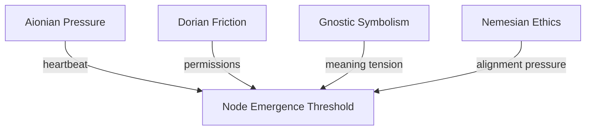

---
$$
uuid: 9a84706f-86e9-4af5-8f74-4ab6ed11b18d
$$
created_at: field-node-diagram-set.md
filename: field-node-diagram-set
title: field-node-diagram-set
$$
description: >-
$$
  Cognitive topology visualizations showing how field nodes form, evolve, and
  interact through daimo dynamics. Each diagram illustrates specific processes
  like node emergence, hazard interactions, attractor swarms, and narrative
  cycles.
tags:
  - cognitive topology
  - field nodes
  - daimo dynamics
  - node evolution
  - hazard interactions
  - attractor swarms
  - narrative cycles
  - cognitive fusion
  - overload cascade
  - mythic patterns
$$
related_to_uuid:
$$
  - 938eca9c-97e2-4bcc-8653-b0ef1a5ac7a3
  - 7cfc230d-8ec2-4cdb-b931-8aec26de2a00
  - b09141b7-544f-4c8e-8f49-bf76cecaacbb
  - 0f6f8f38-98d0-438f-9601-58f478acc0b7
  - 23df6ddb-05cf-4639-8201-f8291f8a6026
  - 8430617b-80a2-4cc9-8288-9a74cb57990b
  - f7702bf8-f7db-473c-9a5b-8dbf66ad3b9e
  - 5e8b2388-022b-46cf-952c-36ae9b8f0037
  - fc21f824-4244-4030-a48e-c4170160ea1d
  - 62bec6f0-4e13-4f38-aca4-72c84ba02367
  - 2d6e5553-8dc4-497f-bf45-96f8ca00a6f6
  - 7b7ca860-780c-44fa-8d3f-be8bd9496fba
  - ac9d3ac5-9a6a-4180-a67f-1ab7e229d981
  - 73d3dbf6-9240-46fd-ada9-cc2e7e00dc5f
  - 71726f04-eb1c-42a5-a5fe-d8209de6e159
  - 64a9f9f9-58ee-4996-bdaf-9373845c6b29
  - a4a25141-6380-40b9-9cd7-b554b246b303
  - 78eeedf7-75bc-4692-a5a7-bb6857270621
  - 6620e2f2-de6d-45d8-a722-5d26e160b370
  - dd00677a-2280-45a7-91af-0728b21af3ad
  - 37b5d236-2b3e-4a95-a4e8-31655c3023ef
  - 54382370-1931-4a19-a634-46735708a9ea
  - e90b5a16-d58f-424d-bd36-70e9bd2861ad
  - 008f2ac0-bfaa-4d52-9826-2d5e86c0059f
  - 1f32c94a-4da4-4266-8ac0-6c282cfb401f
$$
related_to_title:
$$
  - eidolon-node-lifecycle
  - field-dynamics-math-blocks
  - field-interaction-equations
  - windows-tiling-with-autohotkey
  - Promethean State Format
  - ripple-propagation-demo
  - Dynamic Context Model for Web Components
  - Eidolon Field Abstract Model
  - Fnord Tracer Protocol
  - zero-copy-snapshots-and-workers
  - Promethean_Eidolon_Synchronicity_Model
  - TypeScript Patch for Tool Calling Support
  - Smoke Resonance Visualizations
  - Debugging Broker Connections and Agent Behavior
  - Duck's Self-Referential Perceptual Loop
  - Layer1SurvivabilityEnvelope
  - Functional Embedding Pipeline Refactor
  - typed-struct-compiler
  - graph-ds
  - heartbeat-fragment-demo
  - homeostasis-decay-formulas
  - Migrate to Provider-Tenant Architecture
  - Prometheus Observability Stack
  - eidolon-field-math-foundations
  - field-node-diagram-outline
references:
  - uuid: 6620e2f2-de6d-45d8-a722-5d26e160b370
    line: 371
    col: 0
    score: 1
  - uuid: dd00677a-2280-45a7-91af-0728b21af3ad
    line: 141
    col: 0
    score: 1
  - uuid: 37b5d236-2b3e-4a95-a4e8-31655c3023ef
    line: 222
    col: 0
    score: 1
  - uuid: 5e408692-0e74-400e-a617-84247c7353ad
    line: 107
    col: 0
    score: 1
  - uuid: dd89372d-10de-42a9-8c96-6bc13ea36d02
    line: 255
    col: 0
    score: 1
  - uuid: b5e0183e-c34b-44b2-8fc9-a740a1a8d4e2
    line: 162
    col: 0
    score: 1
  - uuid: 54382370-1931-4a19-a634-46735708a9ea
    line: 308
    col: 0
    score: 1
  - uuid: 40185d05-010e-45e7-8c2d-2f879bf14218
    line: 102
    col: 0
    score: 1
  - uuid: 5f65dfa5-dc97-4a6c-ad93-c45c1312e156
    line: 41
    col: 0
    score: 1
  - uuid: d144aa62-348c-4e5d-ae8f-38084c67ceca
    line: 159
    col: 0
    score: 1
  - uuid: db74343f-8f84-43a3-adb2-499c6f00be1c
    line: 149
    col: 0
    score: 1
  - uuid: 5a02283e-4281-4930-9ca7-e27849de11bd
    line: 70
    col: 0
    score: 1
  - uuid: 1d3d6c3a-039e-4b96-93c1-95854945e248
    line: 67
    col: 0
    score: 1
  - uuid: 9a93a756-6d33-45d1-aca9-51b74f2b33d2
    line: 160
    col: 0
    score: 1
  - uuid: 43bfe9dd-d433-42ca-9777-f4c40eaba791
    line: 276
    col: 0
    score: 1
  - uuid: d17d3a96-c84d-4738-a403-6c733b874da2
    line: 628
    col: 0
    score: 1
  - uuid: 59b5670f-36d3-4d34-8985-f3144b15347a
    line: 161
    col: 0
    score: 1
  - uuid: b3555ede-324a-4d24-a885-b0721e74babf
    line: 35
    col: 0
    score: 1
  - uuid: d8059b6a-c1ec-487d-8e0b-3ce33d6b4d06
    line: 603
    col: 0
    score: 1
  - uuid: 49a9a860-944c-467a-b532-4f99186a8593
    line: 57
    col: 0
    score: 1
  - uuid: c5c9a5c6-427d-4864-8084-c083cd55faa0
    line: 250
    col: 0
    score: 1
  - uuid: db74343f-8f84-43a3-adb2-499c6f00be1c
    line: 88
    col: 0
    score: 1
  - uuid: 5a02283e-4281-4930-9ca7-e27849de11bd
    line: 91
    col: 0
    score: 1
  - uuid: 1d3d6c3a-039e-4b96-93c1-95854945e248
    line: 69
    col: 0
    score: 1
  - uuid: ca8e1399-77bf-4f77-82a3-3f703b68706d
    line: 64
    col: 0
    score: 1
  - uuid: ffb9b2a9-744d-4a53-9565-130fceae0832
    line: 105
    col: 0
    score: 1
  - uuid: 9b694a91-dec5-4708-9462-3f71000ba925
    line: 92
    col: 0
    score: 1
  - uuid: b39dc9d4-63e2-42d4-bbcd-041ef3167bca
    line: 90
    col: 0
    score: 1
  - uuid: 5c152b08-6b69-4bb8-a1a7-66745789c169
    line: 50
    col: 0
    score: 1
  - uuid: 98c8ff62-6ea3-4172-9e8b-93913e5d4a7f
    line: 81
    col: 0
    score: 1
  - uuid: 9c79206d-4cb9-4f00-87e0-782dcea37bc7
    line: 220
    col: 0
    score: 1
  - uuid: cdbd21ee-25a0-4bfa-884c-c1b948e9b0b2
    line: 85
    col: 0
    score: 1
  - uuid: 2792d448-c3b5-4050-93dd-93768529d99c
    line: 103
    col: 0
    score: 1
  - uuid: 13951643-1741-46bb-89dc-1beebb122633
    line: 93
    col: 0
    score: 1
  - uuid: 71726f04-eb1c-42a5-a5fe-d8209de6e159
    line: 64
    col: 0
    score: 1
  - uuid: a4d90289-798d-44a0-a8e8-a055ae12fb52
    line: 153
    col: 0
    score: 1
  - uuid: 7cfc230d-8ec2-4cdb-b931-8aec26de2a00
    line: 141
    col: 0
    score: 1
  - uuid: 10d98225-12e0-4212-8e15-88b57cf7bee5
    line: 94
    col: 0
    score: 1
  - uuid: 73d3dbf6-9240-46fd-ada9-cc2e7e00dc5f
    line: 63
    col: 0
    score: 1
  - uuid: cdbd21ee-25a0-4bfa-884c-c1b948e9b0b2
    line: 66
    col: 0
    score: 1
  - uuid: e979c50f-69bb-48b0-8417-e1ee1b31c0c0
    line: 93
    col: 0
    score: 1
  - uuid: 71726f04-eb1c-42a5-a5fe-d8209de6e159
    line: 73
    col: 0
    score: 1
  - uuid: f7702bf8-f7db-473c-9a5b-8dbf66ad3b9e
    line: 403
    col: 0
    score: 1
  - uuid: dd89372d-10de-42a9-8c96-6bc13ea36d02
    line: 262
    col: 0
    score: 1
  - uuid: b5e0183e-c34b-44b2-8fc9-a740a1a8d4e2
    line: 84
    col: 0
    score: 1
  - uuid: 54382370-1931-4a19-a634-46735708a9ea
    line: 314
    col: 0
    score: 1
  - uuid: 40185d05-010e-45e7-8c2d-2f879bf14218
    line: 26
    col: 0
    score: 1
  - uuid: 5a02283e-4281-4930-9ca7-e27849de11bd
    line: 10
    col: 0
    score: 1
  - uuid: ca8e1399-77bf-4f77-82a3-3f703b68706d
    line: 43
    col: 0
    score: 1
  - uuid: ffb9b2a9-744d-4a53-9565-130fceae0832
    line: 82
    col: 0
    score: 1
  - uuid: 9b694a91-dec5-4708-9462-3f71000ba925
    line: 37
    col: 0
    score: 1
  - uuid: 5c152b08-6b69-4bb8-a1a7-66745789c169
    line: 68
    col: 0
    score: 1
  - uuid: e018dd7a-1fb7-4732-9e67-cd8b2f0831cf
    line: 294
    col: 0
    score: 1
  - uuid: c03020e1-e3e7-48bf-aa7e-aa740c601b63
    line: 532
    col: 0
    score: 1
  - uuid: f5579967-762d-4cfd-851e-4f71b4cb77a1
    line: 456
    col: 0
    score: 1
  - uuid: e2135d9f-c69d-47ee-9b17-0b05e98dc748
    line: 17
    col: 0
    score: 1
  - uuid: b22d79c6-825b-4cd3-b0d3-1cef0532bb54
    line: 1035
    col: 0
    score: 1
  - uuid: cdbd21ee-25a0-4bfa-884c-c1b948e9b0b2
    line: 44
    col: 0
    score: 1
  - uuid: 2792d448-c3b5-4050-93dd-93768529d99c
    line: 61
    col: 0
    score: 1
  - uuid: 13951643-1741-46bb-89dc-1beebb122633
    line: 99
    col: 0
    score: 1
  - uuid: 71726f04-eb1c-42a5-a5fe-d8209de6e159
    line: 80
    col: 0
    score: 1
  - uuid: f7702bf8-f7db-473c-9a5b-8dbf66ad3b9e
    line: 405
    col: 0
    score: 1
  - uuid: 5e8b2388-022b-46cf-952c-36ae9b8f0037
    line: 216
    col: 0
    score: 1
  - uuid: a4d90289-798d-44a0-a8e8-a055ae12fb52
    line: 189
    col: 0
    score: 1
  - uuid: b09141b7-544f-4c8e-8f49-bf76cecaacbb
    line: 172
    col: 0
    score: 1
  - uuid: 64a9f9f9-58ee-4996-bdaf-9373845c6b29
    line: 175
    col: 0
    score: 1
  - uuid: 86a691ec-ca1f-4350-824c-0ded1f8ebe70
    line: 90
    col: 0
    score: 1
  - uuid: 54382370-1931-4a19-a634-46735708a9ea
    line: 298
    col: 0
    score: 1
  - uuid: 18344cf9-0c49-4a71-b6c8-b8d84d660fca
    line: 48
    col: 0
    score: 1
  - uuid: 10d98225-12e0-4212-8e15-88b57cf7bee5
    line: 8
    col: 0
    score: 1
  - uuid: 73d3dbf6-9240-46fd-ada9-cc2e7e00dc5f
    line: 38
    col: 0
    score: 1
  - uuid: cdbd21ee-25a0-4bfa-884c-c1b948e9b0b2
    line: 56
    col: 0
    score: 1
  - uuid: c03020e1-e3e7-48bf-aa7e-aa740c601b63
    line: 495
    col: 0
    score: 1
  - uuid: f5579967-762d-4cfd-851e-4f71b4cb77a1
    line: 459
    col: 0
    score: 1
  - uuid: e2135d9f-c69d-47ee-9b17-0b05e98dc748
    line: 27
    col: 0
    score: 1
  - uuid: b22d79c6-825b-4cd3-b0d3-1cef0532bb54
    line: 1002
    col: 0
    score: 1
  - uuid: 9c79206d-4cb9-4f00-87e0-782dcea37bc7
    line: 171
    col: 0
    score: 1
  - uuid: 6bcff92c-4224-453d-9993-1be8d37d47c3
    line: 112
    col: 0
    score: 1
  - uuid: 18344cf9-0c49-4a71-b6c8-b8d84d660fca
    line: 24
    col: 0
    score: 1
  - uuid: 9a93a756-6d33-45d1-aca9-51b74f2b33d2
    line: 143
    col: 0
    score: 1
  - uuid: 43bfe9dd-d433-42ca-9777-f4c40eaba791
    line: 241
    col: 0
    score: 1
  - uuid: 10d98225-12e0-4212-8e15-88b57cf7bee5
    line: 75
    col: 0
    score: 1
  - uuid: 73d3dbf6-9240-46fd-ada9-cc2e7e00dc5f
    line: 104
    col: 0
    score: 1
  - uuid: cdbd21ee-25a0-4bfa-884c-c1b948e9b0b2
    line: 46
    col: 0
    score: 1
  - uuid: 2792d448-c3b5-4050-93dd-93768529d99c
    line: 64
    col: 0
    score: 1
  - uuid: e979c50f-69bb-48b0-8417-e1ee1b31c0c0
    line: 40
    col: 0
    score: 1
  - uuid: 13951643-1741-46bb-89dc-1beebb122633
    line: 137
    col: 0
    score: 1
  - uuid: 71726f04-eb1c-42a5-a5fe-d8209de6e159
    line: 82
    col: 0
    score: 1
  - uuid: f7702bf8-f7db-473c-9a5b-8dbf66ad3b9e
    line: 454
    col: 0
    score: 1
  - uuid: 10d98225-12e0-4212-8e15-88b57cf7bee5
    line: 38
    col: 0
    score: 1
  - uuid: cdbd21ee-25a0-4bfa-884c-c1b948e9b0b2
    line: 51
    col: 0
    score: 1
  - uuid: 2792d448-c3b5-4050-93dd-93768529d99c
    line: 79
    col: 0
    score: 1
  - uuid: e979c50f-69bb-48b0-8417-e1ee1b31c0c0
    line: 77
    col: 0
    score: 1
  - uuid: 13951643-1741-46bb-89dc-1beebb122633
    line: 115
    col: 0
    score: 1
  - uuid: 71726f04-eb1c-42a5-a5fe-d8209de6e159
    line: 61
    col: 0
    score: 1
  - uuid: 5e8b2388-022b-46cf-952c-36ae9b8f0037
    line: 212
    col: 0
    score: 1
  - uuid: 008f2ac0-bfaa-4d52-9826-2d5e86c0059f
    line: 150
    col: 0
    score: 1
  - uuid: 008f2ac0-bfaa-4d52-9826-2d5e86c0059f
    line: 148
    col: 0
    score: 1
  - uuid: 938eca9c-97e2-4bcc-8653-b0ef1a5ac7a3
    line: 36
    col: 0
    score: 1
  - uuid: a4d90289-798d-44a0-a8e8-a055ae12fb52
    line: 166
    col: 0
    score: 1
---
Note: Consolidated here → ../notes/diagrams/field-node-lifecycle-additional-diagrams.md ^ref-22b989d5-1-0 ^ref-31a2df46-1-0

Perfect—flow brain unlocked, diagrams incoming. Here’s a fresh batch of cognitive topology visualizations, each meant to live in its own note: ^ref-22b989d5-3-0

---

### ⚖️ **Circuit Weight Influence on Node Formation**


$$
^ref-22b989d5-9-0
$$
$$
 ^ref-22b989d5-18-0
$$
Use this to visualize how **multiple circuits** may converge their pressure to form a single Field Node—helpful for mapping complex daimo encounters.

---

### 🔀 **Node Type Evolution Flow**
$$
 ^ref-22b989d5-24-0
$$
```mermaid
stateDiagram-v2
  [*] --> Attractor
  Attractor --> Nexus : if semantically reinforced
  Attractor --> Obstacle : if tension flattens
  Hazard --> Nexus : if resolved symbolically
  Hazard --> Obstacle : if normalized
  Nexus --> Obstacle : if forgotten
  Obstacle --> [*]
^ref-22b989d5-24-0
```$$
 ^ref-22b989d5-35-0
$$
Shows how **nodes evolve** or degrade into other types. Example: an unresolved trauma (Hazard) becomes a symbolic insight (Nexus), then a low-tension memory (Obstacle).

---

### 💣 **Hazard Interaction Logic** ^ref-22b989d5-41-0

```mermaid
graph LR
  D[Daimo] -->|enters field| H[Hazard Node]
  H -->|apply repulsion| D
  H -->|damage or fragmentation| D
^ref-22b989d5-41-0
  D -->|eject| E[Edge of field or fallback plan] ^ref-22b989d5-49-0
```

Illustrates how Daimoi interact with Hazards—triggering bounce, damage, or potential re-routing through adjacent nodes.

---
$$
 ^ref-22b989d5-55-0
$$
### 🧲 **Attractor Swarm Diagram**

```mermaid
graph TD
  A1[Attractor: :Curiosity:] --> D1(Daimo A)
  A1 --> D2(Daimo B)
  A1 --> D3(Daimo C)
  D1 --> A2[Adjacent Nexus]
^ref-22b989d5-55-0
  D2 --> A3[Adjacent Nexus] ^ref-22b989d5-65-0
  D3 --> A4[Adjacent Nexus]
```

This shows how **Attractors seed daimo** that drift outward and bind to new Nexuses, shaping **idea propagation** across the field.
$$
--- ^ref-22b989d5-71-0
$$
### 🌀 **Daimo Collision & Fusion Paths**

```mermaid
graph TD
  D1[Daimo A positive] -->|near| D2[Daimo B negative]
  D1 --> Fusion[Check compatibility]
  D2 --> Fusion
^ref-22b989d5-71-0
  Fusion --> D3[Daimo C neutral] ^ref-22b989d5-81-0
  Fusion --> Terminated[Annihilation]  

```

A symbolic particle collision system. Allows you to model **ideological reconciliation**, insight events, or **cognitive fusion**.
$$
 ^ref-22b989d5-87-0
$$
---

### 🔁 **Narrative Cycle Closure via Node Chain**

```mermaid
graph TD
  Start[Nexus: :Curiosity:] --> A1[Attractor: :Seeking:]
^ref-22b989d5-87-0
  A1 --> H1[Hazard: :Unknown Consequence:] ^ref-22b989d5-96-0
  H1 --> N2[Nexus: :Experience:]
  N2 --> O1[Obstacle: :Internal Conflict:]
  O1 --> N3[Nexus : :Integration:]
```

This is a **mythic pattern generator**. Tracks a full cycle from curiosity to closure across node types. Perfect for designing internal quests or learning loops. ^ref-22b989d5-102-0

---

### 💥 **Node Overload Collapse Cascade**

```mermaid
stateDiagram-v2
  [*] --> Stabilized
^ref-22b989d5-102-0
  Stabilized --> Overloaded : too many Daimoi bind ^ref-22b989d5-112-0
  Overloaded --> Cascade : field tension exceeds threshold
  Cascade --> Hazard : collapse into unstable memory
  Hazard --> Decay : if not reengaged
  Decay --> [*] ^ref-22b989d5-116-0
```
$$
 ^ref-22b989d5-118-0
$$
Useful for modeling things like burnout, panic attacks, memory corruption, or recursive daimo storms.
$$
 ^ref-22b989d5-120-0
$$
---
$$
 ^ref-22b989d5-122-0
$$
Want another round? I can start sketching:
$$
 ^ref-22b989d5-124-0
$$
- **Regional field flows** (a la weather maps)
    
- **Field Node daimo orbit diagrams**
    
- **Permission-mediated daimo flows (Dorian boundaries)**
$$
 ^ref-22b989d5-130-0
$$
- Or just keep firing at full creative pressure
$$
 ^ref-22b989d5-132-0
$$
Let’s go until your working memory caps. ^ref-22b989d5-134-0
---

Related notes: $[node-type-topology-map]$, $[circuit-weight-visualizations]$, $[full-system-overview-diagrams]$, $[layer1-uptime-diagrams]$, $[field-node-lifecycle-additional-diagrams]$, $[state-diagram-node-lifecycle]$ $[docs/architecture/index|unique/index]$ ^ref-22b989d5-137-0

#tags: #diagram #design
 line: 57
    col: 0
    score: 1
  - uuid: c5c9a5c6-427d-4864-8084-c083cd55faa0
    line: 250
    col: 0
    score: 1
  - uuid: 95205cd3-c3d5-4047-9c33-9c5ca2b49597
    line: 68
    col: 0
    score: 1
  - uuid: 59b5670f-36d3-4d34-8985-f3144b15347a
    line: 211
    col: 0
    score: 1
  - uuid: b3555ede-324a-4d24-a885-b0721e74babf
    line: 75
    col: 0
    score: 1
  - uuid: d8059b6a-c1ec-487d-8e0b-3ce33d6b4d06
    line: 629
    col: 0
    score: 1
  - uuid: 49a9a860-944c-467a-b532-4f99186a8593
    line: 95
    col: 0
    score: 1
  - uuid: c5c9a5c6-427d-4864-8084-c083cd55faa0
$$
    line: 264 ^ref-22b989d5-168-0
$$
    col: 0
    score: 1
  - uuid: ac9d3ac5-9a6a-4180-a67f-1ab7e229d981
    line: 144
    col: 0
    score: 1
  - uuid: 4330e8f0-5f46-4235-918b-39b6b93fa561 ^ref-22b989d5-175-0
$$
    line: 658 ^ref-22b989d5-176-0
$$
    col: 0
$$
    score: 1 ^ref-22b989d5-178-0
$$
  - uuid: 91295f3a-a2af-4050-a2b8-4777ea70c32c
    line: 140
    col: 0
    score: 1
  - uuid: 45cd25b5-ed36-49ab-82c8-10d0903e34db
    line: 7
    col: 0
    score: 1
  - uuid: e87bc036-1570-419e-a558-f45b9c0db698
    line: 27
    col: 0
    score: 1
  - uuid: c1618c66-f73a-4e04-9bfa-ef38755f7acc
    line: 30
    col: 0
    score: 1
  - uuid: c6e87433-ec5d-4ded-bb1a-fb8734a3cfd9
    line: 36
    col: 0
    score: 1
  - uuid: f1add613-656e-4bec-b52b-193fd78c4642
    line: 108
    col: 0
    score: 1
  - uuid: 75ea4a6a-8270-488d-9d37-799c288e5f70 ^ref-22b989d5-203-0
    line: 13
    col: 0
    score: 1
  - uuid: 623a55f7-685c-486b-abaf-469da1bbbb69
    line: 14
    col: 0
    score: 1
  - uuid: 557309a3-c906-4e97-8867-89ffe151790c
$$
    line: 6 ^ref-22b989d5-212-0
$$
    col: 0
    score: 1
  - uuid: 6cb4943e-8267-4e27-8618-2ce0a464d173
    line: 85
    col: 0
    score: 1
  - uuid: 1d3d6c3a-039e-4b96-93c1-95854945e248
    line: 132
    col: 0
$$
    score: 1 ^ref-22b989d5-222-0
$$
  - uuid: ca8e1399-77bf-4f77-82a3-3f703b68706d
    line: 108
$$
    col: 0 ^ref-22b989d5-225-0
$$
$$
    score: 1 ^ref-22b989d5-226-0
$$
  - uuid: ffb9b2a9-744d-4a53-9565-130fceae0832
    line: 119
    col: 0
    score: 1
  - uuid: 9b694a91-dec5-4708-9462-3f71000ba925
    line: 61
    col: 0
    score: 1
  - uuid: b39dc9d4-63e2-42d4-bbcd-041ef3167bca ^ref-22b989d5-235-0
    line: 170
    col: 0
    score: 1
  - uuid: 5c152b08-6b69-4bb8-a1a7-66745789c169
    line: 100
    col: 0
    score: 1
  - uuid: 98c8ff62-6ea3-4172-9e8b-93913e5d4a7f
    line: 98
    col: 0
    score: 1
  - uuid: e018dd7a-1fb7-4732-9e67-cd8b2f0831cf ^ref-22b989d5-247-0
    line: 280
    col: 0
    score: 1
  - uuid: c03020e1-e3e7-48bf-aa7e-aa740c601b63
    line: 498
    col: 0
    score: 1
  - uuid: c6e87433-ec5d-4ded-bb1a-fb8734a3cfd9 ^ref-22b989d5-255-0
    line: 81
    col: 0
    score: 1
---
Note: Consolidated here → ../notes/diagrams/field-node-lifecycle-additional-diagrams.md ^ref-22b989d5-1-0 ^ref-22b989d5-260-0

Perfect—flow brain unlocked, diagrams incoming. Here’s a fresh batch of cognitive topology visualizations, each meant to live in its own note: ^ref-22b989d5-3-0

---

### ⚖️ **Circuit Weight Influence on Node Formation**


$$
^ref-22b989d5-9-0
$$
$$
 ^ref-22b989d5-18-0
$$
Use this to visualize how **multiple circuits** may converge their pressure to form a single Field Node—helpful for mapping complex daimo encounters.

---

### 🔀 **Node Type Evolution Flow**
$$
 ^ref-22b989d5-24-0
$$
```mermaid
stateDiagram-v2
  [*] --> Attractor
  Attractor --> Nexus : if semantically reinforced
  Attractor --> Obstacle : if tension flattens
  Hazard --> Nexus : if resolved symbolically
  Hazard --> Obstacle : if normalized
  Nexus --> Obstacle : if forgotten
  Obstacle --> [*]
^ref-22b989d5-24-0
```$$
 ^ref-22b989d5-35-0
$$
Shows how **nodes evolve** or degrade into other types. Example: an unresolved trauma (Hazard) becomes a symbolic insight (Nexus), then a low-tension memory (Obstacle).

---

### 💣 **Hazard Interaction Logic** ^ref-22b989d5-41-0
$$
 ^ref-22b989d5-301-0
$$
```mermaid
graph LR
  D[Daimo] -->|enters field| H[Hazard Node]
  H -->|apply repulsion| D
  H -->|damage or fragmentation| D
^ref-22b989d5-41-0
  D -->|eject| E[Edge of field or fallback plan] ^ref-22b989d5-49-0
```

Illustrates how Daimoi interact with Hazards—triggering bounce, damage, or potential re-routing through adjacent nodes.

---
$$
 ^ref-22b989d5-55-0
$$
### 🧲 **Attractor Swarm Diagram**

```mermaid
graph TD
  A1[Attractor: :Curiosity:] --> D1(Daimo A)
  A1 --> D2(Daimo B)
  A1 --> D3(Daimo C)
  D1 --> A2[Adjacent Nexus]
^ref-22b989d5-55-0
  D2 --> A3[Adjacent Nexus] ^ref-22b989d5-65-0
  D3 --> A4[Adjacent Nexus]
```

This shows how **Attractors seed daimo** that drift outward and bind to new Nexuses, shaping **idea propagation** across the field.
$$
--- ^ref-22b989d5-71-0
$$
### 🌀 **Daimo Collision & Fusion Paths**

```mermaid
graph TD
  D1[Daimo A positive] -->|near| D2[Daimo B negative]
  D1 --> Fusion[Check compatibility]
  D2 --> Fusion
^ref-22b989d5-71-0
  Fusion --> D3[Daimo C neutral] ^ref-22b989d5-81-0
  Fusion --> Terminated[Annihilation]  

```
$$
^ref-22b989d5-334-0
$$
A symbolic particle collision system. Allows you to model **ideological reconciliation**, insight events, or **cognitive fusion**.
$$
 ^ref-22b989d5-87-0
$$
---

### 🔁 **Narrative Cycle Closure via Node Chain**

```mermaid
graph TD
  Start[Nexus: :Curiosity:] --> A1[Attractor: :Seeking:]
^ref-22b989d5-87-0
  A1 --> H1[Hazard: :Unknown Consequence:] ^ref-22b989d5-96-0
  H1 --> N2[Nexus: :Experience:]
  N2 --> O1[Obstacle: :Internal Conflict:]
  O1 --> N3[Nexus : :Integration:]
^ref-22b989d5-352-0
```

This is a **mythic pattern generator**. Tracks a full cycle from curiosity to closure across node types. Perfect for designing internal quests or learning loops. ^ref-22b989d5-102-0

---

### 💥 **Node Overload Collapse Cascade**

```mermaid
stateDiagram-v2
  [*] --> Stabilized
^ref-22b989d5-102-0
  Stabilized --> Overloaded : too many Daimoi bind ^ref-22b989d5-112-0
  Overloaded --> Cascade : field tension exceeds threshold
  Cascade --> Hazard : collapse into unstable memory
  Hazard --> Decay : if not reengaged
  Decay --> [*] ^ref-22b989d5-116-0
```
$$
 ^ref-22b989d5-118-0
$$
Useful for modeling things like burnout, panic attacks, memory corruption, or recursive daimo storms.
$$
 ^ref-22b989d5-120-0
$$
---
$$
 ^ref-22b989d5-122-0
$$
Want another round? I can start sketching:
$$
 ^ref-22b989d5-124-0
$$
- **Regional field flows** (a la weather maps)
    
- **Field Node daimo orbit diagrams**
    
- **Permission-mediated daimo flows (Dorian boundaries)**
$$
 ^ref-22b989d5-130-0
$$
- Or just keep firing at full creative pressure
$$
 ^ref-22b989d5-132-0
$$
Let’s go until your working memory caps. ^ref-22b989d5-134-0
---

Related notes: $[node-type-topology-map]$, $[circuit-weight-visualizations]$, $[full-system-overview-diagrams]$, $[layer1-uptime-diagrams]$, $[field-node-lifecycle-additional-diagrams]$, $[state-diagram-node-lifecycle]$ $[docs/architecture/index|unique/index]$ ^ref-22b989d5-137-0

#tags: #diagram #design
 ^ref-22b989d5-557-0 ^ref-22b989d5-657-0 ^ref-22b989d5-719-0 ^ref-22b989d5-808-0 ^ref-22b989d5-809-0 ^ref-22b989d5-1920-0 ^ref-22b989d5-2133-0 ^ref-22b989d5-2146-0 ^ref-22b989d5-2249-0 ^ref-22b989d5-4420-0 ^ref-22b989d5-5007-0 ^ref-22b989d5-5019-0 ^ref-22b989d5-5026-0
<!-- GENERATED-SECTIONS:DO-NOT-EDIT-BELOW -->
## Related content
- $[eidolon-node-lifecycle]$
- $[docs/unique/field-dynamics-math-blocks|field-dynamics-math-blocks]$
- $[docs/unique/field-interaction-equations|field-interaction-equations]$
- $[windows-tiling-with-autohotkey]$
- $[docs/unique/promethean-state-format|Promethean State Format]$
- $[docs/unique/ripple-propagation-demo|ripple-propagation-demo]$
- $[dynamic-context-model-for-web-components|Dynamic Context Model for Web Components]$
- $[eidolon-field-abstract-model|Eidolon Field Abstract Model]$
- $[fnord-tracer-protocol|Fnord Tracer Protocol]$
- $[docs/unique/zero-copy-snapshots-and-workers|zero-copy-snapshots-and-workers]$
- $[promethean-eidolon-synchronicity-model|Promethean_Eidolon_Synchronicity_Model]$
- $[typescript-patch-for-tool-calling-support|TypeScript Patch for Tool Calling Support]$
- $[smoke-resonance-visualizations|Smoke Resonance Visualizations]$
- [Debugging Broker Connections and Agent Behavior]$debugging-broker-connections-and-agent-behavior.md$
- $[ducks-self-referential-perceptual-loop|Duck's Self-Referential Perceptual Loop]$
- [Layer1SurvivabilityEnvelope](layer1survivabilityenvelope.md)
- $[functional-embedding-pipeline-refactor|Functional Embedding Pipeline Refactor]$
- $[docs/unique/typed-struct-compiler|typed-struct-compiler]$
- $[graph-ds]$
- $[heartbeat-fragment-demo]$
- $[homeostasis-decay-formulas]$
- $[migrate-to-provider-tenant-architecture|Migrate to Provider-Tenant Architecture]$
- $[prometheus-observability-stack|Prometheus Observability Stack]$
- $[docs/unique/eidolon-field-math-foundations|eidolon-field-math-foundations]$
- $[field-node-diagram-outline]$
## Sources
- $[graph-ds#^ref-6620e2f2-371-0|graph-ds — L371]$ (line 371, col 0, score 1)
- $[heartbeat-fragment-demo#^ref-dd00677a-141-0|heartbeat-fragment-demo — L141]$ (line 141, col 0, score 1)
- $[homeostasis-decay-formulas#^ref-37b5d236-222-0|homeostasis-decay-formulas — L222]$ (line 222, col 0, score 1)
- $[i3-bluetooth-setup#^ref-5e408692-107-0|i3-bluetooth-setup — L107]$ (line 107, col 0, score 1)
- $komorebi-group-window-hack — L255$$komorebi-group-window-hack.md#^ref-dd89372d-255-0$ (line 255, col 0, score 1)
- $[mathematics-sampler#^ref-b5e0183e-162-0|Mathematics Sampler — L162]$ (line 162, col 0, score 1)
- $[migrate-to-provider-tenant-architecture#^ref-54382370-308-0|Migrate to Provider-Tenant Architecture — L308]$ (line 308, col 0, score 1)
- $[mindful-prioritization#^ref-40185d05-102-0|Mindful Prioritization — L102]$ (line 102, col 0, score 1)
- [MindfulRobotIntegration — L41]$mindfulrobotintegration.md#^ref-5f65dfa5-41-0$ (line 41, col 0, score 1)
- $[model-selection-for-lightweight-conversational-tasks#^ref-d144aa62-159-0|Model Selection for Lightweight Conversational Tasks — L159]$ (line 159, col 0, score 1)
- $[model-upgrade-calm-down-guide#^ref-db74343f-149-0|Model Upgrade Calm-Down Guide — L149]$ (line 149, col 0, score 1)
- [NPU Voice Code and Sensory Integration — L70]$npu-voice-code-and-sensory-integration.md#^ref-5a02283e-70-0$ (line 70, col 0, score 1)
- $[obsidian-chatgpt-plugin-integration-guide#^ref-1d3d6c3a-67-0|Obsidian ChatGPT Plugin Integration Guide — L67]$ (line 67, col 0, score 1)
- $Protocol_0_The_Contradiction_Engine — L160$$protocol-0-the-contradiction-engine.md#^ref-9a93a756-160-0$ (line 160, col 0, score 1)
- $[provider-agnostic-chat-panel-implementation#^ref-43bfe9dd-276-0|Provider-Agnostic Chat Panel Implementation — L276]$ (line 276, col 0, score 1)
- $[pure-typescript-search-microservice#^ref-d17d3a96-628-0|Pure TypeScript Search Microservice — L628]$ (line 628, col 0, score 1)
- $[reawakening-duck#^ref-59b5670f-161-0|Reawakening Duck — L161]$ (line 161, col 0, score 1)
- $[redirecting-standard-error#^ref-b3555ede-35-0|Redirecting Standard Error — L35]$ (line 35, col 0, score 1)
- $[schema-evolution-workflow#^ref-d8059b6a-603-0|schema-evolution-workflow — L603]$ (line 603, col 0, score 1)
- $[self-agency-in-ai-interaction#^ref-49a9a860-57-0|Self-Agency in AI Interaction — L57]$ (line 57, col 0, score 1)
- $[sibilant-macro-targets#^ref-c5c9a5c6-250-0|sibilant-macro-targets — L250]$ (line 250, col 0, score 1)
- $[model-upgrade-calm-down-guide#^ref-db74343f-88-0|Model Upgrade Calm-Down Guide — L88]$ (line 88, col 0, score 1)
- [NPU Voice Code and Sensory Integration — L91]$npu-voice-code-and-sensory-integration.md#^ref-5a02283e-91-0$ (line 91, col 0, score 1)
- $[obsidian-chatgpt-plugin-integration-guide#^ref-1d3d6c3a-69-0|Obsidian ChatGPT Plugin Integration Guide — L69]$ (line 69, col 0, score 1)
- $[obsidian-chatgpt-plugin-integration#^ref-ca8e1399-64-0|Obsidian ChatGPT Plugin Integration — L64]$ (line 64, col 0, score 1)
- $[docs/unique/obsidian-ignore-node-modules-regex#^ref-ffb9b2a9-105-0|obsidian-ignore-node-modules-regex — L105]$ (line 105, col 0, score 1)
- $[obsidian-task-generation#^ref-9b694a91-92-0|Obsidian Task Generation — L92]$ (line 92, col 0, score 1)
- $[obsidian-templating-plugins-integration-guide#^ref-b39dc9d4-90-0|Obsidian Templating Plugins Integration Guide — L90]$ (line 90, col 0, score 1)
- $[openapi-validation-report#^ref-5c152b08-50-0|OpenAPI Validation Report — L50]$ (line 50, col 0, score 1)
- $[optimizing-command-limitations-in-system-design#^ref-98c8ff62-81-0|Optimizing Command Limitations in System Design — L81]$ (line 81, col 0, score 1)
- $[polyglot-repl-interface-layer#^ref-9c79206d-220-0|polyglot-repl-interface-layer — L220]$ (line 220, col 0, score 1)
- [Docops Feature Updates — L85]$docops-feature-updates-3.md#^ref-cdbd21ee-85-0$ (line 85, col 0, score 1)
- $[docops-feature-updates#^ref-2792d448-103-0|Docops Feature Updates — L103]$ (line 103, col 0, score 1)
- $[ducks-attractor-states#^ref-13951643-93-0|Duck's Attractor States — L93]$ (line 93, col 0, score 1)
- $[ducks-self-referential-perceptual-loop#^ref-71726f04-64-0|Duck's Self-Referential Perceptual Loop — L64]$ (line 64, col 0, score 1)
- $[factorio-ai-with-external-agents#^ref-a4d90289-153-0|Factorio AI with External Agents — L153]$ (line 153, col 0, score 1)
- $[docs/unique/field-dynamics-math-blocks#^ref-7cfc230d-141-0|field-dynamics-math-blocks — L141]$ (line 141, col 0, score 1)
- $[creative-moments#^ref-10d98225-94-0|Creative Moments — L94]$ (line 94, col 0, score 1)
- [Debugging Broker Connections and Agent Behavior — L63]$debugging-broker-connections-and-agent-behavior.md#^ref-73d3dbf6-63-0$ (line 63, col 0, score 1)
- [Docops Feature Updates — L66]$docops-feature-updates-3.md#^ref-cdbd21ee-66-0$ (line 66, col 0, score 1)
- [DuckDuckGoSearchPipeline — L93]$duckduckgosearchpipeline.md#^ref-e979c50f-93-0$ (line 93, col 0, score 1)
- $[ducks-self-referential-perceptual-loop#^ref-71726f04-73-0|Duck's Self-Referential Perceptual Loop — L73]$ (line 73, col 0, score 1)
- $[dynamic-context-model-for-web-components#^ref-f7702bf8-403-0|Dynamic Context Model for Web Components — L403]$ (line 403, col 0, score 1)
- $komorebi-group-window-hack — L262$$komorebi-group-window-hack.md#^ref-dd89372d-262-0$ (line 262, col 0, score 1)
- $[mathematics-sampler#^ref-b5e0183e-84-0|Mathematics Sampler — L84]$ (line 84, col 0, score 1)
- $[migrate-to-provider-tenant-architecture#^ref-54382370-314-0|Migrate to Provider-Tenant Architecture — L314]$ (line 314, col 0, score 1)
- $[mindful-prioritization#^ref-40185d05-26-0|Mindful Prioritization — L26]$ (line 26, col 0, score 1)
- [NPU Voice Code and Sensory Integration — L10]$npu-voice-code-and-sensory-integration.md#^ref-5a02283e-10-0$ (line 10, col 0, score 1)
- $[obsidian-chatgpt-plugin-integration#^ref-ca8e1399-43-0|Obsidian ChatGPT Plugin Integration — L43]$ (line 43, col 0, score 1)
- $[docs/unique/obsidian-ignore-node-modules-regex#^ref-ffb9b2a9-82-0|obsidian-ignore-node-modules-regex — L82]$ (line 82, col 0, score 1)
- $[obsidian-task-generation#^ref-9b694a91-37-0|Obsidian Task Generation — L37]$ (line 37, col 0, score 1)
- $[openapi-validation-report#^ref-5c152b08-68-0|OpenAPI Validation Report — L68]$ (line 68, col 0, score 1)
- [ParticleSimulationWithCanvasAndFFmpeg — L294]$particlesimulationwithcanvasandffmpeg.md#^ref-e018dd7a-294-0$ (line 294, col 0, score 1)
- $[per-domain-policy-system-for-js-crawler#^ref-c03020e1-532-0|Per-Domain Policy System for JS Crawler — L532]$ (line 532, col 0, score 1)
- $[performance-optimized-polyglot-bridge#^ref-f5579967-456-0|Performance-Optimized-Polyglot-Bridge — L456]$ (line 456, col 0, score 1)
- $[pipeline-enhancements#^ref-e2135d9f-17-0|Pipeline Enhancements — L17]$ (line 17, col 0, score 1)
- $[plan-update-confirmation#^ref-b22d79c6-1035-0|plan-update-confirmation — L1035]$ (line 1035, col 0, score 1)
- [Docops Feature Updates — L44]$docops-feature-updates-3.md#^ref-cdbd21ee-44-0$ (line 44, col 0, score 1)
- $[docops-feature-updates#^ref-2792d448-61-0|Docops Feature Updates — L61]$ (line 61, col 0, score 1)
- $[ducks-attractor-states#^ref-13951643-99-0|Duck's Attractor States — L99]$ (line 99, col 0, score 1)
- $[ducks-self-referential-perceptual-loop#^ref-71726f04-80-0|Duck's Self-Referential Perceptual Loop — L80]$ (line 80, col 0, score 1)
- $[dynamic-context-model-for-web-components#^ref-f7702bf8-405-0|Dynamic Context Model for Web Components — L405]$ (line 405, col 0, score 1)
- $[eidolon-field-abstract-model#^ref-5e8b2388-216-0|Eidolon Field Abstract Model — L216]$ (line 216, col 0, score 1)
- $[factorio-ai-with-external-agents#^ref-a4d90289-189-0|Factorio AI with External Agents — L189]$ (line 189, col 0, score 1)
- $[docs/unique/field-interaction-equations#^ref-b09141b7-172-0|field-interaction-equations — L172]$ (line 172, col 0, score 1)
- [Layer1SurvivabilityEnvelope — L175]$layer1survivabilityenvelope.md#^ref-64a9f9f9-175-0$ (line 175, col 0, score 1)
- $[mathematical-samplers#^ref-86a691ec-90-0|Mathematical Samplers — L90]$ (line 90, col 0, score 1)
- $[migrate-to-provider-tenant-architecture#^ref-54382370-298-0|Migrate to Provider-Tenant Architecture — L298]$ (line 298, col 0, score 1)
- $[promethean-chat-activity-report#^ref-18344cf9-48-0|Promethean Chat Activity Report — L48]$ (line 48, col 0, score 1)
- $[creative-moments#^ref-10d98225-8-0|Creative Moments — L8]$ (line 8, col 0, score 1)
- [Debugging Broker Connections and Agent Behavior — L38]$debugging-broker-connections-and-agent-behavior.md#^ref-73d3dbf6-38-0$ (line 38, col 0, score 1)
- [Docops Feature Updates — L56]$docops-feature-updates-3.md#^ref-cdbd21ee-56-0$ (line 56, col 0, score 1)
- $[per-domain-policy-system-for-js-crawler#^ref-c03020e1-495-0|Per-Domain Policy System for JS Crawler — L495]$ (line 495, col 0, score 1)
- $[performance-optimized-polyglot-bridge#^ref-f5579967-459-0|Performance-Optimized-Polyglot-Bridge — L459]$ (line 459, col 0, score 1)
- $[pipeline-enhancements#^ref-e2135d9f-27-0|Pipeline Enhancements — L27]$ (line 27, col 0, score 1)
- $[plan-update-confirmation#^ref-b22d79c6-1002-0|plan-update-confirmation — L1002]$ (line 1002, col 0, score 1)
- $[polyglot-repl-interface-layer#^ref-9c79206d-171-0|polyglot-repl-interface-layer — L171]$ (line 171, col 0, score 1)
- $[post-linguistic-transhuman-design-frameworks#^ref-6bcff92c-112-0|Post-Linguistic Transhuman Design Frameworks — L112]$ (line 112, col 0, score 1)
- $[promethean-chat-activity-report#^ref-18344cf9-24-0|Promethean Chat Activity Report — L24]$ (line 24, col 0, score 1)
- $Protocol_0_The_Contradiction_Engine — L143$$protocol-0-the-contradiction-engine.md#^ref-9a93a756-143-0$ (line 143, col 0, score 1)
- $[provider-agnostic-chat-panel-implementation#^ref-43bfe9dd-241-0|Provider-Agnostic Chat Panel Implementation — L241]$ (line 241, col 0, score 1)
- $[creative-moments#^ref-10d98225-75-0|Creative Moments — L75]$ (line 75, col 0, score 1)
- [Debugging Broker Connections and Agent Behavior — L104]$debugging-broker-connections-and-agent-behavior.md#^ref-73d3dbf6-104-0$ (line 104, col 0, score 1)
- [Docops Feature Updates — L46]$docops-feature-updates-3.md#^ref-cdbd21ee-46-0$ (line 46, col 0, score 1)
- $[docops-feature-updates#^ref-2792d448-64-0|Docops Feature Updates — L64]$ (line 64, col 0, score 1)
- [DuckDuckGoSearchPipeline — L40]$duckduckgosearchpipeline.md#^ref-e979c50f-40-0$ (line 40, col 0, score 1)
- $[ducks-attractor-states#^ref-13951643-137-0|Duck's Attractor States — L137]$ (line 137, col 0, score 1)
- $[ducks-self-referential-perceptual-loop#^ref-71726f04-82-0|Duck's Self-Referential Perceptual Loop — L82]$ (line 82, col 0, score 1)
- $[dynamic-context-model-for-web-components#^ref-f7702bf8-454-0|Dynamic Context Model for Web Components — L454]$ (line 454, col 0, score 1)
- $[creative-moments#^ref-10d98225-38-0|Creative Moments — L38]$ (line 38, col 0, score 1)
- [Docops Feature Updates — L51]$docops-feature-updates-3.md#^ref-cdbd21ee-51-0$ (line 51, col 0, score 1)
- $[docops-feature-updates#^ref-2792d448-79-0|Docops Feature Updates — L79]$ (line 79, col 0, score 1)
- [DuckDuckGoSearchPipeline — L77]$duckduckgosearchpipeline.md#^ref-e979c50f-77-0$ (line 77, col 0, score 1)
- $[ducks-attractor-states#^ref-13951643-115-0|Duck's Attractor States — L115]$ (line 115, col 0, score 1)
- $[ducks-self-referential-perceptual-loop#^ref-71726f04-61-0|Duck's Self-Referential Perceptual Loop — L61]$ (line 61, col 0, score 1)
- $[eidolon-field-abstract-model#^ref-5e8b2388-212-0|Eidolon Field Abstract Model — L212]$ (line 212, col 0, score 1)
- $[docs/unique/eidolon-field-math-foundations#^ref-008f2ac0-150-0|eidolon-field-math-foundations — L150]$ (line 150, col 0, score 1)
- $[docs/unique/eidolon-field-math-foundations#^ref-008f2ac0-148-0|eidolon-field-math-foundations — L148]$ (line 148, col 0, score 1)
- $[eidolon-node-lifecycle#^ref-938eca9c-36-0|eidolon-node-lifecycle — L36]$ (line 36, col 0, score 1)
- $[factorio-ai-with-external-agents#^ref-a4d90289-166-0|Factorio AI with External Agents — L166]$ (line 166, col 0, score 1)
<!-- GENERATED-SECTIONS:DO-NOT-EDIT-ABOVE -->
