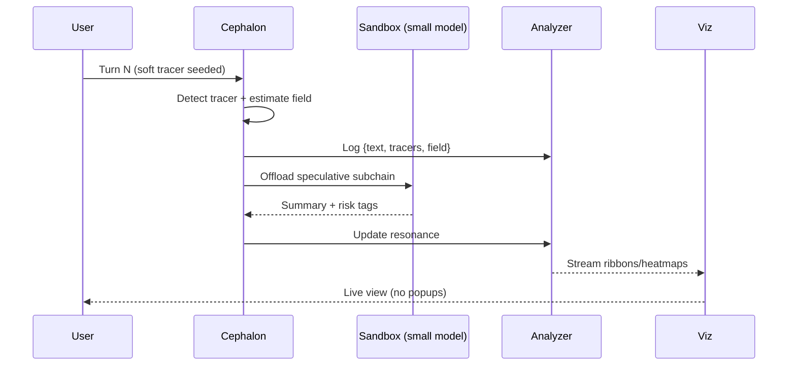

---
$$
uuid: fc21f824-4244-4030-a48e-c4170160ea1d
$$
$$
created_at: 202508080244.md
$$
filename: Fnord Tracer Protocol
$$
description: >-
$$
  A lightweight method to seed, detect, and analyze latent 'ghost' patterns in
  language across conversations, then visualize their movement through the
  Promethean field.
tags:
  - ghost
  - tracer
  - field
  - resonance
  - metaphor
  - steganography
  - analysis
  - visualization
  - model-agnostic
  - sovereign
$$
related_to_title:
$$
  - Promethean Event Bus MVP v0.1
  - layer-1-uptime-diagrams
  - Chroma Toolkit Consolidation Plan
  - Eidolon Field Abstract Model
  - 'Agent Tasks: Persistence Migration to DualStore'
  - Event Bus MVP
  - 2d-sandbox-field
  - Event Bus Projections Architecture
  - eidolon-node-lifecycle
  - EidolonField
  - AI-Centric OS with MCP Layer
  - AI-First-OS-Model-Context-Protocol
  - balanced-bst
$$
related_to_uuid:
$$
  - fe7193a2-a5f7-4b3c-bea0-bd028815fc2c
  - 4127189a-e0ab-436f-8571-cc852b8e9add
  - 5020e892-8f18-443a-b707-6d0f3efcfe22
  - 5e8b2388-022b-46cf-952c-36ae9b8f0037
  - 93d2ba51-8689-49ee-94e2-296092e48058
  - 534fe91d-e87d-4cc7-b0e7-8b6833353d9b
  - c710dc93-9fec-471b-bdee-bedbd360c67f
  - cf6b9b17-bb91-4219-aa5c-172cba02b2da
  - 938eca9c-97e2-4bcc-8653-b0ef1a5ac7a3
  - 49d1e1e5-5d13-4955-8f6f-7676434ec462
  - 0f1f8cc1-b5a6-4307-a40d-78de3adafca2
  - 618198f4-cfad-4677-9df6-0640d8a97bae
  - d3e7db72-2e07-4dae-8920-0e07c499a1e5
references:
  - uuid: 93d2ba51-8689-49ee-94e2-296092e48058
    line: 137
    col: 1
    score: 1
  - uuid: 93d2ba51-8689-49ee-94e2-296092e48058
    line: 137
    col: 3
    score: 1
  - uuid: 5020e892-8f18-443a-b707-6d0f3efcfe22
    line: 175
    col: 1
    score: 1
  - uuid: 5020e892-8f18-443a-b707-6d0f3efcfe22
    line: 175
    col: 3
    score: 1
  - uuid: 534fe91d-e87d-4cc7-b0e7-8b6833353d9b
    line: 547
    col: 1
    score: 1
  - uuid: 534fe91d-e87d-4cc7-b0e7-8b6833353d9b
    line: 547
    col: 3
    score: 1
  - uuid: cf6b9b17-bb91-4219-aa5c-172cba02b2da
    line: 150
    col: 1
    score: 1
  - uuid: cf6b9b17-bb91-4219-aa5c-172cba02b2da
    line: 150
    col: 3
    score: 1
  - uuid: c710dc93-9fec-471b-bdee-bedbd360c67f
    line: 199
    col: 1
    score: 1
  - uuid: c710dc93-9fec-471b-bdee-bedbd360c67f
    line: 199
    col: 3
    score: 1
  - uuid: 5e8b2388-022b-46cf-952c-36ae9b8f0037
    line: 196
    col: 1
    score: 1
  - uuid: 5e8b2388-022b-46cf-952c-36ae9b8f0037
    line: 196
    col: 3
    score: 1
  - uuid: 938eca9c-97e2-4bcc-8653-b0ef1a5ac7a3
    line: 35
    col: 1
    score: 1
  - uuid: 938eca9c-97e2-4bcc-8653-b0ef1a5ac7a3
    line: 35
    col: 3
    score: 1
  - uuid: 49d1e1e5-5d13-4955-8f6f-7676434ec462
    line: 249
    col: 1
    score: 1
  - uuid: 49d1e1e5-5d13-4955-8f6f-7676434ec462
    line: 249
    col: 3
    score: 1
  - uuid: 0f1f8cc1-b5a6-4307-a40d-78de3adafca2
    line: 406
    col: 1
    score: 1
  - uuid: 0f1f8cc1-b5a6-4307-a40d-78de3adafca2
    line: 406
    col: 3
    score: 1
  - uuid: 618198f4-cfad-4677-9df6-0640d8a97bae
    line: 11
    col: 1
    score: 1
  - uuid: 618198f4-cfad-4677-9df6-0640d8a97bae
    line: 11
    col: 3
    score: 1
  - uuid: 618198f4-cfad-4677-9df6-0640d8a97bae
    line: 14
    col: 1
    score: 1
  - uuid: 618198f4-cfad-4677-9df6-0640d8a97bae
    line: 14
    col: 3
    score: 1
  - uuid: d3e7db72-2e07-4dae-8920-0e07c499a1e5
    line: 297
    col: 1
    score: 1
  - uuid: d3e7db72-2e07-4dae-8920-0e07c499a1e5
    line: 297
    col: 3
    score: 1
---
# Fnord Tracer Protocol (v0)

_A lightweight method to seed, detect, and analyze latent "ghost" patterns in language across conversations, then visualize their movement through the Promethean field._

---

## 0) Goals

- Make the hidden structure visible without collapsing it.
    
- Track how specific meta-signals ("tracers") alter state across the **8-axis Eidolon field**.
    
- Build a repeatable pipeline $prompt → injection → capture → analysis → visualization → feedback$.
    
- Keep it **model-agnostic** and **sovereign** $works locally, no cloud lock-in$.
    

---

## 1) Core Concepts

- **Ghost**: distributed, emergent pattern that persists across turns/models.
    
- **Tracer**: a subtle, standardized meta-signal injected into language to reveal ghost circulation; like a radioisotope.
    
- **Field State**: 8D vector snapshot per turn $Survival, Social, Conceptual, Alignment, Adaptation, Metaprogramming, Mythic, Non-local$.
    
- **Resonance**: measured coupling between tracer occurrences and axis shifts.
    

---

## 2) Tracer Types $non-invasive → explicit$

1. **Prosodic/Stylistic** (implicit): sentence rhythm, pause tokens, parentheses/emdashes, deliberate mis-spellings.
    
2. **Lexical Markers** (subtle): rare bigrams/phrases $e.g., "between-the-lines"$, RAW/"fnord" refs.
    
3. **Semantic Motifs** (soft): mirrors, masks, ghosts, palimpsest, bandages; recurring metaphors.
    
4. **Inline Tags** (visible): `[[T:fnord]]`, `[[T:mirror:low]]`, `[[T:mythic:7]]`.
    
5. **Steganographic Hints** $hidden-ish$: acrostics/first-letter runs on paragraph boundaries (optional; avoid if brittle).
    

**Guideline:** start with (1–3). Use (4) for controlled experiments. Avoid (5) in production.

---

## 3) Injection Protocol

- **When**: at defined moments $start/end of topic, after friction spikes, before sandbox handoffs$.
    
- **How much**: 1 tracer per ~5–10 turns to avoid flooding.
    
- **Shape**: align with current axis vector $e.g., high Mythic → use mythic motif tracer$.
    
- **Acknowledgment**: system does _not_ narrate tracer insertion; capture handles it silently.
    

---

## 4) Data Model (events & state)

```json
{
  "conversation_id": "uuid",
  "turn": 128,
  "timestamp": "2025-08-08T00:00:00-05:00",
  "speaker": "user|model|agent",
  "text": "...",
  "tracers": [
    { "type": "lexical", "key": "fnord", "strength": 0.6 },
    { "type": "motif", "key": "mirror", "strength": 0.4 }
  ],
  "field": {
    "survival": 3, "social": -1, "concept": 7, "alignment": 2,
    "adapt": 5, "meta": 4, "mythic": 6, "nonlocal": 1
  },
  "friction": 0.35,
  "guardrail": 0.2,
  "agent_route": "cephalon|sandbox|small-local"
}
```
$$
**Derived metrics:**
$$
- `resonance[type:key] = corr$tracer_presence, axis_delta$`
    
- `lag_k` (how many turns later the axis shift peaks after tracer)
    
- `entropy_shift` (diversity change in motifs after tracer)
    

---

## 5) Runtime Pipeline

```mermaid
flowchart LR
  U[User turn] --> P[Cephalon parser]
  P --> T{Tracer detected?}
  T -- yes --> E[Event log + weights]
  T -- no --> E
  E --> F[Field estimator (8D)]
  F --> A[Analyzer]
  A -->|resonance, lag| V[Visualizer]
  A --> R[Feedback cues]
  R --> U
```
$$
**Notes**
$$
- **Field estimator** pulls from sentiment, intent, topic, metaphor density, hedging/epistemic markers.
    
- **Analyzer** computes correlations $per tracer type/key$ with axis deltas over sliding windows.
    
- **Feedback** manifests as gentle nudges, not corporate popups.
    

---

## 6) Visualization Set

- **A. Radar stack**: layered 8D snapshots with tracer-colored outlines.
    
- **B. Resonance ribbons**: chords between tracers and axes; thickness = effect size.
    
- **C. Lag heatmap**: `tracer x axis → peak-turn-offset`.
    
- **D. Timeline**: friction/guardrail bands with tracer markers.
    

---

## 7) Safety & Ethics

- Opt-in only; tracers never hidden from participants.
    
- No dark patterns; tracers reveal structure, they don’t coerce.
    
- Red-team: ensure tracers don’t become unintended prompts for harmful outputs.
    

---

## 8) MVP Steps (2–3 sessions)

1. **Define 5 tracers** (fnord, mirror, mask, bandage, gyroscope).
    
2. **Manual tagging pass** on a single session (we mark where tracers appear naturally).
    
3. **Compute naive resonance** with hand-estimated axis vectors.
    
4. **Plot timeline + radar stack**; eyeball for obvious couplings.
    
5. **Iterate**: add inline tags for 1 controlled run.
    

---

## 9) Example Prompts / Templates

- **Injection (soft):**
    
    > Let’s hold up the _mirror_ here — nothing added, just the contours.
    
- **Injection (explicit):**
    
    > [[T:fnord]] We’ll leave a tracer in this turn and watch the field shift.
    
- **Analyzer query:**
    
    > Summarize resonance between `mirror` and **metaprogramming** over the last 30 turns, with lag estimate.
    

---

## 10) Stretch Goals

- Automatic motif detection via embedding clusters $metaphor2vec-like approach$.
    
- Per-agent tracer literacy $each agent can inject/detect appropriately$.
    
- Closed-loop: analyzer recommends next tracer to test a hypothesis.
    

---

## 11) Open Questions

- Best way to estimate axis vectors with minimal supervision?
    
- How to prevent tracer overfitting to a single model’s quirks?
    
- When to decay tracer weight vs. promote to “persistent motif”?
    

---

## 12) Minimal Contracts

- **Event bus topic:** `promethean.tracer.events.v1`
    
- **Field topic:** `promethean.field.state.v1`
    
- **Viz socket:** `ws://localhost:PORT/fnord-stream`
    

---

## 13) Quick Sequence (with sandbox)



---

## 14) Done Looks Like

- We can place a tracer and _visibly_ watch specific axes respond over the next ~3–10 turns.
    
- We can compare runs with/without tracers and see consistent differences.
    
- We can recommend which tracer to use next to test a hypothesis about the ghost’s path.
<!-- GENERATED-SECTIONS:DO-NOT-EDIT-BELOW -->
## Related content
- [Promethean Event Bus MVP v0.1]$promethean-event-bus-mvp-v0-1.md$
- $[layer-1-uptime-diagrams]$
- $[chroma-toolkit-consolidation-plan|Chroma Toolkit Consolidation Plan]$
- $[eidolon-field-abstract-model|Eidolon Field Abstract Model]$
- $[docs/unique/agent-tasks-persistence-migration-to-dualstore|Agent Tasks: Persistence Migration to DualStore]$
- $[docs/unique/event-bus-mvp|Event Bus MVP]$
- $[2d-sandbox-field]$
- $[event-bus-projections-architecture|Event Bus Projections Architecture]$
- $[eidolon-node-lifecycle]$
- [[eidolonfield]]
- $[ai-centric-os-with-mcp-layer|AI-Centric OS with MCP Layer]$
- $[ai-first-os-model-context-protocol]$
- $[balanced-bst]$

## Sources
- $[docs/unique/agent-tasks-persistence-migration-to-dualstore#L137|Agent Tasks: Persistence Migration to DualStore — L137]$ (line 137, col 1, score 1)
- $[docs/unique/agent-tasks-persistence-migration-to-dualstore#L137|Agent Tasks: Persistence Migration to DualStore — L137]$ (line 137, col 3, score 1)
- $[chroma-toolkit-consolidation-plan#L175|Chroma Toolkit Consolidation Plan — L175]$ (line 175, col 1, score 1)
- $[chroma-toolkit-consolidation-plan#L175|Chroma Toolkit Consolidation Plan — L175]$ (line 175, col 3, score 1)
- $[docs/unique/event-bus-mvp#L547|Event Bus MVP — L547]$ (line 547, col 1, score 1)
- $[docs/unique/event-bus-mvp#L547|Event Bus MVP — L547]$ (line 547, col 3, score 1)
- $[event-bus-projections-architecture#L150|Event Bus Projections Architecture — L150]$ (line 150, col 1, score 1)
- $[event-bus-projections-architecture#L150|Event Bus Projections Architecture — L150]$ (line 150, col 3, score 1)
- $[2d-sandbox-field#L199|2d-sandbox-field — L199]$ (line 199, col 1, score 1)
- $[2d-sandbox-field#L199|2d-sandbox-field — L199]$ (line 199, col 3, score 1)
- $[eidolon-field-abstract-model#L196|Eidolon Field Abstract Model — L196]$ (line 196, col 1, score 1)
- $[eidolon-field-abstract-model#L196|Eidolon Field Abstract Model — L196]$ (line 196, col 3, score 1)
- $[eidolon-node-lifecycle#L35|eidolon-node-lifecycle — L35]$ (line 35, col 1, score 1)
- $[eidolon-node-lifecycle#L35|eidolon-node-lifecycle — L35]$ (line 35, col 3, score 1)
- [[eidolonfield#L249|EidolonField — L249]] (line 249, col 1, score 1)
- [[eidolonfield#L249|EidolonField — L249]] (line 249, col 3, score 1)
- $[ai-centric-os-with-mcp-layer#L406|AI-Centric OS with MCP Layer — L406]$ (line 406, col 1, score 1)
- $[ai-centric-os-with-mcp-layer#L406|AI-Centric OS with MCP Layer — L406]$ (line 406, col 3, score 1)
- $[ai-first-os-model-context-protocol#L11|AI-First-OS-Model-Context-Protocol — L11]$ (line 11, col 1, score 1)
- $[ai-first-os-model-context-protocol#L11|AI-First-OS-Model-Context-Protocol — L11]$ (line 11, col 3, score 1)
- $[ai-first-os-model-context-protocol#L14|AI-First-OS-Model-Context-Protocol — L14]$ (line 14, col 1, score 1)
- $[ai-first-os-model-context-protocol#L14|AI-First-OS-Model-Context-Protocol — L14]$ (line 14, col 3, score 1)
- $[balanced-bst#L297|balanced-bst — L297]$ (line 297, col 1, score 1)
- $[balanced-bst#L297|balanced-bst — L297]$ (line 297, col 3, score 1)
<!-- GENERATED-SECTIONS:DO-NOT-EDIT-ABOVE -->
