```mermaid
graph TD
  CPU["🧠 CPU Cores (n%)"]
  RAM["📦 RAM / Cache / Pagefile"]
  GPU["🎮 GPUs (Nvidia & Intel Arc)"]
  NPU["🧮 NPU (shared memory)"]
  DISK["💾 Disk IO (R/W/s, Capacity)"]
  TEMP["🌡️ Thermal + Power Constraints"]
  FSYNC["🌀 File Sync/IO Locks"]

  CPU --> RAM
  RAM --> DISK
  CPU --> NPU
  CPU --> GPU
  GPU --> RAM
  DISK --> FSYNC
  FSYNC --> CPU
```

---
$$
uuid: b1a39004-7255-43ab-b6df-cd25503e5100
$$
$$
created_at: layer1survivabilityenvelope.md
$$
filename: Layer 1 Survivability Envelope
title: Layer 1 Survivability Envelope
$$
description: >-
$$
  This document defines the physical boundaries of Layer 1’s survivability
  envelope using a physics-inspired model to manage resource stress under
  duress. It introduces a resource-stress field schema with vector fields for
  real-time monitoring and failure mode detection. The model includes field
  probes and agents for proactive handling of critical resource constraints.
tags:
  - survivability
  - resource-stress
  - physics-model
  - failure-modes
  - field-probes
  - real-time-monitoring
  - thermal-throttling
  - io-race-detection
$$
related_to_uuid:
$$
  - 0f6f8f38-98d0-438f-9601-58f478acc0b7
  - 23df6ddb-05cf-4639-8201-f8291f8a6026
  - bd4f0976-0d5b-47f6-a20a-0601d1842dc1
  - 8430617b-80a2-4cc9-8288-9a74cb57990b
  - 008f2ac0-bfaa-4d52-9826-2d5e86c0059f
  - 22b989d5-f4aa-4880-8632-709c21830f83
  - 6620e2f2-de6d-45d8-a722-5d26e160b370
  - 5e8b2388-022b-46cf-952c-36ae9b8f0037
  - a4d90289-798d-44a0-a8e8-a055ae12fb52
  - d144aa62-348c-4e5d-ae8f-38084c67ceca
  - ffb9b2a9-744d-4a53-9565-130fceae0832
  - fc21f824-4244-4030-a48e-c4170160ea1d
  - ac9d3ac5-9a6a-4180-a67f-1ab7e229d981
  - 2d6e5553-8dc4-497f-bf45-96f8ca00a6f6
  - b22d79c6-825b-4cd3-b0d3-1cef0532bb54
  - b09141b7-544f-4c8e-8f49-bf76cecaacbb
  - 7cfc230d-8ec2-4cdb-b931-8aec26de2a00
  - f7702bf8-f7db-473c-9a5b-8dbf66ad3b9e
  - 5e408692-0e74-400e-a617-84247c7353ad
  - 62bec6f0-4e13-4f38-aca4-72c84ba02367
  - ae24a280-678e-4c0b-8cc4-56667fa04172
  - 73d3dbf6-9240-46fd-ada9-cc2e7e00dc5f
  - e979c50f-69bb-48b0-8417-e1ee1b31c0c0
  - 71726f04-eb1c-42a5-a5fe-d8209de6e159
  - 59b5670f-36d3-4d34-8985-f3144b15347a
$$
related_to_title:
$$
  - windows-tiling-with-autohotkey
  - Promethean State Format
  - Prompt_Folder_Bootstrap
  - ripple-propagation-demo
  - eidolon-field-math-foundations
  - field-node-diagram-set
  - graph-ds
  - Eidolon Field Abstract Model
  - Factorio AI with External Agents
  - Model Selection for Lightweight Conversational Tasks
  - obsidian-ignore-node-modules-regex
  - Fnord Tracer Protocol
  - Smoke Resonance Visualizations
  - Promethean_Eidolon_Synchronicity_Model
  - plan-update-confirmation
  - field-interaction-equations
  - field-dynamics-math-blocks
  - Dynamic Context Model for Web Components
  - i3-bluetooth-setup
  - zero-copy-snapshots-and-workers
  - Promethean-Copilot-Intent-Engine
  - Debugging Broker Connections and Agent Behavior
  - DuckDuckGoSearchPipeline
  - Duck's Self-Referential Perceptual Loop
  - Reawakening Duck
references:
  - uuid: 10d98225-12e0-4212-8e15-88b57cf7bee5
    line: 94
    col: 0
    score: 1
  - uuid: 73d3dbf6-9240-46fd-ada9-cc2e7e00dc5f
    line: 63
    col: 0
    score: 1
  - uuid: cdbd21ee-25a0-4bfa-884c-c1b948e9b0b2
    line: 66
    col: 0
    score: 1
  - uuid: e979c50f-69bb-48b0-8417-e1ee1b31c0c0
    line: 93
    col: 0
    score: 1
  - uuid: 71726f04-eb1c-42a5-a5fe-d8209de6e159
    line: 73
    col: 0
    score: 1
  - uuid: f7702bf8-f7db-473c-9a5b-8dbf66ad3b9e
    line: 403
    col: 0
    score: 1
  - uuid: cdbd21ee-25a0-4bfa-884c-c1b948e9b0b2
    line: 48
    col: 0
    score: 1
  - uuid: 2792d448-c3b5-4050-93dd-93768529d99c
    line: 79
    col: 0
    score: 1
  - uuid: 938eca9c-97e2-4bcc-8653-b0ef1a5ac7a3
    line: 69
    col: 0
    score: 1
  - uuid: 1f32c94a-4da4-4266-8ac0-6c282cfb401f
    line: 158
    col: 0
    score: 1
  - uuid: 22b989d5-f4aa-4880-8632-709c21830f83
    line: 178
    col: 0
    score: 1
  - uuid: e9b27b06-f608-4734-ae6c-f03a8b1fcf5f
    line: 126
    col: 0
    score: 1
  - uuid: a4a25141-6380-40b9-9cd7-b554b246b303
    line: 410
    col: 0
    score: 1
  - uuid: 1cfae310-35dc-49c2-98f1-b186da25d84b
    line: 228
    col: 0
    score: 1
  - uuid: f2d83a77-7f86-4c56-8538-1350167a0c6c
    line: 149
    col: 0
    score: 1
  - uuid: 0580dcd3-533d-4834-8a2f-eae3771960a9
    line: 285
    col: 0
    score: 1
  - uuid: ac60a1d6-fd9f-46dc-bbe7-176dd8017c59
    line: 11
    col: 0
    score: 1
  - uuid: 7aa1eb92-7f9a-485b-8218-9b553aa9eefc
    line: 134
    col: 0
    score: 1
  - uuid: 7cfc230d-8ec2-4cdb-b931-8aec26de2a00
    line: 193
    col: 0
    score: 1
  - uuid: 22b989d5-f4aa-4880-8632-709c21830f83
    line: 203
    col: 0
    score: 1
  - uuid: e9b27b06-f608-4734-ae6c-f03a8b1fcf5f
    line: 151
    col: 0
    score: 1
  - uuid: 1cfae310-35dc-49c2-98f1-b186da25d84b
    line: 281
    col: 0
    score: 1
  - uuid: dd00677a-2280-45a7-91af-0728b21af3ad
    line: 181
    col: 0
    score: 1
  - uuid: 37b5d236-2b3e-4a95-a4e8-31655c3023ef
    line: 220
    col: 0
    score: 1
  - uuid: 291c7d91-da8c-486c-9bc0-bd2254536e2d
    line: 110
    col: 0
    score: 1
  - uuid: ffb9b2a9-744d-4a53-9565-130fceae0832
    line: 118
    col: 0
    score: 1
  - uuid: e018dd7a-1fb7-4732-9e67-cd8b2f0831cf
    line: 329
    col: 0
    score: 1
  - uuid: cdbd21ee-25a0-4bfa-884c-c1b948e9b0b2
    line: 44
    col: 0
    score: 1
  - uuid: 2792d448-c3b5-4050-93dd-93768529d99c
    line: 61
    col: 0
    score: 1
  - uuid: 13951643-1741-46bb-89dc-1beebb122633
    line: 99
    col: 0
    score: 1
  - uuid: 71726f04-eb1c-42a5-a5fe-d8209de6e159
    line: 80
    col: 0
    score: 1
  - uuid: f7702bf8-f7db-473c-9a5b-8dbf66ad3b9e
    line: 405
    col: 0
    score: 1
  - uuid: 5e8b2388-022b-46cf-952c-36ae9b8f0037
    line: 216
    col: 0
    score: 1
  - uuid: a4d90289-798d-44a0-a8e8-a055ae12fb52
    line: 189
    col: 0
    score: 1
  - uuid: b09141b7-544f-4c8e-8f49-bf76cecaacbb
    line: 172
    col: 0
    score: 1
  - uuid: 10d98225-12e0-4212-8e15-88b57cf7bee5
    line: 75
    col: 0
    score: 1
  - uuid: 73d3dbf6-9240-46fd-ada9-cc2e7e00dc5f
    line: 104
    col: 0
    score: 1
  - uuid: cdbd21ee-25a0-4bfa-884c-c1b948e9b0b2
    line: 46
    col: 0
    score: 1
  - uuid: 2792d448-c3b5-4050-93dd-93768529d99c
    line: 64
    col: 0
    score: 1
  - uuid: e979c50f-69bb-48b0-8417-e1ee1b31c0c0
    line: 40
    col: 0
    score: 1
  - uuid: 13951643-1741-46bb-89dc-1beebb122633
    line: 137
    col: 0
    score: 1
  - uuid: 71726f04-eb1c-42a5-a5fe-d8209de6e159
    line: 82
    col: 0
    score: 1
  - uuid: f7702bf8-f7db-473c-9a5b-8dbf66ad3b9e
    line: 454
    col: 0
    score: 1
  - uuid: 10d98225-12e0-4212-8e15-88b57cf7bee5
    line: 8
    col: 0
    score: 1
  - uuid: 73d3dbf6-9240-46fd-ada9-cc2e7e00dc5f
    line: 38
    col: 0
    score: 1
  - uuid: cdbd21ee-25a0-4bfa-884c-c1b948e9b0b2
    line: 56
    col: 0
    score: 1
  - uuid: 10d98225-12e0-4212-8e15-88b57cf7bee5
    line: 53
    col: 0
    score: 1
  - uuid: cdbd21ee-25a0-4bfa-884c-c1b948e9b0b2
    line: 85
    col: 0
    score: 1
  - uuid: 13951643-1741-46bb-89dc-1beebb122633
    line: 93
    col: 0
    score: 1
  - uuid: 71726f04-eb1c-42a5-a5fe-d8209de6e159
    line: 64
    col: 0
    score: 1
  - uuid: a4d90289-798d-44a0-a8e8-a055ae12fb52
    line: 153
    col: 0
    score: 1
  - uuid: 7cfc230d-8ec2-4cdb-b931-8aec26de2a00
    line: 141
    col: 0
    score: 1
  - uuid: 008f2ac0-bfaa-4d52-9826-2d5e86c0059f
    line: 148
    col: 0
    score: 1
  - uuid: 938eca9c-97e2-4bcc-8653-b0ef1a5ac7a3
    line: 36
    col: 0
    score: 1
  - uuid: a4d90289-798d-44a0-a8e8-a055ae12fb52
    line: 166
    col: 0
    score: 1
  - uuid: 7cfc230d-8ec2-4cdb-b931-8aec26de2a00
    line: 148
    col: 0
    score: 1
  - uuid: b09141b7-544f-4c8e-8f49-bf76cecaacbb
    line: 153
    col: 0
    score: 1
  - uuid: 1f32c94a-4da4-4266-8ac0-6c282cfb401f
    line: 118
    col: 0
    score: 1
  - uuid: 22b989d5-f4aa-4880-8632-709c21830f83
    line: 168
    col: 0
    score: 1
  - uuid: e9b27b06-f608-4734-ae6c-f03a8b1fcf5f
    line: 103
    col: 0
    score: 1
  - uuid: a4a25141-6380-40b9-9cd7-b554b246b303
    line: 380
    col: 0
    score: 1
  - uuid: 1cfae310-35dc-49c2-98f1-b186da25d84b
    line: 194
    col: 0
    score: 1
  - uuid: 10d98225-12e0-4212-8e15-88b57cf7bee5
    line: 47
    col: 0
    score: 1
  - uuid: 73d3dbf6-9240-46fd-ada9-cc2e7e00dc5f
    line: 105
    col: 0
    score: 1
  - uuid: cdbd21ee-25a0-4bfa-884c-c1b948e9b0b2
    line: 97
    col: 0
    score: 1
  - uuid: 2792d448-c3b5-4050-93dd-93768529d99c
    line: 128
    col: 0
    score: 1
  - uuid: e979c50f-69bb-48b0-8417-e1ee1b31c0c0
    line: 31
    col: 0
    score: 1
  - uuid: 13951643-1741-46bb-89dc-1beebb122633
    line: 90
    col: 0
    score: 1
  - uuid: 71726f04-eb1c-42a5-a5fe-d8209de6e159
    line: 33
    col: 0
    score: 1
  - uuid: f7702bf8-f7db-473c-9a5b-8dbf66ad3b9e
    line: 462
    col: 0
    score: 1
  - uuid: 10d98225-12e0-4212-8e15-88b57cf7bee5
    line: 38
    col: 0
    score: 1
  - uuid: cdbd21ee-25a0-4bfa-884c-c1b948e9b0b2
    line: 51
    col: 0
    score: 1
  - uuid: e979c50f-69bb-48b0-8417-e1ee1b31c0c0
    line: 77
    col: 0
    score: 1
  - uuid: 13951643-1741-46bb-89dc-1beebb122633
    line: 115
    col: 0
    score: 1
  - uuid: 71726f04-eb1c-42a5-a5fe-d8209de6e159
    line: 61
    col: 0
    score: 1
  - uuid: 5e8b2388-022b-46cf-952c-36ae9b8f0037
    line: 212
    col: 0
    score: 1
  - uuid: 008f2ac0-bfaa-4d52-9826-2d5e86c0059f
    line: 150
    col: 0
    score: 1
  - uuid: 10d98225-12e0-4212-8e15-88b57cf7bee5
    line: 28
    col: 0
    score: 1
  - uuid: cdbd21ee-25a0-4bfa-884c-c1b948e9b0b2
    line: 65
    col: 0
    score: 1
  - uuid: 2792d448-c3b5-4050-93dd-93768529d99c
    line: 86
    col: 0
    score: 1
  - uuid: 13951643-1741-46bb-89dc-1beebb122633
    line: 123
    col: 0
    score: 1
  - uuid: 71726f04-eb1c-42a5-a5fe-d8209de6e159
    line: 34
    col: 0
    score: 1
  - uuid: f7702bf8-f7db-473c-9a5b-8dbf66ad3b9e
    line: 442
    col: 0
    score: 1
  - uuid: 5e8b2388-022b-46cf-952c-36ae9b8f0037
    line: 218
    col: 0
    score: 1
  - uuid: 008f2ac0-bfaa-4d52-9826-2d5e86c0059f
    line: 176
    col: 0
    score: 1
  - uuid: 938eca9c-97e2-4bcc-8653-b0ef1a5ac7a3
    line: 70
    col: 0
    score: 1
  - uuid: 2792d448-c3b5-4050-93dd-93768529d99c
    line: 35
    col: 0
    score: 1
  - uuid: 13951643-1741-46bb-89dc-1beebb122633
    line: 94
    col: 0
    score: 1
  - uuid: 71726f04-eb1c-42a5-a5fe-d8209de6e159
    line: 53
    col: 0
    score: 1
  - uuid: f7702bf8-f7db-473c-9a5b-8dbf66ad3b9e
    line: 424
    col: 0
    score: 1
  - uuid: 5e8b2388-022b-46cf-952c-36ae9b8f0037
    line: 209
    col: 0
    score: 1
  - uuid: 008f2ac0-bfaa-4d52-9826-2d5e86c0059f
    line: 142
    col: 0
    score: 1
  - uuid: 938eca9c-97e2-4bcc-8653-b0ef1a5ac7a3
    line: 39
    col: 0
    score: 1
  - uuid: 10d98225-12e0-4212-8e15-88b57cf7bee5
    line: 50
    col: 0
    score: 1
  - uuid: 73d3dbf6-9240-46fd-ada9-cc2e7e00dc5f
    line: 89
    col: 0
    score: 1
  - uuid: cdbd21ee-25a0-4bfa-884c-c1b948e9b0b2
    line: 32
    col: 0
    score: 1
  - uuid: 2792d448-c3b5-4050-93dd-93768529d99c
    line: 49
    col: 0
    score: 1
  - uuid: e979c50f-69bb-48b0-8417-e1ee1b31c0c0
    line: 95
    col: 0
    score: 1
  - uuid: 13951643-1741-46bb-89dc-1beebb122633
    line: 133
    col: 0
    score: 1
  - uuid: 71726f04-eb1c-42a5-a5fe-d8209de6e159
    line: 59
    col: 0
    score: 1
---
Excellent. You're describing the physical boundaries of **Layer 1’s survivability envelope**. ^ref-64a9f9f9-1-0

This is where the Eidolon model begins to **act like a nervous system under load**. Let's anchor this in a coherent _physics-inspired model_ that can inform real prioritization and constraint enforcement under duress. ^ref-64a9f9f9-3-0

---

## 🧱 Resource Modalities: Real-World Mapping

Let's name and organize the resources as **independent but interconnected fields**: ^ref-64a9f9f9-9-0


$$
^ref-64a9f9f9-11-0
$$
$$
 ^ref-64a9f9f9-30-0
$$
This is a real mess to manage unless we **normalize and project** these into $a_resource$-stress field_.

---

## 🧭 Field Vector Schema
$$
 ^ref-64a9f9f9-36-0
$$
Each resource has:
$$
 ^ref-64a9f9f9-38-0
$$
|Field Axis|Description|
$$
|---|---|
$$
$$
|`X_cpu_i`|Percent usage for core _i_|
$$
$$
|`Y_ram`|% used, % cache pressure|
$$
$$
|`Z_gpu_i`|Load % for GPU i|
$$
|`U_npu`|Effective ops / latency over threshold|
|`D_disk_i`|Bandwidth usage and fill level per volume|
|`L_temp`|Temperature delta from nominal or throttle point|
|`F_io`|File sync/write collisions or delays detected|
$$
 ^ref-64a9f9f9-48-0
$$
We’ll bundle this into a vector per unit of time (or tick):
$$
 ^ref-64a9f9f9-50-0
$$
```clojure
(defstruct resource-snapshot
  cpu-cores ; [x x x x ...] per core
  ram       ; {:used %, :cached %, :pagefile %}
  gpus      ; {:intel-arc %, :nvidia-4070ti %}
  npu       ; {:utilization %, :latency ms}
  disks     ; [{:r/s, :w/s, :capacity-used %}, ...]
  temp      ; {:cpu-temp °C, :gpu-temp °C, ...}
  io-locks  ; {:contention-rate, :conflict-count})
^ref-64a9f9f9-50-0
```$$
 ^ref-64a9f9f9-61-0
$$
Now, let’s define a vector field: ^ref-64a9f9f9-63-0

```clojure
(defn compute-uptime-field [snapshot]
  (reduce (fn [vec-field res]
            (add-to-field vec-field (project-stress res)))
          empty-vec-field
^ref-64a9f9f9-63-0
          snapshot)) ^ref-64a9f9f9-71-0
```
$$
 ^ref-64a9f9f9-73-0
$$
We can begin modeling:
$$
 ^ref-64a9f9f9-75-0
$$
- **gradient flows**: e.g., RAM pressure diffuses into CPU/NPU field
$$
 ^ref-64a9f9f9-77-0
$$
- **turbulence**: e.g., race conditions emerge from sharp spikes in IO or thermal throttling
    
- **crash likelihood**: when the combined stress vector reaches a critical direction or magnitude
    

---
$$
 ^ref-64a9f9f9-84-0
$$
## 🛑 Failure Modes to Detect + Handle

|Mode|Trigger|Mitigation|
$$
|---|---|---|
$$
|**RAM exhaustion**|Free RAM < 5%|Cancel low-priority buffers|
|**Disk full**|Any disk > 90%|Purge caches / delay writes|
|**Thermal throttle**|Temp near Tjmax|Slow down jobs, log temperature events|
|**IO Race**|Same file accessed w/o lock|Use atomic temp file + rename|
|**Context overload**|LLM or STT queue too deep|Drop or summarize old requests|
|**System call corruption**|Sudden high jitter in metrics|Failsafe fallback mode, self-healing fsync queues|

---

## 🧪 Field Probes and Agents
$$
 ^ref-64a9f9f9-99-0
$$
### Example: RAM Agent

```lisp
(defagent ram-manager
  (priority 10)
  (update
    (lambda ()
      (let ((ram (get-field 'ram)))
        (when (> ram.used 0.9)
          (trigger 'drop-noncritical-contexts))
^ref-64a9f9f9-99-0
        (when (> ram.pagefile 0.8)
          (reduce-worker-threads))))))
```
$$
^ref-64a9f9f9-113-0
$$
### Example: Disk I/O Monitor

```lisp
(defagent disk-agent
  (priority 9)
  (update
    (lambda ()
      (doseq (disk snapshot.disks)
        (when (> disk.capacity-used 0.95)
^ref-64a9f9f9-113-0
          (notify 'disk-pressure zone=disk.mount))
        (when (> disk.writes-per-sec 2000)
          (delay 'background-embeddings))))))
```
$$
 ^ref-64a9f9f9-129-0
$$
---
$$
 ^ref-64a9f9f9-131-0 ^ref-64a9f9f9-132-0
$$
## ⚡ Memory Race Detection Strategy

- Use a write-through pattern:
$$
 ^ref-64a9f9f9-135-0
$$
    - Write to temp file: `state.tmp.json`
$$
 ^ref-64a9f9f9-137-0
$$
    - Fsync and `mv` to final name atomically
$$
 ^ref-64a9f9f9-139-0
$$
    - If `mv` fails, yield until next tick
        
- Maintain a `write-epoch` per resource. If two write requests share an epoch:
    
    - Introduce artificial delay or random jitter before commit
$$
 ^ref-64a9f9f9-146-0
$$
---
$$
 ^ref-64a9f9f9-148-0 ^ref-64a9f9f9-149-0
$$
## 🛠️ Next Step Suggestions

Here’s what I suggest we prototype next:
$$
 ^ref-64a9f9f9-152-0
$$
1. **Resource Snapshot Collector**: Platform-specific metrics API
$$
 ^ref-64a9f9f9-154-0
$$
2. **Eidolon Field Construction**: 2D vector stress map with decay, diffusion, and threshold coloring
$$
 ^ref-64a9f9f9-156-0
$$
3. **Agent-Based Response Model**: Agents like `ram-manager` and `disk-agent` that respond to local field conditions
$$
 ^ref-64a9f9f9-159-0
$$
4. **Simulated Stress Injector**: Artificial load generator to test field reactivity ^ref-64a9f9f9-159-0
    
5. **Self-Healing Demo**: Duck notices pressure, drops old STT data, slows TTS rate, logs pressure release
$$
 ^ref-64a9f9f9-164-0
$$
Would you like to start by writing a stress field data structure and simple decay function in Sibilant or JavaScript? Or do you want to define the snapshot system interface $cross-platform metrics collector$?
$$
7-91af-0728b21af3ad
$$
    line: 181
    col: 0
    score: 1
  - uuid: 37b5d236-2b3e-4a95-a4e8-31655c3023ef
    line: 220
    col: 0
    score: 1
  - uuid: 291c7d91-da8c-486c-9bc0-bd2254536e2d
$$
    line: 110 ^ref-64a9f9f9-175-0
$$
    col: 0
    score: 1
  - uuid: ffb9b2a9-744d-4a53-9565-130fceae0832
    line: 118
    col: 0
    score: 1
  - uuid: e018dd7a-1fb7-4732-9e67-cd8b2f0831cf
    line: 329
    col: 0
    score: 1
  - uuid: e87bc036-1570-419e-a558-f45b9c0db698
    line: 48
    col: 0
    score: 1
  - uuid: cdbd21ee-25a0-4bfa-884c-c1b948e9b0b2
    line: 44
    col: 0
    score: 1
  - uuid: 2792d448-c3b5-4050-93dd-93768529d99c
    line: 61
    col: 0
    score: 1
  - uuid: 13951643-1741-46bb-89dc-1beebb122633 ^ref-64a9f9f9-198-0
    line: 99
    col: 0
    score: 1
  - uuid: 71726f04-eb1c-42a5-a5fe-d8209de6e159
    line: 80
    col: 0
    score: 1
  - uuid: f7702bf8-f7db-473c-9a5b-8dbf66ad3b9e
    line: 405
    col: 0
    score: 1
  - uuid: 5e8b2388-022b-46cf-952c-36ae9b8f0037
    line: 216
    col: 0
    score: 1
  - uuid: a4d90289-798d-44a0-a8e8-a055ae12fb52
    line: 189
    col: 0
    score: 1
  - uuid: b09141b7-544f-4c8e-8f49-bf76cecaacbb
    line: 172
    col: 0
$$
    score: 1 ^ref-64a9f9f9-221-0
$$
  - uuid: 6cb4943e-8267-4e27-8618-2ce0a464d173
    line: 56
    col: 0
    score: 1
  - uuid: 9e8ae388-767a-4ea8-9f2e-88801291d947
    line: 74
    col: 0
    score: 1
  - uuid: 10d98225-12e0-4212-8e15-88b57cf7bee5
    line: 75
    col: 0
    score: 1
  - uuid: 73d3dbf6-9240-46fd-ada9-cc2e7e00dc5f
    line: 104
    col: 0
    score: 1
  - uuid: cdbd21ee-25a0-4bfa-884c-c1b948e9b0b2
    line: 46
    col: 0
    score: 1
  - uuid: 2792d448-c3b5-4050-93dd-93768529d99c
    line: 64
    col: 0
$$
    score: 1 ^ref-64a9f9f9-245-0
$$
  - uuid: e979c50f-69bb-48b0-8417-e1ee1b31c0c0
    line: 40
    col: 0
    score: 1
  - uuid: 13951643-1741-46bb-89dc-1beebb122633
    line: 137
    col: 0
    score: 1
  - uuid: 71726f04-eb1c-42a5-a5fe-d8209de6e159
$$
    line: 82 ^ref-64a9f9f9-255-0
$$
    col: 0
    score: 1
  - uuid: f7702bf8-f7db-473c-9a5b-8dbf66ad3b9e
    line: 454
    col: 0
    score: 1
  - uuid: 45cd25b5-ed36-49ab-82c8-10d0903e34db
    line: 19
    col: 0
    score: 1
---
Excellent. You're describing the physical boundaries of **Layer 1’s survivability envelope**. ^ref-64a9f9f9-1-0 ^ref-64a9f9f9-267-0

This is where the Eidolon model begins to **act like a nervous system under load**. Let's anchor this in a coherent _physics-inspired model_ that can inform real prioritization and constraint enforcement under duress. ^ref-64a9f9f9-3-0

---

## 🧱 Resource Modalities: Real-World Mapping

Let's name and organize the resources as **independent but interconnected fields**: ^ref-64a9f9f9-9-0


$$
^ref-64a9f9f9-285-0 ^ref-64a9f9f9-295-0
$$
$$
^ref-64a9f9f9-284-0
$$
$$
^ref-64a9f9f9-283-0
$$
$$
^ref-64a9f9f9-11-0 ^ref-64a9f9f9-298-0
$$
$$
 ^ref-64a9f9f9-30-0 ^ref-64a9f9f9-299-0
$$
This is a real mess to manage unless we **normalize and project** these into $a_resource$-stress field_.

---

## 🧭 Field Vector Schema
$$
 ^ref-64a9f9f9-36-0
$$
Each resource has:
$$
 ^ref-64a9f9f9-38-0
$$
|Field Axis|Description|
$$
|---|---|
$$
$$
|`X_cpu_i`|Percent usage for core _i_|
$$
$$
|`Y_ram`|% used, % cache pressure|
$$
$$
|`Z_gpu_i`|Load % for GPU i|
$$
|`U_npu`|Effective ops / latency over threshold|
|`D_disk_i`|Bandwidth usage and fill level per volume|
|`L_temp`|Temperature delta from nominal or throttle point|
|`F_io`|File sync/write collisions or delays detected|
$$
 ^ref-64a9f9f9-48-0
$$
We’ll bundle this into a vector per unit of time (or tick):
$$
 ^ref-64a9f9f9-50-0
$$
```clojure
(defstruct resource-snapshot
  cpu-cores ; [x x x x ...] per core
  ram       ; {:used %, :cached %, :pagefile %}
  gpus      ; {:intel-arc %, :nvidia-4070ti %}
  npu       ; {:utilization %, :latency ms}
  disks     ; [{:r/s, :w/s, :capacity-used %}, ...]
  temp      ; {:cpu-temp °C, :gpu-temp °C, ...}
  io-locks  ; {:contention-rate, :conflict-count})
^ref-64a9f9f9-50-0
```$$
 ^ref-64a9f9f9-61-0
$$
Now, let’s define a vector field: ^ref-64a9f9f9-63-0

```clojure
(defn compute-uptime-field [snapshot]
  (reduce (fn [vec-field res]
            (add-to-field vec-field (project-stress res)))
          empty-vec-field
^ref-64a9f9f9-63-0
          snapshot)) ^ref-64a9f9f9-71-0
```$$
 ^ref-64a9f9f9-341-0
$$
$$
 ^ref-64a9f9f9-73-0
$$
We can begin modeling:
$$
 ^ref-64a9f9f9-75-0
$$
- **gradient flows**: e.g., RAM pressure diffuses into CPU/NPU field
$$
 ^ref-64a9f9f9-77-0
$$
- **turbulence**: e.g., race conditions emerge from sharp spikes in IO or thermal throttling
    
- **crash likelihood**: when the combined stress vector reaches a critical direction or magnitude
    

---
$$
 ^ref-64a9f9f9-84-0
$$
## 🛑 Failure Modes to Detect + Handle

|Mode|Trigger|Mitigation|
$$
|---|---|---|
$$
|**RAM exhaustion**|Free RAM < 5%|Cancel low-priority buffers|
|**Disk full**|Any disk > 90%|Purge caches / delay writes|
|**Thermal throttle**|Temp near Tjmax|Slow down jobs, log temperature events|
|**IO Race**|Same file accessed w/o lock|Use atomic temp file + rename|
|**Context overload**|LLM or STT queue too deep|Drop or summarize old requests|
|**System call corruption**|Sudden high jitter in metrics|Failsafe fallback mode, self-healing fsync queues|

---

## 🧪 Field Probes and Agents
$$
 ^ref-64a9f9f9-99-0
$$
### Example: RAM Agent

```lisp
(defagent ram-manager
  (priority 10)
  (update
    (lambda ()
      (let ((ram (get-field 'ram)))
        (when (> ram.used 0.9)
          (trigger 'drop-noncritical-contexts))
^ref-64a9f9f9-99-0
^ref-64a9f9f9-378-0
        (when (> ram.pagefile 0.8)
          (reduce-worker-threads))))))
```
$$
^ref-64a9f9f9-113-0
$$
### Example: Disk I/O Monitor

```lisp
(defagent disk-agent
  (priority 9)
  (update
    (lambda ()
      (doseq (disk snapshot.disks)
        (when (> disk.capacity-used 0.95)
^ref-64a9f9f9-113-0
          (notify 'disk-pressure zone=disk.mount))
        (when (> disk.writes-per-sec 2000)
          (delay 'background-embeddings))))))
```
$$
 ^ref-64a9f9f9-129-0
$$
---
$$
 ^ref-64a9f9f9-131-0 ^ref-64a9f9f9-132-0
$$
## ⚡ Memory Race Detection Strategy

- Use a write-through pattern:
$$
 ^ref-64a9f9f9-135-0
$$
    - Write to temp file: `state.tmp.json`
$$
 ^ref-64a9f9f9-137-0
$$
    - Fsync and `mv` to final name atomically
$$
 ^ref-64a9f9f9-139-0
$$
    - If `mv` fails, yield until next tick
        
- Maintain a `write-epoch` per resource. If two write requests share an epoch:
    
    - Introduce artificial delay or random jitter before commit
$$
 ^ref-64a9f9f9-146-0
$$
---
$$
 ^ref-64a9f9f9-148-0 ^ref-64a9f9f9-149-0
$$
## 🛠️ Next Step Suggestions

Here’s what I suggest we prototype next:
$$
 ^ref-64a9f9f9-152-0
$$
1. **Resource Snapshot Collector**: Platform-specific metrics API
$$
 ^ref-64a9f9f9-154-0
$$
2. **Eidolon Field Construction**: 2D vector stress map with decay, diffusion, and threshold coloring
$$
 ^ref-64a9f9f9-156-0
$$
3. **Agent-Based Response Model**: Agents like `ram-manager` and `disk-agent` that respond to local field conditions
$$
 ^ref-64a9f9f9-159-0
$$
4. **Simulated Stress Injector**: Artificial load generator to test field reactivity ^ref-64a9f9f9-159-0
    
5. **Self-Healing Demo**: Duck notices pressure, drops old STT data, slows TTS rate, logs pressure release
$$
 ^ref-64a9f9f9-164-0
$$
Would you like to start by writing a stress field data structure and simple decay function in Sibilant or JavaScript? Or do you want to define the snapshot system interface $cross-platform metrics collector$?
 ^ref-64a9f9f9-728-0 ^ref-64a9f9f9-816-0 ^ref-64a9f9f9-1708-0 ^ref-64a9f9f9-1927-0 ^ref-64a9f9f9-2414-0 ^ref-64a9f9f9-2416-0 ^ref-64a9f9f9-2421-0 ^ref-64a9f9f9-5171-0 ^ref-64a9f9f9-5436-0 ^ref-64a9f9f9-5437-0
<!-- GENERATED-SECTIONS:DO-NOT-EDIT-BELOW -->
## Related content
- $windows-tiling-with-autohotkey$$windows-tiling-with-autohotkey.md$
- [Promethean State Format]$promethean-state-format.md$
- $Prompt_Folder_Bootstrap$$prompt-folder-bootstrap.md$
- $ripple-propagation-demo$$ripple-propagation-demo.md$
- $eidolon-field-math-foundations$$eidolon-field-math-foundations.md$
- $field-node-diagram-set$$field-node-diagram-set.md$
- $graph-ds$$graph-ds.md$
- [Eidolon Field Abstract Model]$eidolon-field-abstract-model.md$
- [Factorio AI with External Agents]$factorio-ai-with-external-agents.md$
- [Model Selection for Lightweight Conversational Tasks]$model-selection-for-lightweight-conversational-tasks.md$
- $obsidian-ignore-node-modules-regex$$obsidian-ignore-node-modules-regex.md$
- [Fnord Tracer Protocol]$fnord-tracer-protocol.md$
- [Smoke Resonance Visualizations]$smoke-resonance-visualizations.md$
- $Promethean_Eidolon_Synchronicity_Model$$promethean-eidolon-synchronicity-model.md$
- $plan-update-confirmation$$plan-update-confirmation.md$
- $field-interaction-equations$$field-interaction-equations.md$
- $field-dynamics-math-blocks$$field-dynamics-math-blocks.md$
- [Dynamic Context Model for Web Components]$dynamic-context-model-for-web-components.md$
- $i3-bluetooth-setup$$i3-bluetooth-setup.md$
- $zero-copy-snapshots-and-workers$$zero-copy-snapshots-and-workers.md$
- $Promethean-Copilot-Intent-Engine$$promethean-copilot-intent-engine.md$
- [Debugging Broker Connections and Agent Behavior]$debugging-broker-connections-and-agent-behavior.md$
- [DuckDuckGoSearchPipeline](duckduckgosearchpipeline.md)
- $Duck's Self-Referential Perceptual Loop$$ducks-self-referential-perceptual-loop.md$
- [Reawakening Duck]$reawakening-duck.md$
## Sources
- [Creative Moments — L94]$creative-moments.md#^ref-10d98225-94-0$ (line 94, col 0, score 1)
- [Debugging Broker Connections and Agent Behavior — L63]$debugging-broker-connections-and-agent-behavior.md#^ref-73d3dbf6-63-0$ (line 63, col 0, score 1)
- [Docops Feature Updates — L66]$docops-feature-updates-3.md#^ref-cdbd21ee-66-0$ (line 66, col 0, score 1)
- [DuckDuckGoSearchPipeline — L93]$duckduckgosearchpipeline.md#^ref-e979c50f-93-0$ (line 93, col 0, score 1)
- $Duck's Self-Referential Perceptual Loop — L73$$ducks-self-referential-perceptual-loop.md#^ref-71726f04-73-0$ (line 73, col 0, score 1)
- [Dynamic Context Model for Web Components — L403]$dynamic-context-model-for-web-components.md#^ref-f7702bf8-403-0$ (line 403, col 0, score 1)
- [Docops Feature Updates — L48]$docops-feature-updates-3.md#^ref-cdbd21ee-48-0$ (line 48, col 0, score 1)
- [Docops Feature Updates — L79]$docops-feature-updates.md#^ref-2792d448-79-0$ (line 79, col 0, score 1)
- $eidolon-node-lifecycle — L69$$eidolon-node-lifecycle.md#^ref-938eca9c-69-0$ (line 69, col 0, score 1)
- $field-node-diagram-outline — L158$$field-node-diagram-outline.md#^ref-1f32c94a-158-0$ (line 158, col 0, score 1)
- $field-node-diagram-set — L178$$field-node-diagram-set.md#^ref-22b989d5-178-0$ (line 178, col 0, score 1)
- $field-node-diagram-visualizations — L126$$field-node-diagram-visualizations.md#^ref-e9b27b06-126-0$ (line 126, col 0, score 1)
- [Functional Embedding Pipeline Refactor — L410]$functional-embedding-pipeline-refactor.md#^ref-a4a25141-410-0$ (line 410, col 0, score 1)
- [Functional Refactor of TypeScript Document Processing — L228]$functional-refactor-of-typescript-document-processing.md#^ref-1cfae310-228-0$ (line 228, col 0, score 1)
- $aionian-circuit-math — L149$$aionian-circuit-math.md#^ref-f2d83a77-149-0$ (line 149, col 0, score 1)
- $api-gateway-versioning — L285$$api-gateway-versioning.md#^ref-0580dcd3-285-0$ (line 285, col 0, score 1)
- [Board Automation Improvements — L11]$board-automation-improvements.md#^ref-ac60a1d6-11-0$ (line 11, col 0, score 1)
- $Board Walk – 2025-08-11 — L134$$board-walk-2025-08-11.md#^ref-7aa1eb92-134-0$ (line 134, col 0, score 1)
- $field-dynamics-math-blocks — L193$$field-dynamics-math-blocks.md#^ref-7cfc230d-193-0$ (line 193, col 0, score 1)
- $field-node-diagram-set — L203$$field-node-diagram-set.md#^ref-22b989d5-203-0$ (line 203, col 0, score 1)
- $field-node-diagram-visualizations — L151$$field-node-diagram-visualizations.md#^ref-e9b27b06-151-0$ (line 151, col 0, score 1)
- [Functional Refactor of TypeScript Document Processing — L281]$functional-refactor-of-typescript-document-processing.md#^ref-1cfae310-281-0$ (line 281, col 0, score 1)
- $heartbeat-fragment-demo — L181$$heartbeat-fragment-demo.md#^ref-dd00677a-181-0$ (line 181, col 0, score 1)
- $homeostasis-decay-formulas — L220$$homeostasis-decay-formulas.md#^ref-37b5d236-220-0$ (line 220, col 0, score 1)
- [Ice Box Reorganization — L110]$ice-box-reorganization.md#^ref-291c7d91-110-0$ (line 110, col 0, score 1)
- $obsidian-ignore-node-modules-regex — L118$$obsidian-ignore-node-modules-regex.md#^ref-ffb9b2a9-118-0$ (line 118, col 0, score 1)
- [ParticleSimulationWithCanvasAndFFmpeg — L329]$particlesimulationwithcanvasandffmpeg.md#^ref-e018dd7a-329-0$ (line 329, col 0, score 1)
- [Docops Feature Updates — L44]$docops-feature-updates-3.md#^ref-cdbd21ee-44-0$ (line 44, col 0, score 1)
- [Docops Feature Updates — L61]$docops-feature-updates.md#^ref-2792d448-61-0$ (line 61, col 0, score 1)
- [Duck's Attractor States — L99]$ducks-attractor-states.md#^ref-13951643-99-0$ (line 99, col 0, score 1)
- $Duck's Self-Referential Perceptual Loop — L80$$ducks-self-referential-perceptual-loop.md#^ref-71726f04-80-0$ (line 80, col 0, score 1)
- [Dynamic Context Model for Web Components — L405]$dynamic-context-model-for-web-components.md#^ref-f7702bf8-405-0$ (line 405, col 0, score 1)
- [Eidolon Field Abstract Model — L216]$eidolon-field-abstract-model.md#^ref-5e8b2388-216-0$ (line 216, col 0, score 1)
- [Factorio AI with External Agents — L189]$factorio-ai-with-external-agents.md#^ref-a4d90289-189-0$ (line 189, col 0, score 1)
- $field-interaction-equations — L172$$field-interaction-equations.md#^ref-b09141b7-172-0$ (line 172, col 0, score 1)
- [Creative Moments — L75]$creative-moments.md#^ref-10d98225-75-0$ (line 75, col 0, score 1)
- [Debugging Broker Connections and Agent Behavior — L104]$debugging-broker-connections-and-agent-behavior.md#^ref-73d3dbf6-104-0$ (line 104, col 0, score 1)
- [Docops Feature Updates — L46]$docops-feature-updates-3.md#^ref-cdbd21ee-46-0$ (line 46, col 0, score 1)
- [Docops Feature Updates — L64]$docops-feature-updates.md#^ref-2792d448-64-0$ (line 64, col 0, score 1)
- [DuckDuckGoSearchPipeline — L40]$duckduckgosearchpipeline.md#^ref-e979c50f-40-0$ (line 40, col 0, score 1)
- [Duck's Attractor States — L137]$ducks-attractor-states.md#^ref-13951643-137-0$ (line 137, col 0, score 1)
- $Duck's Self-Referential Perceptual Loop — L82$$ducks-self-referential-perceptual-loop.md#^ref-71726f04-82-0$ (line 82, col 0, score 1)
- [Dynamic Context Model for Web Components — L454]$dynamic-context-model-for-web-components.md#^ref-f7702bf8-454-0$ (line 454, col 0, score 1)
- [Creative Moments — L8]$creative-moments.md#^ref-10d98225-8-0$ (line 8, col 0, score 1)
- [Debugging Broker Connections and Agent Behavior — L38]$debugging-broker-connections-and-agent-behavior.md#^ref-73d3dbf6-38-0$ (line 38, col 0, score 1)
- [Docops Feature Updates — L56]$docops-feature-updates-3.md#^ref-cdbd21ee-56-0$ (line 56, col 0, score 1)
- [Creative Moments — L53]$creative-moments.md#^ref-10d98225-53-0$ (line 53, col 0, score 1)
- [Docops Feature Updates — L85]$docops-feature-updates-3.md#^ref-cdbd21ee-85-0$ (line 85, col 0, score 1)
- [Duck's Attractor States — L93]$ducks-attractor-states.md#^ref-13951643-93-0$ (line 93, col 0, score 1)
- $Duck's Self-Referential Perceptual Loop — L64$$ducks-self-referential-perceptual-loop.md#^ref-71726f04-64-0$ (line 64, col 0, score 1)
- [Factorio AI with External Agents — L153]$factorio-ai-with-external-agents.md#^ref-a4d90289-153-0$ (line 153, col 0, score 1)
- $field-dynamics-math-blocks — L141$$field-dynamics-math-blocks.md#^ref-7cfc230d-141-0$ (line 141, col 0, score 1)
- $eidolon-field-math-foundations — L148$$eidolon-field-math-foundations.md#^ref-008f2ac0-148-0$ (line 148, col 0, score 1)
- $eidolon-node-lifecycle — L36$$eidolon-node-lifecycle.md#^ref-938eca9c-36-0$ (line 36, col 0, score 1)
- [Factorio AI with External Agents — L166]$factorio-ai-with-external-agents.md#^ref-a4d90289-166-0$ (line 166, col 0, score 1)
- $field-dynamics-math-blocks — L148$$field-dynamics-math-blocks.md#^ref-7cfc230d-148-0$ (line 148, col 0, score 1)
- $field-interaction-equations — L153$$field-interaction-equations.md#^ref-b09141b7-153-0$ (line 153, col 0, score 1)
- $field-node-diagram-outline — L118$$field-node-diagram-outline.md#^ref-1f32c94a-118-0$ (line 118, col 0, score 1)
- $field-node-diagram-set — L168$$field-node-diagram-set.md#^ref-22b989d5-168-0$ (line 168, col 0, score 1)
- $field-node-diagram-visualizations — L103$$field-node-diagram-visualizations.md#^ref-e9b27b06-103-0$ (line 103, col 0, score 1)
- [Functional Embedding Pipeline Refactor — L380]$functional-embedding-pipeline-refactor.md#^ref-a4a25141-380-0$ (line 380, col 0, score 1)
- [Functional Refactor of TypeScript Document Processing — L194]$functional-refactor-of-typescript-document-processing.md#^ref-1cfae310-194-0$ (line 194, col 0, score 1)
- [Creative Moments — L47]$creative-moments.md#^ref-10d98225-47-0$ (line 47, col 0, score 1)
- [Debugging Broker Connections and Agent Behavior — L105]$debugging-broker-connections-and-agent-behavior.md#^ref-73d3dbf6-105-0$ (line 105, col 0, score 1)
- [Docops Feature Updates — L97]$docops-feature-updates-3.md#^ref-cdbd21ee-97-0$ (line 97, col 0, score 1)
- [Docops Feature Updates — L128]$docops-feature-updates.md#^ref-2792d448-128-0$ (line 128, col 0, score 1)
- [DuckDuckGoSearchPipeline — L31]$duckduckgosearchpipeline.md#^ref-e979c50f-31-0$ (line 31, col 0, score 1)
- [Duck's Attractor States — L90]$ducks-attractor-states.md#^ref-13951643-90-0$ (line 90, col 0, score 1)
- $Duck's Self-Referential Perceptual Loop — L33$$ducks-self-referential-perceptual-loop.md#^ref-71726f04-33-0$ (line 33, col 0, score 1)
- [Dynamic Context Model for Web Components — L462]$dynamic-context-model-for-web-components.md#^ref-f7702bf8-462-0$ (line 462, col 0, score 1)
- [Creative Moments — L38]$creative-moments.md#^ref-10d98225-38-0$ (line 38, col 0, score 1)
- [Docops Feature Updates — L51]$docops-feature-updates-3.md#^ref-cdbd21ee-51-0$ (line 51, col 0, score 1)
- [DuckDuckGoSearchPipeline — L77]$duckduckgosearchpipeline.md#^ref-e979c50f-77-0$ (line 77, col 0, score 1)
- [Duck's Attractor States — L115]$ducks-attractor-states.md#^ref-13951643-115-0$ (line 115, col 0, score 1)
- $Duck's Self-Referential Perceptual Loop — L61$$ducks-self-referential-perceptual-loop.md#^ref-71726f04-61-0$ (line 61, col 0, score 1)
- [Eidolon Field Abstract Model — L212]$eidolon-field-abstract-model.md#^ref-5e8b2388-212-0$ (line 212, col 0, score 1)
- $eidolon-field-math-foundations — L150$$eidolon-field-math-foundations.md#^ref-008f2ac0-150-0$ (line 150, col 0, score 1)
- [Creative Moments — L28]$creative-moments.md#^ref-10d98225-28-0$ (line 28, col 0, score 1)
- [Docops Feature Updates — L65]$docops-feature-updates-3.md#^ref-cdbd21ee-65-0$ (line 65, col 0, score 1)
- [Docops Feature Updates — L86]$docops-feature-updates.md#^ref-2792d448-86-0$ (line 86, col 0, score 1)
- [Duck's Attractor States — L123]$ducks-attractor-states.md#^ref-13951643-123-0$ (line 123, col 0, score 1)
- $Duck's Self-Referential Perceptual Loop — L34$$ducks-self-referential-perceptual-loop.md#^ref-71726f04-34-0$ (line 34, col 0, score 1)
- [Dynamic Context Model for Web Components — L442]$dynamic-context-model-for-web-components.md#^ref-f7702bf8-442-0$ (line 442, col 0, score 1)
- [Eidolon Field Abstract Model — L218]$eidolon-field-abstract-model.md#^ref-5e8b2388-218-0$ (line 218, col 0, score 1)
- $eidolon-field-math-foundations — L176$$eidolon-field-math-foundations.md#^ref-008f2ac0-176-0$ (line 176, col 0, score 1)
- $eidolon-node-lifecycle — L70$$eidolon-node-lifecycle.md#^ref-938eca9c-70-0$ (line 70, col 0, score 1)
- [Docops Feature Updates — L35]$docops-feature-updates.md#^ref-2792d448-35-0$ (line 35, col 0, score 1)
- [Duck's Attractor States — L94]$ducks-attractor-states.md#^ref-13951643-94-0$ (line 94, col 0, score 1)
- $Duck's Self-Referential Perceptual Loop — L53$$ducks-self-referential-perceptual-loop.md#^ref-71726f04-53-0$ (line 53, col 0, score 1)
- [Dynamic Context Model for Web Components — L424]$dynamic-context-model-for-web-components.md#^ref-f7702bf8-424-0$ (line 424, col 0, score 1)
- [Eidolon Field Abstract Model — L209]$eidolon-field-abstract-model.md#^ref-5e8b2388-209-0$ (line 209, col 0, score 1)
- $eidolon-field-math-foundations — L142$$eidolon-field-math-foundations.md#^ref-008f2ac0-142-0$ (line 142, col 0, score 1)
- $eidolon-node-lifecycle — L39$$eidolon-node-lifecycle.md#^ref-938eca9c-39-0$ (line 39, col 0, score 1)
- [Creative Moments — L50]$creative-moments.md#^ref-10d98225-50-0$ (line 50, col 0, score 1)
- [Debugging Broker Connections and Agent Behavior — L89]$debugging-broker-connections-and-agent-behavior.md#^ref-73d3dbf6-89-0$ (line 89, col 0, score 1)
- [Docops Feature Updates — L32]$docops-feature-updates-3.md#^ref-cdbd21ee-32-0$ (line 32, col 0, score 1)
- [Docops Feature Updates — L49]$docops-feature-updates.md#^ref-2792d448-49-0$ (line 49, col 0, score 1)
- [DuckDuckGoSearchPipeline — L95]$duckduckgosearchpipeline.md#^ref-e979c50f-95-0$ (line 95, col 0, score 1)
- [Duck's Attractor States — L133]$ducks-attractor-states.md#^ref-13951643-133-0$ (line 133, col 0, score 1)
- $Duck's Self-Referential Perceptual Loop — L59$$ducks-self-referential-perceptual-loop.md#^ref-71726f04-59-0$ (line 59, col 0, score 1)
<!-- GENERATED-SECTIONS:DO-NOT-EDIT-ABOVE -->
