```mermaid
graph TD
  L1["Layer 1: Uptime / Survival"]
  Monitor["⏱️ Heartbeat Monitor"]
  ResourceMgr["⚡ Resource Manager"]
  AliveCheck["🟢 Alive Signal"]
  Shutdown["🔻 Fail-safe Trigger"]
  Restart["🔄 Auto-Restart Logic"]

  L1 --> Monitor
  L1 --> ResourceMgr
  ResourceMgr --> AliveCheck
  AliveCheck -->|OK| Monitor
  AliveCheck -->|Fail| Shutdown --> Restart --> Monitor
```

---
$$
uuid: dbefe63a-4fa3-4f3b-906b-dfcc3264ad03
$$
$$
created_at: layer-1-uptime-diagrams.md
$$
$$
filename: layer-1-uptime-diagrams
$$
$$
title: layer-1-uptime-diagrams
$$
$$
description: >-
$$
  Visualizes Layer 1: Uptime / Survival through multiple diagram types including
  functional flow, state machine, resource feedback loops, and binding to
  Daimoi. All diagrams are Obsidian-compatible and provide cross-perspective
  insights into system resilience and resource management.
tags:
  - layer1
  - uptime
  - survival
  - state-machine
  - resource-feedback
  - daimoi
  - obsidian-diagrams
  - functional-flow
  - finite-state
  - loop-execution
$$
related_to_uuid:
$$
  - 40e05c14-0db0-44c5-bf0a-2eece2f4c2a4
  - b01856b4-999f-418d-8009-ade49b00eb0f
  - 1f32c94a-4da4-4266-8ac0-6c282cfb401f
  - 938eca9c-97e2-4bcc-8653-b0ef1a5ac7a3
  - 5e8b2388-022b-46cf-952c-36ae9b8f0037
  - 37b5d236-2b3e-4a95-a4e8-31655c3023ef
  - 008f2ac0-bfaa-4d52-9826-2d5e86c0059f
  - b09141b7-544f-4c8e-8f49-bf76cecaacbb
  - 22b989d5-f4aa-4880-8632-709c21830f83
  - e9b27b06-f608-4734-ae6c-f03a8b1fcf5f
  - 2792d448-c3b5-4050-93dd-93768529d99c
  - cdbd21ee-25a0-4bfa-884c-c1b948e9b0b2
  - e979c50f-69bb-48b0-8417-e1ee1b31c0c0
  - fe7193a2-a5f7-4b3c-bea0-bd028815fc2c
  - 2aafc801-c3e1-4e4f-999d-adb52af3fc41
  - 23e221e9-d4fa-4106-8458-06db2595085f
  - 6bcff92c-4224-453d-9993-1be8d37d47c3
  - ffb9b2a9-744d-4a53-9565-130fceae0832
  - 2d6e5553-8dc4-497f-bf45-96f8ca00a6f6
  - 5f210ca2-54e9-445b-afe4-fb340d4992c5
  - 13951643-1741-46bb-89dc-1beebb122633
  - f7702bf8-f7db-473c-9a5b-8dbf66ad3b9e
  - 54382370-1931-4a19-a634-46735708a9ea
  - 5e408692-0e74-400e-a617-84247c7353ad
  - dd89372d-10de-42a9-8c96-6bc13ea36d02
$$
related_to_title:
$$
  - Eidolon-Field-Optimization
  - Universal Lisp Interface
  - field-node-diagram-outline
  - eidolon-node-lifecycle
  - Eidolon Field Abstract Model
  - homeostasis-decay-formulas
  - eidolon-field-math-foundations
  - field-interaction-equations
  - field-node-diagram-set
  - field-node-diagram-visualizations
  - Docops Feature Updates
  - DuckDuckGoSearchPipeline
  - Promethean Event Bus MVP v0.1
  - sibilant-meta-string-templating-runtime
  - heartbeat-simulation-snippets
  - Post-Linguistic Transhuman Design Frameworks
  - obsidian-ignore-node-modules-regex
  - Promethean_Eidolon_Synchronicity_Model
  - Cross-Target Macro System in Sibilant
  - Duck's Attractor States
  - Dynamic Context Model for Web Components
  - Migrate to Provider-Tenant Architecture
  - i3-bluetooth-setup
  - komorebi-group-window-hack
references:
  - uuid: 40e05c14-0db0-44c5-bf0a-2eece2f4c2a4
    line: 50
    col: 0
    score: 1
  - uuid: b01856b4-999f-418d-8009-ade49b00eb0f
    line: 187
    col: 0
    score: 0.96
  - uuid: 938eca9c-97e2-4bcc-8653-b0ef1a5ac7a3
    line: 165
    col: 0
    score: 0.95
  - uuid: 1f32c94a-4da4-4266-8ac0-6c282cfb401f
    line: 300
    col: 0
    score: 0.95
  - uuid: 5e8b2388-022b-46cf-952c-36ae9b8f0037
    line: 597
    col: 0
    score: 0.95
  - uuid: 37b5d236-2b3e-4a95-a4e8-31655c3023ef
    line: 586
    col: 0
    score: 0.95
  - uuid: 008f2ac0-bfaa-4d52-9826-2d5e86c0059f
    line: 393
    col: 0
    score: 0.95
  - uuid: b09141b7-544f-4c8e-8f49-bf76cecaacbb
    line: 304
    col: 0
    score: 0.95
  - uuid: 22b989d5-f4aa-4880-8632-709c21830f83
    line: 334
    col: 0
    score: 0.95
  - uuid: e9b27b06-f608-4734-ae6c-f03a8b1fcf5f
    line: 279
    col: 0
    score: 0.95
  - uuid: cdbd21ee-25a0-4bfa-884c-c1b948e9b0b2
    line: 42
    col: 0
    score: 0.92
  - uuid: 2792d448-c3b5-4050-93dd-93768529d99c
    line: 60
    col: 0
    score: 0.92
  - uuid: e979c50f-69bb-48b0-8417-e1ee1b31c0c0
    line: 26
    col: 0
    score: 0.92
  - uuid: fe7193a2-a5f7-4b3c-bea0-bd028815fc2c
    line: 972
    col: 0
    score: 0.9
  - uuid: 2aafc801-c3e1-4e4f-999d-adb52af3fc41
    line: 92
    col: 0
    score: 0.9
  - uuid: 5f210ca2-54e9-445b-afe4-fb340d4992c5
    line: 150
    col: 0
    score: 0.89
  - uuid: 6bcff92c-4224-453d-9993-1be8d37d47c3
    line: 238
    col: 0
    score: 0.89
  - uuid: ffb9b2a9-744d-4a53-9565-130fceae0832
    line: 217
    col: 0
    score: 0.89
  - uuid: 2d6e5553-8dc4-497f-bf45-96f8ca00a6f6
    line: 211
    col: 0
    score: 0.89
  - uuid: cdbd21ee-25a0-4bfa-884c-c1b948e9b0b2
    line: 171
    col: 0
    score: 0.89
  - uuid: b09141b7-544f-4c8e-8f49-bf76cecaacbb
    line: 305
    col: 0
    score: 0.89
  - uuid: b51e19b4-1326-4311-9798-33e972bf626c
    line: 169
    col: 0
    score: 0.88
  - uuid: 13951643-1741-46bb-89dc-1beebb122633
    line: 3242
    col: 0
    score: 0.88
  - uuid: f7702bf8-f7db-473c-9a5b-8dbf66ad3b9e
    line: 4840
    col: 0
    score: 0.88
  - uuid: 008f2ac0-bfaa-4d52-9826-2d5e86c0059f
    line: 4645
    col: 0
    score: 0.88
  - uuid: 0f6f8f38-98d0-438f-9601-58f478acc0b7
    line: 3553
    col: 0
    score: 0.88
  - uuid: 008f2ac0-bfaa-4d52-9826-2d5e86c0059f
    line: 20742
    col: 0
    score: 0.88
  - uuid: 008f2ac0-bfaa-4d52-9826-2d5e86c0059f
    line: 2901
    col: 0
    score: 0.88
  - uuid: 0f6f8f38-98d0-438f-9601-58f478acc0b7
    line: 23643
    col: 0
    score: 0.88
  - uuid: 5020e892-8f18-443a-b707-6d0f3efcfe22
    line: 5565
    col: 0
    score: 0.88
  - uuid: 5e408692-0e74-400e-a617-84247c7353ad
    line: 3448
    col: 0
    score: 0.88
  - uuid: 291c7d91-da8c-486c-9bc0-bd2254536e2d
    line: 4370
    col: 0
    score: 0.88
  - uuid: dd89372d-10de-42a9-8c96-6bc13ea36d02
    line: 4122
    col: 0
    score: 0.88
  - uuid: 54382370-1931-4a19-a634-46735708a9ea
    line: 6292
    col: 0
    score: 0.88
  - uuid: d144aa62-348c-4e5d-ae8f-38084c67ceca
    line: 3637
    col: 0
    score: 0.88
  - uuid: 1d3d6c3a-039e-4b96-93c1-95854945e248
    line: 3173
    col: 0
    score: 0.88
  - uuid: ca8e1399-77bf-4f77-82a3-3f703b68706d
    line: 3662
    col: 0
    score: 0.88
  - uuid: ffb9b2a9-744d-4a53-9565-130fceae0832
    line: 4089
    col: 0
    score: 0.88
  - uuid: b39dc9d4-63e2-42d4-bbcd-041ef3167bca
    line: 3221
    col: 0
    score: 0.88
  - uuid: 5158f742-4a3b-466e-bfc3-d83517b64200
    line: 818
    col: 0
    score: 0.87
  - uuid: 23e221e9-d4fa-4106-8458-06db2595085f
    line: 80
    col: 0
    score: 0.87
  - uuid: 9044701b-03c9-4a30-92c4-46b1bd66c11e
    line: 32
    col: 0
    score: 0.86
  - uuid: cfbdca2f-5ee8-4cad-a75e-0e017e8d9b77
    line: 11
    col: 0
    score: 0.86
  - uuid: cf6b9b17-bb91-4219-aa5c-172cba02b2da
    line: 111
    col: 0
    score: 0.86
  - uuid: 509e1cd5-367c-4a9d-a61b-cef2e85d42ce
    line: 303
    col: 0
    score: 0.86
  - uuid: 5f210ca2-54e9-445b-afe4-fb340d4992c5
    line: 148
    col: 0
    score: 0.86
  - uuid: d771154e-a7ef-44ca-b69c-a1626cf94fbf
    line: 95
    col: 0
    score: 0.86
  - uuid: 30ec3ba6-fbca-4606-ac3e-89b747fbeb7c
    line: 333
    col: 0
    score: 0.86
  - uuid: 2792d448-c3b5-4050-93dd-93768529d99c
    line: 130
    col: 0
    score: 0.86
  - uuid: 5e8b2388-022b-46cf-952c-36ae9b8f0037
    line: 285
    col: 0
    score: 0.86
  - uuid: 36c8882a-badc-4e18-838d-2c54d7038141
    line: 161
    col: 0
    score: 0.85
  - uuid: 63a1cc28-b85c-4ce2-b754-01c2bc0c0bc3
    line: 491
    col: 0
    score: 0.85
  - uuid: aee4718b-9f8b-4635-a0c1-ef61c9bea8f1
    line: 306
    col: 0
    score: 0.85
  - uuid: af5d2824-faad-476c-a389-e912d9bc672c
    line: 120
    col: 0
    score: 0.85
  - uuid: 2c00ce45-08cf-4b81-9883-6157f30b7fae
    line: 279
    col: 0
    score: 0.85
  - uuid: 543ed9b3-b7af-4ce1-b455-f7ba71a0bbc8
    line: 280
    col: 0
    score: 0.85
---
Note: Consolidated here → ../notes/diagrams/layer1-uptime-diagrams.md ^ref-4127189a-1-0 ^ref-bc1dc19d-1-0

Hell yes. Let's model **Layer 1: Uptime / Survival** in several forms: functional flow, state machine, resource feedback loop, and how it binds to Daimoi. All diagrams will be Obsidian-compatible and help us break this down from multiple perspectives. ^ref-4127189a-3-0

---

## 🧠 Layer 1: Functional Overview


$$
^ref-4127189a-9-0 ^ref-4127189a-24-0
$$
---

## ⚙️ Layer 1: Finite State Machine
$$
 ^ref-4127189a-29-0 ^ref-bc1dc19d-29-0
$$
```mermaid
stateDiagram-v2
  [*] --> Booting
  Booting --> Alive : heartbeat detected
  Alive --> Starving : energy below threshold
  Starving --> Dead : no recovery
  Starving --> Recovering : resources restored
  Recovering --> Alive
  Alive --> Dead : external kill or timeout
  Dead --> Restarting : uptime agent kicks in
  Restarting --> Booting
^ref-4127189a-29-0
```

---

## 🔄 Layer 1: Resource Feedback Loop ^ref-4127189a-46-0

```mermaid
graph TD
  Inputs["🧩 Inputs (Audio, Messages, Prompts)"]
  Load["⚖️ Load Estimator"]
  Heart["❤️ Heartbeat / Loop Timer"]
  Budget["🔋 Resource Budget"]
  Decision["🔍 Throttle or Process?"]
  Outputs["📤 Processed Output"]

  Inputs --> Load --> Heart --> Budget --> Decision
  Decision -->|Throttle| Heart
^ref-4127189a-46-0
  Decision -->|Process| Outputs
```

---
$$
 ^ref-4127189a-64-0
$$
## 🔗 Layer 1 ↔ Daimoi Binding

```mermaid
graph TD
  Daimo["✨ Daimo"]
  Bind["🔗 Binds to Field"]
  Feed["🌡️ Feeds off Uptime Layer"]
  Loop["♻️ Loop Execution"]
  Death["☠️ Dies if starved"]

  Daimo --> Bind --> Feed --> Loop
^ref-4127189a-64-0
  Loop --> Feed
  Feed -->|Insufficient| Death
```
$$
--- ^ref-4127189a-81-0
$$
## 🧱 Internal Component Model (Layer 1)

```mermaid
graph TD
  Heartbeat["🫀 Pulse Generator"]
  Watchdog["👁️ Alive Watchdog"]
  Timeouts["⏲️ Timeout Handler"]
  Memory["📦 Short-Term Cache"]
  Reactor["⚙️ Frame Execution Logic"]
  Logger["📓 Loop Logger"]

  Heartbeat --> Reactor
  Reactor --> Watchdog
  Watchdog --> Timeouts
^ref-4127189a-81-0
  Timeouts --> Heartbeat
  Reactor --> Memory
  Reactor --> Logger
```
$$
 ^ref-4127189a-102-0
$$
---

## 🧬 Eidolon Field: Axis 1 Dynamics (Layer 1)

```mermaid
flowchart TD
  Field["Eidolon Field"]
  Axis1["Axis 1: Survival / Uptime"]
  Influence["⬆️ Influence: Loop Frequency"]
  Particle["🧪 Particles: Daimoi w/ low mass"]
  Binding["🧷 Bound to survival state"]
  Pulse["🫀 Pulse energy from system"]

  Field --> Axis1
^ref-4127189a-102-0
  Axis1 --> Influence
  Influence --> Particle
  Particle --> Binding
  Binding --> Pulse
```
$$
^ref-4127189a-122-0 ^ref-4127189a-123-0
$$
---

## 🕸️ Layer 1 ↔ Promethean System Loop

```mermaid
sequenceDiagram
  participant Layer1 as L1: Uptime
  participant Cephalon
  participant Eidolon
  participant Services
  participant Agent

  Note over Layer1: Main loop tick
^ref-4127189a-122-0
  Layer1->>Services: Check process status
  Layer1->>Eidolon: Update axis-1 energy levels
  Layer1->>Cephalon: Emit context signal: "alive" ^ref-4127189a-140-0
  Layer1->>Agent: Permit or deny outbound actions
  Layer1->>Layer1: Loop with adjusted rate
^ref-4127189a-143-0 ^ref-4127189a-144-0
^ref-4127189a-140-0
```$$
 ^ref-4127189a-143-0 ^ref-4127189a-146-0
$$
$$
^ref-4127189a-129-0
$$
$$
^ref-4127189a-143-0
$$
$$
^ref-4127189a-140-0
$$
$$
^ref-4127189a-129-0
$$
$$
^ref-4127189a-143-0 ^ref-4127189a-150-0
$$
$$
^ref-4127189a-140-0
$$
$$
 ^ref-4127189a-144-0
$$
$$
--- ^ref-4127189a-150-0
$$
$$
 ^ref-4127189a-146-0
$$
Would you like: ^ref-4127189a-150-0 ^ref-4127189a-155-0
$$
 ^ref-4127189a-156-0
$$
* The **LaTeX math** version of the feedback model?
* A **real-time throttling policy** example? ^ref-4127189a-150-0 ^ref-4127189a-155-0
* A **binding mechanism** for Layer 1 Daimoi in code or pseudocode? ^ref-4127189a-156-0
$$
 ^ref-4127189a-155-0 ^ref-4127189a-160-0
$$
Just say the word and we’ll expand it. ^ref-4127189a-156-0 ^ref-4127189a-161-0
$$
--- ^ref-4127189a-155-0 ^ref-4127189a-160-0
$$
$$
 ^ref-4127189a-156-0 ^ref-4127189a-161-0
$$
Related notes: $[../notes/diagrams/node-type-topology-map|node-type-topology-map]$, $[../notes/diagrams/circuit-weight-visualizations|circuit-weight-visualizations]$, $[../notes/diagrams/full-system-overview-diagrams|full-system-overview-diagrams]$, $[../notes/diagrams/layer1-uptime-diagrams|layer1-uptime-diagrams]$, $[../notes/diagrams/field-node-lifecycle-additional-diagrams|field-node-lifecycle-additional-diagrams]$, $[../notes/diagrams/state-diagram-node-lifecycle|state-diagram-node-lifecycle]$ $[index|unique/index]$ ^ref-4127189a-160-0
$$
 ^ref-4127189a-161-0 ^ref-4127189a-166-0
$$
#tags: #diagram #design
$$
b-46cf-952c-36ae9b8f0037
$$
    line: 285
    col: 0
    score: 0.86
  - uuid: 36c8882a-badc-4e18-838d-2c54d7038141
    line: 161
    col: 0
    score: 0.85
  - uuid: 63a1cc28-b85c-4ce2-b754-01c2bc0c0bc3
    line: 491
    col: 0
    score: 0.85
  - uuid: aee4718b-9f8b-4635-a0c1-ef61c9bea8f1
    line: 306
    col: 0
    score: 0.85
  - uuid: af5d2824-faad-476c-a389-e912d9bc672c
    line: 120
    col: 0
    score: 0.85
  - uuid: 2c00ce45-08cf-4b81-9883-6157f30b7fae
    line: 279
    col: 0
    score: 0.85
  - uuid: 543ed9b3-b7af-4ce1-b455-f7ba71a0bbc8
    line: 280
    col: 0
    score: 0.85
---
Note: Consolidated here → ../notes/diagrams/layer1-uptime-diagrams.md ^ref-4127189a-1-0

Hell yes. Let's model **Layer 1: Uptime / Survival** in several forms: functional flow, state machine, resource feedback loop, and how it binds to Daimoi. All diagrams will be Obsidian-compatible and help us break this down from multiple perspectives. ^ref-4127189a-3-0

---

## 🧠 Layer 1: Functional Overview

```mermaid
graph TD
  L1["Layer 1: Uptime / Survival"]
  Monitor["⏱️ Heartbeat Monitor"]
  ResourceMgr["⚡ Resource Manager"]
  AliveCheck["🟢 Alive Signal"]
  Shutdown["🔻 Fail-safe Trigger"]
  Restart["🔄 Auto-Restart Logic"]

  L1 --> Monitor
  L1 --> ResourceMgr
  ResourceMgr --> AliveCheck
  AliveCheck -->|OK| Monitor
  AliveCheck -->|Fail| Shutdown --> Restart --> Monitor
```
$$
^ref-4127189a-9-0 ^ref-4127189a-24-0
$$
---

## ⚙️ Layer 1: Finite State Machine
$$
 ^ref-4127189a-29-0
$$
```mermaid
stateDiagram-v2
  [*] --> Booting
  Booting --> Alive : heartbeat detected
  Alive --> Starving : energy below threshold
  Starving --> Dead : no recovery
  Starving --> Recovering : resources restored
  Recovering --> Alive
  Alive --> Dead : external kill or timeout
  Dead --> Restarting : uptime agent kicks in
  Restarting --> Booting
^ref-4127189a-29-0
```

---

## 🔄 Layer 1: Resource Feedback Loop ^ref-4127189a-46-0

```mermaid
graph TD
  Inputs["🧩 Inputs (Audio, Messages, Prompts)"]
  Load["⚖️ Load Estimator"]
  Heart["❤️ Heartbeat / Loop Timer"]
  Budget["🔋 Resource Budget"]
  Decision["🔍 Throttle or Process?"]
  Outputs["📤 Processed Output"]

  Inputs --> Load --> Heart --> Budget --> Decision
  Decision -->|Throttle| Heart
^ref-4127189a-46-0
  Decision -->|Process| Outputs
```

---
$$
 ^ref-4127189a-64-0
$$
## 🔗 Layer 1 ↔ Daimoi Binding

```mermaid
graph TD
  Daimo["✨ Daimo"]
  Bind["🔗 Binds to Field"]
  Feed["🌡️ Feeds off Uptime Layer"]
  Loop["♻️ Loop Execution"]
  Death["☠️ Dies if starved"]

  Daimo --> Bind --> Feed --> Loop
^ref-4127189a-64-0
  Loop --> Feed
  Feed -->|Insufficient| Death
```
$$
--- ^ref-4127189a-81-0
$$
## 🧱 Internal Component Model (Layer 1)

```mermaid
graph TD
  Heartbeat["🫀 Pulse Generator"]
  Watchdog["👁️ Alive Watchdog"]
  Timeouts["⏲️ Timeout Handler"]
  Memory["📦 Short-Term Cache"]
  Reactor["⚙️ Frame Execution Logic"]
  Logger["📓 Loop Logger"]

  Heartbeat --> Reactor
  Reactor --> Watchdog
  Watchdog --> Timeouts
^ref-4127189a-81-0
  Timeouts --> Heartbeat
  Reactor --> Memory
  Reactor --> Logger
```
$$
 ^ref-4127189a-102-0
$$
---

## 🧬 Eidolon Field: Axis 1 Dynamics (Layer 1)

```mermaid
flowchart TD
  Field["Eidolon Field"]
  Axis1["Axis 1: Survival / Uptime"]
  Influence["⬆️ Influence: Loop Frequency"]
  Particle["🧪 Particles: Daimoi w/ low mass"]
  Binding["🧷 Bound to survival state"]
  Pulse["🫀 Pulse energy from system"]

  Field --> Axis1
^ref-4127189a-102-0
  Axis1 --> Influence
  Influence --> Particle
  Particle --> Binding
  Binding --> Pulse
```
$$
^ref-4127189a-122-0 ^ref-4127189a-123-0
$$
---

## 🕸️ Layer 1 ↔ Promethean System Loop

```mermaid
sequenceDiagram
  participant Layer1 as L1: Uptime
  participant Cephalon
  participant Eidolon
  participant Services
  participant Agent

  Note over Layer1: Main loop tick
^ref-4127189a-122-0
  Layer1->>Services: Check process status
  Layer1->>Eidolon: Update axis-1 energy levels
  Layer1->>Cephalon: Emit context signal: "alive" ^ref-4127189a-140-0
  Layer1->>Agent: Permit or deny outbound actions
  Layer1->>Layer1: Loop with adjusted rate
^ref-4127189a-143-0 ^ref-4127189a-144-0
^ref-4127189a-140-0
```$$
 ^ref-4127189a-143-0 ^ref-4127189a-146-0
$$
$$
^ref-4127189a-129-0
$$
$$
^ref-4127189a-143-0
$$
$$
^ref-4127189a-140-0
$$
$$
^ref-4127189a-129-0
$$
$$
^ref-4127189a-143-0 ^ref-4127189a-150-0
$$
$$
^ref-4127189a-140-0
$$
$$
 ^ref-4127189a-144-0
$$
$$
--- ^ref-4127189a-150-0
$$
$$
 ^ref-4127189a-146-0
$$
Would you like: ^ref-4127189a-150-0 ^ref-4127189a-155-0
$$
 ^ref-4127189a-156-0
$$
* The **LaTeX math** version of the feedback model?
* A **real-time throttling policy** example? ^ref-4127189a-150-0 ^ref-4127189a-155-0
* A **binding mechanism** for Layer 1 Daimoi in code or pseudocode? ^ref-4127189a-156-0
$$
 ^ref-4127189a-155-0 ^ref-4127189a-160-0
$$
Just say the word and we’ll expand it. ^ref-4127189a-156-0 ^ref-4127189a-161-0
$$
--- ^ref-4127189a-155-0 ^ref-4127189a-160-0
$$
$$
 ^ref-4127189a-156-0 ^ref-4127189a-161-0
$$
Related notes: $[../notes/diagrams/node-type-topology-map|node-type-topology-map]$, $[../notes/diagrams/circuit-weight-visualizations|circuit-weight-visualizations]$, $[../notes/diagrams/full-system-overview-diagrams|full-system-overview-diagrams]$, $[../notes/diagrams/layer1-uptime-diagrams|layer1-uptime-diagrams]$, $[../notes/diagrams/field-node-lifecycle-additional-diagrams|field-node-lifecycle-additional-diagrams]$, $[../notes/diagrams/state-diagram-node-lifecycle|state-diagram-node-lifecycle]$ $[index|unique/index]$ ^ref-4127189a-160-0
$$
 ^ref-4127189a-161-0 ^ref-4127189a-166-0
$$
#tags: #diagram #design
le
$$
  Particle --> Binding
$$
$$
  Binding --> Pulse
$$
```
^ref-4127189a-122-0 ^ref-4127189a-123-0

---

## 🕸️ Layer 1 ↔ Promethean System Loop

```mermaid
sequenceDiagram
  participant Layer1 as L1: Uptime
  participant Cephalon
  participant Eidolon
  participant Services
  participant Agent

  Note over Layer1: Main loop tick
$$
^ref-4127189a-122-0
$$
$$
  Layer1->>Services: Check process status
$$
  Layer1->>Eidolon: Update axis-1 energy levels
  Layer1->>Cephalon: Emit context signal: "alive" ^ref-4127189a-140-0
  Layer1->>Agent: Permit or deny outbound actions
$$
  Layer1->>Layer1: Loop with adjusted rate
$$
$$
^ref-4127189a-143-0 ^ref-4127189a-144-0
$$
$$
^ref-4127189a-140-0
$$
$$
``` ^ref-4127189a-143-0 ^ref-4127189a-146-0
$$
$$
^ref-4127189a-129-0
$$
$$
^ref-4127189a-143-0
$$
$$
^ref-4127189a-140-0
$$
$$
^ref-4127189a-129-0
$$
$$
^ref-4127189a-143-0 ^ref-4127189a-150-0
$$
$$
^ref-4127189a-140-0
$$
$$
 ^ref-4127189a-144-0
$$
$$
--- ^ref-4127189a-150-0
$$
$$
 ^ref-4127189a-146-0
$$
Would you like: ^ref-4127189a-150-0 ^ref-4127189a-155-0
$$
 ^ref-4127189a-156-0
$$
* The **LaTeX math** version of the feedback model?
* A **real-time throttling policy** example? ^ref-4127189a-150-0 ^ref-4127189a-155-0
* A **binding mechanism** for Layer 1 Daimoi in code or pseudocode? ^ref-4127189a-156-0
$$
 ^ref-4127189a-155-0 ^ref-4127189a-160-0
$$
Just say the word and we’ll expand it. ^ref-4127189a-156-0 ^ref-4127189a-161-0
$$
--- ^ref-4127189a-155-0 ^ref-4127189a-160-0
$$
$$
 ^ref-4127189a-156-0 ^ref-4127189a-161-0
$$
Related notes: $[../notes/diagrams/node-type-topology-map|node-type-topology-map]$, $[../notes/diagrams/circuit-weight-visualizations|circuit-weight-visualizations]$, $[../notes/diagrams/full-system-overview-diagrams|full-system-overview-diagrams]$, $[../notes/diagrams/layer1-uptime-diagrams|layer1-uptime-diagrams]$, $[../notes/diagrams/field-node-lifecycle-additional-diagrams|field-node-lifecycle-additional-diagrams]$, $[../notes/diagrams/state-diagram-node-lifecycle|state-diagram-node-lifecycle]$ $[index|unique/index]$ ^ref-4127189a-160-0
$$
 ^ref-4127189a-161-0 ^ref-4127189a-166-0
$$
#tags: #diagram #design
<!-- GENERATED-SECTIONS:DO-NOT-EDIT-BELOW -->
## Related content
- $Eidolon-Field-Optimization$$eidolon-field-optimization.md$
- [Universal Lisp Interface]$universal-lisp-interface.md$
- $field-node-diagram-outline$$field-node-diagram-outline.md$
- $eidolon-node-lifecycle$$eidolon-node-lifecycle.md$
- [Eidolon Field Abstract Model]$eidolon-field-abstract-model.md$
- $homeostasis-decay-formulas$$homeostasis-decay-formulas.md$
- $eidolon-field-math-foundations$$eidolon-field-math-foundations.md$
- $field-interaction-equations$$field-interaction-equations.md$
- $field-node-diagram-set$$field-node-diagram-set.md$
- $field-node-diagram-visualizations$$field-node-diagram-visualizations.md$
- [Docops Feature Updates]$docops-feature-updates.md$
- [Docops Feature Updates]$docops-feature-updates-3.md$
- [DuckDuckGoSearchPipeline](duckduckgosearchpipeline.md)
- [Promethean Event Bus MVP v0.1]$promethean-event-bus-mvp-v0-1.md$
- $sibilant-meta-string-templating-runtime$$sibilant-meta-string-templating-runtime.md$
- $heartbeat-simulation-snippets$$heartbeat-simulation-snippets.md$
- $Post-Linguistic Transhuman Design Frameworks$$post-linguistic-transhuman-design-frameworks.md$
- $obsidian-ignore-node-modules-regex$$obsidian-ignore-node-modules-regex.md$
- $Promethean_Eidolon_Synchronicity_Model$$promethean-eidolon-synchronicity-model.md$
- $Cross-Target Macro System in Sibilant$$cross-target-macro-system-in-sibilant.md$
- [Duck's Attractor States]$ducks-attractor-states.md$
- [Dynamic Context Model for Web Components]$dynamic-context-model-for-web-components.md$
- $Migrate to Provider-Tenant Architecture$$migrate-to-provider-tenant-architecture.md$
- $i3-bluetooth-setup$$i3-bluetooth-setup.md$
- $komorebi-group-window-hack$$komorebi-group-window-hack.md$
## Sources
- $Eidolon-Field-Optimization — L50$$eidolon-field-optimization.md#^ref-40e05c14-50-0$ (line 50, col 0, score 1)
- [Universal Lisp Interface — L187]$universal-lisp-interface.md#^ref-b01856b4-187-0$ (line 187, col 0, score 0.96)
- $eidolon-node-lifecycle — L165$$eidolon-node-lifecycle.md#^ref-938eca9c-165-0$ (line 165, col 0, score 0.95)
- $field-node-diagram-outline — L300$$field-node-diagram-outline.md#^ref-1f32c94a-300-0$ (line 300, col 0, score 0.95)
- [Eidolon Field Abstract Model — L597]$eidolon-field-abstract-model.md#^ref-5e8b2388-597-0$ (line 597, col 0, score 0.95)
- $homeostasis-decay-formulas — L586$$homeostasis-decay-formulas.md#^ref-37b5d236-586-0$ (line 586, col 0, score 0.95)
- $eidolon-field-math-foundations — L393$$eidolon-field-math-foundations.md#^ref-008f2ac0-393-0$ (line 393, col 0, score 0.95)
- $field-interaction-equations — L304$$field-interaction-equations.md#^ref-b09141b7-304-0$ (line 304, col 0, score 0.95)
- $field-node-diagram-set — L334$$field-node-diagram-set.md#^ref-22b989d5-334-0$ (line 334, col 0, score 0.95)
- $field-node-diagram-visualizations — L279$$field-node-diagram-visualizations.md#^ref-e9b27b06-279-0$ (line 279, col 0, score 0.95)
- [Docops Feature Updates — L42]$docops-feature-updates-3.md#^ref-cdbd21ee-42-0$ (line 42, col 0, score 0.92)
- [Docops Feature Updates — L60]$docops-feature-updates.md#^ref-2792d448-60-0$ (line 60, col 0, score 0.92)
- [DuckDuckGoSearchPipeline — L26]$duckduckgosearchpipeline.md#^ref-e979c50f-26-0$ (line 26, col 0, score 0.92)
- [Promethean Event Bus MVP v0.1 — L972]$promethean-event-bus-mvp-v0-1.md#^ref-fe7193a2-972-0$ (line 972, col 0, score 0.9)
- $sibilant-meta-string-templating-runtime — L92$$sibilant-meta-string-templating-runtime.md#^ref-2aafc801-92-0$ (line 92, col 0, score 0.9)
- $Cross-Target Macro System in Sibilant — L150$$cross-target-macro-system-in-sibilant.md#^ref-5f210ca2-150-0$ (line 150, col 0, score 0.89)
- $Post-Linguistic Transhuman Design Frameworks — L238$$post-linguistic-transhuman-design-frameworks.md#^ref-6bcff92c-238-0$ (line 238, col 0, score 0.89)
- $obsidian-ignore-node-modules-regex — L217$$obsidian-ignore-node-modules-regex.md#^ref-ffb9b2a9-217-0$ (line 217, col 0, score 0.89)
- $Promethean_Eidolon_Synchronicity_Model — L211$$promethean-eidolon-synchronicity-model.md#^ref-2d6e5553-211-0$ (line 211, col 0, score 0.89)
- [Docops Feature Updates — L171]$docops-feature-updates-3.md#^ref-cdbd21ee-171-0$ (line 171, col 0, score 0.89)
- $field-interaction-equations — L305$$field-interaction-equations.md#^ref-b09141b7-305-0$ (line 305, col 0, score 0.89)
- $promethean-system-diagrams — L169$$promethean-system-diagrams.md#^ref-b51e19b4-169-0$ (line 169, col 0, score 0.88)
- [Duck's Attractor States — L3242]$ducks-attractor-states.md#^ref-13951643-3242-0$ (line 3242, col 0, score 0.88)
- [Dynamic Context Model for Web Components — L4840]$dynamic-context-model-for-web-components.md#^ref-f7702bf8-4840-0$ (line 4840, col 0, score 0.88)
- $eidolon-field-math-foundations — L4645$$eidolon-field-math-foundations.md#^ref-008f2ac0-4645-0$ (line 4645, col 0, score 0.88)
- $windows-tiling-with-autohotkey — L3553$$windows-tiling-with-autohotkey.md#^ref-0f6f8f38-3553-0$ (line 3553, col 0, score 0.88)
- $eidolon-field-math-foundations — L20742$$eidolon-field-math-foundations.md#^ref-008f2ac0-20742-0$ (line 20742, col 0, score 0.88)
- $eidolon-field-math-foundations — L2901$$eidolon-field-math-foundations.md#^ref-008f2ac0-2901-0$ (line 2901, col 0, score 0.88)
- $windows-tiling-with-autohotkey — L23643$$windows-tiling-with-autohotkey.md#^ref-0f6f8f38-23643-0$ (line 23643, col 0, score 0.88)
- [Chroma Toolkit Consolidation Plan — L5565]$chroma-toolkit-consolidation-plan.md#^ref-5020e892-5565-0$ (line 5565, col 0, score 0.88)
- $i3-bluetooth-setup — L3448$$i3-bluetooth-setup.md#^ref-5e408692-3448-0$ (line 3448, col 0, score 0.88)
- [Ice Box Reorganization — L4370]$ice-box-reorganization.md#^ref-291c7d91-4370-0$ (line 4370, col 0, score 0.88)
- $komorebi-group-window-hack — L4122$$komorebi-group-window-hack.md#^ref-dd89372d-4122-0$ (line 4122, col 0, score 0.88)
- $Migrate to Provider-Tenant Architecture — L6292$$migrate-to-provider-tenant-architecture.md#^ref-54382370-6292-0$ (line 6292, col 0, score 0.88)
- [Model Selection for Lightweight Conversational Tasks — L3637]$model-selection-for-lightweight-conversational-tasks.md#^ref-d144aa62-3637-0$ (line 3637, col 0, score 0.88)
- [Obsidian ChatGPT Plugin Integration Guide — L3173]$obsidian-chatgpt-plugin-integration-guide.md#^ref-1d3d6c3a-3173-0$ (line 3173, col 0, score 0.88)
- [Obsidian ChatGPT Plugin Integration — L3662]$obsidian-chatgpt-plugin-integration.md#^ref-ca8e1399-3662-0$ (line 3662, col 0, score 0.88)
- $obsidian-ignore-node-modules-regex — L4089$$obsidian-ignore-node-modules-regex.md#^ref-ffb9b2a9-4089-0$ (line 4089, col 0, score 0.88)
- [Obsidian Templating Plugins Integration Guide — L3221]$obsidian-templating-plugins-integration-guide.md#^ref-b39dc9d4-3221-0$ (line 3221, col 0, score 0.88)
- [Promethean Agent DSL TS Scaffold — L818]$promethean-agent-dsl-ts-scaffold.md#^ref-5158f742-818-0$ (line 818, col 0, score 0.87)
- $heartbeat-simulation-snippets — L80$$heartbeat-simulation-snippets.md#^ref-23e221e9-80-0$ (line 80, col 0, score 0.87)
- $file-watcher-auth-fix — L32$$file-watcher-auth-fix.md#^ref-9044701b-32-0$ (line 32, col 0, score 0.86)
- [Refactor Frontmatter Processing — L11]$refactor-frontmatter-processing.md#^ref-cfbdca2f-11-0$ (line 11, col 0, score 0.86)
- [Event Bus Projections Architecture — L111]$event-bus-projections-architecture.md#^ref-cf6b9b17-111-0$ (line 111, col 0, score 0.86)
- [State Snapshots API and Transactional Projector — L303]$state-snapshots-api-and-transactional-projector.md#^ref-509e1cd5-303-0$ (line 303, col 0, score 0.86)
- $Cross-Target Macro System in Sibilant — L148$$cross-target-macro-system-in-sibilant.md#^ref-5f210ca2-148-0$ (line 148, col 0, score 0.86)
- [Vectorial Exception Descent — L95]$vectorial-exception-descent.md#^ref-d771154e-95-0$ (line 95, col 0, score 0.86)
- [Unique Info Dump Index — L333]$unique-info-dump-index.md#^ref-30ec3ba6-333-0$ (line 333, col 0, score 0.86)
- [Docops Feature Updates — L130]$docops-feature-updates.md#^ref-2792d448-130-0$ (line 130, col 0, score 0.86)
- [Eidolon Field Abstract Model — L285]$eidolon-field-abstract-model.md#^ref-5e8b2388-285-0$ (line 285, col 0, score 0.86)
- $shared-package-layout-clarification — L161$$shared-package-layout-clarification.md#^ref-36c8882a-161-0$ (line 161, col 0, score 0.85)
- $Polyglot S-expr Bridge: Python-JS-Lisp Interop — L491$$polyglot-s-expr-bridge-python-js-lisp-interop.md#^ref-63a1cc28-491-0$ (line 491, col 0, score 0.85)
- $prom-lib-rate-limiters-and-replay-api — L306$$prom-lib-rate-limiters-and-replay-api.md#^ref-aee4718b-306-0$ (line 306, col 0, score 0.85)
- $Sibilant Meta-Prompt DSL — L120$$sibilant-meta-prompt-dsl.md#^ref-af5d2824-120-0$ (line 120, col 0, score 0.85)
- [Promethean Agent Config DSL — L279]$promethean-agent-config-dsl.md#^ref-2c00ce45-279-0$ (line 279, col 0, score 0.85)
- [Voice Access Layer Design — L280]$voice-access-layer-design.md#^ref-543ed9b3-280-0$ (line 280, col 0, score 0.85)
<!-- GENERATED-SECTIONS:DO-NOT-EDIT-ABOVE -->
