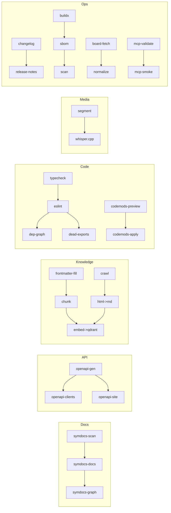

---
$$
uuid: 19d8ee75-296e-41ef-832a-2dda417ec812
$$
$$
created_at: '2025-09-03T11:44:54Z'
$$
filename: Pipeline Brainstorming
title: Pipeline Brainstorming
$$
description: >-
$$
  A set of plug-and-play pipelines for local TypeScript-first development,
  designed to automate documentation, API generation, RAG processing, web
  crawling, and code health checks without SaaS dependencies.
tags:
  - TypeScript
  - local
  - pipelines
  - RAG
  - API
  - code-health
  - web-crawling
  - automation
$$
related_to_uuid:
$$
  - fda3b0d4-86dc-481e-8d89-d50ad0ec5d93
  - ee4b3631-a745-485b-aff1-2da806cfadfb
$$
related_to_title:
$$
  - 'Promethean Pipelines: Local TypeScript-First Workflows'
  - Promethean Documentation Pipeline Overview
references:
  - uuid: fda3b0d4-86dc-481e-8d89-d50ad0ec5d93
    line: 220
    col: 0
    score: 0.95
---
# Pipeline brain storming
Love this question. Here are a bunch of *plug-and-play* pipelines we can add in the same style as your `symdocs` one—zero SaaS, all local, TypeScript-first. I kept each to a few clear steps so they’re composable. ^ref-4594f6ff-2-0

```yaml
pipelines:
  # 1) Complete the docs flow with graphs
  - name: docs-graph
    steps:
      - id: symdocs-graph
        deps: ["symdocs-docs"]
        cwd: .
        shell: "pnpm --filter @promethean/symdocs symdocs:04-graph --in .cache/symdocs/docs.json --out docs/graphs"
        inputs: [".cache/symdocs/docs.json"]
        outputs: ["docs/graphs/**/*.mmd", "docs/graphs/**/*.png"]

  # 2) OpenAPI from TS + typed clients + static viewer
  - name: api-openapi
    steps:
      - id: openapi-gen
        cwd: packages/api
        shell: "pnpm run openapi:build" # e.g., zod-to-openapi/ts-rest/redocly generate ./dist/openapi.json
        inputs: ["src/**/*.{ts,tsx}"]
        outputs: ["dist/openapi.json"]
      - id: openapi-clients
        deps: ["openapi-gen"]
        cwd: packages/clients
        shell: "pnpm openapi-typescript ../api/dist/openapi.json -o src/generated/openapi.d.ts && pnpm orval --config orval.config.cjs"
        inputs: ["../api/dist/openapi.json"]
        outputs: ["src/generated/**/*"]
      - id: openapi-site
        deps: ["openapi-gen"]
        cwd: packages/api
        shell: "pnpm run openapi:site" # bundle swagger-ui or redoc static
        inputs: ["dist/openapi.json"]
        outputs: ["public/openapi/**/*"]

  # 3) RAG for docs/unique (frontmatter → chunk → embed → index)
  - name: rag-unique
    steps:
      - id: fm-extract-and-fill
        cwd: tools/rag
        shell: "pnpm tsx scripts/frontmatter-fill.ts docs/unique --model qwen3:4b --cache .cache/rag/fm"
        inputs: ["../../docs/unique/**/*.{md,mdx}"]
        outputs: [".cache/rag/fm/**/*.json", "docs/unique/**/*.{md,mdx}"]
      - id: rag-chunk
        deps: ["fm-extract-and-fill"]
        cwd: tools/rag
        shell: "pnpm tsx scripts/chunk.ts docs/unique --out .cache/rag/chunks.jsonl"
        inputs: ["docs/unique/**/*.{md,mdx}"]
        outputs: [".cache/rag/chunks.jsonl"]
      - id: rag-embed-qdrant
        deps: ["rag-chunk"]
        cwd: tools/rag
        shell: "pnpm tsx scripts/embed-qdrant.ts .cache/rag/chunks.jsonl --model nomic-embed-text --collection unique"
        inputs: [".cache/rag/chunks.jsonl"]
        outputs: [".cache/rag/embeddings/unique.done"]

  # 4) Web crawler → clean → index
  - name: crawl-and-index
    steps:
      - id: crawl
        cwd: tools/crawl
        shell: "pnpm tsx crawl/crawlee.ts --seed ./seeds.txt --out .cache/crawl/raw"
        inputs: ["seeds.txt"]
        outputs: [".cache/crawl/raw/**/*.html"]
      - id: sanitize-to-md
        deps: ["crawl"]
        cwd: tools/crawl
        shell: "pnpm tsx crawl/html-to-md.ts .cache/crawl/raw .cache/crawl/md"
        inputs: [".cache/crawl/raw/**/*.html"]
        outputs: [".cache/crawl/md/**/*.md"]
      - id: embed-index
        deps: ["sanitize-to-md"]
        cwd: tools/rag
        shell: "pnpm tsx scripts/embed-qdrant.ts .cache/crawl/md --model nomic-embed-text --collection crawl"
        inputs: [".cache/crawl/md/**/*.md"]
        outputs: [".cache/rag/embeddings/crawl.done"]

  # 5) Code health + boundaries (no Python)
  - name: code-health
    steps:
      - id: typecheck
        cwd: .
        shell: "pnpm -r run typecheck"
        inputs: ["packages/**/{src,lib}/**/*.{ts,tsx}","tsconfig.json"]
        outputs: [".cache/health/typecheck.ok"]
      - id: eslint
        deps: ["typecheck"]
        cwd: .
        shell: "pnpm -r run lint"
        inputs: ["packages/**/{src,lib}/**/*.{ts,tsx,js,jsx}"]
        outputs: [".cache/health/lint.ok"]
      - id: deps-graph
        deps: ["eslint"]
        cwd: .
        shell: "pnpm dependency-cruiser --config .depcruise.cjs packages --output-type dot | dot -Tsvg > .cache/health/depgraph.svg"
        inputs: ["packages/**"]
        outputs: [".cache/health/depgraph.svg"]
      - id: dead-exports
        deps: ["eslint"]
        cwd: .
        shell: "pnpm ts-prune --json > .cache/health/ts-prune.json"
        inputs: ["packages/**/{src,lib}/**/*.{ts,tsx}"]
        outputs: [".cache/health/ts-prune.json"]

  # 6) Structural refactor diffs (AST) — pairs with your tree-diff task
  - name: ast-refactor
    steps:
      - id: codemods-dry-run
        cwd: tools/codemods
        shell: "pnpm jscodeshift -t codemods/*.ts ../../packages --dry --print > .cache/codemods/preview.diff"
        inputs: ["codemods/*.ts","../../packages/**/{src,lib}/**/*.{ts,tsx}"]
        outputs: [".cache/codemods/preview.diff"]
      - id: codemods-apply
        deps: ["codemods-dry-run"]
        cwd: tools/codemods
        shell: "pnpm jscodeshift -t codemods/*.ts ../../packages && pnpm tsx codemods/validate.ts"
        inputs: ["codemods/*.ts"]
        outputs: [".cache/codemods/applied.ok"]

  # 7) Media → transcript (no Python)
  - name: media-transcribe
    steps:
      - id: segment-audio
        cwd: data/audio
        shell: "find . -type f -name '*.mp3' -o -name '*.wav' | xargs -I{} ffmpeg -y -i {} -ar 16000 -ac 1 .cache/audio/{/.}.wav"
        inputs: ["**/*.{mp3,wav}"]
        outputs: [".cache/audio/**/*.wav"]
      - id: whispercpp
        deps: ["segment-audio"]
        cwd: tools/stt
        shell: "pnpm tsx scripts/whispercpp.ts .cache/audio --out .cache/stt"
        inputs: [".cache/audio/**/*.wav"]
        outputs: [".cache/stt/**/*.json",".cache/stt/**/*.srt"]

  # 8) Agent evals (prompt suites vs Cephalon/Ollama)
  - name: agent-evals
    steps:
      - id: run-bench
        cwd: tools/evals
        shell: "pnpm tsx run-evals.ts --suites suites/*.yaml --model qwen3:8b --out .cache/evals/results.json"
        inputs: ["suites/*.yaml"]
        outputs: [".cache/evals/results.json"]
      - id: score-and-report
        deps: ["run-bench"]
        cwd: tools/evals
        shell: "pnpm tsx score.ts .cache/evals/results.json > docs/evals/report.md"
        inputs: [".cache/evals/results.json"]
        outputs: ["docs/evals/report.md"]

  # 9) Changelog + release notes (Rust/Go tools, no Python)
  - name: release-notes
    steps:
      - id: changelog
        cwd: .
        shell: "git-cliff -o docs/CHANGELOG.md"
        inputs: [".git/**"]
        outputs: ["docs/CHANGELOG.md"]
      - id: notes-from-diffs
        deps: ["changelog"]
        cwd: tools/release
        shell: "pnpm tsx notes-from-diff.ts --since main > docs/RELEASE_NOTES.md"
        inputs: ["../../**/*"]
        outputs: ["docs/RELEASE_NOTES.md"]

  # 10) Build & attest containers (SBOM + vuln scan)
  - name: images
    steps:
      - id: buildx
        cwd: images
        shell: "docker buildx bake -f bake.hcl --set *.platform=linux/amd64 --print && docker buildx bake -f bake.hcl"
        inputs: ["*.docker","bake.hcl","../packages/**"]
        outputs: [".cache/images/build.ok"]
      - id: sbom
        deps: ["buildx"]
        cwd: images
        shell: "syft packages:local -o json > ../docs/sbom.json"
        inputs: []
        outputs: ["../docs/sbom.json"]
      - id: scan
        deps: ["sbom"]
        cwd: images
        shell: "grype sbom:../docs/sbom.json -o json > ../docs/vulns.json || true"
        inputs: ["../docs/sbom.json"]
        outputs: ["../docs/vulns.json"]

  # 11) Board sync (Obsidian/GitHub raw → normalized tasks)
  - name: board-sync
    steps:
      - id: fetch-kanban
        cwd: packages/kanban/src/board
        shell: "pnpm tsx fetch-kanban.ts --url  --out .cache/board/kanban.md"
        inputs: []
        outputs: [".cache/board/kanban.md"]
      - id: normalize
        deps: ["fetch-kanban"]
        cwd: packages/kanban/src/board
        shell: "pnpm tsx normalize-kanban.ts .cache/board/kanban.md --out .cache/board/normalized.json"
        inputs: [".cache/board/kanban.md"]
        outputs: [".cache/board/normalized.json"]

  # 12) MCP tool registry checks
  - name: mcp-tools
    steps:
      - id: manifest-validate
        cwd: tools/mcp
        shell: "pnpm tsx validate-tooling.ts ./tools/mcp/manifests --out .cache/mcp/validation.json"
        inputs: ["manifests/**/*.json"]
        outputs: [".cache/mcp/validation.json"]
      - id: smoke-connect
        deps: ["manifest-validate"]
        cwd: tools/mcp
        shell: "pnpm tsx smoke.ts --manifest manifests/*.json --out .cache/mcp/smoke.log"
        inputs: ["manifests/*.json"]
        outputs: [".cache/mcp/smoke.log"]
```
$$
^ref-4594f6ff-4-0
$$
Here’s a quick mental model of how they relate:



If you want, I can scaffold any of these $scripts + pnpm targets$ and slot them into your repo layout exactly where you prefer $`tools/*`, `images/*`, `docs/*`, `packages/*`$.
./tools/mcp/manifests --out .cache/mcp/validation.json"
$$
        inputs: ["manifests/**/*.json"]
$$
        outputs: $".cache/mcp/validation.json"$
      - id: smoke-connect
$$
        deps: ["manifest-validate"]
$$
$$
        cwd: tools/mcp
$$
        shell: "pnpm tsx smoke.ts --manifest manifests/*.json --out .cache/mcp/smoke.log"
$$
        inputs: ["manifests/*.json"]
$$
        outputs: $".cache/mcp/smoke.log"$
```

Here’s a quick mental model of how they relate:

```mermaid
flowchart LR
  subgraph Docs
    A$symdocs-scan$ --> B$symdocs-docs$ --> C$symdocs-graph$
  end

  subgraph API
$$
    D[openapi-gen] --> E[openapi-clients]
$$
$$
    D --> F[openapi-site]
$$
  end

  subgraph Knowledge
    G$frontmatter-fill$ --> H[chunk] --> I$embed->qdrant$
$$
    J[crawl] --> K[html->md] --> I
$$
  end

  subgraph Code
$$
    L[typecheck] --> M[eslint] --> N[dep-graph]
$$
$$
    M --> O[dead-exports]
$$
$$
    P[codemods-preview] --> Q[codemods-apply]
$$
  end

  subgraph Media
$$
    R[segment] --> S[whisper.cpp]
$$
  end

  subgraph Ops
$$
    T[changelog] --> U[release-notes]
$$
$$
    V[buildx] --> W[sbom] --> X[scan]
$$
$$
    Y[board-fetch] --> Z[normalize]
$$
    AA$mcp-validate$ --> AB$mcp-smoke$
  end
```

If you want, I can scaffold any of these $scripts + pnpm targets$ and slot them into your repo layout exactly where you prefer $`tools/*`, `images/*`, `docs/*`, `packages/*`$.
<!-- GENERATED-SECTIONS:DO-NOT-EDIT-BELOW -->
## Related content
- $Promethean Pipelines: Local TypeScript-First Workflows$$promethean-pipelines-local-typescript-first-workflow.md$
- $[promethean-documentation-pipeline-overview|Promethean Documentation Pipeline Overview]$
## Sources
- $Promethean Pipelines: Local TypeScript-First Workflows — L220$$promethean-pipelines-local-typescript-first-workflow.md#^ref-fda3b0d4-220-0$ (line 220, col 0, score 0.95)
<!-- GENERATED-SECTIONS:DO-NOT-EDIT-ABOVE -->
