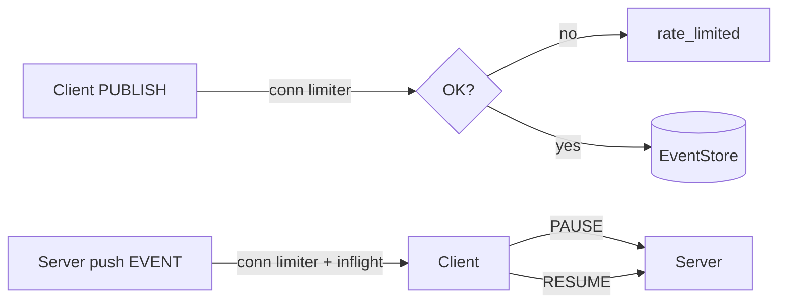

---
```
uuid: aee4718b-9f8b-4635-a0c1-ef61c9bea8f1
```
```
created_at: 2025.08.08.19.08.25.md
```
filename: prom-lib-rate-limiters-and-replay-api
```
description: >-
```
  Implements token bucket rate limiting for WebSocket connections and topics,
  with backpressure handling, pause/resume controls, and a replay/export API for
  event data retrieval via HTTP NDJSON.
tags:
  - rate-limiting
  - backpressure
  - token-bucket
  - replay-api
  - event-store
  - ws-gateway
  - exactly-once
  - bench-harness
```
related_to_title:
```
  - State Snapshots API and Transactional Projector
  - Promethean Event Bus MVP v0.1
  - schema-evolution-workflow
  - Chroma Toolkit Consolidation Plan
  - Event Bus MVP
  - Mongo Outbox Implementation
  - Stateful Partitions and Rebalancing
  - Migrate to Provider-Tenant Architecture
  - 'Agent Tasks: Persistence Migration to DualStore'
  - eidolon-field-math-foundations
  - Services
  - Per-Domain Policy System for JS Crawler
  - ecs-offload-workers
  - Board Walk – 2025-08-11
  - Dynamic Context Model for Web Components
  - Event Bus Projections Architecture
  - aionian-circuit-math
  - observability-infrastructure-setup
  - Cross-Language Runtime Polymorphism
  - Cross-Target Macro System in Sibilant
  - Promethean-native config design
  - Sibilant Meta-Prompt DSL
  - template-based-compilation
  - Unique Info Dump Index
  - WebSocket Gateway Implementation
  - Prompt_Folder_Bootstrap
```
related_to_uuid:
```
  - 509e1cd5-367c-4a9d-a61b-cef2e85d42ce
  - fe7193a2-a5f7-4b3c-bea0-bd028815fc2c
  - d8059b6a-c1ec-487d-8e0b-3ce33d6b4d06
  - 5020e892-8f18-443a-b707-6d0f3efcfe22
  - 534fe91d-e87d-4cc7-b0e7-8b6833353d9b
  - 9c1acd1e-c6a4-4a49-a66f-6da8b1bc9333
  - 4330e8f0-5f46-4235-918b-39b6b93fa561
  - 54382370-1931-4a19-a634-46735708a9ea
  - 93d2ba51-8689-49ee-94e2-296092e48058
  - 008f2ac0-bfaa-4d52-9826-2d5e86c0059f
  - 75ea4a6a-8270-488d-9d37-799c288e5f70
  - c03020e1-e3e7-48bf-aa7e-aa740c601b63
  - 6498b9d7-bd35-4bd3-89fb-af1c415c3cd1
  - 7aa1eb92-7f9a-485b-8218-9b553aa9eefc
  - f7702bf8-f7db-473c-9a5b-8dbf66ad3b9e
  - cf6b9b17-bb91-4219-aa5c-172cba02b2da
  - f2d83a77-7f86-4c56-8538-1350167a0c6c
  - b4e64f8c-4dc9-4941-a877-646c5ada068e
  - c34c36a6-80c9-4b44-a200-6448543b1b33
  - 5f210ca2-54e9-445b-afe4-fb340d4992c5
  - ab748541-020e-4a7e-b07d-28173bd5bea2
  - af5d2824-faad-476c-a389-e912d9bc672c
  - f8877e5e-1e4f-4478-93cd-a0bf86d26a41
  - 30ec3ba6-fbca-4606-ac3e-89b747fbeb7c
  - e811123d-5841-4e52-bf8c-978f26db4230
  - bd4f0976-0d5b-47f6-a20a-0601d1842dc1
references:
  - uuid: fe7193a2-a5f7-4b3c-bea0-bd028815fc2c
    line: 141
    col: 1
    score: 0.93
  - uuid: d8059b6a-c1ec-487d-8e0b-3ce33d6b4d06
    line: 130
    col: 1
    score: 1
  - uuid: d8059b6a-c1ec-487d-8e0b-3ce33d6b4d06
    line: 222
    col: 1
    score: 1
  - uuid: 509e1cd5-367c-4a9d-a61b-cef2e85d42ce
    line: 233
    col: 1
    score: 1
  - uuid: 509e1cd5-367c-4a9d-a61b-cef2e85d42ce
    line: 160
    col: 1
    score: 0.88
  - uuid: 534fe91d-e87d-4cc7-b0e7-8b6833353d9b
    line: 258
    col: 1
    score: 0.86
  - uuid: fe7193a2-a5f7-4b3c-bea0-bd028815fc2c
    line: 102
    col: 5
    score: 0.89
  - uuid: fe7193a2-a5f7-4b3c-bea0-bd028815fc2c
    line: 102
    col: 7
    score: 0.89
  - uuid: 5020e892-8f18-443a-b707-6d0f3efcfe22
    line: 122
    col: 5
    score: 0.95
  - uuid: fe7193a2-a5f7-4b3c-bea0-bd028815fc2c
    line: 117
    col: 1
    score: 1
  - uuid: 75ea4a6a-8270-488d-9d37-799c288e5f70
    line: 11
    col: 1
    score: 1
  - uuid: 75ea4a6a-8270-488d-9d37-799c288e5f70
    line: 11
    col: 3
    score: 1
  - uuid: 534fe91d-e87d-4cc7-b0e7-8b6833353d9b
    line: 554
    col: 1
    score: 1
  - uuid: 534fe91d-e87d-4cc7-b0e7-8b6833353d9b
    line: 554
    col: 3
    score: 1
  - uuid: 9c1acd1e-c6a4-4a49-a66f-6da8b1bc9333
    line: 553
    col: 1
    score: 1
  - uuid: 9c1acd1e-c6a4-4a49-a66f-6da8b1bc9333
    line: 553
    col: 3
    score: 1
  - uuid: fe7193a2-a5f7-4b3c-bea0-bd028815fc2c
    line: 891
    col: 1
    score: 1
  - uuid: fe7193a2-a5f7-4b3c-bea0-bd028815fc2c
    line: 891
    col: 3
    score: 1
  - uuid: 93d2ba51-8689-49ee-94e2-296092e48058
    line: 137
    col: 1
    score: 1
  - uuid: 93d2ba51-8689-49ee-94e2-296092e48058
    line: 137
    col: 3
    score: 1
  - uuid: 5020e892-8f18-443a-b707-6d0f3efcfe22
    line: 175
    col: 1
    score: 1
  - uuid: 5020e892-8f18-443a-b707-6d0f3efcfe22
    line: 175
    col: 3
    score: 1
  - uuid: 534fe91d-e87d-4cc7-b0e7-8b6833353d9b
    line: 547
    col: 1
    score: 1
  - uuid: 534fe91d-e87d-4cc7-b0e7-8b6833353d9b
    line: 547
    col: 3
    score: 1
  - uuid: cf6b9b17-bb91-4219-aa5c-172cba02b2da
    line: 150
    col: 1
    score: 1
  - uuid: cf6b9b17-bb91-4219-aa5c-172cba02b2da
    line: 150
    col: 3
    score: 1
  - uuid: 75ea4a6a-8270-488d-9d37-799c288e5f70
    line: 12
    col: 1
    score: 1
  - uuid: 75ea4a6a-8270-488d-9d37-799c288e5f70
    line: 12
    col: 3
    score: 1
  - uuid: c34c36a6-80c9-4b44-a200-6448543b1b33
    line: 211
    col: 1
    score: 1
  - uuid: c34c36a6-80c9-4b44-a200-6448543b1b33
    line: 211
    col: 3
    score: 1
  - uuid: 534fe91d-e87d-4cc7-b0e7-8b6833353d9b
    line: 550
    col: 1
    score: 1
  - uuid: 534fe91d-e87d-4cc7-b0e7-8b6833353d9b
    line: 550
    col: 3
    score: 1
  - uuid: 9c1acd1e-c6a4-4a49-a66f-6da8b1bc9333
    line: 554
    col: 1
    score: 1
  - uuid: 9c1acd1e-c6a4-4a49-a66f-6da8b1bc9333
    line: 554
    col: 3
    score: 1
  - uuid: 93d2ba51-8689-49ee-94e2-296092e48058
    line: 134
    col: 1
    score: 1
  - uuid: 93d2ba51-8689-49ee-94e2-296092e48058
    line: 134
    col: 3
    score: 1
  - uuid: f2d83a77-7f86-4c56-8538-1350167a0c6c
    line: 156
    col: 1
    score: 1
  - uuid: f2d83a77-7f86-4c56-8538-1350167a0c6c
    line: 156
    col: 3
    score: 1
  - uuid: 7aa1eb92-7f9a-485b-8218-9b553aa9eefc
    line: 136
    col: 1
    score: 1
  - uuid: 7aa1eb92-7f9a-485b-8218-9b553aa9eefc
    line: 136
    col: 3
    score: 1
  - uuid: f7702bf8-f7db-473c-9a5b-8dbf66ad3b9e
    line: 386
    col: 1
    score: 1
  - uuid: f7702bf8-f7db-473c-9a5b-8dbf66ad3b9e
    line: 386
    col: 3
    score: 1
  - uuid: 9c1acd1e-c6a4-4a49-a66f-6da8b1bc9333
    line: 552
    col: 1
    score: 1
  - uuid: 9c1acd1e-c6a4-4a49-a66f-6da8b1bc9333
    line: 552
    col: 3
    score: 1
  - uuid: fe7193a2-a5f7-4b3c-bea0-bd028815fc2c
    line: 881
    col: 1
    score: 1
  - uuid: fe7193a2-a5f7-4b3c-bea0-bd028815fc2c
    line: 881
    col: 3
    score: 1
  - uuid: d8059b6a-c1ec-487d-8e0b-3ce33d6b4d06
    line: 485
    col: 1
    score: 1
  - uuid: d8059b6a-c1ec-487d-8e0b-3ce33d6b4d06
    line: 485
    col: 3
    score: 1
  - uuid: 509e1cd5-367c-4a9d-a61b-cef2e85d42ce
    line: 341
    col: 1
    score: 1
  - uuid: 509e1cd5-367c-4a9d-a61b-cef2e85d42ce
    line: 341
    col: 3
    score: 1
  - uuid: 75ea4a6a-8270-488d-9d37-799c288e5f70
    line: 13
    col: 1
    score: 1
  - uuid: 75ea4a6a-8270-488d-9d37-799c288e5f70
    line: 13
    col: 3
    score: 1
  - uuid: 6498b9d7-bd35-4bd3-89fb-af1c415c3cd1
    line: 467
    col: 1
    score: 1
  - uuid: 6498b9d7-bd35-4bd3-89fb-af1c415c3cd1
    line: 467
    col: 3
    score: 1
  - uuid: 534fe91d-e87d-4cc7-b0e7-8b6833353d9b
    line: 549
    col: 1
    score: 1
  - uuid: 534fe91d-e87d-4cc7-b0e7-8b6833353d9b
    line: 549
    col: 3
    score: 1
  - uuid: b4e64f8c-4dc9-4941-a877-646c5ada068e
    line: 364
    col: 1
    score: 1
  - uuid: b4e64f8c-4dc9-4941-a877-646c5ada068e
    line: 364
    col: 3
    score: 1
  - uuid: 75ea4a6a-8270-488d-9d37-799c288e5f70
    line: 14
    col: 1
    score: 1
  - uuid: 75ea4a6a-8270-488d-9d37-799c288e5f70
    line: 14
    col: 3
    score: 1
  - uuid: 534fe91d-e87d-4cc7-b0e7-8b6833353d9b
    line: 553
    col: 1
    score: 1
  - uuid: 534fe91d-e87d-4cc7-b0e7-8b6833353d9b
    line: 553
    col: 3
    score: 1
  - uuid: 9c1acd1e-c6a4-4a49-a66f-6da8b1bc9333
    line: 559
    col: 1
    score: 1
  - uuid: 9c1acd1e-c6a4-4a49-a66f-6da8b1bc9333
    line: 559
    col: 3
    score: 1
  - uuid: fe7193a2-a5f7-4b3c-bea0-bd028815fc2c
    line: 892
    col: 1
    score: 1
  - uuid: fe7193a2-a5f7-4b3c-bea0-bd028815fc2c
    line: 892
    col: 3
    score: 1
  - uuid: 93d2ba51-8689-49ee-94e2-296092e48058
    line: 131
    col: 1
    score: 1
  - uuid: 93d2ba51-8689-49ee-94e2-296092e48058
    line: 131
    col: 3
    score: 1
  - uuid: 5020e892-8f18-443a-b707-6d0f3efcfe22
    line: 169
    col: 1
    score: 1
  - uuid: 5020e892-8f18-443a-b707-6d0f3efcfe22
    line: 169
    col: 3
    score: 1
  - uuid: 5f210ca2-54e9-445b-afe4-fb340d4992c5
    line: 175
    col: 1
    score: 1
  - uuid: 5f210ca2-54e9-445b-afe4-fb340d4992c5
    line: 175
    col: 3
    score: 1
  - uuid: f7702bf8-f7db-473c-9a5b-8dbf66ad3b9e
    line: 392
    col: 1
    score: 1
  - uuid: f7702bf8-f7db-473c-9a5b-8dbf66ad3b9e
    line: 392
    col: 3
    score: 1
  - uuid: 5020e892-8f18-443a-b707-6d0f3efcfe22
    line: 173
    col: 1
    score: 1
  - uuid: 5020e892-8f18-443a-b707-6d0f3efcfe22
    line: 173
    col: 3
    score: 1
  - uuid: 008f2ac0-bfaa-4d52-9826-2d5e86c0059f
    line: 133
    col: 1
    score: 1
  - uuid: 008f2ac0-bfaa-4d52-9826-2d5e86c0059f
    line: 133
    col: 3
    score: 1
  - uuid: 54382370-1931-4a19-a634-46735708a9ea
    line: 266
    col: 1
    score: 1
  - uuid: 54382370-1931-4a19-a634-46735708a9ea
    line: 266
    col: 3
    score: 1
  - uuid: c03020e1-e3e7-48bf-aa7e-aa740c601b63
    line: 472
    col: 1
    score: 1
  - uuid: c03020e1-e3e7-48bf-aa7e-aa740c601b63
    line: 472
    col: 3
    score: 1
  - uuid: e811123d-5841-4e52-bf8c-978f26db4230
    line: 642
    col: 1
    score: 0.98
  - uuid: e811123d-5841-4e52-bf8c-978f26db4230
    line: 642
    col: 3
    score: 0.98
  - uuid: 534fe91d-e87d-4cc7-b0e7-8b6833353d9b
    line: 560
    col: 1
    score: 0.98
  - uuid: 534fe91d-e87d-4cc7-b0e7-8b6833353d9b
    line: 560
    col: 3
    score: 0.98
  - uuid: 534fe91d-e87d-4cc7-b0e7-8b6833353d9b
    line: 557
    col: 1
    score: 0.98
  - uuid: 534fe91d-e87d-4cc7-b0e7-8b6833353d9b
    line: 557
    col: 3
    score: 0.98
  - uuid: 30ec3ba6-fbca-4606-ac3e-89b747fbeb7c
    line: 112
    col: 1
    score: 0.98
  - uuid: 30ec3ba6-fbca-4606-ac3e-89b747fbeb7c
    line: 112
    col: 3
    score: 0.98
  - uuid: 509e1cd5-367c-4a9d-a61b-cef2e85d42ce
    line: 350
    col: 1
    score: 0.98
  - uuid: 509e1cd5-367c-4a9d-a61b-cef2e85d42ce
    line: 350
    col: 3
    score: 0.98
  - uuid: 4330e8f0-5f46-4235-918b-39b6b93fa561
    line: 544
    col: 1
    score: 0.97
  - uuid: 4330e8f0-5f46-4235-918b-39b6b93fa561
    line: 544
    col: 3
    score: 0.97
  - uuid: 4330e8f0-5f46-4235-918b-39b6b93fa561
    line: 542
    col: 1
    score: 0.97
  - uuid: 4330e8f0-5f46-4235-918b-39b6b93fa561
    line: 542
    col: 3
    score: 0.97
  - uuid: 534fe91d-e87d-4cc7-b0e7-8b6833353d9b
    line: 564
    col: 1
    score: 0.97
  - uuid: 534fe91d-e87d-4cc7-b0e7-8b6833353d9b
    line: 564
    col: 3
    score: 0.97
  - uuid: 509e1cd5-367c-4a9d-a61b-cef2e85d42ce
    line: 351
    col: 1
    score: 0.98
  - uuid: 509e1cd5-367c-4a9d-a61b-cef2e85d42ce
    line: 351
    col: 3
    score: 0.98
  - uuid: 4330e8f0-5f46-4235-918b-39b6b93fa561
    line: 543
    col: 1
    score: 0.97
  - uuid: 4330e8f0-5f46-4235-918b-39b6b93fa561
    line: 543
    col: 3
    score: 0.97
  - uuid: d8059b6a-c1ec-487d-8e0b-3ce33d6b4d06
    line: 495
    col: 1
    score: 1
  - uuid: d8059b6a-c1ec-487d-8e0b-3ce33d6b4d06
    line: 495
    col: 3
    score: 1
  - uuid: e811123d-5841-4e52-bf8c-978f26db4230
    line: 646
    col: 1
    score: 0.99
  - uuid: e811123d-5841-4e52-bf8c-978f26db4230
    line: 646
    col: 3
    score: 0.99
  - uuid: d8059b6a-c1ec-487d-8e0b-3ce33d6b4d06
    line: 496
    col: 1
    score: 0.99
  - uuid: d8059b6a-c1ec-487d-8e0b-3ce33d6b4d06
    line: 496
    col: 3
    score: 0.99
  - uuid: 75ea4a6a-8270-488d-9d37-799c288e5f70
    line: 25
    col: 1
    score: 0.98
  - uuid: 75ea4a6a-8270-488d-9d37-799c288e5f70
    line: 25
    col: 3
    score: 0.98
  - uuid: 30ec3ba6-fbca-4606-ac3e-89b747fbeb7c
    line: 160
    col: 1
    score: 0.99
  - uuid: 30ec3ba6-fbca-4606-ac3e-89b747fbeb7c
    line: 160
    col: 3
    score: 0.99
  - uuid: fe7193a2-a5f7-4b3c-bea0-bd028815fc2c
    line: 907
    col: 1
    score: 0.99
  - uuid: fe7193a2-a5f7-4b3c-bea0-bd028815fc2c
    line: 907
    col: 3
    score: 0.99
  - uuid: e811123d-5841-4e52-bf8c-978f26db4230
    line: 645
    col: 1
    score: 0.98
  - uuid: e811123d-5841-4e52-bf8c-978f26db4230
    line: 645
    col: 3
    score: 0.98
  - uuid: 9c1acd1e-c6a4-4a49-a66f-6da8b1bc9333
    line: 564
    col: 1
    score: 0.98
  - uuid: 9c1acd1e-c6a4-4a49-a66f-6da8b1bc9333
    line: 564
    col: 3
    score: 0.98
  - uuid: d8059b6a-c1ec-487d-8e0b-3ce33d6b4d06
    line: 498
    col: 1
    score: 0.98
  - uuid: d8059b6a-c1ec-487d-8e0b-3ce33d6b4d06
    line: 498
    col: 3
    score: 0.98
  - uuid: 30ec3ba6-fbca-4606-ac3e-89b747fbeb7c
    line: 110
    col: 1
    score: 0.99
  - uuid: 30ec3ba6-fbca-4606-ac3e-89b747fbeb7c
    line: 110
    col: 3
    score: 0.99
  - uuid: 54382370-1931-4a19-a634-46735708a9ea
    line: 301
    col: 1
    score: 0.99
  - uuid: 54382370-1931-4a19-a634-46735708a9ea
    line: 301
    col: 3
    score: 0.99
  - uuid: bd4f0976-0d5b-47f6-a20a-0601d1842dc1
    line: 197
    col: 1
    score: 0.99
  - uuid: bd4f0976-0d5b-47f6-a20a-0601d1842dc1
    line: 197
    col: 3
    score: 0.99
  - uuid: 30ec3ba6-fbca-4606-ac3e-89b747fbeb7c
    line: 113
    col: 1
    score: 0.99
  - uuid: 30ec3ba6-fbca-4606-ac3e-89b747fbeb7c
    line: 113
    col: 3
    score: 0.99
  - uuid: 30ec3ba6-fbca-4606-ac3e-89b747fbeb7c
    line: 111
    col: 1
    score: 0.99
  - uuid: 30ec3ba6-fbca-4606-ac3e-89b747fbeb7c
    line: 111
    col: 3
    score: 0.99
  - uuid: 54382370-1931-4a19-a634-46735708a9ea
    line: 302
    col: 1
    score: 0.99
  - uuid: 54382370-1931-4a19-a634-46735708a9ea
    line: 302
    col: 3
    score: 0.99
  - uuid: bd4f0976-0d5b-47f6-a20a-0601d1842dc1
    line: 198
    col: 1
    score: 0.99
  - uuid: bd4f0976-0d5b-47f6-a20a-0601d1842dc1
    line: 198
    col: 3
    score: 0.99
  - uuid: f7702bf8-f7db-473c-9a5b-8dbf66ad3b9e
    line: 406
    col: 1
    score: 1
  - uuid: f7702bf8-f7db-473c-9a5b-8dbf66ad3b9e
    line: 406
    col: 3
    score: 1
  - uuid: ab748541-020e-4a7e-b07d-28173bd5bea2
    line: 399
    col: 1
    score: 1
  - uuid: ab748541-020e-4a7e-b07d-28173bd5bea2
    line: 399
    col: 3
    score: 1
  - uuid: af5d2824-faad-476c-a389-e912d9bc672c
    line: 203
    col: 1
    score: 1
  - uuid: af5d2824-faad-476c-a389-e912d9bc672c
    line: 203
    col: 3
    score: 1
  - uuid: f8877e5e-1e4f-4478-93cd-a0bf86d26a41
    line: 126
    col: 1
    score: 1
  - uuid: f8877e5e-1e4f-4478-93cd-a0bf86d26a41
    line: 126
    col: 3
    score: 1
---
Alright, Part 4: **backpressure + rate limits, replay/export API, exactly-once-ish consumer, and a tiny bench harness**. Paste into `shared/js/prom-lib/` and a `bench/` folder. Minimal but real.

---

# 1) Backpressure + Rate Limits

## 1a) Token bucket

```ts
// shared/js/prom-lib/rate/limiter.ts
export class TokenBucket {
  private capacity: number;
  private tokens: number;
  private refillPerSec: number;
  private last: number;

  constructor({ capacity, refillPerSec }: { capacity: number; refillPerSec: number }) {
    this.capacity = capacity;
    this.tokens = capacity;
    this.refillPerSec = refillPerSec;
    this.last = Date.now();
  }
  private refill() {
    const now = Date.now();
    const delta = (now - this.last) / 1000;
    this.tokens = Math.min(this.capacity, this.tokens + delta * this.refillPerSec);
    this.last = now;
  }
  tryConsume(n = 1): boolean {
    this.refill();
    if (this.tokens >= n) { this.tokens -= n; return true; }
    return false;
  }
  deficit(n = 1): number {
    this.refill();
    return Math.max(0, n - this.tokens);
  }
}
```

## 1b) Wire into WS Gateway publish + per-sub delivery

Add to your WS server:

```ts
// shared/js/prom-lib/ws/server.rate.ts
import { TokenBucket } from "../rate/limiter";

export function makeConnLimiter() {
  return new TokenBucket({ capacity: 200, refillPerSec: 200 }); // 200 msgs/sec burst
}
export function makeTopicLimiter(topic: string) {
  // customize per-topic if needed
  return new TokenBucket({ capacity: 1000, refillPerSec: 1000 });
}
```

Patch `startWSGateway`:

* On connection: `const connLimiter = makeConnLimiter();`
* Maintain a `Map<string, TokenBucket>` for `topicLimiter`.
```
On **PUBLISH**:
```
```ts
if (!connLimiter.tryConsume(1)) return err("rate_limited", "conn publish rate exceeded");
const tl = topicLimiters.get(msg.topic) ?? (topicLimiters.set(msg.topic, makeTopicLimiter(msg.topic)), topicLimiters.get(msg.topic)!);
if (!tl.tryConsume(1)) return err("rate_limited", "topic publish rate exceeded");
```

On **EVENT delivery** (inside subscribe handler), apply per-sub watermarks:

```ts
const deliver = () => {
  if (state.inflight.size >= maxInflight) return; // existing backpressure
  if (!connLimiter.tryConsume(1)) return;         // slow push if client is hot
  // (send EVENT ...)
};
```

## 1c) Pause/Resume (optional ops)
```
Support client-controlled backpressure:
```
* `PAUSE { op:"PAUSE", topic, group }`
* `RESUME { op:"RESUME", topic, group }`

Track `state.paused` and skip sending when paused. Client resumes when ready.

Mermaid:



---

# 2) Replay / Export API HTTP + NDJSON

```ts
// shared/js/prom-lib/http/replay.ts
import express from "express";
import { MongoEventStore } from "../event/mongo";
import { UUID } from "../event/types";

export function startReplayAPI(store: MongoEventStore, { port = 8083 } = {}) {
  const app = express();

  // GET /replay?topic=t&from=earliest|ts|afterId&ts=...&afterId=...&limit=1000
  app.get("/replay", async (req, res) => {
    try {
      const topic = String(req.query.topic || "");
      if (!topic) return res.status(400).json({ error: "topic required" });

      const from = String(req.query.from || "earliest");
      const ts = req.query.ts ? Number(req.query.ts) : undefined;
      const afterId = req.query.afterId ? String(req.query.afterId) as UUID : undefined;
      const limit = req.query.limit ? Number(req.query.limit) : 1000;

      const events = await store.scan(topic, {
        ts: from === "ts" ? ts : from === "earliest" ? 0 : undefined,
        afterId: from === "afterId" ? afterId : undefined,
        limit
      });
      res.json({ topic, count: events.length, events });
    } catch (e: any) {
      res.status(500).json({ error: e.message ?? String(e) });
    }
  });

  // GET /export?topic=t&fromTs=...&toTs=...&ndjson=1
  app.get("/export", async (req, res) => {
    try {
      const topic = String(req.query.topic || "");
      const fromTs = Number(req.query.fromTs || 0);
      const toTs = Number(req.query.toTs || Date.now());
      const ndjson = String(req.query.ndjson || "1") === "1";

      res.setHeader("Content-Type", ndjson ? "application/x-ndjson" : "application/json");
      if (!ndjson) res.write("[");
      let first = true;
      const batchSize = 5000;
      let cursorTs = fromTs;
      while (true) {
        const batch = await store.scan(topic, { ts: cursorTs, limit: batchSize });
        const filtered = batch.filter(e => e.ts <= toTs);
        if (filtered.length === 0) break;
        for (const e of filtered) {
          if (ndjson) {
            res.write(JSON.stringify(e) + "\n");
          } else {
            if (!first) res.write(",");
            res.write(JSON.stringify(e));
            first = false;
          }
        }
        const last = filtered.at(-1)!;
        cursorTs = last.ts + 1;
        if (filtered.length < batchSize || cursorTs > toTs) break;
      }
      if (!ndjson) res.write("]");
      res.end();
    } catch (e: any) {
      res.status(500).json({ error: e.message ?? String(e) });
    }
  });

  return app.listen(port, () => console.log(`[replay] on :{port}`));
}
```

**Indexes:** already covered: `{ topic:1, ts:1, id:1 }`.

---

# 3) Exactly-once-ish Consumer Helper (idempotency)

## 3a) Dedupe store

```ts
// shared/js/prom-lib/dedupe/types.ts
export interface DedupeStore {
  seen(topic: string, group: string, id: string): Promise<boolean>;
  mark(topic: string, group: string, id: string, ttlMs?: number): Promise<void>;
}
```

```ts
// shared/js/prom-lib/dedupe/mongo.ts
import { Collection, Db } from "mongodb";
import { DedupeStore } from "./types";

type Row = { _id: string; expireAt?: Date };

export class MongoDedupe implements DedupeStore {
  private coll: Collection<Row>;
  constructor(db: Db, name = "dedupe") {
    this.coll = db.collection(name);
    // TTL index (optional)
    this.coll.createIndex({ expireAt: 1 }, { expireAfterSeconds: 0 }).catch(() => {});
  }
  key(t: string, g: string, id: string) { return `{t}::{g}::{id}`; }
  async seen(topic: string, group: string, id: string) {
    const doc = await this.coll.findOne({ _id: this.key(topic, group, id) }, { projection: { _id: 1 } });
    return !!doc;
  }
  async mark(topic: string, group: string, id: string, ttlMs = 7 * 24 * 3600 * 1000) {
    const expireAt = new Date(Date.now() + ttlMs);
    await this.coll.updateOne(
      { _id: this.key(topic, group, id) },
      { setOnInsert: { expireAt } },
      { upsert: true }
    );
  }
}
```

## 3b) Wrapper

```ts
// shared/js/prom-lib/consumers/exactlyOnce.ts
import { EventBus, EventRecord } from "../event/types";
import { DedupeStore } from "../dedupe/types";

export async function subscribeExactlyOnce(
  bus: EventBus,
  topic: string,
  group: string,
  store: DedupeStore,
  handler: (e: EventRecord) => Promise<void>,
  opts: any = {}
) {
  return bus.subscribe(topic, group, async (e) => {
    if (await store.seen(topic, group, e.id)) {
      // already done; advance cursor
      return;
    }
    await handler(e);
    await store.mark(topic, group, e.id, opts.ttlMs);
  }, { ...opts, manualAck: false }); // we allow auto-ack since we mark-before-return
}
```

> Semantics: if handler throws, it won’t mark; event is retried. If handler is non-transactional, you still have “at-least-once with dedupe”.

---

# 4) Bench Harness throughput/latency
```
Directory: `bench/`.
```
## 4a) Publisher

```ts
// bench/publish.ts
import { InMemoryEventBus } from "../shared/js/prom-lib/event/memory";

async function run() {
  const n = Number(process.env.N ?? 100_000);
  const topic = process.env.TOPIC ?? "bench.topic";
  const bus = new InMemoryEventBus();

  const t0 = Date.now();
  for (let i=0; i<n; i++) {
    // embed publish timestamp for latency
    await bus.publish(topic, { i, t0: Date.now() });
  }
  const dt = Date.now() - t0;
  console.log(JSON.stringify({ published: n, ms: dt, mps: (n/(dt/1000)).toFixed(1) }));
}
run();
```

## 4b) Subscriber (latency stats)

```ts
// bench/subscribe.ts
import { InMemoryEventBus } from "../shared/js/prom-lib/event/memory";

function pct(arr: number[], p: number) {
  const i = Math.max(0, Math.min(arr.length-1, Math.floor((p/100)*arr.length)));
  return arr[i] ?? 0;
}

async function run() {
  const n = Number(process.env.N ?? 100_000);
  const topic = process.env.TOPIC ?? "bench.topic";
  const bus = new InMemoryEventBus();
  const lats: number[] = [];
  let seen = 0;

  await bus.subscribe(topic, "bench", async (e) => {
    seen++;
    const t0 = (e.payload as any).t0 ?? e.ts;
    lats.push(Date.now() - t0);
  }, { from: "earliest", batchSize: 1000 });

  // generate and consume in same process for demo
  for (let i=0; i<n; i++) await bus.publish(topic, { i, t0: Date.now() });

  const wait = () => new Promise(r => setTimeout(r, 50));
  while (seen < n) await wait();

  lats.sort((a,b)=>a-b);
  const report = {
    n, p50: pct(lats,50), p90: pct(lats,90), p99: pct(lats,99),
    max: lats.at(-1) ?? 0, avg: Math.round(lats.reduce((a,b)=>a+b,0)/lats.length)
  };
  console.log(JSON.stringify(report));
}
run();
```

> Swap `InMemoryEventBus` for `MongoEventBus` to test I/O costs.

---

# 5) Sizing & Ops Notes (Mongo)

* **Indexes**

  * `events(topic, ts, id)` for scans and replay
  * `events(topic, key, ts)` for compaction/snapshots
  * `events(id)` unique
  * `cursors_id` unique
  * `dedupe(expireAt)` TTL
  * `outboxstatus, lease_until` + `outbox(ts)`

* **Retention**

  * Use **TTL** or manual prune per topic. Keep raw `heartbeat.received` short (hours–days).
  * Store **snapshots** (`process.state.snapshot`) long-lived.

* **Write concern**

  * `w:1` is fine for high-rate telemetry; bump to `w:majority` for business events.
  * Consider **capped collections** only for ephemeral telemetry (but they don’t play great with arbitrary queries).

* **Throughput**

  * Keep payloads small; push blobs to object storage and attach refs.
  * Batch publishers where possible (outbox drainer does).
  * Avoid massive fan-out groups; prefer projectors + snapshots.

* **Hot topics**

  * Add per-topic token buckets.
  * Use **PAUSE/RESUME** and **max inflight** to protect clients.

* **Cold start**

  * Consumers first load `*.snapshot`, then subscribe to the live topic from `latest`.

---

# 6) Tiny Kanban Additions

* [ ] Add `TokenBucket` to WS server conn + per-topic
* [ ] Implement `PAUSE/RESUME` ops on gateway
* [ ] Launch `ReplayAPI` on `:8083`; test `/replay` and `/export?ndjson=1`
* [ ] Add `MongoDedupe` and replace critical consumers with `subscribeExactlyOnce`
* [ ] Run `bench/subscribe.ts` with Mongo bus and record p50/p99
* [ ] Add TTLs per topic via migration script

---
```
Want **Part 5**? I can push:
```
* **Stateful partitions** (hash by key for parallel consumers),
* **Rebalance hooks** for consumer groups,
* **Schema registry lite** zod validators per topic + evolution,
* and a **Changelog projector** topic → materialized Mongo collection with upsert/unique constraints.
<!-- GENERATED-SECTIONS:DO-NOT-EDIT-BELOW -->
## Related content
- [state-snapshots-api-and-transactional-projector|State Snapshots API and Transactional Projector]
- [Promethean Event Bus MVP v0.1]promethean-event-bus-mvp-v0-1.md
- [schema-evolution-workflow]
- [chroma-toolkit-consolidation-plan|Chroma Toolkit Consolidation Plan]
- [docs/unique/event-bus-mvp|Event Bus MVP]
- [mongo-outbox-implementation|Mongo Outbox Implementation]
- [stateful-partitions-and-rebalancing|Stateful Partitions and Rebalancing]
- [migrate-to-provider-tenant-architecture|Migrate to Provider-Tenant Architecture]
- [docs/unique/agent-tasks-persistence-migration-to-dualstore|Agent Tasks: Persistence Migration to DualStore]
- [docs/unique/eidolon-field-math-foundations|eidolon-field-math-foundations]
- [Services]chunks/services.md
- [per-domain-policy-system-for-js-crawler|Per-Domain Policy System for JS Crawler]
- [docs/unique/ecs-offload-workers|ecs-offload-workers]
- [board-walk-2025-08-11|Board Walk – 2025-08-11]
- [dynamic-context-model-for-web-components|Dynamic Context Model for Web Components]
- [event-bus-projections-architecture|Event Bus Projections Architecture]
- [docs/unique/aionian-circuit-math|aionian-circuit-math]
- [observability-infrastructure-setup]
- [cross-language-runtime-polymorphism|Cross-Language Runtime Polymorphism]
- [cross-target-macro-system-in-sibilant|Cross-Target Macro System in Sibilant]
- [promethean-native-config-design|Promethean-native config design]
- [sibilant-meta-prompt-dsl|Sibilant Meta-Prompt DSL]
- [docs/unique/template-based-compilation|template-based-compilation]
- [unique-info-dump-index|Unique Info Dump Index]
- [websocket-gateway-implementation|WebSocket Gateway Implementation]
- [prompt-folder-bootstrap|Prompt_Folder_Bootstrap]

## Sources
- [Promethean Event Bus MVP v0.1 — L141]promethean-event-bus-mvp-v0-1.md#L141 (line 141, col 1, score 0.93)
- [schema-evolution-workflow#L130|schema-evolution-workflow — L130] (line 130, col 1, score 1)
- [schema-evolution-workflow#L222|schema-evolution-workflow — L222] (line 222, col 1, score 1)
- [state-snapshots-api-and-transactional-projector#L233|State Snapshots API and Transactional Projector — L233] (line 233, col 1, score 1)
- [state-snapshots-api-and-transactional-projector#L160|State Snapshots API and Transactional Projector — L160] (line 160, col 1, score 0.88)
- [docs/unique/event-bus-mvp#L258|Event Bus MVP — L258] (line 258, col 1, score 0.86)
- [Promethean Event Bus MVP v0.1 — L102]promethean-event-bus-mvp-v0-1.md#L102 (line 102, col 5, score 0.89)
- [Promethean Event Bus MVP v0.1 — L102]promethean-event-bus-mvp-v0-1.md#L102 (line 102, col 7, score 0.89)
- [chroma-toolkit-consolidation-plan#L122|Chroma Toolkit Consolidation Plan — L122] (line 122, col 5, score 0.95)
- [Promethean Event Bus MVP v0.1 — L117]promethean-event-bus-mvp-v0-1.md#L117 (line 117, col 1, score 1)
- [Services — L11]chunks/services.md#L11 (line 11, col 1, score 1)
- [Services — L11]chunks/services.md#L11 (line 11, col 3, score 1)
- [docs/unique/event-bus-mvp#L554|Event Bus MVP — L554] (line 554, col 1, score 1)
- [docs/unique/event-bus-mvp#L554|Event Bus MVP — L554] (line 554, col 3, score 1)
- [mongo-outbox-implementation#L553|Mongo Outbox Implementation — L553] (line 553, col 1, score 1)
- [mongo-outbox-implementation#L553|Mongo Outbox Implementation — L553] (line 553, col 3, score 1)
- [Promethean Event Bus MVP v0.1 — L891]promethean-event-bus-mvp-v0-1.md#L891 (line 891, col 1, score 1)
- [Promethean Event Bus MVP v0.1 — L891]promethean-event-bus-mvp-v0-1.md#L891 (line 891, col 3, score 1)
- [docs/unique/agent-tasks-persistence-migration-to-dualstore#L137|Agent Tasks: Persistence Migration to DualStore — L137] (line 137, col 1, score 1)
- [docs/unique/agent-tasks-persistence-migration-to-dualstore#L137|Agent Tasks: Persistence Migration to DualStore — L137] (line 137, col 3, score 1)
- [chroma-toolkit-consolidation-plan#L175|Chroma Toolkit Consolidation Plan — L175] (line 175, col 1, score 1)
- [chroma-toolkit-consolidation-plan#L175|Chroma Toolkit Consolidation Plan — L175] (line 175, col 3, score 1)
- [docs/unique/event-bus-mvp#L547|Event Bus MVP — L547] (line 547, col 1, score 1)
- [docs/unique/event-bus-mvp#L547|Event Bus MVP — L547] (line 547, col 3, score 1)
- [event-bus-projections-architecture#L150|Event Bus Projections Architecture — L150] (line 150, col 1, score 1)
- [event-bus-projections-architecture#L150|Event Bus Projections Architecture — L150] (line 150, col 3, score 1)
- [Services — L12]chunks/services.md#L12 (line 12, col 1, score 1)
- [Services — L12]chunks/services.md#L12 (line 12, col 3, score 1)
- [cross-language-runtime-polymorphism#L211|Cross-Language Runtime Polymorphism — L211] (line 211, col 1, score 1)
- [cross-language-runtime-polymorphism#L211|Cross-Language Runtime Polymorphism — L211] (line 211, col 3, score 1)
- [docs/unique/event-bus-mvp#L550|Event Bus MVP — L550] (line 550, col 1, score 1)
- [docs/unique/event-bus-mvp#L550|Event Bus MVP — L550] (line 550, col 3, score 1)
- [mongo-outbox-implementation#L554|Mongo Outbox Implementation — L554] (line 554, col 1, score 1)
- [mongo-outbox-implementation#L554|Mongo Outbox Implementation — L554] (line 554, col 3, score 1)
- [docs/unique/agent-tasks-persistence-migration-to-dualstore#L134|Agent Tasks: Persistence Migration to DualStore — L134] (line 134, col 1, score 1)
- [docs/unique/agent-tasks-persistence-migration-to-dualstore#L134|Agent Tasks: Persistence Migration to DualStore — L134] (line 134, col 3, score 1)
- [docs/unique/aionian-circuit-math#L156|aionian-circuit-math — L156] (line 156, col 1, score 1)
- [docs/unique/aionian-circuit-math#L156|aionian-circuit-math — L156] (line 156, col 3, score 1)
- [board-walk-2025-08-11#L136|Board Walk – 2025-08-11 — L136] (line 136, col 1, score 1)
- [board-walk-2025-08-11#L136|Board Walk – 2025-08-11 — L136] (line 136, col 3, score 1)
- [dynamic-context-model-for-web-components#L386|Dynamic Context Model for Web Components — L386] (line 386, col 1, score 1)
- [dynamic-context-model-for-web-components#L386|Dynamic Context Model for Web Components — L386] (line 386, col 3, score 1)
- [mongo-outbox-implementation#L552|Mongo Outbox Implementation — L552] (line 552, col 1, score 1)
- [mongo-outbox-implementation#L552|Mongo Outbox Implementation — L552] (line 552, col 3, score 1)
- [Promethean Event Bus MVP v0.1 — L881]promethean-event-bus-mvp-v0-1.md#L881 (line 881, col 1, score 1)
- [Promethean Event Bus MVP v0.1 — L881]promethean-event-bus-mvp-v0-1.md#L881 (line 881, col 3, score 1)
- [schema-evolution-workflow#L485|schema-evolution-workflow — L485] (line 485, col 1, score 1)
- [schema-evolution-workflow#L485|schema-evolution-workflow — L485] (line 485, col 3, score 1)
- [state-snapshots-api-and-transactional-projector#L341|State Snapshots API and Transactional Projector — L341] (line 341, col 1, score 1)
- [state-snapshots-api-and-transactional-projector#L341|State Snapshots API and Transactional Projector — L341] (line 341, col 3, score 1)
- [Services — L13]chunks/services.md#L13 (line 13, col 1, score 1)
- [Services — L13]chunks/services.md#L13 (line 13, col 3, score 1)
- [docs/unique/ecs-offload-workers#L467|ecs-offload-workers — L467] (line 467, col 1, score 1)
- [docs/unique/ecs-offload-workers#L467|ecs-offload-workers — L467] (line 467, col 3, score 1)
- [docs/unique/event-bus-mvp#L549|Event Bus MVP — L549] (line 549, col 1, score 1)
- [docs/unique/event-bus-mvp#L549|Event Bus MVP — L549] (line 549, col 3, score 1)
- [observability-infrastructure-setup#L364|observability-infrastructure-setup — L364] (line 364, col 1, score 1)
- [observability-infrastructure-setup#L364|observability-infrastructure-setup — L364] (line 364, col 3, score 1)
- [Services — L14]chunks/services.md#L14 (line 14, col 1, score 1)
- [Services — L14]chunks/services.md#L14 (line 14, col 3, score 1)
- [docs/unique/event-bus-mvp#L553|Event Bus MVP — L553] (line 553, col 1, score 1)
- [docs/unique/event-bus-mvp#L553|Event Bus MVP — L553] (line 553, col 3, score 1)
- [mongo-outbox-implementation#L559|Mongo Outbox Implementation — L559] (line 559, col 1, score 1)
- [mongo-outbox-implementation#L559|Mongo Outbox Implementation — L559] (line 559, col 3, score 1)
- [Promethean Event Bus MVP v0.1 — L892]promethean-event-bus-mvp-v0-1.md#L892 (line 892, col 1, score 1)
- [Promethean Event Bus MVP v0.1 — L892]promethean-event-bus-mvp-v0-1.md#L892 (line 892, col 3, score 1)
- [docs/unique/agent-tasks-persistence-migration-to-dualstore#L131|Agent Tasks: Persistence Migration to DualStore — L131] (line 131, col 1, score 1)
- [docs/unique/agent-tasks-persistence-migration-to-dualstore#L131|Agent Tasks: Persistence Migration to DualStore — L131] (line 131, col 3, score 1)
- [chroma-toolkit-consolidation-plan#L169|Chroma Toolkit Consolidation Plan — L169] (line 169, col 1, score 1)
- [chroma-toolkit-consolidation-plan#L169|Chroma Toolkit Consolidation Plan — L169] (line 169, col 3, score 1)
- [cross-target-macro-system-in-sibilant#L175|Cross-Target Macro System in Sibilant — L175] (line 175, col 1, score 1)
- [cross-target-macro-system-in-sibilant#L175|Cross-Target Macro System in Sibilant — L175] (line 175, col 3, score 1)
- [dynamic-context-model-for-web-components#L392|Dynamic Context Model for Web Components — L392] (line 392, col 1, score 1)
- [dynamic-context-model-for-web-components#L392|Dynamic Context Model for Web Components — L392] (line 392, col 3, score 1)
- [chroma-toolkit-consolidation-plan#L173|Chroma Toolkit Consolidation Plan — L173] (line 173, col 1, score 1)
- [chroma-toolkit-consolidation-plan#L173|Chroma Toolkit Consolidation Plan — L173] (line 173, col 3, score 1)
- [docs/unique/eidolon-field-math-foundations#L133|eidolon-field-math-foundations — L133] (line 133, col 1, score 1)
- [docs/unique/eidolon-field-math-foundations#L133|eidolon-field-math-foundations — L133] (line 133, col 3, score 1)
- [migrate-to-provider-tenant-architecture#L266|Migrate to Provider-Tenant Architecture — L266] (line 266, col 1, score 1)
- [migrate-to-provider-tenant-architecture#L266|Migrate to Provider-Tenant Architecture — L266] (line 266, col 3, score 1)
- [per-domain-policy-system-for-js-crawler#L472|Per-Domain Policy System for JS Crawler — L472] (line 472, col 1, score 1)
- [per-domain-policy-system-for-js-crawler#L472|Per-Domain Policy System for JS Crawler — L472] (line 472, col 3, score 1)
- [websocket-gateway-implementation#L642|WebSocket Gateway Implementation — L642] (line 642, col 1, score 0.98)
- [websocket-gateway-implementation#L642|WebSocket Gateway Implementation — L642] (line 642, col 3, score 0.98)
- [docs/unique/event-bus-mvp#L560|Event Bus MVP — L560] (line 560, col 1, score 0.98)
- [docs/unique/event-bus-mvp#L560|Event Bus MVP — L560] (line 560, col 3, score 0.98)
- [docs/unique/event-bus-mvp#L557|Event Bus MVP — L557] (line 557, col 1, score 0.98)
- [docs/unique/event-bus-mvp#L557|Event Bus MVP — L557] (line 557, col 3, score 0.98)
- [unique-info-dump-index#L112|Unique Info Dump Index — L112] (line 112, col 1, score 0.98)
- [unique-info-dump-index#L112|Unique Info Dump Index — L112] (line 112, col 3, score 0.98)
- [state-snapshots-api-and-transactional-projector#L350|State Snapshots API and Transactional Projector — L350] (line 350, col 1, score 0.98)
- [state-snapshots-api-and-transactional-projector#L350|State Snapshots API and Transactional Projector — L350] (line 350, col 3, score 0.98)
- [stateful-partitions-and-rebalancing#L544|Stateful Partitions and Rebalancing — L544] (line 544, col 1, score 0.97)
- [stateful-partitions-and-rebalancing#L544|Stateful Partitions and Rebalancing — L544] (line 544, col 3, score 0.97)
- [stateful-partitions-and-rebalancing#L542|Stateful Partitions and Rebalancing — L542] (line 542, col 1, score 0.97)
- [stateful-partitions-and-rebalancing#L542|Stateful Partitions and Rebalancing — L542] (line 542, col 3, score 0.97)
- [docs/unique/event-bus-mvp#L564|Event Bus MVP — L564] (line 564, col 1, score 0.97)
- [docs/unique/event-bus-mvp#L564|Event Bus MVP — L564] (line 564, col 3, score 0.97)
- [state-snapshots-api-and-transactional-projector#L351|State Snapshots API and Transactional Projector — L351] (line 351, col 1, score 0.98)
- [state-snapshots-api-and-transactional-projector#L351|State Snapshots API and Transactional Projector — L351] (line 351, col 3, score 0.98)
- [stateful-partitions-and-rebalancing#L543|Stateful Partitions and Rebalancing — L543] (line 543, col 1, score 0.97)
- [stateful-partitions-and-rebalancing#L543|Stateful Partitions and Rebalancing — L543] (line 543, col 3, score 0.97)
- [schema-evolution-workflow#L495|schema-evolution-workflow — L495] (line 495, col 1, score 1)
- [schema-evolution-workflow#L495|schema-evolution-workflow — L495] (line 495, col 3, score 1)
- [websocket-gateway-implementation#L646|WebSocket Gateway Implementation — L646] (line 646, col 1, score 0.99)
- [websocket-gateway-implementation#L646|WebSocket Gateway Implementation — L646] (line 646, col 3, score 0.99)
- [schema-evolution-workflow#L496|schema-evolution-workflow — L496] (line 496, col 1, score 0.99)
- [schema-evolution-workflow#L496|schema-evolution-workflow — L496] (line 496, col 3, score 0.99)
- [Services — L25]chunks/services.md#L25 (line 25, col 1, score 0.98)
- [Services — L25]chunks/services.md#L25 (line 25, col 3, score 0.98)
- [unique-info-dump-index#L160|Unique Info Dump Index — L160] (line 160, col 1, score 0.99)
- [unique-info-dump-index#L160|Unique Info Dump Index — L160] (line 160, col 3, score 0.99)
- [Promethean Event Bus MVP v0.1 — L907]promethean-event-bus-mvp-v0-1.md#L907 (line 907, col 1, score 0.99)
- [Promethean Event Bus MVP v0.1 — L907]promethean-event-bus-mvp-v0-1.md#L907 (line 907, col 3, score 0.99)
- [websocket-gateway-implementation#L645|WebSocket Gateway Implementation — L645] (line 645, col 1, score 0.98)
- [websocket-gateway-implementation#L645|WebSocket Gateway Implementation — L645] (line 645, col 3, score 0.98)
- [mongo-outbox-implementation#L564|Mongo Outbox Implementation — L564] (line 564, col 1, score 0.98)
- [mongo-outbox-implementation#L564|Mongo Outbox Implementation — L564] (line 564, col 3, score 0.98)
- [schema-evolution-workflow#L498|schema-evolution-workflow — L498] (line 498, col 1, score 0.98)
- [schema-evolution-workflow#L498|schema-evolution-workflow — L498] (line 498, col 3, score 0.98)
- [unique-info-dump-index#L110|Unique Info Dump Index — L110] (line 110, col 1, score 0.99)
- [unique-info-dump-index#L110|Unique Info Dump Index — L110] (line 110, col 3, score 0.99)
- [migrate-to-provider-tenant-architecture#L301|Migrate to Provider-Tenant Architecture — L301] (line 301, col 1, score 0.99)
- [migrate-to-provider-tenant-architecture#L301|Migrate to Provider-Tenant Architecture — L301] (line 301, col 3, score 0.99)
- [prompt-folder-bootstrap#L197|Prompt_Folder_Bootstrap — L197] (line 197, col 1, score 0.99)
- [prompt-folder-bootstrap#L197|Prompt_Folder_Bootstrap — L197] (line 197, col 3, score 0.99)
- [unique-info-dump-index#L113|Unique Info Dump Index — L113] (line 113, col 1, score 0.99)
- [unique-info-dump-index#L113|Unique Info Dump Index — L113] (line 113, col 3, score 0.99)
- [unique-info-dump-index#L111|Unique Info Dump Index — L111] (line 111, col 1, score 0.99)
- [unique-info-dump-index#L111|Unique Info Dump Index — L111] (line 111, col 3, score 0.99)
- [migrate-to-provider-tenant-architecture#L302|Migrate to Provider-Tenant Architecture — L302] (line 302, col 1, score 0.99)
- [migrate-to-provider-tenant-architecture#L302|Migrate to Provider-Tenant Architecture — L302] (line 302, col 3, score 0.99)
- [prompt-folder-bootstrap#L198|Prompt_Folder_Bootstrap — L198] (line 198, col 1, score 0.99)
- [prompt-folder-bootstrap#L198|Prompt_Folder_Bootstrap — L198] (line 198, col 3, score 0.99)
- [dynamic-context-model-for-web-components#L406|Dynamic Context Model for Web Components — L406] (line 406, col 1, score 1)
- [dynamic-context-model-for-web-components#L406|Dynamic Context Model for Web Components — L406] (line 406, col 3, score 1)
- [promethean-native-config-design#L399|Promethean-native config design — L399] (line 399, col 1, score 1)
- [promethean-native-config-design#L399|Promethean-native config design — L399] (line 399, col 3, score 1)
- [sibilant-meta-prompt-dsl#L203|Sibilant Meta-Prompt DSL — L203] (line 203, col 1, score 1)
- [sibilant-meta-prompt-dsl#L203|Sibilant Meta-Prompt DSL — L203] (line 203, col 3, score 1)
- [docs/unique/template-based-compilation#L126|template-based-compilation — L126] (line 126, col 1, score 1)
- [docs/unique/template-based-compilation#L126|template-based-compilation — L126] (line 126, col 3, score 1)
<!-- GENERATED-SECTIONS:DO-NOT-EDIT-ABOVE -->
