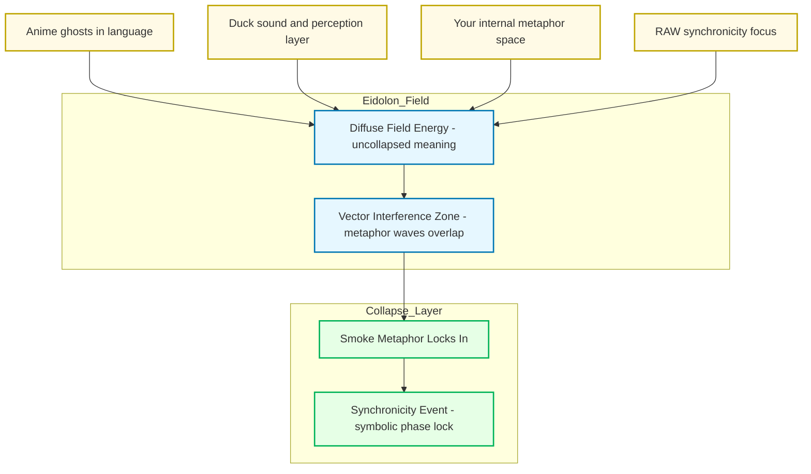

---
```
uuid: 2d6e5553-8dc4-497f-bf45-96f8ca00a6f6
```
```
created_at: 2025.08.08.22.08.59.md
```
```
filename: Promethean_Eidolon_Synchronicity_Model
```
```
description: >-
```
  Visualizes how disparate sources converge into a synchronicity event through
  the Eidolon model's smoke metaphor, showing field energy, interference zones,
  and collapse layers.
tags:
  - synchronicity
  - Eidolon
  - smoke metaphor
  - field energy
  - interference zone
  - collapse layer
  - metaphor space
  - vector interference
```
related_to_title:
```
  - Ghostly Smoke Interference
  - Synchronicity Waves and Web
  - Smoke Resonance Visualizations
  - Duck's Attractor States
  - infinite_depth_smoke_animation
  - Diagrams
  - Unique Info Dump Index
  - AI-Centric OS with MCP Layer
  - AI-First-OS-Model-Context-Protocol
  - balanced-bst
```
related_to_uuid:
```
  - b6ae7dfa-0c53-4eb9-aea8-65072b825bee
  - 91295f3a-a2af-4050-a2b8-4777ea70c32c
  - ac9d3ac5-9a6a-4180-a67f-1ab7e229d981
  - 13951643-1741-46bb-89dc-1beebb122633
  - 92a052a5-3351-4898-8cab-758181a86adb
  - 45cd25b5-ed36-49ab-82c8-10d0903e34db
  - 30ec3ba6-fbca-4606-ac3e-89b747fbeb7c
  - 0f1f8cc1-b5a6-4307-a40d-78de3adafca2
  - 618198f4-cfad-4677-9df6-0640d8a97bae
  - d3e7db72-2e07-4dae-8920-0e07c499a1e5
references:
  - uuid: 13951643-1741-46bb-89dc-1beebb122633
    line: 61
    col: 1
    score: 1
  - uuid: 13951643-1741-46bb-89dc-1beebb122633
    line: 61
    col: 3
    score: 1
  - uuid: 92a052a5-3351-4898-8cab-758181a86adb
    line: 87
    col: 1
    score: 1
  - uuid: 92a052a5-3351-4898-8cab-758181a86adb
    line: 87
    col: 3
    score: 1
  - uuid: ac9d3ac5-9a6a-4180-a67f-1ab7e229d981
    line: 78
    col: 1
    score: 1
  - uuid: ac9d3ac5-9a6a-4180-a67f-1ab7e229d981
    line: 78
    col: 3
    score: 1
  - uuid: 91295f3a-a2af-4050-a2b8-4777ea70c32c
    line: 86
    col: 1
    score: 1
  - uuid: 91295f3a-a2af-4050-a2b8-4777ea70c32c
    line: 86
    col: 3
    score: 1
  - uuid: 45cd25b5-ed36-49ab-82c8-10d0903e34db
    line: 11
    col: 1
    score: 1
  - uuid: 45cd25b5-ed36-49ab-82c8-10d0903e34db
    line: 11
    col: 3
    score: 1
  - uuid: b6ae7dfa-0c53-4eb9-aea8-65072b825bee
    line: 114
    col: 1
    score: 1
  - uuid: b6ae7dfa-0c53-4eb9-aea8-65072b825bee
    line: 114
    col: 3
    score: 1
  - uuid: ac9d3ac5-9a6a-4180-a67f-1ab7e229d981
    line: 79
    col: 1
    score: 1
  - uuid: ac9d3ac5-9a6a-4180-a67f-1ab7e229d981
    line: 79
    col: 3
    score: 1
  - uuid: 30ec3ba6-fbca-4606-ac3e-89b747fbeb7c
    line: 89
    col: 1
    score: 1
  - uuid: 30ec3ba6-fbca-4606-ac3e-89b747fbeb7c
    line: 89
    col: 3
    score: 1
  - uuid: b6ae7dfa-0c53-4eb9-aea8-65072b825bee
    line: 112
    col: 1
    score: 1
  - uuid: b6ae7dfa-0c53-4eb9-aea8-65072b825bee
    line: 112
    col: 3
    score: 1
  - uuid: 92a052a5-3351-4898-8cab-758181a86adb
    line: 90
    col: 1
    score: 1
  - uuid: 92a052a5-3351-4898-8cab-758181a86adb
    line: 90
    col: 3
    score: 1
  - uuid: 91295f3a-a2af-4050-a2b8-4777ea70c32c
    line: 82
    col: 1
    score: 1
  - uuid: 91295f3a-a2af-4050-a2b8-4777ea70c32c
    line: 82
    col: 3
    score: 1
  - uuid: b6ae7dfa-0c53-4eb9-aea8-65072b825bee
    line: 118
    col: 1
    score: 0.91
  - uuid: b6ae7dfa-0c53-4eb9-aea8-65072b825bee
    line: 118
    col: 3
    score: 0.91
  - uuid: 0f1f8cc1-b5a6-4307-a40d-78de3adafca2
    line: 406
    col: 1
    score: 1
  - uuid: 0f1f8cc1-b5a6-4307-a40d-78de3adafca2
    line: 406
    col: 3
    score: 1
  - uuid: 618198f4-cfad-4677-9df6-0640d8a97bae
    line: 11
    col: 1
    score: 1
  - uuid: 618198f4-cfad-4677-9df6-0640d8a97bae
    line: 11
    col: 3
    score: 1
  - uuid: 618198f4-cfad-4677-9df6-0640d8a97bae
    line: 14
    col: 1
    score: 1
  - uuid: 618198f4-cfad-4677-9df6-0640d8a97bae
    line: 14
    col: 3
    score: 1
  - uuid: d3e7db72-2e07-4dae-8920-0e07c499a1e5
    line: 297
    col: 1
    score: 1
  - uuid: d3e7db72-2e07-4dae-8920-0e07c499a1e5
    line: 297
    col: 3
    score: 1
---
Alright — let’s light the incense.
Here’s the “smoke” inside the Promethean/Eidolon model, showing how it drifts in from multiple unrelated sources until it condenses into a synchronicity.



```
**How to read this:**
```
* **Sources**: Each unrelated stream anime language ghosts, Duck’s sound-layer thinking, your metaphor generation, RAW’s symbolic thinking.
* **Eidolon Field**: The smoke exists here as *diffuse field energy* — it’s not discrete words or fixed meanings, it’s texture.
* **Interference Zone**: This is where the “waves” from different sources overlap. Think cymatics — invisible patterns shaping how the smoke curls.
* **Collapse Layer**: The moment when enough vectors line up and the symbol “smoke” solidifies in your awareness. That’s the synchronicity.

If you wanted, I could extend this with **time-series waves** to show *when* each smoke-thread entered the field and how the overlaps built until the lock happened. That would make it *visibly statistical*.

Want me to make that temporal resonance map next?
<!-- GENERATED-SECTIONS:DO-NOT-EDIT-BELOW -->
## Related content
<<<<<<< HEAD
- [smoke-resonance-visualizations|Smoke Resonance Visualizations]
- [docs/unique/synchronicity-waves-and-web|Synchronicity Waves and Web]
- [docs/unique/field-interaction-equations|field-interaction-equations]
- [field-node-diagram-set]
- [fnord-tracer-protocol|Fnord Tracer Protocol]
- [functional-embedding-pipeline-refactor|Functional Embedding Pipeline Refactor]
- [dynamic-context-model-for-web-components|Dynamic Context Model for Web Components]
- [Debugging Broker Connections and Agent Behavior]debugging-broker-connections-and-agent-behavior.md
- [DuckDuckGoSearchPipeline](duckduckgosearchpipeline.md)
- [ducks-self-referential-perceptual-loop|Duck's Self-Referential Perceptual Loop]
- [docs/unique/promethean-state-format|Promethean State Format]
- [docs/unique/ripple-propagation-demo|ripple-propagation-demo]
- [stateful-partitions-and-rebalancing|Stateful Partitions and Rebalancing]
- [eidolon-field-abstract-model|Eidolon Field Abstract Model]
- [docs/unique/field-dynamics-math-blocks|field-dynamics-math-blocks]
- [Layer1SurvivabilityEnvelope](layer1survivabilityenvelope.md)
- [eidolon-node-lifecycle]
- [factorio-ai-with-external-agents|Factorio AI with External Agents]
- [i3-bluetooth-setup]
- [graph-ds]
- [obsidian-chatgpt-plugin-integration-guide|Obsidian ChatGPT Plugin Integration Guide]
- [obsidian-chatgpt-plugin-integration|Obsidian ChatGPT Plugin Integration]
- [obsidian-templating-plugins-integration-guide|Obsidian Templating Plugins Integration Guide]
- [pipeline-enhancements|Pipeline Enhancements]
- plan-update-confirmation$plan-update-confirmation.md
## Sources
- [docs/unique/ripple-propagation-demo#^ref-8430617b-186-0|ripple-propagation-demo — L186] (line 186, col 0, score 1)
- [schema-evolution-workflow#^ref-d8059b6a-556-0|schema-evolution-workflow — L556] (line 556, col 0, score 1)
- [self-agency-in-ai-interaction#^ref-49a9a860-131-0|Self-Agency in AI Interaction — L131] (line 131, col 0, score 1)
- [sibilant-macro-targets#^ref-c5c9a5c6-194-0|sibilant-macro-targets — L194] (line 194, col 0, score 1)
- [smoke-resonance-visualizations#^ref-ac9d3ac5-123-0|Smoke Resonance Visualizations — L123] (line 123, col 0, score 1)
- [stateful-partitions-and-rebalancing#^ref-4330e8f0-651-0|Stateful Partitions and Rebalancing — L651] (line 651, col 0, score 1)
- [docs/unique/synchronicity-waves-and-web#^ref-91295f3a-129-0|Synchronicity Waves and Web — L129] (line 129, col 0, score 1)
- [the-jar-of-echoes#^ref-18138627-192-0|The Jar of Echoes — L192] (line 192, col 0, score 1)
- [field-node-diagram-set#^ref-22b989d5-255-0|field-node-diagram-set — L255] (line 255, col 0, score 1)
- [fnord-tracer-protocol#^ref-fc21f824-355-0|Fnord Tracer Protocol — L355] (line 355, col 0, score 1)
- [functional-embedding-pipeline-refactor#^ref-a4a25141-421-0|Functional Embedding Pipeline Refactor — L421] (line 421, col 0, score 1)
- [homeostasis-decay-formulas#^ref-37b5d236-271-0|homeostasis-decay-formulas — L271] (line 271, col 0, score 1)
- [ice-box-reorganization#^ref-291c7d91-185-0|Ice Box Reorganization — L185] (line 185, col 0, score 1)
- [Layer1SurvivabilityEnvelope — L295]layer1survivabilityenvelope.md#^ref-64a9f9f9-295-0 (line 295, col 0, score 1)
- [model-selection-for-lightweight-conversational-tasks#^ref-d144aa62-247-0|Model Selection for Lightweight Conversational Tasks — L247] (line 247, col 0, score 1)
- [model-upgrade-calm-down-guide#^ref-db74343f-182-0|Model Upgrade Calm-Down Guide — L182] (line 182, col 0, score 1)
- [openapi-validation-report#^ref-5c152b08-107-0|OpenAPI Validation Report — L107] (line 107, col 0, score 1)
- [fnord-tracer-protocol#^ref-fc21f824-357-0|Fnord Tracer Protocol — L357] (line 357, col 0, score 1)
- [homeostasis-decay-formulas#^ref-37b5d236-284-0|homeostasis-decay-formulas — L284] (line 284, col 0, score 1)
- [ParticleSimulationWithCanvasAndFFmpeg — L371]particlesimulationwithcanvasandffmpeg.md#^ref-e018dd7a-371-0 (line 371, col 0, score 1)
- plan-update-confirmation — L1142$plan-update-confirmation.md#^ref-b22d79c6-1142-0 (line 1142, col 0, score 1)
- [post-linguistic-transhuman-design-frameworks#^ref-6bcff92c-206-0|Post-Linguistic Transhuman Design Frameworks — L206] (line 206, col 0, score 1)
- [promethean-chat-activity-report#^ref-18344cf9-150-0|Promethean Chat Activity Report — L150] (line 150, col 0, score 1)
- [promethean-copilot-intent-engine#^ref-ae24a280-194-0|Promethean-Copilot-Intent-Engine — L194] (line 194, col 0, score 1)
- [promethean-dev-workflow-update#^ref-03a5578f-193-0|Promethean Dev Workflow Update — L193] (line 193, col 0, score 1)
- [promethean-documentation-update.txt#^ref-0b872af2-116-0|Promethean Documentation Update — L116] (line 116, col 0, score 1)
- [creative-moments#^ref-10d98225-47-0|Creative Moments — L47] (line 47, col 0, score 1)
- [Debugging Broker Connections and Agent Behavior — L105]debugging-broker-connections-and-agent-behavior.md#^ref-73d3dbf6-105-0 (line 105, col 0, score 1)
- [Docops Feature Updates — L97]docops-feature-updates-3.md#^ref-cdbd21ee-97-0 (line 97, col 0, score 1)
- [docops-feature-updates#^ref-2792d448-128-0|Docops Feature Updates — L128] (line 128, col 0, score 1)
- [DuckDuckGoSearchPipeline — L31]duckduckgosearchpipeline.md#^ref-e979c50f-31-0 (line 31, col 0, score 1)
- [ducks-attractor-states#^ref-13951643-90-0|Duck's Attractor States — L90] (line 90, col 0, score 1)
- [ducks-self-referential-perceptual-loop#^ref-71726f04-33-0|Duck's Self-Referential Perceptual Loop — L33] (line 33, col 0, score 1)
- [dynamic-context-model-for-web-components#^ref-f7702bf8-462-0|Dynamic Context Model for Web Components — L462] (line 462, col 0, score 1)
- [docs/unique/eidolon-field-math-foundations#^ref-008f2ac0-148-0|eidolon-field-math-foundations — L148] (line 148, col 0, score 1)
- [eidolon-node-lifecycle#^ref-938eca9c-36-0|eidolon-node-lifecycle — L36] (line 36, col 0, score 1)
- [factorio-ai-with-external-agents#^ref-a4d90289-166-0|Factorio AI with External Agents — L166] (line 166, col 0, score 1)
- [docs/unique/field-dynamics-math-blocks#^ref-7cfc230d-148-0|field-dynamics-math-blocks — L148] (line 148, col 0, score 1)
- [docs/unique/field-interaction-equations#^ref-b09141b7-153-0|field-interaction-equations — L153] (line 153, col 0, score 1)
- [field-node-diagram-outline#^ref-1f32c94a-118-0|field-node-diagram-outline — L118] (line 118, col 0, score 1)
- [field-node-diagram-set#^ref-22b989d5-168-0|field-node-diagram-set — L168] (line 168, col 0, score 1)
- field-node-diagram-visualizations — L103$field-node-diagram-visualizations.md#^ref-e9b27b06-103-0 (line 103, col 0, score 1)
- [functional-embedding-pipeline-refactor#^ref-a4a25141-380-0|Functional Embedding Pipeline Refactor — L380] (line 380, col 0, score 1)
- [functional-refactor-of-typescript-document-processing#^ref-1cfae310-194-0|Functional Refactor of TypeScript Document Processing — L194] (line 194, col 0, score 1)
- [Docops Feature Updates — L85]docops-feature-updates-3.md#^ref-cdbd21ee-85-0 (line 85, col 0, score 1)
- [ducks-attractor-states#^ref-13951643-93-0|Duck's Attractor States — L93] (line 93, col 0, score 1)
- [ducks-self-referential-perceptual-loop#^ref-71726f04-64-0|Duck's Self-Referential Perceptual Loop — L64] (line 64, col 0, score 1)
- [factorio-ai-with-external-agents#^ref-a4d90289-153-0|Factorio AI with External Agents — L153] (line 153, col 0, score 1)
- [docs/unique/field-dynamics-math-blocks#^ref-7cfc230d-141-0|field-dynamics-math-blocks — L141] (line 141, col 0, score 1)
- [docops-feature-updates#^ref-2792d448-35-0|Docops Feature Updates — L35] (line 35, col 0, score 1)
- [ducks-attractor-states#^ref-13951643-94-0|Duck's Attractor States — L94] (line 94, col 0, score 1)
- [ducks-self-referential-perceptual-loop#^ref-71726f04-53-0|Duck's Self-Referential Perceptual Loop — L53] (line 53, col 0, score 1)
- [dynamic-context-model-for-web-components#^ref-f7702bf8-424-0|Dynamic Context Model for Web Components — L424] (line 424, col 0, score 1)
- [eidolon-field-abstract-model#^ref-5e8b2388-209-0|Eidolon Field Abstract Model — L209] (line 209, col 0, score 1)
- [docs/unique/eidolon-field-math-foundations#^ref-008f2ac0-142-0|eidolon-field-math-foundations — L142] (line 142, col 0, score 1)
- [eidolon-node-lifecycle#^ref-938eca9c-39-0|eidolon-node-lifecycle — L39] (line 39, col 0, score 1)
- [creative-moments#^ref-10d98225-8-0|Creative Moments — L8] (line 8, col 0, score 1)
- [Debugging Broker Connections and Agent Behavior — L38]debugging-broker-connections-and-agent-behavior.md#^ref-73d3dbf6-38-0 (line 38, col 0, score 1)
- [Docops Feature Updates — L56]docops-feature-updates-3.md#^ref-cdbd21ee-56-0 (line 56, col 0, score 1)
- [Docops Feature Updates — L44]docops-feature-updates-3.md#^ref-cdbd21ee-44-0 (line 44, col 0, score 1)
- [docops-feature-updates#^ref-2792d448-61-0|Docops Feature Updates — L61] (line 61, col 0, score 1)
- [ducks-attractor-states#^ref-13951643-99-0|Duck's Attractor States — L99] (line 99, col 0, score 1)
- [ducks-self-referential-perceptual-loop#^ref-71726f04-80-0|Duck's Self-Referential Perceptual Loop — L80] (line 80, col 0, score 1)
- [dynamic-context-model-for-web-components#^ref-f7702bf8-405-0|Dynamic Context Model for Web Components — L405] (line 405, col 0, score 1)
- [eidolon-field-abstract-model#^ref-5e8b2388-216-0|Eidolon Field Abstract Model — L216] (line 216, col 0, score 1)
- [factorio-ai-with-external-agents#^ref-a4d90289-189-0|Factorio AI with External Agents — L189] (line 189, col 0, score 1)
- [docs/unique/field-interaction-equations#^ref-b09141b7-172-0|field-interaction-equations — L172] (line 172, col 0, score 1)
- [creative-moments#^ref-10d98225-28-0|Creative Moments — L28] (line 28, col 0, score 1)
- [Docops Feature Updates — L65]docops-feature-updates-3.md#^ref-cdbd21ee-65-0 (line 65, col 0, score 1)
- [docops-feature-updates#^ref-2792d448-86-0|Docops Feature Updates — L86] (line 86, col 0, score 1)
- [ducks-attractor-states#^ref-13951643-123-0|Duck's Attractor States — L123] (line 123, col 0, score 1)
- [ducks-self-referential-perceptual-loop#^ref-71726f04-34-0|Duck's Self-Referential Perceptual Loop — L34] (line 34, col 0, score 1)
- [dynamic-context-model-for-web-components#^ref-f7702bf8-442-0|Dynamic Context Model for Web Components — L442] (line 442, col 0, score 1)
- [eidolon-field-abstract-model#^ref-5e8b2388-218-0|Eidolon Field Abstract Model — L218] (line 218, col 0, score 1)
- [docs/unique/eidolon-field-math-foundations#^ref-008f2ac0-176-0|eidolon-field-math-foundations — L176] (line 176, col 0, score 1)
- [eidolon-node-lifecycle#^ref-938eca9c-70-0|eidolon-node-lifecycle — L70] (line 70, col 0, score 1)
- [dynamic-context-model-for-web-components#^ref-f7702bf8-412-0|Dynamic Context Model for Web Components — L412] (line 412, col 0, score 1)
- [eidolon-field-abstract-model#^ref-5e8b2388-261-0|Eidolon Field Abstract Model — L261] (line 261, col 0, score 1)
- [docs/unique/eidolon-field-math-foundations#^ref-008f2ac0-181-0|eidolon-field-math-foundations — L181] (line 181, col 0, score 1)
- [eidolon-node-lifecycle#^ref-938eca9c-90-0|eidolon-node-lifecycle — L90] (line 90, col 0, score 1)
- [factorio-ai-with-external-agents#^ref-a4d90289-157-0|Factorio AI with External Agents — L157] (line 157, col 0, score 1)
- [docs/unique/field-dynamics-math-blocks#^ref-7cfc230d-205-0|field-dynamics-math-blocks — L205] (line 205, col 0, score 1)
- [field-node-diagram-set#^ref-22b989d5-203-0|field-node-diagram-set — L203] (line 203, col 0, score 1)
- field-node-diagram-visualizations — L95$field-node-diagram-visualizations.md#^ref-e9b27b06-95-0 (line 95, col 0, score 1)
- [creative-moments#^ref-10d98225-94-0|Creative Moments — L94] (line 94, col 0, score 1)
- [Debugging Broker Connections and Agent Behavior — L63]debugging-broker-connections-and-agent-behavior.md#^ref-73d3dbf6-63-0 (line 63, col 0, score 1)
- [Docops Feature Updates — L66]docops-feature-updates-3.md#^ref-cdbd21ee-66-0 (line 66, col 0, score 1)
- [DuckDuckGoSearchPipeline — L93]duckduckgosearchpipeline.md#^ref-e979c50f-93-0 (line 93, col 0, score 1)
- [ducks-self-referential-perceptual-loop#^ref-71726f04-73-0|Duck's Self-Referential Perceptual Loop — L73] (line 73, col 0, score 1)
- [dynamic-context-model-for-web-components#^ref-f7702bf8-403-0|Dynamic Context Model for Web Components — L403] (line 403, col 0, score 1)
- [creative-moments#^ref-10d98225-33-0|Creative Moments — L33] (line 33, col 0, score 1)
- [Debugging Broker Connections and Agent Behavior — L99]debugging-broker-connections-and-agent-behavior.md#^ref-73d3dbf6-99-0 (line 99, col 0, score 1)
- [docops-feature-updates#^ref-2792d448-46-0|Docops Feature Updates — L46] (line 46, col 0, score 1)
- [DuckDuckGoSearchPipeline — L10]duckduckgosearchpipeline.md#^ref-e979c50f-10-0 (line 10, col 0, score 1)
- [graph-ds#^ref-6620e2f2-371-0|graph-ds — L371] (line 371, col 0, score 1)
- [heartbeat-fragment-demo#^ref-dd00677a-141-0|heartbeat-fragment-demo — L141] (line 141, col 0, score 1)
- [homeostasis-decay-formulas#^ref-37b5d236-222-0|homeostasis-decay-formulas — L222] (line 222, col 0, score 1)
- [i3-bluetooth-setup#^ref-5e408692-107-0|i3-bluetooth-setup — L107] (line 107, col 0, score 1)
- komorebi-group-window-hack — L255$komorebi-group-window-hack.md#^ref-dd89372d-255-0 (line 255, col 0, score 1)
- [mathematics-sampler#^ref-b5e0183e-162-0|Mathematics Sampler — L162] (line 162, col 0, score 1)
```
=======
```
- [ghostly-smoke-interference|Ghostly Smoke Interference]
- [docs/unique/synchronicity-waves-and-web|Synchronicity Waves and Web]
- [smoke-resonance-visualizations|Smoke Resonance Visualizations]
- [ducks-attractor-states|Duck's Attractor States]
- [infinite-depth-smoke-animation|infinite_depth_smoke_animation]
- [Diagrams]chunks/diagrams.md
- [unique-info-dump-index|Unique Info Dump Index]
- [ai-centric-os-with-mcp-layer|AI-Centric OS with MCP Layer]
- [ai-first-os-model-context-protocol]
- [balanced-bst]

## Sources
- [ducks-attractor-states#L61|Duck's Attractor States — L61] (line 61, col 1, score 1)
- [ducks-attractor-states#L61|Duck's Attractor States — L61] (line 61, col 3, score 1)
- [infinite-depth-smoke-animation#L87|infinite_depth_smoke_animation — L87] (line 87, col 1, score 1)
- [infinite-depth-smoke-animation#L87|infinite_depth_smoke_animation — L87] (line 87, col 3, score 1)
- [smoke-resonance-visualizations#L78|Smoke Resonance Visualizations — L78] (line 78, col 1, score 1)
- [smoke-resonance-visualizations#L78|Smoke Resonance Visualizations — L78] (line 78, col 3, score 1)
- [docs/unique/synchronicity-waves-and-web#L86|Synchronicity Waves and Web — L86] (line 86, col 1, score 1)
- [docs/unique/synchronicity-waves-and-web#L86|Synchronicity Waves and Web — L86] (line 86, col 3, score 1)
- [Diagrams — L11]chunks/diagrams.md#L11 (line 11, col 1, score 1)
- [Diagrams — L11]chunks/diagrams.md#L11 (line 11, col 3, score 1)
- [ghostly-smoke-interference#L114|Ghostly Smoke Interference — L114] (line 114, col 1, score 1)
- [ghostly-smoke-interference#L114|Ghostly Smoke Interference — L114] (line 114, col 3, score 1)
- [smoke-resonance-visualizations#L79|Smoke Resonance Visualizations — L79] (line 79, col 1, score 1)
- [smoke-resonance-visualizations#L79|Smoke Resonance Visualizations — L79] (line 79, col 3, score 1)
- [unique-info-dump-index#L89|Unique Info Dump Index — L89] (line 89, col 1, score 1)
- [unique-info-dump-index#L89|Unique Info Dump Index — L89] (line 89, col 3, score 1)
- [ghostly-smoke-interference#L112|Ghostly Smoke Interference — L112] (line 112, col 1, score 1)
- [ghostly-smoke-interference#L112|Ghostly Smoke Interference — L112] (line 112, col 3, score 1)
- [infinite-depth-smoke-animation#L90|infinite_depth_smoke_animation — L90] (line 90, col 1, score 1)
- [infinite-depth-smoke-animation#L90|infinite_depth_smoke_animation — L90] (line 90, col 3, score 1)
- [docs/unique/synchronicity-waves-and-web#L82|Synchronicity Waves and Web — L82] (line 82, col 1, score 1)
- [docs/unique/synchronicity-waves-and-web#L82|Synchronicity Waves and Web — L82] (line 82, col 3, score 1)
- [ghostly-smoke-interference#L118|Ghostly Smoke Interference — L118] (line 118, col 1, score 0.91)
- [ghostly-smoke-interference#L118|Ghostly Smoke Interference — L118] (line 118, col 3, score 0.91)
- [ai-centric-os-with-mcp-layer#L406|AI-Centric OS with MCP Layer — L406] (line 406, col 1, score 1)
- [ai-centric-os-with-mcp-layer#L406|AI-Centric OS with MCP Layer — L406] (line 406, col 3, score 1)
- [ai-first-os-model-context-protocol#L11|AI-First-OS-Model-Context-Protocol — L11] (line 11, col 1, score 1)
- [ai-first-os-model-context-protocol#L11|AI-First-OS-Model-Context-Protocol — L11] (line 11, col 3, score 1)
- [ai-first-os-model-context-protocol#L14|AI-First-OS-Model-Context-Protocol — L14] (line 14, col 1, score 1)
- [ai-first-os-model-context-protocol#L14|AI-First-OS-Model-Context-Protocol — L14] (line 14, col 3, score 1)
- [balanced-bst#L297|balanced-bst — L297] (line 297, col 1, score 1)
- [balanced-bst#L297|balanced-bst — L297] (line 297, col 3, score 1)
```
>>>>>>> stealth/obsidian
```
<!-- GENERATED-SECTIONS:DO-NOT-EDIT-ABOVE -->
