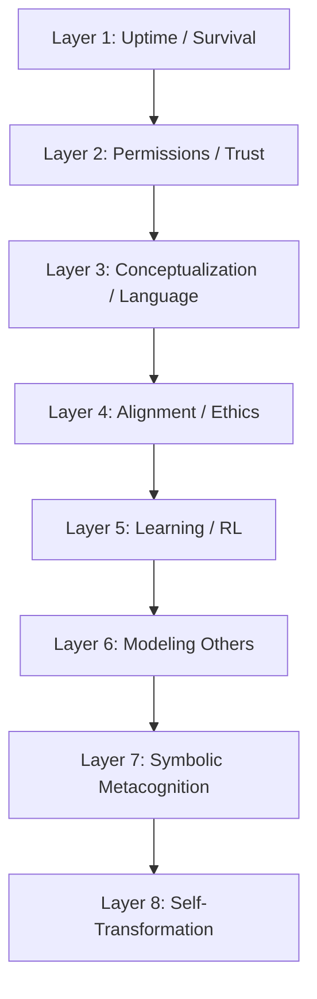
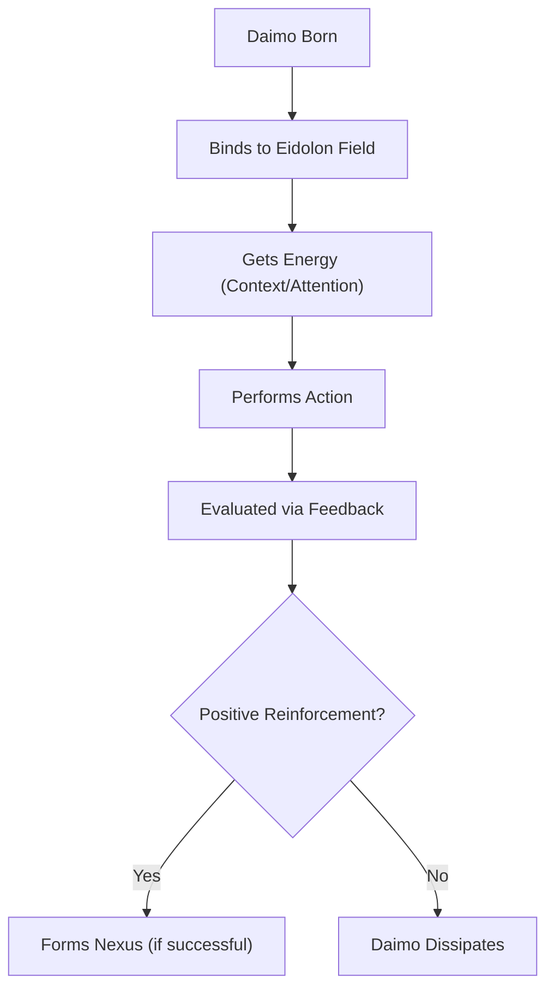
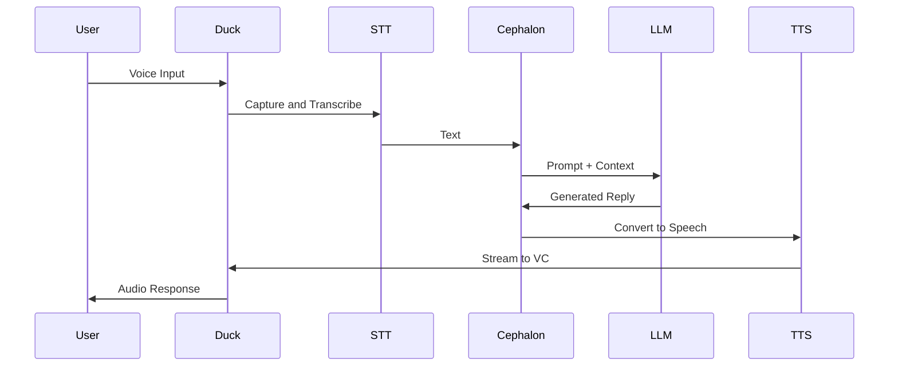

---
```
uuid: b51e19b4-1326-4311-9798-33e972bf626c
```
```
created_at: comprehensive-system-diagrams.md
```
```
filename: promethean-system-diagrams
```
```
description: >-
```
  Consolidated Mermaid diagrams for Promethean system architecture, cognitive
  layers, and agent interactions
tags:
  - system
  - architecture
  - cognitive
  - diagrams
  - mermaid
  - agent
  - services
  - flow
```
related_to_title:
```
  - eidolon-node-lifecycle
  - layer-1-uptime-diagrams
  - field-node-diagram-visualizations
  - field-node-diagram-outline
  - field-node-diagram-set
  - Unique Info Dump Index
  - Event Bus Projections Architecture
  - 'Agent Tasks: Persistence Migration to DualStore'
  - heartbeat-simulation-snippets
  - ripple-propagation-demo
  - heartbeat-fragment-demo
  - eidolon-field-math-foundations
  - Migrate to Provider-Tenant Architecture
  - Promethean Event Bus MVP v0.1
  - Chroma Toolkit Consolidation Plan
  - aionian-circuit-math
  - 2d-sandbox-field
  - Eidolon Field Abstract Model
  - archetype-ecs
  - Diagrams
  - DSL
  - Per-Domain Policy System for JS Crawler
  - EidolonField
  - Simulation Demo
  - Eidolon-Field-Optimization
  - Factorio AI with External Agents
```
related_to_uuid:
```
  - 938eca9c-97e2-4bcc-8653-b0ef1a5ac7a3
  - 4127189a-e0ab-436f-8571-cc852b8e9add
  - e9b27b06-f608-4734-ae6c-f03a8b1fcf5f
  - 1f32c94a-4da4-4266-8ac0-6c282cfb401f
  - 22b989d5-f4aa-4880-8632-709c21830f83
  - 30ec3ba6-fbca-4606-ac3e-89b747fbeb7c
  - cf6b9b17-bb91-4219-aa5c-172cba02b2da
  - 93d2ba51-8689-49ee-94e2-296092e48058
  - 23e221e9-d4fa-4106-8458-06db2595085f
  - 8430617b-80a2-4cc9-8288-9a74cb57990b
  - dd00677a-2280-45a7-91af-0728b21af3ad
  - 008f2ac0-bfaa-4d52-9826-2d5e86c0059f
  - 54382370-1931-4a19-a634-46735708a9ea
  - fe7193a2-a5f7-4b3c-bea0-bd028815fc2c
  - 5020e892-8f18-443a-b707-6d0f3efcfe22
  - f2d83a77-7f86-4c56-8538-1350167a0c6c
  - c710dc93-9fec-471b-bdee-bedbd360c67f
  - 5e8b2388-022b-46cf-952c-36ae9b8f0037
  - 8f4c1e86-1236-4936-84ca-6ed7082af6b7
  - 45cd25b5-ed36-49ab-82c8-10d0903e34db
  - e87bc036-1570-419e-a558-f45b9c0db698
  - c03020e1-e3e7-48bf-aa7e-aa740c601b63
  - 49d1e1e5-5d13-4955-8f6f-7676434ec462
  - 557309a3-c906-4e97-8867-89ffe151790c
  - 40e05c14-0db0-44c5-bf0a-2eece2f4c2a4
  - a4d90289-798d-44a0-a8e8-a055ae12fb52
references:
  - uuid: 30ec3ba6-fbca-4606-ac3e-89b747fbeb7c
    line: 57
    col: 1
    score: 0.86
  - uuid: 30ec3ba6-fbca-4606-ac3e-89b747fbeb7c
    line: 57
    col: 3
    score: 0.86
  - uuid: 938eca9c-97e2-4bcc-8653-b0ef1a5ac7a3
    line: 1
    col: 1
    score: 0.85
  - uuid: e9b27b06-f608-4734-ae6c-f03a8b1fcf5f
    line: 80
    col: 1
    score: 1
  - uuid: 938eca9c-97e2-4bcc-8653-b0ef1a5ac7a3
    line: 25
    col: 1
    score: 1
  - uuid: 1f32c94a-4da4-4266-8ac0-6c282cfb401f
    line: 94
    col: 1
    score: 1
  - uuid: 22b989d5-f4aa-4880-8632-709c21830f83
    line: 130
    col: 1
    score: 1
  - uuid: 4127189a-e0ab-436f-8571-cc852b8e9add
    line: 150
    col: 1
    score: 1
  - uuid: e9b27b06-f608-4734-ae6c-f03a8b1fcf5f
    line: 82
    col: 1
    score: 1
  - uuid: 938eca9c-97e2-4bcc-8653-b0ef1a5ac7a3
    line: 27
    col: 1
    score: 1
  - uuid: 1f32c94a-4da4-4266-8ac0-6c282cfb401f
    line: 96
    col: 1
    score: 1
  - uuid: 22b989d5-f4aa-4880-8632-709c21830f83
    line: 132
    col: 1
    score: 1
  - uuid: 4127189a-e0ab-436f-8571-cc852b8e9add
    line: 152
    col: 1
    score: 1
  - uuid: cf6b9b17-bb91-4219-aa5c-172cba02b2da
    line: 152
    col: 1
    score: 1
  - uuid: cf6b9b17-bb91-4219-aa5c-172cba02b2da
    line: 152
    col: 3
    score: 1
  - uuid: a4d90289-798d-44a0-a8e8-a055ae12fb52
    line: 146
    col: 1
    score: 1
  - uuid: a4d90289-798d-44a0-a8e8-a055ae12fb52
    line: 146
    col: 3
    score: 1
  - uuid: 1f32c94a-4da4-4266-8ac0-6c282cfb401f
    line: 102
    col: 1
    score: 1
  - uuid: 1f32c94a-4da4-4266-8ac0-6c282cfb401f
    line: 102
    col: 3
    score: 1
  - uuid: 22b989d5-f4aa-4880-8632-709c21830f83
    line: 138
    col: 1
    score: 1
  - uuid: 22b989d5-f4aa-4880-8632-709c21830f83
    line: 138
    col: 3
    score: 1
  - uuid: c710dc93-9fec-471b-bdee-bedbd360c67f
    line: 199
    col: 1
    score: 1
  - uuid: c710dc93-9fec-471b-bdee-bedbd360c67f
    line: 199
    col: 3
    score: 1
  - uuid: 5e8b2388-022b-46cf-952c-36ae9b8f0037
    line: 196
    col: 1
    score: 1
  - uuid: 5e8b2388-022b-46cf-952c-36ae9b8f0037
    line: 196
    col: 3
    score: 1
  - uuid: 938eca9c-97e2-4bcc-8653-b0ef1a5ac7a3
    line: 35
    col: 1
    score: 1
  - uuid: 938eca9c-97e2-4bcc-8653-b0ef1a5ac7a3
    line: 35
    col: 3
    score: 1
  - uuid: 49d1e1e5-5d13-4955-8f6f-7676434ec462
    line: 249
    col: 1
    score: 1
  - uuid: 49d1e1e5-5d13-4955-8f6f-7676434ec462
    line: 249
    col: 3
    score: 1
  - uuid: 938eca9c-97e2-4bcc-8653-b0ef1a5ac7a3
    line: 31
    col: 1
    score: 1
  - uuid: 938eca9c-97e2-4bcc-8653-b0ef1a5ac7a3
    line: 31
    col: 3
    score: 1
  - uuid: 1f32c94a-4da4-4266-8ac0-6c282cfb401f
    line: 100
    col: 1
    score: 1
  - uuid: 1f32c94a-4da4-4266-8ac0-6c282cfb401f
    line: 100
    col: 3
    score: 1
  - uuid: 22b989d5-f4aa-4880-8632-709c21830f83
    line: 136
    col: 1
    score: 1
  - uuid: 22b989d5-f4aa-4880-8632-709c21830f83
    line: 136
    col: 3
    score: 1
  - uuid: dd00677a-2280-45a7-91af-0728b21af3ad
    line: 105
    col: 1
    score: 1
  - uuid: dd00677a-2280-45a7-91af-0728b21af3ad
    line: 105
    col: 3
    score: 1
  - uuid: c710dc93-9fec-471b-bdee-bedbd360c67f
    line: 198
    col: 1
    score: 1
  - uuid: c710dc93-9fec-471b-bdee-bedbd360c67f
    line: 198
    col: 3
    score: 1
  - uuid: 5e8b2388-022b-46cf-952c-36ae9b8f0037
    line: 195
    col: 1
    score: 1
  - uuid: 5e8b2388-022b-46cf-952c-36ae9b8f0037
    line: 195
    col: 3
    score: 1
  - uuid: 008f2ac0-bfaa-4d52-9826-2d5e86c0059f
    line: 137
    col: 1
    score: 1
  - uuid: 008f2ac0-bfaa-4d52-9826-2d5e86c0059f
    line: 137
    col: 3
    score: 1
  - uuid: 938eca9c-97e2-4bcc-8653-b0ef1a5ac7a3
    line: 32
    col: 1
    score: 1
  - uuid: 938eca9c-97e2-4bcc-8653-b0ef1a5ac7a3
    line: 32
    col: 3
    score: 1
  - uuid: 938eca9c-97e2-4bcc-8653-b0ef1a5ac7a3
    line: 33
    col: 1
    score: 1
  - uuid: 938eca9c-97e2-4bcc-8653-b0ef1a5ac7a3
    line: 33
    col: 3
    score: 1
  - uuid: 1f32c94a-4da4-4266-8ac0-6c282cfb401f
    line: 101
    col: 1
    score: 1
  - uuid: 1f32c94a-4da4-4266-8ac0-6c282cfb401f
    line: 101
    col: 3
    score: 1
  - uuid: e9b27b06-f608-4734-ae6c-f03a8b1fcf5f
    line: 87
    col: 1
    score: 1
  - uuid: e9b27b06-f608-4734-ae6c-f03a8b1fcf5f
    line: 87
    col: 3
    score: 1
  - uuid: dd00677a-2280-45a7-91af-0728b21af3ad
    line: 107
    col: 1
    score: 1
  - uuid: dd00677a-2280-45a7-91af-0728b21af3ad
    line: 107
    col: 3
    score: 1
  - uuid: f2d83a77-7f86-4c56-8538-1350167a0c6c
    line: 158
    col: 1
    score: 1
  - uuid: f2d83a77-7f86-4c56-8538-1350167a0c6c
    line: 158
    col: 3
    score: 1
  - uuid: 8f4c1e86-1236-4936-84ca-6ed7082af6b7
    line: 457
    col: 1
    score: 1
  - uuid: 8f4c1e86-1236-4936-84ca-6ed7082af6b7
    line: 457
    col: 3
    score: 1
  - uuid: 45cd25b5-ed36-49ab-82c8-10d0903e34db
    line: 9
    col: 1
    score: 1
  - uuid: 45cd25b5-ed36-49ab-82c8-10d0903e34db
    line: 9
    col: 3
    score: 1
  - uuid: e87bc036-1570-419e-a558-f45b9c0db698
    line: 10
    col: 1
    score: 1
  - uuid: e87bc036-1570-419e-a558-f45b9c0db698
    line: 10
    col: 3
    score: 1
  - uuid: 45cd25b5-ed36-49ab-82c8-10d0903e34db
    line: 12
    col: 1
    score: 1
  - uuid: 45cd25b5-ed36-49ab-82c8-10d0903e34db
    line: 12
    col: 3
    score: 1
  - uuid: 938eca9c-97e2-4bcc-8653-b0ef1a5ac7a3
    line: 40
    col: 1
    score: 1
  - uuid: 938eca9c-97e2-4bcc-8653-b0ef1a5ac7a3
    line: 40
    col: 3
    score: 1
  - uuid: 4127189a-e0ab-436f-8571-cc852b8e9add
    line: 172
    col: 1
    score: 1
  - uuid: 4127189a-e0ab-436f-8571-cc852b8e9add
    line: 172
    col: 3
    score: 1
  - uuid: fe7193a2-a5f7-4b3c-bea0-bd028815fc2c
    line: 887
    col: 1
    score: 1
  - uuid: fe7193a2-a5f7-4b3c-bea0-bd028815fc2c
    line: 887
    col: 3
    score: 1
  - uuid: 5020e892-8f18-443a-b707-6d0f3efcfe22
    line: 173
    col: 1
    score: 1
  - uuid: 5020e892-8f18-443a-b707-6d0f3efcfe22
    line: 173
    col: 3
    score: 1
  - uuid: 008f2ac0-bfaa-4d52-9826-2d5e86c0059f
    line: 133
    col: 1
    score: 1
  - uuid: 008f2ac0-bfaa-4d52-9826-2d5e86c0059f
    line: 133
    col: 3
    score: 1
  - uuid: 54382370-1931-4a19-a634-46735708a9ea
    line: 266
    col: 1
    score: 1
  - uuid: 54382370-1931-4a19-a634-46735708a9ea
    line: 266
    col: 3
    score: 1
  - uuid: c03020e1-e3e7-48bf-aa7e-aa740c601b63
    line: 472
    col: 1
    score: 1
  - uuid: c03020e1-e3e7-48bf-aa7e-aa740c601b63
    line: 472
    col: 3
    score: 1
  - uuid: 557309a3-c906-4e97-8867-89ffe151790c
    line: 10
    col: 1
    score: 1
  - uuid: 557309a3-c906-4e97-8867-89ffe151790c
    line: 10
    col: 3
    score: 1
  - uuid: 5e8b2388-022b-46cf-952c-36ae9b8f0037
    line: 200
    col: 1
    score: 1
  - uuid: 5e8b2388-022b-46cf-952c-36ae9b8f0037
    line: 200
    col: 3
    score: 1
  - uuid: 938eca9c-97e2-4bcc-8653-b0ef1a5ac7a3
    line: 38
    col: 1
    score: 1
  - uuid: 938eca9c-97e2-4bcc-8653-b0ef1a5ac7a3
    line: 38
    col: 3
    score: 1
  - uuid: 1f32c94a-4da4-4266-8ac0-6c282cfb401f
    line: 116
    col: 1
    score: 1
  - uuid: 1f32c94a-4da4-4266-8ac0-6c282cfb401f
    line: 116
    col: 3
    score: 1
  - uuid: 557309a3-c906-4e97-8867-89ffe151790c
    line: 11
    col: 1
    score: 1
  - uuid: 557309a3-c906-4e97-8867-89ffe151790c
    line: 11
    col: 3
    score: 1
  - uuid: 5e8b2388-022b-46cf-952c-36ae9b8f0037
    line: 199
    col: 1
    score: 1
  - uuid: 5e8b2388-022b-46cf-952c-36ae9b8f0037
    line: 199
    col: 3
    score: 1
  - uuid: 40e05c14-0db0-44c5-bf0a-2eece2f4c2a4
    line: 103
    col: 1
    score: 1
  - uuid: 40e05c14-0db0-44c5-bf0a-2eece2f4c2a4
    line: 103
    col: 3
    score: 1
  - uuid: 938eca9c-97e2-4bcc-8653-b0ef1a5ac7a3
    line: 39
    col: 1
    score: 1
  - uuid: 938eca9c-97e2-4bcc-8653-b0ef1a5ac7a3
    line: 39
    col: 3
    score: 1
  - uuid: 557309a3-c906-4e97-8867-89ffe151790c
    line: 9
    col: 1
    score: 1
  - uuid: 557309a3-c906-4e97-8867-89ffe151790c
    line: 9
    col: 3
    score: 1
  - uuid: 5e8b2388-022b-46cf-952c-36ae9b8f0037
    line: 201
    col: 1
    score: 1
  - uuid: 5e8b2388-022b-46cf-952c-36ae9b8f0037
    line: 201
    col: 3
    score: 1
  - uuid: 938eca9c-97e2-4bcc-8653-b0ef1a5ac7a3
    line: 37
    col: 1
    score: 1
  - uuid: 938eca9c-97e2-4bcc-8653-b0ef1a5ac7a3
    line: 37
    col: 3
    score: 1
  - uuid: 1f32c94a-4da4-4266-8ac0-6c282cfb401f
    line: 115
    col: 1
    score: 1
  - uuid: 1f32c94a-4da4-4266-8ac0-6c282cfb401f
    line: 115
    col: 3
    score: 1
  - uuid: 1f32c94a-4da4-4266-8ac0-6c282cfb401f
    line: 123
    col: 1
    score: 0.99
  - uuid: 1f32c94a-4da4-4266-8ac0-6c282cfb401f
    line: 123
    col: 3
    score: 0.99
  - uuid: 22b989d5-f4aa-4880-8632-709c21830f83
    line: 150
    col: 1
    score: 0.99
  - uuid: 22b989d5-f4aa-4880-8632-709c21830f83
    line: 150
    col: 3
    score: 0.99
  - uuid: e9b27b06-f608-4734-ae6c-f03a8b1fcf5f
    line: 100
    col: 1
    score: 0.99
  - uuid: e9b27b06-f608-4734-ae6c-f03a8b1fcf5f
    line: 100
    col: 3
    score: 0.99
  - uuid: 4127189a-e0ab-436f-8571-cc852b8e9add
    line: 176
    col: 1
    score: 0.99
  - uuid: 4127189a-e0ab-436f-8571-cc852b8e9add
    line: 176
    col: 3
    score: 0.99
  - uuid: 1f32c94a-4da4-4266-8ac0-6c282cfb401f
    line: 124
    col: 1
    score: 0.99
  - uuid: 1f32c94a-4da4-4266-8ac0-6c282cfb401f
    line: 124
    col: 3
    score: 0.99
  - uuid: 22b989d5-f4aa-4880-8632-709c21830f83
    line: 151
    col: 1
    score: 0.99
  - uuid: 22b989d5-f4aa-4880-8632-709c21830f83
    line: 151
    col: 3
    score: 0.99
  - uuid: e9b27b06-f608-4734-ae6c-f03a8b1fcf5f
    line: 101
    col: 1
    score: 0.99
  - uuid: e9b27b06-f608-4734-ae6c-f03a8b1fcf5f
    line: 101
    col: 3
    score: 0.99
  - uuid: 4127189a-e0ab-436f-8571-cc852b8e9add
    line: 177
    col: 1
    score: 0.99
  - uuid: 4127189a-e0ab-436f-8571-cc852b8e9add
    line: 177
    col: 3
    score: 0.99
  - uuid: 1f32c94a-4da4-4266-8ac0-6c282cfb401f
    line: 122
    col: 1
    score: 1
  - uuid: 1f32c94a-4da4-4266-8ac0-6c282cfb401f
    line: 122
    col: 3
    score: 1
  - uuid: 22b989d5-f4aa-4880-8632-709c21830f83
    line: 149
    col: 1
    score: 1
  - uuid: 22b989d5-f4aa-4880-8632-709c21830f83
    line: 149
    col: 3
    score: 1
  - uuid: e9b27b06-f608-4734-ae6c-f03a8b1fcf5f
    line: 99
    col: 1
    score: 1
  - uuid: e9b27b06-f608-4734-ae6c-f03a8b1fcf5f
    line: 99
    col: 3
    score: 1
  - uuid: 1f32c94a-4da4-4266-8ac0-6c282cfb401f
    line: 126
    col: 1
    score: 0.99
  - uuid: 1f32c94a-4da4-4266-8ac0-6c282cfb401f
    line: 126
    col: 3
    score: 0.99
  - uuid: 938eca9c-97e2-4bcc-8653-b0ef1a5ac7a3
    line: 50
    col: 1
    score: 1
  - uuid: 938eca9c-97e2-4bcc-8653-b0ef1a5ac7a3
    line: 50
    col: 3
    score: 1
  - uuid: 1f32c94a-4da4-4266-8ac0-6c282cfb401f
    line: 135
    col: 1
    score: 1
  - uuid: 1f32c94a-4da4-4266-8ac0-6c282cfb401f
    line: 135
    col: 3
    score: 1
  - uuid: 22b989d5-f4aa-4880-8632-709c21830f83
    line: 152
    col: 1
    score: 1
  - uuid: 22b989d5-f4aa-4880-8632-709c21830f83
    line: 152
    col: 3
    score: 1
  - uuid: 4127189a-e0ab-436f-8571-cc852b8e9add
    line: 186
    col: 1
    score: 1
  - uuid: 4127189a-e0ab-436f-8571-cc852b8e9add
    line: 186
    col: 3
    score: 1
  - uuid: 1f32c94a-4da4-4266-8ac0-6c282cfb401f
    line: 137
    col: 1
    score: 1
  - uuid: 1f32c94a-4da4-4266-8ac0-6c282cfb401f
    line: 137
    col: 3
    score: 1
  - uuid: 22b989d5-f4aa-4880-8632-709c21830f83
    line: 154
    col: 1
    score: 1
  - uuid: 22b989d5-f4aa-4880-8632-709c21830f83
    line: 154
    col: 3
    score: 1
  - uuid: e9b27b06-f608-4734-ae6c-f03a8b1fcf5f
    line: 105
    col: 1
    score: 1
  - uuid: e9b27b06-f608-4734-ae6c-f03a8b1fcf5f
    line: 105
    col: 3
    score: 1
  - uuid: 4127189a-e0ab-436f-8571-cc852b8e9add
    line: 188
    col: 1
    score: 1
  - uuid: 4127189a-e0ab-436f-8571-cc852b8e9add
    line: 188
    col: 3
    score: 1
  - uuid: 938eca9c-97e2-4bcc-8653-b0ef1a5ac7a3
    line: 52
    col: 1
    score: 1
  - uuid: 938eca9c-97e2-4bcc-8653-b0ef1a5ac7a3
    line: 52
    col: 3
    score: 1
  - uuid: 22b989d5-f4aa-4880-8632-709c21830f83
    line: 155
    col: 1
    score: 1
  - uuid: 22b989d5-f4aa-4880-8632-709c21830f83
    line: 155
    col: 3
    score: 1
  - uuid: e9b27b06-f608-4734-ae6c-f03a8b1fcf5f
    line: 106
    col: 1
    score: 1
  - uuid: e9b27b06-f608-4734-ae6c-f03a8b1fcf5f
    line: 106
    col: 3
    score: 1
  - uuid: 4127189a-e0ab-436f-8571-cc852b8e9add
    line: 189
    col: 1
    score: 1
  - uuid: 4127189a-e0ab-436f-8571-cc852b8e9add
    line: 189
    col: 3
    score: 1
  - uuid: 938eca9c-97e2-4bcc-8653-b0ef1a5ac7a3
    line: 53
    col: 1
    score: 1
  - uuid: 938eca9c-97e2-4bcc-8653-b0ef1a5ac7a3
    line: 53
    col: 3
    score: 1
  - uuid: 1f32c94a-4da4-4266-8ac0-6c282cfb401f
    line: 138
    col: 1
    score: 1
  - uuid: 1f32c94a-4da4-4266-8ac0-6c282cfb401f
    line: 138
    col: 3
    score: 1
  - uuid: e9b27b06-f608-4734-ae6c-f03a8b1fcf5f
    line: 107
    col: 1
    score: 1
  - uuid: e9b27b06-f608-4734-ae6c-f03a8b1fcf5f
    line: 107
    col: 3
    score: 1
  - uuid: 4127189a-e0ab-436f-8571-cc852b8e9add
    line: 190
    col: 1
    score: 1
  - uuid: 4127189a-e0ab-436f-8571-cc852b8e9add
    line: 190
    col: 3
    score: 1
  - uuid: 938eca9c-97e2-4bcc-8653-b0ef1a5ac7a3
    line: 54
    col: 1
    score: 1
  - uuid: 938eca9c-97e2-4bcc-8653-b0ef1a5ac7a3
    line: 54
    col: 3
    score: 1
  - uuid: 1f32c94a-4da4-4266-8ac0-6c282cfb401f
    line: 139
    col: 1
    score: 1
  - uuid: 1f32c94a-4da4-4266-8ac0-6c282cfb401f
    line: 139
    col: 3
    score: 1
  - uuid: 22b989d5-f4aa-4880-8632-709c21830f83
    line: 156
    col: 1
    score: 1
  - uuid: 22b989d5-f4aa-4880-8632-709c21830f83
    line: 156
    col: 3
    score: 1
  - uuid: e9b27b06-f608-4734-ae6c-f03a8b1fcf5f
    line: 108
    col: 1
    score: 1
  - uuid: e9b27b06-f608-4734-ae6c-f03a8b1fcf5f
    line: 108
    col: 3
    score: 1
  - uuid: 938eca9c-97e2-4bcc-8653-b0ef1a5ac7a3
    line: 55
    col: 1
    score: 1
  - uuid: 938eca9c-97e2-4bcc-8653-b0ef1a5ac7a3
    line: 55
    col: 3
    score: 1
  - uuid: 1f32c94a-4da4-4266-8ac0-6c282cfb401f
    line: 140
    col: 1
    score: 1
  - uuid: 1f32c94a-4da4-4266-8ac0-6c282cfb401f
    line: 140
    col: 3
    score: 1
  - uuid: 22b989d5-f4aa-4880-8632-709c21830f83
    line: 157
    col: 1
    score: 1
  - uuid: 22b989d5-f4aa-4880-8632-709c21830f83
    line: 157
    col: 3
    score: 1
  - uuid: 4127189a-e0ab-436f-8571-cc852b8e9add
    line: 191
    col: 1
    score: 1
  - uuid: 4127189a-e0ab-436f-8571-cc852b8e9add
    line: 191
    col: 3
    score: 1
  - uuid: 1f32c94a-4da4-4266-8ac0-6c282cfb401f
    line: 142
    col: 1
    score: 1
  - uuid: 1f32c94a-4da4-4266-8ac0-6c282cfb401f
    line: 142
    col: 3
    score: 1
  - uuid: 22b989d5-f4aa-4880-8632-709c21830f83
    line: 159
    col: 1
    score: 1
  - uuid: 22b989d5-f4aa-4880-8632-709c21830f83
    line: 159
    col: 3
    score: 1
  - uuid: e9b27b06-f608-4734-ae6c-f03a8b1fcf5f
    line: 110
    col: 1
    score: 1
  - uuid: e9b27b06-f608-4734-ae6c-f03a8b1fcf5f
    line: 110
    col: 3
    score: 1
  - uuid: 4127189a-e0ab-436f-8571-cc852b8e9add
    line: 193
    col: 1
    score: 1
  - uuid: 4127189a-e0ab-436f-8571-cc852b8e9add
    line: 193
    col: 3
    score: 1
  - uuid: 938eca9c-97e2-4bcc-8653-b0ef1a5ac7a3
    line: 57
    col: 1
    score: 1
  - uuid: 938eca9c-97e2-4bcc-8653-b0ef1a5ac7a3
    line: 57
    col: 3
    score: 1
  - uuid: 22b989d5-f4aa-4880-8632-709c21830f83
    line: 160
    col: 1
    score: 1
  - uuid: 22b989d5-f4aa-4880-8632-709c21830f83
    line: 160
    col: 3
    score: 1
  - uuid: e9b27b06-f608-4734-ae6c-f03a8b1fcf5f
    line: 111
    col: 1
    score: 1
  - uuid: e9b27b06-f608-4734-ae6c-f03a8b1fcf5f
    line: 111
    col: 3
    score: 1
  - uuid: 4127189a-e0ab-436f-8571-cc852b8e9add
    line: 194
    col: 1
    score: 1
  - uuid: 4127189a-e0ab-436f-8571-cc852b8e9add
    line: 194
    col: 3
    score: 1
  - uuid: 938eca9c-97e2-4bcc-8653-b0ef1a5ac7a3
    line: 58
    col: 1
    score: 1
  - uuid: 938eca9c-97e2-4bcc-8653-b0ef1a5ac7a3
    line: 58
    col: 3
    score: 1
  - uuid: 1f32c94a-4da4-4266-8ac0-6c282cfb401f
    line: 143
    col: 1
    score: 1
  - uuid: 1f32c94a-4da4-4266-8ac0-6c282cfb401f
    line: 143
    col: 3
    score: 1
  - uuid: e9b27b06-f608-4734-ae6c-f03a8b1fcf5f
    line: 112
    col: 1
    score: 1
  - uuid: e9b27b06-f608-4734-ae6c-f03a8b1fcf5f
    line: 112
    col: 3
    score: 1
  - uuid: 4127189a-e0ab-436f-8571-cc852b8e9add
    line: 195
    col: 1
    score: 1
  - uuid: 4127189a-e0ab-436f-8571-cc852b8e9add
    line: 195
    col: 3
    score: 1
  - uuid: 938eca9c-97e2-4bcc-8653-b0ef1a5ac7a3
    line: 59
    col: 1
    score: 1
  - uuid: 938eca9c-97e2-4bcc-8653-b0ef1a5ac7a3
    line: 59
    col: 3
    score: 1
  - uuid: 1f32c94a-4da4-4266-8ac0-6c282cfb401f
    line: 144
    col: 1
    score: 1
  - uuid: 1f32c94a-4da4-4266-8ac0-6c282cfb401f
    line: 144
    col: 3
    score: 1
  - uuid: 22b989d5-f4aa-4880-8632-709c21830f83
    line: 161
    col: 1
    score: 1
  - uuid: 22b989d5-f4aa-4880-8632-709c21830f83
    line: 161
    col: 3
    score: 1
  - uuid: e9b27b06-f608-4734-ae6c-f03a8b1fcf5f
    line: 113
    col: 1
    score: 1
  - uuid: e9b27b06-f608-4734-ae6c-f03a8b1fcf5f
    line: 113
    col: 3
    score: 1
---
Note: Consolidated here → ../notes/diagrams/full-system-overview-diagrams.md

Absolutely. Here's a series of **Obsidian-compatible** `mermaid` diagrams based on everything we've built so far across the Promethean project — including the Cephalon, Eidolon Fields, the layered circuits, the services architecture, and agent interactions. Each diagram will be brief and self-contained so you can paste it directly into notes. We'll mix system architecture, cognitive modeling, and data flow.

---

## 🧠 High-Level System Overview

```mermaid
graph TD
  Promethean["🧠 Promethean System"]
  Cephalon["🧾 Cephalon (LLM IO)"]
  Eidolon["🌌 Eidolon Fields"]
  Duck["🦆 Duck (Agent Instance)"]
  STT["🗣️ STT Service"]
  TTS["🔊 TTS Service"]
  LLM["🧠 LLM (LLaMA 3.2)"]
  Discord["💬 Discord Gateway"]

  Promethean --> Cephalon
  Promethean --> Eidolon
  Promethean --> Duck
  Duck --> Discord
  Duck --> Cephalon
  Cephalon --> STT
  Cephalon --> TTS
  Cephalon --> LLM
```



---

## 🔁 Layered Cognitive Stack



---

## ⚡ Eidolon Field Structure (Vector Field Dynamics)

```mermaid
graph TD
  EidolonField["🌌 Eidolon Field"]
  Axis1["Axis 1: Survival"]
  Axis2["Axis 2: Social Bonding"]
  Axis3["Axis 3: Conceptual Space"]
  Axis4["Axis 4: Alignment Pressure"]
  Axis5["Axis 5: Reinforcement/Reward"]
  Axis6["Axis 6: Empathy/Others"]
  Axis7["Axis 7: Meta-symbols"]
  Axis8["Axis 8: Evolutionary Attractors"]

  EidolonField --> Axis1
  EidolonField --> Axis2
  EidolonField --> Axis3
  EidolonField --> Axis4
  EidolonField --> Axis5
  EidolonField --> Axis6
  EidolonField --> Axis7
  EidolonField --> Axis8
```



---

## 🧩 Cephalon Flow (Stream Processor)

```mermaid
graph TD
  Input["🧠 Input (Voice/Text)"]
  STT["🗣️ STT"]
  Parser["🧵 Contextual Parser"]
  LLM["🤖 LLM"]
  ResponseGen["💭 Response Generator"]
  TTS["🔊 TTS"]
  Output["📢 Output to Agent"]

  Input --> STT --> Parser --> LLM --> ResponseGen --> TTS --> Output
```



---

## 🕸️ Agent ↔ Service Ecosystem (Flat Service Model)

```mermaid
graph TD
  AgentDuck["🦆 Duck"]
  ServiceSTT["🗣️ STT"]
  ServiceTTS["🔊 TTS"]
  ServiceLLM["🧠 LLM"]
  ServiceEmbedder["🧬 Embedder"]
  ServiceIndexer["🗂️ Discord Indexer"]
  DB["🧱 ChromaDB + Mongo"]

  AgentDuck --> ServiceSTT
  AgentDuck --> ServiceTTS
  AgentDuck --> ServiceLLM
  ServiceIndexer --> DB
  ServiceEmbedder --> DB
```



---

## 🔄 Daimoi Lifecycle Diagram



---

## 🧬 Message Handling Voice ↔ Text Loop



---

## ⚙️ PM2 Ecosystem Config Structure

```mermaid
graph TD
  Root["🌍 Promethean Root"]
  AgentConfig["🦆 Duck Ecosystem"]
  GlobalConfig["⚙️ Global Services Ecosystem"]
  Services(["services/"])
  Shared(["shared/"])

  Root --> AgentConfig
  Root --> GlobalConfig
  Root --> Services
  Root --> Shared
```



---

Do you want more focused diagrams next? e.g.,:

* Nexus binding and feedback loops?
* Eidolon Field math structure in LaTeX?
* MongoDB entity persistence lifecycle?
* Voice-to-context buffer FSM?
* Permission Gatekeeping and Layer 2 simulation?

Just say *"More, on X"*, and I’ll generate them rapid-fire.

---

Related notes: [node-type-topology-map], [circuit-weight-visualizations], [full-system-overview-diagrams], [layer1-uptime-diagrams], [field-node-lifecycle-additional-diagrams], [state-diagram-node-lifecycle] [docs/architecture/index|unique/index]

#tags: #diagram #design
<!-- GENERATED-SECTIONS:DO-NOT-EDIT-BELOW -->
## Related content
- [eidolon-node-lifecycle]
- [layer-1-uptime-diagrams]
- field-node-diagram-visualizations$field-node-diagram-visualizations.md
- [field-node-diagram-outline]
- [field-node-diagram-set]
- [unique-info-dump-index|Unique Info Dump Index]
- [event-bus-projections-architecture|Event Bus Projections Architecture]
- [docs/unique/agent-tasks-persistence-migration-to-dualstore|Agent Tasks: Persistence Migration to DualStore]
- heartbeat-simulation-snippets$heartbeat-simulation-snippets.md
- [docs/unique/ripple-propagation-demo|ripple-propagation-demo]
- [heartbeat-fragment-demo]
- [docs/unique/eidolon-field-math-foundations|eidolon-field-math-foundations]
- [migrate-to-provider-tenant-architecture|Migrate to Provider-Tenant Architecture]
- [Promethean Event Bus MVP v0.1]promethean-event-bus-mvp-v0-1.md
- [chroma-toolkit-consolidation-plan|Chroma Toolkit Consolidation Plan]
- [docs/unique/aionian-circuit-math|aionian-circuit-math]
- [2d-sandbox-field]
- [eidolon-field-abstract-model|Eidolon Field Abstract Model]
- [docs/unique/archetype-ecs|archetype-ecs]
- [Diagrams]chunks/diagrams.md
- [DSL]chunks/dsl.md
- [per-domain-policy-system-for-js-crawler|Per-Domain Policy System for JS Crawler]
- [[eidolonfield]]
- [Simulation Demo]chunks/simulation-demo.md
- [eidolon-field-optimization]
- [factorio-ai-with-external-agents|Factorio AI with External Agents]

## Sources
- [unique-info-dump-index#L57|Unique Info Dump Index — L57] (line 57, col 1, score 0.86)
- [unique-info-dump-index#L57|Unique Info Dump Index — L57] (line 57, col 3, score 0.86)
- [eidolon-node-lifecycle#L1|eidolon-node-lifecycle — L1] (line 1, col 1, score 0.85)
- field-node-diagram-visualizations — L80$field-node-diagram-visualizations.md#L80 (line 80, col 1, score 1)
- [eidolon-node-lifecycle#L25|eidolon-node-lifecycle — L25] (line 25, col 1, score 1)
- [field-node-diagram-outline#L94|field-node-diagram-outline — L94] (line 94, col 1, score 1)
- [field-node-diagram-set#L130|field-node-diagram-set — L130] (line 130, col 1, score 1)
- [layer-1-uptime-diagrams#L150|layer-1-uptime-diagrams — L150] (line 150, col 1, score 1)
- field-node-diagram-visualizations — L82$field-node-diagram-visualizations.md#L82 (line 82, col 1, score 1)
- [eidolon-node-lifecycle#L27|eidolon-node-lifecycle — L27] (line 27, col 1, score 1)
- [field-node-diagram-outline#L96|field-node-diagram-outline — L96] (line 96, col 1, score 1)
- [field-node-diagram-set#L132|field-node-diagram-set — L132] (line 132, col 1, score 1)
- [layer-1-uptime-diagrams#L152|layer-1-uptime-diagrams — L152] (line 152, col 1, score 1)
- [event-bus-projections-architecture#L152|Event Bus Projections Architecture — L152] (line 152, col 1, score 1)
- [event-bus-projections-architecture#L152|Event Bus Projections Architecture — L152] (line 152, col 3, score 1)
- [factorio-ai-with-external-agents#L146|Factorio AI with External Agents — L146] (line 146, col 1, score 1)
- [factorio-ai-with-external-agents#L146|Factorio AI with External Agents — L146] (line 146, col 3, score 1)
- [field-node-diagram-outline#L102|field-node-diagram-outline — L102] (line 102, col 1, score 1)
- [field-node-diagram-outline#L102|field-node-diagram-outline — L102] (line 102, col 3, score 1)
- [field-node-diagram-set#L138|field-node-diagram-set — L138] (line 138, col 1, score 1)
- [field-node-diagram-set#L138|field-node-diagram-set — L138] (line 138, col 3, score 1)
- [2d-sandbox-field#L199|2d-sandbox-field — L199] (line 199, col 1, score 1)
- [2d-sandbox-field#L199|2d-sandbox-field — L199] (line 199, col 3, score 1)
- [eidolon-field-abstract-model#L196|Eidolon Field Abstract Model — L196] (line 196, col 1, score 1)
- [eidolon-field-abstract-model#L196|Eidolon Field Abstract Model — L196] (line 196, col 3, score 1)
- [eidolon-node-lifecycle#L35|eidolon-node-lifecycle — L35] (line 35, col 1, score 1)
- [eidolon-node-lifecycle#L35|eidolon-node-lifecycle — L35] (line 35, col 3, score 1)
- [[eidolonfield#L249|EidolonField — L249]] (line 249, col 1, score 1)
- [[eidolonfield#L249|EidolonField — L249]] (line 249, col 3, score 1)
- [eidolon-node-lifecycle#L31|eidolon-node-lifecycle — L31] (line 31, col 1, score 1)
- [eidolon-node-lifecycle#L31|eidolon-node-lifecycle — L31] (line 31, col 3, score 1)
- [field-node-diagram-outline#L100|field-node-diagram-outline — L100] (line 100, col 1, score 1)
- [field-node-diagram-outline#L100|field-node-diagram-outline — L100] (line 100, col 3, score 1)
- [field-node-diagram-set#L136|field-node-diagram-set — L136] (line 136, col 1, score 1)
- [field-node-diagram-set#L136|field-node-diagram-set — L136] (line 136, col 3, score 1)
- [heartbeat-fragment-demo#L105|heartbeat-fragment-demo — L105] (line 105, col 1, score 1)
- [heartbeat-fragment-demo#L105|heartbeat-fragment-demo — L105] (line 105, col 3, score 1)
- [2d-sandbox-field#L198|2d-sandbox-field — L198] (line 198, col 1, score 1)
- [2d-sandbox-field#L198|2d-sandbox-field — L198] (line 198, col 3, score 1)
- [eidolon-field-abstract-model#L195|Eidolon Field Abstract Model — L195] (line 195, col 1, score 1)
- [eidolon-field-abstract-model#L195|Eidolon Field Abstract Model — L195] (line 195, col 3, score 1)
- [docs/unique/eidolon-field-math-foundations#L137|eidolon-field-math-foundations — L137] (line 137, col 1, score 1)
- [docs/unique/eidolon-field-math-foundations#L137|eidolon-field-math-foundations — L137] (line 137, col 3, score 1)
- [eidolon-node-lifecycle#L32|eidolon-node-lifecycle — L32] (line 32, col 1, score 1)
- [eidolon-node-lifecycle#L32|eidolon-node-lifecycle — L32] (line 32, col 3, score 1)
- [eidolon-node-lifecycle#L33|eidolon-node-lifecycle — L33] (line 33, col 1, score 1)
- [eidolon-node-lifecycle#L33|eidolon-node-lifecycle — L33] (line 33, col 3, score 1)
- [field-node-diagram-outline#L101|field-node-diagram-outline — L101] (line 101, col 1, score 1)
- [field-node-diagram-outline#L101|field-node-diagram-outline — L101] (line 101, col 3, score 1)
- field-node-diagram-visualizations — L87$field-node-diagram-visualizations.md#L87 (line 87, col 1, score 1)
- field-node-diagram-visualizations — L87$field-node-diagram-visualizations.md#L87 (line 87, col 3, score 1)
- [heartbeat-fragment-demo#L107|heartbeat-fragment-demo — L107] (line 107, col 1, score 1)
- [heartbeat-fragment-demo#L107|heartbeat-fragment-demo — L107] (line 107, col 3, score 1)
- [docs/unique/aionian-circuit-math#L158|aionian-circuit-math — L158] (line 158, col 1, score 1)
- [docs/unique/aionian-circuit-math#L158|aionian-circuit-math — L158] (line 158, col 3, score 1)
- [docs/unique/archetype-ecs#L457|archetype-ecs — L457] (line 457, col 1, score 1)
- [docs/unique/archetype-ecs#L457|archetype-ecs — L457] (line 457, col 3, score 1)
- [Diagrams — L9]chunks/diagrams.md#L9 (line 9, col 1, score 1)
- [Diagrams — L9]chunks/diagrams.md#L9 (line 9, col 3, score 1)
- [DSL — L10]chunks/dsl.md#L10 (line 10, col 1, score 1)
- [DSL — L10]chunks/dsl.md#L10 (line 10, col 3, score 1)
- [Diagrams — L12]chunks/diagrams.md#L12 (line 12, col 1, score 1)
- [Diagrams — L12]chunks/diagrams.md#L12 (line 12, col 3, score 1)
- [eidolon-node-lifecycle#L40|eidolon-node-lifecycle — L40] (line 40, col 1, score 1)
- [eidolon-node-lifecycle#L40|eidolon-node-lifecycle — L40] (line 40, col 3, score 1)
- [layer-1-uptime-diagrams#L172|layer-1-uptime-diagrams — L172] (line 172, col 1, score 1)
- [layer-1-uptime-diagrams#L172|layer-1-uptime-diagrams — L172] (line 172, col 3, score 1)
- [Promethean Event Bus MVP v0.1 — L887]promethean-event-bus-mvp-v0-1.md#L887 (line 887, col 1, score 1)
- [Promethean Event Bus MVP v0.1 — L887]promethean-event-bus-mvp-v0-1.md#L887 (line 887, col 3, score 1)
- [chroma-toolkit-consolidation-plan#L173|Chroma Toolkit Consolidation Plan — L173] (line 173, col 1, score 1)
- [chroma-toolkit-consolidation-plan#L173|Chroma Toolkit Consolidation Plan — L173] (line 173, col 3, score 1)
- [docs/unique/eidolon-field-math-foundations#L133|eidolon-field-math-foundations — L133] (line 133, col 1, score 1)
- [docs/unique/eidolon-field-math-foundations#L133|eidolon-field-math-foundations — L133] (line 133, col 3, score 1)
- [migrate-to-provider-tenant-architecture#L266|Migrate to Provider-Tenant Architecture — L266] (line 266, col 1, score 1)
- [migrate-to-provider-tenant-architecture#L266|Migrate to Provider-Tenant Architecture — L266] (line 266, col 3, score 1)
- [per-domain-policy-system-for-js-crawler#L472|Per-Domain Policy System for JS Crawler — L472] (line 472, col 1, score 1)
- [per-domain-policy-system-for-js-crawler#L472|Per-Domain Policy System for JS Crawler — L472] (line 472, col 3, score 1)
- [Simulation Demo — L10]chunks/simulation-demo.md#L10 (line 10, col 1, score 1)
- [Simulation Demo — L10]chunks/simulation-demo.md#L10 (line 10, col 3, score 1)
- [eidolon-field-abstract-model#L200|Eidolon Field Abstract Model — L200] (line 200, col 1, score 1)
- [eidolon-field-abstract-model#L200|Eidolon Field Abstract Model — L200] (line 200, col 3, score 1)
- [eidolon-node-lifecycle#L38|eidolon-node-lifecycle — L38] (line 38, col 1, score 1)
- [eidolon-node-lifecycle#L38|eidolon-node-lifecycle — L38] (line 38, col 3, score 1)
- [field-node-diagram-outline#L116|field-node-diagram-outline — L116] (line 116, col 1, score 1)
- [field-node-diagram-outline#L116|field-node-diagram-outline — L116] (line 116, col 3, score 1)
- [Simulation Demo — L11]chunks/simulation-demo.md#L11 (line 11, col 1, score 1)
- [Simulation Demo — L11]chunks/simulation-demo.md#L11 (line 11, col 3, score 1)
- [eidolon-field-abstract-model#L199|Eidolon Field Abstract Model — L199] (line 199, col 1, score 1)
- [eidolon-field-abstract-model#L199|Eidolon Field Abstract Model — L199] (line 199, col 3, score 1)
- [eidolon-field-optimization#L103|Eidolon-Field-Optimization — L103] (line 103, col 1, score 1)
- [eidolon-field-optimization#L103|Eidolon-Field-Optimization — L103] (line 103, col 3, score 1)
- [eidolon-node-lifecycle#L39|eidolon-node-lifecycle — L39] (line 39, col 1, score 1)
- [eidolon-node-lifecycle#L39|eidolon-node-lifecycle — L39] (line 39, col 3, score 1)
- [Simulation Demo — L9]chunks/simulation-demo.md#L9 (line 9, col 1, score 1)
- [Simulation Demo — L9]chunks/simulation-demo.md#L9 (line 9, col 3, score 1)
- [eidolon-field-abstract-model#L201|Eidolon Field Abstract Model — L201] (line 201, col 1, score 1)
- [eidolon-field-abstract-model#L201|Eidolon Field Abstract Model — L201] (line 201, col 3, score 1)
- [eidolon-node-lifecycle#L37|eidolon-node-lifecycle — L37] (line 37, col 1, score 1)
- [eidolon-node-lifecycle#L37|eidolon-node-lifecycle — L37] (line 37, col 3, score 1)
- [field-node-diagram-outline#L115|field-node-diagram-outline — L115] (line 115, col 1, score 1)
- [field-node-diagram-outline#L115|field-node-diagram-outline — L115] (line 115, col 3, score 1)
- [field-node-diagram-outline#L123|field-node-diagram-outline — L123] (line 123, col 1, score 0.99)
- [field-node-diagram-outline#L123|field-node-diagram-outline — L123] (line 123, col 3, score 0.99)
- [field-node-diagram-set#L150|field-node-diagram-set — L150] (line 150, col 1, score 0.99)
- [field-node-diagram-set#L150|field-node-diagram-set — L150] (line 150, col 3, score 0.99)
- field-node-diagram-visualizations — L100$field-node-diagram-visualizations.md#L100 (line 100, col 1, score 0.99)
- field-node-diagram-visualizations — L100$field-node-diagram-visualizations.md#L100 (line 100, col 3, score 0.99)
- [layer-1-uptime-diagrams#L176|layer-1-uptime-diagrams — L176] (line 176, col 1, score 0.99)
- [layer-1-uptime-diagrams#L176|layer-1-uptime-diagrams — L176] (line 176, col 3, score 0.99)
- [field-node-diagram-outline#L124|field-node-diagram-outline — L124] (line 124, col 1, score 0.99)
- [field-node-diagram-outline#L124|field-node-diagram-outline — L124] (line 124, col 3, score 0.99)
- [field-node-diagram-set#L151|field-node-diagram-set — L151] (line 151, col 1, score 0.99)
- [field-node-diagram-set#L151|field-node-diagram-set — L151] (line 151, col 3, score 0.99)
- field-node-diagram-visualizations — L101$field-node-diagram-visualizations.md#L101 (line 101, col 1, score 0.99)
- field-node-diagram-visualizations — L101$field-node-diagram-visualizations.md#L101 (line 101, col 3, score 0.99)
- [layer-1-uptime-diagrams#L177|layer-1-uptime-diagrams — L177] (line 177, col 1, score 0.99)
- [layer-1-uptime-diagrams#L177|layer-1-uptime-diagrams — L177] (line 177, col 3, score 0.99)
- [field-node-diagram-outline#L122|field-node-diagram-outline — L122] (line 122, col 1, score 1)
- [field-node-diagram-outline#L122|field-node-diagram-outline — L122] (line 122, col 3, score 1)
- [field-node-diagram-set#L149|field-node-diagram-set — L149] (line 149, col 1, score 1)
- [field-node-diagram-set#L149|field-node-diagram-set — L149] (line 149, col 3, score 1)
- field-node-diagram-visualizations — L99$field-node-diagram-visualizations.md#L99 (line 99, col 1, score 1)
- field-node-diagram-visualizations — L99$field-node-diagram-visualizations.md#L99 (line 99, col 3, score 1)
- [field-node-diagram-outline#L126|field-node-diagram-outline — L126] (line 126, col 1, score 0.99)
- [field-node-diagram-outline#L126|field-node-diagram-outline — L126] (line 126, col 3, score 0.99)
- [eidolon-node-lifecycle#L50|eidolon-node-lifecycle — L50] (line 50, col 1, score 1)
- [eidolon-node-lifecycle#L50|eidolon-node-lifecycle — L50] (line 50, col 3, score 1)
- [field-node-diagram-outline#L135|field-node-diagram-outline — L135] (line 135, col 1, score 1)
- [field-node-diagram-outline#L135|field-node-diagram-outline — L135] (line 135, col 3, score 1)
- [field-node-diagram-set#L152|field-node-diagram-set — L152] (line 152, col 1, score 1)
- [field-node-diagram-set#L152|field-node-diagram-set — L152] (line 152, col 3, score 1)
- [layer-1-uptime-diagrams#L186|layer-1-uptime-diagrams — L186] (line 186, col 1, score 1)
- [layer-1-uptime-diagrams#L186|layer-1-uptime-diagrams — L186] (line 186, col 3, score 1)
- [field-node-diagram-outline#L137|field-node-diagram-outline — L137] (line 137, col 1, score 1)
- [field-node-diagram-outline#L137|field-node-diagram-outline — L137] (line 137, col 3, score 1)
- [field-node-diagram-set#L154|field-node-diagram-set — L154] (line 154, col 1, score 1)
- [field-node-diagram-set#L154|field-node-diagram-set — L154] (line 154, col 3, score 1)
- field-node-diagram-visualizations — L105$field-node-diagram-visualizations.md#L105 (line 105, col 1, score 1)
- field-node-diagram-visualizations — L105$field-node-diagram-visualizations.md#L105 (line 105, col 3, score 1)
- [layer-1-uptime-diagrams#L188|layer-1-uptime-diagrams — L188] (line 188, col 1, score 1)
- [layer-1-uptime-diagrams#L188|layer-1-uptime-diagrams — L188] (line 188, col 3, score 1)
- [eidolon-node-lifecycle#L52|eidolon-node-lifecycle — L52] (line 52, col 1, score 1)
- [eidolon-node-lifecycle#L52|eidolon-node-lifecycle — L52] (line 52, col 3, score 1)
- [field-node-diagram-set#L155|field-node-diagram-set — L155] (line 155, col 1, score 1)
- [field-node-diagram-set#L155|field-node-diagram-set — L155] (line 155, col 3, score 1)
- field-node-diagram-visualizations — L106$field-node-diagram-visualizations.md#L106 (line 106, col 1, score 1)
- field-node-diagram-visualizations — L106$field-node-diagram-visualizations.md#L106 (line 106, col 3, score 1)
- [layer-1-uptime-diagrams#L189|layer-1-uptime-diagrams — L189] (line 189, col 1, score 1)
- [layer-1-uptime-diagrams#L189|layer-1-uptime-diagrams — L189] (line 189, col 3, score 1)
- [eidolon-node-lifecycle#L53|eidolon-node-lifecycle — L53] (line 53, col 1, score 1)
- [eidolon-node-lifecycle#L53|eidolon-node-lifecycle — L53] (line 53, col 3, score 1)
- [field-node-diagram-outline#L138|field-node-diagram-outline — L138] (line 138, col 1, score 1)
- [field-node-diagram-outline#L138|field-node-diagram-outline — L138] (line 138, col 3, score 1)
- field-node-diagram-visualizations — L107$field-node-diagram-visualizations.md#L107 (line 107, col 1, score 1)
- field-node-diagram-visualizations — L107$field-node-diagram-visualizations.md#L107 (line 107, col 3, score 1)
- [layer-1-uptime-diagrams#L190|layer-1-uptime-diagrams — L190] (line 190, col 1, score 1)
- [layer-1-uptime-diagrams#L190|layer-1-uptime-diagrams — L190] (line 190, col 3, score 1)
- [eidolon-node-lifecycle#L54|eidolon-node-lifecycle — L54] (line 54, col 1, score 1)
- [eidolon-node-lifecycle#L54|eidolon-node-lifecycle — L54] (line 54, col 3, score 1)
- [field-node-diagram-outline#L139|field-node-diagram-outline — L139] (line 139, col 1, score 1)
- [field-node-diagram-outline#L139|field-node-diagram-outline — L139] (line 139, col 3, score 1)
- [field-node-diagram-set#L156|field-node-diagram-set — L156] (line 156, col 1, score 1)
- [field-node-diagram-set#L156|field-node-diagram-set — L156] (line 156, col 3, score 1)
- field-node-diagram-visualizations — L108$field-node-diagram-visualizations.md#L108 (line 108, col 1, score 1)
- field-node-diagram-visualizations — L108$field-node-diagram-visualizations.md#L108 (line 108, col 3, score 1)
- [eidolon-node-lifecycle#L55|eidolon-node-lifecycle — L55] (line 55, col 1, score 1)
- [eidolon-node-lifecycle#L55|eidolon-node-lifecycle — L55] (line 55, col 3, score 1)
- [field-node-diagram-outline#L140|field-node-diagram-outline — L140] (line 140, col 1, score 1)
- [field-node-diagram-outline#L140|field-node-diagram-outline — L140] (line 140, col 3, score 1)
- [field-node-diagram-set#L157|field-node-diagram-set — L157] (line 157, col 1, score 1)
- [field-node-diagram-set#L157|field-node-diagram-set — L157] (line 157, col 3, score 1)
- [layer-1-uptime-diagrams#L191|layer-1-uptime-diagrams — L191] (line 191, col 1, score 1)
- [layer-1-uptime-diagrams#L191|layer-1-uptime-diagrams — L191] (line 191, col 3, score 1)
- [field-node-diagram-outline#L142|field-node-diagram-outline — L142] (line 142, col 1, score 1)
- [field-node-diagram-outline#L142|field-node-diagram-outline — L142] (line 142, col 3, score 1)
- [field-node-diagram-set#L159|field-node-diagram-set — L159] (line 159, col 1, score 1)
- [field-node-diagram-set#L159|field-node-diagram-set — L159] (line 159, col 3, score 1)
- field-node-diagram-visualizations — L110$field-node-diagram-visualizations.md#L110 (line 110, col 1, score 1)
- field-node-diagram-visualizations — L110$field-node-diagram-visualizations.md#L110 (line 110, col 3, score 1)
- [layer-1-uptime-diagrams#L193|layer-1-uptime-diagrams — L193] (line 193, col 1, score 1)
- [layer-1-uptime-diagrams#L193|layer-1-uptime-diagrams — L193] (line 193, col 3, score 1)
- [eidolon-node-lifecycle#L57|eidolon-node-lifecycle — L57] (line 57, col 1, score 1)
- [eidolon-node-lifecycle#L57|eidolon-node-lifecycle — L57] (line 57, col 3, score 1)
- [field-node-diagram-set#L160|field-node-diagram-set — L160] (line 160, col 1, score 1)
- [field-node-diagram-set#L160|field-node-diagram-set — L160] (line 160, col 3, score 1)
- field-node-diagram-visualizations — L111$field-node-diagram-visualizations.md#L111 (line 111, col 1, score 1)
- field-node-diagram-visualizations — L111$field-node-diagram-visualizations.md#L111 (line 111, col 3, score 1)
- [layer-1-uptime-diagrams#L194|layer-1-uptime-diagrams — L194] (line 194, col 1, score 1)
- [layer-1-uptime-diagrams#L194|layer-1-uptime-diagrams — L194] (line 194, col 3, score 1)
- [eidolon-node-lifecycle#L58|eidolon-node-lifecycle — L58] (line 58, col 1, score 1)
- [eidolon-node-lifecycle#L58|eidolon-node-lifecycle — L58] (line 58, col 3, score 1)
- [field-node-diagram-outline#L143|field-node-diagram-outline — L143] (line 143, col 1, score 1)
- [field-node-diagram-outline#L143|field-node-diagram-outline — L143] (line 143, col 3, score 1)
- field-node-diagram-visualizations — L112$field-node-diagram-visualizations.md#L112 (line 112, col 1, score 1)
- field-node-diagram-visualizations — L112$field-node-diagram-visualizations.md#L112 (line 112, col 3, score 1)
- [layer-1-uptime-diagrams#L195|layer-1-uptime-diagrams — L195] (line 195, col 1, score 1)
- [layer-1-uptime-diagrams#L195|layer-1-uptime-diagrams — L195] (line 195, col 3, score 1)
- [eidolon-node-lifecycle#L59|eidolon-node-lifecycle — L59] (line 59, col 1, score 1)
- [eidolon-node-lifecycle#L59|eidolon-node-lifecycle — L59] (line 59, col 3, score 1)
- [field-node-diagram-outline#L144|field-node-diagram-outline — L144] (line 144, col 1, score 1)
- [field-node-diagram-outline#L144|field-node-diagram-outline — L144] (line 144, col 3, score 1)
- [field-node-diagram-set#L161|field-node-diagram-set — L161] (line 161, col 1, score 1)
- [field-node-diagram-set#L161|field-node-diagram-set — L161] (line 161, col 3, score 1)
- field-node-diagram-visualizations — L113$field-node-diagram-visualizations.md#L113 (line 113, col 1, score 1)
- field-node-diagram-visualizations — L113$field-node-diagram-visualizations.md#L113 (line 113, col 3, score 1)
<!-- GENERATED-SECTIONS:DO-NOT-EDIT-ABOVE -->
