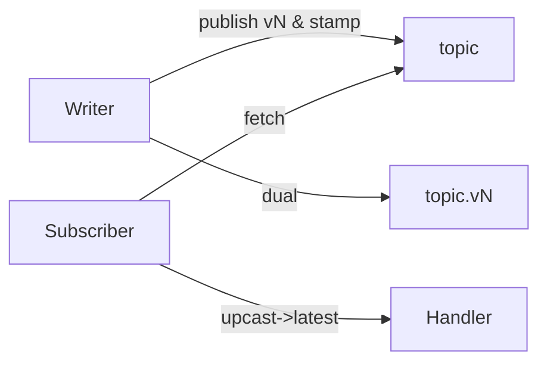
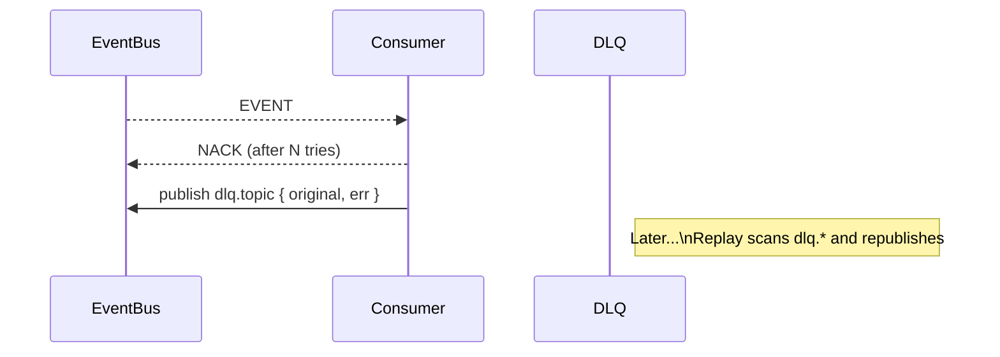

---
```
uuid: d8059b6a-c1ec-487d-8e0b-3ce33d6b4d06
```
```
created_at: 2025.08.08.20.08.52.md
```
```
filename: schema-evolution-workflow
```
```
description: >-
```
  Implements schema evolution with dual-write for writers and upcasters for
  readers, using a registry to manage versioned topics and schema validation.
tags:
  - schema
  - evolution
  - dual-write
  - upcasters
  - registry
  - topics
  - validation
```
related_to_title:
```
  - State Snapshots API and Transactional Projector
  - prom-lib-rate-limiters-and-replay-api
  - Stateful Partitions and Rebalancing
  - Event Bus MVP
  - Services
  - Unique Info Dump Index
  - Mongo Outbox Implementation
  - Cross-Language Runtime Polymorphism
  - WebSocket Gateway Implementation
  - aionian-circuit-math
  - archetype-ecs
  - Diagrams
  - DSL
  - Promethean-native config design
  - Promethean Event Bus MVP v0.1
  - observability-infrastructure-setup
  - ecs-offload-workers
  - Cross-Target Macro System in Sibilant
  - polyglot-repl-interface-layer
  - polymorphic-meta-programming-engine
  - Chroma Toolkit Consolidation Plan
  - Migrate to Provider-Tenant Architecture
  - 'Agent Tasks: Persistence Migration to DualStore'
```
related_to_uuid:
```
  - 509e1cd5-367c-4a9d-a61b-cef2e85d42ce
  - aee4718b-9f8b-4635-a0c1-ef61c9bea8f1
  - 4330e8f0-5f46-4235-918b-39b6b93fa561
  - 534fe91d-e87d-4cc7-b0e7-8b6833353d9b
  - 75ea4a6a-8270-488d-9d37-799c288e5f70
  - 30ec3ba6-fbca-4606-ac3e-89b747fbeb7c
  - 9c1acd1e-c6a4-4a49-a66f-6da8b1bc9333
  - c34c36a6-80c9-4b44-a200-6448543b1b33
  - e811123d-5841-4e52-bf8c-978f26db4230
  - f2d83a77-7f86-4c56-8538-1350167a0c6c
  - 8f4c1e86-1236-4936-84ca-6ed7082af6b7
  - 45cd25b5-ed36-49ab-82c8-10d0903e34db
  - e87bc036-1570-419e-a558-f45b9c0db698
  - ab748541-020e-4a7e-b07d-28173bd5bea2
  - fe7193a2-a5f7-4b3c-bea0-bd028815fc2c
  - b4e64f8c-4dc9-4941-a877-646c5ada068e
  - 6498b9d7-bd35-4bd3-89fb-af1c415c3cd1
  - 5f210ca2-54e9-445b-afe4-fb340d4992c5
  - 9c79206d-4cb9-4f00-87e0-782dcea37bc7
  - 7bed0b9a-8b22-4b1f-be81-054a179453cb
  - 5020e892-8f18-443a-b707-6d0f3efcfe22
  - 54382370-1931-4a19-a634-46735708a9ea
  - 93d2ba51-8689-49ee-94e2-296092e48058
references:
  - uuid: 4330e8f0-5f46-4235-918b-39b6b93fa561
    line: 267
    col: 1
    score: 0.92
  - uuid: aee4718b-9f8b-4635-a0c1-ef61c9bea8f1
    line: 90
    col: 1
    score: 1
  - uuid: 509e1cd5-367c-4a9d-a61b-cef2e85d42ce
    line: 233
    col: 1
    score: 1
  - uuid: 509e1cd5-367c-4a9d-a61b-cef2e85d42ce
    line: 160
    col: 1
    score: 0.88
  - uuid: 4330e8f0-5f46-4235-918b-39b6b93fa561
    line: 351
    col: 1
    score: 0.88
  - uuid: 534fe91d-e87d-4cc7-b0e7-8b6833353d9b
    line: 509
    col: 1
    score: 0.87
  - uuid: 4330e8f0-5f46-4235-918b-39b6b93fa561
    line: 520
    col: 1
    score: 0.91
  - uuid: 75ea4a6a-8270-488d-9d37-799c288e5f70
    line: 11
    col: 1
    score: 1
  - uuid: 75ea4a6a-8270-488d-9d37-799c288e5f70
    line: 11
    col: 3
    score: 1
  - uuid: 534fe91d-e87d-4cc7-b0e7-8b6833353d9b
    line: 554
    col: 1
    score: 1
  - uuid: 534fe91d-e87d-4cc7-b0e7-8b6833353d9b
    line: 554
    col: 3
    score: 1
  - uuid: 9c1acd1e-c6a4-4a49-a66f-6da8b1bc9333
    line: 553
    col: 1
    score: 1
  - uuid: 9c1acd1e-c6a4-4a49-a66f-6da8b1bc9333
    line: 553
    col: 3
    score: 1
  - uuid: aee4718b-9f8b-4635-a0c1-ef61c9bea8f1
    line: 382
    col: 1
    score: 1
  - uuid: aee4718b-9f8b-4635-a0c1-ef61c9bea8f1
    line: 382
    col: 3
    score: 1
  - uuid: 93d2ba51-8689-49ee-94e2-296092e48058
    line: 136
    col: 1
    score: 1
  - uuid: 93d2ba51-8689-49ee-94e2-296092e48058
    line: 136
    col: 3
    score: 1
  - uuid: 5020e892-8f18-443a-b707-6d0f3efcfe22
    line: 166
    col: 1
    score: 1
  - uuid: 5020e892-8f18-443a-b707-6d0f3efcfe22
    line: 166
    col: 3
    score: 1
  - uuid: 534fe91d-e87d-4cc7-b0e7-8b6833353d9b
    line: 551
    col: 1
    score: 1
  - uuid: 534fe91d-e87d-4cc7-b0e7-8b6833353d9b
    line: 551
    col: 3
    score: 1
  - uuid: 54382370-1931-4a19-a634-46735708a9ea
    line: 284
    col: 1
    score: 1
  - uuid: 54382370-1931-4a19-a634-46735708a9ea
    line: 284
    col: 3
    score: 1
  - uuid: 75ea4a6a-8270-488d-9d37-799c288e5f70
    line: 14
    col: 1
    score: 1
  - uuid: 75ea4a6a-8270-488d-9d37-799c288e5f70
    line: 14
    col: 3
    score: 1
  - uuid: 534fe91d-e87d-4cc7-b0e7-8b6833353d9b
    line: 553
    col: 1
    score: 1
  - uuid: 534fe91d-e87d-4cc7-b0e7-8b6833353d9b
    line: 553
    col: 3
    score: 1
  - uuid: 9c1acd1e-c6a4-4a49-a66f-6da8b1bc9333
    line: 559
    col: 1
    score: 1
  - uuid: 9c1acd1e-c6a4-4a49-a66f-6da8b1bc9333
    line: 559
    col: 3
    score: 1
  - uuid: aee4718b-9f8b-4635-a0c1-ef61c9bea8f1
    line: 388
    col: 1
    score: 1
  - uuid: aee4718b-9f8b-4635-a0c1-ef61c9bea8f1
    line: 388
    col: 3
    score: 1
  - uuid: 9c1acd1e-c6a4-4a49-a66f-6da8b1bc9333
    line: 552
    col: 1
    score: 1
  - uuid: 9c1acd1e-c6a4-4a49-a66f-6da8b1bc9333
    line: 552
    col: 3
    score: 1
  - uuid: aee4718b-9f8b-4635-a0c1-ef61c9bea8f1
    line: 386
    col: 1
    score: 1
  - uuid: aee4718b-9f8b-4635-a0c1-ef61c9bea8f1
    line: 386
    col: 3
    score: 1
  - uuid: fe7193a2-a5f7-4b3c-bea0-bd028815fc2c
    line: 881
    col: 1
    score: 1
  - uuid: fe7193a2-a5f7-4b3c-bea0-bd028815fc2c
    line: 881
    col: 3
    score: 1
  - uuid: 509e1cd5-367c-4a9d-a61b-cef2e85d42ce
    line: 341
    col: 1
    score: 1
  - uuid: 509e1cd5-367c-4a9d-a61b-cef2e85d42ce
    line: 341
    col: 3
    score: 1
  - uuid: 9c1acd1e-c6a4-4a49-a66f-6da8b1bc9333
    line: 557
    col: 1
    score: 1
  - uuid: 9c1acd1e-c6a4-4a49-a66f-6da8b1bc9333
    line: 557
    col: 3
    score: 1
  - uuid: 509e1cd5-367c-4a9d-a61b-cef2e85d42ce
    line: 337
    col: 1
    score: 1
  - uuid: 509e1cd5-367c-4a9d-a61b-cef2e85d42ce
    line: 337
    col: 3
    score: 1
  - uuid: 4330e8f0-5f46-4235-918b-39b6b93fa561
    line: 533
    col: 1
    score: 1
  - uuid: 4330e8f0-5f46-4235-918b-39b6b93fa561
    line: 533
    col: 3
    score: 1
  - uuid: 30ec3ba6-fbca-4606-ac3e-89b747fbeb7c
    line: 68
    col: 1
    score: 1
  - uuid: 30ec3ba6-fbca-4606-ac3e-89b747fbeb7c
    line: 68
    col: 3
    score: 1
  - uuid: f2d83a77-7f86-4c56-8538-1350167a0c6c
    line: 158
    col: 1
    score: 1
  - uuid: f2d83a77-7f86-4c56-8538-1350167a0c6c
    line: 158
    col: 3
    score: 1
  - uuid: 8f4c1e86-1236-4936-84ca-6ed7082af6b7
    line: 457
    col: 1
    score: 1
  - uuid: 8f4c1e86-1236-4936-84ca-6ed7082af6b7
    line: 457
    col: 3
    score: 1
  - uuid: 45cd25b5-ed36-49ab-82c8-10d0903e34db
    line: 9
    col: 1
    score: 1
  - uuid: 45cd25b5-ed36-49ab-82c8-10d0903e34db
    line: 9
    col: 3
    score: 1
  - uuid: e87bc036-1570-419e-a558-f45b9c0db698
    line: 10
    col: 1
    score: 1
  - uuid: e87bc036-1570-419e-a558-f45b9c0db698
    line: 10
    col: 3
    score: 1
  - uuid: 75ea4a6a-8270-488d-9d37-799c288e5f70
    line: 13
    col: 1
    score: 1
  - uuid: 75ea4a6a-8270-488d-9d37-799c288e5f70
    line: 13
    col: 3
    score: 1
  - uuid: 6498b9d7-bd35-4bd3-89fb-af1c415c3cd1
    line: 467
    col: 1
    score: 1
  - uuid: 6498b9d7-bd35-4bd3-89fb-af1c415c3cd1
    line: 467
    col: 3
    score: 1
  - uuid: 534fe91d-e87d-4cc7-b0e7-8b6833353d9b
    line: 549
    col: 1
    score: 1
  - uuid: 534fe91d-e87d-4cc7-b0e7-8b6833353d9b
    line: 549
    col: 3
    score: 1
  - uuid: b4e64f8c-4dc9-4941-a877-646c5ada068e
    line: 364
    col: 1
    score: 1
  - uuid: b4e64f8c-4dc9-4941-a877-646c5ada068e
    line: 364
    col: 3
    score: 1
  - uuid: 5f210ca2-54e9-445b-afe4-fb340d4992c5
    line: 173
    col: 1
    score: 1
  - uuid: 5f210ca2-54e9-445b-afe4-fb340d4992c5
    line: 173
    col: 3
    score: 1
  - uuid: 9c79206d-4cb9-4f00-87e0-782dcea37bc7
    line: 156
    col: 1
    score: 1
  - uuid: 9c79206d-4cb9-4f00-87e0-782dcea37bc7
    line: 156
    col: 3
    score: 1
  - uuid: 7bed0b9a-8b22-4b1f-be81-054a179453cb
    line: 200
    col: 1
    score: 1
  - uuid: 7bed0b9a-8b22-4b1f-be81-054a179453cb
    line: 200
    col: 3
    score: 1
  - uuid: ab748541-020e-4a7e-b07d-28173bd5bea2
    line: 389
    col: 1
    score: 1
  - uuid: ab748541-020e-4a7e-b07d-28173bd5bea2
    line: 389
    col: 3
    score: 1
  - uuid: 6498b9d7-bd35-4bd3-89fb-af1c415c3cd1
    line: 465
    col: 1
    score: 1
  - uuid: 6498b9d7-bd35-4bd3-89fb-af1c415c3cd1
    line: 465
    col: 3
    score: 1
  - uuid: 534fe91d-e87d-4cc7-b0e7-8b6833353d9b
    line: 548
    col: 1
    score: 1
  - uuid: 534fe91d-e87d-4cc7-b0e7-8b6833353d9b
    line: 548
    col: 3
    score: 1
  - uuid: 9c1acd1e-c6a4-4a49-a66f-6da8b1bc9333
    line: 551
    col: 1
    score: 1
  - uuid: 9c1acd1e-c6a4-4a49-a66f-6da8b1bc9333
    line: 551
    col: 3
    score: 1
  - uuid: fe7193a2-a5f7-4b3c-bea0-bd028815fc2c
    line: 883
    col: 1
    score: 1
  - uuid: fe7193a2-a5f7-4b3c-bea0-bd028815fc2c
    line: 883
    col: 3
    score: 1
  - uuid: 509e1cd5-367c-4a9d-a61b-cef2e85d42ce
    line: 349
    col: 1
    score: 0.99
  - uuid: 509e1cd5-367c-4a9d-a61b-cef2e85d42ce
    line: 349
    col: 3
    score: 0.99
  - uuid: 534fe91d-e87d-4cc7-b0e7-8b6833353d9b
    line: 559
    col: 1
    score: 0.98
  - uuid: 534fe91d-e87d-4cc7-b0e7-8b6833353d9b
    line: 559
    col: 3
    score: 0.98
  - uuid: fe7193a2-a5f7-4b3c-bea0-bd028815fc2c
    line: 906
    col: 1
    score: 0.98
  - uuid: fe7193a2-a5f7-4b3c-bea0-bd028815fc2c
    line: 906
    col: 3
    score: 0.98
  - uuid: fe7193a2-a5f7-4b3c-bea0-bd028815fc2c
    line: 905
    col: 1
    score: 0.97
  - uuid: fe7193a2-a5f7-4b3c-bea0-bd028815fc2c
    line: 905
    col: 3
    score: 0.97
  - uuid: aee4718b-9f8b-4635-a0c1-ef61c9bea8f1
    line: 396
    col: 1
    score: 1
  - uuid: aee4718b-9f8b-4635-a0c1-ef61c9bea8f1
    line: 396
    col: 3
    score: 1
  - uuid: e811123d-5841-4e52-bf8c-978f26db4230
    line: 646
    col: 1
    score: 0.99
  - uuid: e811123d-5841-4e52-bf8c-978f26db4230
    line: 646
    col: 3
    score: 0.99
  - uuid: aee4718b-9f8b-4635-a0c1-ef61c9bea8f1
    line: 397
    col: 1
    score: 0.99
  - uuid: aee4718b-9f8b-4635-a0c1-ef61c9bea8f1
    line: 397
    col: 3
    score: 0.99
  - uuid: 75ea4a6a-8270-488d-9d37-799c288e5f70
    line: 25
    col: 1
    score: 0.98
  - uuid: 75ea4a6a-8270-488d-9d37-799c288e5f70
    line: 25
    col: 3
    score: 0.98
  - uuid: 30ec3ba6-fbca-4606-ac3e-89b747fbeb7c
    line: 160
    col: 1
    score: 0.99
  - uuid: 30ec3ba6-fbca-4606-ac3e-89b747fbeb7c
    line: 160
    col: 3
    score: 0.99
  - uuid: 9c1acd1e-c6a4-4a49-a66f-6da8b1bc9333
    line: 564
    col: 1
    score: 0.98
  - uuid: 9c1acd1e-c6a4-4a49-a66f-6da8b1bc9333
    line: 564
    col: 3
    score: 0.98
  - uuid: e811123d-5841-4e52-bf8c-978f26db4230
    line: 645
    col: 1
    score: 0.98
  - uuid: e811123d-5841-4e52-bf8c-978f26db4230
    line: 645
    col: 3
    score: 0.98
  - uuid: aee4718b-9f8b-4635-a0c1-ef61c9bea8f1
    line: 398
    col: 1
    score: 0.98
  - uuid: aee4718b-9f8b-4635-a0c1-ef61c9bea8f1
    line: 398
    col: 3
    score: 0.98
  - uuid: fe7193a2-a5f7-4b3c-bea0-bd028815fc2c
    line: 898
    col: 1
    score: 0.97
  - uuid: fe7193a2-a5f7-4b3c-bea0-bd028815fc2c
    line: 898
    col: 3
    score: 0.97
---
Note: Consolidated here → ../notes/services/schema-evolution-dlq-changefeed.md

Alright, **Part 6**: schema evolution workflow dual-write + upcasters, a **DLQ** with replay, **Mongo changefeeds** → topics, and a tiny **CI linter** for topic/schema hygiene. Paste under `shared/js/prom-lib/` + a small `scripts/` dir.

---

# 0) Tiny prelude: topic naming rules (used by linter)

```ts
// shared/js/prom-lib/naming/rules.ts
export const TOPIC_RE = /^[a-z0-9]+(\.[a-z0-9]+)*(\.v\d+)?/; // dot segments, optional .vN suffix
export function isValidTopic(t: string) { return TOPIC_RE.test(t); }
export function headerOk(h: string) { return /^x-[a-z0-9-]+/.test(h); } // custom headers
```

---

# 1) Schema Evolution Workflow

Approach:

* **Registry** holds versions.
* Writers **dual-write** for one deploy window old & new topic OR same topic with `x-schema-version`.
* Readers use **upcasters** to normalize older versions to **latest**.
* Optional **cutover** job to backfill snapshots/materializations.

## 1a) Upcasters N → N+1 → … → latest

```ts
// shared/js/prom-lib/schema/upcast.ts
import { EventRecord } from "../event/types";
import { SchemaRegistry } from "./registry";

export type Upcaster = (e: EventRecord) => EventRecord;

export class UpcastChain {
  // map: topic -> version -> upcaster to next
  private chains = new Map<string, Map<number, Upcaster>>();

  add(topic: string, fromVersion: number, fn: Upcaster) {
    const m = this.chains.get(topic) ?? new Map<number, Upcaster>();
    m.set(fromVersion, fn);
    this.chains.set(topic, m);
  }

  // walk from e.headers["x-schema-version"] up to latest
  toLatest(topic: string, e: EventRecord, reg: SchemaRegistry): EventRecord {
    const m = this.chains.get(topic);
    const latest = reg.latest(topic)?.version;
    if (!m || latest == null) return e;

    const vRaw = Number(e.headers?.["x-schema-version"]);
    let v = Number.isFinite(vRaw) ? vRaw : latest; // if no version assume latest (legacy)
    let cur = e;

    while (v < latest) {
      const step = m.get(v);
      if (!step) break; // missing hop; best-effort
      cur = step(cur);
      v++;
    }
    // stamp new version so downstream knows it’s normalized
    cur.headers = { ...(cur.headers ?? {}), "x-schema-version": String(latest) };
    return cur;
  }
}
```

## 1b) Dual-write helper (same topic, stamped versions)

```ts
// shared/js/prom-lib/schema/dualwrite.ts
import { EventBus, PublishOptions, EventRecord } from "../event/types";
import { SchemaRegistry } from "./registry";

export function withDualWrite(bus: EventBus, reg: SchemaRegistry): EventBus {
  return {
    ...bus,
    async publish<T>(topic: string, payload: T, opts: PublishOptions = {}): Promise<EventRecord<T>> {
      const latest = reg.latest(topic);
      if (latest) {
        opts.headers = { ...(opts.headers || {}), "x-schema-version": String(latest.version) };
      }
      // optional: also write to versioned topic name e.g., foo.bar.v2
      if (latest && !String(topic).endsWith(`.v{latest.version}`)) {
        const vTopic = `{topic}.v{latest.version}`;
        // fire-and-forget extra write; ignore error to avoid breaking primary path
        bus.publish(vTopic, payload, { ...opts });
      }
      return bus.publish(topic, payload, opts);
    }
  };
}
```

## 1c) Subscriber wrapper that **upcasts** then validates

```ts
// shared/js/prom-lib/schema/normalize.ts
import { EventBus, EventRecord } from "../event/types";
import { SchemaRegistry } from "./registry";
import { UpcastChain } from "./upcast";

export async function subscribeNormalized(
  bus: EventBus,
  topic: string,
  group: string,
  reg: SchemaRegistry,
  up: UpcastChain,
  handler: (e: EventRecord) => Promise<void>,
  opts: any = {}
) {
  return bus.subscribe(topic, group, async (e) => {
    const norm = up.toLatest(topic, e, reg);
    reg.validate(topic, norm.payload, Number(norm.headers?.["x-schema-version"]));
    await handler(norm);
  }, opts);
}
```

## 1d) Evolution playbook (dump this as doc)

1. **Register** new schema `v+1` (`compat: backward` recommended).
2. **Deploy writers** with `withDualWrite` stamps `x-schema-version`, dual to `*.vN`.
3. **Deploy readers** with `subscribeNormalized` + upcasters.
4. Let traffic bake; verify dashboards.
5. Switch materializers to read `*.vN` only (optional).
6. Remove dual-write after cutover; keep upcasters for replay.
```
**Mermaid:**
```


---

# 2) Dead Letter Queue (DLQ) + Replay

## 2a) DLQ event shape

```ts
// shared/js/prom-lib/dlq/types.ts
export interface DLQRecord {
  topic: string; group?: string;
  original: any;            // original EventRecord
  err: string;              // error message/stack
  ts: number;
  attempts?: number;
}
export const DLQ_TOPIC_PREFIX = "dlq.";
export const dlqTopic = (t: string) => `{DLQ_TOPIC_PREFIX}{t}`;
```

## 2b) Subscribe wrapper with DLQ

```ts
// shared/js/prom-lib/dlq/subscribe.ts
import { EventBus, EventRecord } from "../event/types";
import { dlqTopic } from "./types";

export function withDLQ(
  bus: EventBus,
  { maxAttempts = 5, group }: { maxAttempts?: number; group: string }
) {
  return async function subscribeWithDLQ(
    topic: string,
    handler: (e: EventRecord) => Promise<void>,
    opts: any = {}
  ) {
    let attempts = new Map<string, number>();

    return bus.subscribe(topic, group, async (e) => {
      const n = (attempts.get(e.id) ?? 0) + 1;
      attempts.set(e.id, n);

      try {
        await handler(e);
        attempts.delete(e.id);
      } catch (err: any) {
        if (n >= maxAttempts) {
          await bus.publish(dlqTopic(topic), {
            topic, group, original: e, err: String(err?.stack ?? err?.message ?? err), ts: Date.now(), attempts: n
          });
          attempts.delete(e.id);
        } else {
          throw err; // cause redelivery
        }
      }
    }, opts);
  };
}
```

## 2c) DLQ replayer

```ts
// shared/js/prom-lib/dlq/replay.ts
import { MongoEventStore } from "../event/mongo";
import { EventBus, EventRecord } from "../event/types";
import { dlqTopic } from "./types";

export async function replayDLQ(
  store: MongoEventStore, bus: EventBus, topic: string,
  { limit = 1000, transform }: { limit?: number; transform?: (e: EventRecord) => EventRecord | void }
) {
  const dlq = dlqTopic(topic);
  const batch = await store.scan(dlq, { ts: 0, limit });
  for (const rec of batch) {
    const orig = (rec.payload as any)?.original as EventRecord;
    if (!orig) continue;
    const tweaked = transform ? (transform(orig) || orig) : orig;
    await bus.publish(tweaked.topic, tweaked.payload, { headers: tweaked.headers, key: tweaked.key, sid: tweaked.sid, caused_by: (tweaked.caused_by || []).concat(rec.id) });
  }
}
```
```
**Mermaid:**
```


---

# 3) Changefeeds Mongo → Topic

Watch a Mongo collection (materialized view or business table) and republish changes.

## 3a) Changefeed watcher

```ts
// shared/js/prom-lib/changefeed/mongo.ts
import type { Db, ResumeToken } from "mongodb";
import { EventBus } from "../event/types";

export interface ChangefeedOptions {
  collection: string;
  topic: string;
  fullDocument?: "updateLookup" | "whenAvailable"; // default "updateLookup"
  resumeTokenStore?: {
    load(): Promise<ResumeToken | null>;
    save(tok: ResumeToken): Promise<void>;
  };
  filter?: (doc: any) => boolean; // drop noisy changes if needed
  map?: (doc: any) => any;        // transform doc->payload
}

export async function startMongoChangefeed(db: Db, bus: EventBus, opts: ChangefeedOptions) {
  const coll = db.collection(opts.collection);
  const resume = await opts.resumeTokenStore?.load();

  const cs = coll.watch([], { fullDocument: opts.fullDocument ?? "updateLookup", resumeAfter: resume ?? undefined });

  let stopped = false;
  (async () => {
    for await (const change of cs) {
      if (stopped) break;
      const doc = change.fullDocument ?? change.documentKey;
      if (opts.filter && !opts.filter(doc)) continue;

      const payload = opts.map ? opts.map(doc) : doc;
      await bus.publish(opts.topic, payload, {
        key: String(doc._id),
        headers: { "x-mongo-op": change.operationType, "x-change-clusterTime": String(change.clusterTime) }
      });

      if (opts.resumeTokenStore && change._id) await opts.resumeTokenStore.save(change._id);
    }
  })().catch(() => { /* log, retry/backoff in real code */ });

  return () => { stopped = true; cs.close(); };
}
```

## 3b) Resume token store (Mongo)

```ts
// shared/js/prom-lib/changefeed/resume.mongo.ts
import type { Db, ResumeToken } from "mongodb";

export function tokenStore(db: Db, key = "changefeed:default") {
  const coll = db.collection<{ _id: string; token: any }>("changefeed_tokens");
  return {
    async load(): Promise<ResumeToken | null> {
      const d = await coll.findOne({ _id: key });
      return (d?.token as any) ?? null;
    },
    async save(token: ResumeToken) {
      await coll.updateOne({ _id: key }, { set: { token } }, { upsert: true });
    }
  };
}
```

---

# 4) CI Linter (topics, headers, schema coverage)

Scans `shared/js/prom-lib/event/topics.ts` and your codebase for `publish("topic", ...)` calls; ensures topics are valid, registered in the schema registry (or explicitly allowed), and custom headers follow `x-` convention.

```ts
// scripts/lint-topics.ts
import fs from "fs";
import path from "path";

import { isValidTopic, headerOk } from "../shared/js/prom-lib/naming/rules";
import { reg as schemaReg } from "../shared/js/prom-lib/schema/topics";

const ROOT = process.env.REPO_ROOT || process.cwd();
const SRC_DIRS = ["services", "shared/js"]; // add more if needed

function walk(dir: string): string[] {
  const out: string[] = [];
  for (const e of fs.readdirSync(dir, { withFileTypes: true })) {
    if (e.name.startsWith(".")) continue;
    const p = path.join(dir, e.name);
    if (e.isDirectory()) out.push(...walk(p));
    else if (/\.(ts|js|tsx)/.test(e.name)) out.push(p);
  }
  return out;
}

// very naive grep; good enough for CI guardrails
const PUB_RE = /publish\(\s*["'`]([a-zA-Z0-9\.\-:]+)["'`]/g;
const HDR_RE = /headers\s*:\s*\{([^}]+)\}/g;
const HDR_KEY_RE = /["'`]([a-zA-Z0-9\-\_]+)["'`]\s*:/g;

let errors: string[] = [];

function checkFile(p: string) {
  const s = fs.readFileSync(p, "utf8");
  let m: RegExpExecArray | null;
  while ((m = PUB_RE.exec(s))) {
    const topic = m[1];
    if (!isValidTopic(topic)) errors.push(`{p}: invalid topic '{topic}'`);
    // schema coverage: either versioned or present in registry (ok to skip for internal)
    const versioned = /\.v\d+/.test(topic);
    const hasSchema = !!schemaReg.latest(topic);
    if (!versioned && !hasSchema) errors.push(`{p}: unregistered topic '{topic}' (no schema)`);
  }

  while ((m = HDR_RE.exec(s))) {
    const obj = m[1];
    let kh: RegExpExecArray | null;
    while ((kh = HDR_KEY_RE.exec(obj))) {
      const k = kh[1];
      if (!/^x-/.test(k) && !/^content-type/i.test(k)) {
        if (!headerOk(k)) errors.push(`{p}: header key '{k}' should be 'x-...'`);
      }
    }
  }
}

for (const d of SRC_DIRS) {
  const abs = path.join(ROOT, d);
  if (!fs.existsSync(abs)) continue;
  for (const f of walk(abs)) checkFile(f);
}

if (errors.length) {
  console.error("Topic/Schema/Header lints failed:");
  for (const e of errors) console.error(" -", e);
  process.exit(1);
} else {
  console.log("Topic/Schema/Header lints OK");
}
```

Add to CI:

```yaml
# .github/workflows/lint.yml (snippet)
- name: Topic/Schema lints
  run: node scripts/lint-topics.ts
```

---

# 5) Glue example evolution + DLQ + changefeed

```ts
// services/js/event-hub/evolve.ts
import { MongoClient } from "mongodb";
import { MongoEventBus, MongoEventStore, MongoCursorStore } from "../../shared/js/prom-lib/event/mongo";
import { withDualWrite } from "../../shared/js/prom-lib/schema/dualwrite";
import { SchemaRegistry } from "../../shared/js/prom-lib/schema/registry";
import { reg as topicSchemas } from "../../shared/js/prom-lib/schema/topics";
import { UpcastChain } from "../../shared/js/prom-lib/schema/upcast";
import { subscribeNormalized } from "../../shared/js/prom-lib/schema/normalize";
import { withDLQ } from "../../shared/js/prom-lib/dlq/subscribe";
import { startMongoChangefeed } from "../../shared/js/prom-lib/changefeed/mongo";
import { tokenStore } from "../../shared/js/prom-lib/changefeed/resume.mongo";

async function main() {
  const client = await MongoClient.connect(process.env.MONGO_URL || "mongodb://127.0.0.1:27017/prom");
  const db = client.db();

  const store = new MongoEventStore(db);
  const rawBus = new MongoEventBus(store, new MongoCursorStore(db));

  // schema registry + upcasters
  const reg = topicSchemas as SchemaRegistry;
  const up = new UpcastChain();
  // example upcaster: heartbeat v1 -> v2 rename mem_mb->mem_mib
  up.add("heartbeat.received", 1, (e) => {
    const p: any = e.payload;
    return { ...e, payload: { ...p, mem_mib: p.mem_mb, mem_mb: undefined }, headers: { ...(e.headers||{}), "x-upcasted-from": "1" } };
  });

  const bus = withDualWrite(rawBus, reg);

  // consumer with normalize + DLQ
  const subscribeWithDLQ = withDLQ(bus, { group: "hb-consumers", maxAttempts: 3 });
  await subscribeWithDLQ("heartbeat.received", async (e) => {
    const norm = up.toLatest("heartbeat.received", e, reg);
    reg.validate("heartbeat.received", norm.payload);
    // ... handle ...
  }, { from: "earliest" });

  // changefeed: mirror 'processes' collection -> topic 'processes.changed'
  await startMongoChangefeed(db, bus, {
    collection: "processes",
    topic: "processes.changed",
    fullDocument: "updateLookup",
    resumeTokenStore: tokenStore(db, "cf:processes"),
    map: (doc) => ({ id: String(doc._id), ...doc })
  });

  console.log("[evolve] up");
}
main().catch((e)=>{ console.error(e); process.exit(1); });
```

---

# 6) Sibilant sprinkles (pseudo)

```lisp
; shared/sibilant/prom/evolve.sib (pseudo)
(defn upcast->latest [topic e]
  (.toLatest up topic e schema-reg))

(defmacro dual-write! [bus topic payload]
  `(.publish ~bus ~topic ~payload {:headers {"x-source" "sib"}}))
```

---

# 7) Kanban adds

* [ ] Register **v+1** schema for any evolving topic and write minimal **upcaster**
* [ ] Wrap writers with **withDualWrite**
* [ ] Switch critical readers to **subscribeNormalized**
* [ ] Add **withDLQ** around risky consumers; set `maxAttempts`
* [ ] Deploy **changefeed** for collections you want mirrored to topics
* [ ] Enable **scripts/lint-topics.ts** in CI
* [ ] Write a small **cutover** script to replay historical events through upcasters into snapshots

---

Want **Part 7** next? I can ship:

* **State snapshots API** read models with ETags + caching,
* **Transactional projector** Mongo session/txn around multi-collection updates,
* **Time Travel** query helper reconstruct state at T using snapshots + deltas,
* and a **dev harness** that spins in-memory bus + fake services for integration tests.
<!-- GENERATED-SECTIONS:DO-NOT-EDIT-BELOW -->
## Related content
```
- [state-snapshots-api-and-transactional-projector|State Snapshots API and Transactional Projector]
- [prom-lib-rate-limiters-and-replay-api]
- [stateful-partitions-and-rebalancing|Stateful Partitions and Rebalancing]
- [docs/unique/event-bus-mvp|Event Bus MVP]
- [Services]chunks/services.md
- [unique-info-dump-index|Unique Info Dump Index]
- [mongo-outbox-implementation|Mongo Outbox Implementation]
- [cross-language-runtime-polymorphism|Cross-Language Runtime Polymorphism]
- [websocket-gateway-implementation|WebSocket Gateway Implementation]
- [docs/unique/aionian-circuit-math|aionian-circuit-math]
- [docs/unique/archetype-ecs|archetype-ecs]
- [Diagrams]chunks/diagrams.md
- [DSL]chunks/dsl.md
- [promethean-native-config-design|Promethean-native config design]
- [Promethean Event Bus MVP v0.1]promethean-event-bus-mvp-v0-1.md
- [observability-infrastructure-setup]
- [docs/unique/ecs-offload-workers|ecs-offload-workers]
- [cross-target-macro-system-in-sibilant|Cross-Target Macro System in Sibilant]
- [polyglot-repl-interface-layer]
- [polymorphic-meta-programming-engine]
- [chroma-toolkit-consolidation-plan|Chroma Toolkit Consolidation Plan]
- [migrate-to-provider-tenant-architecture|Migrate to Provider-Tenant Architecture]
- [docs/unique/agent-tasks-persistence-migration-to-dualstore|Agent Tasks: Persistence Migration to DualStore]

## Sources
- [stateful-partitions-and-rebalancing#L267|Stateful Partitions and Rebalancing — L267] (line 267, col 1, score 0.92)
- [prom-lib-rate-limiters-and-replay-api#L90|prom-lib-rate-limiters-and-replay-api — L90] (line 90, col 1, score 1)
- [state-snapshots-api-and-transactional-projector#L233|State Snapshots API and Transactional Projector — L233] (line 233, col 1, score 1)
- [state-snapshots-api-and-transactional-projector#L160|State Snapshots API and Transactional Projector — L160] (line 160, col 1, score 0.88)
- [stateful-partitions-and-rebalancing#L351|Stateful Partitions and Rebalancing — L351] (line 351, col 1, score 0.88)
- [docs/unique/event-bus-mvp#L509|Event Bus MVP — L509] (line 509, col 1, score 0.87)
- [stateful-partitions-and-rebalancing#L520|Stateful Partitions and Rebalancing — L520] (line 520, col 1, score 0.91)
- [Services — L11]chunks/services.md#L11 (line 11, col 1, score 1)
- [Services — L11]chunks/services.md#L11 (line 11, col 3, score 1)
- [docs/unique/event-bus-mvp#L554|Event Bus MVP — L554] (line 554, col 1, score 1)
- [docs/unique/event-bus-mvp#L554|Event Bus MVP — L554] (line 554, col 3, score 1)
- [mongo-outbox-implementation#L553|Mongo Outbox Implementation — L553] (line 553, col 1, score 1)
- [mongo-outbox-implementation#L553|Mongo Outbox Implementation — L553] (line 553, col 3, score 1)
- [prom-lib-rate-limiters-and-replay-api#L382|prom-lib-rate-limiters-and-replay-api — L382] (line 382, col 1, score 1)
- [prom-lib-rate-limiters-and-replay-api#L382|prom-lib-rate-limiters-and-replay-api — L382] (line 382, col 3, score 1)
- [docs/unique/agent-tasks-persistence-migration-to-dualstore#L136|Agent Tasks: Persistence Migration to DualStore — L136] (line 136, col 1, score 1)
- [docs/unique/agent-tasks-persistence-migration-to-dualstore#L136|Agent Tasks: Persistence Migration to DualStore — L136] (line 136, col 3, score 1)
- [chroma-toolkit-consolidation-plan#L166|Chroma Toolkit Consolidation Plan — L166] (line 166, col 1, score 1)
- [chroma-toolkit-consolidation-plan#L166|Chroma Toolkit Consolidation Plan — L166] (line 166, col 3, score 1)
- [docs/unique/event-bus-mvp#L551|Event Bus MVP — L551] (line 551, col 1, score 1)
- [docs/unique/event-bus-mvp#L551|Event Bus MVP — L551] (line 551, col 3, score 1)
- [migrate-to-provider-tenant-architecture#L284|Migrate to Provider-Tenant Architecture — L284] (line 284, col 1, score 1)
- [migrate-to-provider-tenant-architecture#L284|Migrate to Provider-Tenant Architecture — L284] (line 284, col 3, score 1)
- [Services — L14]chunks/services.md#L14 (line 14, col 1, score 1)
- [Services — L14]chunks/services.md#L14 (line 14, col 3, score 1)
- [docs/unique/event-bus-mvp#L553|Event Bus MVP — L553] (line 553, col 1, score 1)
- [docs/unique/event-bus-mvp#L553|Event Bus MVP — L553] (line 553, col 3, score 1)
- [mongo-outbox-implementation#L559|Mongo Outbox Implementation — L559] (line 559, col 1, score 1)
- [mongo-outbox-implementation#L559|Mongo Outbox Implementation — L559] (line 559, col 3, score 1)
- [prom-lib-rate-limiters-and-replay-api#L388|prom-lib-rate-limiters-and-replay-api — L388] (line 388, col 1, score 1)
- [prom-lib-rate-limiters-and-replay-api#L388|prom-lib-rate-limiters-and-replay-api — L388] (line 388, col 3, score 1)
- [mongo-outbox-implementation#L552|Mongo Outbox Implementation — L552] (line 552, col 1, score 1)
- [mongo-outbox-implementation#L552|Mongo Outbox Implementation — L552] (line 552, col 3, score 1)
- [prom-lib-rate-limiters-and-replay-api#L386|prom-lib-rate-limiters-and-replay-api — L386] (line 386, col 1, score 1)
- [prom-lib-rate-limiters-and-replay-api#L386|prom-lib-rate-limiters-and-replay-api — L386] (line 386, col 3, score 1)
- [Promethean Event Bus MVP v0.1 — L881]promethean-event-bus-mvp-v0-1.md#L881 (line 881, col 1, score 1)
- [Promethean Event Bus MVP v0.1 — L881]promethean-event-bus-mvp-v0-1.md#L881 (line 881, col 3, score 1)
- [state-snapshots-api-and-transactional-projector#L341|State Snapshots API and Transactional Projector — L341] (line 341, col 1, score 1)
- [state-snapshots-api-and-transactional-projector#L341|State Snapshots API and Transactional Projector — L341] (line 341, col 3, score 1)
- [mongo-outbox-implementation#L557|Mongo Outbox Implementation — L557] (line 557, col 1, score 1)
- [mongo-outbox-implementation#L557|Mongo Outbox Implementation — L557] (line 557, col 3, score 1)
- [state-snapshots-api-and-transactional-projector#L337|State Snapshots API and Transactional Projector — L337] (line 337, col 1, score 1)
- [state-snapshots-api-and-transactional-projector#L337|State Snapshots API and Transactional Projector — L337] (line 337, col 3, score 1)
- [stateful-partitions-and-rebalancing#L533|Stateful Partitions and Rebalancing — L533] (line 533, col 1, score 1)
- [stateful-partitions-and-rebalancing#L533|Stateful Partitions and Rebalancing — L533] (line 533, col 3, score 1)
- [unique-info-dump-index#L68|Unique Info Dump Index — L68] (line 68, col 1, score 1)
- [unique-info-dump-index#L68|Unique Info Dump Index — L68] (line 68, col 3, score 1)
- [docs/unique/aionian-circuit-math#L158|aionian-circuit-math — L158] (line 158, col 1, score 1)
- [docs/unique/aionian-circuit-math#L158|aionian-circuit-math — L158] (line 158, col 3, score 1)
- [docs/unique/archetype-ecs#L457|archetype-ecs — L457] (line 457, col 1, score 1)
- [docs/unique/archetype-ecs#L457|archetype-ecs — L457] (line 457, col 3, score 1)
- [Diagrams — L9]chunks/diagrams.md#L9 (line 9, col 1, score 1)
- [Diagrams — L9]chunks/diagrams.md#L9 (line 9, col 3, score 1)
- [DSL — L10]chunks/dsl.md#L10 (line 10, col 1, score 1)
- [DSL — L10]chunks/dsl.md#L10 (line 10, col 3, score 1)
- [Services — L13]chunks/services.md#L13 (line 13, col 1, score 1)
- [Services — L13]chunks/services.md#L13 (line 13, col 3, score 1)
- [docs/unique/ecs-offload-workers#L467|ecs-offload-workers — L467] (line 467, col 1, score 1)
- [docs/unique/ecs-offload-workers#L467|ecs-offload-workers — L467] (line 467, col 3, score 1)
- [docs/unique/event-bus-mvp#L549|Event Bus MVP — L549] (line 549, col 1, score 1)
- [docs/unique/event-bus-mvp#L549|Event Bus MVP — L549] (line 549, col 3, score 1)
- [observability-infrastructure-setup#L364|observability-infrastructure-setup — L364] (line 364, col 1, score 1)
- [observability-infrastructure-setup#L364|observability-infrastructure-setup — L364] (line 364, col 3, score 1)
- [cross-target-macro-system-in-sibilant#L173|Cross-Target Macro System in Sibilant — L173] (line 173, col 1, score 1)
- [cross-target-macro-system-in-sibilant#L173|Cross-Target Macro System in Sibilant — L173] (line 173, col 3, score 1)
- [polyglot-repl-interface-layer#L156|polyglot-repl-interface-layer — L156] (line 156, col 1, score 1)
- [polyglot-repl-interface-layer#L156|polyglot-repl-interface-layer — L156] (line 156, col 3, score 1)
- [polymorphic-meta-programming-engine#L200|polymorphic-meta-programming-engine — L200] (line 200, col 1, score 1)
- [polymorphic-meta-programming-engine#L200|polymorphic-meta-programming-engine — L200] (line 200, col 3, score 1)
- [promethean-native-config-design#L389|Promethean-native config design — L389] (line 389, col 1, score 1)
- [promethean-native-config-design#L389|Promethean-native config design — L389] (line 389, col 3, score 1)
- [docs/unique/ecs-offload-workers#L465|ecs-offload-workers — L465] (line 465, col 1, score 1)
- [docs/unique/ecs-offload-workers#L465|ecs-offload-workers — L465] (line 465, col 3, score 1)
- [docs/unique/event-bus-mvp#L548|Event Bus MVP — L548] (line 548, col 1, score 1)
- [docs/unique/event-bus-mvp#L548|Event Bus MVP — L548] (line 548, col 3, score 1)
- [mongo-outbox-implementation#L551|Mongo Outbox Implementation — L551] (line 551, col 1, score 1)
- [mongo-outbox-implementation#L551|Mongo Outbox Implementation — L551] (line 551, col 3, score 1)
- [Promethean Event Bus MVP v0.1 — L883]promethean-event-bus-mvp-v0-1.md#L883 (line 883, col 1, score 1)
- [Promethean Event Bus MVP v0.1 — L883]promethean-event-bus-mvp-v0-1.md#L883 (line 883, col 3, score 1)
- [state-snapshots-api-and-transactional-projector#L349|State Snapshots API and Transactional Projector — L349] (line 349, col 1, score 0.99)
- [state-snapshots-api-and-transactional-projector#L349|State Snapshots API and Transactional Projector — L349] (line 349, col 3, score 0.99)
- [docs/unique/event-bus-mvp#L559|Event Bus MVP — L559] (line 559, col 1, score 0.98)
- [docs/unique/event-bus-mvp#L559|Event Bus MVP — L559] (line 559, col 3, score 0.98)
- [Promethean Event Bus MVP v0.1 — L906]promethean-event-bus-mvp-v0-1.md#L906 (line 906, col 1, score 0.98)
- [Promethean Event Bus MVP v0.1 — L906]promethean-event-bus-mvp-v0-1.md#L906 (line 906, col 3, score 0.98)
- [Promethean Event Bus MVP v0.1 — L905]promethean-event-bus-mvp-v0-1.md#L905 (line 905, col 1, score 0.97)
- [Promethean Event Bus MVP v0.1 — L905]promethean-event-bus-mvp-v0-1.md#L905 (line 905, col 3, score 0.97)
- [prom-lib-rate-limiters-and-replay-api#L396|prom-lib-rate-limiters-and-replay-api — L396] (line 396, col 1, score 1)
- [prom-lib-rate-limiters-and-replay-api#L396|prom-lib-rate-limiters-and-replay-api — L396] (line 396, col 3, score 1)
- [websocket-gateway-implementation#L646|WebSocket Gateway Implementation — L646] (line 646, col 1, score 0.99)
- [websocket-gateway-implementation#L646|WebSocket Gateway Implementation — L646] (line 646, col 3, score 0.99)
- [prom-lib-rate-limiters-and-replay-api#L397|prom-lib-rate-limiters-and-replay-api — L397] (line 397, col 1, score 0.99)
- [prom-lib-rate-limiters-and-replay-api#L397|prom-lib-rate-limiters-and-replay-api — L397] (line 397, col 3, score 0.99)
- [Services — L25]chunks/services.md#L25 (line 25, col 1, score 0.98)
- [Services — L25]chunks/services.md#L25 (line 25, col 3, score 0.98)
- [unique-info-dump-index#L160|Unique Info Dump Index — L160] (line 160, col 1, score 0.99)
- [unique-info-dump-index#L160|Unique Info Dump Index — L160] (line 160, col 3, score 0.99)
- [mongo-outbox-implementation#L564|Mongo Outbox Implementation — L564] (line 564, col 1, score 0.98)
- [mongo-outbox-implementation#L564|Mongo Outbox Implementation — L564] (line 564, col 3, score 0.98)
- [websocket-gateway-implementation#L645|WebSocket Gateway Implementation — L645] (line 645, col 1, score 0.98)
- [websocket-gateway-implementation#L645|WebSocket Gateway Implementation — L645] (line 645, col 3, score 0.98)
- [prom-lib-rate-limiters-and-replay-api#L398|prom-lib-rate-limiters-and-replay-api — L398] (line 398, col 1, score 0.98)
- [prom-lib-rate-limiters-and-replay-api#L398|prom-lib-rate-limiters-and-replay-api — L398] (line 398, col 3, score 0.98)
- [Promethean Event Bus MVP v0.1 — L898]promethean-event-bus-mvp-v0-1.md#L898 (line 898, col 1, score 0.97)
- [Promethean Event Bus MVP v0.1 — L898]promethean-event-bus-mvp-v0-1.md#L898 (line 898, col 3, score 0.97)
```
```
<!-- GENERATED-SECTIONS:DO-NOT-EDIT-ABOVE -->
