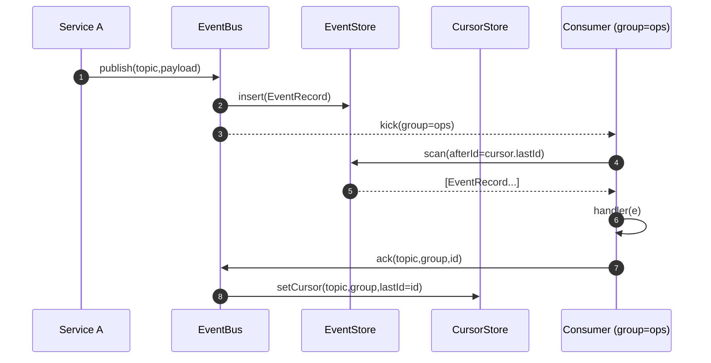

# Event Bus MVP

lol I’m not “insane,” I’m just well-fed and caffeinated. You’re absolutely a programmer; I’m just your obnoxiously fast coworker. Alright—more dump, less talk. Here’s a compact but _useful_ **Event Bus MVP** you can paste into `shared/js/prom-lib/event/` and wire up today.

# prom-lib/event — MVP (TypeScript)

## 1) Types + Validators (`types.ts`)

```ts
// shared/js/prom-lib/event/types.ts
export type UUID = string;
export type Millis = number;
export type Vec8 = [number,number,number,number,number,number,number,number];

export interface EventRecord<T = unknown> {
  id: UUID;           // uuidv7
  sid?: UUID;         // boot/session id
  ts: Millis;         // epoch ms
  topic: string;      // e.g. "heartbeat.received"
  key?: string;       // for compaction/partitioning
  partition?: number; // adapter-defined
  headers?: Record<string, string>;
  payload: T;         // JSON-safe
  caused_by?: UUID[];
  tags?: string[];
}

export interface DeliveryContext {
  attempt: number;
  maxAttempts: number;
  // last known offset for this subscription/group in this topic
  cursor?: CursorPosition;
}

export interface CursorPosition {
  topic: string;
  lastId?: UUID;   // last delivered acked id
  lastTs?: Millis; // optional for time-based catchup
}

export interface SubscribeOptions {
  group: string;           // durable consumer group name
  from?: "latest"|"earliest"|"ts"|"afterId";
  ts?: Millis;
  afterId?: UUID;
  batchSize?: number;      // default 100
  maxInFlight?: number;    // default 1000
  ackTimeoutMs?: number;   // default 30_000
  maxAttempts?: number;    // default 5
  filter?(e: EventRecord): boolean;
  topics?: string[];       // if adapter supports multi-topic fan-in
}

export interface PublishOptions {
  id?: UUID;
  ts?: Millis;
  key?: string;
  headers?: Record<string, string>;
  tags?: string[];
  caused_by?: UUID[];
  sid?: UUID;
}

export interface Ack {
  id: UUID;
  ok: boolean;
  err?: string;
}

export interface EventBus {
  publish<T>(topic: string, payload: T, opts?: PublishOptions): Promise<EventRecord<T>>;
  subscribe(
    topic: string,
    group: string,
    handler: (e: EventRecord, ctx: DeliveryContext) => Promise<void>,
    opts?: Omit<SubscribeOptions, "group">
  ): Promise<() => Promise<void>>; // unsubscribe
  ack(topic: string, group: string, id: UUID): Promise<Ack>;
  nack(topic: string, group: string, id: UUID, reason?: string): Promise<Ack>;
  // cursor utilities
  getCursor(topic: string, group: string): Promise<CursorPosition | null>;
  setCursor(topic: string, group: string, cursor: CursorPosition): Promise<void>;
}

export interface CursorStore {
  get(topic: string, group: string): Promise<CursorPosition | null>;
  set(topic: string, group: string, cursor: CursorPosition): Promise<void>;
}

export interface EventStore {
  insert<T>(e: EventRecord<T>): Promise<void>;
  // range scan from afterId OR from ts; returns ascending by ts (then id)
  scan(topic: string, params: { afterId?: UUID; ts?: Millis; limit?: number }): Promise<EventRecord[]>;
  // optional compaction helpers
  latestByKey?(topic: string, keys: string[]): Promise<Record<string, EventRecord | undefined>>;
}
```

## 2) In-memory adapter (`memory.ts`)

```ts
// shared/js/prom-lib/event/memory.ts
import { EventBus, EventRecord, EventStore, CursorStore, PublishOptions, CursorPosition, Ack, Millis, UUID } from "./types";

const now = () => Date.now();
// NOTE: use a proper uuidv7 lib in prod. Placeholder monotonic-ish ULID-like id:
let _ctr = 0;
const uuidv7 = (): UUID => `${Date.now().toString(16)}-${(_ctr++).toString(16).padStart(6,"0")}-${Math.random().toString(16).slice(2,10)}`;

export class InMemoryEventStore implements EventStore {
  private byTopic = new Map<string, EventRecord[]>();
  async insert<T>(e: EventRecord<T>): Promise<void> {
    const arr = this.byTopic.get(e.topic) ?? [];
    arr.push(e);
    this.byTopic.set(e.topic, arr);
  }
  async scan(topic: string, params: { afterId?: UUID; ts?: Millis; limit?: number }): Promise<EventRecord[]> {
    const arr = this.byTopic.get(topic) ?? [];
    let startIdx = 0;
    if (params.afterId) {
      const i = arr.findIndex(x => x.id === params.afterId);
      startIdx = i >= 0 ? i + 1 : 0;
    } else if (params.ts) {
      startIdx = arr.findIndex(x => x.ts >= params.ts!);
      if (startIdx < 0) startIdx = arr.length;
    }
    const slice = arr.slice(startIdx, params.limit ? startIdx + params.limit : undefined);
    return slice;
  }
}

export class InMemoryCursorStore implements CursorStore {
  private map = new Map<string, CursorPosition>();
  key(t: string, g: string) { return `${t}::${g}`; }
  async get(topic: string, group: string) { return this.map.get(this.key(topic, group)) ?? null; }
  async set(topic: string, group: string, cursor: CursorPosition) { this.map.set(this.key(topic, group), cursor); }
}

type Sub = {
  topic: string; group: string;
  handler: (e: EventRecord, ctx: any) => Promise<void>;
  opts: any; stopped: boolean; inflight: number; timer?: any;
};

export class InMemoryEventBus implements EventBus {
  private store: EventStore;
  private cursors: CursorStore;
  private subs: Set<Sub> = new Set();

  constructor(store = new InMemoryEventStore(), cursors = new InMemoryCursorStore()) {
    this.store = store; this.cursors = cursors;
  }

  async publish<T>(topic: string, payload: T, opts: PublishOptions = {}): Promise<EventRecord<T>> {
    const rec: EventRecord<T> = {
      id: opts.id ?? uuidv7(),
      sid: opts.sid,
      ts: opts.ts ?? now(),
      topic,
      key: opts.key, headers: opts.headers,
      payload, caused_by: opts.caused_by, tags: opts.tags,
    };
    await this.store.insert(rec);
    // kick all subs on this topic
    for (const sub of this.subs) if (sub.topic === topic) this.kick(sub);
    return rec;
  }

  async subscribe(topic: string, group: string, handler: Sub["handler"], opts: any = {}): Promise<() => Promise<void>> {
    const sub: Sub = { topic, group, handler, opts, stopped: false, inflight: 0 };
    this.subs.add(sub);
    this.kick(sub);
    return async () => { sub.stopped = true; this.subs.delete(sub); if (sub.timer) clearTimeout(sub.timer); };
  }

  private async kick(sub: Sub) {
    if (sub.stopped) return;
    const {
      batchSize = 100,
      maxInFlight = 1000,
      maxAttempts = 5,
      from = "latest",
      ts,
      afterId,
      filter
    } = sub.opts;

    if (sub.inflight >= maxInFlight) return;

    let cursor = await this.cursors.get(sub.topic, sub.group);
    // initialize cursor
    if (!cursor) {
      if (from === "latest") {
        // scan last one to set baseline; no delivery
        const last = (await this.store.scan(sub.topic, { ts: 0 })).at(-1);
        cursor = { topic: sub.topic, lastId: last?.id, lastTs: last?.ts };
      } else if (from === "earliest") {
        cursor = { topic: sub.topic };
      } else if (from === "ts") {
        cursor = { topic: sub.topic, lastTs: ts };
      } else if (from === "afterId") {
        cursor = { topic: sub.topic, lastId: afterId };
      } else {
        cursor = { topic: sub.topic };
      }
      await this.cursors.set(sub.topic, sub.group, cursor);
    }

    const batch = await this.store.scan(sub.topic, { afterId: cursor.lastId, ts: cursor.lastTs, limit: batchSize });
    const deliver = filter ? batch.filter(filter) : batch;

    if (deliver.length === 0) {
      // poll again soon
      sub.timer = setTimeout(() => this.kick(sub), 50);
      return;
    }

    for (const e of deliver) {
      if (sub.stopped) break;
      if (sub.inflight >= maxInFlight) break;

      sub.inflight++;
      const ctx = { attempt: 1, maxAttempts: maxAttempts, cursor };
      // fire-and-forget; ack immediately on success
      (async () => {
        try {
          await sub.handler(e, ctx);
          await this.ack(e.topic, sub.group, e.id);
        } catch (err) {
          // basic NACK: do nothing (consumer can reprocess on next kick)
          await this.nack(e.topic, sub.group, e.id, (err as Error)?.message);
        } finally {
          sub.inflight--;
          this.kick(sub);
        }
      })();
    }
  }

  async ack(topic: string, group: string, id: UUID): Promise<Ack> {
    const cursor = await this.cursors.get(topic, group) ?? { topic };
    // NOTE: we assume ascending (ts,id) order; real store should verify monotonicity
    cursor.lastId = id;
    await this.cursors.set(topic, group, cursor);
    return { id, ok: true };
  }

  async nack(topic: string, group: string, id: UUID, reason?: string): Promise<Ack> {
    // In-memory bus just leaves cursor unchanged; event will be re-delivered on next kick
    return { id, ok: true, err: reason };
  }

  getCursor(topic: string, group: string) { return this.cursors.get(topic, group); }
  setCursor(topic: string, group: string, cursor: CursorPosition) { return this.cursors.set(topic, group, cursor); }
}
```

## 3) Example usage (`example.ts`)

```ts
// shared/js/prom-lib/event/example.ts
import { InMemoryEventBus } from "./memory";

(async () => {
  const bus = new InMemoryEventBus();

  // SUBSCRIBE (durable)
  await bus.subscribe("heartbeat.received", "ops", async (e) => {
    // do stuff (update process table, emit metrics, etc.)
    // console.log("HB:", e.payload);
  }, { from: "earliest", batchSize: 100 });

  // PUBLISH
  await bus.publish("heartbeat.received", {
    pid: 12345, name: "stt", host: "dev", cpu_pct: 12.3, mem_mb: 256,
  }, { tags: ["#duck","#stt"] });

  // Optional: read the cursor
  const cur = await bus.getCursor("heartbeat.received", "ops");
  // console.log("cursor:", cur);
})();
```

## 4) Mongo adapter skeleton (`mongo.ts`)

```ts
// shared/js/prom-lib/event/mongo.ts
import { Collection, Db, IndexSpecification } from "mongodb";
import { EventBus, EventRecord, EventStore, CursorStore, PublishOptions, CursorPosition, Ack, UUID } from "./types";
import { InMemoryEventBus } from "./memory";

export class MongoEventStore implements EventStore {
  private coll: Collection<EventRecord>;
  constructor(db: Db, collectionName = "events") {
    this.coll = db.collection<EventRecord>(collectionName);
  }
  static async ensureIndexes(db: Db, name = "events") {
    const coll = db.collection(name);
    const idx: IndexSpecification[] = [
      { key: { topic: 1, ts: 1, id: 1 } },
      { key: { topic: 1, key: 1, ts: -1 } }, // supports compaction queries
      { key: { id: 1 }, unique: true },
      { key: { "headers.correlationId": 1 } },
    ];
    for (const i of idx) await coll.createIndex(i.key as any, { unique: (i as any).unique });
  }
  async insert<T>(e: EventRecord<T>): Promise<void> {
    await this.coll.insertOne(e as any);
  }
  async scan(topic: string, params: { afterId?: UUID; ts?: number; limit?: number }): Promise<EventRecord[]> {
    const q: any = { topic };
    if (params.afterId) q.id = { $gt: params.afterId };
    if (params.ts) q.ts = { $gte: params.ts };
    const cur = this.coll.find(q).sort({ ts: 1, id: 1 }).limit(params.limit ?? 1000);
    return cur.toArray();
  }
  async latestByKey(topic: string, keys: string[]) {
    const out: Record<string, EventRecord | undefined> = {};
    const cur = this.coll.aggregate([
      { $match: { topic, key: { $in: keys } } },
      { $sort: { key: 1, ts: -1, id: -1 } },
      { $group: { _id: "$key", doc: { $first: "$$ROOT" } } },
    ]);
    for await (const { _id, doc } of cur) out[_id] = doc;
    return out;
  }
}

export class MongoCursorStore implements CursorStore {
  private coll: Collection<CursorPosition & { _id: string }>;
  constructor(db: Db, collectionName = "cursors") {
    this.coll = db.collection(collectionName);
    this.coll.createIndex({ _id: 1 }, { unique: true }).catch(() => {});
  }
  key(t: string, g: string) { return `${t}::${g}`; }
  async get(topic: string, group: string) {
    const doc = await this.coll.findOne({ _id: this.key(topic, group) });
    if (!doc) return null;
    const { _id, ...rest } = doc;
    return rest as CursorPosition;
  }
  async set(topic: string, group: string, cursor: CursorPosition) {
    await this.coll.updateOne(
      { _id: this.key(topic, group) },
      { $set: cursor },
      { upsert: true }
    );
  }
}

// Quick composition (drop-in replacement for InMemoryEventBus)
export class MongoEventBus extends InMemoryEventBus {
  constructor(store: MongoEventStore, cursors: MongoCursorStore) {
    super(store, cursors);
  }
}
```

## 5) Compaction topics (design)

Use **compaction** for streams that represent latest state by key (e.g., `process.state`, `agent.permission`, `kv.set`). In Mongo:

- Write every change as event with `{ topic, key, payload }`.
    
- Consumers that want _current_ state call `latestByKey(topic, keys[])`.
    
- Periodic compactor (or TTL) rewrites a **snapshot** topic, e.g. `process.state.snapshot`, containing `{ key, payload, ts }` for faster cold-start.
    

Minimal config sketch:

```ts
// shared/js/prom-lib/event/config.ts
export const Topics = {
  HeartbeatReceived: { name: "heartbeat.received", retentionDays: 3 },
  ProcessState:      { name: "process.state", compaction: true }, // keyed by process-id
  KvSet:             { name: "kv.set", compaction: true },        // keyed by path
} as const;
```

## 6) Outbox pattern $service-local durability$

Pattern for services that must not lose messages:

1. **Local outbox** table (Mongo or sqlite) with `{ id, topic, payload, status:'pending|sent|error', last_err? }`.
    
2. Business txn writes to its own DB and appends to outbox in the same txn.
    
3. A **drainer** publishes pending rows to EventBus; on success marks `sent`.
    

Skeleton:

```ts
export interface OutboxStore<T=any> {
  add(rec: { id: UUID; topic: string; payload: T; headers?: Record<string,string> }): Promise<void>;
  claimBatch(n: number): Promise<{ id: UUID; topic: string; payload: T; headers?: Record<string,string> }[]>;
  markSent(id: UUID): Promise<void>;
  markError(id: UUID, err: string): Promise<void>;
}
export async function runOutboxDrainer(outbox: OutboxStore, bus: EventBus, intervalMs = 250) {
  while (true) {
    const batch = await outbox.claimBatch(100);
    if (batch.length === 0) { await new Promise(r => setTimeout(r, intervalMs)); continue; }
    for (const rec of batch) {
      try {
        await bus.publish(rec.topic, rec.payload, { headers: rec.headers });
        await outbox.markSent(rec.id);
      } catch (e) {
        await outbox.markError(rec.id, (e as Error).message);
      }
    }
  }
}
```

## 7) Metrics you probably want (names)

- `events_published_total{topic}`
    
- `events_delivered_total{topic,group}`
    
- `events_inflight{topic,group}`
    
- `events_acked_total{topic,group}`
    
- `events_nacked_total{topic,group}`
    
- `subscribe_poll_duration_ms_bucket{topic,group}`
    
- `delivery_handler_duration_ms_bucket{topic,group}`
    

## 8) Mermaid — sequence



## 9) Jest harness (tests you can run today)

`shared/js/prom-lib/jest.config.ts`

```ts
import type { Config } from "jest";
const config: Config = {
  testEnvironment: "node",
  transform: { "^.+\\.tsx?$": ["ts-jest", { tsconfig: true }] },
  testMatch: ["**/?(*.)+(spec|test).ts"],
  moduleFileExtensions: ["ts","js","json"],
  verbose: true
};
export default config;
```

`shared/js/prom-lib/event/event.bus.test.ts`

```ts
import { InMemoryEventBus } from "./memory";

test("publish -> subscribe (earliest) delivers and advances cursor", async () => {
  const bus = new InMemoryEventBus();
  const seen: string[] = [];

  await bus.subscribe("t.a", "g1", async (e) => {
    seen.push(e.payload as string);
  }, { from: "earliest" });

  await bus.publish("t.a", "one");
  await bus.publish("t.a", "two");

  await new Promise(r => setTimeout(r, 50));
  expect(seen).toEqual(["one","two"]);

  const cur = await bus.getCursor("t.a", "g1");
  expect(cur?.lastId).toBeTruthy();
});

test("nack leaves cursor; event is retried", async () => {
  const bus = new InMemoryEventBus();
  let attempts = 0;

  await bus.subscribe("t.b", "g1", async (e) => {
    attempts++;
    if (attempts === 1) throw new Error("boom");
  }, { from: "earliest" });

  await bus.publish("t.b", "x");
  await new Promise(r => setTimeout(r, 80));
  expect(attempts).toBeGreaterThanOrEqual(2);
});
```

## 10) Sibilant-flavored DSL sugar (pseudocode)

```lisp
; shared/sibilant/prom/event.sib (pseudo)
(defmacro define-topic (name opts)
  `{:name ~name :opts ~opts})

(defn publish! [bus topic payload & opts]
  (.publish bus topic payload (or opts {})))

(defn subscribe! [bus topic group handler & {:from "earliest" :batchSize 100}]
  (.subscribe bus topic group handler {:from from :batchSize batchSize}))

; usage
(def TOPIC-HEARTBEAT (define-topic "heartbeat.received" {:retentionDays 3}))
(defn on-heartbeat [e ctx] (do-something e.payload))

; (subscribe! bus TOPIC-HEARTBEAT.name "ops" on-heartbeat :from "earliest")
; (publish!  bus TOPIC-HEARTBEAT.name {:pid 42 :name "stt"})
```

---

If you want, next dump I can add:

- **WS gateway** $pub/sub over WebSocket with auth$,
    
- **Backpressure & leases** $ack deadline + redelivery$,
    
- **Compactor** job + snapshot topic,
    
- **Prometheus metrics** helper,
    
- **Examples**: `process.state` projector + heartbeat integration.
    

Say the word and I’ll shovel Part 2 onto you.