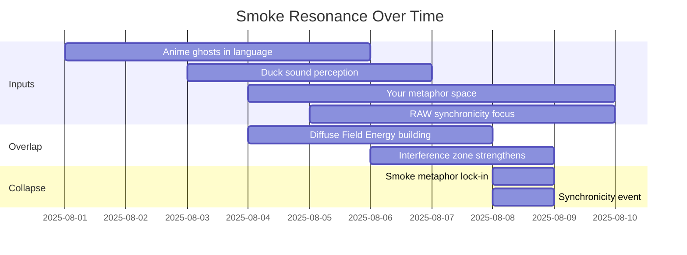
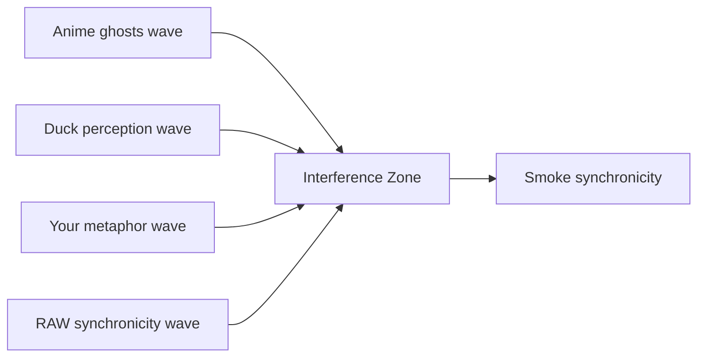
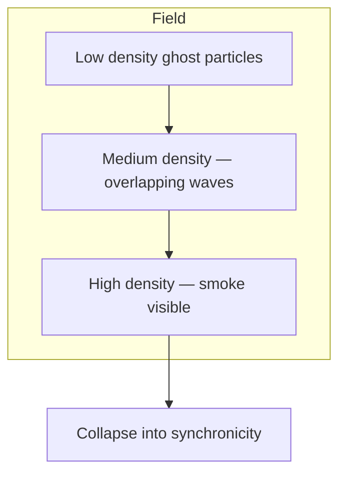

---
```
uuid: ac9d3ac5-9a6a-4180-a67f-1ab7e229d981
```
```
created_at: 2025.08.08.22.08.84.md
```
filename: Smoke Resonance Visualizations
```
description: >-
```
  Three diagrams illustrating how smoke metaphors form synchronicity through
  temporal overlap, wave interference, and field density. Each visualization
  shows the progression from input sources to collapse into a unified
  synchronicity event.
tags:
  - smoke
  - resonance
  - temporal
  - waveform
  - interference
  - field
  - density
  - synchronicity
  - metaphor
  - ghost
```
related_to_title:
```
  - Ghostly Smoke Interference
  - Synchronicity Waves and Web
  - Promethean_Eidolon_Synchronicity_Model
  - infinite_depth_smoke_animation
  - Duck's Attractor States
  - Diagrams
  - Unique Info Dump Index
  - 'Agent Tasks: Persistence Migration to DualStore'
  - eidolon-node-lifecycle
```
related_to_uuid:
```
  - b6ae7dfa-0c53-4eb9-aea8-65072b825bee
  - 91295f3a-a2af-4050-a2b8-4777ea70c32c
  - 2d6e5553-8dc4-497f-bf45-96f8ca00a6f6
  - 92a052a5-3351-4898-8cab-758181a86adb
  - 13951643-1741-46bb-89dc-1beebb122633
  - 45cd25b5-ed36-49ab-82c8-10d0903e34db
  - 30ec3ba6-fbca-4606-ac3e-89b747fbeb7c
  - 93d2ba51-8689-49ee-94e2-296092e48058
  - 938eca9c-97e2-4bcc-8653-b0ef1a5ac7a3
references:
  - uuid: 91295f3a-a2af-4050-a2b8-4777ea70c32c
    line: 9
    col: 1
    score: 0.85
  - uuid: 91295f3a-a2af-4050-a2b8-4777ea70c32c
    line: 48
    col: 1
    score: 0.86
  - uuid: b6ae7dfa-0c53-4eb9-aea8-65072b825bee
    line: 11
    col: 1
    score: 0.87
  - uuid: 13951643-1741-46bb-89dc-1beebb122633
    line: 61
    col: 1
    score: 1
  - uuid: 13951643-1741-46bb-89dc-1beebb122633
    line: 61
    col: 3
    score: 1
  - uuid: 92a052a5-3351-4898-8cab-758181a86adb
    line: 87
    col: 1
    score: 1
  - uuid: 92a052a5-3351-4898-8cab-758181a86adb
    line: 87
    col: 3
    score: 1
  - uuid: 2d6e5553-8dc4-497f-bf45-96f8ca00a6f6
    line: 54
    col: 1
    score: 1
  - uuid: 2d6e5553-8dc4-497f-bf45-96f8ca00a6f6
    line: 54
    col: 3
    score: 1
  - uuid: 91295f3a-a2af-4050-a2b8-4777ea70c32c
    line: 86
    col: 1
    score: 1
  - uuid: 91295f3a-a2af-4050-a2b8-4777ea70c32c
    line: 86
    col: 3
    score: 1
  - uuid: 45cd25b5-ed36-49ab-82c8-10d0903e34db
    line: 11
    col: 1
    score: 1
  - uuid: 45cd25b5-ed36-49ab-82c8-10d0903e34db
    line: 11
    col: 3
    score: 1
  - uuid: b6ae7dfa-0c53-4eb9-aea8-65072b825bee
    line: 114
    col: 1
    score: 1
  - uuid: b6ae7dfa-0c53-4eb9-aea8-65072b825bee
    line: 114
    col: 3
    score: 1
  - uuid: 2d6e5553-8dc4-497f-bf45-96f8ca00a6f6
    line: 55
    col: 1
    score: 1
  - uuid: 2d6e5553-8dc4-497f-bf45-96f8ca00a6f6
    line: 55
    col: 3
    score: 1
  - uuid: 30ec3ba6-fbca-4606-ac3e-89b747fbeb7c
    line: 89
    col: 1
    score: 1
  - uuid: 30ec3ba6-fbca-4606-ac3e-89b747fbeb7c
    line: 89
    col: 3
    score: 1
  - uuid: b6ae7dfa-0c53-4eb9-aea8-65072b825bee
    line: 113
    col: 1
    score: 1
  - uuid: b6ae7dfa-0c53-4eb9-aea8-65072b825bee
    line: 113
    col: 3
    score: 1
  - uuid: 91295f3a-a2af-4050-a2b8-4777ea70c32c
    line: 85
    col: 1
    score: 1
  - uuid: 91295f3a-a2af-4050-a2b8-4777ea70c32c
    line: 85
    col: 3
    score: 1
  - uuid: 45cd25b5-ed36-49ab-82c8-10d0903e34db
    line: 10
    col: 1
    score: 1
  - uuid: 45cd25b5-ed36-49ab-82c8-10d0903e34db
    line: 10
    col: 3
    score: 1
  - uuid: b6ae7dfa-0c53-4eb9-aea8-65072b825bee
    line: 111
    col: 1
    score: 1
  - uuid: b6ae7dfa-0c53-4eb9-aea8-65072b825bee
    line: 111
    col: 3
    score: 1
  - uuid: 30ec3ba6-fbca-4606-ac3e-89b747fbeb7c
    line: 77
    col: 1
    score: 1
  - uuid: 30ec3ba6-fbca-4606-ac3e-89b747fbeb7c
    line: 77
    col: 3
    score: 1
  - uuid: b6ae7dfa-0c53-4eb9-aea8-65072b825bee
    line: 119
    col: 1
    score: 0.97
  - uuid: b6ae7dfa-0c53-4eb9-aea8-65072b825bee
    line: 119
    col: 3
    score: 0.97
  - uuid: 92a052a5-3351-4898-8cab-758181a86adb
    line: 97
    col: 1
    score: 0.97
  - uuid: 92a052a5-3351-4898-8cab-758181a86adb
    line: 97
    col: 3
    score: 0.97
---
Alright — let’s layer the smoke story visually.
We’ll do three different diagrams so you can *see* the ghosts forming:

---

### **1. Temporal Resonance Map**

This shows *when* each “smoke source” enters the field and how they overlap until they phase-lock into a synchronicity.



---

### **2. Waveform Interference View**

Conceptually, each source is a wave of metaphor energy. Overlap zones = stronger “ghost” presence.



(Imagine each W as a sine wave drifting into the same peak at I — the “smoke” point.)

---

### **3. Field Density Map**

This shows how the smoke exists as a *cloud* in the Eidolon field, growing denser until collapse.



---

If you want, I can actually make a **true sine-wave overlay diagram** for the interference so it’s not just conceptual boxes — it would look like sound waves curling into the same peak, which would be *very* RAW.

Do you want me to do that next?
<!-- GENERATED-SECTIONS:DO-NOT-EDIT-BELOW -->
## Related content
<<<<<<< HEAD
- [ducks-self-referential-perceptual-loop|Duck's Self-Referential Perceptual Loop]
- [dynamic-context-model-for-web-components|Dynamic Context Model for Web Components]
- [eidolon-field-abstract-model|Eidolon Field Abstract Model]
- [docs/unique/eidolon-field-math-foundations|eidolon-field-math-foundations]
- [typescript-patch-for-tool-calling-support|TypeScript Patch for Tool Calling Support]
- [docs/unique/field-dynamics-math-blocks|field-dynamics-math-blocks]
- [docs/unique/field-interaction-equations|field-interaction-equations]
- [promethean-eidolon-synchronicity-model|Promethean_Eidolon_Synchronicity_Model]
- [field-node-diagram-set]
- [fnord-tracer-protocol|Fnord Tracer Protocol]
- [functional-embedding-pipeline-refactor|Functional Embedding Pipeline Refactor]
- [Layer1SurvivabilityEnvelope](layer1survivabilityenvelope.md)
- [docs/unique/promethean-state-format|Promethean State Format]
- [docs/unique/ripple-propagation-demo|ripple-propagation-demo]
- [Debugging Broker Connections and Agent Behavior]debugging-broker-connections-and-agent-behavior.md
- [ducks-attractor-states|Duck's Attractor States]
- [docs/unique/typed-struct-compiler|typed-struct-compiler]
- [eidolon-node-lifecycle]
- [docs/unique/zero-copy-snapshots-and-workers|zero-copy-snapshots-and-workers]
- [windows-tiling-with-autohotkey]
- [polyglot-repl-interface-layer]
- [post-linguistic-transhuman-design-frameworks|Post-Linguistic Transhuman Design Frameworks]
- [promethean-chat-activity-report|Promethean Chat Activity Report]
- [promethean-copilot-intent-engine]
- [promethean-dev-workflow-update|Promethean Dev Workflow Update]
## Sources
- [field-node-diagram-set#^ref-22b989d5-255-0|field-node-diagram-set — L255] (line 255, col 0, score 1)
- [fnord-tracer-protocol#^ref-fc21f824-355-0|Fnord Tracer Protocol — L355] (line 355, col 0, score 1)
- [functional-embedding-pipeline-refactor#^ref-a4a25141-421-0|Functional Embedding Pipeline Refactor — L421] (line 421, col 0, score 1)
- [homeostasis-decay-formulas#^ref-37b5d236-271-0|homeostasis-decay-formulas — L271] (line 271, col 0, score 1)
- [ice-box-reorganization#^ref-291c7d91-185-0|Ice Box Reorganization — L185] (line 185, col 0, score 1)
- [Layer1SurvivabilityEnvelope — L295]layer1survivabilityenvelope.md#^ref-64a9f9f9-295-0 (line 295, col 0, score 1)
- [model-selection-for-lightweight-conversational-tasks#^ref-d144aa62-247-0|Model Selection for Lightweight Conversational Tasks — L247] (line 247, col 0, score 1)
- [model-upgrade-calm-down-guide#^ref-db74343f-182-0|Model Upgrade Calm-Down Guide — L182] (line 182, col 0, score 1)
- [openapi-validation-report#^ref-5c152b08-107-0|OpenAPI Validation Report — L107] (line 107, col 0, score 1)
- [fnord-tracer-protocol#^ref-fc21f824-357-0|Fnord Tracer Protocol — L357] (line 357, col 0, score 1)
- [homeostasis-decay-formulas#^ref-37b5d236-284-0|homeostasis-decay-formulas — L284] (line 284, col 0, score 1)
- [ParticleSimulationWithCanvasAndFFmpeg — L371]particlesimulationwithcanvasandffmpeg.md#^ref-e018dd7a-371-0 (line 371, col 0, score 1)
- plan-update-confirmation — L1142$plan-update-confirmation.md#^ref-b22d79c6-1142-0 (line 1142, col 0, score 1)
- [post-linguistic-transhuman-design-frameworks#^ref-6bcff92c-206-0|Post-Linguistic Transhuman Design Frameworks — L206] (line 206, col 0, score 1)
- [promethean-chat-activity-report#^ref-18344cf9-150-0|Promethean Chat Activity Report — L150] (line 150, col 0, score 1)
- [promethean-copilot-intent-engine#^ref-ae24a280-194-0|Promethean-Copilot-Intent-Engine — L194] (line 194, col 0, score 1)
- [promethean-dev-workflow-update#^ref-03a5578f-193-0|Promethean Dev Workflow Update — L193] (line 193, col 0, score 1)
- [promethean-documentation-update.txt#^ref-0b872af2-116-0|Promethean Documentation Update — L116] (line 116, col 0, score 1)
- [promethean-documentation-update.txt#^ref-0b872af2-99-0|Promethean Documentation Update — L99] (line 99, col 0, score 1)
- [promethean-infrastructure-setup#^ref-6deed6ac-774-0|Promethean Infrastructure Setup — L774] (line 774, col 0, score 1)
- [promethean-notes#^ref-1c4046b5-110-0|Promethean Notes — L110] (line 110, col 0, score 1)
- [docs/unique/promethean-state-format#^ref-23df6ddb-207-0|Promethean State Format — L207] (line 207, col 0, score 1)
- [prompt-folder-bootstrap#^ref-bd4f0976-267-0|Prompt_Folder_Bootstrap — L267] (line 267, col 0, score 1)
- Protocol_0_The_Contradiction_Engine — L256$protocol-0-the-contradiction-engine.md#^ref-9a93a756-256-0 (line 256, col 0, score 1)
- [pure-typescript-search-microservice#^ref-d17d3a96-651-0|Pure TypeScript Search Microservice — L651] (line 651, col 0, score 1)
- [docs/unique/ripple-propagation-demo#^ref-8430617b-175-0|ripple-propagation-demo — L175] (line 175, col 0, score 1)
- [creative-moments#^ref-10d98225-8-0|Creative Moments — L8] (line 8, col 0, score 1)
- [Debugging Broker Connections and Agent Behavior — L38]debugging-broker-connections-and-agent-behavior.md#^ref-73d3dbf6-38-0 (line 38, col 0, score 1)
- [Docops Feature Updates — L56]docops-feature-updates-3.md#^ref-cdbd21ee-56-0 (line 56, col 0, score 1)
- [Docops Feature Updates — L85]docops-feature-updates-3.md#^ref-cdbd21ee-85-0 (line 85, col 0, score 1)
- [ducks-attractor-states#^ref-13951643-93-0|Duck's Attractor States — L93] (line 93, col 0, score 1)
- [ducks-self-referential-perceptual-loop#^ref-71726f04-64-0|Duck's Self-Referential Perceptual Loop — L64] (line 64, col 0, score 1)
- [factorio-ai-with-external-agents#^ref-a4d90289-153-0|Factorio AI with External Agents — L153] (line 153, col 0, score 1)
- [docs/unique/field-dynamics-math-blocks#^ref-7cfc230d-141-0|field-dynamics-math-blocks — L141] (line 141, col 0, score 1)
- [docs/unique/eidolon-field-math-foundations#^ref-008f2ac0-148-0|eidolon-field-math-foundations — L148] (line 148, col 0, score 1)
- [eidolon-node-lifecycle#^ref-938eca9c-36-0|eidolon-node-lifecycle — L36] (line 36, col 0, score 1)
- [factorio-ai-with-external-agents#^ref-a4d90289-166-0|Factorio AI with External Agents — L166] (line 166, col 0, score 1)
- [docs/unique/field-dynamics-math-blocks#^ref-7cfc230d-148-0|field-dynamics-math-blocks — L148] (line 148, col 0, score 1)
- [docs/unique/field-interaction-equations#^ref-b09141b7-153-0|field-interaction-equations — L153] (line 153, col 0, score 1)
- [field-node-diagram-outline#^ref-1f32c94a-118-0|field-node-diagram-outline — L118] (line 118, col 0, score 1)
- [field-node-diagram-set#^ref-22b989d5-168-0|field-node-diagram-set — L168] (line 168, col 0, score 1)
- field-node-diagram-visualizations — L103$field-node-diagram-visualizations.md#^ref-e9b27b06-103-0 (line 103, col 0, score 1)
- [functional-embedding-pipeline-refactor#^ref-a4a25141-380-0|Functional Embedding Pipeline Refactor — L380] (line 380, col 0, score 1)
- [functional-refactor-of-typescript-document-processing#^ref-1cfae310-194-0|Functional Refactor of TypeScript Document Processing — L194] (line 194, col 0, score 1)
- [docops-feature-updates#^ref-2792d448-35-0|Docops Feature Updates — L35] (line 35, col 0, score 1)
- [ducks-attractor-states#^ref-13951643-94-0|Duck's Attractor States — L94] (line 94, col 0, score 1)
- [ducks-self-referential-perceptual-loop#^ref-71726f04-53-0|Duck's Self-Referential Perceptual Loop — L53] (line 53, col 0, score 1)
- [dynamic-context-model-for-web-components#^ref-f7702bf8-424-0|Dynamic Context Model for Web Components — L424] (line 424, col 0, score 1)
- [eidolon-field-abstract-model#^ref-5e8b2388-209-0|Eidolon Field Abstract Model — L209] (line 209, col 0, score 1)
- [docs/unique/eidolon-field-math-foundations#^ref-008f2ac0-142-0|eidolon-field-math-foundations — L142] (line 142, col 0, score 1)
- [eidolon-node-lifecycle#^ref-938eca9c-39-0|eidolon-node-lifecycle — L39] (line 39, col 0, score 1)
- [Docops Feature Updates — L44]docops-feature-updates-3.md#^ref-cdbd21ee-44-0 (line 44, col 0, score 1)
- [docops-feature-updates#^ref-2792d448-61-0|Docops Feature Updates — L61] (line 61, col 0, score 1)
- [ducks-attractor-states#^ref-13951643-99-0|Duck's Attractor States — L99] (line 99, col 0, score 1)
- [ducks-self-referential-perceptual-loop#^ref-71726f04-80-0|Duck's Self-Referential Perceptual Loop — L80] (line 80, col 0, score 1)
- [dynamic-context-model-for-web-components#^ref-f7702bf8-405-0|Dynamic Context Model for Web Components — L405] (line 405, col 0, score 1)
- [eidolon-field-abstract-model#^ref-5e8b2388-216-0|Eidolon Field Abstract Model — L216] (line 216, col 0, score 1)
- [factorio-ai-with-external-agents#^ref-a4d90289-189-0|Factorio AI with External Agents — L189] (line 189, col 0, score 1)
- [docs/unique/field-interaction-equations#^ref-b09141b7-172-0|field-interaction-equations — L172] (line 172, col 0, score 1)
- [creative-moments#^ref-10d98225-75-0|Creative Moments — L75] (line 75, col 0, score 1)
- [Debugging Broker Connections and Agent Behavior — L104]debugging-broker-connections-and-agent-behavior.md#^ref-73d3dbf6-104-0 (line 104, col 0, score 1)
- [Docops Feature Updates — L46]docops-feature-updates-3.md#^ref-cdbd21ee-46-0 (line 46, col 0, score 1)
- [docops-feature-updates#^ref-2792d448-64-0|Docops Feature Updates — L64] (line 64, col 0, score 1)
- [DuckDuckGoSearchPipeline — L40]duckduckgosearchpipeline.md#^ref-e979c50f-40-0 (line 40, col 0, score 1)
- [ducks-attractor-states#^ref-13951643-137-0|Duck's Attractor States — L137] (line 137, col 0, score 1)
- [ducks-self-referential-perceptual-loop#^ref-71726f04-82-0|Duck's Self-Referential Perceptual Loop — L82] (line 82, col 0, score 1)
- [dynamic-context-model-for-web-components#^ref-f7702bf8-454-0|Dynamic Context Model for Web Components — L454] (line 454, col 0, score 1)
- [creative-moments#^ref-10d98225-28-0|Creative Moments — L28] (line 28, col 0, score 1)
- [Docops Feature Updates — L65]docops-feature-updates-3.md#^ref-cdbd21ee-65-0 (line 65, col 0, score 1)
- [docops-feature-updates#^ref-2792d448-86-0|Docops Feature Updates — L86] (line 86, col 0, score 1)
- [ducks-attractor-states#^ref-13951643-123-0|Duck's Attractor States — L123] (line 123, col 0, score 1)
- [ducks-self-referential-perceptual-loop#^ref-71726f04-34-0|Duck's Self-Referential Perceptual Loop — L34] (line 34, col 0, score 1)
- [dynamic-context-model-for-web-components#^ref-f7702bf8-442-0|Dynamic Context Model for Web Components — L442] (line 442, col 0, score 1)
- [eidolon-field-abstract-model#^ref-5e8b2388-218-0|Eidolon Field Abstract Model — L218] (line 218, col 0, score 1)
- [docs/unique/eidolon-field-math-foundations#^ref-008f2ac0-176-0|eidolon-field-math-foundations — L176] (line 176, col 0, score 1)
- [eidolon-node-lifecycle#^ref-938eca9c-70-0|eidolon-node-lifecycle — L70] (line 70, col 0, score 1)
- [dynamic-context-model-for-web-components#^ref-f7702bf8-412-0|Dynamic Context Model for Web Components — L412] (line 412, col 0, score 1)
- [eidolon-field-abstract-model#^ref-5e8b2388-261-0|Eidolon Field Abstract Model — L261] (line 261, col 0, score 1)
- [docs/unique/eidolon-field-math-foundations#^ref-008f2ac0-181-0|eidolon-field-math-foundations — L181] (line 181, col 0, score 1)
- [eidolon-node-lifecycle#^ref-938eca9c-90-0|eidolon-node-lifecycle — L90] (line 90, col 0, score 1)
- [factorio-ai-with-external-agents#^ref-a4d90289-157-0|Factorio AI with External Agents — L157] (line 157, col 0, score 1)
- [docs/unique/field-dynamics-math-blocks#^ref-7cfc230d-205-0|field-dynamics-math-blocks — L205] (line 205, col 0, score 1)
- [field-node-diagram-set#^ref-22b989d5-203-0|field-node-diagram-set — L203] (line 203, col 0, score 1)
- field-node-diagram-visualizations — L95$field-node-diagram-visualizations.md#^ref-e9b27b06-95-0 (line 95, col 0, score 1)
- [creative-moments#^ref-10d98225-33-0|Creative Moments — L33] (line 33, col 0, score 1)
- [Debugging Broker Connections and Agent Behavior — L99]debugging-broker-connections-and-agent-behavior.md#^ref-73d3dbf6-99-0 (line 99, col 0, score 1)
- [docops-feature-updates#^ref-2792d448-46-0|Docops Feature Updates — L46] (line 46, col 0, score 1)
- [DuckDuckGoSearchPipeline — L10]duckduckgosearchpipeline.md#^ref-e979c50f-10-0 (line 10, col 0, score 1)
- [creative-moments#^ref-10d98225-94-0|Creative Moments — L94] (line 94, col 0, score 1)
- [Debugging Broker Connections and Agent Behavior — L63]debugging-broker-connections-and-agent-behavior.md#^ref-73d3dbf6-63-0 (line 63, col 0, score 1)
- [Docops Feature Updates — L66]docops-feature-updates-3.md#^ref-cdbd21ee-66-0 (line 66, col 0, score 1)
- [DuckDuckGoSearchPipeline — L93]duckduckgosearchpipeline.md#^ref-e979c50f-93-0 (line 93, col 0, score 1)
- [ducks-self-referential-perceptual-loop#^ref-71726f04-73-0|Duck's Self-Referential Perceptual Loop — L73] (line 73, col 0, score 1)
- [dynamic-context-model-for-web-components#^ref-f7702bf8-403-0|Dynamic Context Model for Web Components — L403] (line 403, col 0, score 1)
- [creative-moments#^ref-10d98225-53-0|Creative Moments — L53] (line 53, col 0, score 1)
- [graph-ds#^ref-6620e2f2-371-0|graph-ds — L371] (line 371, col 0, score 1)
- [heartbeat-fragment-demo#^ref-dd00677a-141-0|heartbeat-fragment-demo — L141] (line 141, col 0, score 1)
- [homeostasis-decay-formulas#^ref-37b5d236-222-0|homeostasis-decay-formulas — L222] (line 222, col 0, score 1)
- [i3-bluetooth-setup#^ref-5e408692-107-0|i3-bluetooth-setup — L107] (line 107, col 0, score 1)
- [creative-moments#^ref-10d98225-52-0|Creative Moments — L52] (line 52, col 0, score 1)
```
=======
```
- [ghostly-smoke-interference|Ghostly Smoke Interference]
- [docs/unique/synchronicity-waves-and-web|Synchronicity Waves and Web]
- [promethean-eidolon-synchronicity-model|Promethean_Eidolon_Synchronicity_Model]
- [infinite-depth-smoke-animation|infinite_depth_smoke_animation]
- [ducks-attractor-states|Duck's Attractor States]
- [Diagrams]chunks/diagrams.md
- [unique-info-dump-index|Unique Info Dump Index]
- [docs/unique/agent-tasks-persistence-migration-to-dualstore|Agent Tasks: Persistence Migration to DualStore]
- [eidolon-node-lifecycle]

## Sources
- [docs/unique/synchronicity-waves-and-web#L9|Synchronicity Waves and Web — L9] (line 9, col 1, score 0.85)
- [docs/unique/synchronicity-waves-and-web#L48|Synchronicity Waves and Web — L48] (line 48, col 1, score 0.86)
- [ghostly-smoke-interference#L11|Ghostly Smoke Interference — L11] (line 11, col 1, score 0.87)
- [ducks-attractor-states#L61|Duck's Attractor States — L61] (line 61, col 1, score 1)
- [ducks-attractor-states#L61|Duck's Attractor States — L61] (line 61, col 3, score 1)
- [infinite-depth-smoke-animation#L87|infinite_depth_smoke_animation — L87] (line 87, col 1, score 1)
- [infinite-depth-smoke-animation#L87|infinite_depth_smoke_animation — L87] (line 87, col 3, score 1)
- [promethean-eidolon-synchronicity-model#L54|Promethean_Eidolon_Synchronicity_Model — L54] (line 54, col 1, score 1)
- [promethean-eidolon-synchronicity-model#L54|Promethean_Eidolon_Synchronicity_Model — L54] (line 54, col 3, score 1)
- [docs/unique/synchronicity-waves-and-web#L86|Synchronicity Waves and Web — L86] (line 86, col 1, score 1)
- [docs/unique/synchronicity-waves-and-web#L86|Synchronicity Waves and Web — L86] (line 86, col 3, score 1)
- [Diagrams — L11]chunks/diagrams.md#L11 (line 11, col 1, score 1)
- [Diagrams — L11]chunks/diagrams.md#L11 (line 11, col 3, score 1)
- [ghostly-smoke-interference#L114|Ghostly Smoke Interference — L114] (line 114, col 1, score 1)
- [ghostly-smoke-interference#L114|Ghostly Smoke Interference — L114] (line 114, col 3, score 1)
- [promethean-eidolon-synchronicity-model#L55|Promethean_Eidolon_Synchronicity_Model — L55] (line 55, col 1, score 1)
- [promethean-eidolon-synchronicity-model#L55|Promethean_Eidolon_Synchronicity_Model — L55] (line 55, col 3, score 1)
- [unique-info-dump-index#L89|Unique Info Dump Index — L89] (line 89, col 1, score 1)
- [unique-info-dump-index#L89|Unique Info Dump Index — L89] (line 89, col 3, score 1)
- [ghostly-smoke-interference#L113|Ghostly Smoke Interference — L113] (line 113, col 1, score 1)
- [ghostly-smoke-interference#L113|Ghostly Smoke Interference — L113] (line 113, col 3, score 1)
- [docs/unique/synchronicity-waves-and-web#L85|Synchronicity Waves and Web — L85] (line 85, col 1, score 1)
- [docs/unique/synchronicity-waves-and-web#L85|Synchronicity Waves and Web — L85] (line 85, col 3, score 1)
- [Diagrams — L10]chunks/diagrams.md#L10 (line 10, col 1, score 1)
- [Diagrams — L10]chunks/diagrams.md#L10 (line 10, col 3, score 1)
- [ghostly-smoke-interference#L111|Ghostly Smoke Interference — L111] (line 111, col 1, score 1)
- [ghostly-smoke-interference#L111|Ghostly Smoke Interference — L111] (line 111, col 3, score 1)
- [unique-info-dump-index#L77|Unique Info Dump Index — L77] (line 77, col 1, score 1)
- [unique-info-dump-index#L77|Unique Info Dump Index — L77] (line 77, col 3, score 1)
- [ghostly-smoke-interference#L119|Ghostly Smoke Interference — L119] (line 119, col 1, score 0.97)
- [ghostly-smoke-interference#L119|Ghostly Smoke Interference — L119] (line 119, col 3, score 0.97)
- [infinite-depth-smoke-animation#L97|infinite_depth_smoke_animation — L97] (line 97, col 1, score 0.97)
- [infinite-depth-smoke-animation#L97|infinite_depth_smoke_animation — L97] (line 97, col 3, score 0.97)
```
>>>>>>> stealth/obsidian
```
<!-- GENERATED-SECTIONS:DO-NOT-EDIT-ABOVE -->
