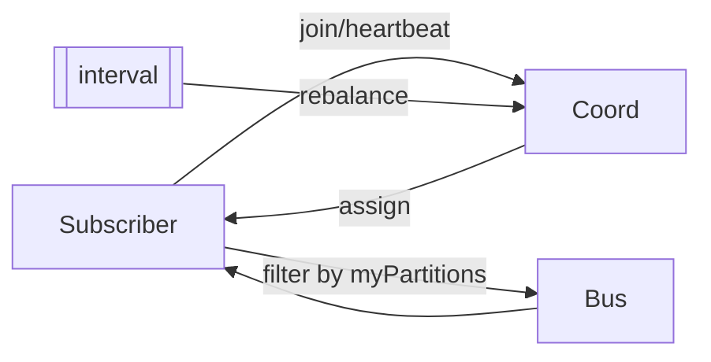
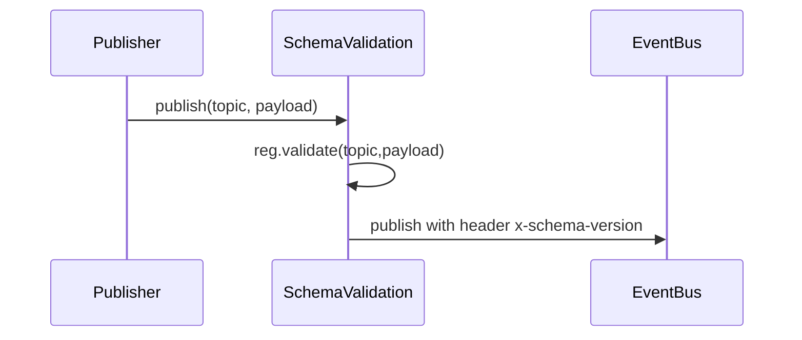

---
```
uuid: 4330e8f0-5f46-4235-918b-39b6b93fa561
```
```
created_at: 2025.08.08.20.08.56.md
```
filename: Stateful Partitions and Rebalancing
```
description: >-
```
  Implements stateful partitions with jump consistent hash for deterministic
  partitioning, in-memory coordinator for rebalancing, and partition-aware
  subscribe wrappers. Includes a tiny schema-registry (Zod) with compatibility
  rules and a changelog projector for materializing topics into MongoDB with
  upserts and tombstones.
tags:
  - stateful
  - rebalancing
  - partitioning
  - schema-registry
  - zod
  - changelog
  - projector
  - mongodb
  - upsert
  - tombstone
```
related_to_title:
```
  - schema-evolution-workflow
  - WebSocket Gateway Implementation
  - Event Bus MVP
  - State Snapshots API and Transactional Projector
  - Services
  - Unique Info Dump Index
  - prom-lib-rate-limiters-and-replay-api
  - Mongo Outbox Implementation
  - Promethean Event Bus MVP v0.1
  - Promethean-native config design
  - 'Agent Tasks: Persistence Migration to DualStore'
  - archetype-ecs
  - Chroma Toolkit Consolidation Plan
  - aionian-circuit-math
  - Diagrams
  - DSL
  - Board Walk – 2025-08-11
  - Event Bus Projections Architecture
  - ecs-offload-workers
  - observability-infrastructure-setup
  - Migrate to Provider-Tenant Architecture
  - Cross-Language Runtime Polymorphism
```
related_to_uuid:
```
  - d8059b6a-c1ec-487d-8e0b-3ce33d6b4d06
  - e811123d-5841-4e52-bf8c-978f26db4230
  - 534fe91d-e87d-4cc7-b0e7-8b6833353d9b
  - 509e1cd5-367c-4a9d-a61b-cef2e85d42ce
  - 75ea4a6a-8270-488d-9d37-799c288e5f70
  - 30ec3ba6-fbca-4606-ac3e-89b747fbeb7c
  - aee4718b-9f8b-4635-a0c1-ef61c9bea8f1
  - 9c1acd1e-c6a4-4a49-a66f-6da8b1bc9333
  - fe7193a2-a5f7-4b3c-bea0-bd028815fc2c
  - ab748541-020e-4a7e-b07d-28173bd5bea2
  - 93d2ba51-8689-49ee-94e2-296092e48058
  - 8f4c1e86-1236-4936-84ca-6ed7082af6b7
  - 5020e892-8f18-443a-b707-6d0f3efcfe22
  - f2d83a77-7f86-4c56-8538-1350167a0c6c
  - 45cd25b5-ed36-49ab-82c8-10d0903e34db
  - e87bc036-1570-419e-a558-f45b9c0db698
  - 7aa1eb92-7f9a-485b-8218-9b553aa9eefc
  - cf6b9b17-bb91-4219-aa5c-172cba02b2da
  - 6498b9d7-bd35-4bd3-89fb-af1c415c3cd1
  - b4e64f8c-4dc9-4941-a877-646c5ada068e
  - 54382370-1931-4a19-a634-46735708a9ea
  - c34c36a6-80c9-4b44-a200-6448543b1b33
references:
  - uuid: d8059b6a-c1ec-487d-8e0b-3ce33d6b4d06
    line: 71
    col: 1
    score: 0.92
  - uuid: d8059b6a-c1ec-487d-8e0b-3ce33d6b4d06
    line: 98
    col: 1
    score: 0.85
  - uuid: d8059b6a-c1ec-487d-8e0b-3ce33d6b4d06
    line: 243
    col: 1
    score: 0.88
  - uuid: d8059b6a-c1ec-487d-8e0b-3ce33d6b4d06
    line: 473
    col: 1
    score: 0.91
  - uuid: 75ea4a6a-8270-488d-9d37-799c288e5f70
    line: 12
    col: 1
    score: 1
  - uuid: 75ea4a6a-8270-488d-9d37-799c288e5f70
    line: 12
    col: 3
    score: 1
  - uuid: c34c36a6-80c9-4b44-a200-6448543b1b33
    line: 211
    col: 1
    score: 1
  - uuid: c34c36a6-80c9-4b44-a200-6448543b1b33
    line: 211
    col: 3
    score: 1
  - uuid: 534fe91d-e87d-4cc7-b0e7-8b6833353d9b
    line: 550
    col: 1
    score: 1
  - uuid: 534fe91d-e87d-4cc7-b0e7-8b6833353d9b
    line: 550
    col: 3
    score: 1
  - uuid: 9c1acd1e-c6a4-4a49-a66f-6da8b1bc9333
    line: 554
    col: 1
    score: 1
  - uuid: 9c1acd1e-c6a4-4a49-a66f-6da8b1bc9333
    line: 554
    col: 3
    score: 1
  - uuid: 6498b9d7-bd35-4bd3-89fb-af1c415c3cd1
    line: 465
    col: 1
    score: 1
  - uuid: 6498b9d7-bd35-4bd3-89fb-af1c415c3cd1
    line: 465
    col: 3
    score: 1
  - uuid: 534fe91d-e87d-4cc7-b0e7-8b6833353d9b
    line: 548
    col: 1
    score: 1
  - uuid: 534fe91d-e87d-4cc7-b0e7-8b6833353d9b
    line: 548
    col: 3
    score: 1
  - uuid: 9c1acd1e-c6a4-4a49-a66f-6da8b1bc9333
    line: 551
    col: 1
    score: 1
  - uuid: 9c1acd1e-c6a4-4a49-a66f-6da8b1bc9333
    line: 551
    col: 3
    score: 1
  - uuid: fe7193a2-a5f7-4b3c-bea0-bd028815fc2c
    line: 883
    col: 1
    score: 1
  - uuid: fe7193a2-a5f7-4b3c-bea0-bd028815fc2c
    line: 883
    col: 3
    score: 1
  - uuid: 9c1acd1e-c6a4-4a49-a66f-6da8b1bc9333
    line: 552
    col: 1
    score: 1
  - uuid: 9c1acd1e-c6a4-4a49-a66f-6da8b1bc9333
    line: 552
    col: 3
    score: 1
  - uuid: aee4718b-9f8b-4635-a0c1-ef61c9bea8f1
    line: 386
    col: 1
    score: 1
  - uuid: aee4718b-9f8b-4635-a0c1-ef61c9bea8f1
    line: 386
    col: 3
    score: 1
  - uuid: fe7193a2-a5f7-4b3c-bea0-bd028815fc2c
    line: 881
    col: 1
    score: 1
  - uuid: fe7193a2-a5f7-4b3c-bea0-bd028815fc2c
    line: 881
    col: 3
    score: 1
  - uuid: d8059b6a-c1ec-487d-8e0b-3ce33d6b4d06
    line: 485
    col: 1
    score: 1
  - uuid: d8059b6a-c1ec-487d-8e0b-3ce33d6b4d06
    line: 485
    col: 3
    score: 1
  - uuid: 75ea4a6a-8270-488d-9d37-799c288e5f70
    line: 11
    col: 1
    score: 1
  - uuid: 75ea4a6a-8270-488d-9d37-799c288e5f70
    line: 11
    col: 3
    score: 1
  - uuid: 534fe91d-e87d-4cc7-b0e7-8b6833353d9b
    line: 554
    col: 1
    score: 1
  - uuid: 534fe91d-e87d-4cc7-b0e7-8b6833353d9b
    line: 554
    col: 3
    score: 1
  - uuid: 9c1acd1e-c6a4-4a49-a66f-6da8b1bc9333
    line: 553
    col: 1
    score: 1
  - uuid: 9c1acd1e-c6a4-4a49-a66f-6da8b1bc9333
    line: 553
    col: 3
    score: 1
  - uuid: aee4718b-9f8b-4635-a0c1-ef61c9bea8f1
    line: 382
    col: 1
    score: 1
  - uuid: aee4718b-9f8b-4635-a0c1-ef61c9bea8f1
    line: 382
    col: 3
    score: 1
  - uuid: 9c1acd1e-c6a4-4a49-a66f-6da8b1bc9333
    line: 557
    col: 1
    score: 1
  - uuid: 9c1acd1e-c6a4-4a49-a66f-6da8b1bc9333
    line: 557
    col: 3
    score: 1
  - uuid: d8059b6a-c1ec-487d-8e0b-3ce33d6b4d06
    line: 486
    col: 1
    score: 1
  - uuid: d8059b6a-c1ec-487d-8e0b-3ce33d6b4d06
    line: 486
    col: 3
    score: 1
  - uuid: 509e1cd5-367c-4a9d-a61b-cef2e85d42ce
    line: 337
    col: 1
    score: 1
  - uuid: 509e1cd5-367c-4a9d-a61b-cef2e85d42ce
    line: 337
    col: 3
    score: 1
  - uuid: 30ec3ba6-fbca-4606-ac3e-89b747fbeb7c
    line: 68
    col: 1
    score: 1
  - uuid: 30ec3ba6-fbca-4606-ac3e-89b747fbeb7c
    line: 68
    col: 3
    score: 1
  - uuid: f2d83a77-7f86-4c56-8538-1350167a0c6c
    line: 158
    col: 1
    score: 1
  - uuid: f2d83a77-7f86-4c56-8538-1350167a0c6c
    line: 158
    col: 3
    score: 1
  - uuid: 8f4c1e86-1236-4936-84ca-6ed7082af6b7
    line: 457
    col: 1
    score: 1
  - uuid: 8f4c1e86-1236-4936-84ca-6ed7082af6b7
    line: 457
    col: 3
    score: 1
  - uuid: 45cd25b5-ed36-49ab-82c8-10d0903e34db
    line: 9
    col: 1
    score: 1
  - uuid: 45cd25b5-ed36-49ab-82c8-10d0903e34db
    line: 9
    col: 3
    score: 1
  - uuid: e87bc036-1570-419e-a558-f45b9c0db698
    line: 10
    col: 1
    score: 1
  - uuid: e87bc036-1570-419e-a558-f45b9c0db698
    line: 10
    col: 3
    score: 1
  - uuid: 93d2ba51-8689-49ee-94e2-296092e48058
    line: 136
    col: 1
    score: 1
  - uuid: 93d2ba51-8689-49ee-94e2-296092e48058
    line: 136
    col: 3
    score: 1
  - uuid: 5020e892-8f18-443a-b707-6d0f3efcfe22
    line: 166
    col: 1
    score: 1
  - uuid: 5020e892-8f18-443a-b707-6d0f3efcfe22
    line: 166
    col: 3
    score: 1
  - uuid: 534fe91d-e87d-4cc7-b0e7-8b6833353d9b
    line: 551
    col: 1
    score: 1
  - uuid: 534fe91d-e87d-4cc7-b0e7-8b6833353d9b
    line: 551
    col: 3
    score: 1
  - uuid: 54382370-1931-4a19-a634-46735708a9ea
    line: 284
    col: 1
    score: 1
  - uuid: 54382370-1931-4a19-a634-46735708a9ea
    line: 284
    col: 3
    score: 1
  - uuid: 75ea4a6a-8270-488d-9d37-799c288e5f70
    line: 13
    col: 1
    score: 1
  - uuid: 75ea4a6a-8270-488d-9d37-799c288e5f70
    line: 13
    col: 3
    score: 1
  - uuid: 6498b9d7-bd35-4bd3-89fb-af1c415c3cd1
    line: 467
    col: 1
    score: 1
  - uuid: 6498b9d7-bd35-4bd3-89fb-af1c415c3cd1
    line: 467
    col: 3
    score: 1
  - uuid: 534fe91d-e87d-4cc7-b0e7-8b6833353d9b
    line: 549
    col: 1
    score: 1
  - uuid: 534fe91d-e87d-4cc7-b0e7-8b6833353d9b
    line: 549
    col: 3
    score: 1
  - uuid: b4e64f8c-4dc9-4941-a877-646c5ada068e
    line: 364
    col: 1
    score: 1
  - uuid: b4e64f8c-4dc9-4941-a877-646c5ada068e
    line: 364
    col: 3
    score: 1
  - uuid: 93d2ba51-8689-49ee-94e2-296092e48058
    line: 137
    col: 1
    score: 1
  - uuid: 93d2ba51-8689-49ee-94e2-296092e48058
    line: 137
    col: 3
    score: 1
  - uuid: 5020e892-8f18-443a-b707-6d0f3efcfe22
    line: 175
    col: 1
    score: 1
  - uuid: 5020e892-8f18-443a-b707-6d0f3efcfe22
    line: 175
    col: 3
    score: 1
  - uuid: 534fe91d-e87d-4cc7-b0e7-8b6833353d9b
    line: 547
    col: 1
    score: 1
  - uuid: 534fe91d-e87d-4cc7-b0e7-8b6833353d9b
    line: 547
    col: 3
    score: 1
  - uuid: cf6b9b17-bb91-4219-aa5c-172cba02b2da
    line: 150
    col: 1
    score: 1
  - uuid: cf6b9b17-bb91-4219-aa5c-172cba02b2da
    line: 150
    col: 3
    score: 1
  - uuid: 93d2ba51-8689-49ee-94e2-296092e48058
    line: 130
    col: 1
    score: 1
  - uuid: 93d2ba51-8689-49ee-94e2-296092e48058
    line: 130
    col: 3
    score: 1
  - uuid: f2d83a77-7f86-4c56-8538-1350167a0c6c
    line: 159
    col: 1
    score: 1
  - uuid: f2d83a77-7f86-4c56-8538-1350167a0c6c
    line: 159
    col: 3
    score: 1
  - uuid: 7aa1eb92-7f9a-485b-8218-9b553aa9eefc
    line: 134
    col: 1
    score: 1
  - uuid: 7aa1eb92-7f9a-485b-8218-9b553aa9eefc
    line: 134
    col: 3
    score: 1
  - uuid: 5020e892-8f18-443a-b707-6d0f3efcfe22
    line: 168
    col: 1
    score: 1
  - uuid: 5020e892-8f18-443a-b707-6d0f3efcfe22
    line: 168
    col: 3
    score: 1
  - uuid: 509e1cd5-367c-4a9d-a61b-cef2e85d42ce
    line: 351
    col: 1
    score: 0.98
  - uuid: 509e1cd5-367c-4a9d-a61b-cef2e85d42ce
    line: 351
    col: 3
    score: 0.98
  - uuid: 534fe91d-e87d-4cc7-b0e7-8b6833353d9b
    line: 564
    col: 1
    score: 0.98
  - uuid: 534fe91d-e87d-4cc7-b0e7-8b6833353d9b
    line: 564
    col: 3
    score: 0.98
  - uuid: 509e1cd5-367c-4a9d-a61b-cef2e85d42ce
    line: 350
    col: 1
    score: 0.98
  - uuid: 509e1cd5-367c-4a9d-a61b-cef2e85d42ce
    line: 350
    col: 3
    score: 0.98
  - uuid: aee4718b-9f8b-4635-a0c1-ef61c9bea8f1
    line: 395
    col: 1
    score: 0.97
  - uuid: aee4718b-9f8b-4635-a0c1-ef61c9bea8f1
    line: 395
    col: 3
    score: 0.97
---
Note: Consolidated here → ../notes/services/partitions-schema-registry-projector.md

Alright, **Part 5**: stateful partitions + rebalancing, a tiny schema-registry (Zod) with compat rules, and a **Changelog Projector** that materializes a topic into a Mongo collection with upserts & tombstones. All drop-in. ⚙️

---

# 1) Stateful partitions + rebalance

## 1a) Jump consistent hash (deterministic partition id)

```ts
// shared/js/prom-lib/partition/jump.ts
// Jump Consistent Hash (Lamping & Veach) — stable mapping key -> [0..buckets-1]
export function jumpHash(key: string, buckets: number): number {
  // convert to 64-bit int hash (xorshift-ish)
  let h1 = 0xdeadbeef ^ key.length, h2 = 0x41c6ce57 ^ key.length;
  for (let i=0;i<key.length;i++) {
    const ch = key.charCodeAt(i);
    h1 = Math.imul(h1 ^ ch, 2654435761);
    h2 = Math.imul(h2 ^ ch, 1597334677);
  }
  let x = (h1 ^ (h2<<1)) >>> 0;
  let b = -1, j = 0;
  while (j < buckets) {
    b = j;
    x = (x * 2862933555777941757n + 1n) & 0xffffffffffffffffn as any;
    const inv = Number((x >> 33n) + 1n) / 2**31;
    j = Math.floor((b + 1) / inv);
  }
  return b;
}
```

## 1b) Coordinator in-memory with rebalance hooks

```ts
// shared/js/prom-lib/partition/coordinator.ts
type Member = { id: string; group: string; lastSeen: number; meta?: Record<string, any> };

export type Assignment = { group: string; partitions: number; owners: Record<number, string> }; // partitionId -> memberId

export class PartitionCoordinator {
  private ttlMs: number;
  private byGroup = new Map<string, Map<string, Member>>();

  constructor({ ttlMs = 15_000 } = {}) { this.ttlMs = ttlMs; }

  join(group: string, id: string, meta?: Record<string, any>) {
    const g = this.byGroup.get(group) ?? new Map();
    g.set(id, { id, group, lastSeen: Date.now(), meta });
    this.byGroup.set(group, g);
  }
  heartbeat(group: string, id: string) {
    const g = this.byGroup.get(group); if (!g) return;
    const m = g.get(id); if (m) m.lastSeen = Date.now();
  }
  leave(group: string, id: string) {
    const g = this.byGroup.get(group); if (!g) return;
    g.delete(id);
  }
  sweep() {
    const now = Date.now();
    for (const [group, g] of this.byGroup) {
      for (const [id, m] of g) if (now - m.lastSeen > this.ttlMs) g.delete(id);
    }
  }

  // Rendezvous-style assignment: for each partition choose the highest-scoring member.
  // Score = hash(`{partitionId}:{memberId}`)
  assign(group: string, partitions: number): Assignment {
    const g = this.byGroup.get(group) ?? new Map();
    const owners: Record<number,string> = {};
    const ids = [...g.keys()];
    if (ids.length === 0) return { group, partitions, owners: {} };
    for (let p=0; p<partitions; p++) {
      let bestId = ids[0], best = -Infinity;
      for (const id of ids) {
        const s = score(`{p}:{id}`);
        if (s > best) { best = s; bestId = id; }
      }
      owners[p] = bestId;
    }
    return { group, partitions, owners };
  }
}

function score(s: string): number {
  // 32-bit FNV-1a normalized to [0,1)
  let h = 2166136261 >>> 0;
  for (let i=0;i<s.length;i++) { h ^= s.charCodeAt(i); h = Math.imul(h, 16777619); }
  return (h >>> 0) / 2**32;
}
```

## 1c) Partition-aware subscribe wrapper

* Computes `partition = jumpHash(key || id, partitions)`
* Filters deliveries to only the partitions assigned to this member
* Reacts to rebalances

```ts
// shared/js/prom-lib/partition/subscribe.ts
import { EventBus, EventRecord, PublishOptions } from "../event/types";
import { PartitionCoordinator } from "./coordinator";
import { jumpHash } from "./jump";

export type PartitionOpts = {
  group: string;
  memberId: string;
  partitions: number;
  keyOf?: (e: EventRecord) => string | undefined; // default: e.key || e.id
  rebalanceEveryMs?: number; // how often to recompute assignment
};

export async function subscribePartitioned(
  bus: EventBus,
  topic: string,
  handler: (e: EventRecord) => Promise<void>,
  coord: PartitionCoordinator,
  opts: PartitionOpts
) {
  const keyOf = opts.keyOf ?? ((e: EventRecord) => e.key ?? e.id);
  let myParts = new Set<number>();

  function refreshAssignment() {
    coord.sweep();
    coord.heartbeat(opts.group, opts.memberId);
    const a = coord.assign(opts.group, opts.partitions);
    myParts = new Set<number>(Object.entries(a.owners)
      .filter(([pid, owner]) => owner === opts.memberId)
      .map(([pid]) => Number(pid)));
  }

  coord.join(opts.group, opts.memberId, {});
  refreshAssignment();
  const t = setInterval(refreshAssignment, opts.rebalanceEveryMs ?? 3000);

  // filter: deliver only my partitions
  const unsubscribe = await bus.subscribe(
    topic,
    opts.group,
    handler,
    {
      from: "latest",
      manualAck: false,
      filter: (e: EventRecord) => {
        const key = keyOf(e) ?? e.id;
        const pid = jumpHash(String(key), opts.partitions);
        return myParts.has(pid);
      }
    }
  );

  return async () => {
    clearInterval(t);
    await unsubscribe();
    coord.leave(opts.group, opts.memberId);
  };
}
```

## 1d) Partition on publish (optional, stores `partition`)

If you want `partition` persisted (nice for Mongo scans), wrap `publish`:

```ts
// shared/js/prom-lib/partition/publish.ts
import { EventBus, PublishOptions } from "../event/types";
import { jumpHash } from "./jump";

export function withPartitioning(bus: EventBus, partitions: number, keyOf?: (payload: any, opts?: PublishOptions) => string | undefined): EventBus {
  return {
    ...bus,
    async publish(topic, payload, opts = {}) {
      if (opts.partition == null) {
        const key = keyOf?.(payload, opts) ?? opts.key ?? JSON.stringify(payload).slice(0,64);
        opts.partition = jumpHash(String(key ?? ""), partitions);
      }
      return bus.publish(topic, payload, opts);
    }
  };
}
```
```
**Mermaid (rebalance loop):**
```


---

# 2) Schema Registry (Zod, lite compat)

## 2a) Registry

```ts
// shared/js/prom-lib/schema/registry.ts
import { z, ZodTypeAny } from "zod";

export type Compat = "none" | "backward" | "forward";
export type TopicId = string;

export interface TopicSchema {
  topic: TopicId;
  version: number;
  schema: ZodTypeAny;
  compat: Compat; // evolution rule vs previous version(s)
}

export class SchemaRegistry {
  private versions = new Map<TopicId, TopicSchema[]>(); // ascending by version

  register(def: TopicSchema) {
    const list = this.versions.get(def.topic) ?? [];
    // ensure monotonic
    if (list.length && def.version <= list[list.length-1].version) {
      throw new Error(`version must increase for {def.topic}`);
    }
    // validate compatibility (very light check via zod "shape" introspection best-effort)
    if (list.length && def.compat !== "none") {
      const prev = list[list.length-1];
      checkCompat(prev.schema, def.schema, def.compat);
    }
    list.push(def);
    this.versions.set(def.topic, list);
  }

  latest(topic: TopicId): TopicSchema | undefined {
    const list = this.versions.get(topic); if (!list || !list.length) return;
    return list[list.length-1];
  }

  validate(topic: TopicId, payload: unknown, version?: number) {
    const list = this.versions.get(topic);
    if (!list || !list.length) return; // no schema → allow
    const schema = version
      ? (list.find(s => s.version === version)?.schema)
      : list[list.length-1].schema;
    schema?.parse(payload);
  }
}

function checkCompat(prev: ZodTypeAny, next: ZodTypeAny, compat: Compat) {
  // Minimal heuristic:
  // - backward: next must accept all fields prev accepted (no required field added)
  // - forward: prev must accept all fields next accepted (no required field removed)
  // We approximate using `.partial()` and safeParse roundtrips.
  if (compat === "backward") {
    const res = next.safeParse((prev as any).parse({} as any));
    if (!res.success) throw new Error("backward compatibility check failed");
  }
  if (compat === "forward") {
    const res = prev.safeParse((next as any).parse({} as any));
    if (!res.success) throw new Error("forward compatibility check failed");
  }
}
```

## 2b) Publish validator middleware

```ts
// shared/js/prom-lib/schema/enforce.ts
import { EventBus, PublishOptions, EventRecord } from "../event/types";
import { SchemaRegistry } from "./registry";

export function withSchemaValidation(bus: EventBus, reg: SchemaRegistry): EventBus {
  return {
    ...bus,
    async publish<T>(topic: string, payload: T, opts: PublishOptions = {}): Promise<EventRecord<T>> {
      // optional: stash schema version in headers
      const latest = reg.latest(topic);
      if (latest) {
        reg.validate(topic, payload, latest.version);
        opts.headers = { ...(opts.headers || {}), "x-schema-version": String(latest.version) };
      }
      return bus.publish(topic, payload, opts);
    }
  };
}
```

## 2c) Example schema defs

```ts
// shared/js/prom-lib/schema/topics.ts
import { z } from "zod";
import { SchemaRegistry } from "./registry";

export const reg = new SchemaRegistry();

reg.register({
  topic: "heartbeat.received",
  version: 1,
  compat: "backward",
  schema: z.object({
    pid: z.number(), name: z.string(), host: z.string(),
    cpu_pct: z.number(), mem_mb: z.number(),
    sid: z.string().optional()
  })
});

reg.register({
  topic: "process.state",
  version: 1,
  compat: "backward",
  schema: z.object({
    processId: z.string(),
    name: z.string(),
    host: z.string(),
    pid: z.number(),
    sid: z.string().optional(),
    cpu_pct: z.number(),
    mem_mb: z.number(),
    last_seen_ts: z.number(),
    status: z.enum(["alive","stale"])
  })
});
```
```
**Mermaid (publish path):**
```


---

# 3) Changelog Projector topic → Mongo collection

Materializes a compaction-like stream into a Mongo **collection**:

* **Upsert** by key
* **Tombstone** deletes payload `null` or `{ _deleted: true }`
* Optional **version** field & optimistic concurrency
* Works standalone or with **subscribeExactlyOnce**

## 3a) Projector

```ts
// shared/js/prom-lib/projectors/changelog.ts
import type { Db, Collection } from "mongodb";
import type { EventBus, EventRecord } from "../event/types";

export interface ChangelogOpts<T = any> {
  topic: string;
  collection: string;
  keyOf: (event: EventRecord<T>) => string;                // derive key
  map: (event: EventRecord<T>) => Record<string, any>;     // event -> doc (without _id)
  tombstone?: (event: EventRecord<T>) => boolean;          // default: payload === null || payload._deleted === true
  indexes?: { keys: Record<string, 1|-1>, unique?: boolean }[];
  versionOf?: (event: EventRecord<T>) => number | undefined; // optional version
}

export async function startChangelogProjector<T>(db: Db, bus: EventBus, opts: ChangelogOpts<T>) {
  const coll: Collection = db.collection(opts.collection);
  // ensure key uniqueness
  await coll.createIndex({ _key: 1 }, { unique: true });
  for (const idx of (opts.indexes ?? [])) await coll.createIndex(idx.keys as any, { unique: !!idx.unique });

  const isTomb = (e: EventRecord<any>) => {
    const p = e.payload as any;
    return p == null || p?._deleted === true || opts.tombstone?.(e) === true;
  };

  async function handle(e: EventRecord<T>) {
    const _key = opts.keyOf(e);
    if (!_key) return;

    if (isTomb(e)) {
      await coll.deleteOne({ _key });
      return;
    }

    const base = opts.map(e);
    const version = opts.versionOf?.(e);
    if (version != null) {
      // optimistic: only upsert if newer (assumes monotonic version)
      await coll.updateOne(
        { _key, or: [ { _v: { lt: version } }, { _v: { exists: false } } ] },
        { set: { ...base, _key, _v: version, _ts: e.ts } },
        { upsert: true }
      );
    } else {
      await coll.updateOne(
        { _key },
        { set: { ...base, _key, _ts: e.ts } },
        { upsert: true }
      );
    }
  }

  const stop = await bus.subscribe(
    opts.topic,
    `changelog:{opts.collection}`,
    async (e) => { await handle(e); },
    { from: "earliest", batchSize: 500, manualAck: false }
  );

  return stop;
}
```

## 3b) Example: materialize `process.state` → `processes` collection

```ts
// shared/js/prom-lib/examples/process/changelog.ts
import type { Db } from "mongodb";
import { EventBus } from "../../event/types";
import { startChangelogProjector } from "../../projectors/changelog";

export async function startProcessChangelog(db: Db, bus: EventBus) {
  return startChangelogProjector(db, bus, {
    topic: "process.state",
    collection: "processes",
    keyOf: (e) => (e.payload as any)?.processId,
    map: (e) => {
      const p = e.payload as any;
      return {
        processId: p.processId, name: p.name, host: p.host, pid: p.pid,
        sid: p.sid, cpu_pct: p.cpu_pct, mem_mb: p.mem_mb, status: p.status,
        last_seen_ts: p.last_seen_ts
      };
    },
    indexes: [
      { keys: { host: 1, name: 1 } },
      { keys: { status: 1 } }
    ]
  });
}
```

---

# 4) Glue example partitioned consumer + schema + changelog

```ts
// services/js/event-hub/partitioned.ts
import { MongoClient } from "mongodb";
import { MongoEventBus, MongoEventStore, MongoCursorStore } from "../../shared/js/prom-lib/event/mongo";
import { SchemaRegistry } from "../../shared/js/prom-lib/schema/registry";
import { withSchemaValidation } from "../../shared/js/prom-lib/schema/enforce";
import { subscribePartitioned } from "../../shared/js/prom-lib/partition/subscribe";
import { PartitionCoordinator } from "../../shared/js/prom-lib/partition/coordinator";
import { startProcessChangelog } from "../../shared/js/prom-lib/examples/process/changelog";
import { startProcessProjector } from "../../shared/js/prom-lib/examples/process/projector";
import { reg as topicSchemas } from "../../shared/js/prom-lib/schema/topics";

async function main() {
  const client = await MongoClient.connect(process.env.MONGO_URL || "mongodb://127.0.0.1:27017/prom");
  const db = client.db();

  const rawBus = new MongoEventBus(new MongoEventStore(db), new MongoCursorStore(db));
  const reg = topicSchemas instanceof SchemaRegistry ? topicSchemas : new SchemaRegistry();
  const bus = withSchemaValidation(rawBus, reg);

  // Heartbeat -> ProcessState projector (as before)
  await startProcessProjector(bus);

  // Materialize ProcessState into Mongo collection
  await startProcessChangelog(db, bus);

  // Partitioned consumer (e.g., heavy analyzer) with 8 partitions
  const coord = new PartitionCoordinator({ ttlMs: 10_000 });
  const memberId = `worker-{Math.random().toString(16).slice(2)}`;

  await subscribePartitioned(
    bus,
    "process.state",
    async (e) => {
      // do expensive work only for assigned partitions
      void e; // placeholder
    },
    coord,
    { group: "analyzers", memberId, partitions: 8, rebalanceEveryMs: 2500 }
  );

  console.log("[partitioned] up");
}

main().catch((e)=>{ console.error(e); process.exit(1); });
```

---

# 5) Sibilant sugar (pseudo)

```lisp
; shared/sibilant/prom/partition.sib (pseudo)
(defn partition-of [key partitions] (jumpHash (str key) partitions))

(defn start-partitioned [bus topic group member-id partitions handler]
  (subscribePartitioned bus topic handler (new PartitionCoordinator {}) {:group group :memberId member-id :partitions partitions}))
```

---

# 6) Kanban adds

* [ ] Wrap `event-hub` publish path with **withSchemaValidation**; fail fast on bad payloads
* [ ] Use **subscribePartitioned** for CPU-heavy consumers; tune `partitions` (power of 2 is fine)
* [ ] Add **startChangelogProjector** for any compaction-like topic you want live-queryable
* [ ] Ensure Mongo indexes: `{ _key: 1 } unique` + common query fields
* [ ] Add `/ops` endpoint to list **partition assignments** (optional: dump coordinator state)
* [ ] Write a replay job that replays `process.state.snapshot` to warm the `processes` collection

---

Want **Part 6** next? I can ship:

* **Schema evolution workflow** migrations + dual-write + cutover,
* **Dead letter queue** with replay,
* **Changefeeds** (watch Mongo changelog and republish),
* and a **linter** that checks topic names, headers, and schema coverage in CI.
<!-- GENERATED-SECTIONS:DO-NOT-EDIT-BELOW -->
## Related content
```
- [schema-evolution-workflow]
- [websocket-gateway-implementation|WebSocket Gateway Implementation]
- [docs/unique/event-bus-mvp|Event Bus MVP]
- [state-snapshots-api-and-transactional-projector|State Snapshots API and Transactional Projector]
- [Services]chunks/services.md
- [unique-info-dump-index|Unique Info Dump Index]
- [prom-lib-rate-limiters-and-replay-api]
- [mongo-outbox-implementation|Mongo Outbox Implementation]
- [Promethean Event Bus MVP v0.1]promethean-event-bus-mvp-v0-1.md
- [promethean-native-config-design|Promethean-native config design]
- [docs/unique/agent-tasks-persistence-migration-to-dualstore|Agent Tasks: Persistence Migration to DualStore]
- [docs/unique/archetype-ecs|archetype-ecs]
- [chroma-toolkit-consolidation-plan|Chroma Toolkit Consolidation Plan]
- [docs/unique/aionian-circuit-math|aionian-circuit-math]
- [Diagrams]chunks/diagrams.md
- [DSL]chunks/dsl.md
- [board-walk-2025-08-11|Board Walk – 2025-08-11]
- [event-bus-projections-architecture|Event Bus Projections Architecture]
- [docs/unique/ecs-offload-workers|ecs-offload-workers]
- [observability-infrastructure-setup]
- [migrate-to-provider-tenant-architecture|Migrate to Provider-Tenant Architecture]
- [cross-language-runtime-polymorphism|Cross-Language Runtime Polymorphism]

## Sources
- [schema-evolution-workflow#L71|schema-evolution-workflow — L71] (line 71, col 1, score 0.92)
- [schema-evolution-workflow#L98|schema-evolution-workflow — L98] (line 98, col 1, score 0.85)
- [schema-evolution-workflow#L243|schema-evolution-workflow — L243] (line 243, col 1, score 0.88)
- [schema-evolution-workflow#L473|schema-evolution-workflow — L473] (line 473, col 1, score 0.91)
- [Services — L12]chunks/services.md#L12 (line 12, col 1, score 1)
- [Services — L12]chunks/services.md#L12 (line 12, col 3, score 1)
- [cross-language-runtime-polymorphism#L211|Cross-Language Runtime Polymorphism — L211] (line 211, col 1, score 1)
- [cross-language-runtime-polymorphism#L211|Cross-Language Runtime Polymorphism — L211] (line 211, col 3, score 1)
- [docs/unique/event-bus-mvp#L550|Event Bus MVP — L550] (line 550, col 1, score 1)
- [docs/unique/event-bus-mvp#L550|Event Bus MVP — L550] (line 550, col 3, score 1)
- [mongo-outbox-implementation#L554|Mongo Outbox Implementation — L554] (line 554, col 1, score 1)
- [mongo-outbox-implementation#L554|Mongo Outbox Implementation — L554] (line 554, col 3, score 1)
- [docs/unique/ecs-offload-workers#L465|ecs-offload-workers — L465] (line 465, col 1, score 1)
- [docs/unique/ecs-offload-workers#L465|ecs-offload-workers — L465] (line 465, col 3, score 1)
- [docs/unique/event-bus-mvp#L548|Event Bus MVP — L548] (line 548, col 1, score 1)
- [docs/unique/event-bus-mvp#L548|Event Bus MVP — L548] (line 548, col 3, score 1)
- [mongo-outbox-implementation#L551|Mongo Outbox Implementation — L551] (line 551, col 1, score 1)
- [mongo-outbox-implementation#L551|Mongo Outbox Implementation — L551] (line 551, col 3, score 1)
- [Promethean Event Bus MVP v0.1 — L883]promethean-event-bus-mvp-v0-1.md#L883 (line 883, col 1, score 1)
- [Promethean Event Bus MVP v0.1 — L883]promethean-event-bus-mvp-v0-1.md#L883 (line 883, col 3, score 1)
- [mongo-outbox-implementation#L552|Mongo Outbox Implementation — L552] (line 552, col 1, score 1)
- [mongo-outbox-implementation#L552|Mongo Outbox Implementation — L552] (line 552, col 3, score 1)
- [prom-lib-rate-limiters-and-replay-api#L386|prom-lib-rate-limiters-and-replay-api — L386] (line 386, col 1, score 1)
- [prom-lib-rate-limiters-and-replay-api#L386|prom-lib-rate-limiters-and-replay-api — L386] (line 386, col 3, score 1)
- [Promethean Event Bus MVP v0.1 — L881]promethean-event-bus-mvp-v0-1.md#L881 (line 881, col 1, score 1)
- [Promethean Event Bus MVP v0.1 — L881]promethean-event-bus-mvp-v0-1.md#L881 (line 881, col 3, score 1)
- [schema-evolution-workflow#L485|schema-evolution-workflow — L485] (line 485, col 1, score 1)
- [schema-evolution-workflow#L485|schema-evolution-workflow — L485] (line 485, col 3, score 1)
- [Services — L11]chunks/services.md#L11 (line 11, col 1, score 1)
- [Services — L11]chunks/services.md#L11 (line 11, col 3, score 1)
- [docs/unique/event-bus-mvp#L554|Event Bus MVP — L554] (line 554, col 1, score 1)
- [docs/unique/event-bus-mvp#L554|Event Bus MVP — L554] (line 554, col 3, score 1)
- [mongo-outbox-implementation#L553|Mongo Outbox Implementation — L553] (line 553, col 1, score 1)
- [mongo-outbox-implementation#L553|Mongo Outbox Implementation — L553] (line 553, col 3, score 1)
- [prom-lib-rate-limiters-and-replay-api#L382|prom-lib-rate-limiters-and-replay-api — L382] (line 382, col 1, score 1)
- [prom-lib-rate-limiters-and-replay-api#L382|prom-lib-rate-limiters-and-replay-api — L382] (line 382, col 3, score 1)
- [mongo-outbox-implementation#L557|Mongo Outbox Implementation — L557] (line 557, col 1, score 1)
- [mongo-outbox-implementation#L557|Mongo Outbox Implementation — L557] (line 557, col 3, score 1)
- [schema-evolution-workflow#L486|schema-evolution-workflow — L486] (line 486, col 1, score 1)
- [schema-evolution-workflow#L486|schema-evolution-workflow — L486] (line 486, col 3, score 1)
- [state-snapshots-api-and-transactional-projector#L337|State Snapshots API and Transactional Projector — L337] (line 337, col 1, score 1)
- [state-snapshots-api-and-transactional-projector#L337|State Snapshots API and Transactional Projector — L337] (line 337, col 3, score 1)
- [unique-info-dump-index#L68|Unique Info Dump Index — L68] (line 68, col 1, score 1)
- [unique-info-dump-index#L68|Unique Info Dump Index — L68] (line 68, col 3, score 1)
- [docs/unique/aionian-circuit-math#L158|aionian-circuit-math — L158] (line 158, col 1, score 1)
- [docs/unique/aionian-circuit-math#L158|aionian-circuit-math — L158] (line 158, col 3, score 1)
- [docs/unique/archetype-ecs#L457|archetype-ecs — L457] (line 457, col 1, score 1)
- [docs/unique/archetype-ecs#L457|archetype-ecs — L457] (line 457, col 3, score 1)
- [Diagrams — L9]chunks/diagrams.md#L9 (line 9, col 1, score 1)
- [Diagrams — L9]chunks/diagrams.md#L9 (line 9, col 3, score 1)
- [DSL — L10]chunks/dsl.md#L10 (line 10, col 1, score 1)
- [DSL — L10]chunks/dsl.md#L10 (line 10, col 3, score 1)
- [docs/unique/agent-tasks-persistence-migration-to-dualstore#L136|Agent Tasks: Persistence Migration to DualStore — L136] (line 136, col 1, score 1)
- [docs/unique/agent-tasks-persistence-migration-to-dualstore#L136|Agent Tasks: Persistence Migration to DualStore — L136] (line 136, col 3, score 1)
- [chroma-toolkit-consolidation-plan#L166|Chroma Toolkit Consolidation Plan — L166] (line 166, col 1, score 1)
- [chroma-toolkit-consolidation-plan#L166|Chroma Toolkit Consolidation Plan — L166] (line 166, col 3, score 1)
- [docs/unique/event-bus-mvp#L551|Event Bus MVP — L551] (line 551, col 1, score 1)
- [docs/unique/event-bus-mvp#L551|Event Bus MVP — L551] (line 551, col 3, score 1)
- [migrate-to-provider-tenant-architecture#L284|Migrate to Provider-Tenant Architecture — L284] (line 284, col 1, score 1)
- [migrate-to-provider-tenant-architecture#L284|Migrate to Provider-Tenant Architecture — L284] (line 284, col 3, score 1)
- [Services — L13]chunks/services.md#L13 (line 13, col 1, score 1)
- [Services — L13]chunks/services.md#L13 (line 13, col 3, score 1)
- [docs/unique/ecs-offload-workers#L467|ecs-offload-workers — L467] (line 467, col 1, score 1)
- [docs/unique/ecs-offload-workers#L467|ecs-offload-workers — L467] (line 467, col 3, score 1)
- [docs/unique/event-bus-mvp#L549|Event Bus MVP — L549] (line 549, col 1, score 1)
- [docs/unique/event-bus-mvp#L549|Event Bus MVP — L549] (line 549, col 3, score 1)
- [observability-infrastructure-setup#L364|observability-infrastructure-setup — L364] (line 364, col 1, score 1)
- [observability-infrastructure-setup#L364|observability-infrastructure-setup — L364] (line 364, col 3, score 1)
- [docs/unique/agent-tasks-persistence-migration-to-dualstore#L137|Agent Tasks: Persistence Migration to DualStore — L137] (line 137, col 1, score 1)
- [docs/unique/agent-tasks-persistence-migration-to-dualstore#L137|Agent Tasks: Persistence Migration to DualStore — L137] (line 137, col 3, score 1)
- [chroma-toolkit-consolidation-plan#L175|Chroma Toolkit Consolidation Plan — L175] (line 175, col 1, score 1)
- [chroma-toolkit-consolidation-plan#L175|Chroma Toolkit Consolidation Plan — L175] (line 175, col 3, score 1)
- [docs/unique/event-bus-mvp#L547|Event Bus MVP — L547] (line 547, col 1, score 1)
- [docs/unique/event-bus-mvp#L547|Event Bus MVP — L547] (line 547, col 3, score 1)
- [event-bus-projections-architecture#L150|Event Bus Projections Architecture — L150] (line 150, col 1, score 1)
- [event-bus-projections-architecture#L150|Event Bus Projections Architecture — L150] (line 150, col 3, score 1)
- [docs/unique/agent-tasks-persistence-migration-to-dualstore#L130|Agent Tasks: Persistence Migration to DualStore — L130] (line 130, col 1, score 1)
- [docs/unique/agent-tasks-persistence-migration-to-dualstore#L130|Agent Tasks: Persistence Migration to DualStore — L130] (line 130, col 3, score 1)
- [docs/unique/aionian-circuit-math#L159|aionian-circuit-math — L159] (line 159, col 1, score 1)
- [docs/unique/aionian-circuit-math#L159|aionian-circuit-math — L159] (line 159, col 3, score 1)
- [board-walk-2025-08-11#L134|Board Walk – 2025-08-11 — L134] (line 134, col 1, score 1)
- [board-walk-2025-08-11#L134|Board Walk – 2025-08-11 — L134] (line 134, col 3, score 1)
- [chroma-toolkit-consolidation-plan#L168|Chroma Toolkit Consolidation Plan — L168] (line 168, col 1, score 1)
- [chroma-toolkit-consolidation-plan#L168|Chroma Toolkit Consolidation Plan — L168] (line 168, col 3, score 1)
- [state-snapshots-api-and-transactional-projector#L351|State Snapshots API and Transactional Projector — L351] (line 351, col 1, score 0.98)
- [state-snapshots-api-and-transactional-projector#L351|State Snapshots API and Transactional Projector — L351] (line 351, col 3, score 0.98)
- [docs/unique/event-bus-mvp#L564|Event Bus MVP — L564] (line 564, col 1, score 0.98)
- [docs/unique/event-bus-mvp#L564|Event Bus MVP — L564] (line 564, col 3, score 0.98)
- [state-snapshots-api-and-transactional-projector#L350|State Snapshots API and Transactional Projector — L350] (line 350, col 1, score 0.98)
- [state-snapshots-api-and-transactional-projector#L350|State Snapshots API and Transactional Projector — L350] (line 350, col 3, score 0.98)
- [prom-lib-rate-limiters-and-replay-api#L395|prom-lib-rate-limiters-and-replay-api — L395] (line 395, col 1, score 0.97)
- [prom-lib-rate-limiters-and-replay-api#L395|prom-lib-rate-limiters-and-replay-api — L395] (line 395, col 3, score 0.97)
```
```
<!-- GENERATED-SECTIONS:DO-NOT-EDIT-ABOVE -->
