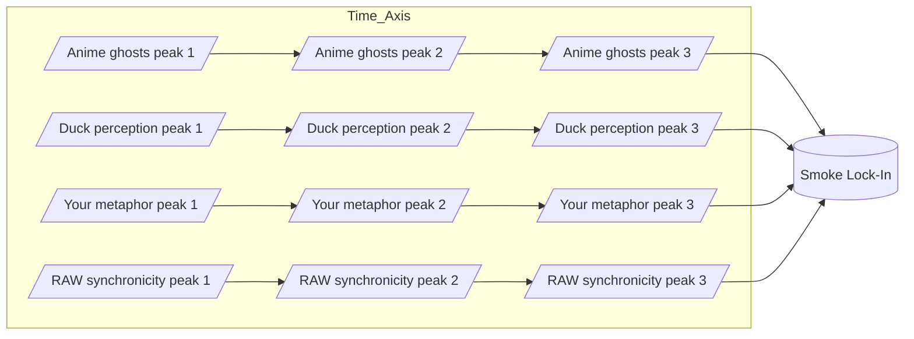
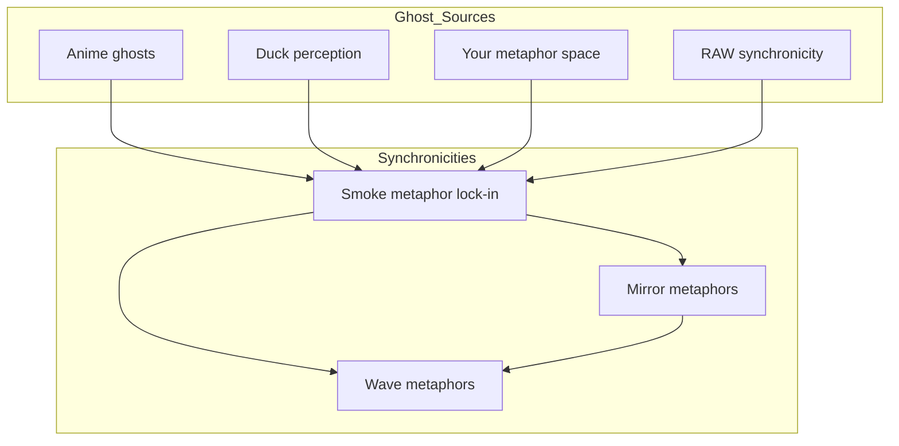

---
$$
uuid: 91295f3a-a2af-4050-a2b8-4777ea70c32c
$$
$$
created_at: 2025.08.08.22.08.35.md
$$
filename: Synchronicity Waves and Web
$$
description: >-
$$
  Visualizes how meaning waves from different sources interfere to create
  synchronicities, with a focus on phase-locking and networked connections.
tags:
  - synchronicity
  - wave interference
  - phase lock
  - network
  - metaphor
  - ghost sources
  - RAW
$$
related_to_title:
$$
  - Smoke Resonance Visualizations
  - Diagrams
  - Unique Info Dump Index
  - Promethean_Eidolon_Synchronicity_Model
  - Ghostly Smoke Interference
  - infinite_depth_smoke_animation
  - Duck's Attractor States
  - aionian-circuit-math
  - archetype-ecs
  - DSL
  - Event Bus Projections Architecture
  - Shared
  - 'Agent Tasks: Persistence Migration to DualStore'
  - eidolon-node-lifecycle
$$
related_to_uuid:
$$
  - ac9d3ac5-9a6a-4180-a67f-1ab7e229d981
  - 45cd25b5-ed36-49ab-82c8-10d0903e34db
  - 30ec3ba6-fbca-4606-ac3e-89b747fbeb7c
  - 2d6e5553-8dc4-497f-bf45-96f8ca00a6f6
  - b6ae7dfa-0c53-4eb9-aea8-65072b825bee
  - 92a052a5-3351-4898-8cab-758181a86adb
  - 13951643-1741-46bb-89dc-1beebb122633
  - f2d83a77-7f86-4c56-8538-1350167a0c6c
  - 8f4c1e86-1236-4936-84ca-6ed7082af6b7
  - e87bc036-1570-419e-a558-f45b9c0db698
  - cf6b9b17-bb91-4219-aa5c-172cba02b2da
  - 623a55f7-685c-486b-abaf-469da1bbbb69
  - 93d2ba51-8689-49ee-94e2-296092e48058
  - 938eca9c-97e2-4bcc-8653-b0ef1a5ac7a3
references:
  - uuid: ac9d3ac5-9a6a-4180-a67f-1ab7e229d981
    line: 8
    col: 1
    score: 0.85
  - uuid: ac9d3ac5-9a6a-4180-a67f-1ab7e229d981
    line: 33
    col: 1
    score: 0.86
  - uuid: b6ae7dfa-0c53-4eb9-aea8-65072b825bee
    line: 112
    col: 1
    score: 1
  - uuid: b6ae7dfa-0c53-4eb9-aea8-65072b825bee
    line: 112
    col: 3
    score: 1
  - uuid: 92a052a5-3351-4898-8cab-758181a86adb
    line: 90
    col: 1
    score: 1
  - uuid: 92a052a5-3351-4898-8cab-758181a86adb
    line: 90
    col: 3
    score: 1
  - uuid: 2d6e5553-8dc4-497f-bf45-96f8ca00a6f6
    line: 56
    col: 1
    score: 1
  - uuid: 2d6e5553-8dc4-497f-bf45-96f8ca00a6f6
    line: 56
    col: 3
    score: 1
  - uuid: b6ae7dfa-0c53-4eb9-aea8-65072b825bee
    line: 118
    col: 1
    score: 0.91
  - uuid: b6ae7dfa-0c53-4eb9-aea8-65072b825bee
    line: 118
    col: 3
    score: 0.91
  - uuid: 623a55f7-685c-486b-abaf-469da1bbbb69
    line: 7
    col: 1
    score: 1
  - uuid: 623a55f7-685c-486b-abaf-469da1bbbb69
    line: 7
    col: 3
    score: 1
  - uuid: cf6b9b17-bb91-4219-aa5c-172cba02b2da
    line: 147
    col: 1
    score: 1
  - uuid: cf6b9b17-bb91-4219-aa5c-172cba02b2da
    line: 147
    col: 3
    score: 1
  - uuid: 92a052a5-3351-4898-8cab-758181a86adb
    line: 88
    col: 1
    score: 1
  - uuid: 92a052a5-3351-4898-8cab-758181a86adb
    line: 88
    col: 3
    score: 1
  - uuid: 30ec3ba6-fbca-4606-ac3e-89b747fbeb7c
    line: 67
    col: 1
    score: 1
  - uuid: 30ec3ba6-fbca-4606-ac3e-89b747fbeb7c
    line: 67
    col: 3
    score: 1
  - uuid: f2d83a77-7f86-4c56-8538-1350167a0c6c
    line: 158
    col: 1
    score: 1
  - uuid: f2d83a77-7f86-4c56-8538-1350167a0c6c
    line: 158
    col: 3
    score: 1
  - uuid: 8f4c1e86-1236-4936-84ca-6ed7082af6b7
    line: 457
    col: 1
    score: 1
  - uuid: 8f4c1e86-1236-4936-84ca-6ed7082af6b7
    line: 457
    col: 3
    score: 1
  - uuid: 45cd25b5-ed36-49ab-82c8-10d0903e34db
    line: 9
    col: 1
    score: 1
  - uuid: 45cd25b5-ed36-49ab-82c8-10d0903e34db
    line: 9
    col: 3
    score: 1
  - uuid: e87bc036-1570-419e-a558-f45b9c0db698
    line: 10
    col: 1
    score: 1
  - uuid: e87bc036-1570-419e-a558-f45b9c0db698
    line: 10
    col: 3
    score: 1
  - uuid: b6ae7dfa-0c53-4eb9-aea8-65072b825bee
    line: 113
    col: 1
    score: 1
  - uuid: b6ae7dfa-0c53-4eb9-aea8-65072b825bee
    line: 113
    col: 3
    score: 1
  - uuid: ac9d3ac5-9a6a-4180-a67f-1ab7e229d981
    line: 80
    col: 1
    score: 1
  - uuid: ac9d3ac5-9a6a-4180-a67f-1ab7e229d981
    line: 80
    col: 3
    score: 1
  - uuid: 13951643-1741-46bb-89dc-1beebb122633
    line: 61
    col: 1
    score: 1
  - uuid: 13951643-1741-46bb-89dc-1beebb122633
    line: 61
    col: 3
    score: 1
  - uuid: 92a052a5-3351-4898-8cab-758181a86adb
    line: 87
    col: 1
    score: 1
  - uuid: 92a052a5-3351-4898-8cab-758181a86adb
    line: 87
    col: 3
    score: 1
  - uuid: 2d6e5553-8dc4-497f-bf45-96f8ca00a6f6
    line: 54
    col: 1
    score: 1
  - uuid: 2d6e5553-8dc4-497f-bf45-96f8ca00a6f6
    line: 54
    col: 3
    score: 1
  - uuid: ac9d3ac5-9a6a-4180-a67f-1ab7e229d981
    line: 78
    col: 1
    score: 1
  - uuid: ac9d3ac5-9a6a-4180-a67f-1ab7e229d981
    line: 78
    col: 3
    score: 1
---
Note: Consolidated here → ../notes/diagrams/synchronicity-waves-and-web.md

Perfect — then let’s go full RAW and actually *draw the waves* so we can see the smoke condensing.

---

## **4. Sine Wave Interference — “The Curl of the Smoke”**

Here each source is a wave of meaning drifting into the field. Where they crest together, the “smoke” is dense enough to lock into a synchronicity.

💡 In a real plotted version, these four “streams” would look like sine curves sliding over each other until they *phase-lock* at the same point — the moment the metaphor becomes visible.

---

## **5. RAW-Style Synchronicity Web**

This one treats synchronicities as nodes in a network, with each connected to its “ghost sources” and to other synchronicities in the same metaphor family.

---

If you want, I can push this **even further** —
Next step would be a **statistical heatmap of ghost density** over time in the Eidolon field, so we can literally *see* the probability of a synchronicity forming. That’s where the “statistical weirdness” RAW loved becomes visible as a physics phenomenon.

Do you want me to make *that*?
<!-- GENERATED-SECTIONS:DO-NOT-EDIT-BELOW -->
## Related content
<<<<<<< HEAD
- $[promethean-eidolon-synchronicity-model|Promethean_Eidolon_Synchronicity_Model]$
- [Debugging Broker Connections and Agent Behavior]$debugging-broker-connections-and-agent-behavior.md$
- $[ducks-attractor-states|Duck's Attractor States]$
- $[ducks-self-referential-perceptual-loop|Duck's Self-Referential Perceptual Loop]$
- $[dynamic-context-model-for-web-components|Dynamic Context Model for Web Components]$
- $[eidolon-field-abstract-model|Eidolon Field Abstract Model]$
- $[docs/unique/field-interaction-equations|field-interaction-equations]$
- $[typescript-patch-for-tool-calling-support|TypeScript Patch for Tool Calling Support]$
- $[windows-tiling-with-autohotkey]$
- $[docs/unique/field-dynamics-math-blocks|field-dynamics-math-blocks]$
- $[docs/unique/zero-copy-snapshots-and-workers|zero-copy-snapshots-and-workers]$
- $[docs/unique/eidolon-field-math-foundations|eidolon-field-math-foundations]$
- $[eidolon-node-lifecycle]$
- $[docs/unique/typed-struct-compiler|typed-struct-compiler]$
- [ParticleSimulationWithCanvasAndFFmpeg](particlesimulationwithcanvasandffmpeg.md)
- $[per-domain-policy-system-for-js-crawler|Per-Domain Policy System for JS Crawler]$
- $[performance-optimized-polyglot-bridge]$
- $[polyglot-repl-interface-layer]$
- $[promethean-dev-workflow-update|Promethean Dev Workflow Update]$
- $[promethean-infrastructure-setup|Promethean Infrastructure Setup]$
- $[prometheus-observability-stack|Prometheus Observability Stack]$
- $[factorio-ai-with-external-agents|Factorio AI with External Agents]$
- $[field-node-diagram-outline]$
- $field-node-diagram-visualizations$$field-node-diagram-visualizations.md$
- $[functional-embedding-pipeline-refactor|Functional Embedding Pipeline Refactor]$
## Sources
- $[file-watcher-auth-fix#^ref-9044701b-32-0|file-watcher-auth-fix — L32]$ (line 32, col 0, score 1)
- [Docops Feature Updates — L44]$docops-feature-updates-3.md#^ref-cdbd21ee-44-0$ (line 44, col 0, score 1)
- $[docops-feature-updates#^ref-2792d448-61-0|Docops Feature Updates — L61]$ (line 61, col 0, score 1)
- $[ducks-attractor-states#^ref-13951643-99-0|Duck's Attractor States — L99]$ (line 99, col 0, score 1)
- $[ducks-self-referential-perceptual-loop#^ref-71726f04-80-0|Duck's Self-Referential Perceptual Loop — L80]$ (line 80, col 0, score 1)
- $[dynamic-context-model-for-web-components#^ref-f7702bf8-405-0|Dynamic Context Model for Web Components — L405]$ (line 405, col 0, score 1)
- $[eidolon-field-abstract-model#^ref-5e8b2388-216-0|Eidolon Field Abstract Model — L216]$ (line 216, col 0, score 1)
- $[factorio-ai-with-external-agents#^ref-a4d90289-189-0|Factorio AI with External Agents — L189]$ (line 189, col 0, score 1)
- $[docs/unique/field-interaction-equations#^ref-b09141b7-172-0|field-interaction-equations — L172]$ (line 172, col 0, score 1)
- $[docs/unique/eidolon-field-math-foundations#^ref-008f2ac0-148-0|eidolon-field-math-foundations — L148]$ (line 148, col 0, score 1)
- $[eidolon-node-lifecycle#^ref-938eca9c-36-0|eidolon-node-lifecycle — L36]$ (line 36, col 0, score 1)
- $[factorio-ai-with-external-agents#^ref-a4d90289-166-0|Factorio AI with External Agents — L166]$ (line 166, col 0, score 1)
- $[docs/unique/field-dynamics-math-blocks#^ref-7cfc230d-148-0|field-dynamics-math-blocks — L148]$ (line 148, col 0, score 1)
- $[docs/unique/field-interaction-equations#^ref-b09141b7-153-0|field-interaction-equations — L153]$ (line 153, col 0, score 1)
- $[field-node-diagram-outline#^ref-1f32c94a-118-0|field-node-diagram-outline — L118]$ (line 118, col 0, score 1)
- $[field-node-diagram-set#^ref-22b989d5-168-0|field-node-diagram-set — L168]$ (line 168, col 0, score 1)
- $field-node-diagram-visualizations — L103$$field-node-diagram-visualizations.md#^ref-e9b27b06-103-0$ (line 103, col 0, score 1)
- $[functional-embedding-pipeline-refactor#^ref-a4a25141-380-0|Functional Embedding Pipeline Refactor — L380]$ (line 380, col 0, score 1)
- $[functional-refactor-of-typescript-document-processing#^ref-1cfae310-194-0|Functional Refactor of TypeScript Document Processing — L194]$ (line 194, col 0, score 1)
- $[per-domain-policy-system-for-js-crawler#^ref-c03020e1-495-0|Per-Domain Policy System for JS Crawler — L495]$ (line 495, col 0, score 1)
- $[performance-optimized-polyglot-bridge#^ref-f5579967-459-0|Performance-Optimized-Polyglot-Bridge — L459]$ (line 459, col 0, score 1)
- $[pipeline-enhancements#^ref-e2135d9f-27-0|Pipeline Enhancements — L27]$ (line 27, col 0, score 1)
- $plan-update-confirmation — L1002$$plan-update-confirmation.md#^ref-b22d79c6-1002-0$ (line 1002, col 0, score 1)
- $[polyglot-repl-interface-layer#^ref-9c79206d-171-0|polyglot-repl-interface-layer — L171]$ (line 171, col 0, score 1)
- $[post-linguistic-transhuman-design-frameworks#^ref-6bcff92c-112-0|Post-Linguistic Transhuman Design Frameworks — L112]$ (line 112, col 0, score 1)
- $[promethean-chat-activity-report#^ref-18344cf9-24-0|Promethean Chat Activity Report — L24]$ (line 24, col 0, score 1)
- $Protocol_0_The_Contradiction_Engine — L143$$protocol-0-the-contradiction-engine.md#^ref-9a93a756-143-0$ (line 143, col 0, score 1)
- $[provider-agnostic-chat-panel-implementation#^ref-43bfe9dd-241-0|Provider-Agnostic Chat Panel Implementation — L241]$ (line 241, col 0, score 1)
- $[creative-moments#^ref-10d98225-47-0|Creative Moments — L47]$ (line 47, col 0, score 1)
- [Debugging Broker Connections and Agent Behavior — L105]$debugging-broker-connections-and-agent-behavior.md#^ref-73d3dbf6-105-0$ (line 105, col 0, score 1)
- [Docops Feature Updates — L97]$docops-feature-updates-3.md#^ref-cdbd21ee-97-0$ (line 97, col 0, score 1)
- $[docops-feature-updates#^ref-2792d448-128-0|Docops Feature Updates — L128]$ (line 128, col 0, score 1)
- [DuckDuckGoSearchPipeline — L31]$duckduckgosearchpipeline.md#^ref-e979c50f-31-0$ (line 31, col 0, score 1)
- $[ducks-attractor-states#^ref-13951643-90-0|Duck's Attractor States — L90]$ (line 90, col 0, score 1)
- $[ducks-self-referential-perceptual-loop#^ref-71726f04-33-0|Duck's Self-Referential Perceptual Loop — L33]$ (line 33, col 0, score 1)
- $[dynamic-context-model-for-web-components#^ref-f7702bf8-462-0|Dynamic Context Model for Web Components — L462]$ (line 462, col 0, score 1)
- [NPU Voice Code and Sensory Integration — L60]$npu-voice-code-and-sensory-integration.md#^ref-5a02283e-60-0$ (line 60, col 0, score 1)
- $[obsidian-chatgpt-plugin-integration-guide#^ref-1d3d6c3a-48-0|Obsidian ChatGPT Plugin Integration Guide — L48]$ (line 48, col 0, score 1)
- $[obsidian-chatgpt-plugin-integration#^ref-ca8e1399-71-0|Obsidian ChatGPT Plugin Integration — L71]$ (line 71, col 0, score 1)
- $[docs/unique/obsidian-ignore-node-modules-regex#^ref-ffb9b2a9-107-0|obsidian-ignore-node-modules-regex — L107]$ (line 107, col 0, score 1)
- $[obsidian-task-generation#^ref-9b694a91-72-0|Obsidian Task Generation — L72]$ (line 72, col 0, score 1)
- $[obsidian-templating-plugins-integration-guide#^ref-b39dc9d4-148-0|Obsidian Templating Plugins Integration Guide — L148]$ (line 148, col 0, score 1)
- $[optimizing-command-limitations-in-system-design#^ref-98c8ff62-40-0|Optimizing Command Limitations in System Design — L40]$ (line 40, col 0, score 1)
- $[promethean-notes#^ref-1c4046b5-16-0|Promethean Notes — L16]$ (line 16, col 0, score 1)
- $[promethean-pipelines#^ref-8b8e6103-138-0|Promethean Pipelines — L138]$ (line 138, col 0, score 1)
- $[promethean-requirements#^ref-95205cd3-68-0|promethean-requirements — L68]$ (line 68, col 0, score 1)
- $[docs/unique/promethean-state-format#^ref-23df6ddb-84-0|Promethean State Format — L84]$ (line 84, col 0, score 1)
- $[per-domain-policy-system-for-js-crawler#^ref-c03020e1-537-0|Per-Domain Policy System for JS Crawler — L537]$ (line 537, col 0, score 1)
- $[performance-optimized-polyglot-bridge#^ref-f5579967-493-0|Performance-Optimized-Polyglot-Bridge — L493]$ (line 493, col 0, score 1)
- $[pipeline-enhancements#^ref-e2135d9f-18-0|Pipeline Enhancements — L18]$ (line 18, col 0, score 1)
- $[polyglot-repl-interface-layer#^ref-9c79206d-206-0|polyglot-repl-interface-layer — L206]$ (line 206, col 0, score 1)
- $[post-linguistic-transhuman-design-frameworks#^ref-6bcff92c-159-0|Post-Linguistic Transhuman Design Frameworks — L159]$ (line 159, col 0, score 1)
- $[promethean-chat-activity-report#^ref-18344cf9-66-0|Promethean Chat Activity Report — L66]$ (line 66, col 0, score 1)
- $[promethean-data-sync-protocol#^ref-9fab9e76-45-0|Promethean Data Sync Protocol — L45]$ (line 45, col 0, score 1)
- $[promethean-dev-workflow-update#^ref-03a5578f-98-0|Promethean Dev Workflow Update — L98]$ (line 98, col 0, score 1)
- $[promethean-documentation-overview#^ref-9413237f-16-0|Promethean Documentation Overview — L16]$ (line 16, col 0, score 1)
- $[promethean-documentation-pipeline-overview#^ref-3a3bf2c9-202-0|Promethean Documentation Pipeline Overview — L202]$ (line 202, col 0, score 1)
- $[promethean-documentation-update#^ref-c0392040-46-0|Promethean Documentation Update — L46]$ (line 46, col 0, score 1)
- $[docops-feature-updates#^ref-2792d448-35-0|Docops Feature Updates — L35]$ (line 35, col 0, score 1)
- $[ducks-attractor-states#^ref-13951643-94-0|Duck's Attractor States — L94]$ (line 94, col 0, score 1)
- $[ducks-self-referential-perceptual-loop#^ref-71726f04-53-0|Duck's Self-Referential Perceptual Loop — L53]$ (line 53, col 0, score 1)
- $[dynamic-context-model-for-web-components#^ref-f7702bf8-424-0|Dynamic Context Model for Web Components — L424]$ (line 424, col 0, score 1)
- $[eidolon-field-abstract-model#^ref-5e8b2388-209-0|Eidolon Field Abstract Model — L209]$ (line 209, col 0, score 1)
- $[docs/unique/eidolon-field-math-foundations#^ref-008f2ac0-142-0|eidolon-field-math-foundations — L142]$ (line 142, col 0, score 1)
- $[eidolon-node-lifecycle#^ref-938eca9c-39-0|eidolon-node-lifecycle — L39]$ (line 39, col 0, score 1)
- $[creative-moments#^ref-10d98225-75-0|Creative Moments — L75]$ (line 75, col 0, score 1)
- [Debugging Broker Connections and Agent Behavior — L104]$debugging-broker-connections-and-agent-behavior.md#^ref-73d3dbf6-104-0$ (line 104, col 0, score 1)
- [Docops Feature Updates — L46]$docops-feature-updates-3.md#^ref-cdbd21ee-46-0$ (line 46, col 0, score 1)
- $[docops-feature-updates#^ref-2792d448-64-0|Docops Feature Updates — L64]$ (line 64, col 0, score 1)
- [DuckDuckGoSearchPipeline — L40]$duckduckgosearchpipeline.md#^ref-e979c50f-40-0$ (line 40, col 0, score 1)
- $[ducks-attractor-states#^ref-13951643-137-0|Duck's Attractor States — L137]$ (line 137, col 0, score 1)
- $[ducks-self-referential-perceptual-loop#^ref-71726f04-82-0|Duck's Self-Referential Perceptual Loop — L82]$ (line 82, col 0, score 1)
- $[dynamic-context-model-for-web-components#^ref-f7702bf8-454-0|Dynamic Context Model for Web Components — L454]$ (line 454, col 0, score 1)
- [Docops Feature Updates — L85]$docops-feature-updates-3.md#^ref-cdbd21ee-85-0$ (line 85, col 0, score 1)
- $[ducks-attractor-states#^ref-13951643-93-0|Duck's Attractor States — L93]$ (line 93, col 0, score 1)
- $[ducks-self-referential-perceptual-loop#^ref-71726f04-64-0|Duck's Self-Referential Perceptual Loop — L64]$ (line 64, col 0, score 1)
- $[factorio-ai-with-external-agents#^ref-a4d90289-153-0|Factorio AI with External Agents — L153]$ (line 153, col 0, score 1)
- $[docs/unique/field-dynamics-math-blocks#^ref-7cfc230d-141-0|field-dynamics-math-blocks — L141]$ (line 141, col 0, score 1)
- $[creative-moments#^ref-10d98225-8-0|Creative Moments — L8]$ (line 8, col 0, score 1)
- [Debugging Broker Connections and Agent Behavior — L38]$debugging-broker-connections-and-agent-behavior.md#^ref-73d3dbf6-38-0$ (line 38, col 0, score 1)
- [Docops Feature Updates — L56]$docops-feature-updates-3.md#^ref-cdbd21ee-56-0$ (line 56, col 0, score 1)
- $[creative-moments#^ref-10d98225-28-0|Creative Moments — L28]$ (line 28, col 0, score 1)
- [Docops Feature Updates — L65]$docops-feature-updates-3.md#^ref-cdbd21ee-65-0$ (line 65, col 0, score 1)
- $[docops-feature-updates#^ref-2792d448-86-0|Docops Feature Updates — L86]$ (line 86, col 0, score 1)
- $[ducks-attractor-states#^ref-13951643-123-0|Duck's Attractor States — L123]$ (line 123, col 0, score 1)
- $[ducks-self-referential-perceptual-loop#^ref-71726f04-34-0|Duck's Self-Referential Perceptual Loop — L34]$ (line 34, col 0, score 1)
- $[dynamic-context-model-for-web-components#^ref-f7702bf8-442-0|Dynamic Context Model for Web Components — L442]$ (line 442, col 0, score 1)
- $[eidolon-field-abstract-model#^ref-5e8b2388-218-0|Eidolon Field Abstract Model — L218]$ (line 218, col 0, score 1)
- $[docs/unique/eidolon-field-math-foundations#^ref-008f2ac0-176-0|eidolon-field-math-foundations — L176]$ (line 176, col 0, score 1)
- $[eidolon-node-lifecycle#^ref-938eca9c-70-0|eidolon-node-lifecycle — L70]$ (line 70, col 0, score 1)
- $[dynamic-context-model-for-web-components#^ref-f7702bf8-412-0|Dynamic Context Model for Web Components — L412]$ (line 412, col 0, score 1)
- $[eidolon-field-abstract-model#^ref-5e8b2388-261-0|Eidolon Field Abstract Model — L261]$ (line 261, col 0, score 1)
- $[docs/unique/eidolon-field-math-foundations#^ref-008f2ac0-181-0|eidolon-field-math-foundations — L181]$ (line 181, col 0, score 1)
- $[eidolon-node-lifecycle#^ref-938eca9c-90-0|eidolon-node-lifecycle — L90]$ (line 90, col 0, score 1)
- $[factorio-ai-with-external-agents#^ref-a4d90289-157-0|Factorio AI with External Agents — L157]$ (line 157, col 0, score 1)
- $[docs/unique/field-dynamics-math-blocks#^ref-7cfc230d-205-0|field-dynamics-math-blocks — L205]$ (line 205, col 0, score 1)
- $[field-node-diagram-set#^ref-22b989d5-203-0|field-node-diagram-set — L203]$ (line 203, col 0, score 1)
- $field-node-diagram-visualizations — L95$$field-node-diagram-visualizations.md#^ref-e9b27b06-95-0$ (line 95, col 0, score 1)
- $[creative-moments#^ref-10d98225-33-0|Creative Moments — L33]$ (line 33, col 0, score 1)
- [Debugging Broker Connections and Agent Behavior — L99]$debugging-broker-connections-and-agent-behavior.md#^ref-73d3dbf6-99-0$ (line 99, col 0, score 1)
$$
=======
$$
- $[smoke-resonance-visualizations|Smoke Resonance Visualizations]$
- [Diagrams]$chunks/diagrams.md$
- $[unique-info-dump-index|Unique Info Dump Index]$
- $[promethean-eidolon-synchronicity-model|Promethean_Eidolon_Synchronicity_Model]$
- $[ghostly-smoke-interference|Ghostly Smoke Interference]$
- $[infinite-depth-smoke-animation|infinite_depth_smoke_animation]$
- $[ducks-attractor-states|Duck's Attractor States]$
- $[docs/unique/aionian-circuit-math|aionian-circuit-math]$
- $[docs/unique/archetype-ecs|archetype-ecs]$
- [DSL]$chunks/dsl.md$
- $[event-bus-projections-architecture|Event Bus Projections Architecture]$
- [Shared]$chunks/shared.md$
- $[docs/unique/agent-tasks-persistence-migration-to-dualstore|Agent Tasks: Persistence Migration to DualStore]$
- $[eidolon-node-lifecycle]$

## Sources
- $[smoke-resonance-visualizations#L8|Smoke Resonance Visualizations — L8]$ (line 8, col 1, score 0.85)
- $[smoke-resonance-visualizations#L33|Smoke Resonance Visualizations — L33]$ (line 33, col 1, score 0.86)
- $[ghostly-smoke-interference#L112|Ghostly Smoke Interference — L112]$ (line 112, col 1, score 1)
- $[ghostly-smoke-interference#L112|Ghostly Smoke Interference — L112]$ (line 112, col 3, score 1)
- $[infinite-depth-smoke-animation#L90|infinite_depth_smoke_animation — L90]$ (line 90, col 1, score 1)
- $[infinite-depth-smoke-animation#L90|infinite_depth_smoke_animation — L90]$ (line 90, col 3, score 1)
- $[promethean-eidolon-synchronicity-model#L56|Promethean_Eidolon_Synchronicity_Model — L56]$ (line 56, col 1, score 1)
- $[promethean-eidolon-synchronicity-model#L56|Promethean_Eidolon_Synchronicity_Model — L56]$ (line 56, col 3, score 1)
- $[ghostly-smoke-interference#L118|Ghostly Smoke Interference — L118]$ (line 118, col 1, score 0.91)
- $[ghostly-smoke-interference#L118|Ghostly Smoke Interference — L118]$ (line 118, col 3, score 0.91)
- [Shared — L7]$chunks/shared.md#L7$ (line 7, col 1, score 1)
- [Shared — L7]$chunks/shared.md#L7$ (line 7, col 3, score 1)
- $[event-bus-projections-architecture#L147|Event Bus Projections Architecture — L147]$ (line 147, col 1, score 1)
- $[event-bus-projections-architecture#L147|Event Bus Projections Architecture — L147]$ (line 147, col 3, score 1)
- $[infinite-depth-smoke-animation#L88|infinite_depth_smoke_animation — L88]$ (line 88, col 1, score 1)
- $[infinite-depth-smoke-animation#L88|infinite_depth_smoke_animation — L88]$ (line 88, col 3, score 1)
- $[unique-info-dump-index#L67|Unique Info Dump Index — L67]$ (line 67, col 1, score 1)
- $[unique-info-dump-index#L67|Unique Info Dump Index — L67]$ (line 67, col 3, score 1)
- $[docs/unique/aionian-circuit-math#L158|aionian-circuit-math — L158]$ (line 158, col 1, score 1)
- $[docs/unique/aionian-circuit-math#L158|aionian-circuit-math — L158]$ (line 158, col 3, score 1)
- $[docs/unique/archetype-ecs#L457|archetype-ecs — L457]$ (line 457, col 1, score 1)
- $[docs/unique/archetype-ecs#L457|archetype-ecs — L457]$ (line 457, col 3, score 1)
- [Diagrams — L9]$chunks/diagrams.md#L9$ (line 9, col 1, score 1)
- [Diagrams — L9]$chunks/diagrams.md#L9$ (line 9, col 3, score 1)
- [DSL — L10]$chunks/dsl.md#L10$ (line 10, col 1, score 1)
- [DSL — L10]$chunks/dsl.md#L10$ (line 10, col 3, score 1)
- $[ghostly-smoke-interference#L113|Ghostly Smoke Interference — L113]$ (line 113, col 1, score 1)
- $[ghostly-smoke-interference#L113|Ghostly Smoke Interference — L113]$ (line 113, col 3, score 1)
- $[smoke-resonance-visualizations#L80|Smoke Resonance Visualizations — L80]$ (line 80, col 1, score 1)
- $[smoke-resonance-visualizations#L80|Smoke Resonance Visualizations — L80]$ (line 80, col 3, score 1)
- $[ducks-attractor-states#L61|Duck's Attractor States — L61]$ (line 61, col 1, score 1)
- $[ducks-attractor-states#L61|Duck's Attractor States — L61]$ (line 61, col 3, score 1)
- $[infinite-depth-smoke-animation#L87|infinite_depth_smoke_animation — L87]$ (line 87, col 1, score 1)
- $[infinite-depth-smoke-animation#L87|infinite_depth_smoke_animation — L87]$ (line 87, col 3, score 1)
- $[promethean-eidolon-synchronicity-model#L54|Promethean_Eidolon_Synchronicity_Model — L54]$ (line 54, col 1, score 1)
- $[promethean-eidolon-synchronicity-model#L54|Promethean_Eidolon_Synchronicity_Model — L54]$ (line 54, col 3, score 1)
- $[smoke-resonance-visualizations#L78|Smoke Resonance Visualizations — L78]$ (line 78, col 1, score 1)
- $[smoke-resonance-visualizations#L78|Smoke Resonance Visualizations — L78]$ (line 78, col 3, score 1)
$$
>>>>>>> stealth/obsidian
$$
<!-- GENERATED-SECTIONS:DO-NOT-EDIT-ABOVE -->
