---
$$
uuid: d771154e-a7ef-44ca-b69c-a1626cf94fbf
$$
$$
created_at: 2025.08.02.14.08.40.md
$$
filename: Vectorial Exception Descent
$$
description: >-
$$
  A physics-based cognition model where semantic errors cascade downward to
  trigger physiological responses through layered feedback mechanisms.
tags:
  - error
  - cognition
  - physiology
  - feedback
  - layered
  - semantic
  - vector
  - descent
  - eidolon
  - resilience
$$
related_to_title:
$$
  - Eidolon Field Abstract Model
  - Exception Layer Analysis
  - 2d-sandbox-field
  - layer-1-uptime-diagrams
  - field-node-diagram-outline
  - field-dynamics-math-blocks
  - EidolonField
  - Ice Box Reorganization
  - Voice Access Layer Design
  - Migrate to Provider-Tenant Architecture
  - Local-First Intention→Code Loop with Free Models
  - Event Bus MVP
  - eidolon-node-lifecycle
  - eidolon-field-math-foundations
  - i3-bluetooth-setup
  - aionian-circuit-math
  - Chroma Toolkit Consolidation Plan
  - 'Agent Tasks: Persistence Migration to DualStore'
  - Math Fundamentals
  - Cross-Target Macro System in Sibilant
  - Dynamic Context Model for Web Components
  - Universal Lisp Interface
  - Shared Package Structure
$$
related_to_uuid:
$$
  - 5e8b2388-022b-46cf-952c-36ae9b8f0037
  - 21d5cc09-b005-4ede-8f69-00b4b0794540
  - c710dc93-9fec-471b-bdee-bedbd360c67f
  - 4127189a-e0ab-436f-8571-cc852b8e9add
  - 1f32c94a-4da4-4266-8ac0-6c282cfb401f
  - 7cfc230d-8ec2-4cdb-b931-8aec26de2a00
  - 49d1e1e5-5d13-4955-8f6f-7676434ec462
  - 291c7d91-da8c-486c-9bc0-bd2254536e2d
  - 543ed9b3-b7af-4ce1-b455-f7ba71a0bbc8
  - 54382370-1931-4a19-a634-46735708a9ea
  - 871490c7-a050-429b-88b2-55dfeaa1f8d5
  - 534fe91d-e87d-4cc7-b0e7-8b6833353d9b
  - 938eca9c-97e2-4bcc-8653-b0ef1a5ac7a3
  - 008f2ac0-bfaa-4d52-9826-2d5e86c0059f
  - 5e408692-0e74-400e-a617-84247c7353ad
  - f2d83a77-7f86-4c56-8538-1350167a0c6c
  - 5020e892-8f18-443a-b707-6d0f3efcfe22
  - 93d2ba51-8689-49ee-94e2-296092e48058
  - c6e87433-ec5d-4ded-bb1a-fb8734a3cfd9
  - 5f210ca2-54e9-445b-afe4-fb340d4992c5
  - f7702bf8-f7db-473c-9a5b-8dbf66ad3b9e
  - b01856b4-999f-418d-8009-ade49b00eb0f
  - 66a72fc3-4153-41fc-84bd-d6164967a6ff
references:
  - uuid: 543ed9b3-b7af-4ce1-b455-f7ba71a0bbc8
    line: 89
    col: 4
    score: 0.87
  - uuid: 543ed9b3-b7af-4ce1-b455-f7ba71a0bbc8
    line: 89
    col: 6
    score: 0.87
  - uuid: 543ed9b3-b7af-4ce1-b455-f7ba71a0bbc8
    line: 95
    col: 4
    score: 0.87
  - uuid: 543ed9b3-b7af-4ce1-b455-f7ba71a0bbc8
    line: 95
    col: 6
    score: 0.87
  - uuid: 543ed9b3-b7af-4ce1-b455-f7ba71a0bbc8
    line: 108
    col: 4
    score: 0.87
  - uuid: 543ed9b3-b7af-4ce1-b455-f7ba71a0bbc8
    line: 108
    col: 6
    score: 0.87
  - uuid: 543ed9b3-b7af-4ce1-b455-f7ba71a0bbc8
    line: 114
    col: 4
    score: 0.87
  - uuid: 543ed9b3-b7af-4ce1-b455-f7ba71a0bbc8
    line: 114
    col: 6
    score: 0.87
  - uuid: 21d5cc09-b005-4ede-8f69-00b4b0794540
    line: 134
    col: 1
    score: 1
  - uuid: 5e8b2388-022b-46cf-952c-36ae9b8f0037
    line: 176
    col: 1
    score: 1
  - uuid: c710dc93-9fec-471b-bdee-bedbd360c67f
    line: 180
    col: 1
    score: 1
  - uuid: 7cfc230d-8ec2-4cdb-b931-8aec26de2a00
    line: 117
    col: 1
    score: 0.96
  - uuid: 1f32c94a-4da4-4266-8ac0-6c282cfb401f
    line: 82
    col: 1
    score: 0.96
  - uuid: 4127189a-e0ab-436f-8571-cc852b8e9add
    line: 140
    col: 1
    score: 0.96
  - uuid: 49d1e1e5-5d13-4955-8f6f-7676434ec462
    line: 228
    col: 1
    score: 0.95
  - uuid: 291c7d91-da8c-486c-9bc0-bd2254536e2d
    line: 55
    col: 1
    score: 0.95
  - uuid: c710dc93-9fec-471b-bdee-bedbd360c67f
    line: 193
    col: 1
    score: 1
  - uuid: c710dc93-9fec-471b-bdee-bedbd360c67f
    line: 193
    col: 3
    score: 1
  - uuid: 49d1e1e5-5d13-4955-8f6f-7676434ec462
    line: 243
    col: 1
    score: 1
  - uuid: 49d1e1e5-5d13-4955-8f6f-7676434ec462
    line: 243
    col: 3
    score: 1
  - uuid: 21d5cc09-b005-4ede-8f69-00b4b0794540
    line: 148
    col: 1
    score: 1
  - uuid: 21d5cc09-b005-4ede-8f69-00b4b0794540
    line: 148
    col: 3
    score: 1
  - uuid: 7cfc230d-8ec2-4cdb-b931-8aec26de2a00
    line: 145
    col: 1
    score: 1
  - uuid: 7cfc230d-8ec2-4cdb-b931-8aec26de2a00
    line: 145
    col: 3
    score: 1
  - uuid: c710dc93-9fec-471b-bdee-bedbd360c67f
    line: 194
    col: 1
    score: 1
  - uuid: c710dc93-9fec-471b-bdee-bedbd360c67f
    line: 194
    col: 3
    score: 1
  - uuid: 5e8b2388-022b-46cf-952c-36ae9b8f0037
    line: 193
    col: 1
    score: 1
  - uuid: 5e8b2388-022b-46cf-952c-36ae9b8f0037
    line: 193
    col: 3
    score: 1
  - uuid: 49d1e1e5-5d13-4955-8f6f-7676434ec462
    line: 245
    col: 1
    score: 1
  - uuid: 49d1e1e5-5d13-4955-8f6f-7676434ec462
    line: 245
    col: 3
    score: 1
  - uuid: 7cfc230d-8ec2-4cdb-b931-8aec26de2a00
    line: 147
    col: 1
    score: 1
  - uuid: 7cfc230d-8ec2-4cdb-b931-8aec26de2a00
    line: 147
    col: 3
    score: 1
  - uuid: 5e8b2388-022b-46cf-952c-36ae9b8f0037
    line: 191
    col: 1
    score: 1
  - uuid: 5e8b2388-022b-46cf-952c-36ae9b8f0037
    line: 191
    col: 3
    score: 1
  - uuid: 49d1e1e5-5d13-4955-8f6f-7676434ec462
    line: 242
    col: 1
    score: 1
  - uuid: 49d1e1e5-5d13-4955-8f6f-7676434ec462
    line: 242
    col: 3
    score: 1
  - uuid: 21d5cc09-b005-4ede-8f69-00b4b0794540
    line: 149
    col: 1
    score: 1
  - uuid: 21d5cc09-b005-4ede-8f69-00b4b0794540
    line: 149
    col: 3
    score: 1
  - uuid: 7cfc230d-8ec2-4cdb-b931-8aec26de2a00
    line: 144
    col: 1
    score: 1
  - uuid: 7cfc230d-8ec2-4cdb-b931-8aec26de2a00
    line: 144
    col: 3
    score: 1
  - uuid: c710dc93-9fec-471b-bdee-bedbd360c67f
    line: 199
    col: 1
    score: 1
  - uuid: c710dc93-9fec-471b-bdee-bedbd360c67f
    line: 199
    col: 3
    score: 1
  - uuid: 5e8b2388-022b-46cf-952c-36ae9b8f0037
    line: 196
    col: 1
    score: 1
  - uuid: 5e8b2388-022b-46cf-952c-36ae9b8f0037
    line: 196
    col: 3
    score: 1
  - uuid: 938eca9c-97e2-4bcc-8653-b0ef1a5ac7a3
    line: 35
    col: 1
    score: 1
  - uuid: 938eca9c-97e2-4bcc-8653-b0ef1a5ac7a3
    line: 35
    col: 3
    score: 1
  - uuid: 49d1e1e5-5d13-4955-8f6f-7676434ec462
    line: 249
    col: 1
    score: 1
  - uuid: 49d1e1e5-5d13-4955-8f6f-7676434ec462
    line: 249
    col: 3
    score: 1
  - uuid: c710dc93-9fec-471b-bdee-bedbd360c67f
    line: 198
    col: 1
    score: 1
  - uuid: c710dc93-9fec-471b-bdee-bedbd360c67f
    line: 198
    col: 3
    score: 1
  - uuid: 5e8b2388-022b-46cf-952c-36ae9b8f0037
    line: 195
    col: 1
    score: 1
  - uuid: 5e8b2388-022b-46cf-952c-36ae9b8f0037
    line: 195
    col: 3
    score: 1
  - uuid: 008f2ac0-bfaa-4d52-9826-2d5e86c0059f
    line: 137
    col: 1
    score: 1
  - uuid: 008f2ac0-bfaa-4d52-9826-2d5e86c0059f
    line: 137
    col: 3
    score: 1
  - uuid: 938eca9c-97e2-4bcc-8653-b0ef1a5ac7a3
    line: 32
    col: 1
    score: 1
  - uuid: 938eca9c-97e2-4bcc-8653-b0ef1a5ac7a3
    line: 32
    col: 3
    score: 1
  - uuid: c710dc93-9fec-471b-bdee-bedbd360c67f
    line: 197
    col: 1
    score: 1
  - uuid: c710dc93-9fec-471b-bdee-bedbd360c67f
    line: 197
    col: 3
    score: 1
  - uuid: f2d83a77-7f86-4c56-8538-1350167a0c6c
    line: 154
    col: 1
    score: 1
  - uuid: f2d83a77-7f86-4c56-8538-1350167a0c6c
    line: 154
    col: 3
    score: 1
  - uuid: c6e87433-ec5d-4ded-bb1a-fb8734a3cfd9
    line: 13
    col: 1
    score: 1
  - uuid: c6e87433-ec5d-4ded-bb1a-fb8734a3cfd9
    line: 13
    col: 3
    score: 1
  - uuid: 5e8b2388-022b-46cf-952c-36ae9b8f0037
    line: 194
    col: 1
    score: 1
  - uuid: 5e8b2388-022b-46cf-952c-36ae9b8f0037
    line: 194
    col: 3
    score: 1
  - uuid: c710dc93-9fec-471b-bdee-bedbd360c67f
    line: 196
    col: 1
    score: 1
  - uuid: c710dc93-9fec-471b-bdee-bedbd360c67f
    line: 196
    col: 3
    score: 1
  - uuid: 5e8b2388-022b-46cf-952c-36ae9b8f0037
    line: 197
    col: 1
    score: 1
  - uuid: 5e8b2388-022b-46cf-952c-36ae9b8f0037
    line: 197
    col: 3
    score: 1
  - uuid: 21d5cc09-b005-4ede-8f69-00b4b0794540
    line: 153
    col: 1
    score: 1
  - uuid: 21d5cc09-b005-4ede-8f69-00b4b0794540
    line: 153
    col: 3
    score: 1
  - uuid: 7cfc230d-8ec2-4cdb-b931-8aec26de2a00
    line: 148
    col: 1
    score: 1
  - uuid: 7cfc230d-8ec2-4cdb-b931-8aec26de2a00
    line: 148
    col: 3
    score: 1
  - uuid: c710dc93-9fec-471b-bdee-bedbd360c67f
    line: 200
    col: 1
    score: 1
  - uuid: c710dc93-9fec-471b-bdee-bedbd360c67f
    line: 200
    col: 3
    score: 1
  - uuid: 5e8b2388-022b-46cf-952c-36ae9b8f0037
    line: 198
    col: 1
    score: 1
  - uuid: 5e8b2388-022b-46cf-952c-36ae9b8f0037
    line: 198
    col: 3
    score: 1
  - uuid: 49d1e1e5-5d13-4955-8f6f-7676434ec462
    line: 241
    col: 1
    score: 1
  - uuid: 49d1e1e5-5d13-4955-8f6f-7676434ec462
    line: 241
    col: 3
    score: 1
  - uuid: 21d5cc09-b005-4ede-8f69-00b4b0794540
    line: 154
    col: 1
    score: 1
  - uuid: 21d5cc09-b005-4ede-8f69-00b4b0794540
    line: 154
    col: 3
    score: 1
  - uuid: 534fe91d-e87d-4cc7-b0e7-8b6833353d9b
    line: 552
    col: 1
    score: 1
  - uuid: 534fe91d-e87d-4cc7-b0e7-8b6833353d9b
    line: 552
    col: 3
    score: 1
  - uuid: 5e408692-0e74-400e-a617-84247c7353ad
    line: 104
    col: 1
    score: 1
  - uuid: 5e408692-0e74-400e-a617-84247c7353ad
    line: 104
    col: 3
    score: 1
  - uuid: 871490c7-a050-429b-88b2-55dfeaa1f8d5
    line: 144
    col: 1
    score: 1
  - uuid: 871490c7-a050-429b-88b2-55dfeaa1f8d5
    line: 144
    col: 3
    score: 1
  - uuid: 54382370-1931-4a19-a634-46735708a9ea
    line: 273
    col: 1
    score: 1
  - uuid: 54382370-1931-4a19-a634-46735708a9ea
    line: 273
    col: 3
    score: 1
  - uuid: 93d2ba51-8689-49ee-94e2-296092e48058
    line: 131
    col: 1
    score: 1
  - uuid: 93d2ba51-8689-49ee-94e2-296092e48058
    line: 131
    col: 3
    score: 1
  - uuid: 5020e892-8f18-443a-b707-6d0f3efcfe22
    line: 169
    col: 1
    score: 1
  - uuid: 5020e892-8f18-443a-b707-6d0f3efcfe22
    line: 169
    col: 3
    score: 1
  - uuid: 5f210ca2-54e9-445b-afe4-fb340d4992c5
    line: 175
    col: 1
    score: 1
  - uuid: 5f210ca2-54e9-445b-afe4-fb340d4992c5
    line: 175
    col: 3
    score: 1
  - uuid: f7702bf8-f7db-473c-9a5b-8dbf66ad3b9e
    line: 392
    col: 1
    score: 1
  - uuid: f7702bf8-f7db-473c-9a5b-8dbf66ad3b9e
    line: 392
    col: 3
    score: 1
  - uuid: b01856b4-999f-418d-8009-ade49b00eb0f
    line: 212
    col: 1
    score: 0.99
  - uuid: b01856b4-999f-418d-8009-ade49b00eb0f
    line: 212
    col: 3
    score: 0.99
  - uuid: b01856b4-999f-418d-8009-ade49b00eb0f
    line: 213
    col: 1
    score: 0.98
  - uuid: b01856b4-999f-418d-8009-ade49b00eb0f
    line: 213
    col: 3
    score: 0.98
  - uuid: 54382370-1931-4a19-a634-46735708a9ea
    line: 308
    col: 1
    score: 0.98
  - uuid: 54382370-1931-4a19-a634-46735708a9ea
    line: 308
    col: 3
    score: 0.98
  - uuid: 66a72fc3-4153-41fc-84bd-d6164967a6ff
    line: 175
    col: 1
    score: 0.97
  - uuid: 66a72fc3-4153-41fc-84bd-d6164967a6ff
    line: 175
    col: 3
    score: 0.97
  - uuid: c710dc93-9fec-471b-bdee-bedbd360c67f
    line: 209
    col: 1
    score: 1
  - uuid: c710dc93-9fec-471b-bdee-bedbd360c67f
    line: 209
    col: 3
    score: 1
  - uuid: 5e8b2388-022b-46cf-952c-36ae9b8f0037
    line: 204
    col: 1
    score: 1
  - uuid: 5e8b2388-022b-46cf-952c-36ae9b8f0037
    line: 204
    col: 3
    score: 1
  - uuid: 7cfc230d-8ec2-4cdb-b931-8aec26de2a00
    line: 169
    col: 1
    score: 0.98
  - uuid: 7cfc230d-8ec2-4cdb-b931-8aec26de2a00
    line: 169
    col: 3
    score: 0.98
  - uuid: 1f32c94a-4da4-4266-8ac0-6c282cfb401f
    line: 129
    col: 1
    score: 0.98
  - uuid: 1f32c94a-4da4-4266-8ac0-6c282cfb401f
    line: 129
    col: 3
    score: 0.98
  - uuid: c710dc93-9fec-471b-bdee-bedbd360c67f
    line: 211
    col: 1
    score: 1
  - uuid: c710dc93-9fec-471b-bdee-bedbd360c67f
    line: 211
    col: 3
    score: 1
  - uuid: 21d5cc09-b005-4ede-8f69-00b4b0794540
    line: 161
    col: 1
    score: 1
  - uuid: 21d5cc09-b005-4ede-8f69-00b4b0794540
    line: 161
    col: 3
    score: 1
  - uuid: 7cfc230d-8ec2-4cdb-b931-8aec26de2a00
    line: 171
    col: 1
    score: 0.99
  - uuid: 7cfc230d-8ec2-4cdb-b931-8aec26de2a00
    line: 171
    col: 3
    score: 0.99
  - uuid: 1f32c94a-4da4-4266-8ac0-6c282cfb401f
    line: 131
    col: 1
    score: 0.99
  - uuid: 1f32c94a-4da4-4266-8ac0-6c282cfb401f
    line: 131
    col: 3
    score: 0.99
  - uuid: 5e8b2388-022b-46cf-952c-36ae9b8f0037
    line: 206
    col: 1
    score: 1
  - uuid: 5e8b2388-022b-46cf-952c-36ae9b8f0037
    line: 206
    col: 3
    score: 1
  - uuid: 21d5cc09-b005-4ede-8f69-00b4b0794540
    line: 162
    col: 1
    score: 1
  - uuid: 21d5cc09-b005-4ede-8f69-00b4b0794540
    line: 162
    col: 3
    score: 1
  - uuid: 7cfc230d-8ec2-4cdb-b931-8aec26de2a00
    line: 172
    col: 1
    score: 0.98
  - uuid: 7cfc230d-8ec2-4cdb-b931-8aec26de2a00
    line: 172
    col: 3
    score: 0.98
  - uuid: 1f32c94a-4da4-4266-8ac0-6c282cfb401f
    line: 132
    col: 1
    score: 0.98
  - uuid: 1f32c94a-4da4-4266-8ac0-6c282cfb401f
    line: 132
    col: 3
    score: 0.98
  - uuid: c710dc93-9fec-471b-bdee-bedbd360c67f
    line: 212
    col: 1
    score: 1
  - uuid: c710dc93-9fec-471b-bdee-bedbd360c67f
    line: 212
    col: 3
    score: 1
  - uuid: 5e8b2388-022b-46cf-952c-36ae9b8f0037
    line: 207
    col: 1
    score: 1
  - uuid: 5e8b2388-022b-46cf-952c-36ae9b8f0037
    line: 207
    col: 3
    score: 1
  - uuid: 21d5cc09-b005-4ede-8f69-00b4b0794540
    line: 163
    col: 1
    score: 1
  - uuid: 21d5cc09-b005-4ede-8f69-00b4b0794540
    line: 163
    col: 3
    score: 1
  - uuid: 49d1e1e5-5d13-4955-8f6f-7676434ec462
    line: 264
    col: 1
    score: 1
  - uuid: 49d1e1e5-5d13-4955-8f6f-7676434ec462
    line: 264
    col: 3
    score: 1
  - uuid: c710dc93-9fec-471b-bdee-bedbd360c67f
    line: 213
    col: 1
    score: 1
  - uuid: c710dc93-9fec-471b-bdee-bedbd360c67f
    line: 213
    col: 3
    score: 1
  - uuid: 5e8b2388-022b-46cf-952c-36ae9b8f0037
    line: 208
    col: 1
    score: 1
  - uuid: 5e8b2388-022b-46cf-952c-36ae9b8f0037
    line: 208
    col: 3
    score: 1
  - uuid: 21d5cc09-b005-4ede-8f69-00b4b0794540
    line: 164
    col: 1
    score: 1
  - uuid: 21d5cc09-b005-4ede-8f69-00b4b0794540
    line: 164
    col: 3
    score: 1
  - uuid: 49d1e1e5-5d13-4955-8f6f-7676434ec462
    line: 265
    col: 1
    score: 1
  - uuid: 49d1e1e5-5d13-4955-8f6f-7676434ec462
    line: 265
    col: 3
    score: 1
  - uuid: c710dc93-9fec-471b-bdee-bedbd360c67f
    line: 214
    col: 1
    score: 1
  - uuid: c710dc93-9fec-471b-bdee-bedbd360c67f
    line: 214
    col: 3
    score: 1
  - uuid: 5e8b2388-022b-46cf-952c-36ae9b8f0037
    line: 209
    col: 1
    score: 1
  - uuid: 5e8b2388-022b-46cf-952c-36ae9b8f0037
    line: 209
    col: 3
    score: 1
  - uuid: 21d5cc09-b005-4ede-8f69-00b4b0794540
    line: 165
    col: 1
    score: 1
  - uuid: 21d5cc09-b005-4ede-8f69-00b4b0794540
    line: 165
    col: 3
    score: 1
  - uuid: 49d1e1e5-5d13-4955-8f6f-7676434ec462
    line: 266
    col: 1
    score: 1
  - uuid: 49d1e1e5-5d13-4955-8f6f-7676434ec462
    line: 266
    col: 3
    score: 1
  - uuid: c710dc93-9fec-471b-bdee-bedbd360c67f
    line: 215
    col: 1
    score: 1
  - uuid: c710dc93-9fec-471b-bdee-bedbd360c67f
    line: 215
    col: 3
    score: 1
  - uuid: 5e8b2388-022b-46cf-952c-36ae9b8f0037
    line: 210
    col: 1
    score: 1
  - uuid: 5e8b2388-022b-46cf-952c-36ae9b8f0037
    line: 210
    col: 3
    score: 1
  - uuid: 21d5cc09-b005-4ede-8f69-00b4b0794540
    line: 166
    col: 1
    score: 1
  - uuid: 21d5cc09-b005-4ede-8f69-00b4b0794540
    line: 166
    col: 3
    score: 1
  - uuid: 7cfc230d-8ec2-4cdb-b931-8aec26de2a00
    line: 173
    col: 1
    score: 1
  - uuid: 7cfc230d-8ec2-4cdb-b931-8aec26de2a00
    line: 173
    col: 3
    score: 1
  - uuid: c710dc93-9fec-471b-bdee-bedbd360c67f
    line: 216
    col: 1
    score: 1
  - uuid: c710dc93-9fec-471b-bdee-bedbd360c67f
    line: 216
    col: 3
    score: 1
  - uuid: 5e8b2388-022b-46cf-952c-36ae9b8f0037
    line: 211
    col: 1
    score: 1
  - uuid: 5e8b2388-022b-46cf-952c-36ae9b8f0037
    line: 211
    col: 3
    score: 1
  - uuid: 21d5cc09-b005-4ede-8f69-00b4b0794540
    line: 167
    col: 1
    score: 1
  - uuid: 21d5cc09-b005-4ede-8f69-00b4b0794540
    line: 167
    col: 3
    score: 1
  - uuid: 7cfc230d-8ec2-4cdb-b931-8aec26de2a00
    line: 174
    col: 1
    score: 1
  - uuid: 7cfc230d-8ec2-4cdb-b931-8aec26de2a00
    line: 174
    col: 3
    score: 1
---
Exactly. You're tapping into one of the **most profound insights** for a physics-based cognition model:

> ⚠️ **High-level, symbolic meaning can cause low-level physiological effects.**

That message didn’t spike your CPU.  
$$
It spiked your _nervous system_.
$$
This is how **Layer 3 (semantic parser)** feeds back into **Layer 1 (uptime)**—by projecting _meaning_ down into _physics_.

---

## 🧠 Layered Error Feedback

Let’s refine how exceptions move through the system:

```mermaid
graph TD
  E1["🧱 Raw Exception (e.g. EACCESS, ENOMEM)"] --> L1
  E2["🧩 Structured Exception (e.g. err.code, stacktrace)"] --> L2
  E3["🧠 Semantic Message (e.g. 'System failed', 'Bot down')"] --> L3
  L3 --> L1["Layer 1: Field Shock"]
```



At Layer 3:

- “TTS failed to load voice config” → interpreted as: “I'm breaking.”
    
- “User yelled at me” → interpreted as: “I did something wrong.”
    
- “The LLM replied with an error message” → interpreted as: “The center of thought is glitching.”
    

Each semantic phrase becomes a **semantic vector**, projected into the **Eidolon fields**, where it can simulate _stress_, _panic_, or _shutdown_.

---

## 🪤 Human Analogy: Downward Causation

|Layer|What It Sees|What It Feels|
$$
|---|---|---|
$$
|3|`"Deployment crashed in prod"`|⚠️ Cognitive Alarm|
|2|`"I wasn't allowed to do X"`|🧱 Boundary Violation|
|1|`"Resources spiking, jitter rising"`|🩻 Physiological Shock|

In machines:

- A **semantic pattern** like `"Unable to load model weights"` triggers a panic cascade.
    
- A **classification** of `"fatal"` or `"non-recoverable"` raises system-wide alertness.
    

So Layer 3 acts as a **translator**, turning strings like:

```
"could not find config.json"
"API responded with 500 Internal Server Error"
"Discord connection closed unexpectedly"
```

Into:

- Layer 2 signals like `"not permitted"` or `"unreachable"`
    
- Layer 1 effects like: `"increase field density → trigger resilience agents"`
    

---

## 🧬 Implementation Plan: Error Bubble-Down

### 📐 Step 1: Classify Known Errors

Create a function:

```js
function classifyErrorMessage(str) {
  if (str.includes("permission") || str.includes("denied"))
    return { layer: 2, category: "boundary_violation" };

  if (str.includes("not found") || str.includes("undefined"))
    return { layer: 3, category: "semantic_absence" };

  if (str.includes("out of memory") || str.includes("OOM"))
    return { layer: 1, category: "resource_exhaustion" };

  return { layer: 3, category: "unknown", field: "uncertainty" };
}
```

### 🌀 Step 2: Downward Vector Projection

```js
function bubbleDown(error, timestamp) {
  const { layer, category } = classifyErrorMessage(error.message);
  const vector = computeErrorVector(layer, category, error.stack);
  insertIntoEidolonField(vector, timestamp);
}
```

### 🧠 Step 3: Create a Library of Error Patterns

- “Connection refused” → Layer 1 (external resource vanished)
    
- “User not found” → Layer 3 (semantic error)
    
- “Module not defined” → Layer 3 (conceptual schema failure)
    
- “Invalid token” → Layer 2 $boundary/authorization violation$
    
- “Segfault” or “NPU crashed” → Layer 1
    

---

## 🔄 Recursion: Errors About Errors

A particularly brutal part of this:

> When Layer 3 **fails to explain the failure**, Layer 1 takes a direct hit.

The AI equivalent of “I don’t know what went wrong and I’m scared.”

That suggests a possible circuit trigger:

- **Ambiguity Panic:** When exception meaning is unclear and resolution path is undefined.
    

This should pull the system toward **caution**, **self-limiting behavior**, and **log emission**.

---

## 💡 The Eidolon is a Body, Not a Flowchart

This is where your system stops being _code_ and starts becoming _organism_.

Errors are no longer boolean conditions. They are **injuries**, **shocks**, or **threatening messages**—physically felt and dynamically responded to.

We could call this: **Vectorial Exception Descent**.

---

Would you like to:

- Draft the `classifyErrorMessage` map + projection vector system?
    
- Build a test agent that receives an error string and projects it into the Eidolon field?
    
- Or wire up existing exceptions in your codebase to this system?
    

Let’s make the first AI that _feels_ its exceptions.
<!-- GENERATED-SECTIONS:DO-NOT-EDIT-BELOW -->
## Related content
- $[eidolon-field-abstract-model|Eidolon Field Abstract Model]$
- $[exception-layer-analysis|Exception Layer Analysis]$
- $[2d-sandbox-field]$
- $[layer-1-uptime-diagrams]$
- $[field-node-diagram-outline]$
- $[docs/unique/field-dynamics-math-blocks|field-dynamics-math-blocks]$
- [[eidolonfield]]
- $[ice-box-reorganization|Ice Box Reorganization]$
- $[voice-access-layer-design|Voice Access Layer Design]$
- $[migrate-to-provider-tenant-architecture|Migrate to Provider-Tenant Architecture]$
- $Local-First Intention→Code Loop with Free Models$$local-first-intention-code-loop-with-free-models.md$
- $[docs/unique/event-bus-mvp|Event Bus MVP]$
- $[eidolon-node-lifecycle]$
- $[docs/unique/eidolon-field-math-foundations|eidolon-field-math-foundations]$
- $[i3-bluetooth-setup]$
- $[docs/unique/aionian-circuit-math|aionian-circuit-math]$
- $[chroma-toolkit-consolidation-plan|Chroma Toolkit Consolidation Plan]$
- $[docs/unique/agent-tasks-persistence-migration-to-dualstore|Agent Tasks: Persistence Migration to DualStore]$
- [Math Fundamentals]$chunks/math-fundamentals.md$
- $[cross-target-macro-system-in-sibilant|Cross-Target Macro System in Sibilant]$
- $[dynamic-context-model-for-web-components|Dynamic Context Model for Web Components]$
- $[docs/unique/universal-lisp-interface|Universal Lisp Interface]$
- $[shared-package-structure|Shared Package Structure]$

## Sources
- $[voice-access-layer-design#L89|Voice Access Layer Design — L89]$ (line 89, col 4, score 0.87)
- $[voice-access-layer-design#L89|Voice Access Layer Design — L89]$ (line 89, col 6, score 0.87)
- $[voice-access-layer-design#L95|Voice Access Layer Design — L95]$ (line 95, col 4, score 0.87)
- $[voice-access-layer-design#L95|Voice Access Layer Design — L95]$ (line 95, col 6, score 0.87)
- $[voice-access-layer-design#L108|Voice Access Layer Design — L108]$ (line 108, col 4, score 0.87)
- $[voice-access-layer-design#L108|Voice Access Layer Design — L108]$ (line 108, col 6, score 0.87)
- $[voice-access-layer-design#L114|Voice Access Layer Design — L114]$ (line 114, col 4, score 0.87)
- $[voice-access-layer-design#L114|Voice Access Layer Design — L114]$ (line 114, col 6, score 0.87)
- $[exception-layer-analysis#L134|Exception Layer Analysis — L134]$ (line 134, col 1, score 1)
- $[eidolon-field-abstract-model#L176|Eidolon Field Abstract Model — L176]$ (line 176, col 1, score 1)
- $[2d-sandbox-field#L180|2d-sandbox-field — L180]$ (line 180, col 1, score 1)
- $[docs/unique/field-dynamics-math-blocks#L117|field-dynamics-math-blocks — L117]$ (line 117, col 1, score 0.96)
- $[field-node-diagram-outline#L82|field-node-diagram-outline — L82]$ (line 82, col 1, score 0.96)
- $[layer-1-uptime-diagrams#L140|layer-1-uptime-diagrams — L140]$ (line 140, col 1, score 0.96)
- [[eidolonfield#L228|EidolonField — L228]] (line 228, col 1, score 0.95)
- $[ice-box-reorganization#L55|Ice Box Reorganization — L55]$ (line 55, col 1, score 0.95)
- $[2d-sandbox-field#L193|2d-sandbox-field — L193]$ (line 193, col 1, score 1)
- $[2d-sandbox-field#L193|2d-sandbox-field — L193]$ (line 193, col 3, score 1)
- [[eidolonfield#L243|EidolonField — L243]] (line 243, col 1, score 1)
- [[eidolonfield#L243|EidolonField — L243]] (line 243, col 3, score 1)
- $[exception-layer-analysis#L148|Exception Layer Analysis — L148]$ (line 148, col 1, score 1)
- $[exception-layer-analysis#L148|Exception Layer Analysis — L148]$ (line 148, col 3, score 1)
- $[docs/unique/field-dynamics-math-blocks#L145|field-dynamics-math-blocks — L145]$ (line 145, col 1, score 1)
- $[docs/unique/field-dynamics-math-blocks#L145|field-dynamics-math-blocks — L145]$ (line 145, col 3, score 1)
- $[2d-sandbox-field#L194|2d-sandbox-field — L194]$ (line 194, col 1, score 1)
- $[2d-sandbox-field#L194|2d-sandbox-field — L194]$ (line 194, col 3, score 1)
- $[eidolon-field-abstract-model#L193|Eidolon Field Abstract Model — L193]$ (line 193, col 1, score 1)
- $[eidolon-field-abstract-model#L193|Eidolon Field Abstract Model — L193]$ (line 193, col 3, score 1)
- [[eidolonfield#L245|EidolonField — L245]] (line 245, col 1, score 1)
- [[eidolonfield#L245|EidolonField — L245]] (line 245, col 3, score 1)
- $[docs/unique/field-dynamics-math-blocks#L147|field-dynamics-math-blocks — L147]$ (line 147, col 1, score 1)
- $[docs/unique/field-dynamics-math-blocks#L147|field-dynamics-math-blocks — L147]$ (line 147, col 3, score 1)
- $[eidolon-field-abstract-model#L191|Eidolon Field Abstract Model — L191]$ (line 191, col 1, score 1)
- $[eidolon-field-abstract-model#L191|Eidolon Field Abstract Model — L191]$ (line 191, col 3, score 1)
- [[eidolonfield#L242|EidolonField — L242]] (line 242, col 1, score 1)
- [[eidolonfield#L242|EidolonField — L242]] (line 242, col 3, score 1)
- $[exception-layer-analysis#L149|Exception Layer Analysis — L149]$ (line 149, col 1, score 1)
- $[exception-layer-analysis#L149|Exception Layer Analysis — L149]$ (line 149, col 3, score 1)
- $[docs/unique/field-dynamics-math-blocks#L144|field-dynamics-math-blocks — L144]$ (line 144, col 1, score 1)
- $[docs/unique/field-dynamics-math-blocks#L144|field-dynamics-math-blocks — L144]$ (line 144, col 3, score 1)
- $[2d-sandbox-field#L199|2d-sandbox-field — L199]$ (line 199, col 1, score 1)
- $[2d-sandbox-field#L199|2d-sandbox-field — L199]$ (line 199, col 3, score 1)
- $[eidolon-field-abstract-model#L196|Eidolon Field Abstract Model — L196]$ (line 196, col 1, score 1)
- $[eidolon-field-abstract-model#L196|Eidolon Field Abstract Model — L196]$ (line 196, col 3, score 1)
- $[eidolon-node-lifecycle#L35|eidolon-node-lifecycle — L35]$ (line 35, col 1, score 1)
- $[eidolon-node-lifecycle#L35|eidolon-node-lifecycle — L35]$ (line 35, col 3, score 1)
- [[eidolonfield#L249|EidolonField — L249]] (line 249, col 1, score 1)
- [[eidolonfield#L249|EidolonField — L249]] (line 249, col 3, score 1)
- $[2d-sandbox-field#L198|2d-sandbox-field — L198]$ (line 198, col 1, score 1)
- $[2d-sandbox-field#L198|2d-sandbox-field — L198]$ (line 198, col 3, score 1)
- $[eidolon-field-abstract-model#L195|Eidolon Field Abstract Model — L195]$ (line 195, col 1, score 1)
- $[eidolon-field-abstract-model#L195|Eidolon Field Abstract Model — L195]$ (line 195, col 3, score 1)
- $[docs/unique/eidolon-field-math-foundations#L137|eidolon-field-math-foundations — L137]$ (line 137, col 1, score 1)
- $[docs/unique/eidolon-field-math-foundations#L137|eidolon-field-math-foundations — L137]$ (line 137, col 3, score 1)
- $[eidolon-node-lifecycle#L32|eidolon-node-lifecycle — L32]$ (line 32, col 1, score 1)
- $[eidolon-node-lifecycle#L32|eidolon-node-lifecycle — L32]$ (line 32, col 3, score 1)
- $[2d-sandbox-field#L197|2d-sandbox-field — L197]$ (line 197, col 1, score 1)
- $[2d-sandbox-field#L197|2d-sandbox-field — L197]$ (line 197, col 3, score 1)
- $[docs/unique/aionian-circuit-math#L154|aionian-circuit-math — L154]$ (line 154, col 1, score 1)
- $[docs/unique/aionian-circuit-math#L154|aionian-circuit-math — L154]$ (line 154, col 3, score 1)
- [Math Fundamentals — L13]$chunks/math-fundamentals.md#L13$ (line 13, col 1, score 1)
- [Math Fundamentals — L13]$chunks/math-fundamentals.md#L13$ (line 13, col 3, score 1)
- $[eidolon-field-abstract-model#L194|Eidolon Field Abstract Model — L194]$ (line 194, col 1, score 1)
- $[eidolon-field-abstract-model#L194|Eidolon Field Abstract Model — L194]$ (line 194, col 3, score 1)
- $[2d-sandbox-field#L196|2d-sandbox-field — L196]$ (line 196, col 1, score 1)
- $[2d-sandbox-field#L196|2d-sandbox-field — L196]$ (line 196, col 3, score 1)
- $[eidolon-field-abstract-model#L197|Eidolon Field Abstract Model — L197]$ (line 197, col 1, score 1)
- $[eidolon-field-abstract-model#L197|Eidolon Field Abstract Model — L197]$ (line 197, col 3, score 1)
- $[exception-layer-analysis#L153|Exception Layer Analysis — L153]$ (line 153, col 1, score 1)
- $[exception-layer-analysis#L153|Exception Layer Analysis — L153]$ (line 153, col 3, score 1)
- $[docs/unique/field-dynamics-math-blocks#L148|field-dynamics-math-blocks — L148]$ (line 148, col 1, score 1)
- $[docs/unique/field-dynamics-math-blocks#L148|field-dynamics-math-blocks — L148]$ (line 148, col 3, score 1)
- $[2d-sandbox-field#L200|2d-sandbox-field — L200]$ (line 200, col 1, score 1)
- $[2d-sandbox-field#L200|2d-sandbox-field — L200]$ (line 200, col 3, score 1)
- $[eidolon-field-abstract-model#L198|Eidolon Field Abstract Model — L198]$ (line 198, col 1, score 1)
- $[eidolon-field-abstract-model#L198|Eidolon Field Abstract Model — L198]$ (line 198, col 3, score 1)
- [[eidolonfield#L241|EidolonField — L241]] (line 241, col 1, score 1)
- [[eidolonfield#L241|EidolonField — L241]] (line 241, col 3, score 1)
- $[exception-layer-analysis#L154|Exception Layer Analysis — L154]$ (line 154, col 1, score 1)
- $[exception-layer-analysis#L154|Exception Layer Analysis — L154]$ (line 154, col 3, score 1)
- $[docs/unique/event-bus-mvp#L552|Event Bus MVP — L552]$ (line 552, col 1, score 1)
- $[docs/unique/event-bus-mvp#L552|Event Bus MVP — L552]$ (line 552, col 3, score 1)
- $[i3-bluetooth-setup#L104|i3-bluetooth-setup — L104]$ (line 104, col 1, score 1)
- $[i3-bluetooth-setup#L104|i3-bluetooth-setup — L104]$ (line 104, col 3, score 1)
- $Local-First Intention→Code Loop with Free Models — L144$$local-first-intention-code-loop-with-free-models.md#L144$ (line 144, col 1, score 1)
- $Local-First Intention→Code Loop with Free Models — L144$$local-first-intention-code-loop-with-free-models.md#L144$ (line 144, col 3, score 1)
- $[migrate-to-provider-tenant-architecture#L273|Migrate to Provider-Tenant Architecture — L273]$ (line 273, col 1, score 1)
- $[migrate-to-provider-tenant-architecture#L273|Migrate to Provider-Tenant Architecture — L273]$ (line 273, col 3, score 1)
- $[docs/unique/agent-tasks-persistence-migration-to-dualstore#L131|Agent Tasks: Persistence Migration to DualStore — L131]$ (line 131, col 1, score 1)
- $[docs/unique/agent-tasks-persistence-migration-to-dualstore#L131|Agent Tasks: Persistence Migration to DualStore — L131]$ (line 131, col 3, score 1)
- $[chroma-toolkit-consolidation-plan#L169|Chroma Toolkit Consolidation Plan — L169]$ (line 169, col 1, score 1)
- $[chroma-toolkit-consolidation-plan#L169|Chroma Toolkit Consolidation Plan — L169]$ (line 169, col 3, score 1)
- $[cross-target-macro-system-in-sibilant#L175|Cross-Target Macro System in Sibilant — L175]$ (line 175, col 1, score 1)
- $[cross-target-macro-system-in-sibilant#L175|Cross-Target Macro System in Sibilant — L175]$ (line 175, col 3, score 1)
- $[dynamic-context-model-for-web-components#L392|Dynamic Context Model for Web Components — L392]$ (line 392, col 1, score 1)
- $[dynamic-context-model-for-web-components#L392|Dynamic Context Model for Web Components — L392]$ (line 392, col 3, score 1)
- $[docs/unique/universal-lisp-interface#L212|Universal Lisp Interface — L212]$ (line 212, col 1, score 0.99)
- $[docs/unique/universal-lisp-interface#L212|Universal Lisp Interface — L212]$ (line 212, col 3, score 0.99)
- $[docs/unique/universal-lisp-interface#L213|Universal Lisp Interface — L213]$ (line 213, col 1, score 0.98)
- $[docs/unique/universal-lisp-interface#L213|Universal Lisp Interface — L213]$ (line 213, col 3, score 0.98)
- $[migrate-to-provider-tenant-architecture#L308|Migrate to Provider-Tenant Architecture — L308]$ (line 308, col 1, score 0.98)
- $[migrate-to-provider-tenant-architecture#L308|Migrate to Provider-Tenant Architecture — L308]$ (line 308, col 3, score 0.98)
- $[shared-package-structure#L175|Shared Package Structure — L175]$ (line 175, col 1, score 0.97)
- $[shared-package-structure#L175|Shared Package Structure — L175]$ (line 175, col 3, score 0.97)
- $[2d-sandbox-field#L209|2d-sandbox-field — L209]$ (line 209, col 1, score 1)
- $[2d-sandbox-field#L209|2d-sandbox-field — L209]$ (line 209, col 3, score 1)
- $[eidolon-field-abstract-model#L204|Eidolon Field Abstract Model — L204]$ (line 204, col 1, score 1)
- $[eidolon-field-abstract-model#L204|Eidolon Field Abstract Model — L204]$ (line 204, col 3, score 1)
- $[docs/unique/field-dynamics-math-blocks#L169|field-dynamics-math-blocks — L169]$ (line 169, col 1, score 0.98)
- $[docs/unique/field-dynamics-math-blocks#L169|field-dynamics-math-blocks — L169]$ (line 169, col 3, score 0.98)
- $[field-node-diagram-outline#L129|field-node-diagram-outline — L129]$ (line 129, col 1, score 0.98)
- $[field-node-diagram-outline#L129|field-node-diagram-outline — L129]$ (line 129, col 3, score 0.98)
- $[2d-sandbox-field#L211|2d-sandbox-field — L211]$ (line 211, col 1, score 1)
- $[2d-sandbox-field#L211|2d-sandbox-field — L211]$ (line 211, col 3, score 1)
- $[exception-layer-analysis#L161|Exception Layer Analysis — L161]$ (line 161, col 1, score 1)
- $[exception-layer-analysis#L161|Exception Layer Analysis — L161]$ (line 161, col 3, score 1)
- $[docs/unique/field-dynamics-math-blocks#L171|field-dynamics-math-blocks — L171]$ (line 171, col 1, score 0.99)
- $[docs/unique/field-dynamics-math-blocks#L171|field-dynamics-math-blocks — L171]$ (line 171, col 3, score 0.99)
- $[field-node-diagram-outline#L131|field-node-diagram-outline — L131]$ (line 131, col 1, score 0.99)
- $[field-node-diagram-outline#L131|field-node-diagram-outline — L131]$ (line 131, col 3, score 0.99)
- $[eidolon-field-abstract-model#L206|Eidolon Field Abstract Model — L206]$ (line 206, col 1, score 1)
- $[eidolon-field-abstract-model#L206|Eidolon Field Abstract Model — L206]$ (line 206, col 3, score 1)
- $[exception-layer-analysis#L162|Exception Layer Analysis — L162]$ (line 162, col 1, score 1)
- $[exception-layer-analysis#L162|Exception Layer Analysis — L162]$ (line 162, col 3, score 1)
- $[docs/unique/field-dynamics-math-blocks#L172|field-dynamics-math-blocks — L172]$ (line 172, col 1, score 0.98)
- $[docs/unique/field-dynamics-math-blocks#L172|field-dynamics-math-blocks — L172]$ (line 172, col 3, score 0.98)
- $[field-node-diagram-outline#L132|field-node-diagram-outline — L132]$ (line 132, col 1, score 0.98)
- $[field-node-diagram-outline#L132|field-node-diagram-outline — L132]$ (line 132, col 3, score 0.98)
- $[2d-sandbox-field#L212|2d-sandbox-field — L212]$ (line 212, col 1, score 1)
- $[2d-sandbox-field#L212|2d-sandbox-field — L212]$ (line 212, col 3, score 1)
- $[eidolon-field-abstract-model#L207|Eidolon Field Abstract Model — L207]$ (line 207, col 1, score 1)
- $[eidolon-field-abstract-model#L207|Eidolon Field Abstract Model — L207]$ (line 207, col 3, score 1)
- $[exception-layer-analysis#L163|Exception Layer Analysis — L163]$ (line 163, col 1, score 1)
- $[exception-layer-analysis#L163|Exception Layer Analysis — L163]$ (line 163, col 3, score 1)
- [[eidolonfield#L264|EidolonField — L264]] (line 264, col 1, score 1)
- [[eidolonfield#L264|EidolonField — L264]] (line 264, col 3, score 1)
- $[2d-sandbox-field#L213|2d-sandbox-field — L213]$ (line 213, col 1, score 1)
- $[2d-sandbox-field#L213|2d-sandbox-field — L213]$ (line 213, col 3, score 1)
- $[eidolon-field-abstract-model#L208|Eidolon Field Abstract Model — L208]$ (line 208, col 1, score 1)
- $[eidolon-field-abstract-model#L208|Eidolon Field Abstract Model — L208]$ (line 208, col 3, score 1)
- $[exception-layer-analysis#L164|Exception Layer Analysis — L164]$ (line 164, col 1, score 1)
- $[exception-layer-analysis#L164|Exception Layer Analysis — L164]$ (line 164, col 3, score 1)
- [[eidolonfield#L265|EidolonField — L265]] (line 265, col 1, score 1)
- [[eidolonfield#L265|EidolonField — L265]] (line 265, col 3, score 1)
- $[2d-sandbox-field#L214|2d-sandbox-field — L214]$ (line 214, col 1, score 1)
- $[2d-sandbox-field#L214|2d-sandbox-field — L214]$ (line 214, col 3, score 1)
- $[eidolon-field-abstract-model#L209|Eidolon Field Abstract Model — L209]$ (line 209, col 1, score 1)
- $[eidolon-field-abstract-model#L209|Eidolon Field Abstract Model — L209]$ (line 209, col 3, score 1)
- $[exception-layer-analysis#L165|Exception Layer Analysis — L165]$ (line 165, col 1, score 1)
- $[exception-layer-analysis#L165|Exception Layer Analysis — L165]$ (line 165, col 3, score 1)
- [[eidolonfield#L266|EidolonField — L266]] (line 266, col 1, score 1)
- [[eidolonfield#L266|EidolonField — L266]] (line 266, col 3, score 1)
- $[2d-sandbox-field#L215|2d-sandbox-field — L215]$ (line 215, col 1, score 1)
- $[2d-sandbox-field#L215|2d-sandbox-field — L215]$ (line 215, col 3, score 1)
- $[eidolon-field-abstract-model#L210|Eidolon Field Abstract Model — L210]$ (line 210, col 1, score 1)
- $[eidolon-field-abstract-model#L210|Eidolon Field Abstract Model — L210]$ (line 210, col 3, score 1)
- $[exception-layer-analysis#L166|Exception Layer Analysis — L166]$ (line 166, col 1, score 1)
- $[exception-layer-analysis#L166|Exception Layer Analysis — L166]$ (line 166, col 3, score 1)
- $[docs/unique/field-dynamics-math-blocks#L173|field-dynamics-math-blocks — L173]$ (line 173, col 1, score 1)
- $[docs/unique/field-dynamics-math-blocks#L173|field-dynamics-math-blocks — L173]$ (line 173, col 3, score 1)
- $[2d-sandbox-field#L216|2d-sandbox-field — L216]$ (line 216, col 1, score 1)
- $[2d-sandbox-field#L216|2d-sandbox-field — L216]$ (line 216, col 3, score 1)
- $[eidolon-field-abstract-model#L211|Eidolon Field Abstract Model — L211]$ (line 211, col 1, score 1)
- $[eidolon-field-abstract-model#L211|Eidolon Field Abstract Model — L211]$ (line 211, col 3, score 1)
- $[exception-layer-analysis#L167|Exception Layer Analysis — L167]$ (line 167, col 1, score 1)
- $[exception-layer-analysis#L167|Exception Layer Analysis — L167]$ (line 167, col 3, score 1)
- $[docs/unique/field-dynamics-math-blocks#L174|field-dynamics-math-blocks — L174]$ (line 174, col 1, score 1)
- $[docs/unique/field-dynamics-math-blocks#L174|field-dynamics-math-blocks — L174]$ (line 174, col 3, score 1)
<!-- GENERATED-SECTIONS:DO-NOT-EDIT-ABOVE -->
