# Packages Documentation

This directory contains per-package docs. For each `packages/<slug>` there should be a corresponding folder here:

- `docs/packages/<slug>/README.md` — overview, API, diagrams

CI enforces that source changes in a package require docs changes here or in `docs/services/` / `docs/libraries/` / `docs/apps/`. See `docs/contributing/docs-policy.md`.
```
<!-- SYMPKG:BEGIN -->
```
# Workspace Package Graph
> _Auto-generated. Do not edit between markers._

## Packages
- @promethean-os/agent$./agent/README.md — deps: 1, dependents: 1
- @promethean-os/agent-ecs$./agent-ecs/README.md — deps: 4, dependents: 1
- @promethean-os/agents-workflow$./agents-workflow/README.md — deps: 1, dependents: 0
- @promethean-os/alias-rewrite$./alias-rewrite/README.md — deps: 1, dependents: 0
- @promethean-os/apply-patch$./apply-patch/README.md — deps: 0, dependents: 1
- @promethean-os/auth-service$./auth-service/README.md — deps: 1, dependents: 0
- @promethean-os/boardrev$./boardrev/README.md — deps: 3, dependents: 0
- @promethean-os/buildfix$./buildfix/README.md — deps: 1, dependents: 0
- @promethean-os/cephalon$./cephalon/README.md — deps: 13, dependents: 0
- @promethean-os/changefeed$./changefeed/README.md — deps: 2, dependents: 0
- @promethean-os/cli$./cli/README.md — deps: 1, dependents: 0
- @promethean-os/codemods$./codemods/README.md — deps: 2, dependents: 0
- @promethean-os/codepack$./codepack/README.md — deps: 4, dependents: 0
- @promethean-os/compaction$./compaction/README.md — deps: 2, dependents: 0
- @promethean-os/compiler$./compiler/README.md — deps: 0, dependents: 2
- @promethean-os/contracts$./contracts/README.md — deps: 0, dependents: 0
- @promethean-os/cookbookflow$./cookbookflow/README.md — deps: 1, dependents: 0
- @promethean-os/dev$./dev/README.md — deps: 4, dependents: 1
- @promethean-os/discord$./discord/README.md — deps: 11, dependents: 1
- @promethean-os/dlq$./dlq/README.md — deps: 1, dependents: 0
- @promethean-os/docops$./docops/README.md — deps: 5, dependents: 0
- @promethean-os/ds$./ds/README.md — deps: 0, dependents: 4
- @promethean-os/duck-audio$./duck-audio/README.md — deps: 0, dependents: 2
- @promethean-os/duck-tools$./duck-tools/README.md — deps: 0, dependents: 0
- @promethean-os/duck-web$./duck-web/README.md — deps: 1, dependents: 0
- @promethean-os/effects$./effects/README.md — deps: 0, dependents: 1
- @promethean-os/embedding$./embedding/README.md — deps: 3, dependents: 7
- @promethean-os/enso-protocol$./enso-protocol/README.md — deps: 0, dependents: 1
- @promethean-os/event$./event/README.md — deps: 2, dependents: 11
- @promethean-os/examples$./examples/README.md — deps: 1, dependents: 1
- @promethean-os/file-indexer$./file-indexer/README.md — deps: 1, dependents: 6
- @promethean-os/file-watcher$./file-watcher/README.md — deps: 6, dependents: 0
- @promethean-os/frontend-service$./frontend-service/README.md — deps: 1, dependents: 0
- @promethean-os/fs$./fs/README.md — deps: 2, dependents: 9
- @promethean-os/fsm$./fsm/README.md — deps: 0, dependents: 0
- @promethean-os/http$./http/README.md — deps: 1, dependents: 1
- @promethean-os/image-link-generator$./image-link-generator/README.md — deps: 1, dependents: 0
- @promethean-os/indexer-core$./indexer-core/README.md — deps: 4, dependents: 2
- @promethean-os/indexer-service$./indexer-service/README.md — deps: 2, dependents: 1
- @promethean-os/intention$./intention/README.md — deps: 0, dependents: 0
- @promethean-os/kanban$./kanban/README.md — deps: 3, dependents: 1
- @promethean-os/kanban-processor$./kanban-processor/README.md — deps: 6, dependents: 0
- @promethean-os/legacy$./legacy/README.md — deps: 2, dependents: 7
- @promethean-os/level-cache$./level-cache/README.md — deps: 2, dependents: 13
- @promethean-os/lint-taskgen$./lint-taskgen/README.md — deps: 0, dependents: 0
- @promethean-os/llm$./llm/README.md — deps: 2, dependents: 1
- @promethean-os/markdown$./markdown/README.md — deps: 1, dependents: 5
- @promethean-os/markdown-graph$./markdown-graph/README.md — deps: 3, dependents: 0
- @promethean-os/mcp$./mcp/README.md — deps: 2, dependents: 0
- @promethean-os/migrations$./migrations/README.md — deps: 2, dependents: 1
- @promethean-os/monitoring$./monitoring/README.md — deps: 1, dependents: 2
- @promethean-os/naming$./naming/README.md — deps: 0, dependents: 1
- @promethean-os/openai-server$./openai-server/README.md — deps: 1, dependents: 0
- @promethean-os/parity$./parity/README.md — deps: 0, dependents: 1
- @promethean-os/persistence$./persistence/README.md — deps: 2, dependents: 8
- @promethean-os/piper$./piper/README.md — deps: 5, dependents: 0
- @promethean-os/platform$./platform/README.md — deps: 1, dependents: 4
- @promethean-os/pm2-helpers$./pm2-helpers/README.md — deps: 0, dependents: 8
- @promethean-os/projectors$./projectors/README.md — deps: 2, dependents: 0
- @promethean-os/providers$./providers/README.md — deps: 1, dependents: 1
- @promethean-os/readmeflow$./readmeflow/README.md — deps: 2, dependents: 0
- @promethean-os/report-forge$./report-forge/README.md — deps: 0, dependents: 0
- @promethean-os/schema$./schema/README.md — deps: 1, dependents: 0
- @promethean-os/security$./security/README.md — deps: 1, dependents: 3
- @promethean-os/semverguard$./semverguard/README.md — deps: 2, dependents: 0
- @promethean-os/shadow-conf$./shadow-conf/README.md — deps: 1, dependents: 0
- @promethean-os/simtasks$./simtask/README.md — deps: 3, dependents: 0
- @promethean-os/smartgpt-bridge$./smartgpt-bridge/README.md — deps: 9, dependents: 0
- @promethean-os/snapshots$./snapshots/README.md — deps: 1, dependents: 0
- @promethean-os/sonarflow$./sonarflow/README.md — deps: 2, dependents: 0
- @promethean-os/stream$./stream/README.md — deps: 0, dependents: 2
- @promethean-os/symdocs$./symdocs/README.md — deps: 3, dependents: 0
- @promethean-os/test-utils$./test-utils/README.md — deps: 2, dependents: 13
- @promethean-os/testgap$./testgap/README.md — deps: 1, dependents: 0
- @promethean-os/tests$./tests/README.md — deps: 9, dependents: 0
- @promethean-os/timetravel$./timetravel/README.md — deps: 1, dependents: 0
- @promethean-os/ui-components$./ui-components/README.md — deps: 0, dependents: 1
- @promethean-os/utils$./utils/README.md — deps: 0, dependents: 34
- @promethean-os/voice-service$./voice/README.md — deps: 2, dependents: 1
- @promethean-os/web-utils$./web-utils/README.md — deps: 1, dependents: 3
- @promethean-os/webcrawler-service$./webcrawler-service/README.md — deps: 1, dependents: 0
- @promethean-os/worker$./worker/README.md — deps: 1, dependents: 0
- @promethean-os/ws$./ws/README.md — deps: 2, dependents: 1
## Reverse dependency table
| Package | Dependents | Top dependents |
```
|---|---:|---|
```
| @promethean-os/utils$./utils/README.md | 34 | @promethean-os/agent-ecs$./agent-ecs/README.md, @promethean-os/boardrev$./boardrev/README.md, @promethean-os/buildfix$./buildfix/README.md, @promethean-os/cephalon$./cephalon/README.md, @promethean-os/changefeed$./changefeed/README.md, @promethean-os/codemods$./codemods/README.md, @promethean-os/codepack$./codepack/README.md, @promethean-os/compaction$./compaction/README.md, @promethean-os/cookbookflow$./cookbookflow/README.md, @promethean-os/docops$./docops/README.md, @promethean-os/embedding$./embedding/README.md, @promethean-os/event$./event/README.md, +22 more |
| @promethean-os/level-cache$./level-cache/README.md | 13 | @promethean-os/boardrev$./boardrev/README.md, @promethean-os/cephalon$./cephalon/README.md, @promethean-os/codemods$./codemods/README.md, @promethean-os/codepack$./codepack/README.md, @promethean-os/indexer-core$./indexer-core/README.md, @promethean-os/kanban$./kanban/README.md, @promethean-os/piper$./piper/README.md, @promethean-os/readmeflow$./readmeflow/README.md, @promethean-os/semverguard$./semverguard/README.md, @promethean-os/simtasks$./simtask/README.md, @promethean-os/smartgpt-bridge$./smartgpt-bridge/README.md, @promethean-os/sonarflow$./sonarflow/README.md, +1 more |
| @promethean-os/test-utils$./test-utils/README.md | 13 | @promethean-os/agent-ecs$./agent-ecs/README.md, @promethean-os/agents-workflow$./agents-workflow/README.md, @promethean-os/cephalon$./cephalon/README.md, @promethean-os/docops$./docops/README.md, @promethean-os/event$./event/README.md, @promethean-os/file-watcher$./file-watcher/README.md, @promethean-os/legacy$./legacy/README.md, @promethean-os/level-cache$./level-cache/README.md, @promethean-os/markdown-graph$./markdown-graph/README.md, @promethean-os/monitoring$./monitoring/README.md, @promethean-os/piper$./piper/README.md, @promethean-os/smartgpt-bridge$./smartgpt-bridge/README.md, +1 more |
| @promethean-os/event$./event/README.md | 11 | @promethean-os/changefeed$./changefeed/README.md, @promethean-os/compaction$./compaction/README.md, @promethean-os/dev$./dev/README.md, @promethean-os/discord$./discord/README.md, @promethean-os/dlq$./dlq/README.md, @promethean-os/examples$./examples/README.md, @promethean-os/http$./http/README.md, @promethean-os/projectors$./projectors/README.md, @promethean-os/schema$./schema/README.md, @promethean-os/timetravel$./timetravel/README.md, @promethean-os/ws$./ws/README.md |
| @promethean-os/fs$./fs/README.md | 9 | @promethean-os/codepack$./codepack/README.md, @promethean-os/docops$./docops/README.md, @promethean-os/image-link-generator$./image-link-generator/README.md, @promethean-os/kanban-processor$./kanban-processor/README.md, @promethean-os/markdown$./markdown/README.md, @promethean-os/piper$./piper/README.md, @promethean-os/smartgpt-bridge$./smartgpt-bridge/README.md, @promethean-os/tests$./tests/README.md, @promethean-os/web-utils$./web-utils/README.md |
| @promethean-os/persistence$./persistence/README.md | 8 | @promethean-os/cephalon$./cephalon/README.md, @promethean-os/discord$./discord/README.md, @promethean-os/file-watcher$./file-watcher/README.md, @promethean-os/kanban-processor$./kanban-processor/README.md, @promethean-os/markdown-graph$./markdown-graph/README.md, @promethean-os/migrations$./migrations/README.md, @promethean-os/smartgpt-bridge$./smartgpt-bridge/README.md, @promethean-os/test-utils$./test-utils/README.md |
| @promethean-os/pm2-helpers$./pm2-helpers/README.md | 8 | @promethean-os/auth-service$./auth-service/README.md, @promethean-os/cephalon$./cephalon/README.md, @promethean-os/file-watcher$./file-watcher/README.md, @promethean-os/kanban-processor$./kanban-processor/README.md, @promethean-os/llm$./llm/README.md, @promethean-os/markdown-graph$./markdown-graph/README.md, @promethean-os/shadow-conf$./shadow-conf/README.md, @promethean-os/voice-service$./voice/README.md |
| @promethean-os/embedding$./embedding/README.md | 7 | @promethean-os/cephalon$./cephalon/README.md, @promethean-os/discord$./discord/README.md, @promethean-os/file-watcher$./file-watcher/README.md, @promethean-os/indexer-core$./indexer-core/README.md, @promethean-os/migrations$./migrations/README.md, @promethean-os/persistence$./persistence/README.md, @promethean-os/smartgpt-bridge$./smartgpt-bridge/README.md |
| @promethean-os/legacy$./legacy/README.md | 7 | @promethean-os/agent-ecs$./agent-ecs/README.md, @promethean-os/cephalon$./cephalon/README.md, @promethean-os/discord$./discord/README.md, @promethean-os/embedding$./embedding/README.md, @promethean-os/file-watcher$./file-watcher/README.md, @promethean-os/kanban-processor$./kanban-processor/README.md, @promethean-os/persistence$./persistence/README.md |
| @promethean-os/file-indexer$./file-indexer/README.md | 6 | @promethean-os/codepack$./codepack/README.md, @promethean-os/docops$./docops/README.md, @promethean-os/indexer-core$./indexer-core/README.md, @promethean-os/simtasks$./simtask/README.md, @promethean-os/smartgpt-bridge$./smartgpt-bridge/README.md, @promethean-os/symdocs$./symdocs/README.md |
| @promethean-os/markdown$./markdown/README.md | 5 | @promethean-os/boardrev$./boardrev/README.md, @promethean-os/docops$./docops/README.md, @promethean-os/kanban$./kanban/README.md, @promethean-os/kanban-processor$./kanban-processor/README.md, @promethean-os/tests$./tests/README.md |
| @promethean-os/ds$./ds/README.md | 4 | @promethean-os/agent-ecs$./agent-ecs/README.md, @promethean-os/fs$./fs/README.md, @promethean-os/kanban-processor$./kanban-processor/README.md, @promethean-os/worker$./worker/README.md |
| @promethean-os/platform$./platform/README.md | 4 | @promethean-os/discord$./discord/README.md, @promethean-os/embedding$./embedding/README.md, @promethean-os/providers$./providers/README.md, @promethean-os/security$./security/README.md |
| @promethean-os/security$./security/README.md | 3 | @promethean-os/agent$./agent/README.md, @promethean-os/cephalon$./cephalon/README.md, @promethean-os/discord$./discord/README.md |
| @promethean-os/web-utils$./web-utils/README.md | 3 | @promethean-os/frontend-service$./frontend-service/README.md, @promethean-os/tests$./tests/README.md, @promethean-os/webcrawler-service$./webcrawler-service/README.md |
| @promethean-os/compiler$./compiler/README.md | 2 | @promethean-os/cli$./cli/README.md, @promethean-os/tests$./tests/README.md |
| @promethean-os/duck-audio$./duck-audio/README.md | 2 | @promethean-os/cephalon$./cephalon/README.md, @promethean-os/duck-web$./duck-web/README.md |
| @promethean-os/indexer-core$./indexer-core/README.md | 2 | @promethean-os/indexer-service$./indexer-service/README.md, @promethean-os/smartgpt-bridge$./smartgpt-bridge/README.md |
| @promethean-os/monitoring$./monitoring/README.md | 2 | @promethean-os/discord$./discord/README.md, @promethean-os/ws$./ws/README.md |
| @promethean-os/stream$./stream/README.md | 2 | @promethean-os/fs$./fs/README.md, @promethean-os/tests$./tests/README.md |
| @promethean-os/agent$./agent/README.md | 1 | @promethean-os/discord$./discord/README.md |
| @promethean-os/agent-ecs$./agent-ecs/README.md | 1 | @promethean-os/cephalon$./cephalon/README.md |
| @promethean-os/apply-patch$./apply-patch/README.md | 1 | @promethean-os/legacy$./legacy/README.md |
| @promethean-os/dev$./dev/README.md | 1 | @promethean-os/tests$./tests/README.md |
| @promethean-os/discord$./discord/README.md | 1 | @promethean-os/mcp$./mcp/README.md |
| @promethean-os/effects$./effects/README.md | 1 | @promethean-os/discord$./discord/README.md |
| @promethean-os/enso-protocol$./enso-protocol/README.md | 1 | @promethean-os/cephalon$./cephalon/README.md |
| @promethean-os/examples$./examples/README.md | 1 | @promethean-os/dev$./dev/README.md |
| @promethean-os/http$./http/README.md | 1 | @promethean-os/dev$./dev/README.md |
| @promethean-os/indexer-service$./indexer-service/README.md | 1 | @promethean-os/smartgpt-bridge$./smartgpt-bridge/README.md |
| @promethean-os/kanban$./kanban/README.md | 1 | @promethean-os/mcp$./mcp/README.md |
| @promethean-os/llm$./llm/README.md | 1 | @promethean-os/cephalon$./cephalon/README.md |
| @promethean-os/migrations$./migrations/README.md | 1 | @promethean-os/discord$./discord/README.md |
| @promethean-os/naming$./naming/README.md | 1 | @promethean-os/alias-rewrite$./alias-rewrite/README.md |
| @promethean-os/parity$./parity/README.md | 1 | @promethean-os/tests$./tests/README.md |
| @promethean-os/providers$./providers/README.md | 1 | @promethean-os/discord$./discord/README.md |
| @promethean-os/ui-components$./ui-components/README.md | 1 | @promethean-os/piper$./piper/README.md |
| @promethean-os/voice-service$./voice/README.md | 1 | @promethean-os/cephalon$./cephalon/README.md |
| @promethean-os/ws$./ws/README.md | 1 | @promethean-os/dev$./dev/README.md |
| @promethean-os/agents-workflow$./agents-workflow/README.md | 0 | _None_ |
| @promethean-os/alias-rewrite$./alias-rewrite/README.md | 0 | _None_ |
| @promethean-os/auth-service$./auth-service/README.md | 0 | _None_ |
| @promethean-os/boardrev$./boardrev/README.md | 0 | _None_ |
| @promethean-os/buildfix$./buildfix/README.md | 0 | _None_ |
| @promethean-os/cephalon$./cephalon/README.md | 0 | _None_ |
| @promethean-os/changefeed$./changefeed/README.md | 0 | _None_ |
| @promethean-os/cli$./cli/README.md | 0 | _None_ |
| @promethean-os/codemods$./codemods/README.md | 0 | _None_ |
| @promethean-os/codepack$./codepack/README.md | 0 | _None_ |
| @promethean-os/compaction$./compaction/README.md | 0 | _None_ |
| @promethean-os/contracts$./contracts/README.md | 0 | _None_ |
| @promethean-os/cookbookflow$./cookbookflow/README.md | 0 | _None_ |
| @promethean-os/dlq$./dlq/README.md | 0 | _None_ |
| @promethean-os/docops$./docops/README.md | 0 | _None_ |
| @promethean-os/duck-tools$./duck-tools/README.md | 0 | _None_ |
| @promethean-os/duck-web$./duck-web/README.md | 0 | _None_ |
| @promethean-os/file-watcher$./file-watcher/README.md | 0 | _None_ |
| @promethean-os/frontend-service$./frontend-service/README.md | 0 | _None_ |
| @promethean-os/fsm$./fsm/README.md | 0 | _None_ |
| @promethean-os/image-link-generator$./image-link-generator/README.md | 0 | _None_ |
| @promethean-os/intention$./intention/README.md | 0 | _None_ |
| @promethean-os/kanban-processor$./kanban-processor/README.md | 0 | _None_ |
| @promethean-os/lint-taskgen$./lint-taskgen/README.md | 0 | _None_ |
| @promethean-os/markdown-graph$./markdown-graph/README.md | 0 | _None_ |
| @promethean-os/mcp$./mcp/README.md | 0 | _None_ |
| @promethean-os/openai-server$./openai-server/README.md | 0 | _None_ |
| @promethean-os/piper$./piper/README.md | 0 | _None_ |
| @promethean-os/projectors$./projectors/README.md | 0 | _None_ |
| @promethean-os/readmeflow$./readmeflow/README.md | 0 | _None_ |
| @promethean-os/report-forge$./report-forge/README.md | 0 | _None_ |
| @promethean-os/schema$./schema/README.md | 0 | _None_ |
| @promethean-os/semverguard$./semverguard/README.md | 0 | _None_ |
| @promethean-os/shadow-conf$./shadow-conf/README.md | 0 | _None_ |
| @promethean-os/simtasks$./simtask/README.md | 0 | _None_ |
| @promethean-os/smartgpt-bridge$./smartgpt-bridge/README.md | 0 | _None_ |
| @promethean-os/snapshots$./snapshots/README.md | 0 | _None_ |
| @promethean-os/sonarflow$./sonarflow/README.md | 0 | _None_ |
| @promethean-os/symdocs$./symdocs/README.md | 0 | _None_ |
| @promethean-os/testgap$./testgap/README.md | 0 | _None_ |
| @promethean-os/tests$./tests/README.md | 0 | _None_ |
| @promethean-os/timetravel$./timetravel/README.md | 0 | _None_ |
| @promethean-os/webcrawler-service$./webcrawler-service/README.md | 0 | _None_ |
| @promethean-os/worker$./worker/README.md | 0 | _None_ |
## Domain graphs
### root packages/*

```mermaid
graph LR
  %% domain: _root
  dggzzwu_1["@promethean-os/agent"]
  dyqkxt6_2["@promethean-os/agent-ecs"]
  dfq61gn_3["@promethean-os/agents-workflow"]
  d2le5ig_4["@promethean-os/alias-rewrite"]
  ddy2lma_5["@promethean-os/apply-patch"]
  d3luuav_6["@promethean-os/auth-service"]
  dq9ucz0_7["@promethean-os/boardrev"]
  d5jiqte_8["@promethean-os/buildfix"]
  d4s5qm3_9["@promethean-os/cephalon"]
  dqchyu3_10["@promethean-os/changefeed"]
  dytw9gp_11["@promethean-os/cli"]
  d3rxc6t_12["@promethean-os/codemods"]
  d3ryyql_13["@promethean-os/codepack"]
  d5ac9no_14["@promethean-os/compaction"]
  d87b246_15["@promethean-os/compiler"]
  dd4ljdi_16["@promethean-os/contracts"]
  dnlpp9y_17["@promethean-os/cookbookflow"]
  dytwa1q_18["@promethean-os/dev"]
  dz3lkz9_19["@promethean-os/discord"]
  dytwa7m_20["@promethean-os/dlq"]
  deypi4x_21["@promethean-os/docops"]
  d5r0ifu_22["@promethean-os/ds"]
  d5wrhnr_23["@promethean-os/duck-audio"]
  d5mf02q_24["@promethean-os/duck-tools"]
  dlt65ex_25["@promethean-os/duck-web"]
  dmvdcj9_26["@promethean-os/effects"]
  dtvp4tc_27["@promethean-os/embedding"]
  dprgouv_28["@promethean-os/enso-protocol"]
  dgjgr37_29["@promethean-os/event"]
  dkv9za8_30["@promethean-os/examples"]
  dbbd8mz_31["@promethean-os/file-indexer"]
  dotzewu_32["@promethean-os/file-watcher"]
  dfn9c5t_33["@promethean-os/frontend-service"]
  d5r0ie4_34["@promethean-os/fs"]
  dytwbux_35["@promethean-os/fsm"]
  dea6oyn_36["@promethean-os/http"]
  d7yi6uv_37["@promethean-os/image-link-generator"]
  dcb4qgs_38["@promethean-os/indexer-core"]
  dp34wr4_39["@promethean-os/indexer-service"]
  d1o6ewl_40["@promethean-os/intention"]
  di2ihfy_41["@promethean-os/kanban"]
  do5dz6b_42["@promethean-os/kanban-processor"]
  dilmsm8_43["@promethean-os/legacy"]
  d31m4si_44["@promethean-os/level-cache"]
  ddqcpfs_45["@promethean-os/lint-taskgen"]
  dytwg52_46["@promethean-os/llm"]
  dm79scm_47["@promethean-os/markdown"]
  dsk6ttl_48["@promethean-os/markdown-graph"]
  dytwgo3_49["@promethean-os/mcp"]
  d1rgh38_52["@promethean-os/migrations"]
  dvhybhd_53["@promethean-os/monitoring"]
  djhmv4v_54["@promethean-os/naming"]
  d2wbg1l_55["@promethean-os/openai-server"]
  dkftb0k_56["@promethean-os/parity"]
  dtjx47s_57["@promethean-os/persistence"]
  dgpaeq5_58["@promethean-os/piper"]
  dlwq1fa_59["@promethean-os/platform"]
  dvln1p2_60["@promethean-os/pm2-helpers"]
  dnodxgy_61["@promethean-os/projectors"]
  dfn4uhh_62["@promethean-os/providers"]
  dcpdr77_63["@promethean-os/readmeflow"]
  dmwxc6d_64["@promethean-os/report-forge"]
  dlvvad4_65["@promethean-os/schema"]
  dxtc107_66["@promethean-os/security"]
  dd6oh6i_67["@promethean-os/semverguard"]
  dyskyva_68["@promethean-os/shadow-conf"]
  dq7evou_69["@promethean-os/simtasks"]
  dr0yddv_70["@promethean-os/smartgpt-bridge"]
  d2ljhe0_71["@promethean-os/snapshots"]
  d36cy6e_72["@promethean-os/sonarflow"]
  dm5e61j_73["@promethean-os/stream"]
  dldgk6t_74["@promethean-os/symdocs"]
  dji04b1_75["@promethean-os/test-utils"]
  dg2dwhf_76["@promethean-os/testgap"]
  dgrf3qi_77["@promethean-os/tests"]
  dxf8ts2_78["@promethean-os/timetravel"]
  dcjzvyg_79["@promethean-os/ui-components"]
  dgs89iy_80["@promethean-os/utils"]
  dqnhnx9_81["@promethean-os/voice-service"]
  drlr7y9_82["@promethean-os/web-utils"]
  d12hxvl_83["@promethean-os/webcrawler-service"]
  dnytt79_84["@promethean-os/worker"]
  d5r0hzh_85["@promethean-os/ws"]
  dggzzwu_1 --> dxtc107_66
  dyqkxt6_2 --> d5r0ifu_22
  dyqkxt6_2 --> dilmsm8_43
  dyqkxt6_2 --> dji04b1_75
  dyqkxt6_2 -.-> dgs89iy_80
  dfq61gn_3 --> dji04b1_75
  d2le5ig_4 --> djhmv4v_54
  d3luuav_6 --> dvln1p2_60
  dq9ucz0_7 --> dgs89iy_80
  dq9ucz0_7 --> dm79scm_47
  dq9ucz0_7 --> d31m4si_44
  d5jiqte_8 --> dgs89iy_80
  d4s5qm3_9 --> dyqkxt6_2
  d4s5qm3_9 --> dtvp4tc_27
  d4s5qm3_9 --> d31m4si_44
  d4s5qm3_9 --> dilmsm8_43
  d4s5qm3_9 --> dytwg52_46
  d4s5qm3_9 --> dtjx47s_57
  d4s5qm3_9 --> dgs89iy_80
  d4s5qm3_9 --> dqnhnx9_81
  d4s5qm3_9 --> dprgouv_28
  d4s5qm3_9 --> dxtc107_66
  d4s5qm3_9 --> d5wrhnr_23
  d4s5qm3_9 --> dvln1p2_60
  d4s5qm3_9 --> dji04b1_75
  dqchyu3_10 --> dgjgr37_29
  dqchyu3_10 -.-> dgs89iy_80
  dytw9gp_11 --> d87b246_15
  d3rxc6t_12 --> dgs89iy_80
  d3rxc6t_12 --> d31m4si_44
  d3ryyql_13 --> d5r0ie4_34
  d3ryyql_13 --> dgs89iy_80
  d3ryyql_13 --> d31m4si_44
  d3ryyql_13 --> dbbd8mz_31
  d5ac9no_14 --> dgjgr37_29
  d5ac9no_14 -.-> dgs89iy_80
  dnlpp9y_17 --> dgs89iy_80
  dytwa1q_18 --> dgjgr37_29
  dytwa1q_18 --> dkv9za8_30
  dytwa1q_18 --> dea6oyn_36
  dytwa1q_18 --> d5r0hzh_85
  dz3lkz9_19 --> dggzzwu_1
  dz3lkz9_19 --> dmvdcj9_26
  dz3lkz9_19 --> dtvp4tc_27
  dz3lkz9_19 --> dgjgr37_29
  dz3lkz9_19 --> dilmsm8_43
  dz3lkz9_19 --> d1rgh38_52
  dz3lkz9_19 --> dtjx47s_57
  dz3lkz9_19 --> dlwq1fa_59
  dz3lkz9_19 --> dfn4uhh_62
  dz3lkz9_19 --> dvhybhd_53
  dz3lkz9_19 --> dxtc107_66
  dytwa7m_20 --> dgjgr37_29
  deypi4x_21 --> d5r0ie4_34
  deypi4x_21 --> dgs89iy_80
  deypi4x_21 --> dbbd8mz_31
  deypi4x_21 --> dm79scm_47
  deypi4x_21 -.-> dji04b1_75
  dlt65ex_25 --> d5wrhnr_23
  dtvp4tc_27 --> dilmsm8_43
  dtvp4tc_27 --> dlwq1fa_59
  dtvp4tc_27 -.-> dgs89iy_80
  dgjgr37_29 --> dji04b1_75
  dgjgr37_29 -.-> dgs89iy_80
  dkv9za8_30 --> dgjgr37_29
  dbbd8mz_31 --> dgs89iy_80
  dotzewu_32 --> dtvp4tc_27
  dotzewu_32 --> dilmsm8_43
  dotzewu_32 --> dtjx47s_57
  dotzewu_32 --> dji04b1_75
  dotzewu_32 --> dgs89iy_80
  dotzewu_32 --> dvln1p2_60
  dfn9c5t_33 --> drlr7y9_82
  d5r0ie4_34 --> d5r0ifu_22
  d5r0ie4_34 --> dm5e61j_73
  dea6oyn_36 --> dgjgr37_29
  d7yi6uv_37 --> d5r0ie4_34
  dcb4qgs_38 --> dtvp4tc_27
  dcb4qgs_38 --> dbbd8mz_31
  dcb4qgs_38 --> d31m4si_44
  dcb4qgs_38 --> dgs89iy_80
  dp34wr4_39 --> dcb4qgs_38
  dp34wr4_39 --> dgs89iy_80
  di2ihfy_41 --> dm79scm_47
  di2ihfy_41 -.-> dgs89iy_80
  di2ihfy_41 -.-> d31m4si_44
  do5dz6b_42 --> d5r0ifu_22
  do5dz6b_42 --> d5r0ie4_34
  do5dz6b_42 --> dilmsm8_43
  do5dz6b_42 --> dm79scm_47
  do5dz6b_42 --> dtjx47s_57
  do5dz6b_42 --> dvln1p2_60
  dilmsm8_43 -.-> dji04b1_75
  dilmsm8_43 -.-> ddy2lma_5
  d31m4si_44 --> dgs89iy_80
  d31m4si_44 --> dji04b1_75
  dytwg52_46 --> dgs89iy_80
  dytwg52_46 --> dvln1p2_60
  dm79scm_47 --> d5r0ie4_34
  dsk6ttl_48 --> dtjx47s_57
  dsk6ttl_48 --> dji04b1_75
  dsk6ttl_48 --> dvln1p2_60
  dytwgo3_49 --> di2ihfy_41
  dytwgo3_49 --> dz3lkz9_19
  d1rgh38_52 --> dtvp4tc_27
  d1rgh38_52 --> dtjx47s_57
  dvhybhd_53 --> dji04b1_75
  d2wbg1l_55 -.-> dgs89iy_80
  dtjx47s_57 --> dtvp4tc_27
  dtjx47s_57 --> dilmsm8_43
  dgpaeq5_58 --> d5r0ie4_34
  dgpaeq5_58 --> d31m4si_44
  dgpaeq5_58 --> dcjzvyg_79
  dgpaeq5_58 --> dgs89iy_80
  dgpaeq5_58 --> dji04b1_75
  dlwq1fa_59 --> dgs89iy_80
  dnodxgy_61 --> dgjgr37_29
  dnodxgy_61 --> dgs89iy_80
  dfn4uhh_62 --> dlwq1fa_59
  dcpdr77_63 --> dgs89iy_80
  dcpdr77_63 --> d31m4si_44
  dlvvad4_65 --> dgjgr37_29
  dxtc107_66 --> dlwq1fa_59
  dd6oh6i_67 --> dgs89iy_80
  dd6oh6i_67 --> d31m4si_44
  dyskyva_68 --> dvln1p2_60
  dq7evou_69 --> d31m4si_44
  dq7evou_69 --> dgs89iy_80
  dq7evou_69 --> dbbd8mz_31
  dr0yddv_70 --> dtvp4tc_27
  dr0yddv_70 --> d5r0ie4_34
  dr0yddv_70 --> dcb4qgs_38
  dr0yddv_70 --> dp34wr4_39
  dr0yddv_70 --> d31m4si_44
  dr0yddv_70 --> dtjx47s_57
  dr0yddv_70 --> dgs89iy_80
  dr0yddv_70 --> dbbd8mz_31
  dr0yddv_70 --> dji04b1_75
  d2ljhe0_71 --> dgs89iy_80
  d36cy6e_72 --> dgs89iy_80
  d36cy6e_72 --> d31m4si_44
  dldgk6t_74 --> d31m4si_44
  dldgk6t_74 --> dgs89iy_80
  dldgk6t_74 --> dbbd8mz_31
  dji04b1_75 --> dtjx47s_57
  dji04b1_75 -.-> dgs89iy_80
  dg2dwhf_76 --> dgs89iy_80
  dgrf3qi_77 --> d87b246_15
  dgrf3qi_77 --> dytwa1q_18
  dgrf3qi_77 --> d5r0ie4_34
  dgrf3qi_77 --> dm79scm_47
  dgrf3qi_77 --> dkftb0k_56
  dgrf3qi_77 --> dm5e61j_73
  dgrf3qi_77 --> dji04b1_75
  dgrf3qi_77 --> drlr7y9_82
  dgrf3qi_77 -.-> dgs89iy_80
  dxf8ts2_78 --> dgjgr37_29
  dqnhnx9_81 --> dvln1p2_60
  dqnhnx9_81 -.-> dgs89iy_80
  drlr7y9_82 --> d5r0ie4_34
  d12hxvl_83 --> drlr7y9_82
  dnytt79_84 --> d5r0ifu_22
  d5r0hzh_85 --> dgjgr37_29
  d5r0hzh_85 --> dvhybhd_53
  click dggzzwu_1 "README.md" "@promethean-os/agent docs"
  click dyqkxt6_2 "../agent-ecs/README.md" "@promethean-os/agent-ecs docs"
  click dfq61gn_3 "../agents-workflow/README.md" "@promethean-os/agents-workflow docs"
  click d2le5ig_4 "../alias-rewrite/README.md" "@promethean-os/alias-rewrite docs"
  click ddy2lma_5 "../apply-patch/README.md" "@promethean-os/apply-patch docs"
  click d3luuav_6 "../auth-service/README.md" "@promethean-os/auth-service docs"
  click dq9ucz0_7 "../boardrev/README.md" "@promethean-os/boardrev docs"
  click d5jiqte_8 "../buildfix/README.md" "@promethean-os/buildfix docs"
  click d4s5qm3_9 "../cephalon/README.md" "@promethean-os/cephalon docs"
  click dqchyu3_10 "../changefeed/README.md" "@promethean-os/changefeed docs"
  click dytw9gp_11 "../cli/README.md" "@promethean-os/cli docs"
  click d3rxc6t_12 "../codemods/README.md" "@promethean-os/codemods docs"
  click d3ryyql_13 "../codepack/README.md" "@promethean-os/codepack docs"
  click d5ac9no_14 "../compaction/README.md" "@promethean-os/compaction docs"
  click d87b246_15 "../compiler/README.md" "@promethean-os/compiler docs"
  click dd4ljdi_16 "../contracts/README.md" "@promethean-os/contracts docs"
  click dnlpp9y_17 "../cookbookflow/README.md" "@promethean-os/cookbookflow docs"
  click dytwa1q_18 "../dev/README.md" "@promethean-os/dev docs"
  click dz3lkz9_19 "../discord/README.md" "@promethean-os/discord docs"
  click dytwa7m_20 "../dlq/README.md" "@promethean-os/dlq docs"
  click deypi4x_21 "../docops/README.md" "@promethean-os/docops docs"
  click d5r0ifu_22 "../ds/README.md" "@promethean-os/ds docs"
  click d5wrhnr_23 "../duck-audio/README.md" "@promethean-os/duck-audio docs"
  click d5mf02q_24 "../duck-tools/README.md" "@promethean-os/duck-tools docs"
  click dlt65ex_25 "../duck-web/README.md" "@promethean-os/duck-web docs"
  click dmvdcj9_26 "../effects/README.md" "@promethean-os/effects docs"
  click dtvp4tc_27 "../embedding/README.md" "@promethean-os/embedding docs"
  click dprgouv_28 "../enso-protocol/README.md" "@promethean-os/enso-protocol docs"
  click dgjgr37_29 "../event/README.md" "@promethean-os/event docs"
  click dkv9za8_30 "../examples/README.md" "@promethean-os/examples docs"
  click dbbd8mz_31 "../file-indexer/README.md" "@promethean-os/file-indexer docs"
  click dotzewu_32 "../file-watcher/README.md" "@promethean-os/file-watcher docs"
  click dfn9c5t_33 "../frontend-service/README.md" "@promethean-os/frontend-service docs"
  click d5r0ie4_34 "../fs/README.md" "@promethean-os/fs docs"
  click dytwbux_35 "../fsm/README.md" "@promethean-os/fsm docs"
  click dea6oyn_36 "../http/README.md" "@promethean-os/http docs"
  click d7yi6uv_37 "../image-link-generator/README.md" "@promethean-os/image-link-generator docs"
  click dcb4qgs_38 "../indexer-core/README.md" "@promethean-os/indexer-core docs"
  click dp34wr4_39 "../indexer-service/README.md" "@promethean-os/indexer-service docs"
  click d1o6ewl_40 "../intention/README.md" "@promethean-os/intention docs"
  click di2ihfy_41 "../kanban/README.md" "@promethean-os/kanban docs"
  click do5dz6b_42 "../kanban-processor/README.md" "@promethean-os/kanban-processor docs"
  click dilmsm8_43 "../legacy/README.md" "@promethean-os/legacy docs"
  click d31m4si_44 "../level-cache/README.md" "@promethean-os/level-cache docs"
  click ddqcpfs_45 "../lint-taskgen/README.md" "@promethean-os/lint-taskgen docs"
  click dytwg52_46 "../llm/README.md" "@promethean-os/llm docs"
  click dm79scm_47 "../markdown/README.md" "@promethean-os/markdown docs"
  click dsk6ttl_48 "../markdown-graph/README.md" "@promethean-os/markdown-graph docs"
  click dytwgo3_49 "../mcp/README.md" "@promethean-os/mcp docs"
  click d1rgh38_52 "../migrations/README.md" "@promethean-os/migrations docs"
  click dvhybhd_53 "../monitoring/README.md" "@promethean-os/monitoring docs"
  click djhmv4v_54 "../naming/README.md" "@promethean-os/naming docs"
  click d2wbg1l_55 "../openai-server/README.md" "@promethean-os/openai-server docs"
  click dkftb0k_56 "../parity/README.md" "@promethean-os/parity docs"
  click dtjx47s_57 "../persistence/README.md" "@promethean-os/persistence docs"
  click dgpaeq5_58 "../piper/README.md" "@promethean-os/piper docs"
  click dlwq1fa_59 "../platform/README.md" "@promethean-os/platform docs"
  click dvln1p2_60 "../pm2-helpers/README.md" "@promethean-os/pm2-helpers docs"
  click dnodxgy_61 "../projectors/README.md" "@promethean-os/projectors docs"
  click dfn4uhh_62 "../providers/README.md" "@promethean-os/providers docs"
  click dcpdr77_63 "../readmeflow/README.md" "@promethean-os/readmeflow docs"
  click dmwxc6d_64 "../report-forge/README.md" "@promethean-os/report-forge docs"
  click dlvvad4_65 "../schema/README.md" "@promethean-os/schema docs"
  click dxtc107_66 "../security/README.md" "@promethean-os/security docs"
  click dd6oh6i_67 "../semverguard/README.md" "@promethean-os/semverguard docs"
  click dyskyva_68 "../shadow-conf/README.md" "@promethean-os/shadow-conf docs"
  click dq7evou_69 "../simtask/README.md" "@promethean-os/simtasks docs"
  click dr0yddv_70 "../smartgpt-bridge/README.md" "@promethean-os/smartgpt-bridge docs"
  click d2ljhe0_71 "../snapshots/README.md" "@promethean-os/snapshots docs"
  click d36cy6e_72 "../sonarflow/README.md" "@promethean-os/sonarflow docs"
  click dm5e61j_73 "../stream/README.md" "@promethean-os/stream docs"
  click dldgk6t_74 "../symdocs/README.md" "@promethean-os/symdocs docs"
  click dji04b1_75 "../test-utils/README.md" "@promethean-os/test-utils docs"
  click dg2dwhf_76 "../testgap/README.md" "@promethean-os/testgap docs"
  click dgrf3qi_77 "../tests/README.md" "@promethean-os/tests docs"
  click dxf8ts2_78 "../timetravel/README.md" "@promethean-os/timetravel docs"
  click dcjzvyg_79 "../ui-components/README.md" "@promethean-os/ui-components docs"
  click dgs89iy_80 "../utils/README.md" "@promethean-os/utils docs"
  click dqnhnx9_81 "../voice/README.md" "@promethean-os/voice-service docs"
  click drlr7y9_82 "../web-utils/README.md" "@promethean-os/web-utils docs"
  click d12hxvl_83 "../webcrawler-service/README.md" "@promethean-os/webcrawler-service docs"
  click dnytt79_84 "../worker/README.md" "@promethean-os/worker docs"
  click d5r0hzh_85 "../ws/README.md" "@promethean-os/ws docs"
```

```
<!-- SYMPKG:END -->
```