# Packages Documentation

This directory contains per-package docs. For each `packages/<slug>` there should be a corresponding folder here:

- `docs/packages/<slug>/README.md` — overview, API, diagrams

CI enforces that source changes in a package require docs changes here (or in `docs/services/` / `docs/libraries/` / `docs/apps/`). See `docs/contributing/docs-policy.md`.
<!-- SYMPKG:BEGIN -->
# Workspace Package Graph
> _Auto-generated. Do not edit between markers._

## Packages
- [@promethean/agent](./agent/README.md) — deps: 1, dependents: 1
- [@promethean/agent-ecs](./agent-ecs/README.md) — deps: 4, dependents: 1
- [@promethean/agents-workflow](./agents-workflow/README.md) — deps: 1, dependents: 0
- [@promethean/alias-rewrite](./alias-rewrite/README.md) — deps: 1, dependents: 0
- [@promethean/apply-patch](./apply-patch/README.md) — deps: 0, dependents: 1
- [@promethean/auth-service](./auth-service/README.md) — deps: 1, dependents: 0
- [@promethean/boardrev](./boardrev/README.md) — deps: 3, dependents: 0
- [@promethean/buildfix](./buildfix/README.md) — deps: 1, dependents: 0
- [@promethean/cephalon](./cephalon/README.md) — deps: 13, dependents: 0
- [@promethean/changefeed](./changefeed/README.md) — deps: 2, dependents: 0
- [@promethean/cli](./cli/README.md) — deps: 1, dependents: 0
- [@promethean/codemods](./codemods/README.md) — deps: 2, dependents: 0
- [@promethean/codepack](./codepack/README.md) — deps: 4, dependents: 0
- [@promethean/compaction](./compaction/README.md) — deps: 2, dependents: 0
- [@promethean/compiler](./compiler/README.md) — deps: 0, dependents: 2
- [@promethean/contracts](./contracts/README.md) — deps: 0, dependents: 0
- [@promethean/cookbookflow](./cookbookflow/README.md) — deps: 1, dependents: 0
- [@promethean/dev](./dev/README.md) — deps: 4, dependents: 1
- [@promethean/discord](./discord/README.md) — deps: 11, dependents: 1
- [@promethean/dlq](./dlq/README.md) — deps: 1, dependents: 0
- [@promethean/docops](./docops/README.md) — deps: 5, dependents: 0
- [@promethean/ds](./ds/README.md) — deps: 0, dependents: 4
- [@promethean/duck-audio](./duck-audio/README.md) — deps: 0, dependents: 2
- [@promethean/duck-tools](./duck-tools/README.md) — deps: 0, dependents: 0
- [@promethean/duck-web](./duck-web/README.md) — deps: 1, dependents: 0
- [@promethean/effects](./effects/README.md) — deps: 0, dependents: 1
- [@promethean/embedding](./embedding/README.md) — deps: 3, dependents: 7
- [@promethean/enso-protocol](./enso-protocol/README.md) — deps: 0, dependents: 1
- [@promethean/event](./event/README.md) — deps: 2, dependents: 11
- [@promethean/examples](./examples/README.md) — deps: 1, dependents: 1
- [@promethean/file-indexer](./file-indexer/README.md) — deps: 1, dependents: 6
- [@promethean/file-watcher](./file-watcher/README.md) — deps: 6, dependents: 0
- [@promethean/frontend-service](./frontend-service/README.md) — deps: 1, dependents: 0
- [@promethean/fs](./fs/README.md) — deps: 2, dependents: 9
- [@promethean/fsm](./fsm/README.md) — deps: 0, dependents: 0
- [@promethean/http](./http/README.md) — deps: 1, dependents: 1
- [@promethean/image-link-generator](./image-link-generator/README.md) — deps: 1, dependents: 0
- [@promethean/indexer-core](./indexer-core/README.md) — deps: 4, dependents: 2
- [@promethean/indexer-service](./indexer-service/README.md) — deps: 2, dependents: 1
- [@promethean/intention](./intention/README.md) — deps: 0, dependents: 0
- [@promethean/kanban](./kanban/README.md) — deps: 3, dependents: 1
- [@promethean/kanban-processor](./kanban-processor/README.md) — deps: 6, dependents: 0
- [@promethean/legacy](./legacy/README.md) — deps: 2, dependents: 7
- [@promethean/level-cache](./level-cache/README.md) — deps: 2, dependents: 13
- [@promethean/lint-taskgen](./lint-taskgen/README.md) — deps: 0, dependents: 0
- [@promethean/llm](./llm/README.md) — deps: 2, dependents: 1
- [@promethean/markdown](./markdown/README.md) — deps: 1, dependents: 5
- [@promethean/markdown-graph](./markdown-graph/README.md) — deps: 3, dependents: 0
- [@promethean/mcp](./mcp/README.md) — deps: 2, dependents: 0
- [@promethean/mcp-github-conflicts](./mcp-github-conflicts/README.md) — deps: 0, dependents: 0
- [@promethean/mcp-ollama](./mcp-ollama/README.md) — deps: 0, dependents: 0
- [@promethean/migrations](./migrations/README.md) — deps: 2, dependents: 1
- [@promethean/monitoring](./monitoring/README.md) — deps: 1, dependents: 2
- [@promethean/naming](./naming/README.md) — deps: 0, dependents: 1
- [@promethean/openai-server](./openai-server/README.md) — deps: 1, dependents: 0
- [@promethean/parity](./parity/README.md) — deps: 0, dependents: 1
- [@promethean/persistence](./persistence/README.md) — deps: 2, dependents: 8
- [@promethean/piper](./piper/README.md) — deps: 5, dependents: 0
- [@promethean/platform](./platform/README.md) — deps: 1, dependents: 4
- [@promethean/pm2-helpers](./pm2-helpers/README.md) — deps: 0, dependents: 8
- [@promethean/projectors](./projectors/README.md) — deps: 2, dependents: 0
- [@promethean/providers](./providers/README.md) — deps: 1, dependents: 1
- [@promethean/readmeflow](./readmeflow/README.md) — deps: 2, dependents: 0
- [@promethean/report-forge](./report-forge/README.md) — deps: 0, dependents: 0
- [@promethean/schema](./schema/README.md) — deps: 1, dependents: 0
- [@promethean/security](./security/README.md) — deps: 1, dependents: 3
- [@promethean/semverguard](./semverguard/README.md) — deps: 2, dependents: 0
- [@promethean/shadow-conf](./shadow-conf/README.md) — deps: 1, dependents: 0
- [@promethean/simtasks](./simtask/README.md) — deps: 3, dependents: 0
- [@promethean/smartgpt-bridge](./smartgpt-bridge/README.md) — deps: 9, dependents: 0
- [@promethean/snapshots](./snapshots/README.md) — deps: 1, dependents: 0
- [@promethean/sonarflow](./sonarflow/README.md) — deps: 2, dependents: 0
- [@promethean/stream](./stream/README.md) — deps: 0, dependents: 2
- [@promethean/symdocs](./symdocs/README.md) — deps: 3, dependents: 0
- [@promethean/test-utils](./test-utils/README.md) — deps: 2, dependents: 13
- [@promethean/testgap](./testgap/README.md) — deps: 1, dependents: 0
- [@promethean/tests](./tests/README.md) — deps: 9, dependents: 0
- [@promethean/timetravel](./timetravel/README.md) — deps: 1, dependents: 0
- [@promethean/ui-components](./ui-components/README.md) — deps: 0, dependents: 1
- [@promethean/utils](./utils/README.md) — deps: 0, dependents: 34
- [@promethean/voice-service](./voice/README.md) — deps: 2, dependents: 1
- [@promethean/web-utils](./web-utils/README.md) — deps: 1, dependents: 3
- [@promethean/webcrawler-service](./webcrawler-service/README.md) — deps: 1, dependents: 0
- [@promethean/worker](./worker/README.md) — deps: 1, dependents: 0
- [@promethean/ws](./ws/README.md) — deps: 2, dependents: 1
## Reverse dependency table
| Package | Dependents | Top dependents |
|---|---:|---|
| [@promethean/utils](./utils/README.md) | 34 | [@promethean/agent-ecs](./agent-ecs/README.md), [@promethean/boardrev](./boardrev/README.md), [@promethean/buildfix](./buildfix/README.md), [@promethean/cephalon](./cephalon/README.md), [@promethean/changefeed](./changefeed/README.md), [@promethean/codemods](./codemods/README.md), [@promethean/codepack](./codepack/README.md), [@promethean/compaction](./compaction/README.md), [@promethean/cookbookflow](./cookbookflow/README.md), [@promethean/docops](./docops/README.md), [@promethean/embedding](./embedding/README.md), [@promethean/event](./event/README.md), +22 more |
| [@promethean/level-cache](./level-cache/README.md) | 13 | [@promethean/boardrev](./boardrev/README.md), [@promethean/cephalon](./cephalon/README.md), [@promethean/codemods](./codemods/README.md), [@promethean/codepack](./codepack/README.md), [@promethean/indexer-core](./indexer-core/README.md), [@promethean/kanban](./kanban/README.md), [@promethean/piper](./piper/README.md), [@promethean/readmeflow](./readmeflow/README.md), [@promethean/semverguard](./semverguard/README.md), [@promethean/simtasks](./simtask/README.md), [@promethean/smartgpt-bridge](./smartgpt-bridge/README.md), [@promethean/sonarflow](./sonarflow/README.md), +1 more |
| [@promethean/test-utils](./test-utils/README.md) | 13 | [@promethean/agent-ecs](./agent-ecs/README.md), [@promethean/agents-workflow](./agents-workflow/README.md), [@promethean/cephalon](./cephalon/README.md), [@promethean/docops](./docops/README.md), [@promethean/event](./event/README.md), [@promethean/file-watcher](./file-watcher/README.md), [@promethean/legacy](./legacy/README.md), [@promethean/level-cache](./level-cache/README.md), [@promethean/markdown-graph](./markdown-graph/README.md), [@promethean/monitoring](./monitoring/README.md), [@promethean/piper](./piper/README.md), [@promethean/smartgpt-bridge](./smartgpt-bridge/README.md), +1 more |
| [@promethean/event](./event/README.md) | 11 | [@promethean/changefeed](./changefeed/README.md), [@promethean/compaction](./compaction/README.md), [@promethean/dev](./dev/README.md), [@promethean/discord](./discord/README.md), [@promethean/dlq](./dlq/README.md), [@promethean/examples](./examples/README.md), [@promethean/http](./http/README.md), [@promethean/projectors](./projectors/README.md), [@promethean/schema](./schema/README.md), [@promethean/timetravel](./timetravel/README.md), [@promethean/ws](./ws/README.md) |
| [@promethean/fs](./fs/README.md) | 9 | [@promethean/codepack](./codepack/README.md), [@promethean/docops](./docops/README.md), [@promethean/image-link-generator](./image-link-generator/README.md), [@promethean/kanban-processor](./kanban-processor/README.md), [@promethean/markdown](./markdown/README.md), [@promethean/piper](./piper/README.md), [@promethean/smartgpt-bridge](./smartgpt-bridge/README.md), [@promethean/tests](./tests/README.md), [@promethean/web-utils](./web-utils/README.md) |
| [@promethean/persistence](./persistence/README.md) | 8 | [@promethean/cephalon](./cephalon/README.md), [@promethean/discord](./discord/README.md), [@promethean/file-watcher](./file-watcher/README.md), [@promethean/kanban-processor](./kanban-processor/README.md), [@promethean/markdown-graph](./markdown-graph/README.md), [@promethean/migrations](./migrations/README.md), [@promethean/smartgpt-bridge](./smartgpt-bridge/README.md), [@promethean/test-utils](./test-utils/README.md) |
| [@promethean/pm2-helpers](./pm2-helpers/README.md) | 8 | [@promethean/auth-service](./auth-service/README.md), [@promethean/cephalon](./cephalon/README.md), [@promethean/file-watcher](./file-watcher/README.md), [@promethean/kanban-processor](./kanban-processor/README.md), [@promethean/llm](./llm/README.md), [@promethean/markdown-graph](./markdown-graph/README.md), [@promethean/shadow-conf](./shadow-conf/README.md), [@promethean/voice-service](./voice/README.md) |
| [@promethean/embedding](./embedding/README.md) | 7 | [@promethean/cephalon](./cephalon/README.md), [@promethean/discord](./discord/README.md), [@promethean/file-watcher](./file-watcher/README.md), [@promethean/indexer-core](./indexer-core/README.md), [@promethean/migrations](./migrations/README.md), [@promethean/persistence](./persistence/README.md), [@promethean/smartgpt-bridge](./smartgpt-bridge/README.md) |
| [@promethean/legacy](./legacy/README.md) | 7 | [@promethean/agent-ecs](./agent-ecs/README.md), [@promethean/cephalon](./cephalon/README.md), [@promethean/discord](./discord/README.md), [@promethean/embedding](./embedding/README.md), [@promethean/file-watcher](./file-watcher/README.md), [@promethean/kanban-processor](./kanban-processor/README.md), [@promethean/persistence](./persistence/README.md) |
| [@promethean/file-indexer](./file-indexer/README.md) | 6 | [@promethean/codepack](./codepack/README.md), [@promethean/docops](./docops/README.md), [@promethean/indexer-core](./indexer-core/README.md), [@promethean/simtasks](./simtask/README.md), [@promethean/smartgpt-bridge](./smartgpt-bridge/README.md), [@promethean/symdocs](./symdocs/README.md) |
| [@promethean/markdown](./markdown/README.md) | 5 | [@promethean/boardrev](./boardrev/README.md), [@promethean/docops](./docops/README.md), [@promethean/kanban](./kanban/README.md), [@promethean/kanban-processor](./kanban-processor/README.md), [@promethean/tests](./tests/README.md) |
| [@promethean/ds](./ds/README.md) | 4 | [@promethean/agent-ecs](./agent-ecs/README.md), [@promethean/fs](./fs/README.md), [@promethean/kanban-processor](./kanban-processor/README.md), [@promethean/worker](./worker/README.md) |
| [@promethean/platform](./platform/README.md) | 4 | [@promethean/discord](./discord/README.md), [@promethean/embedding](./embedding/README.md), [@promethean/providers](./providers/README.md), [@promethean/security](./security/README.md) |
| [@promethean/security](./security/README.md) | 3 | [@promethean/agent](./agent/README.md), [@promethean/cephalon](./cephalon/README.md), [@promethean/discord](./discord/README.md) |
| [@promethean/web-utils](./web-utils/README.md) | 3 | [@promethean/frontend-service](./frontend-service/README.md), [@promethean/tests](./tests/README.md), [@promethean/webcrawler-service](./webcrawler-service/README.md) |
| [@promethean/compiler](./compiler/README.md) | 2 | [@promethean/cli](./cli/README.md), [@promethean/tests](./tests/README.md) |
| [@promethean/duck-audio](./duck-audio/README.md) | 2 | [@promethean/cephalon](./cephalon/README.md), [@promethean/duck-web](./duck-web/README.md) |
| [@promethean/indexer-core](./indexer-core/README.md) | 2 | [@promethean/indexer-service](./indexer-service/README.md), [@promethean/smartgpt-bridge](./smartgpt-bridge/README.md) |
| [@promethean/monitoring](./monitoring/README.md) | 2 | [@promethean/discord](./discord/README.md), [@promethean/ws](./ws/README.md) |
| [@promethean/stream](./stream/README.md) | 2 | [@promethean/fs](./fs/README.md), [@promethean/tests](./tests/README.md) |
| [@promethean/agent](./agent/README.md) | 1 | [@promethean/discord](./discord/README.md) |
| [@promethean/agent-ecs](./agent-ecs/README.md) | 1 | [@promethean/cephalon](./cephalon/README.md) |
| [@promethean/apply-patch](./apply-patch/README.md) | 1 | [@promethean/legacy](./legacy/README.md) |
| [@promethean/dev](./dev/README.md) | 1 | [@promethean/tests](./tests/README.md) |
| [@promethean/discord](./discord/README.md) | 1 | [@promethean/mcp](./mcp/README.md) |
| [@promethean/effects](./effects/README.md) | 1 | [@promethean/discord](./discord/README.md) |
| [@promethean/enso-protocol](./enso-protocol/README.md) | 1 | [@promethean/cephalon](./cephalon/README.md) |
| [@promethean/examples](./examples/README.md) | 1 | [@promethean/dev](./dev/README.md) |
| [@promethean/http](./http/README.md) | 1 | [@promethean/dev](./dev/README.md) |
| [@promethean/indexer-service](./indexer-service/README.md) | 1 | [@promethean/smartgpt-bridge](./smartgpt-bridge/README.md) |
| [@promethean/kanban](./kanban/README.md) | 1 | [@promethean/mcp](./mcp/README.md) |
| [@promethean/llm](./llm/README.md) | 1 | [@promethean/cephalon](./cephalon/README.md) |
| [@promethean/migrations](./migrations/README.md) | 1 | [@promethean/discord](./discord/README.md) |
| [@promethean/naming](./naming/README.md) | 1 | [@promethean/alias-rewrite](./alias-rewrite/README.md) |
| [@promethean/parity](./parity/README.md) | 1 | [@promethean/tests](./tests/README.md) |
| [@promethean/providers](./providers/README.md) | 1 | [@promethean/discord](./discord/README.md) |
| [@promethean/ui-components](./ui-components/README.md) | 1 | [@promethean/piper](./piper/README.md) |
| [@promethean/voice-service](./voice/README.md) | 1 | [@promethean/cephalon](./cephalon/README.md) |
| [@promethean/ws](./ws/README.md) | 1 | [@promethean/dev](./dev/README.md) |
| [@promethean/agents-workflow](./agents-workflow/README.md) | 0 | _None_ |
| [@promethean/alias-rewrite](./alias-rewrite/README.md) | 0 | _None_ |
| [@promethean/auth-service](./auth-service/README.md) | 0 | _None_ |
| [@promethean/boardrev](./boardrev/README.md) | 0 | _None_ |
| [@promethean/buildfix](./buildfix/README.md) | 0 | _None_ |
| [@promethean/cephalon](./cephalon/README.md) | 0 | _None_ |
| [@promethean/changefeed](./changefeed/README.md) | 0 | _None_ |
| [@promethean/cli](./cli/README.md) | 0 | _None_ |
| [@promethean/codemods](./codemods/README.md) | 0 | _None_ |
| [@promethean/codepack](./codepack/README.md) | 0 | _None_ |
| [@promethean/compaction](./compaction/README.md) | 0 | _None_ |
| [@promethean/contracts](./contracts/README.md) | 0 | _None_ |
| [@promethean/cookbookflow](./cookbookflow/README.md) | 0 | _None_ |
| [@promethean/dlq](./dlq/README.md) | 0 | _None_ |
| [@promethean/docops](./docops/README.md) | 0 | _None_ |
| [@promethean/duck-tools](./duck-tools/README.md) | 0 | _None_ |
| [@promethean/duck-web](./duck-web/README.md) | 0 | _None_ |
| [@promethean/file-watcher](./file-watcher/README.md) | 0 | _None_ |
| [@promethean/frontend-service](./frontend-service/README.md) | 0 | _None_ |
| [@promethean/fsm](./fsm/README.md) | 0 | _None_ |
| [@promethean/image-link-generator](./image-link-generator/README.md) | 0 | _None_ |
| [@promethean/intention](./intention/README.md) | 0 | _None_ |
| [@promethean/kanban-processor](./kanban-processor/README.md) | 0 | _None_ |
| [@promethean/lint-taskgen](./lint-taskgen/README.md) | 0 | _None_ |
| [@promethean/markdown-graph](./markdown-graph/README.md) | 0 | _None_ |
| [@promethean/mcp](./mcp/README.md) | 0 | _None_ |
| [@promethean/mcp-github-conflicts](./mcp-github-conflicts/README.md) | 0 | _None_ |
| [@promethean/mcp-ollama](./mcp-ollama/README.md) | 0 | _None_ |
| [@promethean/openai-server](./openai-server/README.md) | 0 | _None_ |
| [@promethean/piper](./piper/README.md) | 0 | _None_ |
| [@promethean/projectors](./projectors/README.md) | 0 | _None_ |
| [@promethean/readmeflow](./readmeflow/README.md) | 0 | _None_ |
| [@promethean/report-forge](./report-forge/README.md) | 0 | _None_ |
| [@promethean/schema](./schema/README.md) | 0 | _None_ |
| [@promethean/semverguard](./semverguard/README.md) | 0 | _None_ |
| [@promethean/shadow-conf](./shadow-conf/README.md) | 0 | _None_ |
| [@promethean/simtasks](./simtask/README.md) | 0 | _None_ |
| [@promethean/smartgpt-bridge](./smartgpt-bridge/README.md) | 0 | _None_ |
| [@promethean/snapshots](./snapshots/README.md) | 0 | _None_ |
| [@promethean/sonarflow](./sonarflow/README.md) | 0 | _None_ |
| [@promethean/symdocs](./symdocs/README.md) | 0 | _None_ |
| [@promethean/testgap](./testgap/README.md) | 0 | _None_ |
| [@promethean/tests](./tests/README.md) | 0 | _None_ |
| [@promethean/timetravel](./timetravel/README.md) | 0 | _None_ |
| [@promethean/webcrawler-service](./webcrawler-service/README.md) | 0 | _None_ |
| [@promethean/worker](./worker/README.md) | 0 | _None_ |
## Domain graphs
### root (packages/*)

```mermaid
graph LR
  %% domain: _root
  dggzzwu_1["@promethean/agent"]
  dyqkxt6_2["@promethean/agent-ecs"]
  dfq61gn_3["@promethean/agents-workflow"]
  d2le5ig_4["@promethean/alias-rewrite"]
  ddy2lma_5["@promethean/apply-patch"]
  d3luuav_6["@promethean/auth-service"]
  dq9ucz0_7["@promethean/boardrev"]
  d5jiqte_8["@promethean/buildfix"]
  d4s5qm3_9["@promethean/cephalon"]
  dqchyu3_10["@promethean/changefeed"]
  dytw9gp_11["@promethean/cli"]
  d3rxc6t_12["@promethean/codemods"]
  d3ryyql_13["@promethean/codepack"]
  d5ac9no_14["@promethean/compaction"]
  d87b246_15["@promethean/compiler"]
  dd4ljdi_16["@promethean/contracts"]
  dnlpp9y_17["@promethean/cookbookflow"]
  dytwa1q_18["@promethean/dev"]
  dz3lkz9_19["@promethean/discord"]
  dytwa7m_20["@promethean/dlq"]
  deypi4x_21["@promethean/docops"]
  d5r0ifu_22["@promethean/ds"]
  d5wrhnr_23["@promethean/duck-audio"]
  d5mf02q_24["@promethean/duck-tools"]
  dlt65ex_25["@promethean/duck-web"]
  dmvdcj9_26["@promethean/effects"]
  dtvp4tc_27["@promethean/embedding"]
  dprgouv_28["@promethean/enso-protocol"]
  dgjgr37_29["@promethean/event"]
  dkv9za8_30["@promethean/examples"]
  dbbd8mz_31["@promethean/file-indexer"]
  dotzewu_32["@promethean/file-watcher"]
  dfn9c5t_33["@promethean/frontend-service"]
  d5r0ie4_34["@promethean/fs"]
  dytwbux_35["@promethean/fsm"]
  dea6oyn_36["@promethean/http"]
  d7yi6uv_37["@promethean/image-link-generator"]
  dcb4qgs_38["@promethean/indexer-core"]
  dp34wr4_39["@promethean/indexer-service"]
  d1o6ewl_40["@promethean/intention"]
  di2ihfy_41["@promethean/kanban"]
  do5dz6b_42["@promethean/kanban-processor"]
  dilmsm8_43["@promethean/legacy"]
  d31m4si_44["@promethean/level-cache"]
  ddqcpfs_45["@promethean/lint-taskgen"]
  dytwg52_46["@promethean/llm"]
  dm79scm_47["@promethean/markdown"]
  dsk6ttl_48["@promethean/markdown-graph"]
  dytwgo3_49["@promethean/mcp"]
  drikxi9_50["@promethean/mcp-github-conflicts"]
  d10d92o_51["@promethean/mcp-ollama"]
  d1rgh38_52["@promethean/migrations"]
  dvhybhd_53["@promethean/monitoring"]
  djhmv4v_54["@promethean/naming"]
  d2wbg1l_55["@promethean/openai-server"]
  dkftb0k_56["@promethean/parity"]
  dtjx47s_57["@promethean/persistence"]
  dgpaeq5_58["@promethean/piper"]
  dlwq1fa_59["@promethean/platform"]
  dvln1p2_60["@promethean/pm2-helpers"]
  dnodxgy_61["@promethean/projectors"]
  dfn4uhh_62["@promethean/providers"]
  dcpdr77_63["@promethean/readmeflow"]
  dmwxc6d_64["@promethean/report-forge"]
  dlvvad4_65["@promethean/schema"]
  dxtc107_66["@promethean/security"]
  dd6oh6i_67["@promethean/semverguard"]
  dyskyva_68["@promethean/shadow-conf"]
  dq7evou_69["@promethean/simtasks"]
  dr0yddv_70["@promethean/smartgpt-bridge"]
  d2ljhe0_71["@promethean/snapshots"]
  d36cy6e_72["@promethean/sonarflow"]
  dm5e61j_73["@promethean/stream"]
  dldgk6t_74["@promethean/symdocs"]
  dji04b1_75["@promethean/test-utils"]
  dg2dwhf_76["@promethean/testgap"]
  dgrf3qi_77["@promethean/tests"]
  dxf8ts2_78["@promethean/timetravel"]
  dcjzvyg_79["@promethean/ui-components"]
  dgs89iy_80["@promethean/utils"]
  dqnhnx9_81["@promethean/voice-service"]
  drlr7y9_82["@promethean/web-utils"]
  d12hxvl_83["@promethean/webcrawler-service"]
  dnytt79_84["@promethean/worker"]
  d5r0hzh_85["@promethean/ws"]
  dggzzwu_1 --> dxtc107_66
  dyqkxt6_2 --> d5r0ifu_22
  dyqkxt6_2 --> dilmsm8_43
  dyqkxt6_2 --> dji04b1_75
  dyqkxt6_2 -.-> dgs89iy_80
  dfq61gn_3 --> dji04b1_75
  d2le5ig_4 --> djhmv4v_54
  d3luuav_6 --> dvln1p2_60
  dq9ucz0_7 --> dgs89iy_80
  dq9ucz0_7 --> dm79scm_47
  dq9ucz0_7 --> d31m4si_44
  d5jiqte_8 --> dgs89iy_80
  d4s5qm3_9 --> dyqkxt6_2
  d4s5qm3_9 --> dtvp4tc_27
  d4s5qm3_9 --> d31m4si_44
  d4s5qm3_9 --> dilmsm8_43
  d4s5qm3_9 --> dytwg52_46
  d4s5qm3_9 --> dtjx47s_57
  d4s5qm3_9 --> dgs89iy_80
  d4s5qm3_9 --> dqnhnx9_81
  d4s5qm3_9 --> dprgouv_28
  d4s5qm3_9 --> dxtc107_66
  d4s5qm3_9 --> d5wrhnr_23
  d4s5qm3_9 --> dvln1p2_60
  d4s5qm3_9 --> dji04b1_75
  dqchyu3_10 --> dgjgr37_29
  dqchyu3_10 -.-> dgs89iy_80
  dytw9gp_11 --> d87b246_15
  d3rxc6t_12 --> dgs89iy_80
  d3rxc6t_12 --> d31m4si_44
  d3ryyql_13 --> d5r0ie4_34
  d3ryyql_13 --> dgs89iy_80
  d3ryyql_13 --> d31m4si_44
  d3ryyql_13 --> dbbd8mz_31
  d5ac9no_14 --> dgjgr37_29
  d5ac9no_14 -.-> dgs89iy_80
  dnlpp9y_17 --> dgs89iy_80
  dytwa1q_18 --> dgjgr37_29
  dytwa1q_18 --> dkv9za8_30
  dytwa1q_18 --> dea6oyn_36
  dytwa1q_18 --> d5r0hzh_85
  dz3lkz9_19 --> dggzzwu_1
  dz3lkz9_19 --> dmvdcj9_26
  dz3lkz9_19 --> dtvp4tc_27
  dz3lkz9_19 --> dgjgr37_29
  dz3lkz9_19 --> dilmsm8_43
  dz3lkz9_19 --> d1rgh38_52
  dz3lkz9_19 --> dtjx47s_57
  dz3lkz9_19 --> dlwq1fa_59
  dz3lkz9_19 --> dfn4uhh_62
  dz3lkz9_19 --> dvhybhd_53
  dz3lkz9_19 --> dxtc107_66
  dytwa7m_20 --> dgjgr37_29
  deypi4x_21 --> d5r0ie4_34
  deypi4x_21 --> dgs89iy_80
  deypi4x_21 --> dbbd8mz_31
  deypi4x_21 --> dm79scm_47
  deypi4x_21 -.-> dji04b1_75
  dlt65ex_25 --> d5wrhnr_23
  dtvp4tc_27 --> dilmsm8_43
  dtvp4tc_27 --> dlwq1fa_59
  dtvp4tc_27 -.-> dgs89iy_80
  dgjgr37_29 --> dji04b1_75
  dgjgr37_29 -.-> dgs89iy_80
  dkv9za8_30 --> dgjgr37_29
  dbbd8mz_31 --> dgs89iy_80
  dotzewu_32 --> dtvp4tc_27
  dotzewu_32 --> dilmsm8_43
  dotzewu_32 --> dtjx47s_57
  dotzewu_32 --> dji04b1_75
  dotzewu_32 --> dgs89iy_80
  dotzewu_32 --> dvln1p2_60
  dfn9c5t_33 --> drlr7y9_82
  d5r0ie4_34 --> d5r0ifu_22
  d5r0ie4_34 --> dm5e61j_73
  dea6oyn_36 --> dgjgr37_29
  d7yi6uv_37 --> d5r0ie4_34
  dcb4qgs_38 --> dtvp4tc_27
  dcb4qgs_38 --> dbbd8mz_31
  dcb4qgs_38 --> d31m4si_44
  dcb4qgs_38 --> dgs89iy_80
  dp34wr4_39 --> dcb4qgs_38
  dp34wr4_39 --> dgs89iy_80
  di2ihfy_41 --> dm79scm_47
  di2ihfy_41 -.-> dgs89iy_80
  di2ihfy_41 -.-> d31m4si_44
  do5dz6b_42 --> d5r0ifu_22
  do5dz6b_42 --> d5r0ie4_34
  do5dz6b_42 --> dilmsm8_43
  do5dz6b_42 --> dm79scm_47
  do5dz6b_42 --> dtjx47s_57
  do5dz6b_42 --> dvln1p2_60
  dilmsm8_43 -.-> dji04b1_75
  dilmsm8_43 -.-> ddy2lma_5
  d31m4si_44 --> dgs89iy_80
  d31m4si_44 --> dji04b1_75
  dytwg52_46 --> dgs89iy_80
  dytwg52_46 --> dvln1p2_60
  dm79scm_47 --> d5r0ie4_34
  dsk6ttl_48 --> dtjx47s_57
  dsk6ttl_48 --> dji04b1_75
  dsk6ttl_48 --> dvln1p2_60
  dytwgo3_49 --> di2ihfy_41
  dytwgo3_49 --> dz3lkz9_19
  d1rgh38_52 --> dtvp4tc_27
  d1rgh38_52 --> dtjx47s_57
  dvhybhd_53 --> dji04b1_75
  d2wbg1l_55 -.-> dgs89iy_80
  dtjx47s_57 --> dtvp4tc_27
  dtjx47s_57 --> dilmsm8_43
  dgpaeq5_58 --> d5r0ie4_34
  dgpaeq5_58 --> d31m4si_44
  dgpaeq5_58 --> dcjzvyg_79
  dgpaeq5_58 --> dgs89iy_80
  dgpaeq5_58 --> dji04b1_75
  dlwq1fa_59 --> dgs89iy_80
  dnodxgy_61 --> dgjgr37_29
  dnodxgy_61 --> dgs89iy_80
  dfn4uhh_62 --> dlwq1fa_59
  dcpdr77_63 --> dgs89iy_80
  dcpdr77_63 --> d31m4si_44
  dlvvad4_65 --> dgjgr37_29
  dxtc107_66 --> dlwq1fa_59
  dd6oh6i_67 --> dgs89iy_80
  dd6oh6i_67 --> d31m4si_44
  dyskyva_68 --> dvln1p2_60
  dq7evou_69 --> d31m4si_44
  dq7evou_69 --> dgs89iy_80
  dq7evou_69 --> dbbd8mz_31
  dr0yddv_70 --> dtvp4tc_27
  dr0yddv_70 --> d5r0ie4_34
  dr0yddv_70 --> dcb4qgs_38
  dr0yddv_70 --> dp34wr4_39
  dr0yddv_70 --> d31m4si_44
  dr0yddv_70 --> dtjx47s_57
  dr0yddv_70 --> dgs89iy_80
  dr0yddv_70 --> dbbd8mz_31
  dr0yddv_70 --> dji04b1_75
  d2ljhe0_71 --> dgs89iy_80
  d36cy6e_72 --> dgs89iy_80
  d36cy6e_72 --> d31m4si_44
  dldgk6t_74 --> d31m4si_44
  dldgk6t_74 --> dgs89iy_80
  dldgk6t_74 --> dbbd8mz_31
  dji04b1_75 --> dtjx47s_57
  dji04b1_75 -.-> dgs89iy_80
  dg2dwhf_76 --> dgs89iy_80
  dgrf3qi_77 --> d87b246_15
  dgrf3qi_77 --> dytwa1q_18
  dgrf3qi_77 --> d5r0ie4_34
  dgrf3qi_77 --> dm79scm_47
  dgrf3qi_77 --> dkftb0k_56
  dgrf3qi_77 --> dm5e61j_73
  dgrf3qi_77 --> dji04b1_75
  dgrf3qi_77 --> drlr7y9_82
  dgrf3qi_77 -.-> dgs89iy_80
  dxf8ts2_78 --> dgjgr37_29
  dqnhnx9_81 --> dvln1p2_60
  dqnhnx9_81 -.-> dgs89iy_80
  drlr7y9_82 --> d5r0ie4_34
  d12hxvl_83 --> drlr7y9_82
  dnytt79_84 --> d5r0ifu_22
  d5r0hzh_85 --> dgjgr37_29
  d5r0hzh_85 --> dvhybhd_53
  click dggzzwu_1 "README.md" "@promethean/agent docs"
  click dyqkxt6_2 "../agent-ecs/README.md" "@promethean/agent-ecs docs"
  click dfq61gn_3 "../agents-workflow/README.md" "@promethean/agents-workflow docs"
  click d2le5ig_4 "../alias-rewrite/README.md" "@promethean/alias-rewrite docs"
  click ddy2lma_5 "../apply-patch/README.md" "@promethean/apply-patch docs"
  click d3luuav_6 "../auth-service/README.md" "@promethean/auth-service docs"
  click dq9ucz0_7 "../boardrev/README.md" "@promethean/boardrev docs"
  click d5jiqte_8 "../buildfix/README.md" "@promethean/buildfix docs"
  click d4s5qm3_9 "../cephalon/README.md" "@promethean/cephalon docs"
  click dqchyu3_10 "../changefeed/README.md" "@promethean/changefeed docs"
  click dytw9gp_11 "../cli/README.md" "@promethean/cli docs"
  click d3rxc6t_12 "../codemods/README.md" "@promethean/codemods docs"
  click d3ryyql_13 "../codepack/README.md" "@promethean/codepack docs"
  click d5ac9no_14 "../compaction/README.md" "@promethean/compaction docs"
  click d87b246_15 "../compiler/README.md" "@promethean/compiler docs"
  click dd4ljdi_16 "../contracts/README.md" "@promethean/contracts docs"
  click dnlpp9y_17 "../cookbookflow/README.md" "@promethean/cookbookflow docs"
  click dytwa1q_18 "../dev/README.md" "@promethean/dev docs"
  click dz3lkz9_19 "../discord/README.md" "@promethean/discord docs"
  click dytwa7m_20 "../dlq/README.md" "@promethean/dlq docs"
  click deypi4x_21 "../docops/README.md" "@promethean/docops docs"
  click d5r0ifu_22 "../ds/README.md" "@promethean/ds docs"
  click d5wrhnr_23 "../duck-audio/README.md" "@promethean/duck-audio docs"
  click d5mf02q_24 "../duck-tools/README.md" "@promethean/duck-tools docs"
  click dlt65ex_25 "../duck-web/README.md" "@promethean/duck-web docs"
  click dmvdcj9_26 "../effects/README.md" "@promethean/effects docs"
  click dtvp4tc_27 "../embedding/README.md" "@promethean/embedding docs"
  click dprgouv_28 "../enso-protocol/README.md" "@promethean/enso-protocol docs"
  click dgjgr37_29 "../event/README.md" "@promethean/event docs"
  click dkv9za8_30 "../examples/README.md" "@promethean/examples docs"
  click dbbd8mz_31 "../file-indexer/README.md" "@promethean/file-indexer docs"
  click dotzewu_32 "../file-watcher/README.md" "@promethean/file-watcher docs"
  click dfn9c5t_33 "../frontend-service/README.md" "@promethean/frontend-service docs"
  click d5r0ie4_34 "../fs/README.md" "@promethean/fs docs"
  click dytwbux_35 "../fsm/README.md" "@promethean/fsm docs"
  click dea6oyn_36 "../http/README.md" "@promethean/http docs"
  click d7yi6uv_37 "../image-link-generator/README.md" "@promethean/image-link-generator docs"
  click dcb4qgs_38 "../indexer-core/README.md" "@promethean/indexer-core docs"
  click dp34wr4_39 "../indexer-service/README.md" "@promethean/indexer-service docs"
  click d1o6ewl_40 "../intention/README.md" "@promethean/intention docs"
  click di2ihfy_41 "../kanban/README.md" "@promethean/kanban docs"
  click do5dz6b_42 "../kanban-processor/README.md" "@promethean/kanban-processor docs"
  click dilmsm8_43 "../legacy/README.md" "@promethean/legacy docs"
  click d31m4si_44 "../level-cache/README.md" "@promethean/level-cache docs"
  click ddqcpfs_45 "../lint-taskgen/README.md" "@promethean/lint-taskgen docs"
  click dytwg52_46 "../llm/README.md" "@promethean/llm docs"
  click dm79scm_47 "../markdown/README.md" "@promethean/markdown docs"
  click dsk6ttl_48 "../markdown-graph/README.md" "@promethean/markdown-graph docs"
  click dytwgo3_49 "../mcp/README.md" "@promethean/mcp docs"
  click drikxi9_50 "../mcp-github-conflicts/README.md" "@promethean/mcp-github-conflicts docs"
  click d10d92o_51 "../mcp-ollama/README.md" "@promethean/mcp-ollama docs"
  click d1rgh38_52 "../migrations/README.md" "@promethean/migrations docs"
  click dvhybhd_53 "../monitoring/README.md" "@promethean/monitoring docs"
  click djhmv4v_54 "../naming/README.md" "@promethean/naming docs"
  click d2wbg1l_55 "../openai-server/README.md" "@promethean/openai-server docs"
  click dkftb0k_56 "../parity/README.md" "@promethean/parity docs"
  click dtjx47s_57 "../persistence/README.md" "@promethean/persistence docs"
  click dgpaeq5_58 "../piper/README.md" "@promethean/piper docs"
  click dlwq1fa_59 "../platform/README.md" "@promethean/platform docs"
  click dvln1p2_60 "../pm2-helpers/README.md" "@promethean/pm2-helpers docs"
  click dnodxgy_61 "../projectors/README.md" "@promethean/projectors docs"
  click dfn4uhh_62 "../providers/README.md" "@promethean/providers docs"
  click dcpdr77_63 "../readmeflow/README.md" "@promethean/readmeflow docs"
  click dmwxc6d_64 "../report-forge/README.md" "@promethean/report-forge docs"
  click dlvvad4_65 "../schema/README.md" "@promethean/schema docs"
  click dxtc107_66 "../security/README.md" "@promethean/security docs"
  click dd6oh6i_67 "../semverguard/README.md" "@promethean/semverguard docs"
  click dyskyva_68 "../shadow-conf/README.md" "@promethean/shadow-conf docs"
  click dq7evou_69 "../simtask/README.md" "@promethean/simtasks docs"
  click dr0yddv_70 "../smartgpt-bridge/README.md" "@promethean/smartgpt-bridge docs"
  click d2ljhe0_71 "../snapshots/README.md" "@promethean/snapshots docs"
  click d36cy6e_72 "../sonarflow/README.md" "@promethean/sonarflow docs"
  click dm5e61j_73 "../stream/README.md" "@promethean/stream docs"
  click dldgk6t_74 "../symdocs/README.md" "@promethean/symdocs docs"
  click dji04b1_75 "../test-utils/README.md" "@promethean/test-utils docs"
  click dg2dwhf_76 "../testgap/README.md" "@promethean/testgap docs"
  click dgrf3qi_77 "../tests/README.md" "@promethean/tests docs"
  click dxf8ts2_78 "../timetravel/README.md" "@promethean/timetravel docs"
  click dcjzvyg_79 "../ui-components/README.md" "@promethean/ui-components docs"
  click dgs89iy_80 "../utils/README.md" "@promethean/utils docs"
  click dqnhnx9_81 "../voice/README.md" "@promethean/voice-service docs"
  click drlr7y9_82 "../web-utils/README.md" "@promethean/web-utils docs"
  click d12hxvl_83 "../webcrawler-service/README.md" "@promethean/webcrawler-service docs"
  click dnytt79_84 "../worker/README.md" "@promethean/worker docs"
  click d5r0hzh_85 "../ws/README.md" "@promethean/ws docs"
```

<!-- SYMPKG:END -->