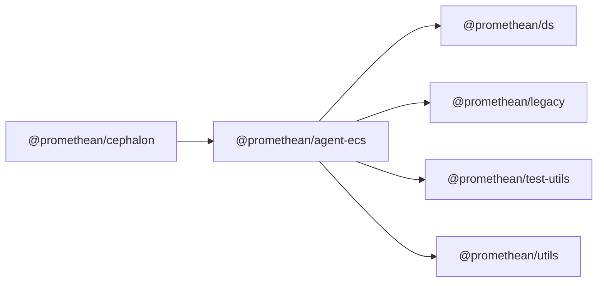

$$
<!-- SYMPKG:PKG:BEGIN -->
$$
# @promethean/agent-ecs
$$
**Folder:** `packages/agent-ecs`
$$
$$
**Version:** `0.0.1`
$$
$$
**Domain:** `_root`
$$

## Dependencies
- $@promethean/ds$$../ds/README.md$
- $@promethean/legacy$$../legacy/README.md$
- $@promethean/test-utils$$../test-utils/README.md$
- $@promethean/utils$$../utils/README.md$
## Dependents
- $@promethean/cephalon$$../cephalon/README.md$
$$
<!-- SYMPKG:PKG:END -->
$$