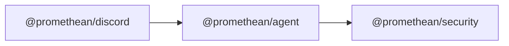

<!-- SYMPKG:PKG:BEGIN -->
# @promethean/agent
**Folder:** `packages/agent`  
**Version:** `0.0.1`  
**Domain:** `_root`

## Dependencies
- [@promethean/security](../security/README.md)
## Dependents
- [@promethean/discord](../discord/README.md)
<!-- SYMPKG:PKG:END -->