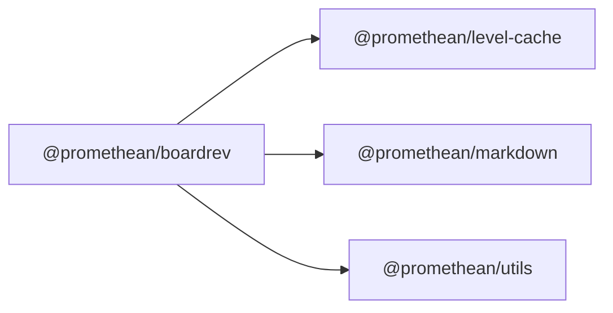

```
<!-- SYMPKG:PKG:BEGIN -->
```
# @promethean/boardrev
```
**Folder:** `packages/boardrev`
```
```
**Version:** `0.1.0`
```
```
**Domain:** `_root`
```

## Dependencies
- @promethean/level-cache$../level-cache/README.md
- @promethean/markdown$../markdown/README.md
- @promethean/utils$../utils/README.md
## Dependents
- _None_
```
<!-- SYMPKG:PKG:END -->
```