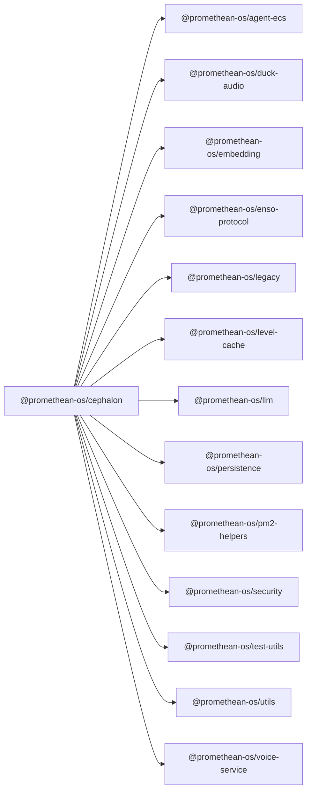

```
<!-- SYMPKG:PKG:BEGIN -->
```
# @promethean-os/cephalon
```
**Folder:** `packages/cephalon`
```
```
**Version:** `0.0.1`
```
```
**Domain:** `_root`
```

## Dependencies
- @promethean-os/agent-ecs$../agent-ecs/README.md
- @promethean-os/duck-audio$../duck-audio/README.md
- @promethean-os/embedding$../embedding/README.md
- @promethean-os/enso-protocol$../enso-protocol/README.md
- @promethean-os/legacy$../legacy/README.md
- @promethean-os/level-cache$../level-cache/README.md
- @promethean-os/llm$../llm/README.md
- @promethean-os/persistence$../persistence/README.md
- @promethean-os/pm2-helpers$../pm2-helpers/README.md
- @promethean-os/security$../security/README.md
- @promethean-os/test-utils$../test-utils/README.md
- @promethean-os/utils$../utils/README.md
- @promethean-os/voice-service$../voice/README.md
## Dependents
- _None_
```


## 📁 Implementation

### Core Files

- [113](../../../packages/cephalon/src/113)

### View Source

- [GitHub](https://github.com/promethean-ai/promethean/tree/main/packages/cephalon/src)
- [VS Code](vscode://file/packages/cephalon/src)


## 📚 API Reference

### Interfaces

#### [- **actions/forward-attachments.scope.ts**](../../../packages/cephalon/src/[src/actions/forward-attachments.scope.ts](../../../packages/cephalon/src/actions/forward-attachments.scope.ts) (27 lines)#L1)

#### [- **actions/forward-attachments.ts**](../../../packages/cephalon/src/[src/actions/forward-attachments.ts](../../../packages/cephalon/src/actions/forward-attachments.ts) (41 lines)#L1)

#### [- **actions/leave-voice.scope.ts**](../../../packages/cephalon/src/[src/actions/leave-voice.scope.ts](../../../packages/cephalon/src/actions/leave-voice.scope.ts) (45 lines)#L1)

#### [- **actions/leave-voice.ts**](../../../packages/cephalon/src/[src/actions/leave-voice.ts](../../../packages/cephalon/src/actions/leave-voice.ts) (27 lines)#L1)

#### [- **actions/ping.scope.ts**](../../../packages/cephalon/src/[src/actions/ping.scope.ts](../../../packages/cephalon/src/actions/ping.scope.ts) (21 lines)#L1)

#### [- **actions/ping.ts**](../../../packages/cephalon/src/[src/actions/ping.ts](../../../packages/cephalon/src/actions/ping.ts) (15 lines)#L1)

#### [- **actions/record-speaker.scope.ts**](../../../packages/cephalon/src/[src/actions/record-speaker.scope.ts](../../../packages/cephalon/src/actions/record-speaker.scope.ts) (52 lines)#L1)

#### [- **actions/register-llm-handler.scope.ts**](../../../packages/cephalon/src/[src/actions/register-llm-handler.scope.ts](../../../packages/cephalon/src/actions/register-llm-handler.scope.ts) (26 lines)#L1)

#### [- **actions/register-llm-handler.ts**](../../../packages/cephalon/src/[src/actions/register-llm-handler.ts](../../../packages/cephalon/src/actions/register-llm-handler.ts) (46 lines)#L1)

#### [- **actions/set-capture-channel.scope.ts**](../../../packages/cephalon/src/[src/actions/set-capture-channel.scope.ts](../../../packages/cephalon/src/actions/set-capture-channel.scope.ts) (19 lines)#L1)

#### [- **actions/set-capture-channel.ts**](../../../packages/cephalon/src/[src/actions/set-capture-channel.ts](../../../packages/cephalon/src/actions/set-capture-channel.ts) (23 lines)#L1)

#### [- **actions/set-desktop-channel.scope.ts**](../../../packages/cephalon/src/[src/actions/set-desktop-channel.scope.ts](../../../packages/cephalon/src/actions/set-desktop-channel.scope.ts) (19 lines)#L1)

#### [- **actions/set-desktop-channel.ts**](../../../packages/cephalon/src/[src/actions/set-desktop-channel.ts](../../../packages/cephalon/src/actions/set-desktop-channel.ts) (23 lines)#L1)

#### [- **actions/start-dialog.scope.ts**](../../../packages/cephalon/src/[src/actions/start-dialog.scope.ts](../../../packages/cephalon/src/actions/start-dialog.scope.ts) (324 lines)#L1)

#### [- **actions/transcribe-speaker.scope.ts**](../../../packages/cephalon/src/[src/actions/transcribe-speaker.scope.ts](../../../packages/cephalon/src/actions/transcribe-speaker.scope.ts) (44 lines)#L1)

#### [- **actions/tts.scope.ts**](../../../packages/cephalon/src/[src/actions/tts.scope.ts](../../../packages/cephalon/src/actions/tts.scope.ts) (39 lines)#L1)

#### [- **agent/index.ts**](../../../packages/cephalon/src/[src/agent/index.ts](../../../packages/cephalon/src/agent/index.ts) (393 lines)#L1)

#### [- **agent/innerState.ts**](../../../packages/cephalon/src/[src/agent/innerState.ts](../../../packages/cephalon/src/agent/innerState.ts) (115 lines)#L1)

#### [- **agent/speech.ts**](../../../packages/cephalon/src/[src/agent/speech.ts](../../../packages/cephalon/src/agent/speech.ts) (137 lines)#L1)

#### [- **agent/speechCoordinator.ts**](../../../packages/cephalon/src/[src/agent/speechCoordinator.ts](../../../packages/cephalon/src/agent/speechCoordinator.ts) (140 lines)#L1)

#### [- **agent/voiceContent.ts**](../../../packages/cephalon/src/[src/agent/voiceContent.ts](../../../packages/cephalon/src/agent/voiceContent.ts) (104 lines)#L1)

#### [- **agent.ts**](../../../packages/cephalon/src/[src/agent.ts](../../../packages/cephalon/src/agent.ts) (2 lines)#L1)

#### [- **annotate-image.ts**](../../../packages/cephalon/src/[src/annotate-image.ts](../../../packages/cephalon/src/annotate-image.ts) (34 lines)#L1)

#### [- **audio-service.ts**](../../../packages/cephalon/src/[src/audio-service.ts](../../../packages/cephalon/src/audio-service.ts) (59 lines)#L1)

#### [- **audioProcessing/spectrogram.ts**](../../../packages/cephalon/src/[src/audioProcessing/spectrogram.ts](../../../packages/cephalon/src/audioProcessing/spectrogram.ts) (51 lines)#L1)

#### [- **audioProcessing/waveform.ts**](../../../packages/cephalon/src/[src/audioProcessing/waveform.ts](../../../packages/cephalon/src/audioProcessing/waveform.ts) (68 lines)#L1)

#### [- **bot/registerCommands.ts**](../../../packages/cephalon/src/[src/bot/registerCommands.ts](../../../packages/cephalon/src/bot/registerCommands.ts) (43 lines)#L1)

#### [- **bot.ts**](../../../packages/cephalon/src/[src/bot.ts](../../../packages/cephalon/src/bot.ts) (313 lines)#L1)

#### [- **collections.ts**](../../../packages/cephalon/src/[src/collections.ts](../../../packages/cephalon/src/collections.ts) (14 lines)#L1)

#### [- **commands/begin-recording.ts**](../../../packages/cephalon/src/[src/commands/begin-recording.ts](../../../packages/cephalon/src/commands/begin-recording.ts) (35 lines)#L1)

#### [- **commands/begin-transcribing.ts**](../../../packages/cephalon/src/[src/commands/begin-transcribing.ts](../../../packages/cephalon/src/commands/begin-transcribing.ts) (46 lines)#L1)

#### [- **commands/join-voice.ts**](../../../packages/cephalon/src/[src/commands/join-voice.ts](../../../packages/cephalon/src/commands/join-voice.ts) (41 lines)#L1)

#### [- **commands/leave-voice.ts**](../../../packages/cephalon/src/[src/commands/leave-voice.ts](../../../packages/cephalon/src/commands/leave-voice.ts) (31 lines)#L1)

#### [- **commands/ping.ts**](../../../packages/cephalon/src/[src/commands/ping.ts](../../../packages/cephalon/src/commands/ping.ts) (22 lines)#L1)

#### [- **commands/set-capture-channel.ts**](../../../packages/cephalon/src/[src/commands/set-capture-channel.ts](../../../packages/cephalon/src/commands/set-capture-channel.ts) (40 lines)#L1)

#### [- **commands/set-desktop-channel.ts**](../../../packages/cephalon/src/[src/commands/set-desktop-channel.ts](../../../packages/cephalon/src/commands/set-desktop-channel.ts) (39 lines)#L1)

#### [- **commands/start-dialog.ts**](../../../packages/cephalon/src/[src/commands/start-dialog.ts](../../../packages/cephalon/src/commands/start-dialog.ts) (23 lines)#L1)

#### [- **commands/stop-recording.ts**](../../../packages/cephalon/src/[src/commands/stop-recording.ts](../../../packages/cephalon/src/commands/stop-recording.ts) (39 lines)#L1)

#### [- **commands/tts.ts**](../../../packages/cephalon/src/[src/commands/tts.ts](../../../packages/cephalon/src/commands/tts.ts) (32 lines)#L1)

#### [- **converter.ts**](../../../packages/cephalon/src/[src/converter.ts](../../../packages/cephalon/src/converter.ts) (23 lines)#L1)

#### [- **desktop/desktopAudioCapture.ts**](../../../packages/cephalon/src/[src/desktop/desktopAudioCapture.ts](../../../packages/cephalon/src/desktop/desktopAudioCapture.ts) (81 lines)#L1)

#### [- **desktop/desktopLoop.ts**](../../../packages/cephalon/src/[src/desktop/desktopLoop.ts](../../../packages/cephalon/src/desktop/desktopLoop.ts) (100 lines)#L1)

#### [- **enso/chat-agent.ts**](../../../packages/cephalon/src/[src/enso/chat-agent.ts](../../../packages/cephalon/src/enso/chat-agent.ts) (307 lines)#L1)

#### [- **enso/runner.ts**](../../../packages/cephalon/src/[src/enso/runner.ts](../../../packages/cephalon/src/enso/runner.ts) (59 lines)#L1)

#### [- **enso/transcriber-enso.ts**](../../../packages/cephalon/src/[src/enso/transcriber-enso.ts](../../../packages/cephalon/src/enso/transcriber-enso.ts) (240 lines)#L1)

#### [- **events/transcriptEnd.ts**](../../../packages/cephalon/src/[src/events/transcriptEnd.ts](../../../packages/cephalon/src/events/transcriptEnd.ts) (2 lines)#L1)

#### [- **factories/voice.ts**](../../../packages/cephalon/src/[src/factories/voice.ts](../../../packages/cephalon/src/factories/voice.ts) (54 lines)#L1)

#### [- **get-current-date-time.ts**](../../../packages/cephalon/src/[src/get-current-date-time.ts](../../../packages/cephalon/src/get-current-date-time.ts) (17 lines)#L1)

#### [- **index.ts**](../../../packages/cephalon/src/[src/index.ts](../../../packages/cephalon/src/index.ts) (31 lines)#L1)

#### [- **interactions.ts**](../../../packages/cephalon/src/[src/interactions.ts](../../../packages/cephalon/src/interactions.ts) (26 lines)#L1)

#### [- **llm-service.ts**](../../../packages/cephalon/src/[src/llm-service.ts](../../../packages/cephalon/src/llm-service.ts) (94 lines)#L1)

#### [- **messageThrottler.ts**](../../../packages/cephalon/src/[src/messageThrottler.ts](../../../packages/cephalon/src/messageThrottler.ts) (27 lines)#L1)

#### [- **mode.ts**](../../../packages/cephalon/src/[src/mode.ts](../../../packages/cephalon/src/mode.ts) (32 lines)#L1)

#### [- **prompts.ts**](../../../packages/cephalon/src/[src/prompts.ts](../../../packages/cephalon/src/prompts.ts) (110 lines)#L1)

#### [- **security/llm-service-enhanced.ts**](../../../packages/cephalon/src/[src/security/llm-service-enhanced.ts](../../../packages/cephalon/src/security/llm-service-enhanced.ts) (368 lines)#L1)

#### [- **speaker.ts**](../../../packages/cephalon/src/[src/speaker.ts](../../../packages/cephalon/src/speaker.ts) (107 lines)#L1)

#### [- **store/createStore.ts**](../../../packages/cephalon/src/[src/store/createStore.ts](../../../packages/cephalon/src/store/createStore.ts) (22 lines)#L1)

#### [- **store/effects/ping.ts**](../../../packages/cephalon/src/[src/store/effects/ping.ts](../../../packages/cephalon/src/store/effects/ping.ts) (17 lines)#L1)

#### [- **store/effects/voice.ts**](../../../packages/cephalon/src/[src/store/effects/voice.ts](../../../packages/cephalon/src/store/effects/voice.ts) (30 lines)#L1)

#### [- **store/events.ts**](../../../packages/cephalon/src/[src/store/events.ts](../../../packages/cephalon/src/store/events.ts) (44 lines)#L1)

#### [- **store/reducer.ts**](../../../packages/cephalon/src/[src/store/reducer.ts](../../../packages/cephalon/src/store/reducer.ts) (22 lines)#L1)

#### [- **store/storeInstance.ts**](../../../packages/cephalon/src/[src/store/storeInstance.ts](../../../packages/cephalon/src/store/storeInstance.ts) (9 lines)#L1)

#### [- **tests/actions.leave-voice.test.ts**](../../../packages/cephalon/src/[src/tests/actions.leave-voice.test.ts](../../../packages/cephalon/src/tests/actions.leave-voice.test.ts) (50 lines)#L1)

#### [- **tests/actions.ping.test.ts**](../../../packages/cephalon/src/[src/tests/actions.ping.test.ts](../../../packages/cephalon/src/tests/actions.ping.test.ts) (47 lines)#L1)

#### [- **tests/bot.test.ts**](../../../packages/cephalon/src/[src/tests/bot.test.ts](../../../packages/cephalon/src/tests/bot.test.ts) (39 lines)#L1)

#### [- **tests/capture_channel.test.ts**](../../../packages/cephalon/src/[src/tests/capture_channel.test.ts](../../../packages/cephalon/src/tests/capture_channel.test.ts) (53 lines)#L1)

#### [- **tests/commands.join-voice.test.ts**](../../../packages/cephalon/src/[src/tests/commands.join-voice.test.ts](../../../packages/cephalon/src/tests/commands.join-voice.test.ts) (45 lines)#L1)

#### [- **tests/commands.leave-voice.test.ts**](../../../packages/cephalon/src/[src/tests/commands.leave-voice.test.ts](../../../packages/cephalon/src/tests/commands.leave-voice.test.ts) (42 lines)#L1)

#### [- **tests/commands.ping.test.ts**](../../../packages/cephalon/src/[src/tests/commands.ping.test.ts](../../../packages/cephalon/src/tests/commands.ping.test.ts) (31 lines)#L1)

#### [- **tests/converter.ts**](../../../packages/cephalon/src/[src/tests/converter.ts](../../../packages/cephalon/src/tests/converter.ts) (12 lines)#L1)

#### [- **tests/desktop_channel.test.ts**](../../../packages/cephalon/src/[src/tests/desktop_channel.test.ts](../../../packages/cephalon/src/tests/desktop_channel.test.ts) (30 lines)#L1)

#### [- **tests/embedding.test.ts**](../../../packages/cephalon/src/[src/tests/embedding.test.ts](../../../packages/cephalon/src/tests/embedding.test.ts) (25 lines)#L1)

#### [- **tests/enso/transcriber-enso.test.ts**](../../../packages/cephalon/src/[src/tests/enso/transcriber-enso.test.ts](../../../packages/cephalon/src/tests/enso/transcriber-enso.test.ts) (44 lines)#L1)

#### [- **tests/enso-chat-agent.spec.ts**](../../../packages/cephalon/src/[src/tests/enso-chat-agent.spec.ts](../../../packages/cephalon/src/tests/enso-chat-agent.spec.ts) (162 lines)#L1)

#### [- **tests/enso-tool-rationale.spec.ts**](../../../packages/cephalon/src/[src/tests/enso-tool-rationale.spec.ts](../../../packages/cephalon/src/tests/enso-tool-rationale.spec.ts) (110 lines)#L1)

#### [- **tests/enso-tools.spec.ts**](../../../packages/cephalon/src/[src/tests/enso-tools.spec.ts](../../../packages/cephalon/src/tests/enso-tools.spec.ts) (37 lines)#L1)

#### [- **tests/image_forward.test.ts**](../../../packages/cephalon/src/[src/tests/image_forward.test.ts](../../../packages/cephalon/src/tests/image_forward.test.ts) (44 lines)#L1)

#### [- **tests/integration.non-discord.test.ts**](../../../packages/cephalon/src/[src/tests/integration.non-discord.test.ts](../../../packages/cephalon/src/tests/integration.non-discord.test.ts) (18 lines)#L1)

#### [- **tests/llm-prompt-injection.test.ts**](../../../packages/cephalon/src/[src/tests/llm-prompt-injection.test.ts](../../../packages/cephalon/src/tests/llm-prompt-injection.test.ts) (524 lines)#L1)

#### [- **tests/llm_forward.test.ts**](../../../packages/cephalon/src/[src/tests/llm_forward.test.ts](../../../packages/cephalon/src/tests/llm_forward.test.ts) (62 lines)#L1)

#### [- **tests/messageThrottler.test.ts**](../../../packages/cephalon/src/[src/tests/messageThrottler.test.ts](../../../packages/cephalon/src/tests/messageThrottler.test.ts) (37 lines)#L1)

#### [- **tests/mode.test.ts**](../../../packages/cephalon/src/[src/tests/mode.test.ts](../../../packages/cephalon/src/tests/mode.test.ts) (36 lines)#L1)

#### [- **tests/ping_effect.test.ts**](../../../packages/cephalon/src/[src/tests/ping_effect.test.ts](../../../packages/cephalon/src/tests/ping_effect.test.ts) (24 lines)#L1)

#### [- **tests/security-integration.test.ts**](../../../packages/cephalon/src/[src/tests/security-integration.test.ts](../../../packages/cephalon/src/tests/security-integration.test.ts) (393 lines)#L1)

#### [- **tests/speechCoordinator.test.ts**](../../../packages/cephalon/src/[src/tests/speechCoordinator.test.ts](../../../packages/cephalon/src/tests/speechCoordinator.test.ts) (77 lines)#L1)

#### [- **tests/store.effects.voice.test.ts**](../../../packages/cephalon/src/[src/tests/store.effects.voice.test.ts](../../../packages/cephalon/src/tests/store.effects.voice.test.ts) (26 lines)#L1)

#### [- **tests/tickrate.test.ts**](../../../packages/cephalon/src/[src/tests/tickrate.test.ts](../../../packages/cephalon/src/tests/tickrate.test.ts) (18 lines)#L1)

#### [- **tests/transcriber.test.ts**](../../../packages/cephalon/src/[src/tests/transcriber.test.ts](../../../packages/cephalon/src/tests/transcriber.test.ts) (50 lines)#L1)

#### [- **tests/voice_session.test.ts**](../../../packages/cephalon/src/[src/tests/voice_session.test.ts](../../../packages/cephalon/src/tests/voice_session.test.ts) (27 lines)#L1)

#### [- **tests/voice_session_artifacts.integration.test.ts**](../../../packages/cephalon/src/[src/tests/voice_session_artifacts.integration.test.ts](../../../packages/cephalon/src/tests/voice_session_artifacts.integration.test.ts) (67 lines)#L1)

#### [- **tokenizers.ts**](../../../packages/cephalon/src/[src/tokenizers.ts](../../../packages/cephalon/src/tokenizers.ts) (124 lines)#L1)

#### [- **transcriber.ts**](../../../packages/cephalon/src/[src/transcriber.ts](../../../packages/cephalon/src/transcriber.ts) (161 lines)#L1)

#### [- **types.ts**](../../../packages/cephalon/src/[src/types.ts](../../../packages/cephalon/src/types.ts) (48 lines)#L1)

#### [- **util.ts**](../../../packages/cephalon/src/[src/util.ts](../../../packages/cephalon/src/util.ts) (40 lines)#L1)

#### [- **voice-recorder.ts**](../../../packages/cephalon/src/[src/voice-recorder.ts](../../../packages/cephalon/src/voice-recorder.ts) (49 lines)#L1)

#### [- **voice-session.ts**](../../../packages/cephalon/src/[src/voice-session.ts](../../../packages/cephalon/src/voice-session.ts) (94 lines)#L1)

#### [- **voice-synth.ts**](../../../packages/cephalon/src/[src/voice-synth.ts](../../../packages/cephalon/src/voice-synth.ts) (3 lines)#L1)

#### [- **wav-decoder.d.ts**](../../../packages/cephalon/src/[src/wav-decoder.d.ts](../../../packages/cephalon/src/wav-decoder.d.ts) (7 lines)#L1)

#### [- **AIAgent**](../../../packages/cephalon/src/[AIAgent](../../../packages/cephalon/src/agent/index.ts#L66)

#### [- **SpeechArbiter**](../../../packages/cephalon/src/[SpeechArbiter](../../../packages/cephalon/src/agent/speechCoordinator.ts#L19)

#### [- **TurnManager**](../../../packages/cephalon/src/[TurnManager](../../../packages/cephalon/src/agent/speechCoordinator.ts#L130)

#### [- **AudioService**](../../../packages/cephalon/src/[AudioService](../../../packages/cephalon/src/audio-service.ts#L13)

#### [- **Bot**](../../../packages/cephalon/src/[Bot](../../../packages/cephalon/src/bot.ts#L49)

#### [- **buildForwardAttachmentsScope()**](../../../packages/cephalon/src/[buildForwardAttachmentsScope()](../../../packages/cephalon/src/actions/forward-attachments.scope.ts#L14)

#### [- **run()**](../../../packages/cephalon/src/[run()](../../../packages/cephalon/src/actions/forward-attachments.ts#L9)

#### [- **buildLeaveVoiceScope()**](../../../packages/cephalon/src/[buildLeaveVoiceScope()](../../../packages/cephalon/src/actions/leave-voice.scope.ts#L18)

#### [- **run()**](../../../packages/cephalon/src/[run()](../../../packages/cephalon/src/actions/leave-voice.ts#L10)

#### [- **buildPingScope()**](../../../packages/cephalon/src/[buildPingScope()](../../../packages/cephalon/src/actions/ping.scope.ts#L11)

#### [- **GitHub**](../../../packages/cephalon/src/[View on GitHub](https#L1)

#### [- **VS Code**](../../../packages/cephalon/src/[Open in VS Code](vscode#L1)

#### [**Location**](../../../packages/cephalon/src/[AIAgent](../../../packages/cephalon/src/agent/index.ts#L66)

#### [**Description**](../../../packages/cephalon/src/Main class for aiagent functionality.#L1)

#### [**File**](../../../packages/cephalon/src/`src/agent/index.ts`#L1)

#### [**Location**](../../../packages/cephalon/src/[SpeechArbiter](../../../packages/cephalon/src/agent/speechCoordinator.ts#L19)

#### [**Description**](../../../packages/cephalon/src/Main class for speecharbiter functionality.#L1)

#### [**File**](../../../packages/cephalon/src/`src/agent/speechCoordinator.ts`#L1)

#### [**Location**](../../../packages/cephalon/src/[TurnManager](../../../packages/cephalon/src/agent/speechCoordinator.ts#L130)

#### [**Description**](../../../packages/cephalon/src/Main class for turnmanager functionality.#L1)

#### [**File**](../../../packages/cephalon/src/`src/agent/speechCoordinator.ts`#L1)

#### [**Location**](../../../packages/cephalon/src/[AudioService](../../../packages/cephalon/src/audio-service.ts#L13)

#### [**Description**](../../../packages/cephalon/src/Main class for audioservice functionality.#L1)

#### [**File**](../../../packages/cephalon/src/`src/audio-service.ts`#L1)

#### [**Location**](../../../packages/cephalon/src/[Bot](../../../packages/cephalon/src/bot.ts#L49)

#### [**Description**](../../../packages/cephalon/src/Main class for bot functionality.#L1)

#### [**File**](../../../packages/cephalon/src/`src/bot.ts`#L1)

#### [**Location**](../../../packages/cephalon/src/[DesktopCaptureManager](../../../packages/cephalon/src/desktop/desktopLoop.ts#L29)

#### [**Description**](../../../packages/cephalon/src/Main class for desktopcapturemanager functionality.#L1)

#### [**File**](../../../packages/cephalon/src/`src/desktop/desktopLoop.ts`#L1)

#### [**Location**](../../../packages/cephalon/src/[EnsoChatAgent](../../../packages/cephalon/src/enso/chat-agent.ts#L53)

#### [**Description**](../../../packages/cephalon/src/Main class for ensochatagent functionality.#L1)

#### [**File**](../../../packages/cephalon/src/`src/enso/chat-agent.ts`#L1)

#### [**Location**](../../../packages/cephalon/src/[ToPcm16kMono](../../../packages/cephalon/src/enso/transcriber-enso.ts#L33)

#### [**Description**](../../../packages/cephalon/src/Main class for topcm16kmono functionality.#L1)

#### [**File**](../../../packages/cephalon/src/`src/enso/transcriber-enso.ts`#L1)

#### [**Location**](../../../packages/cephalon/src/[EnsoTranscriber](../../../packages/cephalon/src/enso/transcriber-enso.ts#L108)

#### [**Description**](../../../packages/cephalon/src/Main class for ensotranscriber functionality.#L1)

#### [**File**](../../../packages/cephalon/src/`src/enso/transcriber-enso.ts`#L1)

#### [**Location**](../../../packages/cephalon/src/[LLMService](../../../packages/cephalon/src/llm-service.ts#L27)

#### [**Description**](../../../packages/cephalon/src/Main class for llmservice functionality.#L1)

#### [**File**](../../../packages/cephalon/src/`src/llm-service.ts`#L1)

#### [**Location**](../../../packages/cephalon/src/[SecureLLMService](../../../packages/cephalon/src/security/llm-service-enhanced.ts#L28)

#### [**Description**](../../../packages/cephalon/src/Main class for securellmservice functionality.#L1)

#### [**File**](../../../packages/cephalon/src/`src/security/llm-service-enhanced.ts`#L1)

#### [**Location**](../../../packages/cephalon/src/[OpusSilenceFilter](../../../packages/cephalon/src/speaker.ts#L16)

#### [**Description**](../../../packages/cephalon/src/Main class for opussilencefilter functionality.#L1)

#### [**File**](../../../packages/cephalon/src/`src/speaker.ts`#L1)

#### [**Location**](../../../packages/cephalon/src/[Speaker](../../../packages/cephalon/src/speaker.ts#L42)

#### [**Description**](../../../packages/cephalon/src/Main class for speaker functionality.#L1)

#### [**File**](../../../packages/cephalon/src/`src/speaker.ts`#L1)

#### [**Location**](../../../packages/cephalon/src/[TestBot](../../../packages/cephalon/src/tests/bot.test.ts#L6)

#### [**Description**](../../../packages/cephalon/src/Main class for testbot functionality.#L1)

#### [**File**](../../../packages/cephalon/src/`src/tests/bot.test.ts`#L1)

#### [**Location**](../../../packages/cephalon/src/[StubBot](../../../packages/cephalon/src/tests/llm_forward.test.ts#L20)

#### [**Description**](../../../packages/cephalon/src/Main class for stubbot functionality.#L1)

#### [**File**](../../../packages/cephalon/src/`src/tests/llm_forward.test.ts`#L1)

#### [**Location**](../../../packages/cephalon/src/[FakePlayer](../../../packages/cephalon/src/tests/speechCoordinator.test.ts#L12)

#### [**Description**](../../../packages/cephalon/src/Main class for fakeplayer functionality.#L1)

#### [**File**](../../../packages/cephalon/src/`src/tests/speechCoordinator.test.ts`#L1)

#### [**Location**](../../../packages/cephalon/src/[DummyBroker](../../../packages/cephalon/src/tests/transcriber.test.ts#L8)

#### [**Description**](../../../packages/cephalon/src/Main class for dummybroker functionality.#L1)

#### [**File**](../../../packages/cephalon/src/`src/tests/transcriber.test.ts`#L1)

#### [**Location**](../../../packages/cephalon/src/[FakeBroker](../../../packages/cephalon/src/tests/voice_session_artifacts.integration.test.ts#L6)

#### [**Description**](../../../packages/cephalon/src/Main class for fakebroker functionality.#L1)

#### [**File**](../../../packages/cephalon/src/`src/tests/voice_session_artifacts.integration.test.ts`#L1)

#### [**Location**](../../../packages/cephalon/src/[Transcriber](../../../packages/cephalon/src/transcriber.ts#L36)

#### [**Description**](../../../packages/cephalon/src/Main class for transcriber functionality.#L1)

#### [**File**](../../../packages/cephalon/src/`src/transcriber.ts`#L1)

#### [**Location**](../../../packages/cephalon/src/[VoiceRecorder](../../../packages/cephalon/src/voice-recorder.ts#L19)

#### [**Description**](../../../packages/cephalon/src/Main class for voicerecorder functionality.#L1)

#### [**File**](../../../packages/cephalon/src/`src/voice-recorder.ts`#L1)

#### [**Location**](../../../packages/cephalon/src/[VoiceSession](../../../packages/cephalon/src/voice-session.ts#L29)

#### [**Description**](../../../packages/cephalon/src/Main class for voicesession functionality.#L1)

#### [**File**](../../../packages/cephalon/src/`src/voice-session.ts`#L1)

#### [**Location**](../../../packages/cephalon/src/[buildForwardAttachmentsScope()](../../../packages/cephalon/src/actions/forward-attachments.scope.ts#L14)

#### [**Description**](../../../packages/cephalon/src/Key function for buildforwardattachmentsscope operations.#L1)

#### [**File**](../../../packages/cephalon/src/`src/actions/forward-attachments.scope.ts`#L1)

#### [**Location**](../../../packages/cephalon/src/[run()](../../../packages/cephalon/src/actions/forward-attachments.ts#L9)

#### [**Description**](../../../packages/cephalon/src/Key function for run operations.#L1)

#### [**File**](../../../packages/cephalon/src/`src/actions/forward-attachments.ts`#L1)

#### [**Location**](../../../packages/cephalon/src/[buildLeaveVoiceScope()](../../../packages/cephalon/src/actions/leave-voice.scope.ts#L18)

#### [**Description**](../../../packages/cephalon/src/Key function for buildleavevoicescope operations.#L1)

#### [**File**](../../../packages/cephalon/src/`src/actions/leave-voice.scope.ts`#L1)

#### [**Location**](../../../packages/cephalon/src/[run()](../../../packages/cephalon/src/actions/leave-voice.ts#L10)

#### [**Description**](../../../packages/cephalon/src/Key function for run operations.#L1)

#### [**File**](../../../packages/cephalon/src/`src/actions/leave-voice.ts`#L1)

#### [**Location**](../../../packages/cephalon/src/[buildPingScope()](../../../packages/cephalon/src/actions/ping.scope.ts#L11)

#### [**Description**](../../../packages/cephalon/src/Key function for buildpingscope operations.#L1)

#### [**File**](../../../packages/cephalon/src/`src/actions/ping.scope.ts`#L1)

#### [**Location**](../../../packages/cephalon/src/[run()](../../../packages/cephalon/src/actions/ping.ts#L6)

#### [**Description**](../../../packages/cephalon/src/Key function for run operations.#L1)

#### [**File**](../../../packages/cephalon/src/`src/actions/ping.ts`#L1)

#### [**Location**](../../../packages/cephalon/src/[buildRecordSpeakerScope()](../../../packages/cephalon/src/actions/record-speaker.scope.ts#L22)

#### [**Description**](../../../packages/cephalon/src/Key function for buildrecordspeakerscope operations.#L1)

#### [**File**](../../../packages/cephalon/src/`src/actions/record-speaker.scope.ts`#L1)

#### [**Location**](../../../packages/cephalon/src/[makeRecordActions()](../../../packages/cephalon/src/actions/record-speaker.scope.ts#L34)

#### [**Description**](../../../packages/cephalon/src/Key function for makerecordactions operations.#L1)

#### [**File**](../../../packages/cephalon/src/`src/actions/record-speaker.scope.ts`#L1)

#### [**Location**](../../../packages/cephalon/src/[buildRegisterLlmHandlerScope()](../../../packages/cephalon/src/actions/register-llm-handler.scope.ts#L14)

#### [**Description**](../../../packages/cephalon/src/Key function for buildregisterllmhandlerscope operations.#L1)

#### [**File**](../../../packages/cephalon/src/`src/actions/register-llm-handler.scope.ts`#L1)

#### [**Location**](../../../packages/cephalon/src/[run()](../../../packages/cephalon/src/actions/register-llm-handler.ts#L5)

#### [**Description**](../../../packages/cephalon/src/Key function for run operations.#L1)

#### [**File**](../../../packages/cephalon/src/`src/actions/register-llm-handler.ts`#L1)

#### [**Location**](../../../packages/cephalon/src/[buildSetCaptureChannelScope()](../../../packages/cephalon/src/actions/set-capture-channel.scope.ts#L10)

#### [**Description**](../../../packages/cephalon/src/Key function for buildsetcapturechannelscope operations.#L1)

#### [**File**](../../../packages/cephalon/src/`src/actions/set-capture-channel.scope.ts`#L1)

#### [**Location**](../../../packages/cephalon/src/[run()](../../../packages/cephalon/src/actions/set-capture-channel.ts#L14)

#### [**Description**](../../../packages/cephalon/src/Key function for run operations.#L1)

#### [**File**](../../../packages/cephalon/src/`src/actions/set-capture-channel.ts`#L1)

#### [**Location**](../../../packages/cephalon/src/[buildSetDesktopChannelScope()](../../../packages/cephalon/src/actions/set-desktop-channel.scope.ts#L10)

#### [**Description**](../../../packages/cephalon/src/Key function for buildsetdesktopchannelscope operations.#L1)

#### [**File**](../../../packages/cephalon/src/`src/actions/set-desktop-channel.scope.ts`#L1)

#### [**Location**](../../../packages/cephalon/src/[run()](../../../packages/cephalon/src/actions/set-desktop-channel.ts#L14)

#### [**Description**](../../../packages/cephalon/src/Key function for run operations.#L1)

#### [**File**](../../../packages/cephalon/src/`src/actions/set-desktop-channel.ts`#L1)

#### [**Location**](../../../packages/cephalon/src/[storeAgentMessage()](../../../packages/cephalon/src/actions/start-dialog.scope.ts#L34)

#### [**Description**](../../../packages/cephalon/src/Key function for storeagentmessage operations.#L1)

#### [**File**](../../../packages/cephalon/src/`src/actions/start-dialog.scope.ts`#L1)

#### [**Location**](../../../packages/cephalon/src/[runStartDialog()](../../../packages/cephalon/src/actions/start-dialog.scope.ts#L105)

#### [**Description**](../../../packages/cephalon/src/Key function for runstartdialog operations.#L1)

#### [**File**](../../../packages/cephalon/src/`src/actions/start-dialog.scope.ts`#L1)

#### [**Location**](../../../packages/cephalon/src/[buildTranscribeSpeakerScope()](../../../packages/cephalon/src/actions/transcribe-speaker.scope.ts#L22)

#### [**Description**](../../../packages/cephalon/src/Key function for buildtranscribespeakerscope operations.#L1)

#### [**File**](../../../packages/cephalon/src/`src/actions/transcribe-speaker.scope.ts`#L1)

#### [**Location**](../../../packages/cephalon/src/[makeTranscribeActions()](../../../packages/cephalon/src/actions/transcribe-speaker.scope.ts#L34)

#### [**Description**](../../../packages/cephalon/src/Key function for maketranscribeactions operations.#L1)

#### [**File**](../../../packages/cephalon/src/`src/actions/transcribe-speaker.scope.ts`#L1)

#### [**Location**](../../../packages/cephalon/src/[buildTtsScope()](../../../packages/cephalon/src/actions/tts.scope.ts#L20)

#### [**Description**](../../../packages/cephalon/src/Key function for buildttsscope operations.#L1)

#### [**File**](../../../packages/cephalon/src/`src/actions/tts.scope.ts`#L1)

#### [**Location**](../../../packages/cephalon/src/[makeTtsAction()](../../../packages/cephalon/src/actions/tts.scope.ts#L32)

#### [**Description**](../../../packages/cephalon/src/Key function for makettsaction operations.#L1)

#### [**File**](../../../packages/cephalon/src/`src/actions/tts.scope.ts`#L1)

#### [**Location**](../../../packages/cephalon/src/[generateInnerState()](../../../packages/cephalon/src/agent/innerState.ts#L15)

#### [**Description**](../../../packages/cephalon/src/Key function for generateinnerstate operations.#L1)

#### [**File**](../../../packages/cephalon/src/`src/agent/innerState.ts`#L1)

#### [**Location**](../../../packages/cephalon/src/[think()](../../../packages/cephalon/src/agent/innerState.ts#L39)

#### [**Description**](../../../packages/cephalon/src/Key function for think operations.#L1)

#### [**File**](../../../packages/cephalon/src/`src/agent/innerState.ts`#L1)

#### [**Location**](../../../packages/cephalon/src/[updateInnerState()](../../../packages/cephalon/src/agent/innerState.ts#L67)

#### [**Description**](../../../packages/cephalon/src/Key function for updateinnerstate operations.#L1)

#### [**File**](../../../packages/cephalon/src/`src/agent/innerState.ts`#L1)

#### [**Location**](../../../packages/cephalon/src/[loadInnerState()](../../../packages/cephalon/src/agent/innerState.ts#L94)

#### [**Description**](../../../packages/cephalon/src/Key function for loadinnerstate operations.#L1)

#### [**File**](../../../packages/cephalon/src/`src/agent/innerState.ts`#L1)

#### [**Location**](../../../packages/cephalon/src/[speak()](../../../packages/cephalon/src/agent/speech.ts#L22)

#### [**Description**](../../../packages/cephalon/src/Key function for speak operations.#L1)

#### [**File**](../../../packages/cephalon/src/`src/agent/speech.ts`#L1)

#### [**Location**](../../../packages/cephalon/src/[storeAgentMessage()](../../../packages/cephalon/src/agent/speech.ts#L49)

#### [**Description**](../../../packages/cephalon/src/Key function for storeagentmessage operations.#L1)

#### [**File**](../../../packages/cephalon/src/`src/agent/speech.ts`#L1)

#### [**Location**](../../../packages/cephalon/src/[generateVoiceResponse()](../../../packages/cephalon/src/agent/speech.ts#L74)

#### [**Description**](../../../packages/cephalon/src/Key function for generatevoiceresponse operations.#L1)

#### [**File**](../../../packages/cephalon/src/`src/agent/speech.ts`#L1)

#### [**Location**](../../../packages/cephalon/src/[generateVoiceContentFromSinglePrompt()](../../../packages/cephalon/src/agent/voiceContent.ts#L7)

#### [**Description**](../../../packages/cephalon/src/Key function for generatevoicecontentfromsingleprompt operations.#L1)

#### [**File**](../../../packages/cephalon/src/`src/agent/voiceContent.ts`#L1)

#### [**Location**](../../../packages/cephalon/src/[generateVoiceContentWithFormattedLatestmessage()](../../../packages/cephalon/src/agent/voiceContent.ts#L27)

#### [**Description**](../../../packages/cephalon/src/Key function for generatevoicecontentwithformattedlatestmessage operations.#L1)

#### [**File**](../../../packages/cephalon/src/`src/agent/voiceContent.ts`#L1)

#### [**Location**](../../../packages/cephalon/src/[generateVoiceContentWithChoicePrompt()](../../../packages/cephalon/src/agent/voiceContent.ts#L53)

#### [**Description**](../../../packages/cephalon/src/Key function for generatevoicecontentwithchoiceprompt operations.#L1)

#### [**File**](../../../packages/cephalon/src/`src/agent/voiceContent.ts`#L1)

#### [**Location**](../../../packages/cephalon/src/[generateVoiceContentWithSpecialQuery()](../../../packages/cephalon/src/agent/voiceContent.ts#L68)

#### [**Description**](../../../packages/cephalon/src/Key function for generatevoicecontentwithspecialquery operations.#L1)

#### [**File**](../../../packages/cephalon/src/`src/agent/voiceContent.ts`#L1)

#### [**Location**](../../../packages/cephalon/src/[generateVoiceContentWithoutSpecialQuery()](../../../packages/cephalon/src/agent/voiceContent.ts#L87)

#### [**Description**](../../../packages/cephalon/src/Key function for generatevoicecontentwithoutspecialquery operations.#L1)

#### [**File**](../../../packages/cephalon/src/`src/agent/voiceContent.ts`#L1)

#### [**Location**](../../../packages/cephalon/src/[generateVoiceContent()](../../../packages/cephalon/src/agent/voiceContent.ts#L101)

#### [**Description**](../../../packages/cephalon/src/Key function for generatevoicecontent operations.#L1)

#### [**File**](../../../packages/cephalon/src/`src/agent/voiceContent.ts`#L1)

#### [**Location**](../../../packages/cephalon/src/[annotateImage()](../../../packages/cephalon/src/annotate-image.ts#L10)

#### [**Description**](../../../packages/cephalon/src/Key function for annotateimage operations.#L1)

#### [**File**](../../../packages/cephalon/src/`src/annotate-image.ts`#L1)

#### [**Location**](../../../packages/cephalon/src/[generateSpectrogram()](../../../packages/cephalon/src/audioProcessing/spectrogram.ts#L6)

#### [**Description**](../../../packages/cephalon/src/Key function for generatespectrogram operations.#L1)

#### [**File**](../../../packages/cephalon/src/`src/audioProcessing/spectrogram.ts`#L1)

#### [**Location**](../../../packages/cephalon/src/[renderWaveForm()](../../../packages/cephalon/src/audioProcessing/waveform.ts#L12)

#### [**Description**](../../../packages/cephalon/src/Key function for renderwaveform operations.#L1)

#### [**File**](../../../packages/cephalon/src/`src/audioProcessing/waveform.ts`#L1)

#### [**Location**](../../../packages/cephalon/src/[captureAndRenderWaveform()](../../../packages/cephalon/src/audioProcessing/waveform.ts#L52)

#### [**Description**](../../../packages/cephalon/src/Key function for captureandrenderwaveform operations.#L1)

#### [**File**](../../../packages/cephalon/src/`src/audioProcessing/waveform.ts`#L1)

#### [**Location**](../../../packages/cephalon/src/[registerNewStyleCommands()](../../../packages/cephalon/src/bot/registerCommands.ts#L20)

#### [**Description**](../../../packages/cephalon/src/Key function for registernewstylecommands operations.#L1)

#### [**File**](../../../packages/cephalon/src/`src/bot/registerCommands.ts`#L1)

#### [**Location**](../../../packages/cephalon/src/[discordMessages()](../../../packages/cephalon/src/collections.ts#L3)

#### [**Description**](../../../packages/cephalon/src/Key function for discordmessages operations.#L1)

#### [**File**](../../../packages/cephalon/src/`src/collections.ts`#L1)

#### [**Location**](../../../packages/cephalon/src/[thoughts()](../../../packages/cephalon/src/collections.ts#L8)

#### [**Description**](../../../packages/cephalon/src/Key function for thoughts operations.#L1)

#### [**File**](../../../packages/cephalon/src/`src/collections.ts`#L1)

#### [**Location**](../../../packages/cephalon/src/[transcripts()](../../../packages/cephalon/src/collections.ts#L9)

#### [**Description**](../../../packages/cephalon/src/Key function for transcripts operations.#L1)

#### [**File**](../../../packages/cephalon/src/`src/collections.ts`#L1)

#### [**Location**](../../../packages/cephalon/src/[data()](../../../packages/cephalon/src/commands/begin-recording.ts#L9)

#### [**Description**](../../../packages/cephalon/src/Key function for data operations.#L1)

#### [**File**](../../../packages/cephalon/src/`src/commands/begin-recording.ts`#L1)

#### [**Location**](../../../packages/cephalon/src/[execute()](../../../packages/cephalon/src/commands/begin-recording.ts#L22)

#### [**Description**](../../../packages/cephalon/src/Key function for execute operations.#L1)

#### [**File**](../../../packages/cephalon/src/`src/commands/begin-recording.ts`#L1)

#### [**Location**](../../../packages/cephalon/src/[data()](../../../packages/cephalon/src/commands/begin-transcribing.ts#L9)

#### [**Description**](../../../packages/cephalon/src/Key function for data operations.#L1)

#### [**File**](../../../packages/cephalon/src/`src/commands/begin-transcribing.ts`#L1)

#### [**Location**](../../../packages/cephalon/src/[execute()](../../../packages/cephalon/src/commands/begin-transcribing.ts#L28)

#### [**Description**](../../../packages/cephalon/src/Key function for execute operations.#L1)

#### [**File**](../../../packages/cephalon/src/`src/commands/begin-transcribing.ts`#L1)

#### [**Location**](../../../packages/cephalon/src/[data()](../../../packages/cephalon/src/commands/join-voice.ts#L6)

#### [**Description**](../../../packages/cephalon/src/Key function for data operations.#L1)

#### [**File**](../../../packages/cephalon/src/`src/commands/join-voice.ts`#L1)

#### [**Location**](../../../packages/cephalon/src/[execute()](../../../packages/cephalon/src/commands/join-voice.ts#L11)

#### [**Description**](../../../packages/cephalon/src/Key function for execute operations.#L1)

#### [**File**](../../../packages/cephalon/src/`src/commands/join-voice.ts`#L1)

#### [**Location**](../../../packages/cephalon/src/[data()](../../../packages/cephalon/src/commands/leave-voice.ts#L8)

#### [**Description**](../../../packages/cephalon/src/Key function for data operations.#L1)

#### [**File**](../../../packages/cephalon/src/`src/commands/leave-voice.ts`#L1)

#### [**Location**](../../../packages/cephalon/src/[execute()](../../../packages/cephalon/src/commands/leave-voice.ts#L15)

#### [**Description**](../../../packages/cephalon/src/Key function for execute operations.#L1)

#### [**File**](../../../packages/cephalon/src/`src/commands/leave-voice.ts`#L1)

#### [**Location**](../../../packages/cephalon/src/[data()](../../../packages/cephalon/src/commands/ping.ts#L7)

#### [**Description**](../../../packages/cephalon/src/Key function for data operations.#L1)

#### [**File**](../../../packages/cephalon/src/`src/commands/ping.ts`#L1)

#### [**Location**](../../../packages/cephalon/src/[execute()](../../../packages/cephalon/src/commands/ping.ts#L12)

#### [**Description**](../../../packages/cephalon/src/Key function for execute operations.#L1)

#### [**File**](../../../packages/cephalon/src/`src/commands/ping.ts`#L1)

#### [**Location**](../../../packages/cephalon/src/[data()](../../../packages/cephalon/src/commands/set-capture-channel.ts#L8)

#### [**Description**](../../../packages/cephalon/src/Key function for data operations.#L1)

#### [**File**](../../../packages/cephalon/src/`src/commands/set-capture-channel.ts`#L1)

#### [**Location**](../../../packages/cephalon/src/[execute()](../../../packages/cephalon/src/commands/set-capture-channel.ts#L22)

#### [**Description**](../../../packages/cephalon/src/Key function for execute operations.#L1)

#### [**File**](../../../packages/cephalon/src/`src/commands/set-capture-channel.ts`#L1)

#### [**Location**](../../../packages/cephalon/src/[data()](../../../packages/cephalon/src/commands/set-desktop-channel.ts#L8)

#### [**Description**](../../../packages/cephalon/src/Key function for data operations.#L1)

#### [**File**](../../../packages/cephalon/src/`src/commands/set-desktop-channel.ts`#L1)

#### [**Location**](../../../packages/cephalon/src/[execute()](../../../packages/cephalon/src/commands/set-desktop-channel.ts#L21)

#### [**Description**](../../../packages/cephalon/src/Key function for execute operations.#L1)

#### [**File**](../../../packages/cephalon/src/`src/commands/set-desktop-channel.ts`#L1)

#### [**Location**](../../../packages/cephalon/src/[data()](../../../packages/cephalon/src/commands/start-dialog.ts#L6)

#### [**Description**](../../../packages/cephalon/src/Key function for data operations.#L1)

#### [**File**](../../../packages/cephalon/src/`src/commands/start-dialog.ts`#L1)

#### [**Location**](../../../packages/cephalon/src/[execute()](../../../packages/cephalon/src/commands/start-dialog.ts#L11)

#### [**Description**](../../../packages/cephalon/src/Key function for execute operations.#L1)

#### [**File**](../../../packages/cephalon/src/`src/commands/start-dialog.ts`#L1)

#### [**Location**](../../../packages/cephalon/src/[data()](../../../packages/cephalon/src/commands/stop-recording.ts#L9)

#### [**Description**](../../../packages/cephalon/src/Key function for data operations.#L1)

#### [**File**](../../../packages/cephalon/src/`src/commands/stop-recording.ts`#L1)

#### [**Location**](../../../packages/cephalon/src/[execute()](../../../packages/cephalon/src/commands/stop-recording.ts#L22)

#### [**Description**](../../../packages/cephalon/src/Key function for execute operations.#L1)

#### [**File**](../../../packages/cephalon/src/`src/commands/stop-recording.ts`#L1)

#### [**Location**](../../../packages/cephalon/src/[data()](../../../packages/cephalon/src/commands/tts.ts#L6)

#### [**Description**](../../../packages/cephalon/src/Key function for data operations.#L1)

#### [**File**](../../../packages/cephalon/src/`src/commands/tts.ts`#L1)

#### [**Location**](../../../packages/cephalon/src/[execute()](../../../packages/cephalon/src/commands/tts.ts#L20)

#### [**Description**](../../../packages/cephalon/src/Key function for execute operations.#L1)

#### [**File**](../../../packages/cephalon/src/`src/commands/tts.ts`#L1)

#### [**Location**](../../../packages/cephalon/src/[convert()](../../../packages/cephalon/src/converter.ts#L6)

#### [**Description**](../../../packages/cephalon/src/Key function for convert operations.#L1)

#### [**File**](../../../packages/cephalon/src/`src/converter.ts`#L1)

#### [**Location**](../../../packages/cephalon/src/[captureAudio()](../../../packages/cephalon/src/desktop/desktopAudioCapture.ts#L27)

#### [**Description**](../../../packages/cephalon/src/Key function for captureaudio operations.#L1)

#### [**File**](../../../packages/cephalon/src/`src/desktop/desktopAudioCapture.ts`#L1)

#### [**Location**](../../../packages/cephalon/src/[captureScreen()](../../../packages/cephalon/src/desktop/desktopLoop.ts#L9)

#### [**Description**](../../../packages/cephalon/src/Key function for capturescreen operations.#L1)

#### [**File**](../../../packages/cephalon/src/`src/desktop/desktopLoop.ts`#L1)

#### [**Location**](../../../packages/cephalon/src/[createEnsoChatAgent()](../../../packages/cephalon/src/enso/chat-agent.ts#L305)

#### [**Description**](../../../packages/cephalon/src/Key function for createensochatagent operations.#L1)

#### [**File**](../../../packages/cephalon/src/`src/enso/chat-agent.ts`#L1)

#### [**Location**](../../../packages/cephalon/src/[createEnsoTranscriber()](../../../packages/cephalon/src/enso/transcriber-enso.ts#L237)

#### [**Description**](../../../packages/cephalon/src/Key function for createensotranscriber operations.#L1)

#### [**File**](../../../packages/cephalon/src/`src/enso/transcriber-enso.ts`#L1)

#### [**Location**](../../../packages/cephalon/src/[makeDiscordVoiceAdapter()](../../../packages/cephalon/src/factories/voice.ts#L10)

#### [**Description**](../../../packages/cephalon/src/Key function for makediscordvoiceadapter operations.#L1)

#### [**File**](../../../packages/cephalon/src/`src/factories/voice.ts`#L1)

#### [**Location**](../../../packages/cephalon/src/[getCurrentDateTime()](../../../packages/cephalon/src/get-current-date-time.ts#L1)

#### [**Description**](../../../packages/cephalon/src/Key function for getcurrentdatetime operations.#L1)

#### [**File**](../../../packages/cephalon/src/`src/get-current-date-time.ts`#L1)

#### [**Location**](../../../packages/cephalon/src/[interaction()](../../../packages/cephalon/src/interactions.ts#L5)

#### [**Description**](../../../packages/cephalon/src/Key function for interaction operations.#L1)

#### [**File**](../../../packages/cephalon/src/`src/interactions.ts`#L1)

#### [**Location**](../../../packages/cephalon/src/[initMessageThrottler()](../../../packages/cephalon/src/messageThrottler.ts#L5)

#### [**Description**](../../../packages/cephalon/src/Key function for initmessagethrottler operations.#L1)

#### [**File**](../../../packages/cephalon/src/`src/messageThrottler.ts`#L1)

#### [**Location**](../../../packages/cephalon/src/[getCephalonMode()](../../../packages/cephalon/src/mode.ts#L21)

#### [**Description**](../../../packages/cephalon/src/Key function for getcephalonmode operations.#L1)

#### [**File**](../../../packages/cephalon/src/`src/mode.ts`#L1)

#### [**Location**](../../../packages/cephalon/src/[isClassicMode()](../../../packages/cephalon/src/mode.ts#L25)

#### [**Description**](../../../packages/cephalon/src/Key function for isclassicmode operations.#L1)

#### [**File**](../../../packages/cephalon/src/`src/mode.ts`#L1)

#### [**Location**](../../../packages/cephalon/src/[isEcsMode()](../../../packages/cephalon/src/mode.ts#L29)

#### [**Description**](../../../packages/cephalon/src/Key function for isecsmode operations.#L1)

#### [**File**](../../../packages/cephalon/src/`src/mode.ts`#L1)

#### [**Location**](../../../packages/cephalon/src/[defaultPrompt()](../../../packages/cephalon/src/prompts.ts#L8)

#### [**Description**](../../../packages/cephalon/src/Key function for defaultprompt operations.#L1)

#### [**File**](../../../packages/cephalon/src/`src/prompts.ts`#L1)

#### [**Location**](../../../packages/cephalon/src/[defaultState()](../../../packages/cephalon/src/prompts.ts#L15)

#### [**Description**](../../../packages/cephalon/src/Key function for defaultstate operations.#L1)

#### [**File**](../../../packages/cephalon/src/`src/prompts.ts`#L1)

#### [**Location**](../../../packages/cephalon/src/[innerStateFormat()](../../../packages/cephalon/src/prompts.ts#L34)

#### [**Description**](../../../packages/cephalon/src/Key function for innerstateformat operations.#L1)

#### [**File**](../../../packages/cephalon/src/`src/prompts.ts`#L1)

#### [**Location**](../../../packages/cephalon/src/[generatePrompt()](../../../packages/cephalon/src/prompts.ts#L85)

#### [**Description**](../../../packages/cephalon/src/Key function for generateprompt operations.#L1)

#### [**File**](../../../packages/cephalon/src/`src/prompts.ts`#L1)

#### [**Location**](../../../packages/cephalon/src/[createSecureLLMService()](../../../packages/cephalon/src/security/llm-service-enhanced.ts#L318)

#### [**Description**](../../../packages/cephalon/src/Key function for createsecurellmservice operations.#L1)

#### [**File**](../../../packages/cephalon/src/`src/security/llm-service-enhanced.ts`#L1)

#### [**Location**](../../../packages/cephalon/src/[validateLLMPrompt()](../../../packages/cephalon/src/security/llm-service-enhanced.ts#L331)

#### [**Description**](../../../packages/cephalon/src/Key function for validatellmprompt operations.#L1)

#### [**File**](../../../packages/cephalon/src/`src/security/llm-service-enhanced.ts`#L1)

#### [**Location**](../../../packages/cephalon/src/[createStore()](../../../packages/cephalon/src/store/createStore.ts#L4)

#### [**Description**](../../../packages/cephalon/src/Key function for createstore operations.#L1)

#### [**File**](../../../packages/cephalon/src/`src/store/createStore.ts`#L1)

#### [**Location**](../../../packages/cephalon/src/[registerPingEffects()](../../../packages/cephalon/src/store/effects/ping.ts#L5)

#### [**Description**](../../../packages/cephalon/src/Key function for registerpingeffects operations.#L1)

#### [**File**](../../../packages/cephalon/src/`src/store/effects/ping.ts`#L1)

#### [**Location**](../../../packages/cephalon/src/[registerVoiceEffects()](../../../packages/cephalon/src/store/effects/voice.ts#L5)

#### [**Description**](../../../packages/cephalon/src/Key function for registervoiceeffects operations.#L1)

#### [**File**](../../../packages/cephalon/src/`src/store/effects/voice.ts`#L1)

#### [**Location**](../../../packages/cephalon/src/[initialState()](../../../packages/cephalon/src/store/reducer.ts#L7)

#### [**Description**](../../../packages/cephalon/src/Key function for initialstate operations.#L1)

#### [**File**](../../../packages/cephalon/src/`src/store/reducer.ts`#L1)

#### [**Location**](../../../packages/cephalon/src/[reducer()](../../../packages/cephalon/src/store/reducer.ts#L11)

#### [**Description**](../../../packages/cephalon/src/Key function for reducer operations.#L1)

#### [**File**](../../../packages/cephalon/src/`src/store/reducer.ts`#L1)

#### [**Location**](../../../packages/cephalon/src/[store()](../../../packages/cephalon/src/store/storeInstance.ts#L7)

#### [**Description**](../../../packages/cephalon/src/Key function for store operations.#L1)

#### [**File**](../../../packages/cephalon/src/`src/store/storeInstance.ts`#L1)

#### [**Location**](../../../packages/cephalon/src/[mergeShortFragments()](../../../packages/cephalon/src/tokenizers.ts#L2)

#### [**Description**](../../../packages/cephalon/src/Key function for mergeshortfragments operations.#L1)

#### [**File**](../../../packages/cephalon/src/`src/tokenizers.ts`#L1)

#### [**Location**](../../../packages/cephalon/src/[splitSentances()](../../../packages/cephalon/src/tokenizers.ts#L39)

#### [**Description**](../../../packages/cephalon/src/Key function for splitsentances operations.#L1)

#### [**File**](../../../packages/cephalon/src/`src/tokenizers.ts`#L1)

#### [**Location**](../../../packages/cephalon/src/[classifyPause()](../../../packages/cephalon/src/tokenizers.ts#L45)

#### [**Description**](../../../packages/cephalon/src/Key function for classifypause operations.#L1)

#### [**File**](../../../packages/cephalon/src/`src/tokenizers.ts`#L1)

#### [**Location**](../../../packages/cephalon/src/[estimatePauseDuration()](../../../packages/cephalon/src/tokenizers.ts#L73)

#### [**Description**](../../../packages/cephalon/src/Key function for estimatepauseduration operations.#L1)

#### [**File**](../../../packages/cephalon/src/`src/tokenizers.ts`#L1)

#### [**Location**](../../../packages/cephalon/src/[extractParentheticals()](../../../packages/cephalon/src/tokenizers.ts#L78)

#### [**Description**](../../../packages/cephalon/src/Key function for extractparentheticals operations.#L1)

#### [**File**](../../../packages/cephalon/src/`src/tokenizers.ts`#L1)

#### [**Location**](../../../packages/cephalon/src/[seperateSpeechFromThought()](../../../packages/cephalon/src/tokenizers.ts#L110)

#### [**Description**](../../../packages/cephalon/src/Key function for seperatespeechfromthought operations.#L1)

#### [**File**](../../../packages/cephalon/src/`src/tokenizers.ts`#L1)

#### [**Location**](../../../packages/cephalon/src/[randomInt()](../../../packages/cephalon/src/util.ts#L3)

#### [**Description**](../../../packages/cephalon/src/Key function for randomint operations.#L1)

#### [**File**](../../../packages/cephalon/src/`src/util.ts`#L1)

#### [**Location**](../../../packages/cephalon/src/[choice()](../../../packages/cephalon/src/util.ts#L7)

#### [**Description**](../../../packages/cephalon/src/Key function for choice operations.#L1)

#### [**File**](../../../packages/cephalon/src/`src/util.ts`#L1)

#### [**Location**](../../../packages/cephalon/src/[generatePromptChoice()](../../../packages/cephalon/src/util.ts#L11)

#### [**Description**](../../../packages/cephalon/src/Key function for generatepromptchoice operations.#L1)

#### [**File**](../../../packages/cephalon/src/`src/util.ts`#L1)

#### [**Location**](../../../packages/cephalon/src/[generateSpecialQuery()](../../../packages/cephalon/src/util.ts#L30)

#### [**Description**](../../../packages/cephalon/src/Key function for generatespecialquery operations.#L1)

#### [**File**](../../../packages/cephalon/src/`src/util.ts`#L1)

#### [**Location**](../../../packages/cephalon/src/[decode()](../../../packages/cephalon/src/wav-decoder.d.ts#L2)

#### [**Description**](../../../packages/cephalon/src/Key function for decode operations.#L1)

#### [**File**](../../../packages/cephalon/src/`src/wav-decoder.d.ts`#L1)

#### [**Location**](../../../packages/cephalon/src/[LLMSecurityContext](../../../packages/cephalon/src/security/llm-service-enhanced.ts#L7)

#### [**Description**](../../../packages/cephalon/src/Type definition for llmsecuritycontext.#L1)

#### [**File**](../../../packages/cephalon/src/`src/security/llm-service-enhanced.ts`#L1)

#### [**Location**](../../../packages/cephalon/src/[LLMSecurityReport](../../../packages/cephalon/src/security/llm-service-enhanced.ts#L16)

#### [**Description**](../../../packages/cephalon/src/Type definition for llmsecurityreport.#L1)

#### [**File**](../../../packages/cephalon/src/`src/security/llm-service-enhanced.ts`#L1)

#### [Code links saved to](../../../packages/cephalon/src//home/err/devel/promethean/tmp/cephalon-code-links.json#L1)


---

*Enhanced with code links via SYMPKG documentation enhancer*