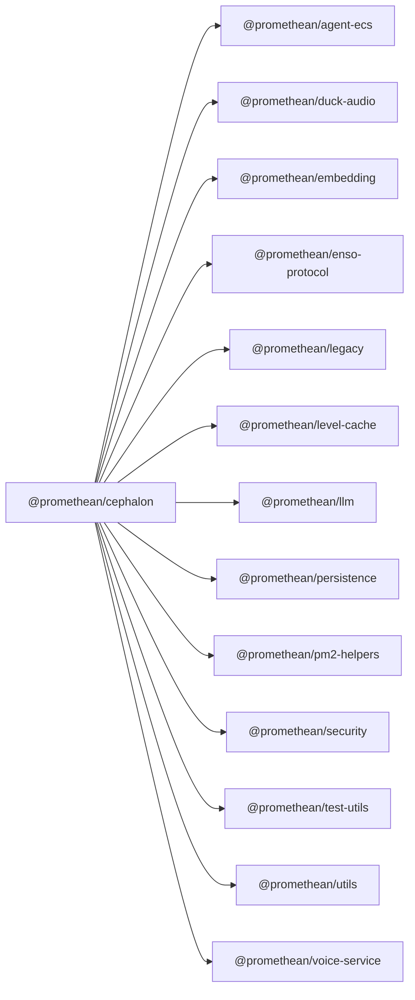

<!-- SYMPKG:PKG:BEGIN -->
# @promethean/cephalon
**Folder:** `packages/cephalon`  
**Version:** `0.0.1`  
**Domain:** `_root`

## Dependencies
- [@promethean/agent-ecs](../agent-ecs/README.md)
- [@promethean/duck-audio](../duck-audio/README.md)
- [@promethean/embedding](../embedding/README.md)
- [@promethean/enso-protocol](../enso-protocol/README.md)
- [@promethean/legacy](../legacy/README.md)
- [@promethean/level-cache](../level-cache/README.md)
- [@promethean/llm](../llm/README.md)
- [@promethean/persistence](../persistence/README.md)
- [@promethean/pm2-helpers](../pm2-helpers/README.md)
- [@promethean/security](../security/README.md)
- [@promethean/test-utils](../test-utils/README.md)
- [@promethean/utils](../utils/README.md)
- [@promethean/voice-service](../voice/README.md)
## Dependents
- _None_
<!-- SYMPKG:PKG:END -->