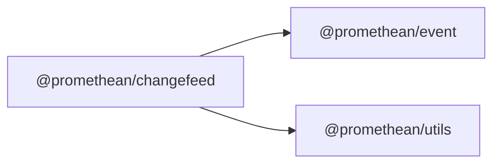

<!-- SYMPKG:PKG:BEGIN -->
# @promethean/changefeed
**Folder:** `packages/changefeed`  
**Version:** `0.0.1`  
**Domain:** `_root`

## Dependencies
- [@promethean/event](../event/README.md)
- [@promethean/utils](../utils/README.md)
## Dependents
- _None_
<!-- SYMPKG:PKG:END -->