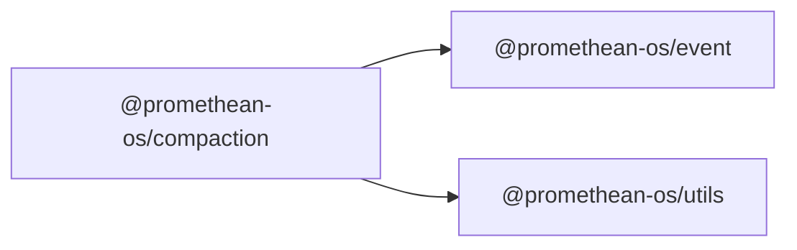

```
<!-- SYMPKG:PKG:BEGIN -->
```

# @promethean-os/compaction

```
**Folder:** `packages/compaction`
```

```
**Version:** `0.0.1`
```

```
**Domain:** `_root`
```



## Dependencies

- @promethean-os/event$../event/README.md
- @promethean-os/utils$../utils/README.md

## Dependents

- _None_

```


## 📁 Implementation

### Core Files

- [compactor.ts](../../../packages/compaction/src/compactor.ts)
- [tests/compactor.test.ts](../../../packages/compaction/src/tests/compactor.test.ts)

### Key Classes & Functions

- [DeferredImpl](../../../packages/compaction/src/tests/compactor.test.ts#L37)
- [startCompactor()](../../../packages/compaction/src/compactor.ts#L13)

### View Source

- [GitHub](https://github.com/promethean-ai/promethean/tree/main/packages/compaction/src)
- [VS Code](vscode://file/packages/compaction/src)


## 📚 API Reference

### Classes

#### [DeferredImpl](../../../packages/compaction/src/tests/compactor.test.ts#L37)

### Functions

#### [startCompactor()](../../../packages/compaction/src/compactor.ts#L13)


---

*Enhanced with code links via SYMPKG documentation enhancer*