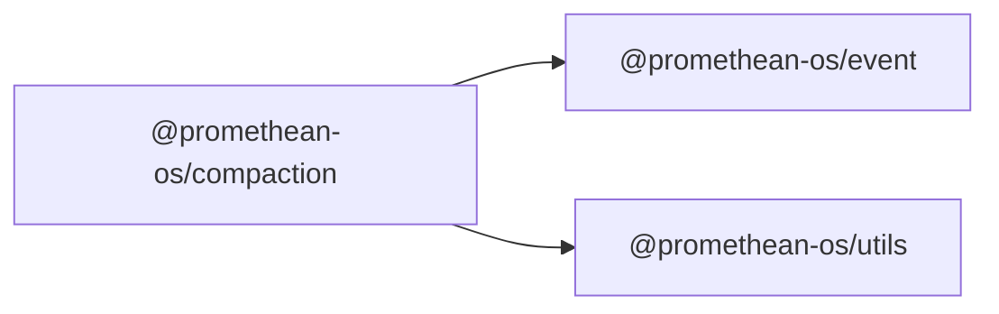

```
<!-- SYMPKG:PKG:BEGIN -->
```
# @promethean-os/compaction
```
**Folder:** `packages/compaction`
```
```
**Version:** `0.0.1`
```
```
**Domain:** `_root`
```

## Dependencies
- @promethean-os/event$../event/README.md
- @promethean-os/utils$../utils/README.md
## Dependents
- _None_
```


## 📁 Implementation

### Core Files

- [1](../../../packages/compaction/src/1)

### View Source

- [GitHub](https://github.com/promethean-ai/promethean/tree/main/packages/compaction/src)
- [VS Code](vscode://file/packages/compaction/src)


## 📚 API Reference

### Interfaces

#### [- **compactor.ts**](../../../packages/compaction/src/[src/compactor.ts](../../../packages/compaction/src/compactor.ts) (48 lines)#L1)

#### [- **tests/compactor.test.ts**](../../../packages/compaction/src/[src/tests/compactor.test.ts](../../../packages/compaction/src/tests/compactor.test.ts) (158 lines)#L1)

#### [- **DeferredImpl**](../../../packages/compaction/src/[DeferredImpl](../../../packages/compaction/src/tests/compactor.test.ts#L37)

#### [- **startCompactor()**](../../../packages/compaction/src/[startCompactor()](../../../packages/compaction/src/compactor.ts#L13)

#### [- **GitHub**](../../../packages/compaction/src/[View on GitHub](https#L1)

#### [- **VS Code**](../../../packages/compaction/src/[Open in VS Code](vscode#L1)

#### [**Location**](../../../packages/compaction/src/[DeferredImpl](../../../packages/compaction/src/tests/compactor.test.ts#L37)

#### [**Description**](../../../packages/compaction/src/Main class for deferredimpl functionality.#L1)

#### [**File**](../../../packages/compaction/src/`src/tests/compactor.test.ts`#L1)

#### [**Location**](../../../packages/compaction/src/[startCompactor()](../../../packages/compaction/src/compactor.ts#L13)

#### [**Description**](../../../packages/compaction/src/Key function for startcompactor operations.#L1)

#### [**File**](../../../packages/compaction/src/`src/compactor.ts`#L1)

#### [Code links saved to](../../../packages/compaction/src//home/err/devel/promethean/tmp/compaction-code-links.json#L1)


---

*Enhanced with code links via SYMPKG documentation enhancer*