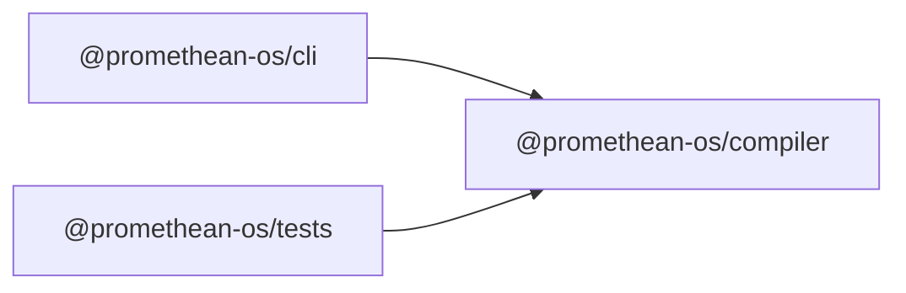

```
<!-- SYMPKG:PKG:BEGIN -->
```
# @promethean-os/compiler
```
**Folder:** `packages/compiler`
```
```
**Version:** `0.0.1`
```
```
**Domain:** `_root`
```

## Dependencies
- _None_
## Dependents
- @promethean-os/cli$../cli/README.md
- @promethean-os/tests$../tests/README.md
```


## 📁 Implementation

*Source code analysis not available*


## 📚 API Reference

### Classes

#### [-](../../../packages/compiler/src/**ast.ts**:#LNaN)

#### [-](../../../packages/compiler/src/**common.ts**:#LNaN)

#### [-](../../../packages/compiler/src/**compiler.test.ts**:#LNaN)

#### [-](../../../packages/compiler/src/**driver.ts**:#LNaN)

#### [-](../../../packages/compiler/src/**ir.ts**:#LNaN)

#### [-](../../../packages/compiler/src/**jsgen.ts**:#LNaN)

#### [-](../../../packages/compiler/src/**lexer.ts**:#LNaN)

#### [-](../../../packages/compiler/src/**lisp/driver.test.ts**:#LNaN)

#### [-](../../../packages/compiler/src/**lisp/driver.ts**:#LNaN)

#### [-](../../../packages/compiler/src/**lisp/expand.ts**:#LNaN)

#### [-](../../../packages/compiler/src/**lisp/js-ast2lisp.ts**:#LNaN)

#### [-](../../../packages/compiler/src/**lisp/js2lisp.ts**:#LNaN)

#### [-](../../../packages/compiler/src/**lisp/macros.ts**:#LNaN)

#### [-](../../../packages/compiler/src/**lisp/print.ts**:#LNaN)

#### [-](../../../packages/compiler/src/**lisp/qq.ts**:#LNaN)

#### [-](../../../packages/compiler/src/**lisp/reader.ts**:#LNaN)

#### [-](../../../packages/compiler/src/**lisp/syntax.ts**:#LNaN)

#### [-](../../../packages/compiler/src/**lisp/to-expr.ts**:#LNaN)

#### [-](../../../packages/compiler/src/**lisp/ts2lisp.test.ts**:#LNaN)

#### [-](../../../packages/compiler/src/**lisp/ts2lisp.ts**:#LNaN)

#### [-](../../../packages/compiler/src/**lower.ts**:#LNaN)

#### [-](../../../packages/compiler/src/**parser.ts**:#LNaN)

#### [-](../../../packages/compiler/src/**transform/transformer.ts**:#LNaN)

#### [-](../../../packages/compiler/src/**vm.ts**:#LNaN)

#### [-](../../../packages/compiler/src/**Diag**:#LNaN)

#### [-](../../../packages/compiler/src/**instantiation**:#LNaN)

#### [-](../../../packages/compiler/src/**definition**:#LNaN)

#### [-](../../../packages/compiler/src/**Point**:#LNaN)

#### [-](../../../packages/compiler/src/**MacroEnv**:#LNaN)

#### [-](../../../packages/compiler/src/**name()**:#LNaN)

#### [-](../../../packages/compiler/src/**spanMerge()**:#LNaN)

#### [-](../../../packages/compiler/src/**assert()**:#LNaN)

#### [-](../../../packages/compiler/src/**compileAndRun()**:#LNaN)

#### [-](../../../packages/compiler/src/**gensym()**:#LNaN)

#### [**Location**](../../../packages/compiler/src/[Diag](../../../packages/compiler/src/common.ts#L2)#L1)

#### [**File**](../../../packages/compiler/src/`src/common.ts`#L1)

#### [**Location**](../../../packages/compiler/src/[instantiation](../../../packages/compiler/src/lisp/driver.test.ts#L17)#L1)

#### [**File**](../../../packages/compiler/src/`src/lisp/driver.test.ts`#L1)

#### [**Location**](../../../packages/compiler/src/[definition](../../../packages/compiler/src/lisp/driver.test.ts#L19)#L1)

#### [**File**](../../../packages/compiler/src/`src/lisp/driver.test.ts`#L1)

#### [**Location**](../../../packages/compiler/src/[Point](../../../packages/compiler/src/lisp/driver.test.ts#L21)#L1)

#### [**File**](../../../packages/compiler/src/`src/lisp/driver.test.ts`#L1)

#### [**Location**](../../../packages/compiler/src/[MacroEnv](../../../packages/compiler/src/lisp/macros.ts#L5)#L1)

#### [**File**](../../../packages/compiler/src/`src/lisp/macros.ts`#L1)

#### [**Location**](../../../packages/compiler/src/[Parser](../../../packages/compiler/src/parser.ts#L12)#L1)

#### [**File**](../../../packages/compiler/src/`src/parser.ts`#L1)

#### [**Location**](../../../packages/compiler/src/[name()](../../../packages/compiler/src/ast.ts#L31)#L1)

#### [**File**](../../../packages/compiler/src/`src/ast.ts`#L1)

#### [**Location**](../../../packages/compiler/src/[spanMerge()](../../../packages/compiler/src/common.ts#L10)#L1)

#### [**File**](../../../packages/compiler/src/`src/common.ts`#L1)

#### [**Location**](../../../packages/compiler/src/[assert()](../../../packages/compiler/src/common.ts#L13)#L1)

#### [**File**](../../../packages/compiler/src/`src/common.ts`#L1)

#### [**Location**](../../../packages/compiler/src/[compileAndRun()](../../../packages/compiler/src/driver.ts#L5)#L1)

#### [**File**](../../../packages/compiler/src/`src/driver.ts`#L1)

#### [**Location**](../../../packages/compiler/src/[gensym()](../../../packages/compiler/src/ir.ts#L22)#L1)

#### [**File**](../../../packages/compiler/src/`src/ir.ts`#L1)

#### [**Location**](../../../packages/compiler/src/[emitJS()](../../../packages/compiler/src/jsgen.ts#L9)#L1)

#### [**File**](../../../packages/compiler/src/`src/jsgen.ts`#L1)

#### [**Location**](../../../packages/compiler/src/[lex()](../../../packages/compiler/src/lexer.ts#L9)#L1)

#### [**File**](../../../packages/compiler/src/`src/lexer.ts`#L1)

#### [**Location**](../../../packages/compiler/src/[compileLispToJS()](../../../packages/compiler/src/lisp/driver.ts#L8)#L1)

#### [**File**](../../../packages/compiler/src/`src/lisp/driver.ts`#L1)

#### [**Location**](../../../packages/compiler/src/[runLisp()](../../../packages/compiler/src/lisp/driver.ts#L23)#L1)

#### [**File**](../../../packages/compiler/src/`src/lisp/driver.ts`#L1)

#### [**Location**](../../../packages/compiler/src/[macroexpandAll()](../../../packages/compiler/src/lisp/expand.ts#L4)#L1)

#### [**File**](../../../packages/compiler/src/`src/lisp/expand.ts`#L1)

#### [**Location**](../../../packages/compiler/src/[estreeProgramToLisp()](../../../packages/compiler/src/lisp/js-ast2lisp.ts#L13)#L1)

#### [**File**](../../../packages/compiler/src/`src/lisp/js-ast2lisp.ts`#L1)

#### [**Location**](../../../packages/compiler/src/[jsToLisp()](../../../packages/compiler/src/lisp/js2lisp.ts#L4)#L1)

#### [**File**](../../../packages/compiler/src/`src/lisp/js2lisp.ts`#L1)

#### [**Location**](../../../packages/compiler/src/[installCoreMacros()](../../../packages/compiler/src/lisp/macros.ts#L19)#L1)

#### [**File**](../../../packages/compiler/src/`src/lisp/macros.ts`#L1)

#### [**Location**](../../../packages/compiler/src/[printS()](../../../packages/compiler/src/lisp/print.ts#L8)#L1)

#### [**File**](../../../packages/compiler/src/`src/lisp/print.ts`#L1)

#### [**Location**](../../../packages/compiler/src/[qq()](../../../packages/compiler/src/lisp/qq.ts#L3)#L1)

#### [**File**](../../../packages/compiler/src/`src/lisp/qq.ts`#L1)

#### [**Location**](../../../packages/compiler/src/[read()](../../../packages/compiler/src/lisp/reader.ts#L10)#L1)

#### [**File**](../../../packages/compiler/src/`src/lisp/reader.ts`#L1)

#### [**Location**](../../../packages/compiler/src/[nil()](../../../packages/compiler/src/lisp/syntax.ts#L11)#L1)

#### [**File**](../../../packages/compiler/src/`src/lisp/syntax.ts`#L1)

#### [**Location**](../../../packages/compiler/src/[sym()](../../../packages/compiler/src/lisp/syntax.ts#L12)#L1)

#### [**File**](../../../packages/compiler/src/`src/lisp/syntax.ts`#L1)

#### [**Location**](../../../packages/compiler/src/[list()](../../../packages/compiler/src/lisp/syntax.ts#L17)#L1)

#### [**File**](../../../packages/compiler/src/`src/lisp/syntax.ts`#L1)

#### [**Location**](../../../packages/compiler/src/[num()](../../../packages/compiler/src/lisp/syntax.ts#L18)#L1)

#### [**File**](../../../packages/compiler/src/`src/lisp/syntax.ts`#L1)

#### [**Location**](../../../packages/compiler/src/[str()](../../../packages/compiler/src/lisp/syntax.ts#L19)#L1)

#### [**File**](../../../packages/compiler/src/`src/lisp/syntax.ts`#L1)

#### [**Location**](../../../packages/compiler/src/[bool()](../../../packages/compiler/src/lisp/syntax.ts#L20)#L1)

#### [**File**](../../../packages/compiler/src/`src/lisp/syntax.ts`#L1)

#### [**Location**](../../../packages/compiler/src/[gensym()](../../../packages/compiler/src/lisp/syntax.ts#L23)#L1)

#### [**File**](../../../packages/compiler/src/`src/lisp/syntax.ts`#L1)

#### [**Location**](../../../packages/compiler/src/[symName()](../../../packages/compiler/src/lisp/syntax.ts#L26)#L1)

#### [**File**](../../../packages/compiler/src/`src/lisp/syntax.ts`#L1)

#### [**Location**](../../../packages/compiler/src/[isSym()](../../../packages/compiler/src/lisp/syntax.ts#L29)#L1)

#### [**File**](../../../packages/compiler/src/`src/lisp/syntax.ts`#L1)

#### [**Location**](../../../packages/compiler/src/[isList()](../../../packages/compiler/src/lisp/syntax.ts#L30)#L1)

#### [**File**](../../../packages/compiler/src/`src/lisp/syntax.ts`#L1)

#### [**Location**](../../../packages/compiler/src/[toExpr()](../../../packages/compiler/src/lisp/to-expr.ts#L10)#L1)

#### [**File**](../../../packages/compiler/src/`src/lisp/to-expr.ts`#L1)

#### [**Location**](../../../packages/compiler/src/[tsToLisp()](../../../packages/compiler/src/lisp/ts2lisp.ts#L15)#L1)

#### [**File**](../../../packages/compiler/src/`src/lisp/ts2lisp.ts`#L1)

#### [**Location**](../../../packages/compiler/src/[lower()](../../../packages/compiler/src/lower.ts#L4)#L1)

#### [**File**](../../../packages/compiler/src/`src/lower.ts`#L1)

#### [**Location**](../../../packages/compiler/src/[parse()](../../../packages/compiler/src/parser.ts#L214)#L1)

#### [**File**](../../../packages/compiler/src/`src/parser.ts`#L1)

#### [**Location**](../../../packages/compiler/src/[makeTransformer()](../../../packages/compiler/src/transform/transformer.ts#L68)#L1)

#### [**File**](../../../packages/compiler/src/`src/transform/transformer.ts`#L1)

#### [**Location**](../../../packages/compiler/src/[applyTransformer()](../../../packages/compiler/src/transform/transformer.ts#L124)#L1)

#### [**File**](../../../packages/compiler/src/`src/transform/transformer.ts`#L1)

#### [**Location**](../../../packages/compiler/src/[compileToBytecode()](../../../packages/compiler/src/vm.ts#L14)#L1)

#### [**File**](../../../packages/compiler/src/`src/vm.ts`#L1)

#### [**Location**](../../../packages/compiler/src/[runBytecode()](../../../packages/compiler/src/vm.ts#L69)#L1)

#### [**File**](../../../packages/compiler/src/`src/vm.ts`#L1)


---

*Enhanced with code links via automated documentation updater*