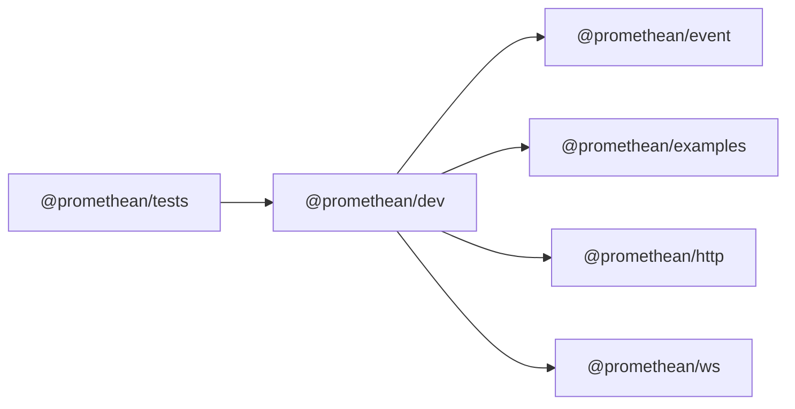

<!-- SYMPKG:PKG:BEGIN -->
# @promethean/dev
**Folder:** `packages/dev`  
**Version:** `0.0.1`  
**Domain:** `_root`

## Dependencies
- [@promethean/event](../event/README.md)
- [@promethean/examples](../examples/README.md)
- [@promethean/http](../http/README.md)
- [@promethean/ws](../ws/README.md)
## Dependents
- [@promethean/tests](../tests/README.md)
<!-- SYMPKG:PKG:END -->