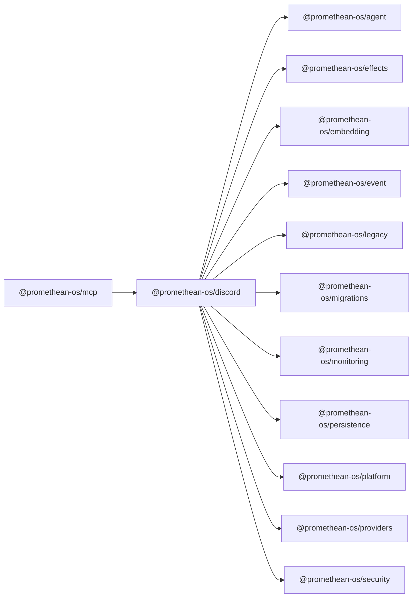

```
<!-- SYMPKG:PKG:BEGIN -->
```
# @promethean-os/discord
```
**Folder:** `packages/discord`
```
```
**Version:** `0.0.1`
```
```
**Domain:** `_root`
```

## Dependencies
- @promethean-os/agent$../agent/README.md
- @promethean-os/effects$../effects/README.md
- @promethean-os/embedding$../embedding/README.md
- @promethean-os/event$../event/README.md
- @promethean-os/legacy$../legacy/README.md
- @promethean-os/migrations$../migrations/README.md
- @promethean-os/monitoring$../monitoring/README.md
- @promethean-os/persistence$../persistence/README.md
- @promethean-os/platform$../platform/README.md
- @promethean-os/providers$../providers/README.md
- @promethean-os/security$../security/README.md
## Dependents
- @promethean-os/mcp$../mcp/README.md
```


## 📁 Implementation

### Core Files

- [13](../../../packages/discord/src/13)

### View Source

- [GitHub](https://github.com/promethean-ai/promethean/tree/main/packages/discord/src)
- [VS Code](vscode://file/packages/discord/src)


## 📚 API Reference

### Interfaces

#### [- **attachment-indexer/index.ts**](../../../packages/discord/src/[src/attachment-indexer/index.ts](../../../packages/discord/src/attachment-indexer/index.ts) (46 lines)#L1)

#### [- **automod/automod.ts**](../../../packages/discord/src/[src/automod/automod.ts](../../../packages/discord/src/automod/automod.ts) (427 lines)#L1)

#### [- **automod/index.ts**](../../../packages/discord/src/[src/automod/index.ts](../../../packages/discord/src/automod/index.ts) (19 lines)#L1)

#### [- **embedder/converter.ts**](../../../packages/discord/src/[src/embedder/converter.ts](../../../packages/discord/src/embedder/converter.ts) (4 lines)#L1)

#### [- **embedder/index.ts**](../../../packages/discord/src/[src/embedder/index.ts](../../../packages/discord/src/embedder/index.ts) (98 lines)#L1)

#### [- **gateway/gateway.ts**](../../../packages/discord/src/[src/gateway/gateway.ts](../../../packages/discord/src/gateway/gateway.ts) (23 lines)#L1)

#### [- **gateway/index.ts**](../../../packages/discord/src/[src/gateway/index.ts](../../../packages/discord/src/gateway/index.ts) (55 lines)#L1)

#### [- **index.ts**](../../../packages/discord/src/[src/index.ts](../../../packages/discord/src/index.ts) (8 lines)#L1)

#### [- **message-embedder/index.ts**](../../../packages/discord/src/[src/message-embedder/index.ts](../../../packages/discord/src/message-embedder/index.ts) (55 lines)#L1)

#### [- **message-indexer/index.ts**](../../../packages/discord/src/[src/message-indexer/index.ts](../../../packages/discord/src/message-indexer/index.ts) (57 lines)#L1)

#### [- **rest/index.ts**](../../../packages/discord/src/[src/rest/index.ts](../../../packages/discord/src/rest/index.ts) (43 lines)#L1)

#### [- **rest/rest.ts**](../../../packages/discord/src/[src/rest/rest.ts](../../../packages/discord/src/rest/rest.ts) (182 lines)#L1)

#### [- **tests/attachments.test.ts**](../../../packages/discord/src/[src/tests/attachments.test.ts](../../../packages/discord/src/tests/attachments.test.ts) (26 lines)#L1)

#### [- **tests/automod.test.ts**](../../../packages/discord/src/[src/tests/automod.test.ts](../../../packages/discord/src/tests/automod.test.ts) (78 lines)#L1)

#### [- **tests/converter.test.ts**](../../../packages/discord/src/[src/tests/converter.test.ts](../../../packages/discord/src/tests/converter.test.ts) (10 lines)#L1)

#### [- **tests/embedding.test.ts**](../../../packages/discord/src/[src/tests/embedding.test.ts](../../../packages/discord/src/tests/embedding.test.ts) (24 lines)#L1)

#### [- **tests/flow.test.ts**](../../../packages/discord/src/[src/tests/flow.test.ts](../../../packages/discord/src/tests/flow.test.ts) (77 lines)#L1)

#### [- **tests/gateway.test.ts**](../../../packages/discord/src/[src/tests/gateway.test.ts](../../../packages/discord/src/tests/gateway.test.ts) (38 lines)#L1)

#### [- **tests/message-embedder.test.ts**](../../../packages/discord/src/[src/tests/message-embedder.test.ts](../../../packages/discord/src/tests/message-embedder.test.ts) (33 lines)#L1)

#### [- **tests/message-indexer.test.ts**](../../../packages/discord/src/[src/tests/message-indexer.test.ts](../../../packages/discord/src/tests/message-indexer.test.ts) (20 lines)#L1)

#### [- **tests/rest.test.ts**](../../../packages/discord/src/[src/tests/rest.test.ts](../../../packages/discord/src/tests/rest.test.ts) (69 lines)#L1)

#### [- **tests/test.ts**](../../../packages/discord/src/[src/tests/test.ts](../../../packages/discord/src/tests/test.ts) (6 lines)#L1)

#### [- **TextNaiveBayes**](../../../packages/discord/src/[TextNaiveBayes](../../../packages/discord/src/automod/automod.ts#L23)

#### [- **GatewayPublisher**](../../../packages/discord/src/[GatewayPublisher](../../../packages/discord/src/gateway/gateway.ts#L5)

#### [- **DiscordRestProxy**](../../../packages/discord/src/[DiscordRestProxy](../../../packages/discord/src/rest/rest.ts#L17)

#### [- **handleSocialMessageCreated()**](../../../packages/discord/src/[handleSocialMessageCreated()](../../../packages/discord/src/attachment-indexer/index.ts#L4)

#### [- **DEFAULT_FUZZY_DISTANCE()**](../../../packages/discord/src/[DEFAULT_FUZZY_DISTANCE()](../../../packages/discord/src/automod/automod.ts#L155)

#### [- **DEFAULT_MINIMUM_EXAMPLES()**](../../../packages/discord/src/[DEFAULT_MINIMUM_EXAMPLES()](../../../packages/discord/src/automod/automod.ts#L156)

#### [- **toAutomodMessage()**](../../../packages/discord/src/[toAutomodMessage()](../../../packages/discord/src/automod/automod.ts#L158)

#### [- **containsSora()**](../../../packages/discord/src/[containsSora()](../../../packages/discord/src/automod/automod.ts#L230)

#### [- **GitHub**](../../../packages/discord/src/[View on GitHub](https#L1)

#### [- **VS Code**](../../../packages/discord/src/[Open in VS Code](vscode#L1)

#### [**Location**](../../../packages/discord/src/[TextNaiveBayes](../../../packages/discord/src/automod/automod.ts#L23)

#### [**Description**](../../../packages/discord/src/Main class for textnaivebayes functionality.#L1)

#### [**File**](../../../packages/discord/src/`src/automod/automod.ts`#L1)

#### [**Location**](../../../packages/discord/src/[GatewayPublisher](../../../packages/discord/src/gateway/gateway.ts#L5)

#### [**Description**](../../../packages/discord/src/Main class for gatewaypublisher functionality.#L1)

#### [**File**](../../../packages/discord/src/`src/gateway/gateway.ts`#L1)

#### [**Location**](../../../packages/discord/src/[DiscordRestProxy](../../../packages/discord/src/rest/rest.ts#L17)

#### [**Description**](../../../packages/discord/src/Main class for discordrestproxy functionality.#L1)

#### [**File**](../../../packages/discord/src/`src/rest/rest.ts`#L1)

#### [**Location**](../../../packages/discord/src/[handleSocialMessageCreated()](../../../packages/discord/src/attachment-indexer/index.ts#L4)

#### [**Description**](../../../packages/discord/src/Key function for handlesocialmessagecreated operations.#L1)

#### [**File**](../../../packages/discord/src/`src/attachment-indexer/index.ts`#L1)

#### [**Location**](../../../packages/discord/src/[DEFAULT_FUZZY_DISTANCE()](../../../packages/discord/src/automod/automod.ts#L155)

#### [**Description**](../../../packages/discord/src/Key function for default_fuzzy_distance operations.#L1)

#### [**File**](../../../packages/discord/src/`src/automod/automod.ts`#L1)

#### [**Location**](../../../packages/discord/src/[DEFAULT_MINIMUM_EXAMPLES()](../../../packages/discord/src/automod/automod.ts#L156)

#### [**Description**](../../../packages/discord/src/Key function for default_minimum_examples operations.#L1)

#### [**File**](../../../packages/discord/src/`src/automod/automod.ts`#L1)

#### [**Location**](../../../packages/discord/src/[toAutomodMessage()](../../../packages/discord/src/automod/automod.ts#L158)

#### [**Description**](../../../packages/discord/src/Key function for toautomodmessage operations.#L1)

#### [**File**](../../../packages/discord/src/`src/automod/automod.ts`#L1)

#### [**Location**](../../../packages/discord/src/[containsSora()](../../../packages/discord/src/automod/automod.ts#L230)

#### [**Description**](../../../packages/discord/src/Key function for containssora operations.#L1)

#### [**File**](../../../packages/discord/src/`src/automod/automod.ts`#L1)

#### [**Location**](../../../packages/discord/src/[hasFuzzyCode()](../../../packages/discord/src/automod/automod.ts#L232)

#### [**Description**](../../../packages/discord/src/Key function for hasfuzzycode operations.#L1)

#### [**File**](../../../packages/discord/src/`src/automod/automod.ts`#L1)

#### [**Location**](../../../packages/discord/src/[createAutomod()](../../../packages/discord/src/automod/automod.ts#L273)

#### [**Description**](../../../packages/discord/src/Key function for createautomod operations.#L1)

#### [**File**](../../../packages/discord/src/`src/automod/automod.ts`#L1)

#### [**Location**](../../../packages/discord/src/[convert()](../../../packages/discord/src/embedder/converter.ts#L1)

#### [**Description**](../../../packages/discord/src/Key function for convert operations.#L1)

#### [**File**](../../../packages/discord/src/`src/embedder/converter.ts`#L1)

#### [**Location**](../../../packages/discord/src/[embedMessage()](../../../packages/discord/src/message-embedder/index.ts#L16)

#### [**Description**](../../../packages/discord/src/Key function for embedmessage operations.#L1)

#### [**File**](../../../packages/discord/src/`src/message-embedder/index.ts`#L1)

#### [**Location**](../../../packages/discord/src/[handleSocialMessageCreated()](../../../packages/discord/src/message-indexer/index.ts#L4)

#### [**Description**](../../../packages/discord/src/Key function for handlesocialmessagecreated operations.#L1)

#### [**File**](../../../packages/discord/src/`src/message-indexer/index.ts`#L1)

#### [**Location**](../../../packages/discord/src/[getChannelId()](../../../packages/discord/src/rest/rest.ts#L12)

#### [**Description**](../../../packages/discord/src/Key function for getchannelid operations.#L1)

#### [**File**](../../../packages/discord/src/`src/rest/rest.ts`#L1)

#### [Code links saved to](../../../packages/discord/src//home/err/devel/promethean/tmp/discord-code-links.json#L1)


---

*Enhanced with code links via SYMPKG documentation enhancer*