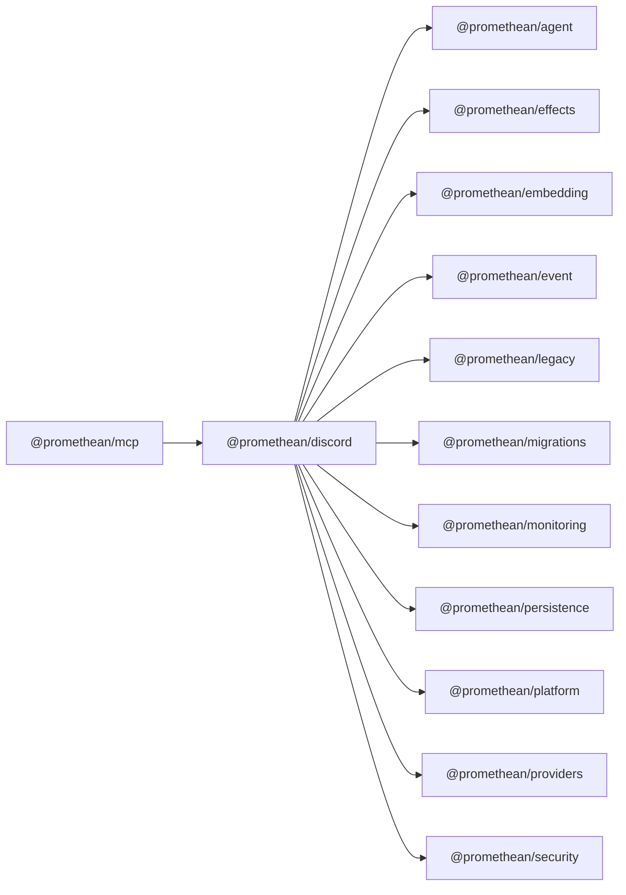

```
<!-- SYMPKG:PKG:BEGIN -->
```
# @promethean/discord
```
**Folder:** `packages/discord`
```
```
**Version:** `0.0.1`
```
```
**Domain:** `_root`
```

## Dependencies
- @promethean/agent$../agent/README.md
- @promethean/effects$../effects/README.md
- @promethean/embedding$../embedding/README.md
- @promethean/event$../event/README.md
- @promethean/legacy$../legacy/README.md
- @promethean/migrations$../migrations/README.md
- @promethean/monitoring$../monitoring/README.md
- @promethean/persistence$../persistence/README.md
- @promethean/platform$../platform/README.md
- @promethean/providers$../providers/README.md
- @promethean/security$../security/README.md
## Dependents
- @promethean/mcp$../mcp/README.md
```
<!-- SYMPKG:PKG:END -->
```