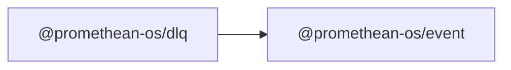

```
<!-- SYMPKG:PKG:BEGIN -->
```
# @promethean-os/dlq
```
**Folder:** `packages/dlq`
```
```
**Version:** `0.0.1`
```
```
**Domain:** `_root`
```

## Dependencies
- @promethean-os/event$../event/README.md
## Dependents
- _None_
```


## 📁 Implementation

### Core Files

- [4](../../../packages/dlq/src/4)

### View Source

- [GitHub](https://github.com/promethean-ai/promethean/tree/main/packages/dlq/src)
- [VS Code](vscode://file/packages/dlq/src)


## 📚 API Reference

### Interfaces

#### [- **replay.ts**](../../../packages/dlq/src/[src/replay.ts](../../../packages/dlq/src/replay.ts) (24 lines)#L1)

#### [- **subscribe.ts**](../../../packages/dlq/src/[src/subscribe.ts](../../../packages/dlq/src/subscribe.ts) (38 lines)#L1)

#### [- **tests/with-dlq.test.ts**](../../../packages/dlq/src/[src/tests/with-dlq.test.ts](../../../packages/dlq/src/tests/with-dlq.test.ts) (113 lines)#L1)

#### [- **types.ts**](../../../packages/dlq/src/[src/types.ts](../../../packages/dlq/src/types.ts) (11 lines)#L1)

#### [- **replayDLQ()**](../../../packages/dlq/src/[replayDLQ()](../../../packages/dlq/src/replay.ts#L4)

#### [- **withDLQ()**](../../../packages/dlq/src/[withDLQ()](../../../packages/dlq/src/subscribe.ts#L4)

#### [- **DLQ_TOPIC_PREFIX()**](../../../packages/dlq/src/[DLQ_TOPIC_PREFIX()](../../../packages/dlq/src/types.ts#L9)

#### [- **dlqTopic()**](../../../packages/dlq/src/[dlqTopic()](../../../packages/dlq/src/types.ts#L10)

#### [- **GitHub**](../../../packages/dlq/src/[View on GitHub](https#L1)

#### [- **VS Code**](../../../packages/dlq/src/[Open in VS Code](vscode#L1)

#### [**Location**](../../../packages/dlq/src/[replayDLQ()](../../../packages/dlq/src/replay.ts#L4)

#### [**Description**](../../../packages/dlq/src/Key function for replaydlq operations.#L1)

#### [**File**](../../../packages/dlq/src/`src/replay.ts`#L1)

#### [**Location**](../../../packages/dlq/src/[withDLQ()](../../../packages/dlq/src/subscribe.ts#L4)

#### [**Description**](../../../packages/dlq/src/Key function for withdlq operations.#L1)

#### [**File**](../../../packages/dlq/src/`src/subscribe.ts`#L1)

#### [**Location**](../../../packages/dlq/src/[DLQ_TOPIC_PREFIX()](../../../packages/dlq/src/types.ts#L9)

#### [**Description**](../../../packages/dlq/src/Key function for dlq_topic_prefix operations.#L1)

#### [**File**](../../../packages/dlq/src/`src/types.ts`#L1)

#### [**Location**](../../../packages/dlq/src/[dlqTopic()](../../../packages/dlq/src/types.ts#L10)

#### [**Description**](../../../packages/dlq/src/Key function for dlqtopic operations.#L1)

#### [**File**](../../../packages/dlq/src/`src/types.ts`#L1)

#### [Code links saved to](../../../packages/dlq/src//home/err/devel/promethean/tmp/dlq-code-links.json#L1)


---

*Enhanced with code links via SYMPKG documentation enhancer*