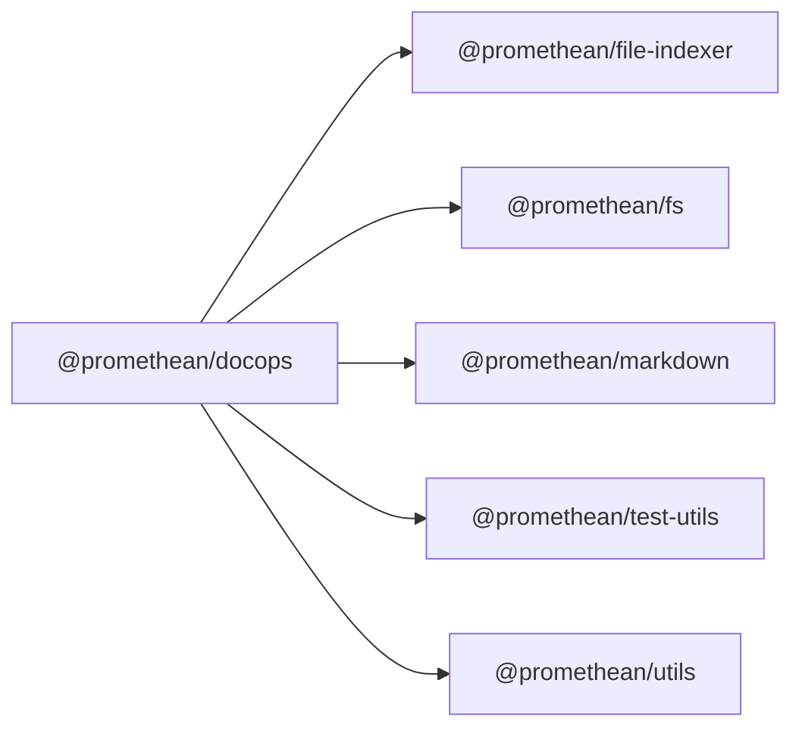

$$
<!-- SYMPKG:PKG:BEGIN -->
$$
# @promethean/docops
$$
**Folder:** `packages/docops`
$$
$$
**Version:** `0.0.0`
$$
$$
**Domain:** `_root`
$$

## Dependencies
- $@promethean/file-indexer$$../file-indexer/README.md$
- $@promethean/fs$$../fs/README.md$
- $@promethean/markdown$$../markdown/README.md$
- $@promethean/test-utils$$../test-utils/README.md$
- $@promethean/utils$$../utils/README.md$
## Dependents
- _None_
$$
<!-- SYMPKG:PKG:END -->
$$