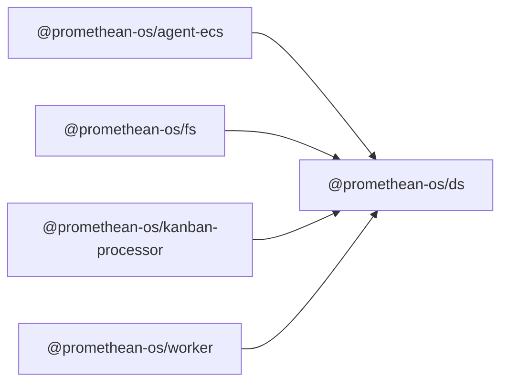

```
<!-- SYMPKG:PKG:BEGIN -->
```
# @promethean-os/ds
```
**Folder:** `packages/ds`
```
```
**Version:** `0.0.1`
```
```
**Domain:** `_root`
```

## Dependencies
- _None_
## Dependents
- @promethean-os/agent-ecs$../agent-ecs/README.md
- @promethean-os/fs$../fs/README.md
- @promethean-os/kanban-processor$../kanban-processor/README.md
- @promethean-os/worker$../worker/README.md
```


## 📁 Implementation

### Core Files

- [64](../../../packages/ds/src/64)

### View Source

- [GitHub](https://github.com/promethean-ai/promethean/tree/main/packages/ds/src)
- [VS Code](vscode://file/packages/ds/src)


## 📚 API Reference

### Interfaces

#### [- **bst.test.ts**](../../../packages/ds/src/[src/bst.test.ts](../../../packages/ds/src/bst.test.ts) (40 lines)#L1)

#### [- **bst.ts**](../../../packages/ds/src/[src/bst.ts](../../../packages/ds/src/bst.ts) (390 lines)#L1)

#### [- **command-buffer-functional.ts**](../../../packages/ds/src/[src/command-buffer-functional.ts](../../../packages/ds/src/command-buffer-functional.ts) (97 lines)#L1)

#### [- **ecs.doublebuffer.behavior.test.ts**](../../../packages/ds/src/[src/ecs.doublebuffer.behavior.test.ts](../../../packages/ds/src/ecs.doublebuffer.behavior.test.ts) (92 lines)#L1)

#### [- **ecs.prefab.test.ts**](../../../packages/ds/src/[src/ecs.prefab.test.ts](../../../packages/ds/src/ecs.prefab.test.ts) (28 lines)#L1)

#### [- **ecs.prefab.ts**](../../../packages/ds/src/[src/ecs.prefab.ts](../../../packages/ds/src/ecs.prefab.ts) (33 lines)#L1)

#### [- **ecs.scheduler.test.ts**](../../../packages/ds/src/[src/ecs.scheduler.test.ts](../../../packages/ds/src/ecs.scheduler.test.ts) (69 lines)#L1)

#### [- **ecs.scheduler.ts**](../../../packages/ds/src/[src/ecs.scheduler.ts](../../../packages/ds/src/ecs.scheduler.ts) (307 lines)#L1)

#### [- **ecs.test.ts**](../../../packages/ds/src/[src/ecs.test.ts](../../../packages/ds/src/ecs.test.ts) (24 lines)#L1)

#### [- **ecs.ts**](../../../packages/ds/src/[src/ecs.ts](../../../packages/ds/src/ecs.ts) (754 lines)#L1)

#### [- **fsm-test.ts**](../../../packages/ds/src/[src/fsm-test.ts](../../../packages/ds/src/fsm-test.ts) (112 lines)#L1)

#### [- **fsm.ts**](../../../packages/ds/src/[src/fsm.ts](../../../packages/ds/src/fsm.ts) (647 lines)#L1)

#### [- **graph.test.ts**](../../../packages/ds/src/[src/graph.test.ts](../../../packages/ds/src/graph.test.ts) (26 lines)#L1)

#### [- **graph.ts**](../../../packages/ds/src/[src/graph.ts](../../../packages/ds/src/graph.ts) (474 lines)#L1)

#### [- **index.ts**](../../../packages/ds/src/[src/index.ts](../../../packages/ds/src/index.ts) (41 lines)#L1)

#### [- **system.ts**](../../../packages/ds/src/[src/system.ts](../../../packages/ds/src/system.ts) (234 lines)#L1)

#### [- **world-functional.ts**](../../../packages/ds/src/[src/world-functional.ts](../../../packages/ds/src/world-functional.ts) (289 lines)#L1)

#### [- **with**](../../../packages/ds/src/[with](../../../packages/ds/src/bst.ts#L26)

#### [- **MutableContainer**](../../../packages/ds/src/[MutableContainer](../../../packages/ds/src/bst.ts#L27)

#### [- **Node**](../../../packages/ds/src/[Node](../../../packages/ds/src/bst.ts#L69)

#### [- **AVLTree**](../../../packages/ds/src/[AVLTree](../../../packages/ds/src/bst.ts#L82)

#### [- **ResourceBag**](../../../packages/ds/src/[ResourceBag](../../../packages/ds/src/ecs.scheduler.ts#L57)

#### [- **defaultCmp()**](../../../packages/ds/src/[defaultCmp()](../../../packages/ds/src/bst.ts#L6)

#### [- **BST()**](../../../packages/ds/src/[BST()](../../../packages/ds/src/bst.ts#L389)

#### [- **createCommandBufferState()**](../../../packages/ds/src/[createCommandBufferState()](../../../packages/ds/src/command-buffer-functional.ts#L17)

#### [- **createEntityCommand()**](../../../packages/ds/src/[createEntityCommand()](../../../packages/ds/src/command-buffer-functional.ts#L23)

#### [- **destroyEntityCommand()**](../../../packages/ds/src/[destroyEntityCommand()](../../../packages/ds/src/command-buffer-functional.ts#L42)

#### [- **GitHub**](../../../packages/ds/src/[View on GitHub](https#L1)

#### [- **VS Code**](../../../packages/ds/src/[Open in VS Code](vscode#L1)

#### [**Location**](../../../packages/ds/src/[with](../../../packages/ds/src/bst.ts#L26)

#### [**Description**](../../../packages/ds/src/Main class for with functionality.#L1)

#### [**File**](../../../packages/ds/src/`src/bst.ts`#L1)

#### [**Location**](../../../packages/ds/src/[MutableContainer](../../../packages/ds/src/bst.ts#L27)

#### [**Description**](../../../packages/ds/src/Main class for mutablecontainer functionality.#L1)

#### [**File**](../../../packages/ds/src/`src/bst.ts`#L1)

#### [**Location**](../../../packages/ds/src/[Node](../../../packages/ds/src/bst.ts#L69)

#### [**Description**](../../../packages/ds/src/Main class for node functionality.#L1)

#### [**File**](../../../packages/ds/src/`src/bst.ts`#L1)

#### [**Location**](../../../packages/ds/src/[AVLTree](../../../packages/ds/src/bst.ts#L82)

#### [**Description**](../../../packages/ds/src/Main class for avltree functionality.#L1)

#### [**File**](../../../packages/ds/src/`src/bst.ts`#L1)

#### [**Location**](../../../packages/ds/src/[ResourceBag](../../../packages/ds/src/ecs.scheduler.ts#L57)

#### [**Description**](../../../packages/ds/src/Main class for resourcebag functionality.#L1)

#### [**File**](../../../packages/ds/src/`src/ecs.scheduler.ts`#L1)

#### [**Location**](../../../packages/ds/src/[Scheduler](../../../packages/ds/src/ecs.scheduler.ts#L77)

#### [**Description**](../../../packages/ds/src/Main class for scheduler functionality.#L1)

#### [**File**](../../../packages/ds/src/`src/ecs.scheduler.ts`#L1)

#### [**Location**](../../../packages/ds/src/[Archetype](../../../packages/ds/src/ecs.ts#L36)

#### [**Description**](../../../packages/ds/src/Main class for archetype functionality.#L1)

#### [**File**](../../../packages/ds/src/`src/ecs.ts`#L1)

#### [**Location**](../../../packages/ds/src/[World](../../../packages/ds/src/ecs.ts#L93)

#### [**Description**](../../../packages/ds/src/Main class for world functionality.#L1)

#### [**File**](../../../packages/ds/src/`src/ecs.ts`#L1)

#### [**Location**](../../../packages/ds/src/[is](../../../packages/ds/src/ecs.ts#L481)

#### [**Description**](../../../packages/ds/src/Main class for is functionality.#L1)

#### [**File**](../../../packages/ds/src/`src/ecs.ts`#L1)

#### [**Location**](../../../packages/ds/src/[CommandBuffer](../../../packages/ds/src/ecs.ts#L483)

#### [**Description**](../../../packages/ds/src/Main class for commandbuffer functionality.#L1)

#### [**File**](../../../packages/ds/src/`src/ecs.ts`#L1)

#### [**Location**](../../../packages/ds/src/[is](../../../packages/ds/src/ecs.ts#L566)

#### [**Description**](../../../packages/ds/src/Main class for is functionality.#L1)

#### [**File**](../../../packages/ds/src/`src/ecs.ts`#L1)

#### [**Location**](../../../packages/ds/src/[WorldWrapper](../../../packages/ds/src/ecs.ts#L568)

#### [**Description**](../../../packages/ds/src/Main class for worldwrapper functionality.#L1)

#### [**File**](../../../packages/ds/src/`src/ecs.ts`#L1)

#### [**Location**](../../../packages/ds/src/[FSMGraph](../../../packages/ds/src/fsm.ts#L59)

#### [**Description**](../../../packages/ds/src/Main class for fsmgraph functionality.#L1)

#### [**File**](../../../packages/ds/src/`src/fsm.ts`#L1)

#### [**Location**](../../../packages/ds/src/[Graph](../../../packages/ds/src/graph.ts#L41)

#### [**Description**](../../../packages/ds/src/Main class for graph functionality.#L1)

#### [**File**](../../../packages/ds/src/`src/graph.ts`#L1)

#### [**Location**](../../../packages/ds/src/[MinHeap](../../../packages/ds/src/graph.ts#L426)

#### [**Description**](../../../packages/ds/src/Main class for minheap functionality.#L1)

#### [**File**](../../../packages/ds/src/`src/graph.ts`#L1)

#### [**Location**](../../../packages/ds/src/[Pool](../../../packages/ds/src/system.ts#L165)

#### [**Description**](../../../packages/ds/src/Main class for pool functionality.#L1)

#### [**File**](../../../packages/ds/src/`src/system.ts`#L1)

#### [**Location**](../../../packages/ds/src/[EntityRef](../../../packages/ds/src/system.ts#L177)

#### [**Description**](../../../packages/ds/src/Main class for entityref functionality.#L1)

#### [**File**](../../../packages/ds/src/`src/system.ts`#L1)

#### [**Location**](../../../packages/ds/src/[dynamically](../../../packages/ds/src/world-functional.ts#L12)

#### [**Description**](../../../packages/ds/src/Main class for dynamically functionality.#L1)

#### [**File**](../../../packages/ds/src/`src/world-functional.ts`#L1)

#### [**Location**](../../../packages/ds/src/[defaultCmp()](../../../packages/ds/src/bst.ts#L6)

#### [**Description**](../../../packages/ds/src/Key function for defaultcmp operations.#L1)

#### [**File**](../../../packages/ds/src/`src/bst.ts`#L1)

#### [**Location**](../../../packages/ds/src/[BST()](../../../packages/ds/src/bst.ts#L389)

#### [**Description**](../../../packages/ds/src/Key function for bst operations.#L1)

#### [**File**](../../../packages/ds/src/`src/bst.ts`#L1)

#### [**Location**](../../../packages/ds/src/[createCommandBufferState()](../../../packages/ds/src/command-buffer-functional.ts#L17)

#### [**Description**](../../../packages/ds/src/Key function for createcommandbufferstate operations.#L1)

#### [**File**](../../../packages/ds/src/`src/command-buffer-functional.ts`#L1)

#### [**Location**](../../../packages/ds/src/[createEntityCommand()](../../../packages/ds/src/command-buffer-functional.ts#L23)

#### [**Description**](../../../packages/ds/src/Key function for createentitycommand operations.#L1)

#### [**File**](../../../packages/ds/src/`src/command-buffer-functional.ts`#L1)

#### [**Location**](../../../packages/ds/src/[destroyEntityCommand()](../../../packages/ds/src/command-buffer-functional.ts#L42)

#### [**Description**](../../../packages/ds/src/Key function for destroyentitycommand operations.#L1)

#### [**File**](../../../packages/ds/src/`src/command-buffer-functional.ts`#L1)

#### [**Location**](../../../packages/ds/src/[addComponentCommand()](../../../packages/ds/src/command-buffer-functional.ts#L48)

#### [**Description**](../../../packages/ds/src/Key function for addcomponentcommand operations.#L1)

#### [**File**](../../../packages/ds/src/`src/command-buffer-functional.ts`#L1)

#### [**Location**](../../../packages/ds/src/[removeComponentCommand()](../../../packages/ds/src/command-buffer-functional.ts#L59)

#### [**Description**](../../../packages/ds/src/Key function for removecomponentcommand operations.#L1)

#### [**File**](../../../packages/ds/src/`src/command-buffer-functional.ts`#L1)

#### [**Location**](../../../packages/ds/src/[setComponentCommand()](../../../packages/ds/src/command-buffer-functional.ts#L69)

#### [**Description**](../../../packages/ds/src/Key function for setcomponentcommand operations.#L1)

#### [**File**](../../../packages/ds/src/`src/command-buffer-functional.ts`#L1)

#### [**Location**](../../../packages/ds/src/[flushCommands()](../../../packages/ds/src/command-buffer-functional.ts#L80)

#### [**Description**](../../../packages/ds/src/Key function for flushcommands operations.#L1)

#### [**File**](../../../packages/ds/src/`src/command-buffer-functional.ts`#L1)

#### [**Location**](../../../packages/ds/src/[createEntityImmediate()](../../../packages/ds/src/command-buffer-functional.ts#L89)

#### [**Description**](../../../packages/ds/src/Key function for createentityimmediate operations.#L1)

#### [**File**](../../../packages/ds/src/`src/command-buffer-functional.ts`#L1)

#### [**Location**](../../../packages/ds/src/[makeBlueprint()](../../../packages/ds/src/ecs.prefab.ts#L14)

#### [**Description**](../../../packages/ds/src/Key function for makeblueprint operations.#L1)

#### [**File**](../../../packages/ds/src/`src/ecs.prefab.ts`#L1)

#### [**Location**](../../../packages/ds/src/[spawn()](../../../packages/ds/src/ecs.prefab.ts#L18)

#### [**Description**](../../../packages/ds/src/Key function for spawn operations.#L1)

#### [**File**](../../../packages/ds/src/`src/ecs.prefab.ts`#L1)

#### [**Location**](../../../packages/ds/src/[DEFAULT_STAGE_ORDER()](../../../packages/ds/src/ecs.scheduler.ts#L8)

#### [**Description**](../../../packages/ds/src/Key function for default_stage_order operations.#L1)

#### [**File**](../../../packages/ds/src/`src/ecs.scheduler.ts`#L1)

#### [**Location**](../../../packages/ds/src/[createFSMGraph()](../../../packages/ds/src/graph.ts#L343)

#### [**Description**](../../../packages/ds/src/Key function for createfsmgraph operations.#L1)

#### [**File**](../../../packages/ds/src/`src/graph.ts`#L1)

#### [**Location**](../../../packages/ds/src/[validateFSMStructure()](../../../packages/ds/src/graph.ts#L352)

#### [**Description**](../../../packages/ds/src/Key function for validatefsmstructure operations.#L1)

#### [**File**](../../../packages/ds/src/`src/graph.ts`#L1)

#### [**Location**](../../../packages/ds/src/[graphToMermaid()](../../../packages/ds/src/graph.ts#L394)

#### [**Description**](../../../packages/ds/src/Key function for graphtomermaid operations.#L1)

#### [**File**](../../../packages/ds/src/`src/graph.ts`#L1)

#### [**Location**](../../../packages/ds/src/[makeStrictSystem()](../../../packages/ds/src/system.ts#L91)

#### [**Description**](../../../packages/ds/src/Key function for makestrictsystem operations.#L1)

#### [**File**](../../../packages/ds/src/`src/system.ts`#L1)

#### [**Location**](../../../packages/ds/src/[assertDisjointOwnership()](../../../packages/ds/src/system.ts#L129)

#### [**Description**](../../../packages/ds/src/Key function for assertdisjointownership operations.#L1)

#### [**File**](../../../packages/ds/src/`src/system.ts`#L1)

#### [**Location**](../../../packages/ds/src/[defineNumericComponent()](../../../packages/ds/src/system.ts#L156)

#### [**Description**](../../../packages/ds/src/Key function for definenumericcomponent operations.#L1)

#### [**File**](../../../packages/ds/src/`src/system.ts`#L1)

#### [**Location**](../../../packages/ds/src/[makeScheduler()](../../../packages/ds/src/system.ts#L204)

#### [**Description**](../../../packages/ds/src/Key function for makescheduler operations.#L1)

#### [**File**](../../../packages/ds/src/`src/system.ts`#L1)

#### [**Location**](../../../packages/ds/src/[Spawnable()](../../../packages/ds/src/system.ts#L212)

#### [**Description**](../../../packages/ds/src/Key function for spawnable operations.#L1)

#### [**File**](../../../packages/ds/src/`src/system.ts`#L1)

#### [**Location**](../../../packages/ds/src/[Component()](../../../packages/ds/src/system.ts#L214)

#### [**Description**](../../../packages/ds/src/Key function for component operations.#L1)

#### [**File**](../../../packages/ds/src/`src/system.ts`#L1)

#### [**Location**](../../../packages/ds/src/[System()](../../../packages/ds/src/system.ts#L218)

#### [**Description**](../../../packages/ds/src/Key function for system operations.#L1)

#### [**File**](../../../packages/ds/src/`src/system.ts`#L1)

#### [**Location**](../../../packages/ds/src/[EntityGroup()](../../../packages/ds/src/system.ts#L222)

#### [**Description**](../../../packages/ds/src/Key function for entitygroup operations.#L1)

#### [**File**](../../../packages/ds/src/`src/system.ts`#L1)

#### [**Location**](../../../packages/ds/src/[createWorld()](../../../packages/ds/src/world-functional.ts#L11)

#### [**Description**](../../../packages/ds/src/Key function for createworld operations.#L1)

#### [**File**](../../../packages/ds/src/`src/world-functional.ts`#L1)

#### [**Location**](../../../packages/ds/src/[defineComponentFunctional()](../../../packages/ds/src/world-functional.ts#L17)

#### [**Description**](../../../packages/ds/src/Key function for definecomponentfunctional operations.#L1)

#### [**File**](../../../packages/ds/src/`src/world-functional.ts`#L1)

#### [**Location**](../../../packages/ds/src/[createEntityFunctional()](../../../packages/ds/src/world-functional.ts#L22)

#### [**Description**](../../../packages/ds/src/Key function for createentityfunctional operations.#L1)

#### [**File**](../../../packages/ds/src/`src/world-functional.ts`#L1)

#### [**Location**](../../../packages/ds/src/[destroyEntityFunctional()](../../../packages/ds/src/world-functional.ts#L27)

#### [**Description**](../../../packages/ds/src/Key function for destroyentityfunctional operations.#L1)

#### [**File**](../../../packages/ds/src/`src/world-functional.ts`#L1)

#### [**Location**](../../../packages/ds/src/[isAliveFunctional()](../../../packages/ds/src/world-functional.ts#L32)

#### [**Description**](../../../packages/ds/src/Key function for isalivefunctional operations.#L1)

#### [**File**](../../../packages/ds/src/`src/world-functional.ts`#L1)

#### [**Location**](../../../packages/ds/src/[addComponentFunctional()](../../../packages/ds/src/world-functional.ts#L37)

#### [**Description**](../../../packages/ds/src/Key function for addcomponentfunctional operations.#L1)

#### [**File**](../../../packages/ds/src/`src/world-functional.ts`#L1)

#### [**Location**](../../../packages/ds/src/[removeComponentFunctional()](../../../packages/ds/src/world-functional.ts#L47)

#### [**Description**](../../../packages/ds/src/Key function for removecomponentfunctional operations.#L1)

#### [**File**](../../../packages/ds/src/`src/world-functional.ts`#L1)

#### [**Location**](../../../packages/ds/src/[getComponentFunctional()](../../../packages/ds/src/world-functional.ts#L52)

#### [**Description**](../../../packages/ds/src/Key function for getcomponentfunctional operations.#L1)

#### [**File**](../../../packages/ds/src/`src/world-functional.ts`#L1)

#### [**Location**](../../../packages/ds/src/[setComponentFunctional()](../../../packages/ds/src/world-functional.ts#L61)

#### [**Description**](../../../packages/ds/src/Key function for setcomponentfunctional operations.#L1)

#### [**File**](../../../packages/ds/src/`src/world-functional.ts`#L1)

#### [**Location**](../../../packages/ds/src/[setIfChangedFunctional()](../../../packages/ds/src/world-functional.ts#L71)

#### [**Description**](../../../packages/ds/src/Key function for setifchangedfunctional operations.#L1)

#### [**File**](../../../packages/ds/src/`src/world-functional.ts`#L1)

#### [**Location**](../../../packages/ds/src/[hasComponentFunctional()](../../../packages/ds/src/world-functional.ts#L81)

#### [**Description**](../../../packages/ds/src/Key function for hascomponentfunctional operations.#L1)

#### [**File**](../../../packages/ds/src/`src/world-functional.ts`#L1)

#### [**Location**](../../../packages/ds/src/[makeQueryFunctional()](../../../packages/ds/src/world-functional.ts#L86)

#### [**Description**](../../../packages/ds/src/Key function for makequeryfunctional operations.#L1)

#### [**File**](../../../packages/ds/src/`src/world-functional.ts`#L1)

#### [**Location**](../../../packages/ds/src/[iterateQueryFunctional()](../../../packages/ds/src/world-functional.ts#L99)

#### [**Description**](../../../packages/ds/src/Key function for iteratequeryfunctional operations.#L1)

#### [**File**](../../../packages/ds/src/`src/world-functional.ts`#L1)

#### [**Location**](../../../packages/ds/src/[beginTickFunctional()](../../../packages/ds/src/world-functional.ts#L110)

#### [**Description**](../../../packages/ds/src/Key function for begintickfunctional operations.#L1)

#### [**File**](../../../packages/ds/src/`src/world-functional.ts`#L1)

#### [**Location**](../../../packages/ds/src/[endTickFunctional()](../../../packages/ds/src/world-functional.ts#L115)

#### [**Description**](../../../packages/ds/src/Key function for endtickfunctional operations.#L1)

#### [**File**](../../../packages/ds/src/`src/world-functional.ts`#L1)

#### [**Location**](../../../packages/ds/src/[withEntity()](../../../packages/ds/src/world-functional.ts#L121)

#### [**Description**](../../../packages/ds/src/Key function for withentity operations.#L1)

#### [**File**](../../../packages/ds/src/`src/world-functional.ts`#L1)

#### [**Location**](../../../packages/ds/src/[withComponent()](../../../packages/ds/src/world-functional.ts#L128)

#### [**Description**](../../../packages/ds/src/Key function for withcomponent operations.#L1)

#### [**File**](../../../packages/ds/src/`src/world-functional.ts`#L1)

#### [**Location**](../../../packages/ds/src/[createEntityWithComponents()](../../../packages/ds/src/world-functional.ts#L141)

#### [**Description**](../../../packages/ds/src/Key function for createentitywithcomponents operations.#L1)

#### [**File**](../../../packages/ds/src/`src/world-functional.ts`#L1)

#### [**Location**](../../../packages/ds/src/[findEntitiesByQuery()](../../../packages/ds/src/world-functional.ts#L152)

#### [**Description**](../../../packages/ds/src/Key function for findentitiesbyquery operations.#L1)

#### [**File**](../../../packages/ds/src/`src/world-functional.ts`#L1)

#### [**Location**](../../../packages/ds/src/[findFirstEntityByQuery()](../../../packages/ds/src/world-functional.ts#L160)

#### [**Description**](../../../packages/ds/src/Key function for findfirstentitybyquery operations.#L1)

#### [**File**](../../../packages/ds/src/`src/world-functional.ts`#L1)

#### [**Location**](../../../packages/ds/src/[countEntitiesByQuery()](../../../packages/ds/src/world-functional.ts#L167)

#### [**Description**](../../../packages/ds/src/Key function for countentitiesbyquery operations.#L1)

#### [**File**](../../../packages/ds/src/`src/world-functional.ts`#L1)

#### [**Location**](../../../packages/ds/src/[destroyEntitiesByQuery()](../../../packages/ds/src/world-functional.ts#L176)

#### [**Description**](../../../packages/ds/src/Key function for destroyentitiesbyquery operations.#L1)

#### [**File**](../../../packages/ds/src/`src/world-functional.ts`#L1)

#### [**Location**](../../../packages/ds/src/[addComponentToEntitiesByQuery()](../../../packages/ds/src/world-functional.ts#L192)

#### [**Description**](../../../packages/ds/src/Key function for addcomponenttoentitiesbyquery operations.#L1)

#### [**File**](../../../packages/ds/src/`src/world-functional.ts`#L1)

#### [**Location**](../../../packages/ds/src/[removeComponentFromEntitiesByQuery()](../../../packages/ds/src/world-functional.ts#L213)

#### [**Description**](../../../packages/ds/src/Key function for removecomponentfromentitiesbyquery operations.#L1)

#### [**File**](../../../packages/ds/src/`src/world-functional.ts`#L1)

#### [**Location**](../../../packages/ds/src/[getEntityComponents()](../../../packages/ds/src/world-functional.ts#L234)

#### [**Description**](../../../packages/ds/src/Key function for getentitycomponents operations.#L1)

#### [**File**](../../../packages/ds/src/`src/world-functional.ts`#L1)

#### [**Location**](../../../packages/ds/src/[duplicateEntity()](../../../packages/ds/src/world-functional.ts#L258)

#### [**Description**](../../../packages/ds/src/Key function for duplicateentity operations.#L1)

#### [**File**](../../../packages/ds/src/`src/world-functional.ts`#L1)

#### [**Location**](../../../packages/ds/src/[validateEntity()](../../../packages/ds/src/world-functional.ts#L273)

#### [**Description**](../../../packages/ds/src/Key function for validateentity operations.#L1)

#### [**File**](../../../packages/ds/src/`src/world-functional.ts`#L1)

#### [**Location**](../../../packages/ds/src/[CommandBufferState](../../../packages/ds/src/command-buffer-functional.ts#L11)

#### [**Description**](../../../packages/ds/src/Type definition for commandbufferstate.#L1)

#### [**File**](../../../packages/ds/src/`src/command-buffer-functional.ts`#L1)

#### [**Location**](../../../packages/ds/src/[StateNodeData](../../../packages/ds/src/graph.ts#L12)

#### [**Description**](../../../packages/ds/src/Type definition for statenodedata.#L1)

#### [**File**](../../../packages/ds/src/`src/graph.ts`#L1)

#### [**Location**](../../../packages/ds/src/[TransitionEventData](../../../packages/ds/src/graph.ts#L20)

#### [**Description**](../../../packages/ds/src/Type definition for transitioneventdata.#L1)

#### [**File**](../../../packages/ds/src/`src/graph.ts`#L1)

#### [Code links saved to](../../../packages/ds/src//home/err/devel/promethean/tmp/ds-code-links.json#L1)


---

*Enhanced with code links via SYMPKG documentation enhancer*