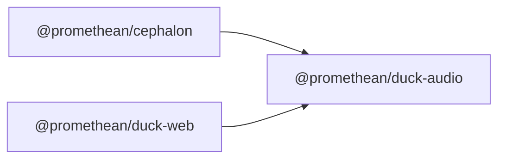

<!-- SYMPKG:PKG:BEGIN -->
# @promethean/duck-audio
**Folder:** `packages/duck-audio`  
**Version:** `0.0.1`  
**Domain:** `_root`

## Dependencies
- _None_
## Dependents
- [@promethean/cephalon](../cephalon/README.md)
- [@promethean/duck-web](../duck-web/README.md)
<!-- SYMPKG:PKG:END -->