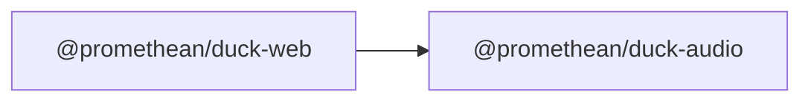

```
<!-- SYMPKG:PKG:BEGIN -->
```
# @promethean/duck-web
```
**Folder:** `packages/duck-web`
```
```
**Version:** `0.0.1`
```
```
**Domain:** `_root`
```

## Dependencies
- @promethean/duck-audio$../duck-audio/README.md
## Dependents
- _None_
```
<!-- SYMPKG:PKG:END -->
```