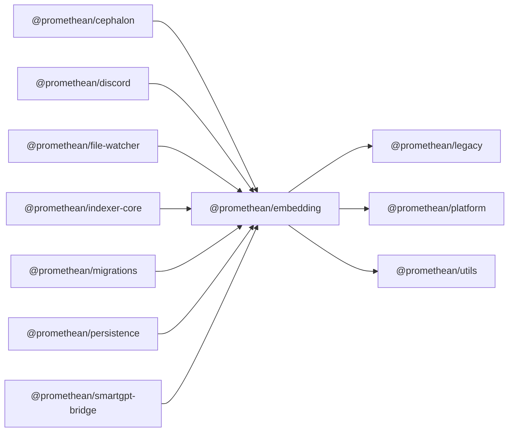

$$
<!-- SYMPKG:PKG:BEGIN -->
$$
# @promethean/embedding
$$
**Folder:** `packages/embedding`
$$
$$
**Version:** `0.0.1`
$$
$$
**Domain:** `_root`
$$

## Dependencies
- $@promethean/legacy$$../legacy/README.md$
- $@promethean/platform$$../platform/README.md$
- $@promethean/utils$$../utils/README.md$
## Dependents
- $@promethean/cephalon$$../cephalon/README.md$
- $@promethean/discord$$../discord/README.md$
- $@promethean/file-watcher$$../file-watcher/README.md$
- $@promethean/indexer-core$$../indexer-core/README.md$
- $@promethean/migrations$$../migrations/README.md$
- $@promethean/persistence$$../persistence/README.md$
- $@promethean/smartgpt-bridge$$../smartgpt-bridge/README.md$
$$
<!-- SYMPKG:PKG:END -->
$$