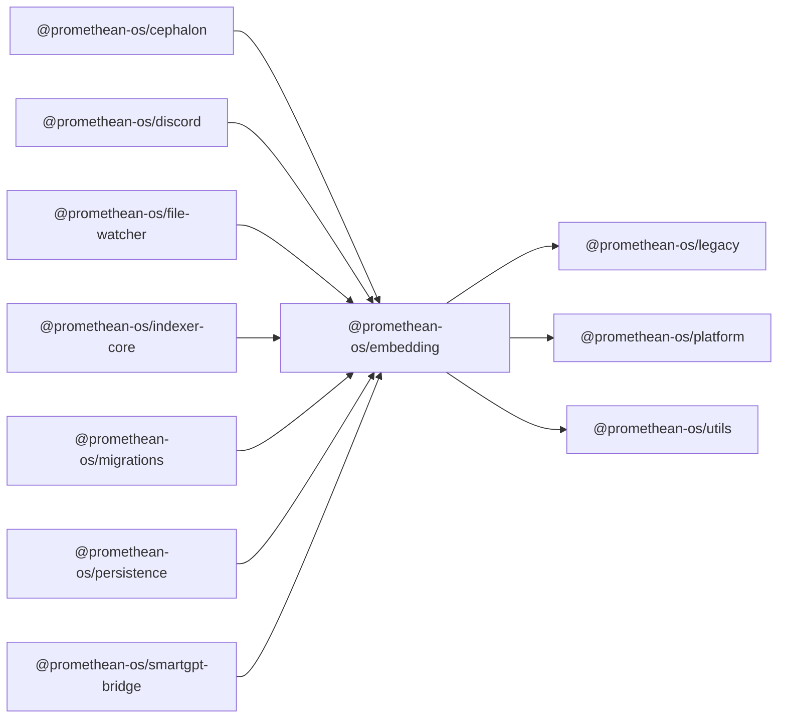

```
<!-- SYMPKG:PKG:BEGIN -->
```
# @promethean-os/embedding
```
**Folder:** `packages/embedding`
```
```
**Version:** `0.0.1`
```
```
**Domain:** `_root`
```

## Dependencies
- @promethean-os/legacy$../legacy/README.md
- @promethean-os/platform$../platform/README.md
- @promethean-os/utils$../utils/README.md
## Dependents
- @promethean-os/cephalon$../cephalon/README.md
- @promethean-os/discord$../discord/README.md
- @promethean-os/file-watcher$../file-watcher/README.md
- @promethean-os/indexer-core$../indexer-core/README.md
- @promethean-os/migrations$../migrations/README.md
- @promethean-os/persistence$../persistence/README.md
- @promethean-os/smartgpt-bridge$../smartgpt-bridge/README.md
```


## 📁 Implementation

### Core Files

- [6](../../../packages/embedding/src/6)

### View Source

- [GitHub](https://github.com/promethean-ai/promethean/tree/main/packages/embedding/src)
- [VS Code](vscode://file/packages/embedding/src)


## 📚 API Reference

### Interfaces

#### [- **attachment/index.ts**](../../../packages/embedding/src/[src/attachment/index.ts](../../../packages/embedding/src/attachment/index.ts) (224 lines)#L1)

#### [- **chroma.ts**](../../../packages/embedding/src/[src/chroma.ts](../../../packages/embedding/src/chroma.ts) (71 lines)#L1)

#### [- **embedder.ts**](../../../packages/embedding/src/[src/embedder.ts](../../../packages/embedding/src/embedder.ts) (68 lines)#L1)

#### [- **index.ts**](../../../packages/embedding/src/[src/index.ts](../../../packages/embedding/src/index.ts) (15 lines)#L1)

#### [- **remote.ts**](../../../packages/embedding/src/[src/remote.ts](../../../packages/embedding/src/remote.ts) (194 lines)#L1)

#### [- **tests/attachment.test.ts**](../../../packages/embedding/src/[src/tests/attachment.test.ts](../../../packages/embedding/src/tests/attachment.test.ts) (49 lines)#L1)

#### [- **tests/remote.test.ts**](../../../packages/embedding/src/[src/tests/remote.test.ts](../../../packages/embedding/src/tests/remote.test.ts) (26 lines)#L1)

#### [- **tests/smoke.test.ts**](../../../packages/embedding/src/[src/tests/smoke.test.ts](../../../packages/embedding/src/tests/smoke.test.ts) (6 lines)#L1)

#### [- **StateRef**](../../../packages/embedding/src/[StateRef](../../../packages/embedding/src/chroma.ts#L22)

#### [- **RemoteEmbeddingFunction**](../../../packages/embedding/src/[RemoteEmbeddingFunction](../../../packages/embedding/src/remote.ts#L117)

#### [- **embedAttachments()**](../../../packages/embedding/src/[embedAttachments()](../../../packages/embedding/src/attachment/index.ts#L191)

#### [- **makeChromaWrapper()**](../../../packages/embedding/src/[makeChromaWrapper()](../../../packages/embedding/src/chroma.ts#L46)

#### [- **makeDeterministicEmbedder()**](../../../packages/embedding/src/[makeDeterministicEmbedder()](../../../packages/embedding/src/embedder.ts#L15)

#### [- **assertDim()**](../../../packages/embedding/src/[assertDim()](../../../packages/embedding/src/embedder.ts#L56)

#### [- **setEmbeddingOverride()**](../../../packages/embedding/src/[setEmbeddingOverride()](../../../packages/embedding/src/remote.ts#L23)

#### [- **GitHub**](../../../packages/embedding/src/[View on GitHub](https#L1)

#### [- **VS Code**](../../../packages/embedding/src/[Open in VS Code](vscode#L1)

#### [**Location**](../../../packages/embedding/src/[StateRef](../../../packages/embedding/src/chroma.ts#L22)

#### [**Description**](../../../packages/embedding/src/Main class for stateref functionality.#L1)

#### [**File**](../../../packages/embedding/src/`src/chroma.ts`#L1)

#### [**Location**](../../../packages/embedding/src/[RemoteEmbeddingFunction](../../../packages/embedding/src/remote.ts#L117)

#### [**Description**](../../../packages/embedding/src/Main class for remoteembeddingfunction functionality.#L1)

#### [**File**](../../../packages/embedding/src/`src/remote.ts`#L1)

#### [**Location**](../../../packages/embedding/src/[embedAttachments()](../../../packages/embedding/src/attachment/index.ts#L191)

#### [**Description**](../../../packages/embedding/src/Key function for embedattachments operations.#L1)

#### [**File**](../../../packages/embedding/src/`src/attachment/index.ts`#L1)

#### [**Location**](../../../packages/embedding/src/[makeChromaWrapper()](../../../packages/embedding/src/chroma.ts#L46)

#### [**Description**](../../../packages/embedding/src/Key function for makechromawrapper operations.#L1)

#### [**File**](../../../packages/embedding/src/`src/chroma.ts`#L1)

#### [**Location**](../../../packages/embedding/src/[makeDeterministicEmbedder()](../../../packages/embedding/src/embedder.ts#L15)

#### [**Description**](../../../packages/embedding/src/Key function for makedeterministicembedder operations.#L1)

#### [**File**](../../../packages/embedding/src/`src/embedder.ts`#L1)

#### [**Location**](../../../packages/embedding/src/[assertDim()](../../../packages/embedding/src/embedder.ts#L56)

#### [**Description**](../../../packages/embedding/src/Key function for assertdim operations.#L1)

#### [**File**](../../../packages/embedding/src/`src/embedder.ts`#L1)

#### [**Location**](../../../packages/embedding/src/[setEmbeddingOverride()](../../../packages/embedding/src/remote.ts#L23)

#### [**Description**](../../../packages/embedding/src/Key function for setembeddingoverride operations.#L1)

#### [**File**](../../../packages/embedding/src/`src/remote.ts`#L1)

#### [Code links saved to](../../../packages/embedding/src//home/err/devel/promethean/tmp/embedding-code-links.json#L1)


---

*Enhanced with code links via SYMPKG documentation enhancer*