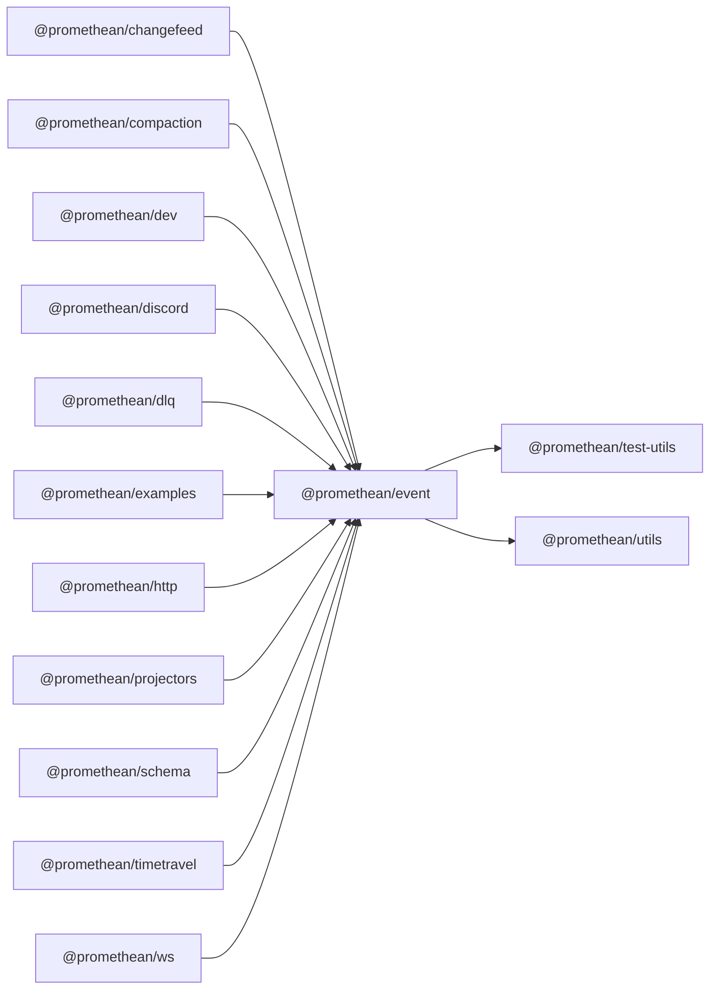

$$
<!-- SYMPKG:PKG:BEGIN -->
$$
# @promethean/event
$$
**Folder:** `packages/event`
$$
$$
**Version:** `0.0.1`
$$
$$
**Domain:** `_root`
$$

## Dependencies
- $@promethean/test-utils$$../test-utils/README.md$
- $@promethean/utils$$../utils/README.md$
## Dependents
- $@promethean/changefeed$$../changefeed/README.md$
- $@promethean/compaction$$../compaction/README.md$
- $@promethean/dev$$../dev/README.md$
- $@promethean/discord$$../discord/README.md$
- $@promethean/dlq$$../dlq/README.md$
- $@promethean/examples$$../examples/README.md$
- $@promethean/http$$../http/README.md$
- $@promethean/projectors$$../projectors/README.md$
- $@promethean/schema$$../schema/README.md$
- $@promethean/timetravel$$../timetravel/README.md$
- $@promethean/ws$$../ws/README.md$
$$
<!-- SYMPKG:PKG:END -->
$$