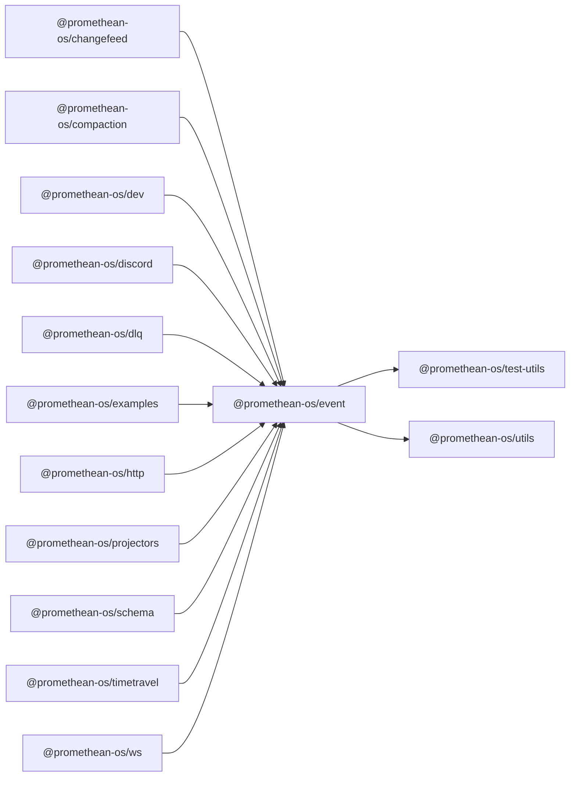

```
<!-- SYMPKG:PKG:BEGIN -->
```
# @promethean-os/event
```
**Folder:** `packages/event`
```
```
**Version:** `0.0.1`
```
```
**Domain:** `_root`
```

## Dependencies
- @promethean-os/test-utils$../test-utils/README.md
- @promethean-os/utils$../utils/README.md
## Dependents
- @promethean-os/changefeed$../changefeed/README.md
- @promethean-os/compaction$../compaction/README.md
- @promethean-os/dev$../dev/README.md
- @promethean-os/discord$../discord/README.md
- @promethean-os/dlq$../dlq/README.md
- @promethean-os/examples$../examples/README.md
- @promethean-os/http$../http/README.md
- @promethean-os/projectors$../projectors/README.md
- @promethean-os/schema$../schema/README.md
- @promethean-os/timetravel$../timetravel/README.md
- @promethean-os/ws$../ws/README.md
```


## 📁 Implementation

### Core Files

- [27](../../../packages/event/src/27)

### View Source

- [GitHub](https://github.com/promethean-ai/promethean/tree/main/packages/event/src)
- [VS Code](vscode://file/packages/event/src)


## 📚 API Reference

### Interfaces

#### [- **config.ts**](../../../packages/event/src/[src/config.ts](../../../packages/event/src/config.ts) (12 lines)#L1)

#### [- **event.bus.test.ts**](../../../packages/event/src/[src/event.bus.test.ts](../../../packages/event/src/event.bus.test.ts) (79 lines)#L1)

#### [- **example.ts**](../../../packages/event/src/[src/example.ts](../../../packages/event/src/example.ts) (35 lines)#L1)

#### [- **index.ts**](../../../packages/event/src/[src/index.ts](../../../packages/event/src/index.ts) (7 lines)#L1)

#### [- **interfaces.ts**](../../../packages/event/src/[src/interfaces.ts](../../../packages/event/src/interfaces.ts) (70 lines)#L1)

#### [- **memory-functional.ts**](../../../packages/event/src/[src/memory-functional.ts](../../../packages/event/src/memory-functional.ts) (350 lines)#L1)

#### [- **memory.ts**](../../../packages/event/src/[src/memory.ts](../../../packages/event/src/memory.ts) (83 lines)#L1)

#### [- **mongo.ts**](../../../packages/event/src/[src/mongo.ts](../../../packages/event/src/mongo.ts) (68 lines)#L1)

#### [- **outbox.ts**](../../../packages/event/src/[src/outbox.ts](../../../packages/event/src/outbox.ts) (26 lines)#L1)

#### [- **topics.ts**](../../../packages/event/src/[src/topics.ts](../../../packages/event/src/topics.ts) (6 lines)#L1)

#### [- **types.ts**](../../../packages/event/src/[src/types.ts](../../../packages/event/src/types.ts) (94 lines)#L1)

#### [- **InMemoryStore**](../../../packages/event/src/[InMemoryStore](../../../packages/event/src/memory-functional.ts#L304)

#### [- **InMemoryCursorStore**](../../../packages/event/src/[InMemoryCursorStore](../../../packages/event/src/memory-functional.ts#L335)

#### [- **is**](../../../packages/event/src/[is](../../../packages/event/src/memory.ts#L29)

#### [- **InMemoryEventBus**](../../../packages/event/src/[InMemoryEventBus](../../../packages/event/src/memory.ts#L31)

#### [- **MongoEventStore**](../../../packages/event/src/[MongoEventStore](../../../packages/event/src/mongo.ts#L6)

#### [- **Topics()**](../../../packages/event/src/[Topics()](../../../packages/event/src/config.ts#L7)

#### [- **createInMemoryEventBusState()**](../../../packages/event/src/[createInMemoryEventBusState()](../../../packages/event/src/memory-functional.ts#L48)

#### [- **ensureCursor()**](../../../packages/event/src/[ensureCursor()](../../../packages/event/src/memory-functional.ts#L56)

#### [- **publishEvent()**](../../../packages/event/src/[publishEvent()](../../../packages/event/src/memory-functional.ts#L88)

#### [- **subscribeToTopic()**](../../../packages/event/src/[subscribeToTopic()](../../../packages/event/src/memory-functional.ts#L127)

#### [- **GitHub**](../../../packages/event/src/[View on GitHub](https#L1)

#### [- **VS Code**](../../../packages/event/src/[Open in VS Code](vscode#L1)

#### [**Location**](../../../packages/event/src/[InMemoryStore](../../../packages/event/src/memory-functional.ts#L304)

#### [**Description**](../../../packages/event/src/Main class for inmemorystore functionality.#L1)

#### [**File**](../../../packages/event/src/`src/memory-functional.ts`#L1)

#### [**Location**](../../../packages/event/src/[InMemoryCursorStore](../../../packages/event/src/memory-functional.ts#L335)

#### [**Description**](../../../packages/event/src/Main class for inmemorycursorstore functionality.#L1)

#### [**File**](../../../packages/event/src/`src/memory-functional.ts`#L1)

#### [**Location**](../../../packages/event/src/[is](../../../packages/event/src/memory.ts#L29)

#### [**Description**](../../../packages/event/src/Main class for is functionality.#L1)

#### [**File**](../../../packages/event/src/`src/memory.ts`#L1)

#### [**Location**](../../../packages/event/src/[InMemoryEventBus](../../../packages/event/src/memory.ts#L31)

#### [**Description**](../../../packages/event/src/Main class for inmemoryeventbus functionality.#L1)

#### [**File**](../../../packages/event/src/`src/memory.ts`#L1)

#### [**Location**](../../../packages/event/src/[MongoEventStore](../../../packages/event/src/mongo.ts#L6)

#### [**Description**](../../../packages/event/src/Main class for mongoeventstore functionality.#L1)

#### [**File**](../../../packages/event/src/`src/mongo.ts`#L1)

#### [**Location**](../../../packages/event/src/[MongoCursorStore](../../../packages/event/src/mongo.ts#L46)

#### [**Description**](../../../packages/event/src/Main class for mongocursorstore functionality.#L1)

#### [**File**](../../../packages/event/src/`src/mongo.ts`#L1)

#### [**Location**](../../../packages/event/src/[MongoEventBus](../../../packages/event/src/mongo.ts#L67)

#### [**Description**](../../../packages/event/src/Main class for mongoeventbus functionality.#L1)

#### [**File**](../../../packages/event/src/`src/mongo.ts`#L1)

#### [**Location**](../../../packages/event/src/[Topics()](../../../packages/event/src/config.ts#L7)

#### [**Description**](../../../packages/event/src/Key function for topics operations.#L1)

#### [**File**](../../../packages/event/src/`src/config.ts`#L1)

#### [**Location**](../../../packages/event/src/[createInMemoryEventBusState()](../../../packages/event/src/memory-functional.ts#L48)

#### [**Description**](../../../packages/event/src/Key function for createinmemoryeventbusstate operations.#L1)

#### [**File**](../../../packages/event/src/`src/memory-functional.ts`#L1)

#### [**Location**](../../../packages/event/src/[ensureCursor()](../../../packages/event/src/memory-functional.ts#L56)

#### [**Description**](../../../packages/event/src/Key function for ensurecursor operations.#L1)

#### [**File**](../../../packages/event/src/`src/memory-functional.ts`#L1)

#### [**Location**](../../../packages/event/src/[publishEvent()](../../../packages/event/src/memory-functional.ts#L88)

#### [**Description**](../../../packages/event/src/Key function for publishevent operations.#L1)

#### [**File**](../../../packages/event/src/`src/memory-functional.ts`#L1)

#### [**Location**](../../../packages/event/src/[subscribeToTopic()](../../../packages/event/src/memory-functional.ts#L127)

#### [**Description**](../../../packages/event/src/Key function for subscribetotopic operations.#L1)

#### [**File**](../../../packages/event/src/`src/memory-functional.ts`#L1)

#### [**Location**](../../../packages/event/src/[acknowledgeEvent()](../../../packages/event/src/memory-functional.ts#L173)

#### [**Description**](../../../packages/event/src/Key function for acknowledgeevent operations.#L1)

#### [**File**](../../../packages/event/src/`src/memory-functional.ts`#L1)

#### [**Location**](../../../packages/event/src/[negativeAcknowledgeEvent()](../../../packages/event/src/memory-functional.ts#L195)

#### [**Description**](../../../packages/event/src/Key function for negativeacknowledgeevent operations.#L1)

#### [**File**](../../../packages/event/src/`src/memory-functional.ts`#L1)

#### [**Location**](../../../packages/event/src/[getCursor()](../../../packages/event/src/memory-functional.ts#L216)

#### [**Description**](../../../packages/event/src/Key function for getcursor operations.#L1)

#### [**File**](../../../packages/event/src/`src/memory-functional.ts`#L1)

#### [**Location**](../../../packages/event/src/[setCursor()](../../../packages/event/src/memory-functional.ts#L225)

#### [**Description**](../../../packages/event/src/Key function for setcursor operations.#L1)

#### [**File**](../../../packages/event/src/`src/memory-functional.ts`#L1)

#### [**Location**](../../../packages/event/src/[runOutboxDrainer()](../../../packages/event/src/outbox.ts#L9)

#### [**Description**](../../../packages/event/src/Key function for runoutboxdrainer operations.#L1)

#### [**File**](../../../packages/event/src/`src/outbox.ts`#L1)

#### [**Location**](../../../packages/event/src/[Topics()](../../../packages/event/src/topics.ts#L1)

#### [**Description**](../../../packages/event/src/Key function for topics operations.#L1)

#### [**File**](../../../packages/event/src/`src/topics.ts`#L1)

#### [**Location**](../../../packages/event/src/[TopicConfig](../../../packages/event/src/config.ts#L1)

#### [**Description**](../../../packages/event/src/Type definition for topicconfig.#L1)

#### [**File**](../../../packages/event/src/`src/config.ts`#L1)

#### [**Location**](../../../packages/event/src/[EventFilter](../../../packages/event/src/interfaces.ts#L7)

#### [**Description**](../../../packages/event/src/Type definition for eventfilter.#L1)

#### [**File**](../../../packages/event/src/`src/interfaces.ts`#L1)

#### [**Location**](../../../packages/event/src/[EventSubscription](../../../packages/event/src/interfaces.ts#L17)

#### [**Description**](../../../packages/event/src/Type definition for eventsubscription.#L1)

#### [**File**](../../../packages/event/src/`src/interfaces.ts`#L1)

#### [**Location**](../../../packages/event/src/[EventSubscriptionOptions](../../../packages/event/src/interfaces.ts#L27)

#### [**Description**](../../../packages/event/src/Type definition for eventsubscriptionoptions.#L1)

#### [**File**](../../../packages/event/src/`src/interfaces.ts`#L1)

#### [**Location**](../../../packages/event/src/[EventDeliveryContext](../../../packages/event/src/interfaces.ts#L39)

#### [**Description**](../../../packages/event/src/Type definition for eventdeliverycontext.#L1)

#### [**File**](../../../packages/event/src/`src/interfaces.ts`#L1)

#### [**Location**](../../../packages/event/src/[EventCursor](../../../packages/event/src/interfaces.ts#L47)

#### [**Description**](../../../packages/event/src/Type definition for eventcursor.#L1)

#### [**File**](../../../packages/event/src/`src/interfaces.ts`#L1)

#### [**Location**](../../../packages/event/src/[EventStoreStats](../../../packages/event/src/interfaces.ts#L54)

#### [**Description**](../../../packages/event/src/Type definition for eventstorestats.#L1)

#### [**File**](../../../packages/event/src/`src/interfaces.ts`#L1)

#### [**Location**](../../../packages/event/src/[EventBusMetrics](../../../packages/event/src/interfaces.ts#L62)

#### [**Description**](../../../packages/event/src/Type definition for eventbusmetrics.#L1)

#### [**File**](../../../packages/event/src/`src/interfaces.ts`#L1)

#### [**Location**](../../../packages/event/src/[InMemoryEventBusState](../../../packages/event/src/memory-functional.ts#L25)

#### [**Description**](../../../packages/event/src/Type definition for inmemoryeventbusstate.#L1)

#### [**File**](../../../packages/event/src/`src/memory-functional.ts`#L1)

#### [**Location**](../../../packages/event/src/[Subscription](../../../packages/event/src/memory-functional.ts#L33)

#### [**Description**](../../../packages/event/src/Type definition for subscription.#L1)

#### [**File**](../../../packages/event/src/`src/memory-functional.ts`#L1)

#### [Code links saved to](../../../packages/event/src//home/err/devel/promethean/tmp/event-code-links.json#L1)


---

*Enhanced with code links via SYMPKG documentation enhancer*